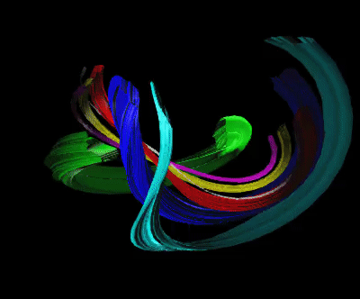

# Geometric quantizer
Quantize the geometry instead of geometrizing the quantum!




This project aims to help with Eric Weinstein's Graph, Wall, Tome (GWT) project.

## Requirements
CSV,
DataFrames,
StatsBase,
Makie.

## Installation
You can install this package by first downloading the code and then navigating to its directory.
In the code directory use:

```julia-repl
julia> ]
pkg> activate .
```

Finally hit backspace on your keyboard to get back to the `julia>` prompt.

## Usage
Please orient yourself through [The Unofficial Portal Wiki](https://theportal.wiki/wiki/Graph,_Wall,_Tome)! The ideal state would be a tool that you could use for visualizing and inspecting the equations on the famous wall, located at [Stony Brook University](http://www.math.stonybrook.edu/~tony/scgp/wall-story/wall-story.html). Also, join our unofficial community of The Portal podcast on Discord: [Invitation Link Here!](https://discord.gg/U8QQFc2)

## Status
- Complex numbers [Julia already supports complex numbers.]
- Spheres [we have stereographic projections.]
- Quaternions [3D rotations added.]
- The Hopf fibration [done.]
- Planet Hopf or something similar to let the viewer know where they are. [done.]
- Documentation [TODO]
- Maxwell's equations [TODO]
