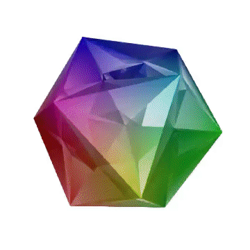
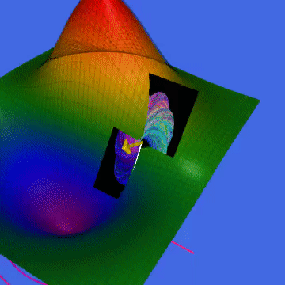

# Quantize the Geometry!





This project helps with Eric Weinstein's the Graph-Wall-Tome (GWT) project. Watch visual models on this [channel].

## Requirements
- AbstractPlotting
- FileIO
- GLMakie
- GeometryBasics
- ImageMagick
- Makie
- Observables
- WAV

## Installation
You can install Porta by running this (in the REPL):

```julia-repl
]add Porta
```
or,
```julia-repl
Pkg.add("Porta")
```

## Usage
For client-side code read the tests, and for examples on how to build please check out the models directory.

## Status
- Logic [Doing]
- Set Theory [TODO]
- Topology [TODO]
- Topological Manifolds [TODO]
- Differentiable Manifolds [TODO]
- Bundles [TODO]
- Geometry: Symplectic, Metric [TODO]
- Documentation [TODO]
- Geometric Unity [TODO]

## References
- Physics and Geometry, Edward [Witten] (1986)
- The iconic [wall] of Stony Brook University
- The Road to Reality, Sir Roger [Penrose] (2004)
- A [Portal] Special Presentation- Geometric Unity: A First Look

[channel]: (https://www.youtube.com/channel/UCY8FW_kvEfGDj5i5j_rkaqA)
[Witten]: (https://cds.cern.ch/record/181783/files/cer-000093203.pdf)
[wall]: (http://www.math.stonybrook.edu/~tony/scgp/wall-story/wall-story.html)
[Penrose]: (https://www.amazon.com/Road-Reality-Complete-Guide-Universe/dp/0679776311)
[Portal]: (https://youtu.be/Z7rd04KzLcg)
