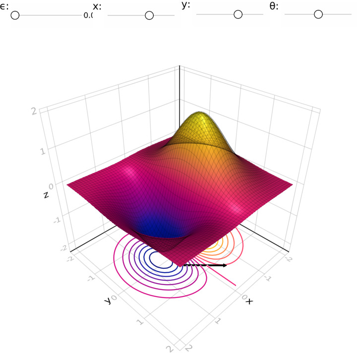

# Build Visual Models




This project aims to help with Eric Weinstein's Graph, Wall, Tome (GWT) project. Watch some of the visual models on [YouTube](https://www.youtube.com/channel/UCY8FW_kvEfGDj5i5j_rkaqA).

## Requirements
- LinearAlgebra
- CSV
- DataFrames
- StatsBase
- Makie
- Combinatorics
- AbstractAlgebra

## Installation
You can install Porta by running this (in the REPL):

```julia-repl
]add Porta
```
or,
```julia-repl
Pkg.add("Porta")
```

## Usage
Please orient yourself through [The Portal - Unofficial Wiki](https://theportal.wiki/wiki/Graph,_Wall,_Tome)! The ideal state would be a tool that you could use for visualizing and inspecting the equations on the famous wall, located at [Stony Brook University](http://www.math.stonybrook.edu/~tony/scgp/wall-story/wall-story.html). Also, click and navigate through the story of what will be in the project: [Interactive Wall](https://dev.theportal.dev/wall/).

## Status
- Complex numbers [Julia already supports complex numbers.]
- Spheres [we have stereographic projections.]
- Quaternions [3D rotations added.]
- The Hopf fibration [done.]
- Planet Hopf or something similar to let the viewer know where they are. [done.]
- SU(2) linear algebra [TODO]
- 7-manifolds [TODO]
- Documentation [TODO]
- Maxwell's equations [TODO]
