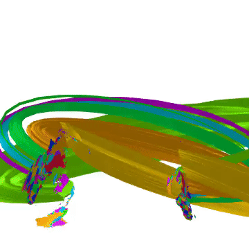

# Quantize the Geometry!



This project helps with Eric Weinstein's the Graph-Wall-Tome (GWT) project. Watch visual models on this [channel][1].

## Requirements
- AbstractPlotting
- CSV
- DataFrames
- FileIO
- GLMakie
- GeometryBasics
- ImageMagick
- Makie
- Observables
- WAV


## Installation
You can install Porta by running this (in the REPL):

```julia-repl
]add Porta
```
or,
```julia-repl
Pkg.add("Porta")
```

## Usage
For client-side code read the tests, and for examples on how to build please check out the models directory. See [Planet Hopf](../blob/master/models/drorbarnatan2010.jl) as an example!

## Status
- Logic [Doing]
- Set Theory [TODO]
- Topology [TODO]
- Topological Manifolds [TODO]
- Differentiable Manifolds [TODO]
- Bundles [TODO]
- Geometry: Symplectic, Metric [TODO]
- Documentation [TODO]
- Geometric Unity [TODO]

## References
- Physics and Geometry, [Edward Witten][2] (1986)
- The iconic [wall][3] of Stony Brook University
- [The Road to Reality][4], Sir Roger Penrose (2004)
- A [Portal][5] Special Presentation- Geometric Unity: A First Look
- [Planet Hopf][6], Dror Bar-Natan (2010)

[1]: https://www.youtube.com/channel/UCY8FW_kvEfGDj5i5j_rkaqA
[2]: models/drorbarnatan2010.jl
[2]: https://cds.cern.ch/record/181783/files/cer-000093203.pdf
[3]: http://www.math.stonybrook.edu/~tony/scgp/wall-story/wall-story.html
[4]: https://www.amazon.com/Road-Reality-Complete-Guide-Universe/dp/0679776311
[5]: https://youtu.be/Z7rd04KzLcg
[6]: http://drorbn.net/AcademicPensieve/Projects/PlanetHopf/
