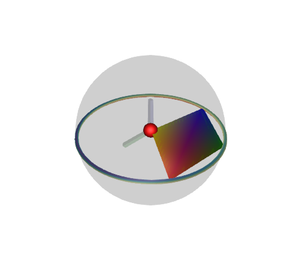

# Geometrizer
Geometrize the quantum instead of quantizing the geometry!

This project aims to help with Eric Weinstein's Graph, Wall, Tome (GWT) project. Please orient yourself through [The Portal](https://theportal.wiki/wiki/Main_Page)! The ideal state would be a tool that you can use for visualizing and inspecting the equations on the wall, located at [Stony Brook University](http://www.math.stonybrook.edu/~tony/scgp/wall-story/wall-story.html). Also, join our unofficial community of The Portl podcast: [Invitation link here!](https://discord.gg/U8QQFc2)

## Status
- Complex numbers [Julia already supports complex numbers.]
- Spheres [we have stereographic projections.]
- Quaternions [using ReferenceFrameRotations for now.]
- The Hopf fibration [done.]
- Maxwell's equations [TODO]
- Planet Hopf or something similar to let the viewer know where they are. [TODO]
- Documentation [TODO]
