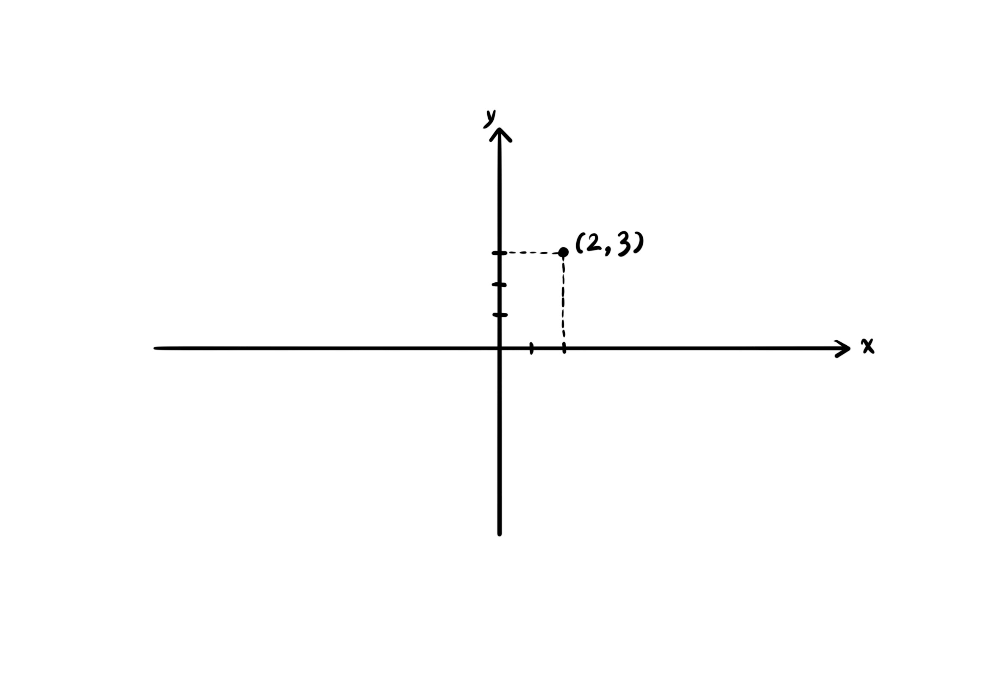
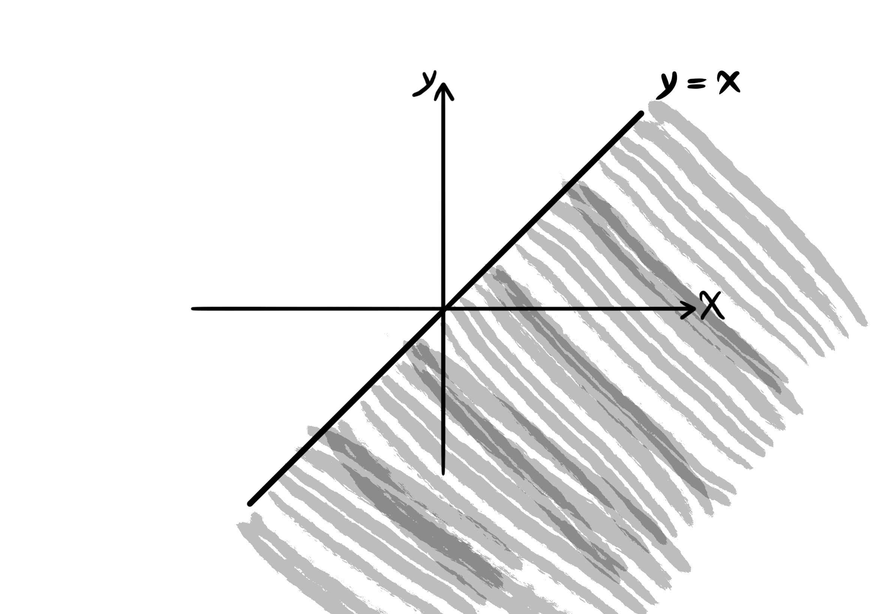
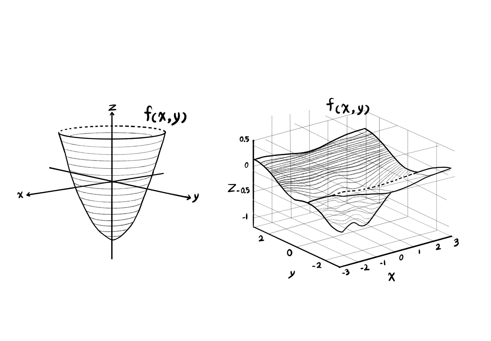
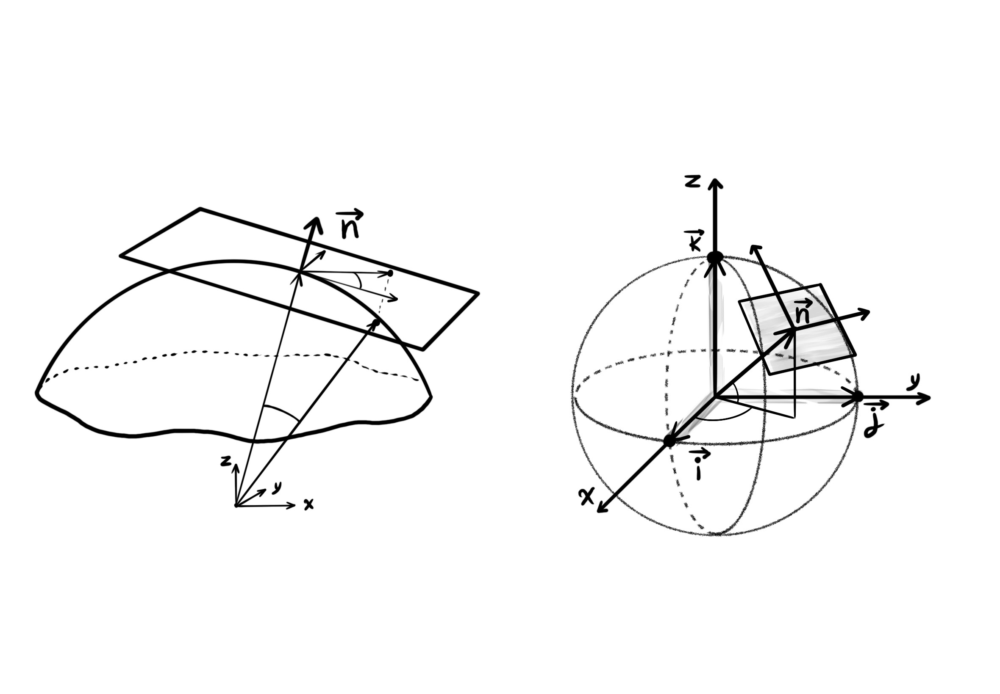
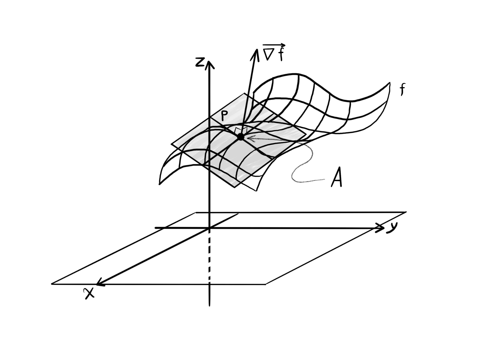
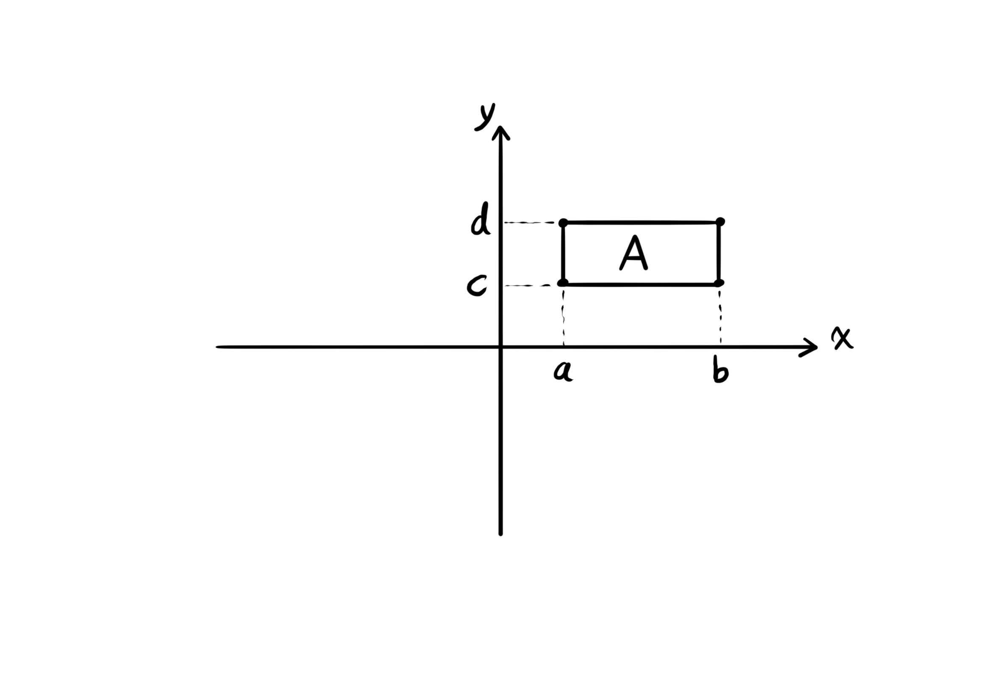
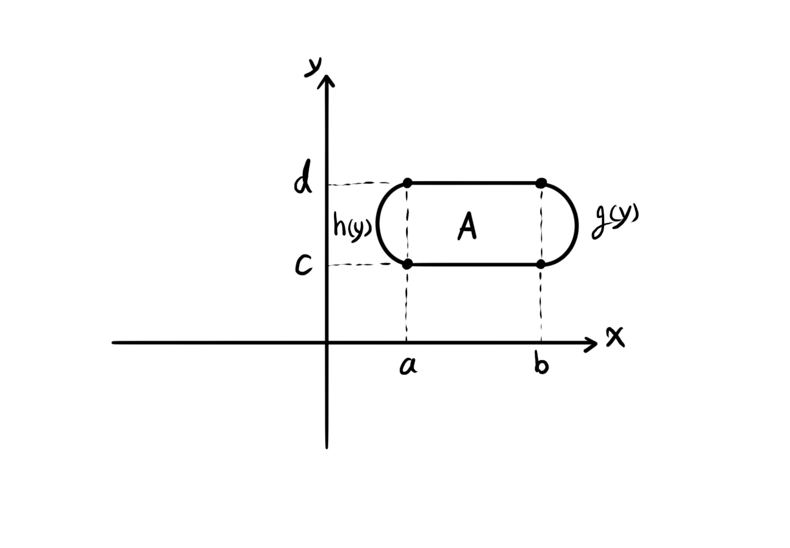

```@meta
Description = "The Maxwell field as gauge curvature"
```


# Multivariable Calculus


```@raw html
<div dir = "rtl">
<h1>

توابع چندمتغیره

</h1>
</div>
```

# Multivariable Functions

In General Mathematics 1, we were introduced to one-variable functions ``y = f(x)``, which had only one independent variable as input, ``x``. But in reality most of the times, we are faced with functions that have more than one independent variable. These functions are called multivariable functions.

``y = f(x)`` is a univariate function.

The function sends the input to the output, ``x \mapsto y``.

## Notation

- A two-variable function: ``z = f(x, y)``.

- A three-variable function is denoted by ``w = f(x, y, z)``.

- An n-variable function: ``f(x_1, x_2, ..., x_n)``.

A few simple examples that show the relevance of multivariable functions.

### Example

The area of a rectangle: ``f(x, y) = xy``.

The volume of a cuboid: ``V(x, y, z) = xyz``.

The volume of a cylinder: ``V(r, h) = \pi r^2 h``.


### Example

The average of the ``n`` numbers ``x_1, x_2, ..., x_n``:

``f(x_1, x_2, ..., x_n) = \frac{1}{n} \sum_{i = 1}^n x_i``.

## The Domain of Multivariable Functions

The domain of the two-variable function ``f(x, y)`` is either a point in the ``x``-``y`` plane, or part of, or the entire ``x``-``y``coordinate system ``\mathbb{R}^2``.



### Examples

Find the domain of the following functions and then plot it as a shape.

*Example A.* ``f(x, y) = 2x^3 y + x^2 y^2 - y + 5``

``D_f = \{ (x, y) | x \in \mathbb{R}, y \in \mathbb{R} \} = \mathbb{R}^2``.


*Example B.* ``f(x, y) = \frac{1}{x - y}``

``D_f = \{ (x, y) | x, y \in \mathbb{R}, x - y \neq 0 \} = \{ (x, y) | x \neq y \}``.

The whole plane, without the line ``y = x``.


*Example C.* ``f(x, y) = \sqrt{x - y}``

``D_f = \{ (x, y) | x, y \in \mathbb{R}, x - y \geq 0 \} = \{ (x, y) | x \geq y \}``.

On and under the line `` y = x``.



*Example D.* ``f(x, y) = \frac{\sqrt{y - 3}}{\sqrt{5 - x}}``

``D_f = \{ (x, y) | x, y \in \mathbb{R}, y - 3 \geq 0, 5 - x > 0 \} = \{ (x, y) | y \geq 3, x < 5 \}``.


*Example E.* ``f(x, y) = \frac{\sqrt{y + 1}}{\sqrt[4]{2 - |x|}}``

``D_f = \{ (x, y) | x, y \in \mathbb{R},  y + 1 \geq 0, 2 - |x| > 0 \} = \{ (x, y) | y \geq -1, -2 < x < 2 \}``.


The lines ``x = 2`` and ``x = -2`` are excluded from the domain of the function ``f(x, y)``.

The shape of two-variable functions are surfaces that are embedded in three-dimensional plots.


``z = f(x, y)``.

The triple ``(x, y, z)``.

Since drawing three-dimensional shapes is time consuming, we just make a few examples of surfaces.



And by induction in this way, the domain of the three-variable function ``w = f(x, y, z)`` is three-dimensional, and the plot of its shape is embedded in the four-dimensional space.

# Partial Derivatives

``y = f(x)``.

``y = x^3 - 2x^5 + sin(x)``.

``y^\prime = f^\prime(x)``.

``y^\prime = 3x^2 - 10x^4 + cos(x)``.

``f^\prime(x) = \lim_{h \to 0} \frac{f(x + h) - f(x)}{h}``.

``f(x, y)``.

When we want to find the derivative of a multivariable function, we must specify with respect to which variable the derivative is to be applied. Other than the one variable, with respect to which the derivative is computed, the rest of the variables are treated as constant values.

The derivative of the function ``f(x, y)`` with respect to ``x`` is denoted by ``\frac{\partial f}{\partial x}`` or ``{f^\prime}_x``.
The derivative of the function ``f(x, y)`` with respect to ``y`` is denoted by ``\frac{\partial f}{\partial y}`` or ``{f^\prime}_y``.

### Example

If the function ``f(x, y) = -3x^4 y^2 + x^3 y - y^3 + xy`` is defined, then calculate the partial derivative of ``f(x, y)`` with respect to ``x`` and the partial derivative of ``f(x, y)`` with respect to ``y``.

- ``\frac{\partial f}{\partial x} = -12x^3 y^2 + 3x^2 y + y``.

- ``\frac{\partial f}{\partial y} = -6x^4 y + x^3 -3y^2 + x``.

### Example

If the function ``f(x, y, z) = x^5 y^2 z^3 + y x^y - sin(y z^3)`` is defined, then take the partial derivative of ``f(x, y)`` with respect to ``x``, the partial derivative of ``f(x, y)`` with respect to ``y``, and the partial derivative of ``f(x, y)`` with respect to ``z``.

- ``\frac{\partial f}{\partial x} = 5x^4 y^2 z^3 + y x^{y -1}``.

- ``\frac{\partial f}{\partial y} = 2 x^5 y z^3 + x^y + y x^y \ ln(x) - z^3 \ cos(y z^3)``.

- ``\frac{\partial f}{\partial z} = 3z^2 x^5 y^2 - 3y z^2 \ cos(y z^3)``.

*Reminder:* ``(a^u)^\prime = u^\prime a^u ln(a)``.

## Higher Order Partial Derivatives

For a two-variable function ``f(x, y)``, higher order partial derivatives are as follows:

- ``\frac{\partial^2 f}{\partial x^2} = \frac{\partial}{\partial x} (\frac{\partial f}{\partial x})`` or ``{f^\prime}_{xx}``.

- ``\frac{\partial^2 f}{\partial y^2} = \frac{\partial}{\partial y} (\frac{\partial f}{\partial y})`` or ``{f^\prime}_{yy}``.

- ``\frac{\partial^2 f}{\partial x \partial y} = \frac{\partial}{\partial x} (\frac{\partial f}{\partial y})`` or ``{f^\prime}_{yx}``.

- ``\frac{\partial^2 f}{\partial y \partial x} = \frac{\partial}{\partial y} (\frac{\partial f}{\partial x})`` or ``{f^\prime}_{xy}``.

### Exercise

With the given function ``f(x, y) = ln(x^4 y^2) - y``, find the second partial derivative of ``f(x, y)``: **(a)** both with respect to ``x``, **(b)** both with respect to ``y``, **(c)** first taken with respect to ``y`` and then with respect to ``x``, and **(d)** with respect to first ``x`` and then ``y``.

- ``\frac{\partial^2 f}{\partial x^2} = \frac{\partial}{\partial x}(\frac{4x^3 y^2}{x^4 y^2}) = \frac{\partial}{\partial x}(\frac{4}{x}) = \frac{-4}{x^2}``.

- ``\frac{\partial^2 f}{\partial y^2} = \frac{\partial}{\partial y}(\frac{2x^4 y}{x^4 y^2} - 1) = \frac{\partial}{\partial y}(\frac{2}{y} - 1) = \frac{\partial}{\partial y}(2y^{-1}) = -2y^{-2} = \frac{-2}{y^2}``.

- ``\frac{\partial^2 f}{\partial x \partial y} = \frac{\partial}{\partial x}(\frac{2y x^4}{x^4 y^2} - 1) = \frac{\partial}{\partial x}(\frac{2}{y} - 1) = 0``.

- ``\frac{\partial^2 f}{\partial y \partial x} = \frac{\partial}{\partial y}(\frac{4x^3 y^2}{x^4 y^2}) = \frac{\partial}{\partial y}(\frac{4}{x}) = 0``.

*Reminder:* ``(ln(u))^\prime = \frac{u^\prime}{u}``.

## The Chain Rule

There are a few states for the chain rule:

- The first state. Suppose the function ``f(x, y)`` is defined. The variables ``x`` and ``y`` are on their own functions of other variables, such as ``t``. In this state:

``\frac{\partial f}{\partial t} = \frac{\partial f}{\partial x} \frac{\partial x}{\partial t} + \frac{\partial f}{\partial y} \frac{\partial y}{\partial t}``.

### Example

If ``f(x, y) = x^3 y - y^2 x + 4x`` and ``x = sin(t)`` and ``y = 2e^t``, then find ``\frac{\partial f}{\partial t}``.

``\frac{\partial f}{\partial t} = (3x^2 y - y^2 + 4) cos(t) + 2(x^3 - 2yx) e^t``.

*Reminder:* ``(e^u)^\prime = u^\prime e^u``.

- The second state. If we have ``f(x, y, z)`` a three-variable function and ``x, y, z`` three functions of ``t``, then we have:

``\frac{\partial f}{\partial t} = \frac{\partial f}{\partial x} \frac{\partial x}{\partial t} + \frac{\partial f}{\partial y} \frac{\partial y}{\partial t} + \frac{\partial f}{\partial z} \frac{\partial z}{\partial t}``.

### Example

The three-variable function ``f(x, y, z) = x y^3 - x^2 z^3 + ln(x y)`` is given,  where ``x = t^2``, ``y = cos(4t)`` and ``z = \sqrt{t}``. Find the partial derivative of ``f`` with respect to ``t``.

``\frac{\partial f}{\partial t} = (y^3 - 2x z^3 + \frac{y}{x y}) (2t) + (3y^2 x + \frac{x}{x y})(-4sin(4t)) + (-3z^2 x^2)(\frac{1}{2 \sqrt{t}})``.

*Reminder:* ``(ln(u))^\prime = \frac{u^\prime}{u}``.

- The state of the third kind. If ``f(x, y)`` is a two-variable function, and ``x`` and ``y`` are two-variable functions, for example functions of independent variables ``r`` and ``s``, then:

1. ``\frac{\partial f}{\partial r} = \frac{\partial f}{\partial x} \frac{\partial x}{\partial r} + \frac{\partial f}{\partial y} \frac{\partial y}{\partial r}``.

2. ``\frac{\partial f}{\partial s} = \frac{\partial f}{\partial x} \frac{\partial x}{\partial s} + \frac{\partial f}{\partial y} \frac{\partial y}{\partial s}``.

### Example

The partial derivative of ``f(x, y) = 3x^2 y - y^2 x + x y + y`` with respect to ``s``, where ``y = r + s`` and ``x = s^r``:

``\frac{\partial f}{\partial s} = (6x y - y^2 + y) (r s^{r - 1}) + (3x^2 - 2y x + x + 1)(1)``.

The partial derivative of the function ``f(x, y)`` with respect to ``r``:

``\frac{\partial f}{\partial r} = (6x y - y^2 + y) (s^r ln(s)) + (3x^2 - 2y x + x + 1)(1)``.

*Reminder:* ``\frac{d}{dx} a^x = \frac{d}{dx} e^{x ln(a)} = e^{x ln(a)} (\frac{d}{dx} x ln(a)) = e^{x ln(a)} ln(a) = a^x ln(a)``.

# The Applications of Partial Derivatives

## Determining the Maximum and Minimum Values of Multivariable Functions

The steps for determining the extremum points of a twovariable function ``f(x, y)``:

1. Solve the system of equations that is formed with ``\frac{\partial f}{\partial x} = 0`` and ``\frac{\partial f}{\partial y} = 0``. Suppose that the solution of the system is equal to ``(x_0, y_0)``.

2. Compute the equation ``\Delta(x, y) = {f^\prime}_{xx} {f^\prime}_{yy} - ({f^\prime}_{xy})^2``.

3. Calculate these two values: ``\Delta(x_0, y_0)`` and ``{f^\prime}_{xx}(x_0, y_0)``.

4. If ``\Delta(x_0, y_0) > 0`` and ``{f^\prime}_{xx}(x_0, y_0) < 0``, then the point ``(x_0, y_0)`` is a local maximum.

5. If ``\Delta(x_0, y_0) > 0`` and ``{f^\prime}_{xx}(x_0, y_0) > 0``, then the point ``(x_0, y_0)`` is a local minimum.

6. If ``\Delta(x_0, y_0) < 0``, then the point ``(x_0, y_0)`` is a saddle point.

7. If ``\Delta(x_0, y_0) = 0``, then this test does not succeed at determining the type of the point ``(x_0, y_0)``.


### Example

Find the local extremum points of the function ``f(x, y) = 2x y - 5y^2 + 4x - 2x^2 + 4y - 4``.

First, set the partial derivatives of the function ``f`` equal to zero:

``\left\{ \begin{array}{l} \frac{\partial f}{\partial x} = 0 &\\ \frac{\partial f}{\partial y} = 0 \end{array} \right.``

Next, we have:

``\left\{ \begin{array}{l} 2y - 4x = -4 &\\ 2x - 10y = -4 \end{array} \right.``

Multiplying the equation ``2x - 10y = -4`` by ``2`` results in:

``\left\{ \begin{array}{l} 2y - 4x = -4 &\\ 4x - 20y = -8 \end{array} \right.``

Then, summing the two equations in the system gives us: ``-18y = -12``. Finally, we have the value of ``y = \frac{-12}{-18} = \frac{2}{3}``. Subsequently, we solve for ``x`` by substituting the numerical value of ``y`` in the equation ``2(\frac{2}{3}) - 4x = -4``, which siplifies to the equation ``-4x = -4 - \frac{4}{3} = \frac{-16}{3}``. Then, we have ``x = \frac{16}{12} = \frac{4}{3}``. This gives the extremum point ``(x_0, y_0) = (\frac{4}{3}, \frac{2}{3})``. Now, we have to determine the type of ``(\frac{4}{3}, \frac{2}{3})``.

A few partial derivatives are evaluated at the point: ``{f^\prime}_{xx}(\frac{4}{3}, \frac{2}{3}) = -4``, ``{f^\prime}_{yy}(\frac{4}{3}, \frac{2}{3}) = -10`` and ``{f^\prime}_{xy}(\frac{4}{3}, \frac{2}{3}) = 2``.

``\Delta(\frac{4}{3}, \frac{2}{3}) = (-4) (-10) - 2^2 = 40 - 4 = 36``.

Having computed the values of ``{f^\prime}_{xx}(\frac{4}{3}, \frac{2}{3})`` and ``\Delta(\frac{4}{3}, \frac{2}{3})`` we can examine the type of the point ``(\frac{4}{3}, \frac{2}{3})`` in the end:

``\Delta(\frac{4}{3}, \frac{2}{3}) > 0`` and ``{f^\prime}_{xx}(\frac{4}{3}, \frac{2}{3}) < 0``, therefore the point ``(\frac{4}{3}, \frac{2}{3})`` is a local maximum according to step four above.

### Exercise

Find the local extremum points of the function ``f(x, y) = x^2 - 2x y + \frac{1}{3} y^3 - 3y``.

``\left\{ \begin{array}{l} \frac{\partial f}{\partial x} = 2x - 2y = 0 &\\ \frac{\partial f}{\partial y} = -2x + y^2 - 3 = 0 \end{array} \right.``

``\left\{ \begin{array}{l} 2x - 2y = 0 &\\ -2x + y^2 = 3 \end{array} \right.``

By summing the two equations in the system of equations, we find a single equation, which is entirely in variable ``y``:

``y^2 - 2y = 3``.

``y^2 - 2y - 3 = 0``.

The solution of the one equation equals ``\frac{-(-2) \pm \sqrt{4 + 12}}{2} = \frac{2 \pm 4}{2} = \frac{1 \pm 2}{1}``. So by solving an equation of order ``2`` in variable ``y``, we find that the variable ``y`` has two distinguished roots: ``y_1 = 3`` and ``y_2 = -1``.

This is the intermediate step for how to find the values of ``x_1`` and ``x_2`` with the given values of ``y_1`` and ``y_2``.

Solving the equation ``2x - 2y = 0`` for ``x_1``:

``2x - 2y_1 = 0``,

``2x - 2(3) = 0``,

``2x = 6``,

``x_1 = 3``.

Solving the equation ``2x - 2y = 0`` for ``x_2``:

``2x - 2y_2 = 0``,

``2x - 2(-1) = 0``,

``2x = -2``,

``x_2 = -1``.

The coordinates of the point ``(x_0, y_0)`` for the extremum examination is equal to ``(x_0, y_0) = (3, 3)``, and ``(x_1, y_1) = (-1, -1)``.

We make a few pieces of computation for finding the value of ``\Delta`` at ``(x, y)``:
``{f^\prime}_{xx} = 2``,

``{f^\prime}_{yy} = 2y``,

``{f^\prime}_{xy} = -2``.

``\Delta(x, y) = {f^\prime}_{xx} - {f^\prime}_{yy} - ({f^\prime}_{xy})^2 = (2) (2y) - (-2)^2 = 4y - 4``.

For each point ``(x_0, y_0)`` and ``(x_1, y_1)``, respectively, we have dedicated values: ``\Delta(x_0, y_0) = 4 (3) - 4 = 8`` and ``\Delta(x_1, y_1) = 4 (-1) - 4 = -8``.

``{f^\prime}_{xx}(x_0, y_0) = 2``.

But, ``(x_0, y_0) = (3, 3)`` yields ``\Delta(3, 3) > 0`` and ``{f^\prime}_{xx}(3, 3) > 3``. Therefore, ``(3, 3)`` is a local minimum point of the function ``f(x, y)``.

Examining the last extremum point, ``(x_1, y_1) = (-1, -1)`` yields ``\Delta(-1, -1) < 0``, which makes ``(-1, -1)`` a saddle point.

## The Directional Derivative of Multivariable Functions

The gradient vector of function ``f(x, y)`` at point ``(x_0, y_0)`` is a vector that is orthogonal to the surface of the function ``f(x, y)`` at the point ``(x_0, y_0)``.



The plot of the function ``f(x, y)``.

The gradient of the function ``f(x, y)`` at point ``a`` is found as follows:

The gradient vector ``\overrightarrow{\nabla f}`` or ``grad \ f = \left| \frac{\partial f}{\partial x} \overrightarrow{i} + \frac{\partial f}{\partial y} \overrightarrow{j} \right|_{a}`` evaluated at point ``a``.

The gradient of the function ``w = f(x, y, z)`` at point ``a`` is equal to ``\left| \frac{\partial f}{\partial x} \overrightarrow{i} + \frac{\partial f}{\partial y} \overrightarrow{j} + \frac{\partial f}{\partial z} \overrightarrow{k} \right|_{a}``.

Here, ``\overrightarrow{i}``, ``\overrightarrow{j}`` and ``\overrightarrow{k}`` are unit vectors, which represent the unit basis vectors in the three-dimensional space. These are the spatial triples. Every pair of them are linearly independent in a mutual way. In other words, none of them can be represented as a linear combination of the other two.

- ``\overrightarrow{i} = (1, 0, 0)``

- ``\overrightarrow{j} = (0, 1, 0)``

- ``\overrightarrow{k} = (0, 0, 1)``

``|\overrightarrow{i}| = |\overrightarrow{j}| = |\overrightarrow{k}| = 1``.

``(3, -2, 1) = 3 \overrightarrow{i} - 2 \overrightarrow{j} + \overrightarrow{k}``.

### Example

Find the gradient of the function ``f(x, y) = -x^4 y^3 + x^2 y - x`` at point ``(2, 3)``.

``\overrightarrow{\nabla f} |_{(2, 3)} = (-4x^3 y^3 + 2x y - 1) \overrightarrow{i} + (-3x^4 y^2 + x^2) \overrightarrow{j}``,

``\overrightarrow{\nabla f} |_{(2, 3)} = ((-4) (2^3) (3^3) + 2(2) (3) - 1) \overrightarrow{i} + ((-3) (2^4) (3^2) + 2^2) \overrightarrow{j}``,

``\overrightarrow{\nabla f} |_{(2, 3)} = ((-4) (8) (27) + 12 - 1) \overrightarrow{i} + ((-3) (16) (9) + 4) \overrightarrow{j}``,

``\overrightarrow{\nabla f} |_{(2, 3)} = -853 \overrightarrow{i} - 428 \overrightarrow{j} = (-853, -428)``.


Remember how we compute the slope ``m_L`` of the line ``L`` in the ``x-y`` plane at point ``x_0``:

``f^\prime (x_0) = m_L``.

``f^\prime (x_0) = lim_{x \to x_0} \frac{f(x) - f(x_0)}{x - x_0}``.


Now, the directional derivative of the function ``f(x, y)`` at point ``a`` in the direction of vector ``\overrightarrow{u}``:

``Df_{\overrightarrow{u}} = \overrightarrow{\nabla f} \cdot e_{\overrightarrow{u}}``,

where ``\cdot`` denotes the inner product, and ``e_{\overrightarrow{u}}`` denotes the unit vector of ``\overrightarrow{u}``.

In order to compute the unit vector ``e_{\overrightarrow{u}}``, divide the vector ``\overrightarrow{u}`` by its magnitude ``|\overrightarrow{u}|`` by element:

``e_{\overrightarrow{u}} = \frac{\overrightarrow{u}}{|\overrightarrow{u}|}``.

The magnitude of a vector such as ``a = (a_1, a_2, a_3)`` equals ``|\overrightarrow{a}| = \sqrt{{a_1}^2 + {a_2}^2 + {a_3}^2}`` in the three-dimensional case. However, in the two-dimensional case where ``a = (a_1, a_2)`` is a tuple, the length of ``a`` is equal to ``|\overrightarrow{a}| = \sqrt{{a_1}^2 + {a_2}^2}``.

The inner product of a pair of vectors such as ``\overrightarrow{a} = (a_1, a_2)`` and ``\overrightarrow{b} = (b_1, b_2)`` is computed either as ``\overrightarrow{a} \cdot \overrightarrow{b} = a_1 b_1 + a_2 b_2`` or ``\overrightarrow{a} \cdot \overrightarrow{b} = |\overrightarrow{a}| |\overrightarrow{b}| cos(\alpha)``, where ``\alpha`` denotes the angle between the two vectors ``\overrightarrow{a}`` and ``\overrightarrow{b}``.

The three-dimensional inner product of vectors ``\overrightarrow{a} = (a_1, a_2, a_3)`` and ``\overrightarrow{b} = (b_1, b_2, b_3)`` is eqaul to:

``\overrightarrow{a} \cdot \overrightarrow{b} = a_1 b_1 + a_2 b_2 + a_3 b_3``.

For example, the coordinates of vector ``\overrightarrow{a}`` equals its head minus its tail as an arrow, which is equal to ``(6, 4) - (2, 1) = (4, 3)``.


Also, the magnitude of ``\overrightarrow{a}`` equals ``\overrightarrow{a} = \sqrt{4^2 + 3^2} = \sqrt{25} = 5``.

### Example

Find the directional derivative of the function ``f(x, y) = x^3 y - y^2 x + y - 1`` at point ``p = (1, 2)`` in the direction of vector ``\overrightarrow{u} = 4 \overrightarrow{i} - 3 \overrightarrow{j}``.

First, we need to find the gradient of the function.

``\overrightarrow{\nabla f} = \frac{\partial f}{\partial x} \overrightarrow{i} + \frac{\partial f}{\partial y} \overrightarrow{j} |_{(1, 2)}``,

``\overrightarrow{\nabla f} = (3x^2 y - y^2) \overrightarrow{i} + (x^3 - 2y x + 1) \overrightarrow{j} |_{(1, 2)}``,

``\overrightarrow{\nabla f} = (6 - 4) \overrightarrow{i} + (1 - 4 + 1) \overrightarrow{j} = 2 \overrightarrow{i} - 2 \overrightarrow{j} = (2, -2)``.

Second, we need to find the unit vector of ``\overrightarrow{u}``, along which the directional derivative is taken.

``e_{\overrightarrow{u}} = \frac{4 \overrightarrow{i} - 3 \overrightarrow{j}}{\sqrt{4^2 + (-3)^2}} = \frac{(4, -3)}{\sqrt{25}} = (\frac{4}{5}, \frac{-3}{5})``.

Finally, perform an inner product in order to compute the directional derivative of ``f`` in the direction of ``\overrightarrow{u}``.

``Df_{\overrightarrow{u}} = (2, -2) \cdot (\frac{4}{5}, \frac{-2}{5}) = 2 \frac{4}{5} + -3 \frac{-2}{5} = \frac{8}{5} + \frac{6}{5} = \frac{14}{5}``.

### Example

The temperature of each point in the three-dimensional space of a room is computed using the relation: ``T(x, y, z) = x^2 y^2 + z x - z^2 y``. If we move starting from the point ``(1, -1, 1)`` in this room, in the direction of the vector ``\overrightarrow{u} = (2, 1, 1)``, then how much temperature change is experienced?

This question asks us to find the directional derivative of the function ``T`` at the point ``p`` in the direction of the vector ``\overrightarrow{u}``.

Find the gradient of the function ``f(x, y, z)`` first.

``\overrightarrow{\nabla T} = \frac{\partial T}{\partial x} \overrightarrow{i} + \frac{\partial T}{\partial y} \overrightarrow{j} + \frac{\partial T}{\partial z} \overrightarrow{k} |_{(1, -1, 1)}``.

``\overrightarrow{\nabla T} = (2x y^2 + z) \overrightarrow{i} + (2y x^2 - z^2) \overrightarrow{j} + (x - 2z y) \overrightarrow{k} |_{(1, -1, 1)}``.

``\overrightarrow{\nabla T} = (2 + 1) \overrightarrow{i} + (-2 - 1) \overrightarrow{j} + (1 + 2) \overrightarrow{k} = 3 \overrightarrow{i} - 3 \overrightarrow{j} + 3 \overrightarrow{k}``.

Next, find the unit vector ``e_{\overrightarrow{u}}`` to determine the direction of the derivative.

``e_{\overrightarrow{u}} = \frac{(2, 1, 1)}{\sqrt{4 + 1 + 1}} = \frac{(2, 1, 1)}{\sqrt{6}} = (\frac{2}{\sqrt{6}}, \frac{1}{\sqrt{6}}, \frac{1}{\sqrt{6}})``.

In the end, find the directional derivative of ``f`` at ``(1, -1, 1)`` in the direction of ``e_{\overrightarrow{u}}``:

``DT_{\overrightarrow{u}} = (3, -3, 3) \cdot (\frac{2}{\sqrt{6}}, \frac{1}{\sqrt{6}}, \frac{1}{\sqrt{6}}) = \frac{(3) (2)}{\sqrt{6}} + \frac{-3}{\sqrt{6}} + \frac{3}{\sqrt{6}}``.

``DT_{\overrightarrow{u}} = \frac{6}{\sqrt{6}} = \frac{6 \sqrt{6}}{\sqrt{6} \sqrt{6}} = \frac{6 \sqrt{6}}{6} = \sqrt{6}``.

## The Applications of the Gradient

Writing the equation of a plane in the three-dimensional space ``\mathbb{R}^3``. In order to write the equation of the plane in three-dimensional space, we need a point of the plane and a vector perpendicular to the plane, called the normal vector.


``A_0 = (x_0, y_0, z_0)``.

For writing the equation of the plane, specify another point in the plane, like ``A = (x, y, z)``, and plot the vector ``\overrightarrow{A_0 A}``.

Let ``\overrightarrow{n} = (a, b, c)`` be the vector normal to the plane. Both points ``A`` and ``A_0`` being in the plane, implies that the vectors ``\overrightarrow{n}`` and ``\overrightarrow{A_0 A}`` are perpendicular. Therefore, their inner product vanishes.

``\overrightarrow{A_0 A} = (x - x_0, y - y_0, z - z_0)``, ``\overrightarrow{n} = (a, b, c)``.

The equation of the plane with the vector normal to the plane ``\overrightarrow{n} = (a, b, c)`` that passes through the point ``A_0 = (x_0, y_0, z_0)``.

``\overrightarrow{A_0 A} \cdot \overrightarrow{n} = a (x - x_0) + b (y - y_0) + c (z - z_0) = 0``.

### Example

Write the equation of a plane that passes through point ``(3, -2, 1)`` and its normal vector equals ``(5, 2, 3)``.

``5 (x - 3) + 2 (y + 2) + 3 (z - 1) = 0``.

In addition to finding the equation of the plane, another application of the gradient is to find the equation of the *tangent plane* of the surface of a multivariable function ``f``, at a point on the surface.



The plane ``P`` is tangent to the surface at point ``A``.

### Example

Calculate the equation of the tangent plane of the function ``f(x, y, z) = 3z - x \ cos(y) + e^x`` at point ``P = (0, 0, 0)``.

Here, we do not know the plane's normal vector at point ``(0, 0, 0)``. However, according to the definition of the gradient vector, the plane's normal vector at this point, is the same as the gradient vector at this point.

``\overrightarrow{\nabla f} = \frac{\partial f}{\partial x} \overrightarrow{i} + \frac{\partial f}{\partial y} \overrightarrow{j} + \frac{\partial f}{\partial z} \overrightarrow{k} |_{(0, 0, 0)}``.

``\overrightarrow{\nabla f} = (-cos(y) + e^x) \overrightarrow{i} (x \ sin(y)) \overrightarrow{j} + 3 \overrightarrow{k} |_{(0, 0, 0)}``.

``\overrightarrow{\nabla f} = (-1 + 1) \overrightarrow{i} + 0 \overrightarrow{j} + 3 \overrightarrow{k} = (0, 0, 3)``.

The equation of the plane: ``0 (x - 0) + 0 (y - 0) + 3 (z - 0) = 0`` or ``z = 0``.

### Example

Find the equation of the plane tangent to the surface of ``f(x, y, z) = x z^2 - y z + y^2 x`` at point ``A = (1, 1, 1)``.

``\overrightarrow{\nabla f} = \frac{\partial f}{\partial x} \overrightarrow{i} + \frac{\partial f}{\partial y} \overrightarrow{j} + \frac{\partial f}{\partial z} \overrightarrow{k} |_{(1, 1, 1)}``.

``\overrightarrow{\nabla f} = (z^2 + y^2) \overrightarrow{i} + (2y x - z) \overrightarrow{j} + (2z x - y) \overrightarrow{k} |_{(1, 1, 1)}``.

``\overrightarrow{\nabla f} = 2 \overrightarrow{i} + \overrightarrow{j} + \overrightarrow{k} = (2, 1, 1)``.

The equation of the tangent plane: ``2 (x - 1) + (y - 1) + (z - 1) = 0``.

### Exercises

*Exercise A.* Find the domain of the functions below and plot the result.

1. ``f(x, y) = \frac{x + y + 1}{x - y}``.

2. ``f(x, y, z) = \frac{1}{z} + \sqrt{x - y}``.

3. ``f(x, y) = \sqrt{x^2 + y^2 - 3}``.

4. ``f(x, y) = \frac{\sqrt{y - 3}}{\sqrt{2 - |x|}}``.

*Solution A.1*

The roots of the denominator are not in the domain of the function.

``f(x, y) = \frac{x + y + 1}{x - y}``.

``x - y \neq 0``.

``y \neq x``.

The domain of the function includes the whole plane, excluding the points that are on the line ``y = x``.

``D_f = \{ (x, y) | x, y \in \mathbb{R}, x \neq y \}``.


*Solution A.2*

The roots of the function's denominator are not in the domain. ``z \neq 0``.

The argument of the square root function must be greater than or equal to zero. ``x - y \geq 0``.

``x \geq y``.

The domain of the function includes the whole space at one side of the plane ``x = y`` in the ``x``-``y``-``z`` space, except for the points that are on the plane ``z = 0``, which is the ``x``-``y`` plane.

``D_f = \{ (x, y, z) | x, y, z \in \mathbb{R}, x \geq y, z \neq 0 \}``.


*Solution A.3*

The argument of the square root must be non-negative: ``x^2 + y^2 - 3 \geq 0``. ``x^2 + y^2 \geq 3``.

``D_f = \{ (x, y) | x, y \in \mathbb{R}, x^2 + y^2 \geq 3 \}``.

The domain of the function is the points on the surface ``x^2 + y^2`` except for parts that are under the plane ``z = 3`` in the negative direction.


*Solution A.4*

The input number to the square root function must be either positive or zero: ``y - 3 \geq 0`` and ``2 - |x| > 0``.

``\left\{ \begin{array}{l} y - 3 \geq 0 &\\ |x| < 2 \end{array} \right.``

``\left\{ \begin{array}{l} y \geq 3 &\\ -2 < x < 2 \end{array} \right.``

Also, the roots of the denominator are not in the domain: ``2 - |x| \neq 0``.

The domain includes the encapsulated area between the lines ``y = 3``, ``x = 2`` and ``x = -2``, in the positive direction, excluding the two lines ``x = 2`` and ``x = -2``.

``D_f, \{ (x, y) | x, y \in \mathbb{R}, y \geq 3, -2 < x < 2 \}``.


*Exercise B.* Let ``f(x, y) = -x^3 y^2 + sin(x y)`` be a two-variable function. Compute ``\frac{\partial^2 f}{\partial y^2}`` and ``\frac{\partial^2 f}{\partial x \partial y}``.

*Solution B.1*

``\frac{\partial^2 f}{\partial y^2} = \frac{\partial}{\partial y} (\frac{\partial f}{\partial y})``.

``\frac{\partial^2 f}{\partial y^2} = \frac{\partial}{\partial y} (\frac{\partial (-x^3 y^2 + sin(x y))}{\partial y})``.

``\frac{\partial^2 f}{\partial y^2} = \frac{\partial}{\partial y} (-2x^3 y + x \ cos(xy)) = -2x^3 - x^2 \ sin(x y)``.

*Solution B.2*

``\frac{\partial^2 f}{\partial x \partial y} = \frac{\partial}{\partial x} (\frac{\partial f}{\partial y})``.

``\frac{\partial^2 f}{\partial x \partial y} = \frac{\partial}{\partial x} (\frac{\partial (-x^3 y^2 + sin(x y))}{\partial y})``.

``\frac{\partial^2 f}{\partial x \partial y} = \frac{\partial}{\partial x} (-2x^3 y + x \ cos(x y)) = -6x^2 y + cos(x y) - x y \ sin(x y)``.

*Exercise C.* The chain rule. Let ``f(x, y) = x^2 y^2 - x^3 y`` be a function and ``x = cos(t)`` and ``y = 4 e^{2t}``. Compute the partial derivative of ``f`` with respect to ``t``, ``\frac{\partial f}{\partial t}``.

*Solution C.*

``\frac{\partial f}{\partial t} = \frac{\partial f}{\partial x} \frac{\partial x}{\partial t} + \frac{\partial f}{\partial y} \frac{\partial y}{\partial t}``.

``\frac{\partial x}{\partial t} = \frac{\partial}{\partial t} cos(t) = -sin(t)``.

``\frac{\partial y}{\partial t} = \frac{\partial}{\partial t} 4e^{2t} = 8e^{2t}``.

``\frac{\partial f}{\partial t} = \frac{\partial f}{\partial x} (-sin(t)) + \frac{\partial f}{\partial y} (8e^{2t})``.

``\frac{\partial f}{\partial x} = 2y^2 x - 3y x^2``.

``\frac{\partial f}{\partial y} = 2x^2 y - x^3``.

``\frac{\partial f}{\partial t} = (2y^2 x - 3y x^2) (-sin(t)) + (2x^2 y - x^3) (8e^{2t})``.

*Exercise D.* Let ``f(x, y) = x y^2 - y x`` be a multivariable function and ``x = s + 5r`` and ``y = s^r`` its parameters in terms of independent variables ``s`` and ``r``. Find ``\frac{\partial f}{\partial s}``.

*Solution D.*

``\frac{\partial f}{\partial s} = \frac{\partial f}{\partial x} \frac{\partial x}{\partial s} + \frac{\partial f}{\partial y} \frac{\partial y}{\partial s}``.

``\frac{\partial f}{\partial x} = y^2 - y`` and ``\frac{\partial f}{\partial y} = 2x y - x``.

``\frac{\partial x}{\partial s} = \frac{\partial (s + 5r)}{\partial s} = 1`` and ``\frac{\partial y}{\partial s} = \frac{\partial s^r}{\partial s} = r \ s^{r - 1}``.

``\frac{\partial f}{\partial s} = (y^2 - y) (1) + (2x y - x) (r \ s^{r - 1})``.

*Exercise E.* Find the directional derivative of the function ``f(x, y, z) = z x^2 - y x + y^2 z`` at point ``A = (0, 1, -1)``, and in the direction of the vector ``\overrightarrow{u} = (1, 1, -1)``.

*Solution E.*

The unit basis vector of ``\overrightarrow{u}`` is equal to ``e_{\overrightarrow{u}} = \frac{\overrightarrow{u}}{|\overrightarrow{u}|}``.

The magnitude of vector ``\overrightarrow{u}`` is equal to ``|\overrightarrow{u}| = \sqrt{1^2 + 1^2 + (-1)^2} = \sqrt(1 + 1 + 1) = \sqrt{3}``.

The unit vector of ``\overrightarrow{u}`` equals ``e_{\overrightarrow{u}} = \frac{(1, 1, -1)}{\sqrt{3}} = (\frac{1}{\sqrt{3}}, \frac{1}{\sqrt{3}}, \frac{-1}{\sqrt{3}})``.

The gradient vector of the function ``f(x, y, z)`` equals ``\overrightarrow{\nabla f} = (2z x - y) \overrightarrow{i} + (-x + 2z y) \overrightarrow{j} + (x^2 + y^2) \overrightarrow{k}``.

But, the directional derivative of ``f`` in the direction of ``\overrightarrow{u}`` is the inner product between the gradient of ``f`` and the unit vector of ``\overrightarrow{u}``: ``Df_{\overrightarrow{u}} = \overrightarrow{\nabla f} \cdot e_{\overrightarrow{u}}``.

Therefore, we compute the value of the gradient ``\overrightarrow{\nabla f}`` at the point ``A = (0, 1, -1)`` for a particular solution. ``\overrightarrow{\nabla f} |_A = (2z x - y) \overrightarrow{i} + (-x + 2z y) \overrightarrow{j} + (x^2 + y^2) \overrightarrow{k} |_{A = (0, 1, -1)}``.

``\overrightarrow{\nabla f} |_{(0, 1, -1)} = (2 (-1) (0) - 1) \overrightarrow{i} + (0 + 2 (-1) (1)) \overrightarrow{j} + (0^2 + 1^2) \overrightarrow{k}``.

``\overrightarrow{\nabla f} |_{(0, 1, -1)} = - \overrightarrow{i} - 2 \overrightarrow{j} + \overrightarrow{k}``.

``Df_{\overrightarrow{u}} = (-1, -2, 1) \cdot (\frac{1}{\sqrt{3}}, \frac{1}{\sqrt{3}}, \frac{-1}{\sqrt{3}})``.

``Df_{\overrightarrow{u}} = (-1) (\frac{1}{\sqrt{3}}) \overrightarrow{i} + (-2) (\frac{1}{\sqrt{3}}) \overrightarrow{j} + (1) (\frac{-1}{\sqrt{3}}) \overrightarrow{k}``.

``Df_{\overrightarrow{u}} = (\frac{-1}{\sqrt{3}}, \frac{-2}{\sqrt{3}}, \frac{-1}{\sqrt{3}}) = (\frac{-\sqrt{3}}{3}, \frac{-2\sqrt{3}}{3}, \frac{-\sqrt{3}}{3})``.

# Double Integrals

The area between the plot of ``f(x)`` and the ``x``-axis, from point ``a`` to point ``b``, equals the integral ``S = \int_{a}^{b} f(x) \ dx``.


By extending that idea, the double integral ``\int \int_A f(x, y) \ dA`` is the volume of a three-dimensional shape that is bounded from above by the surface of ``f(x, y)`` and from below by the region ``A`` on the ``xy`` plane.


## Types of Integral Region

- This domain type is normal to both ``x`` and ``y`` (rectangular regions). For the region ``A`` to be normal to ``x``, it is required that a line passing through any of the corner points of region ``A``, and parallel to the ``x``-axis, must not pass through the region. Similarly, the region ``A`` is normal to ``y`` when a line passing through any of the corner points of region ``A``, and parallel to the ``y``-axis, does not pass through the region.



This region is both normal to ``x`` and ``y``.

*Fact:* If the region is normal to ``x``, then we can replace ``dA`` with ``dx \ dy``. Bringing ``dx`` to left. If the region is normal to ``y``, then we can replace ``dA`` with ``dy \ dx``. Bringing ``dy`` to left. And if the region is not normal to ``x`` we are not allowed to write ``dx \ dy`` instead of ``dA``. Or if the region is not normal to ``y`` we are not allowed to write ``dy \ dx`` instead of ``dA``.

Here, the region is normal to both ``x`` and ``y``. So:

``\int \int_A f(x, y) \ dA = \int_c^d \int_a^b f(x, y) dx \ dy = \int_a^b \int_c^d f(x, y) dy \ dx``.

The region ``A`` has two boundaries: ``a \leq x \leq b`` and ``c \leq y \leq d``.

### Example

Let ``A`` be a region of the shape: ``A = \{ (x, y) | x, y \in \mathbb{R}, \ 2 \leq x \leq 4, \ 1 \leq y \leq 2 \}``. Find the double integral of function ``f(x, y) = x^2 y - x y^3 + x`` on this region.


``S = \int_2^4 \int_1^2 (x^2 y - x y^3 + x) dy \ dx = \int_2^4 \left| (\frac{x^2 y^2}{2} - \frac{x y^4}{4} + x y) \right|_1^2 dx.``

``S = \int_2^4 ((2x^2 - 4x + 2x) - (\frac{x^2}{2} - \frac{x}{4} + x)) dx``.

``S = \int_2^4 (\frac{3}{2} x^2 - 5x + \frac{x}{4}) dx``.

``S = \left| (\frac{x^3}{2} - 5 \frac{x^2}{2} + \frac{x^2}{8}) \right|_2^4``.

``S = (\frac{4^3}{2} - (5) \frac{4^2}{2} + \frac{4^2}{8}) - (\frac{2^3}{2} - (5) \frac{2^2}{2} + \frac{2^2}{8})``.

The volume is equal to: ``S = (32 - 8 + 2) - (4 - 10 + 0.5) = 26 - (-5.5) = 26 + 5.5 = 31.5``.

- The second type of region. The region is normal to ``x`` and not normal to ``y``.



``\int \int_A f(x, y) dA = \int_c^d \int_{h(y)}^{g(y)} dx \ dy``.

- The third type of region. The region is normal to ``y`` and not normal to ``x``.


``\int \int_A f(x, y) dA = \int_a^b \int_c^{h(x)} f(x,y) dy \ dx``.

# The Applications of Double Integrals


# Holonomy


```@raw html
<div dir = "rtl">
<h1>

هولونومی

</h1>
</div>
```

```@raw html
<div dir = "rtl">
<h2>

مثال: کره

</h2>
<p>

شکل ۲۴.۱ را در نظر بگیرید، که مثلث ژیودزیک دلتا را بر روی کره‌ای با شعاع آر، در حالی که اندازه زاویه بین دو نصف النهار تتا است، و ضلع سوم قطعه ‌ای از خط استوا باشد.

</p>
</div>
```

```@raw html
<div dir = "rtl">
<p>

وقتی که بردار آ به دور مثلث ژیودزیک دلتا انتقال موازی داده شود، به نقطه‌ی پی بازمی‌گردد در حالی که به اندازه ی هولونومی مثلث دلتا چرخانده شده است، که مقدار آر دلتا برابر است با زاویه‌ی تتا.

</p>
</div>
```

```@raw html
<div dir = "rtl">
<p>

فرض کنید که ما از بردار ب که به سمت جنوب اشاره می‌کند شروع کنیم، و سپس با استفاده از ۲۳.۱ آن را یه طور موازی به نقطه‌ی پ انتقال دهیم، در امتداد دو مسیر ژیودزیک متفاوت. اگر ما بردار ب را به سمت شمال در امتداد نصف النهار ژیودزیک کیو-پ حمل کنیم، آن گاه به بردار آ دست پیدا می‌کنیم. اما اگر در عوض  انتقال موازی آن را به سمت شرق در امتداد قطعه‌ی آر-پ از نیمگان ژیودزیک (با حفظ زاویه‌ی قایم نسبت به ژیودزیک) و سپس آن را به سمت شمال در امتداد نصف النهار ژیودزیک آر-پ حمل کنیم، به بردار سی می‌رسیم که به طور کامل متفاوت است. این اختلاف میان نتیجه‌ی انتقال موازی در امتداد مسیرهای متفاوت همان هولونومی است که پیش‌تر به آن اشاره کردیم، که در سال ۱۹۱۷ لوی چیویتا آن را کشف کرد.

</p>
</div>
```

``p \to q \to r \to p``.


```@raw html
<div dir = "rtl">
<p>

بهتر این است که به این هولونومی از راهی کمی متفاوت نگاه کرد. به جای حمل کردن بردار ب به نقطه‌ی پ در امتداد دو مسیر متفاوت، فرض کنید که ما با بردار آ از نقطه‌ی پ شروع کنیم و سپس آن را به طور همرو به صورت پادساعت‌گرد به دور حلقه‌ی بسته انتقال دهیم، از نقطه‌ی پ به نقطه‌ی کیو و سپس به نقطه‌ی آر و در نهایت به نقطه‌ی پ. شکل نشان می‌دهد که بردار به نقطه‌ی پ باز می‌گردد در حالی که تحت چرخشی پادساعت‌گرد به اندازه‌ی آر دلتا برابر با زاویه‌ی تتا. این هولونومی دلتا است، و حالا می‌توانیم تعریف عمومی آن را بگوییم:

</p>
</div>
```

``R(\Delta) = \Theta``

```@raw html
<div dir = "rtl">
<em>

هولونومی آر ال یک حلقه‌ی بسته‌ی ساده ال بر روی رویه‌ی اس برابر است با چرخش خالص یک بردار مماس بر رویه‌ی اس که به دور حلقه‌ی ال به طور موازی انتقال داده شده باشد.

</em>
</div>
```

``R(L)``

```@raw html
<div dir = "rtl">
<p>

توجه کنید که این تعریف مشخص نمی‌کند که کدام بردار مماس باید به طور موازی منتقل شود. دلیل این است که پیامد ۲۲.۴ به آن معناست که همه‌ی بردارهای مماس باید به طور صلب با یکدیگر بچرخند، همگی به اندازه‌ی زاویه‌ی آر ال. پس،

</p>
</div>
```

```@raw html
<div dir = "rtl">
<em>

ما می‌توانیم به هولونومی به عنوان چرخش کل صفحه‌ی مماس بر رویه نگاه کنیم در حالی که به دور حلقه به طور موازی انتقال داده می‌شود.

</em>
</div>
```

``q \to r \to p \to q``.

```@raw html
<div dir = "rtl">
<p>

تعریف هولونومی همچنین مشخص نمی‌کند که از کجای خط ال باید شروع کرد. برای فهمیدن این که چرا این نیز اهمیتی ندارد، فرض کنید که به جای شروع کردن با بردار آ از نقطه‌ی پ، ما با بردار ب از نقطه‌ی کیو شروع کنیم، سپس بردار ب را از نقطه‌ی کیو به نقطه‌ی آر، سپس به نقطه‌ی پ، و در نهایت به نقطه‌ی کیو به طور موازی منتقل کنیم. با استفاده از ۲۳.۱، می‌توانید به طور بصری تایید کنید که در هنگام بازگشتن به نقطه‌ی کیو، آن بردار مانند قبل به همان اندازه چرخیده باشد. 

</p>
</div>
```

``R(\Delta) = \Theta``

```@raw html
<div dir = "rtl">
<p>

به طور عمومی و برای تمرین، خود را متقاید کنید که هولونومی مستقل از نقطه‌ی آغازین حلقه است (همچنین بردار مماس اولیه).

</p>
</div>
```

```@raw html
<div dir = "rtl">
<p>

بعد، به این توجه کنید که در شکل ۲۴.۱ معنای پادساعت‌گرد هولونومی بر روی کره با معنایی که در آن مثلث دلتا را دور می‌زنیم مطابقت دارد. این حقیقت به آن دلیل است که کره انحنای مثبت دارد.

</p>
<p>

اگر ما در عوض بردار را بر روی یک رویه با انحنای منفی جا‌به‌جا کرده بودیم، آن‌گاه چرخش بر خلاف جهت انتقال می‌شد. در این جا ما شما را به شدت تشویق می‌کنیم تا این حقیقت را با تکیه بر مشاهده بررسی کنید، با ساختن خطوط ژیودزیک با استفاده از نوار چسبان، تا یک مثلث ژیودزیک بر روی بخشی از سطح یک میوه یا سبزی مناسب با انحنای منفی درست شود. سپس می‌توانید یک خلال دندان را به طور موازی به دور مثلث منتقل کنید، با حفظ کردن یک زاویه‌ی ثابت با هر لبه‌ی متوالی.

</p>
</div>
```

``K = (1 / R^2)``

```@raw html
<div dir = "rtl">
<p>

نه تنها علامت آر ال با انحنای درون مثلث دلتا تعیین می‌شود، بلکه بزرگی آن نیز تعیین می‌شود! انحنای ثابت کره برابر است با کا مساوی سات با یک بر روی مجذور شعاع کره، پس کل انحنایی که درون مثلث دلتا قرار دارد برابر است با:

</p>
</div>
```

``K(\Delta) = \int \int_{\Delta} K \ dA = \frac{1}{R^2} \int \int_{\Delta} dA = \frac{1}{R^2} [R^2 \ \Theta] = \Theta``

```@raw html
<div dir = "rtl">
<p>

و بنابراین، برای خط ال برابر با مثلث دلتا داریم

</p>
</div>
```

``R(L) = K(L)``

```@raw html
<div dir = "rtl">
<p>

همان طور که در آینده خواهیم دید، این موضوع برای هر حلقه‌ی ساده‌ی ال بر روی هر رویه‌ی اس درست می‌باشد! ساختن این نتیجه (در فصل بعدی) به ما کلیدی به ظاهر جهانی می‌دهد، که قابلیت گشودن بعضی از عمیق‌ترین رازهایی را دارد که با آن‌ها مواجه شده‌ایم. این کلید قفل قضیه‌ی خارق‌العاده‌ی کارل فریدریش گاوس را باز می‌کند. کلید قفل طبیعت ذاتی قضیه‌ی گاوس-بونت سراسری را باز می‌کند. قفل فرمول انحنای متریک ۴.۱۰ را باز می‌کند، فازور پیشتازان فضایی که از آینده به ما رسیده است. و تعمیم دادن آن به ابعاد بالاتر قفل انحنای ریمانی را باز خواهد کرد که در قلب نظریه‌ی جاذبه‌ی فضازمان خمیده‌ی انیشتین قرار دارد.

<br>

در واقع، این فهرست ادامه دارد، و به خارج از محدوده‌ی موضوعی این کتاب گسترش می‌یابد. فهرست شامل کشف خارق‌العاده‌ی مایکل بری در سال ۱۹۸۳ میلادی می‌شود (شاپر و ویلچک ۱۹۸۹ و بری ۱۹۹۰ را ببینید) که الان در مکانیک کوانتوم به آن فاز بری گفته می‌شود، و همچنین فاز هندسی در فیزیک. برای یک گلچین از کاربردهای هولونومی در فیزیک، بری ۱۹۹۱ را ببینید (اما توجه داشته باشید چیزی که ما هولونومی می‌نامیم، فیزیک‌دانان اغلب آن را آن‌هولونومی می‌نامند).

</p>
</div>
```

```@raw html
<div dir = "rtl">
<h2>

هولونومی یک مثلث ژیودزیک عمومی

</h2>
</div>
```

```@raw html
<div dir = "rtl">
<p>

شکل ۲۴.۲ یک مثلث ژیودزیک عمومی را نشان می‌دهد، که زاویه‌های داخلی تتا پایین‌نویس آی و زاویه‌های خارجی فی پایین‌نویس آی است، پس

</p>
</div>
```

``\theta_i + \phi_i = \pi``

```@raw html
<div dir = "rtl">
<p>

بردار وی مماس نسبت به ضلع اول یک مثلث ژیودزیک عمومی به نام دلتا بر رویه‌ای عمومی به طور موازی به دور مثلث دلتا انتقال داده شده است، با نام وی پایین‌نویس موازی به نقطه ی شروع خود بازمی‌گردد ، در حالی که با هولونومی آر دلتا چرخانده شده است.

</p>
</div>
```

```@raw html
<div dir = "rtl">
<p>

می‌دانیم که هولونومی آر دلتا از برداری که به دور مثلث دلتا انتقال موازی داده می‌شود مستقل است، و حالا از این آزادی استفاده می‌کنیم تا انتخابی انجام دهیم که جواب را واضح و روشن می‌کند: ما اولین ضلع مثلث دلتا را به عنوان بردار مماس وی انتخاب می‌کنیم.

<br>

انتقال موازی بردار وی را نسبت به ضلع اول مماس نگه می‌دارد، پس وقتی که به انتهای ضلع برسد، بردار با ضلع دوم زاویه‌ی فی پایین‌نویس ۲ ایجاد می‌کند. چون این ضلع دوم نیز ژیودزیک هست، زاویه‌ی فی پایین‌نویس ۲ در طول زمانی که در امتداد آن انتقال موازی داده می‌شود، حفظ می‌شود. در نتیجه، وقتی که بردار به انتهای ضلع دوم برسد، زاویه‌ی آن با ضلع دوم برابر می‌شود با حاصل‌جمع فی پایین‌نویس ۲ و فی پایین‌نویس ۳، و این زاویه در حالی که بردار در امتداد آن لبه حرکت می‌کند حفظ می‌شود، تا در نهایت به نقطه ی شروع بردار وی برگردد، که با ضلع اولیه زاویه‌ی فی پایین‌نویس ۱ به اضافه‌ی فی پایین‌نویس ۲ به اضافه‌ی فی پایین‌نویس ۳ ایجاد می‌کند. پس، می‌توانیم ببینیم که هولونومی برابر است با

</p>
</div>
```

``R(\Delta) = 2\pi - (\phi_1 + \phi_2 + \phi_3)``

```@raw html
<div dir = "rtl">
<p>

در بحث اوملافستاتز که داشتیم، با این نکته شروع کردیم که (قسمت ۱ فصل ۱۷ را ببینید) اگر یک ذره به دور مثلث اقلیدسی دلتا سفر کند آن‌گاه چرخش بردار سرعت برابر است با

</p>
</div>
```

``(\phi_1 + \phi_2 + \phi_3) = 2\pi``

```@raw html
<div dir = "rtl">
<p>

پس فرمول هولونومی ۲۴.۴ اختلاف پیش‌بینی اقلیدسی ۲پی را با چرخش کل زاویه‌ی فی پایین‌نویس یک به اضافه‌ی فی پایین‌نویس ۲ به اضافه‌ی فی پایین‌نویس ۳ اندازه‌گیری می‌کند.

<br>

در این کتاب ما از راهی متفاوت استفاده کردیم تا درجه‌ی انحرافی که یک مثلث ژیودزیک بر رویه‌ای خمیده نسبت به نمونه‌ی اقلیدسی پیدا می‌کند، که به آن زاویه‌ی مازاد گفته می‌شود، را اندازه‌گیری کنیم. 

</p>
</div>
```

``\Epsilon(\Delta)``

```@raw html
<div dir = "rtl">
<p>

اما در حقیقت، این دو اندازه‌گیری انحنا درون مثلث دلتا که از نظر مفهومی متفاوتند برابرند! برای دیدن این حقیقت، ۲۴.۳ را با ۲۴.۴ ترکیب می‌کنیم:

</p>
</div>
```

``R(\Delta) = 2\pi - [(\pi - \theta_1) + (\pi - \theta_2) + (\pi - \theta_3)] = \theta_1 + \theta_2 + \theta_3 - \pi``

```@raw html
<div dir = "rtl">
<p>

پس

</p>
</div>
```

``R(\Delta) = \Epsilon(\Delta)``

```@raw html
<div dir = "rtl">
<p>

تمام مطالب بالا به راحتی از یک ژیودزیک سه‌ضلعی به یک ژیودزیک ام‌بعدی به نام پی پایین‌نویس ام تعمیم داده می‌شود. اول، ۲۴.۲ به طور واضحی تعمیم داده می‌شود تا به نتیجه‌ی زیر برسد

</p>
</div>
```

``R(P_m) = 2\pi - \sum_{i=1}^{m} \phi_i``

```@raw html
<div dir = "rtl">
<p>

از طرف دیگر، زاویه ی مازاد چند‌ضلعی پی پایین‌نویس ام با رابطه‌ی ۱۸.۴ داده شده است، صفحه‌ی ۱۸۹:

</p>
</div>
```

``\Epsilon(P_m) = \sum_{i-1}^m \theta_i - (m - 2) \pi``

```@raw html
<div dir = "rtl">
<p>

دوباره با استفاده از رابطه‌ی ۲۴.۳ در می‌یابیم که دو اندازه‌گیری به ظاهر متفاوت انحنا درون چندضلعی پی پایین‌نویس ام در حقیقت با هم برابرند:

</p>
</div>
```

``R(P_m) = \Epsilon(P_m)``.

```@raw html
<div dir = "rtl">
<h2>

هولونومی جمع پذیر است

</h2>
</div>
```

```@raw html
<div dir = "rtl">
<p>

از ۲.۸ به خاطر بیاورید که اگر ما مثلث دلتا را بشکافیم و به دو مثلث ژیودزیک دلتا پایین‌نویس ۱ و دلتا پایین‌نویس ۲ جدا کنیم، آن‌گاه مازاد زاویه‌ای ای جمع‌پذیر است:

</p>
</div>
```

``E(\Delta) = E(\Delta_1) + E(\Delta_2)``

```@raw html
<div dir = "rtl">
<p>

از ۲۴.۵ می‌شود نتیجه گرفت که هولونومی آر نیز جمع‌پذیر است. اما، نقش ناحیه‌ی آر را نیسبت به دو مفهوم دیگر اساسی‌تر می‌شماریم، پس به جای این‌که ویژگی جمع‌پذیری آن را به دلیل به ارث رسیدن از مازاد زاویه‌ای ای بدانیم، باید این موضوع را به طور مستقیم بفهمیم.

<br>

شکل ۲۴.۳ چنین راه مستقیمی است، اثبات هندسی که ناحیه‌ی آر جمع‌پذیر است:

</p>
</div>
```

``R(\Delta) = R(\Delta_1) + R(\Delta_2)``.

```@raw html
<div dir = "rtl">
<p>

<strong>هولونومی جمع‌پذیر است.</strong>
مثلث ژیودزیک دلتا به وسیله‌ی وارد کردن یک ژیودزیک خط‌فاصله‌دار به مثلث‌های دلتا یک و دلتا دو افراز شده است. بردار وی که نسبت به ضلع اول مثلث دلتا یک مماس است به دور مثلث دلتا یک انتقال موازی داده می‌شود و سپس به دور مثلث دلتا دو. می‌بینیم که انتقال موازی رفت و برگشتی در امتداد ژیودزیک خط‌فاصله‌دار همدیگر را خنثی می‌کنند، و بنابراین مجموع دو هولونومی مثلث‌های دلتا یک و دلتا دو برابر است با هولونومی مثلث دلتا.

</p>
</div>
```

```@raw html
<div dir = "rtl">
<p>

در اینجا ما ژیودزیک خط‌فاصله‌دار را در مثلث ژیودزیک دلتای اصلی وارد کرده‌ایم، که در نتیجه‌ی آن به دو مثلث ژیودزیک دلتا یک و دلتا دو تقسیم می‌شود. بردار مماس بر اولین ضلع مثلث دلتا یک به دور مثلث دلتا یک به طور موازی انتقال داده می‌شود، که در بازگشت به خانه به اندازه‌ی هولونومی دلتا یک چرخانده شده است. سپس بردار مماس وی به دور مثلث دلتا دو انتقال موازی داده می‌شود، که در بازگشت به خانه به اندازه‌ی هولونومی دلتا دو چرخیده شده است. پس چرخش کل بعد از انتقال همرو به دور هر دو مثلث دلتا یک و دو برابر است با مجموع هولونومی دلتا یک و هولونومی دلتا دو.

<br>

اما به دلیل این‌که ضلع آخر مثلث دلتا یک (که در نقطه‌ی کیو شروع می‌شود) همچنین اولین ضلع مثلث دلتا دو است (که در نقطه‌ی کیو خاتمه پیدا می‌کند)، ما بردار را در امتداد ژیودزیک خط‌فاصله‌دار دوبار انتقال موازی می‌دهیم، به طور متوالی، در جهت‌های مخالف، که بنابراین بردار بدون تغییر به نقطه‌ی کیو باز می‌گردد. پس انتقال موازی یک بردار به دور مثلث دلتا یک و سپس مثلث دلتا دو به طور دنباله‌ای  معادل است با انتقال موازی آن به دور مثلث دلتا، همان طور که نشان داده شد.

<br>

به این معنی که، انتقال موازی رفت و برگشتی در امتداد یک خم خنثی‌کننده است، حتی اگر آن خم ژیودزیک نباشد.

</p>
</div>
```


```@raw html
<div dir = "rtl">
<h2>

مثال: صفحه‌ی هذلولوی

</h2>
</div>
```

```@raw html
<div dir = "rtl">
<p>

این فصل را با به کار بردن مفهوم انتقال موازی برای شبه‌کره به پایان می‌رسانیم (به وسیله‌ی مدل نیم‌صفحه‌ای بلترامی-پوانکاره)، تا یک اثبات هندسی ذاتی ساده و جدید برای انحنای ثابت منفی صفحه‌ی هذلولوی به دست آوریم. برای این که این کار را انجام دهیم فرض خواهیم کرد، برای حالا، نکته‌ی بنیادی ۲۴.۲، که در فصل آینده اثبات خواهد شد، که هولونومی یک حلقه انحنای کل درونش را اندازه‌گیری می‌کند.

<br>

پیش از این که اثبات را شروع کنیم، مشاهده‌ای مهم انجام می‌دهیم: همان طوری که در ابتدا از مازاد زاویه‌ای برای به دست آوردن تعریفی ذاتی برای انحنا در یک نقطه استفاده کردیم، پس ۲۴.۲ نیز می‌تواند به همان شکل برای پیدا کردن انحنا در نقطه‌ی پی استفاده شود.

</p>
</div>
```

```@raw html
<div dir = "rtl">
<p>

اگر ال پایین‌نویس پی یک حلقه‌ی کوچک به دور نقطه‌ی پی باشد، آن‌گاه می‌توانیم ۲۴.۲ را بر حلقه‌ی ال پایین‌نویس پی اعمال کنیم در حالی که در نقطه‌ی پی جمع می‌شود تا انحنا در نقطه‌ی پی را پیدا کنیم. هولونومی به ازای واحد مساحت در نقطه‌ی پی برابر است با:

</p>
</div>
```

``K(p) = \lim_{L_p \to p} \frac{R(L_p)}{A(L_p)}``

```@raw html
<div dir = "rtl">
<p>

حالا می‌توانیم به مساله‌ی پیش رو برگردیم. روی شبه‌کره‌ای با شعاع آر، مستطیلی با راس‌های آ ب ث د را در نظر بگیرید (که به طور پادساعت‌گرد دنبال می‌شوند) که توسط پاره‌خط‌های آ-ث و ب-ث از مولدهای کشانده‌ی ژیودزیک کراندهی شده‌اند (تتا زاویه‌ای از اولین به دومین است) به همراه قوس‌های دایره‌ای افقی غیر ژیودزیک آ-ب و ث-د. قسمت سمت چپ شکل ۲۴.۴ را ببینید. همان طوری که نشان داده شده است، بگذارید یک بردار را به دور آ-ب-ث-د به طور موازی منتقل کنیم تا انحنای کل درون آن را کشف کنیم.

<br>

سمت راست شکل ۲۴.۴ تصویر همشکل در مدل بلترامی-پوانکاره را نمایش می‌دهد: ناحیه‌ی آ-ب-ث-د بر مستطیل با ضلع‌های زیر نگاشت شده‌است:

</p>
</div>
```

``A = (x, Y_1), \ B = (x + \Theta, Y_1), \ C = (x + \Theta, Y_2), \ D = (x, Y_2)``.

```@raw html
<div dir = "rtl">
<p>

پس، با استفاده از ۵.۶ مساحت ناحیه‌ی آ در مستطیل آ-ب-ث-د روی شبه‌کره برابر است با

</p>
</div>
```

``A = \int_{x = 0}^{x = \Theta} \int_{Y_1}{Y_2} \frac{R^2 \ dx \ dy}{y^2} = R^2 \Theta [\frac{1}{Y_1} - \frac{1}{Y_2}]``.

```@raw html
<div dir = "rtl">
<p>

در نقطه‌ی آ بردار اولیه‌ای انتخاب کرده‌ایم که به سمت بالای شبه‌کره اشاره می‌کند، در امتداد آ-د. در حالی که بردار را در امتداد آ-ب انتقال موازی می‌دهیم، به طور ساعت‌گرد نسبت به جهت حرکت می‌چرخد. بردار در امتداد ب-ث زاویه‌ی ثابت نمایش داده شده را نسبت به جهت حرکت حفظ می‌کند (زیرا در امتداد یک ژیودزیک است). بردار در امتداد آ-ث به طور پادساعت‌گرد نسبت به جهت حرکت می‌چرخد، اما نه به اندازه‌ای که در امتداد آ-ب چرخید. در نهایت، بردار زاویه‌ی ثابت با ژیودزیک د-آ را حفظ می‌کند، در حالی که به اندازه‌ی خالص منفی آر چرخانده شده است، به نقطه‌ی آ باز می‌گردد.

</p>
</div>
```

```@raw html
<div dir = "rtl">
<p>

مستطیل آ-ب-ث-د (با مساحت آ) روی شبه‌کره (سمت چپ) به طور همشکل بر مستطیل ای-بی-سی-دی در نیم‌صفحه‌ی بالایی بلترامی-پوانکاره (سمت راست) نگاشت شده است. زمانی که بردار نمایش داده شده در نقطه‌ی آ به طور موازی و پادساعت‌گرد به دور آ-ب-ث-د حمل می شود، با چرخش ساعت‌گرد به اندازه‌ی آر برمی‌گردد. همشکل بودن این نگاشت تضمین می‌کند که بردار انتقال موازی داده شده در نگاشت به همان اندازه‌ی آر چرخانده می‌شود.

</p>
</div>
```

```@raw html
<div dir = "rtl">
<p>

برداری که در نقطه‌ی آ به طور اولیه عمودی است در امتداد پاره‌خط اقلیدسی افقی ای-بی در نیم‌صفحه‌ی بلترامی-پوانکاره انتقال موازی داده می‌شود. برای این کار، پاره‌خط ای-بی را با ان عدد پاره‌خط ژیودزیک تقریب می‌زنیم (قوس‌های دایره‌ای که در امتداد افق در وسط چیده شده‌اند، خطی که در آن وای برابر با صفر است) بعد به طور دنباله‌ای زاویه‌ی ثابت با هر کدام از پاره‌خط‌های ژیودزیک را حفظ می‌کنیم. در پایان، اجازه می‌دهیم که متغیر ان به سمت بینهایت میل کند.

</p>
</div>
```

```@raw html
<div dir = "rtl">
<p>

به خاطر این که نگاشت بلترامی-پوانکاره همشکل است، وقتی که بردار به دور مستطیل ای-بی-سی-دی انتقال موازی داده می‌شود به اندازه‌ی همان مقدار خالص آر چرخیده می‌شود. اما، جوری که الان توضیح می‌دهیم، مزیت اساسی این نگاشت این است که ما را قادر می‌کند تا ببینیم این چرخش به طور واقعی چه چیزی است.

<br>

پاره‌خط غیر ژیودزیکی افقی ای-بی به طول اقلیدسی تتا را به ان عدد قطعه‌ی کوچک به طول تتا بر روی ان تقسیم کنید. سپس، همان طوری که در شکل ۲۴.۵ نشان داده شده است، این قطعه‌ها را با پاره‌خط‌های ژیودزیک تقریب بزنید: به خاطر آورید که این‌ها قوس‌های دایره‌ای شکل هستند که بر افق به طور وسط‌چین قرار داده شده‌اند. بگذارید همان طوری که نشان داده شده‌است اپسیلون زاویه‌ای باشد که هر قوس این چنینی با خط افق می‌سازد.

<br>

هنگامی که بردار شروع با حالت اولیه‌ی عمودی در امتداد اولین پاره‌خط ژیودزیک به طور همرو جابجا می‌شود، زاویه‌ی آن با آن پاره‌خط ثابت می‌ماند، و بردار در نتیجه با زاویه‌ی منفی اپسیلون چرخانده می‌شود. به همین ترتیب برای هر یک پاره‌خط متوالی، تا پس از این‌که ان عدد پاره‌خط پیموده شد چرخش کل از آغاز تا پایان برابر با منفی حاصل‌ضرب ان در اپسیلون باشد. اما از آن‌جا که

</p>
</div>
```

``r \epsilon \propto \frac{\Theta}{n}``

``r \propto Y_1``

```@raw html
<div dir = "rtl">
<p>

این را برداشت می‌کنیم که زاویه‌ی کل چرخش بردار در نگاشت برابر است با

</p>
</div>
```

``R_{AB} \propto -n\epsilon \propto -\frac{\Theta}{r} \propto -\frac{\Theta}{Y_1}``.

```@raw html
<div dir = "rtl">
<p>

به همان روش منطقی به تساوی زیر می‌رسیم:

</p>
</div>
```

``R_{CD} = (\frac{\Theta}{Y_2})``

```@raw html
<div dir = "rtl">
<p>

و چون بردار نه در امتداد ژیودزیک بی-سی و نه در امتداد ژیودزیک دی-ای می‌چرخد، با وجود رابطه‌ی ۲۴.۱۰ استنباط می‌کنیم که چرخش خالص در هنگام بازگشتن به نقطه‌ی آ برابر است با

</p>
</div>
```

``R = R_{AB} + R_{CD} = -\frac{\Theta}{Y_1} + \frac{\Theta}{Y_2} = [-\frac{1}{R^2}]A``.

```@raw html
<div dir = "rtl">
<p>

پس مقدار چرخش به ازای واحد مساحت برابر است با:

</p>
</div>
```

``-\frac{1}{R^2}``

```@raw html
<div dir = "rtl">
<p>

این نکته که این جواب مستقل از اندازه، شکل، و مکان مستطیل است ثابت می‌کند، با استفاده از رابطه‌ی ۲۴.۹، که صفحه‌ی هذلولوی در واقعیت انحنای ذاتی منفی ثابتی دارد که نشان داده شد.

<br>

اگر که تمایل داشتید انتقال موازی را بر رویه‌های خاصی (مخروط و کره) خودتان انجام دهید، تمرین ۵ را امتحان کنید.

</p>
</div>
```


# The Maxwell field as gauge curvature


```@raw html
<div dir = "rtl">
<h1>

میدان ماکسول به عنوان انحنای پیمانه‌ای

</h1>
</div>
```

```@raw html
<div dir = "rtl">
<p>

اولین معادله‌ی ماکسول، مشتق بیرونی میدان اف را برابر با صفر قرار می دهد.

</p>
</div>
```

``d\textbf{F} = 0``

```@raw html
<div dir = "rtl">
<p>

معادله‌ی ماکسول این پیامد را دارد که برای یک شکل تفاضلی به نام آ، میدان برابر است با دو برابر مشتق بیرونی شکل تفاضلی آ.

</p>
</div>
```

``\textbf{F} = 2d \textbf{A}``

```@raw html
<div dir = "rtl">
<p>

این کار از لم یا برهان کمکی آنری پوانکاره بهره می‌برد، که بیان می‌کند، اگر شکل تفاضلی آر-بعدی آلفا در معادله‌ی مشتق بیرونی آلفا برابر با صفر صدق کند، آنگاه به طور نسبی همیشه یک شکل تفاضلی آر منهای یکـبعدی به نام بتا وجود دارد، به طوری که مشتق بیرونی بتا برابر است با آلفا. فصل ۱۲ قسمت ۶ کتاب پنرز را ببینید. به علاوه، در یک ناحیه با توپولوژی اقلیدسی، این نتیجه‌ی نسبی به یک نتیجه‌ی سراسری تعمیم داده می‌شود. مقدار شکل تفاضلی آ، پتانسیل الکترومغناطیسی نامیده می‌شود. با اینکه مقدار شکل تفاضلی آ توسط میدان اف به طور منحصر به فرد تعیین نمی‌شود، اما با اضافه کردن یک مقدار مشتق بیرونی تتا مقدار آ مشخص می‌شود، که در اینجا تتا یک میدان نرده‌ای حقیقی می‌باشد. یعنی شکل تفاضلی آ به مجموع شکل تفاضلی آ و مشتق بیرونی تتا نگاشت می شود.
در نمادگان اندیس، این رابطه‌ها به شکل زیر نوشته می‌شوند:

</p>
</div>
```

``F_{ab} = \nabla_a A_b - \nabla_b A_a``

```@raw html
<div dir = "rtl">
<p>

با آزادی

</p>
</div>
```

``A_a \mapsto A_a + \nabla_a \Theta``

```@raw html
<div dir = "rtl">
<p>

این آزادی پیمانه‌ای در پتانسیل الکترومغناطیسی به ما می‌گوید که شکل تفاضلی آ مقداری نیست که بشود آن را به طور نسبی اندازه‌گیری نمود. هیچ آزمایشی نمی‌تواند وجود داشته باشد که مقدار شکل تفاضلی آ را در نقطه‌ای به دست آورد، زیرا مجموع شکل تفاضلی آ و مشتق بیرونی میدان نرده‌ای تتا به طور دقیق همان نقش فیزیکی را ایفا می‌کنند که شکل تفاضلی آ به تنهایی بازی می‌کند. اما، پتانسیل کلید ریاضیاتی درباره‌ی رویه‌ی تعامل میدان ماکسول و مقدار موجودیت فیزیکی دیگری به نام سای را فراهم می‌کند. این رویه چگونه کار می‌کند؟ نقش ویژه‌ی پتانسیل برداری آ این است که ما را به یک اتصال پیمانه‌ای مجهز می‌کند (یا اتصال کلافی، فصل پانزده قسمت هشتم کتاب پنرز را ببینید)

</p>
</div>
```

``\nabla_a = \frac{\partial}\partial x^a - ieA_a``

```@raw html
<div dir = "rtl">
<p>

که نماد ای یک عدد حقیقی خاص است که بار الکتریکی را مقداردهی می‌کند، که توسط موجودیت سای. توصیف می‌شود. در واقع، این نهاد به طور عمومی یک ذره‌ی کوانتومی باردار خواهد بود، از جمله یک الکترون یا پروتون، و نهاد سای، تابع موج مکانیک کوانتومی ذره می‌شود. برای معنی تمام این عبارت‌ها باید تا مبحث فصل ۲۱ام صبر کنید، وقتی که مفهوم تابع موج توضیح داده می‌شود. تمام چیزی که حالا باید درباره‌ی آن بدانیم این است که تابع سای سطح مقطعی از یک کلاف تاری می‌باشد، فصل ۱۵ بخش سوم کتاب پنرز را ببینید، یک کلاف که میدان‌های باردار را توصیف می‌کند، و این کلاف است که بر روی آن اتصال نابلا به عنوان یک ارتباط عمل می‌کند.

</p>
<p>

مقادیر میدان الکترومغناطیسی اف و آ باردار نیستند (مقدار ای برای آن‌ها برابر با صفر است)، بنابراین همه‌ی معادلات ماکسول پس از این تعریف جدید برای نابلا پایین‌نویس آ تغییر نمی‌کنند. یعنی هنوز در آن معادلات داریم نابلا زیرنبشت آ برابر است با مشتق جزیی نسبت به ایکس بالانویس آ، در مختصات تخت مینکافسکی ـ یا در تعمیم مناسب اگر فضازمان خمیده را در نظر بگیریم. طبیعت هندسی کلاف چیست که این اتصال بر روی آن عمل می‌کند؟ یک دیدگاه ممکن است به این کلاف طوری نگاه کند که تارهایی از شکل دایره بر روی فضازمان ام داشته باشد، که این دایره یک ضریب فاز را برای تابع موج توصیف می‌کند. (این همانگونه چیزی است که در تصویر کالوزاـکلاین که در بخش اول فصل پانزدهم به آن اشاره شد اما در آن مورد کل کلاف به عنوان فضازمان شناخته می‌شود.) بهتر است به کلاف، به عنوان کلاف برداری مقدارهای ممکن تابع سای در هر نقطه فکر کنیم، به طوری که آزادی ضرب کردن فاز کلاف را به یک کلاف یو(۱) بر روی فضازمان ام تبدیل می‌کند. (به این گونه از مسایل در انتهای بخش هشت فصل پانزدهم پرداخته شد.) برای معنی پیدا کردن، تابع موج سای باید یک میدان مختلط باشد که تعبیر فیزیکی آن، با معنی مناسبی، نسبت به جایگزینی در نگاشت سای به ضرب سای در اکسپوننت ای ضرب در تتا حساس نباشد (که تتا یک میدان حقیقی بر خمینه‌ی ام است).

</p>
</div>
```

``\Psi \mapsto e^{i\theta} \Psi``

```@raw html
<div dir = "rtl">
<p>

از این جایگزینی با عنوان تبدیل پیمانه‌ای الکترومغناطیسی یاد می‌شود، و این حقیقت که تعبیر فیزیکی نسبت به این جایگزینی غیر حساس است ناوردی پیمانه‌ای نامیده می‌شود. پس انحنای اتصال کلاف ما می‌شود تنسور میدان ماکسول.

</p>
</div>
```

``F_{ab}``

```@raw html
<div dir = "rtl">
<p>

پیش از این که با این ایده‌ها کاوش کنیم، بهتر است که چند نکته‌ی تاریخی را بیان کنیم. مدت کوتاهی پس از این که انیشتین نظریه‌ی نسبیت عام خود را در سال ۱۹۱۵ میلادی معرفی کرد، وایل در سال ۱۹۱۸ یک تعمیم پیشنهاد داد که در آن مفهوم خود واژه‌ی طول وابسته به مسیر می‌شود. (هرمان وایل، متولد ۱۸۸۵ وفات ۱۹۵۵، یک چهره‌ی مهم ریاضی در قرن بیستم بود. در حقیقت، در میان کارهای آن ریاضی دانانی که به طور تمام در قرن بیستم مشغول به نوشتن بودند، کار او در ذهن من تاثیرگذارترین بود. و او نه تنها به عنوان یک ریاضی دان محض مهم بود، بلکه همچنین به عنوان یک فیزیک دان.) در نظریه‌ی وایل، مخروط‌های پوچ نقش بنیادی خود را که در نظریه‌ی انیشتین دارند را حفظ می‌کنند (برای مثال برای تعریف کردن سرعت‌های محدود کننده برای ذرات دارای جرم و فراهم کردن گروه لورنتس نسبی که در همسایگی هر نقطه عمل می‌کند)، پس یک سنجه به نام جی از گونه‌ی لورنتس (برای مثال +−−−) هنوز به طور محلی به هدف تعریف کردن آن مخروط‌ها مورد نیاز است. اما، هیچ مقیاس مطلقی برای اندازه‌گیری زمان یا فضا وجود ندارد، در طرح وایل، پس سنجه فقط به تناسب داده می‌شود. بنابراین، تبدیل‌هایی به شکل

</p>
</div>
```

``g \mapsto \lambda g``

```@raw html
<div dir = "rtl">
<p>

به ازای یک تابع نرده‌ای لاندا بر روی فضازمان ام قابل قبول هستند، این تبدیل‌ها مخزوط‌های پوچ ام را دستخوش تغییر نمی‌کنند. (از این تبدیل‌ها با عنوان تجانس همشکل متریک جی یاد می‌شود. در نظریه‌ی وایل، هر انتخاب متریک جی به ما یک پیمانه‌ی ممکن می‌دهد که با آن فاصله‌ها و زمان‌ها را می‌توان اندازه‌گیری نمود.) علی رغم اینکه ممکن است وایل فاصله‌های فضایی را بیشتر مدنظر داشته است، برای ما مناسب‌تر است که در قالب اندازه‌گیری زمان فکر کنیم. (مطابق دیدگاه فصل ۱۷). پس، در هندسه‌ی وایل، ساعت‌های ایده‌آل مطلق وجود ندارد. آهنگی که با آن یک ساعت، زمان را اندازه‌گیری می‌کند به تاریخچه‌ی آن ساعت بستگی پیدا می‌کند.

</p>
<p>

این وضعیت بدتر از آنچه که در تناقض ساعت استاندارد مطرح کردیم است که در فصل ۱۸ بخش سوم توصیف کردم (شکل ۱۸.۶ قسمت دال را ببینید) در هندسه‌ی وایل، می‌توانیم یک مسافر فضایی را تصور کنیم که به ستاره‌ای دوردست سفر می‌کند و بعد به زمین باز می‌گردد تا ببیند که نه تنها آنانی که روی زمین هستند خیلی بیشتر پیر شده‌اند، بلکه ساعت‌هایی که روی زمین وجود دارند نیز با آهنگی متفاوت با ساعت‌های سفینه‌ی موشکی کار می‌کنند! شکل ۱۹.۵ قسمت الف را ببینید. با استفاده از این ایده تعجب برانگیز، وایل توانست معادلات نظریه‌ی الکترومغناطیس ماکسول را در هندسه‌ی فضازمان ادغام کند.

</p>

<p>

راه اساسی که با آن او این کار را انجام داد رمزگذاری کردن پتانسیل الکترومغناطیسی در یک اتصال کلافی بود، همان طوری که در بالا انجام دادم، اما بدون واحد موهومی آی در عبارت مرتبط با نابلا زیرنبشت آ. می توانیم کلاف مرتبط روی فضازمان ام را به عنوان متریک‌هایی از جنس لورنتس با نام جی در نظر بگیریم که یک مخروط را به اشتراک می‌گذارند. پس، تار بالای نقطه‌ای به نام ایکس در فضازمان ام از خانواده‌ای از متریک‌های متناسب تشکیل شده است (که تا جایی که بتوانیم، و در صورت تمایل، ضرایب تناسب را مثبت در نظر بگیریم). این ضریب‌ها لانداهای ممکنی هستند که در نگاشت جی به حاصل‌ضرب لاندا و جی در بالا دیدیم. برای هر انتخاب شدنی متریک، ما یک پیمانه داریم که با آن فاصله‌ها یا زمان‌ها در امتداد خم‌ها تعریف می‌شود. اما هیچ انتخاب پیمانه‌ی مطلقی نباید وجود داشته باشد، و بنابراین هیچ انتخاب متریک ارجحی در کلاس هم‌ارزی متریک‌های متناسب نباید وجود داشته باشد.

اما یک سازه علاوه بر ساختار مخروط‌های تهی وجود دارد (یعنی علاوه بر ساختار همشکل بود)، که به آن اتصال کلافی یا اتصال پیمانه‌ای گفته می‌شود، که وایل معرفی کرد، تا میدان ماکسول اف را به عنوان انحنای آن را به دست آورد. این انحنا اختلاف آهنگ‌های ساعت‌ها را اندازه‌گیری می‌کند همان گونه‌ای که در شکل ۱۹.۵ قسمت الف نشان داده شد، وقتی که خط‌های دنیایی فقط در یک قسمت ریز تفاوت دارند. شکل ۱۹.۵ قسمت ب را ببینید. (این موضوع می‌تواند با کلاف تحت فشار بی روی مجموعه‌ی اعداد مختلط که در بخش هشتم فصل پانزده بررسی شد، مقایسه شود. شکل‌های ۱۵.۱۶ و ۱۵.۲۱ را ببینید. مفهوم پایه ای کلاف بسیار مشابه است.)

</p>
<p>

وقتی که انیشتین از این نظریه آگاه شد، به وایل اطلاع داد که با وجود زیبایی ریاضیاتی ایده‌های وایل، یک انتقاد فیزیکی بنیادی نسبت به آن دارد. برای مثال، به نظر می‌آید که بسامدهای طیفی که در اثر تاریخچه‌ی یک اتم به طور کامل بدون تغییر باقی می‌مانند، در حالی که نظریه‌ی وایل خلاف آن را پیش‌بینی می‌کند. به طور بنیادی‌تر، با اینکه همه‌ی قوانین مکانیک کوانتومی مرتبط به طور موفقیت آمیز در آن زمان فرمول‌بندی نشده بودند، (و به آن‌ها بعدتر خواهیم پرداخت، در فصل ۲۱ قسمت ۴ و بخش‌های ۷ و ۸ فصل ۲۳) نظریه‌ی وایل در تضاد با اتحاد دقیق لازم بین ذرات مختلف همنوع است (فصل ۲۱ قسمت ۴ را ببینید). به طور ویژه، یک رابطه‌ی مستقیم میان آهنگ ساعت‌ها و جرم ذرات وجود دارد. همان گونه که بعد خواهیم دید، یک ذره دارای جرم حالت سکون ام یک فرکانس طبیعی برابر با حاصل‌ضرب ام در مجذور سی در معکوس ایچ دارد، که ایچ ثابت پلانک نامیده می‌شود و سی سرعت نور است. 

</p>
</div>
```

``f = mc^2 h^{-1}``

```@raw html
<div dir = "rtl">
<p>

پس، در هندسه‌ی وایل، تنها آهنگ ساعت‌ها نیستند که به گذشته‌ی ذره بستگی دارند، بلکه جرم ذره نیز به تاریخچه‌ی آن وابسته خواهد بود. به این ترتیب، دو پروتون، اگر دارای گذشته‌هایی متفاوتی باشند، به طور تقریبی به یقین جرم‌های متفاوتی دارند، طبق نظریه‌ی وایل، که این اصل مکانیک کوانتومی را نقض می‌کند که ذرات همنوع باید به طور دقیق مشابه باشند (قسمت‌های ۷ و ۸ فصل ۲۳ را ببینید.)

</p>

<p>

با وجود این که این یک مشاهده‌ی محکوم کننده بود، در ارتباط با ویرایش اصلی نظریه‌ی وایل، بعد معلوم شد که همان ایده کار می‌کند به شرطی که پیمانه‌ی او به مقیاس‌گذاری حقیقی اشاره نکند (توسط لاندا)، بلکه به مقیاس گذاری به وسیله‌ی یک عدد مختلط با اندازه‌ی واحد اشاره کند (اکسپوننت حاصل‌ضرب آی در تتا). این کار شاید ایده‌ی عجیبی به نظر آید، اما همان طور که در فصل ۲۱ و به بعد خواهیم دید (بخش‌های ۶ و ۹ فصل ۲۱ را به طور ویژه ببینید)، قانون‌های مکانیک کوانتومی ما را مجبور می‌کنند تا از اعداد مختلط در توصیف حالت یک سامانه استفاده کنیم. به طور خاص، یک عدد مختلط با طول واحد وجود دارد که می‌تواند بدون عواقب قابل مشاهده و به طور محلی در این حالت کوانتومی ضرب شود، این حالت اغلب تابع موج سای نامیده می‌شود. این تعویض غیر قابل مشاهده که تابع سای را به حاصل‌ضرب سای و اکسپوننت آی در تتا نگاشت می‌کند، امروزه هنوز با عنوان تبدیل پیمانه‌ای شناخته می‌شود حتی با اینکه هیچ تغییری در مقیاس طول را شامل نمی‌شود، تغییری که چرخش در صفحه‌ی مختلط است (یک صفحه‌ی مختلط بدون ارتباط مستقیمی با ابعاد فضا یا زمان). در این شکل پیچیده‌ی عجیب، ایده‌ی وایل تنظیمات فیزیکی منتسبی را برای یک اتصال از نوع گرپه یو(۱) فراهم آورد، به گونه‌ای که در پایان فصل ۱۵ نشان دادم، و الان این پایه‌ی تصویر جدید چگونگی تعامل میدان الکترومغناطیسی در واقعیت را تشکیل می‌دهد. عملگر نابلا که در بالا با استفاده از پتانسیل الکترومغناطیسی تعریف شد

</p>
</div>
```

``\nabla_a = \frac{\partial}{\partial x^a} - ieA_a``

```@raw html
<div dir = "rtl">
<p>

یک اتصال کلاف یو(۱) را بر روی کلاف توابع موج کوانتومی سای تهیه می‌کنند. (بخش ۹ فصل ۲۱ را ببینید).

</p>

<p>

جالب است که وابستگی به مسیر این اتصال (که می‌توانیم آن را با وابستگی به مسیر نمایش داده شده در شکل ۱۹.۵ مقایسه کنیم) به طور برجسته‌ای در انواعی از شرایط تجربی معینی پدیدار می‌شود، که پدیده‌ای به نام اثر اهارونوف بوهم را نشان می‌دهد. به خاطر این که اتصال نابلای ما فقط در سطح پدیده‌های کوانتومی عمل می‌کند، ما این وابستگی به مسیر را در آزمایش‌های کلاسیک نمی‌بینیم. در عوض، اثر اهارونوف بوهم به تداخل کوانتومی وابسته است (بخش ۴ فصل ۲۱ و شکل ۴ فصل ۲۱ را ببینید). در مشهورترین نسخه، الکترون‌ها جوری نشانه‌گیری می‌شوند تا از دو ناحیه‌ی عاری از میدان الکترومغناطیسی عبور کنند (اف برابر با صفر)، اما این که با استفاده از یک سولونویید استوانه‌ای بلند جدا شده باشند (که حاوی خط‌ها مغناطیسی نیرو هست)، تا به یک پرده‌ی تشخیص‌دهنده در پشت برسند (قسمت الف شکل ۶ فصل ۱۹ را ببینید). در هیچ مقطعی الکترون‌ها با میدان اف غیر صفر مواجه نمی‌شوند. با این حال، تاحیه‌ی عاری از میدان به نام آر (آغاز از منبع، دو نیم شدن به صورتی که از هر دو طرف سولونویید عبور کنند، و در پرده دوباره با یکدیگر جمع شوند) یک ناحیه‌ی ساده به هم وصل شده نیست، و میدان اف بیرون از ناحیه‌ی آر به طوری است که هیچ انتخاب پیمانه‌ای وجود ندارد که پتانسیل آ را در همه جا در ناحیه‌ی آر از بین ببرد. حضور این پتانسیل غیر صفر در ناحیه‌ی غیر ساده متصل شده آر ـ یا به طور صحیح‌تر، وابسته به مسیر بودن اتصال نابلا در ناحیه آر ـ به جابجایی در لبه‌های تداخلی در پرده منجر می‌شود. 

</p>

<p>

در واقع، اثر جابجایی لبه‌ای به هیچ مقدار محلی که اتصال آ ممکن است داشته باشد بستگی ندارد (که نمی‌تواند، زیرا اتصال آ به طور محلی قابل مشاهده شدن نیست، همان طوری که در بالا گفتیم) اما به انتگرال اتصال آ غیر محلی معینی بستگی دارد. این مقدار انتگرال بسته‌ی اتصال آ است، که در امتداد یک حلقه‌ی توپولوژیکی غیر بدیهی درون ناحیه‌ی آر گرفته می‌شود. بخش ب شکل ۶ فصل ۱۹ را ببینید. به این دلیل که مشتق بیرونی اتصال آ درون ناحیه‌ی آر صفر می‌شود (به خاطر این که میدان اف در ناحیه آر برار با صفر است)، اگر حلقه‌ی بسته در ناحیه‌ی آر را به طور پیوسته حرکت دهیم انتگرال حلقه‌ی بسته‌ی اتصال آ تغییری نمی‌کند. این روشن می‌کند که غیر صفر بودن انتگرال بسته‌ی شکل تفاضلی آ، درون ناحیه‌ای عاری از میدان، و در نتیجه خود اثر اهارونوف بوهم، به این بستگی دارد که این ناحیه‌ی عاری از میدان به طور توپولوژیکی غیر بدیهی باشد.

</p>

<p>

به دلیل خاستگاه تاریخی در ایده چشمگیر وایل (که در اصل نقشی به عنوان پیمانه کردن وابسته به مسیر بازی کرد)، ما به این اتصال الکترومغناطیسی نابلا یک اتصال پیمانه‌ای می‌گوییم ـ و این نام همچنین برای تعمیم دادن الکترومغناطیس، با عنوان نظریه‌ی یانگ ـ میلز، به کار برده می‌شود، که در توصیف تعاملات ضعیف و قوی در فیزیک ذرات جدید استفاده می‌شود. به این نکته توجه می‌کنیم که ایده‌ی اتصال پیمانه‌ای به وجود داشتن یک تقارن وابسته است (که برای الکترومغناطیس تقارن  به صورت زیر است:)

</p>
</div>
```

``\Psi \mapsto e^{i\theta} \Psi``

```@raw html
<div dir = "rtl">
<p>

که باید دقیق باشد و به طور مستقیم قابل مشاهده کردن نباشد. ما انتقاد انیشتین به ایده‌ی پیمانه اصلی وایل را به یاد می‌آوریم، که در آن جرم یک ذره (و بنابراین فرکانس طبیعی آن) به طور مستقیم قابل اندازه گیری است، و پس نمی‌تواند به عنوان یک میدان پیمانه‌ای به این معنی مورد نیاز استفاده شود. ما بعد خواهیم دید که در بعضی از کاربردهای جدید ایده‌ی پیمانه این مساله به طور واضحی گل آلود می شود.

</p>
</div>
```

# References

```@raw html
<div dir = "rtl">
<h1>

منابع

</h1>

<ol start=1>

<li>
محمد علی کرایه چیان، ریاضی عمومی ۲، انتشارات تمرین، سال ۱۴۰۱، شابک 978-964-7695-64-0
</li>

<li>
احمد فیض دیزجی، آنالیز تابعی کاربردی، انتشارات دانشگاه تهران، سال ۱۳۹۳، چاپ دوم، شابک 978-9640363263
</li>

<li>
راجر پنروز، راه رسیدن به واقعیت: راهنمای کامل قوانین کیهان، انتشارات جوناتان کیپ، سال ۱۳۸۲، شابک ۰−۲۲۴−۰۴۴۴۷−۸
</li>

<li>
تریستان نیدهام، هندسه دیفرانسیل بصری و شکل‌ها: یک نمایش ریاضیاتی پنج پرده‌ای، انتشارات دانشگاه پرینستون، سال ۱۳۹۹، شابک 9780691203690
</li>

</ol>
</div>
```