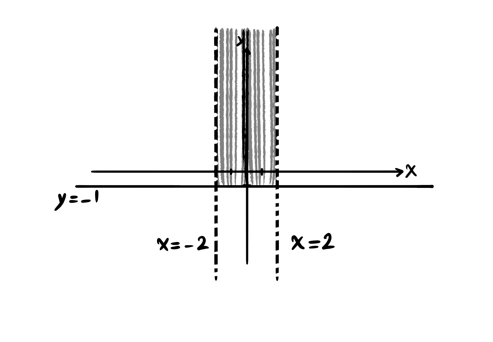

```@meta
Description = "Multivariable Calculus"
```

# Multivariable Functions

In General Mathematics 1, we were introduced to one-variable functions ``y = f(x)``, that had only one independent variable as input, ``x``. But in reality most of the times, we are faced with functions that have more than one independent variable. These functions are called multivariable functions.

``y = f(x)`` is a univariate function.

The function sends the input to the output, ``x \mapsto y``.

## Notation

- A two-variable function: ``z = f(x, y)``.

- A three-variable function is denoted by ``w = f(x, y, z)``.

- An n-variballe function: ``f(x_1, x_2, ..., x_n)``.

A few simple examples that show the relevance of multivariable functions.

### Example

The area of a rectangle: ``f(x, y) = xy``.

The volume of a sphere: ``V(x, y, z) = xyz``.

The volume of a cylinder: ``V(r, h) = \pi r^2 h``.


### Example

The average of the ``n`` numbers ``x_1, x_2, ..., x_n``:

``f(x_1, x_2, ..., x_n) = \frac{1}{n} \sum_{i = 1}^n x_i``.

## The Domain of Multivariale Functions

The domain of the two-variable function ``f(x, y)`` is either a point in the ``x``-``y`` plane, or part, or the entire ``x``-``y``coordinate system ``\mathbb{R}^2``.


### Examples

Find the domain of the follwoing functions and then plot it as a shape.

*Example A.* ``f(x, y) = 2x^3 y + x^2 y^2 - y + 5``
``D_f = \{ (x, y) | x \in \mathbb{R}, y \in \mathbb{R} \} = \mathbb{R}^2``.


*Example B.* ``f(x, y) = \frac{1}{x - y}``

``D_f = \{ (x, y) | x - y \neq 0 \} = \{ (x, y) | x \neq y \}``.

The whole plane, with the line ``y = x`` removed.


*Example C.* ``f(x, y) = \sqrt{x - y}``

``D_f = \{ (x, y) | x - y \geq 0 \} = \{ (x, y) | x \geq y \}``.

On and under the line `` y = x``.


*Example D.* ``f(x, y) = \frac{\sqrt{y - 3}}{\sqrt{5 - x}}``

``D_f = \{ (x, y) | y - 3 \geq 0, 5 - x > 0 \} = \{ (x, y) | y \geq 3, x < 5 \}``.


*Example E.* ``f(x, y) = \frac{\sqrt{y + 1}}{\sqrt[n]{2 - |x|}}``

``D_f = \{ (x, y) | y + 1 \geq 0, 2 - |x| > 0 \} = \{ (x, y) | y \geq -1, -2 < x < 2 \}``.



The shape of two-variable functions are going to be three-dimensional plots, which are also called surfaces.


``z = f(x, y)``.

The triple ``(x, y, z)``.

Since drawing three-dimensional shapes is time consuming, we just make a few examples of surfaces.


And by induction in this way, the domain of the three-variable function ``w = f(x, y, z)`` is three-dimensional, and its plot is four-dimensional.

# Partial Derivatives

``y = f(x)``.

``y = x^3 - 2x^5 + sin(x)``.

``y^\prime = f^\prime(x)``.

``y^\prime = 3x^2 - 10x^4 + cos(x)``.

``f^\prime(x) = \lim_{h \to 0} \frac{f(x + h) - f(x)}{h}``.

``f(x, y)``.

When we want to find the derivative of a multivariable function, we must specify with respect to which variable the derivative is to be applied. Other than the one variable, with respect to which the derivative is computed, the rest of the variables are trated as constant values.

The derivative of the function ``f(x, y)`` with respect to ``x`` is denoted by ``\frac{\partial f}{\partial x}`` or ``{f^\prime}_x``.
The derivative of the function ``f(x, y)`` with respect to ``y`` is denoted by ``\frac{\partial f}{\partial y}`` or ``{f^\prime}_y``.

### Example

If the function ``f(x, y) = -3x^4 y^2 + x^3 y - y^3 + xy`` is defined, then compute the derivative of ``f(x, y)`` with respect to ``x`` and the derivative of ``f(x, y)`` with respect to ``y``.

- ``\frac{\partial f}{\partial x} = -12x^3 y^2 + 3x^2 y + y``.

- ``\frac{\partial f}{\partial y} = -6x^4 y + x^3 -3y^2 + x``.

### Example

If the function ``f(x, y, z) = x^5 y^2 z^3 + y x^y - sin(y z^3)`` is defined, then compute the derivative of ``f(x, y)`` with respect to ``x``, the derivative of ``f(x, y)`` with respect to ``y``, and the derivative of ``f(x, y)`` with respect to ``z``.

- ``\frac{\partial f}{\partial x} = 5x^4 y^2 z^3 + y x^{y -1}``.

- ``\frac{\partial f}{\partial y} = 2 x^5 y z^3 + x^y ln(x) - z^3 cos(y z^3)``.

- ``\frac{\partial f}{\partial z} = 3z^2 x^5 y^2 - 3z^2 y cos(y z^3)``.

*Reminder:* ``(a^u)^\prime = u^\prime a^u ln(a)``.

## Higher Order Partial Derivatives

For a two-variable function ``f(x, y)``, higher order derivatives are as follows:

- ``\frac{\partial^2 f}{\partial x^2} = \frac{\partial}{\partial x} (\frac{\partial f}{\partial x})`` or ``{f^\prime}_{xx}``.

- ``\frac{\partial^2 f}{\partial y^2} = \frac{\partial}{\partial y} (\frac{\partial f}{\partial y})`` or ``{f^\prime}_{yy}``.

- ``\frac{\partial^2 f}{\partial x \partial y} = \frac{\partial}{\partial x} (\frac{\partial f}{\partial y})`` or ``{f^\prime}_{yx}``.

- ``\frac{\partial^2 f}{\partial y \partial x} = \frac{\partial}{\partial y} (\frac{\partial f}{\partial x})`` or ``{f^\prime}_{xy}``.

### Exercise

With the given function ``f(x, y) = ln(x^4 y^2) - y``, find the second partial derivative of ``f(x, y)`` both with respect to ``x``, the second partial derivative of ``f(x, y)`` both with respect to ``y``, the second partial derivative of ``f(x, y)`` first taken with respect to ``y`` and then with respect to ``x``, and the second partial derivative of ``f(x, y)`` with respect to ``x`` and ``y``.

- ``\frac{\partial^2 f}{\partial x^2} = \frac{\partial}{\partial x}(\frac{4x^3 y^2}{x^4 y^2}) = \frac{\partial}{\partial x}(\frac{4}{x}) = \frac{-4}{x^2}``.

- ``\frac{\partial^2 f}{\partial y^2} = \frac{\partial}{\partial y}(\frac{2x^4 y}{x^4 y^2} - 1) = \frac{\partial}{\partial y}(\frac{2}{y} - 1) = \frac{\partial}{\partial y}(2y^{-1}) = -2y^{-2} = \frac{-2}{y^2}``.

- ``\frac{\partial^2 f}{\partial x \partial y} = \frac{\partial}{\partial x}(\frac{2y x^4}{x^4 y^2} - 1) = \frac{\partial}{\partial x}(\frac{2}{y} - 1) = 0``.

- ``\frac{\partial^2 f}{\partial y \partial x} = \frac{\partial}{\partial y}(\frac{4x^3 y^2}{x^4 y^2}) = \frac{\partial}{\partial y}(\frac{4}{x}) = 0``.

*Reminder:* ``(ln(u))^\prime = \frac{u^\prime}{u}``.

## The Chain Rule

There are a few states for the chain rule:

- The first state. Suppose the function ``f(x, y)`` is defined. The variables``x`` and ``y`` are on their own functions of other variables, such as ``t``. In this state:

``\frac{\partial f}{\partial t} = \frac{\partial f}{\partial x} \frac{\partial x}{\partial t}``.

### Example

If ``f(x, y) = x^3 y - y^2 x + 4x`` and ``x = sin(t)`` and ``y = 2e^t``, then find ``\frac{\partial f}{\partial t}``.

``\frac{\partial f}{\partial t} = (3x^2 y - y^2 + 4) cos(t) + 2(x^3 - 2yx) e^t``.

*Reminder:* ``(e^u)^\prime = u^\prime e^u``.

- The second state. If we have ``f(x, y, z)`` a three-variable function and ``x, y, z`` three functions of ``t``, then we have:

``\frac{\partial f}{\partial t} = \frac{\partial f}{\partial x} \frac{\partial x}{\partial t} + \frac{\partial f}{\partial y} \frac{\partial y}{\partial t} + \frac{\partial f}{\partial z} \frac{\partial z}{\partial t}``.

### Example

The three-variable function ``f(x, y, z) = x y^3 - x^2 z^3 + ln(x y)`` is given,  where ``x = t^2``, ``y = cos(4t)`` and ``z = \sqrt{t}``. Find the partial derivative of ``f`` with respect to ``t``.

``\frac{\partial f}{\partial t} = (y^3 - 2x z^3 + \frac{y}{x y}) (2t) + (3y^2 x + \frac{x}{x y})(-4sin(4t)) + (-3z^2 x^2)(\frac{1}{2 \sqrt{t}})``.

*Reminder:* ``(ln(u))^\prime = \frac{u^\prime}{u}``.

- The state of the third kind. If ``f(x, y)`` is a two-variable function, and ``x`` and ``y`` are two-variable functions of for example ``r`` and ``s``, then:

- ``\frac{\partial f}{\partial r} = \frac{\partial f}{\partial x} \frac{\partial x}{\partial r} + \frac{\partial f}{\partial y} \frac{\partial y}{\partial r}``.

- ``\frac{\partial f}{\partial s} = \frac{\partial f}{\partial x} \frac{\partial x}{\partial s} + \frac{\partial f}{\partial y} \frac{\partial y}{\partial s}``.

### Example

The partial derivative of ``f(x, y) = 3x^2 y - y^2 x + x y + y`` with respect to ``s``, where ``y = r + s`` and ``x = s^r``:

``\frac{\partial f}{\partial s} = (6x y - y^2 + y) (r s^{r - 1}) + (3x^2 - 2y x + x + 1)(1)``.

The partial derivative of the function ``f(x, y)`` with respect to ``r``:

``\frac{\partial f}{\partial r} = (6x y - y^2 + y) (s^r ln(s)) + (3x^2 - 2y x + x + 1)(1)``.

*Reminder:* ``\frac{d}{dx} a^x = \frac{d}{dx} e^{x ln(a)} = e^{x ln(a)} (\frac{d}{dx} x ln(a)) = e^{x ln(a)} ln(a) = a^x ln(a)``.

# The Aplications of Partial Derivatives

## Determining the Maximum and Minimum Values of Multivariable Functions

The steps for determining the extremum points of a twovariable function ``f(x, y)``:

1. Solve the system of equations that is formed with ``\frac{\partial f}{\partial x} = 0`` and ``\frac{\partial f}{\partial y} = 0``. Suppose that the solution of the system is equal to ``(x_0, y_0)``.

2. Compute the equation ``\Delta(x, y) = {f^\prime}_{xx} {f^\prime}{yy} - ({f^\prime}{xy})^2``.

3. Compute these values: ``\Delta(x_0, y_0)`` and ``{f^\prime}{xx}(x_0, y_0)``.

4. If ``\Delta(x_0, y_0) > 0`` and ``{f^\prime}{xx}(x_0, y_0) < 0``, then the point ``(x_0, y_0)`` is a local maximum.

5. If ``\Delta(x_0, y_0) > 0`` and ``{f^\prime}{xx}(x_0, y_0) > 0``, then the point ``(x_0, y_0)`` is a local minimum.

6. If ``\Delta(x_0, y_0) < 0``, then the point ``(x_0, y_0)`` is a saddle point.

7. If ``\Delta(x_0, y_0) = 0``, then this test does not succeed at determining the type of the point ``(x_0, y_0)``.


### Example

Find the local extremum points of the function ``f(x, y) = 2x y - 5y^2 + 4x - 2x^2 + 4y - 4``.

``\frac{\partial d}{\partial x} = 0`` and ``\frac{\partial f}{\partial y} = 0`` yields: ``2y + 4 - 4x = 0`` and ``2x - 10y + 4 = 0``. Next, we have: ``2y - 4x = -4`` and ``2x - 10y = -4``. Multiplying the equation ``2x - 10y = -4`` by ``2`` results in ``2y - 4x = -4`` and ``4x - 20y = -8``. Then, ``-18y = -12``. Finally, ``y = \frac{-12}{-18} = \frac{2}{3}``. Subsequently, we solve for ``x`` by substituting the numerical value of ``y`` in the equation ``2(\frac{2}{3}) - 4x = -4``, which siplifies to the equation ``-4x = -4 - \frac{4}{3} = \frac{-16}{3}``. Then, we have ``x = \frac{16}{12} = \frac{4}{3}``. This gives the extremum point ``(x_0, y_0) = (\frac{4}{3}, \frac{2}{3})``. Now, we have to determine the type of ``(\frac{4}{3}, \frac{2}{3})``.

``{f^\prime}_{xx}(\frac{4}{3}, \frac{2}{3}) = -4`` and ``{f^\prime}_{yy}(\frac{4}{3}, \frac{2}{3}) = -10`` and ``{f^\prime}_{xy}(\frac{4}{3}, \frac{2}{3}) = 2``.

``\Delta(\frac{4}{3}, \frac{2}{3}) = (-4) (-10) - 2^2 = 40 - 4 = 36``.

Having computed the values of ``{f^\prime}_{xx}(\frac{4}{3}, \frac{2}{3})`` and ``\Delta(\frac{4}{3}, \frac{2}{3})`` we can examine the type of the point ``(\frac{4}{3}, \frac{2}{3})`` next:

``\Delta(\frac{4}{3}, \frac{2}{3}) > 0`` and ``{f^\prime}_{xx}(\frac{4}{3}, \frac{2}{3}) < 0``, therefore the point ``(\frac{4}{3}, \frac{2}{3})`` is a local maximum according to step four above.

### Exercise

Find the local extremum points of the function ``f(x, y) = x^2 - 2x y + \frac{1}{3} y^3 - 3y``.

``\frac{\partial f}{\partial x} = 2x - 2y = 0``,

``\frac{\partial f}{\partial y} = -2x + y^2 - 3 = 0``.

``2x - 2y = 0``,

``-2x + y^2 = 3``.

``y^2 - 2y = 3``.

``y^2 - 2y - 3 = 0``.

``\frac{-(-2) \pm \sqrt{4 + 12}}{2} = \frac{2 \pm 4}{2} = \frac{1 \pm 2}{1}``. So by solving an equation of order 2 in variable ``y``, the variable ``y`` has two distinguished roots: ``y_1 = 3`` and ``y_2 = -1``.

This is the intermediate step for how to find the values of ``x_1`` and ``x_2`` with the given values of ``y_1`` and ``y_2``.

``2x - 2y\_1 = 0``,
``2x - 2(3) = 0``,
``2x = 6``,
``x_1 = 3``.

``2x - 2y_2 = 0``,
``2x - 2(-1) = 0``,
``2x = -2``,
``x_2 = -1``.

The coordinates of the point ``(x_0, y_0)`` for the extremum examination is equal to ``(x_0, y_0) = (3, 3)``, and ``(x_1, y_1) = (-1, -1)``.

``{f^\prime}_{xx} = 2``,
``{f^\prime}_{yy} = 2y``,
``{f^\prime}_{xy} = -2``.

``\Delta(x, y) = {f^\prime}_{xx} - {f^\prime}{yy} - ({f^\prime}_{xy})^2 = (2) (2y) - (-2)^2 = 4y - 4``.

For each point ``(x_0, y_0)`` and ``(x_1, y_1)`` respectively we have: ``\Delta(x\_0, y\_0) = 4 (3) - 4 = 8`` and ``\Delta(x\_1, y\_1) = 4 (-1) - 4 = -8``.

``{f^\prime}_{xx}(x_0, y_0) = 2``.

But, ``(x_0, y_0) = (3, 3)`` yields ``\Delta(3, 3) > 0`` and ``{f^\prime}_{xx}(3, 3) > 3``. Therefore, ``(3, 3)`` is a local minimum point of the function ``f(x, y)``.

Examining the last extremum point, ``(x_1, y_1) = (-1, -1)`` yields ``\Delta(-1, -1) < 0`` and ``{f^\prime}_{xx}(-1, -1) > 0``, which makes ``(-1, -1)`` a saddle point.

## The Directional Derivative of Multivariable Functions

The gradient vector of function ``f(x, y)`` at point ``(x_0, y_0)`` is a vector that is orthogonal to the surface of the function ``f(x, y)`` at the point ``(x_0, y_0)``.


The plot of the function ``f(x, y)``.

The gradient of the function ``f(x, y)`` at point ``a`` is found as follows:

The gradient vector ``\overrightarrow{\nabla f}`` or ``grad \ f = \frac{\partial f}{\partial x} \overrightarrow{i} + \frac{\partial f}{\partial y} \overrightarrow{j} |_{a}`` evaluated at point ``a``.

The gradient of the function ``w = f(x, y, z)`` at point ``a`` is equal to ``\frac{\partial f}{\partial x} \overrightarrow{i} + \frac{\partial f}{\partial y} \overrightarrow{j} + \frac{\partial f}{\partial z} \overrightarrow{k} |_{a}``.

Here, ``\overrightarrow{i}``, ``\overrightarrow{j}`` and ``\overrightarrow{k}`` are unit vectors, which represent the unit basis vectors in the three-dimensional space. These are the spatial triples. Every two of them are linearly independent. In other words, none of them can be represented as a linear combination of the other two.

- ``\overrightarrow{i} = (1, 0, 0)``

- ``\overrightarrow{j} = (0, 1, 0)``

- ``\overrightarrow{k} = (0, 0, 1)``

``|\overrightarrow{i}| + |\overrightarrow{j}| + |\overrightarrow{k}| = 1``.

``(3, -2, 1) = 3 \overrightarrow{i} - 2 \overrightarrow{j} + \overrightarrow{k}``.

### Example

Find the gradient of the function ``f(x, y) = -x^4 y^3 + x^2 y - x`` at point ``(2, 3)``.

``\overrightarrow{\nabla f} |_{(2, 3)} = (-4x^3 y^3 + 2x y - 1) \overrightarrow{i} + (-3x^4 y^2 + x^2) \overrightarrow{j}``,

``\overrightarrow{\nabla f} |_{(2, 3)} = ((-4) (2^3) (3^3) + 2(2) (3) - 1) \overrightarrow{i} + ((-3) (2^4) (3^2) + 2^2) \overrightarrow{j}``,

``\overrightarrow{\nabla f} |_{(2, 3)} = ((-4) (8) (27) + 12 - 1) \overrightarrow{i} + ((-3) (16) (9) + 4) \overrightarrow{j}``,

``\overrightarrow{\nabla f} |_{(2, 3)} = -853 \overrightarrow{i} - 428 \overrightarrow{j} = (-853, -428)``.


Remember how we compute the slope ``m_L`` of the line ``L`` in the ``x-y`` plane at point ``x_0``:

``f^\prime (x_0) = m_L``.

``f^\prime (x_0) = lim_{x \to x_0} \frac{f(x) - f(x\_0)}{x - x_0}``.


Now, the directional derivative of the function ``f(x, y)`` at point ``a`` in the direction of vector ``\overrightarrow{u}``:

``Df_{\overrightarrow{u}} = \overrightarrow{\nabla f} \cdot e_{\overrightarrow{u}}``,

where ``\cdot`` denotes the inner product, and ``e_{\overrightarrow{u}}`` denotes the unit vector of ``\overrightarrow{u}``.

In order to compute the unit vector ``e_{\overrightarrow{u}}``, divide the vector ``\overrightarrow{u}`` by its magnitude ``|\overrightarrow{u}|`` by element:

``e_{\overrightarrow{u}} = \frac{\overrightarrow{u}}{|\overrightarrow{u}|}``.

The magnitude of a vector such as ``a = (a_1, a_2, a_3)`` equals ``|\overrightarrow{a}| = \sqrt{{a_1}^2 + {a_2}^2 + {a_3}^2}`` in the three-dimensional case. However, in the two-dimensional case where ``a = (a_1, a_2)`` is a tuple, the length of ``a`` is equal to ``|\overrightarrow{a}| = \sqrt{{a_1}^2 + {a_2}^2}``.

The inner product of a pair of vectors such as ``\overrightarrow{a} = (a_1, a_2)`` and ``\overrightarrow{b} = (b_1, b_2)`` is computed either as ``\overrightarrow{a} \cdot \overrightarrow{b} = a_1 b_1 + a_2 b_2`` or ``\overrightarrow{a} \cdot \overrightarrow{b} = |\overrightarrow{a}| |\overrightarrow{b}| cos(\alpha)``, where ``\alpha`` denotes the angle between the two vectors ``\overrightarrow{a}`` and ``\overrightarrow{b}``.

The three-dimensional inner product of vectors ``\overrightarrow{a} = (a_1, a_2, a_3)`` and ``\overrightarrow{b} = (b_1, b_2, b_3)`` is eqaul to:

``\overrightarrow{a} \cdot \overrightarrow{b} = a_1 b_1 + a_2 b_2 + a_3 b_3``.

For example, the coordinates of vector ``\overrightarrow{a}`` equals its head minus its tail as an arrow, which is equal to ``(6, 4) - (2, 1) = (4, 3)``.


Also, the magnitude of ``\overrightarrow{a}`` equals ``\overrightarrow{a} = \sqrt{4^2 + 3^2} = \sqrt{25} = 5``.

### Example

Find the directional derivative of the function ``f(x, y) = x^3 y - y^2 x + y - 1`` at point ``p = (1, 2)`` in the direction of vector ``\overrightarrow{u} = 4 \overrightarrow{i} - 3 \overrightarrow{j}``.

First, we need to find the gradient of the function.

``\overrightarrow{\nabla f} = \frac{\partial f}{\partial x} \overrightarrow{i} + \frac{\partial f}{\partial y} \overrightarrow{j} |_{(1, 2)}``,

``\overrightarrow{\nabla f} = (3x^2 y - y^2) \overrightarrow{i} + (x^3 - 2y x) \overrightarrow{j} |_{(1, 2)}``,

``\overrightarrow{\nabla f} = (6 - 4) \overrightarrow{i} + (1 - 4) \overrightarrow{j} = 2 \overrightarrow{i} - 3 \overrightarrow{j} = (2, -3)``.

Second, we need to find the unit vector of ``\overrightarrow{u}``, along which the directional derivative is taken.

``e_{\overrightarrow{u}} = \frac{4 \overrightarrow{i} - 3 \overrightarrow{j}}{\sqrt{4^2 + (-3)^2}} = \frac{(4, -3)}{\sqrt{25}} = (\frac{4}{5}, \frac{-3}{5})``.

Finally, perform an inner product in order to compute the directional derivative of ``f`` in the direction of ``\overrightarrow{u}``.

``D_{\overrightarrow{u}} f = (2, -3) \cdot (\frac{4}{5}, \frac{-3}{5}) = 2 \frac{4}{5} + -3 \frac{-3}{5} = \frac{8}{5} + \frac{9}{5} = \frac{17}{5}``.

### Example

The temperature of each point in the three-dimensional space of a room is computed using the relation: ``T(x, y, z) = x^2 y^2 + z x - z^2 y``. If we move starting from the point ``(1, -1, 1)`` in this room, in the direction of the vector ``\overrightarrow{u} = (2, 1, 1)``, then how much temperature change is experienced?

This question asks us to find the directional derivative of the function ``T`` at the point ``p`` in the direction of the vector ``\overrightarrow{u}``.

Find the gradient of the function ``f(x, y, z)`` first.

``\overrightarrow{\nabla T} = \frac{\partial T}{\partial x} \overrightarrow{i} + \frac{\partial T}{\partial y} \overrightarrow{j} + \frac{\partial T}{\partial z} \overrightarrow{k} |_{(1, -1, 1)}``.

``\overrightarrow{\nabla T} = (2x y^2 + z) \overrightarrow{i} + (2y x^2 - z^2) \overrightarrow{j} + (x - 2z y) \overrightarrow{k} |_{(1, -1, 1)}``.

``\overrightarrow{\nabla T} = (2 + 1) \overrightarrow{i} + (-2 - 1) \overrightarrow{j} + (1 + 2) \overrightarrow{k} = 3 \overrightarrow{i} - 3 \overrightarrow{j} + 3 \overrightarrow{k}``.

Next, find the unit vector ``e_{\overrightarrow{u}}`` to determine the direction of the derivative.

``e_{\overrightarrow{u}} = \frac{(2, 1, 1)}{\sqrt{4 + 1 + 1}} = \frac{(2, 1, 1)}{\sqrt{6}} = (\frac{2}{\sqrt{6}}, \frac{1}{\sqrt{6}}, \frac{1}{\sqrt{6}})``.

In the end, find the directional derivative of ``f`` at ``(1, -1, 1)`` in the direction of ``e_{\overrightarrow{u}}``:

``D_{\overrightarrow{u}} T = (3, -3, 3) \cdot (\frac{2}{\sqrt{6}}, \frac{1}{\sqrt{6}}, \frac{1}{\sqrt{6}}) = \frac{(3) (2)}{\sqrt{6}} + \frac{-3}{\sqrt{6}} + \frac{3}{\sqrt{6}}``.

``D_{\overrightarrow{u}} T = \frac{6}{\sqrt{6}} = \frac{6 \sqrt{6}}{\sqrt{6} \sqrt{6}} = \frac{6 \sqrt{6}}{6} = \sqrt{6}``.

## The Applications of the Gradient

Writing the equation of a plane in the three-dimensional space ``\mathbb{R}^3``. In order to write the equation of the plane in three-dimensional space, we need a point of the plane and a vector perpendicular to the plane, called the normal vector.


``A_0 = (x_0, y_0, z_0)``.

For writing the equation of the plane, specify another point in the plane, like ``A = (x, y, z)``, and plot the vector ``\overrightarrow{A_0 A}``.

Let ``\overrightarrow{n} = (a, b, c)`` be the vector normal to the plane. Both points ``A`` and ``A_0`` being in the plane, implies that the vectors ``\overrightarrow{n}`` and ``\overrightarrow{A_0 A}`` are perpendicular. Therefore, their inner product vanishes.

``\overrightarrow{A_0 A} = (x - x_0, y - y_0, z - z_0)``, ``\overrightarrow{n} = (a, b, c)``.

The equation of the plane with the vector normal to the plane ``\overrightarrow{n} = (a, b, c)`` that passes through the point ``A_0 = (x_0, y_0, z_0)``.

``\overrightarrow{A_0 A} \cdot \overrightarrow{n} = a (x - x_0), b (y - y_0), c (z - z_0) = 0``.

### Example

Write the equation of a plane that passes through point ``(3, -2, 1)`` and its normal vector equals ``(5, 2, 3)``.

``5 (x - 3) + 2 (y + 2) + 3 (z - 1) = 0``.

In addition to finding the equation of plane, another application of the gradient is to find the equation of the *tangent plane* of the surface of a multivariable function ``f``, at a point on the surface.


The plane ``P`` is tangent to the surface at point ``A``.

### Example

Calculate the equation of the tangent plane of the function ``f(x, y, z) = 3z - x cos(y) + e^x`` at point ``P = (0, 0, 0)``.

Here, we do not know the plane's normal vector at point ``(0, 0, 0)``. However, according to the definition of the gradient vector, the plane's normal vector at this point, is the same as the gradient vector at this point.

``\overrightarrow{\nabla f} = \frac{\partial f}{\partial x} \overrightarrow{i} + \frac{\partial f}{\partial y} \overrightarrow{j} + \frac{\partial f}{\partial z} \overrightarrow{k} |_{(0, 0, 0)}``.

``\overrightarrow{\nabla f} = (-cos(y) + e^x) \overrightarrow{i} (x \ sin(y)) \overrightarrow{j} + 3 \overrightarrow{k} |_{(0, 0, 0)}``.

``\overrightarrow{\nabla f} = (-1 + 1) \overrightarrow{i} + 0 \overrightarrow{j} + 3 \overrightarrow{k} = (0, 0, 3)``.

The equation of the plane: ``0 (x - 0) + 0 (y - 0) + 3 (z - 0) = 0`` or ``z = 0``.

### Example

Find the equation of a tangent plane to the surface of ``f(x, y, z) = x z^2 - y z + y^2 x`` at point ``A = (1, 1, 1)``.

``\overrightarrow{\nabla f} = \frac{\partial f}{\partial x} \overrightarrow{i} + \frac{\partial f}{\partial y} \overrightarrow{j} + \frac{\partial f}{\partial z} \overrightarrow{k} |_{(1, 1, 1)}``.

``\overrightarrow{\nabla f} = (z^2 + y^2) \overrightarrow{i} + (2y x - z) \overrightarrow{j} + (2z x - y) \overrightarrow{k} |_{(1, 1, 1)}``.

``\overrightarrow{\nabla f} = 2 \overrightarrow{i} + \overrightarrow{j} + \overrightarrow{k} = (2, 1, 1)``.

The equation of the tangent plane: ``2 (x - 1) + (y - 1) + (z - 1) = 0``.

### Exercises

*Exercise A.* Find the domain of the functions below and plot the result.

1. ``f(x, y) = \frac{x + y + 1}{x - y}``.

2. ``f(x, y, z) = \frac{1}{z} + \sqrt{x - y}``.

3. ``f(x, y) = \sqrt{x^2 + y^2 - 3}``.

4. ``\frac{\sqrt{y - 3}}{\sqrt{2 - |x|}}``.

*Solution A.1*

The roots of the denominator are not in the domain of the function.

``f(x, y) = \frac{x + y + 1}{x - y}``.

``x - y \neq 0``.

``y \neq x``.

The domain of the function includes the whole plane, excluding the points that are on the line ``y = x``. ``D_f = \{ (x, y) | x, y \in \mathbb{R}, x \neq y \}``.

*Solution A.2*

The roots of the function's denominator are not in the domain. ``z \neq 0``.

The argument of the square root function must be greater than or equal to zero. ``x - y \geq 0``.

``x \geq y``.

The domain of the function iscludes the whole space at one side of the plane ``x = y`` in the ``x``-``y``-``z`` space, except for the points that are on the plane ``z = 0``, which is the ``x``-``y`` plane.

``D_f = \{ (x, y, z) | x, y, z \in \mathbb{R}, x \geq y, z \neq 0 \}``.

*Solution A.3*

The argument of the square root must be non-negative: ``x^2 + y^2 - 3 \geq 0``. ``x^2 + y^2 \geq 3``.

``D_f = \{ (x, y) | x, y \in \mathbb{R}, x^2 + y^2 \geq 3 \}``.

The domain of the function is the points on the surface ``x^2 + y^2`` except for parts that are under the plane ``z = 3`` in the negative direction.

*Solution A.4*

The input number to the square root function must be either positive or zero: ``y - 3 \geq 0`` and ``2 - |x| \geq 0``.

``y \geq 3`` and ``|x| \leq 2``.

``y \leq 3`` and ``-2 \leq x \leq 2``.

Also, the roots of the denominator are not in the domain: ``2 - |x| \neq 0``.

``2 - |x| \neq 0``. ``|x| \neq 2``. ``x \neq 2`` and ``x \neq -2``.

The domain includes the encapsulated area between the lines ``y = 3``, ``x = 2`` and ``x = -2``, in the positive direction, excluding the two lines ``x = 2`` and ``x = -2``.

``D_f, \{ (x, y) | x, y \in \mathbb{R}, y \geq 3, -2 < x < 2 \}``.

*Exercise B.* Let ``f(x, y) = -x^3 y^2 + sin(x y)`` be a two-variable function. Compute ``\frac{\partial^2 f}{\partial y^2}`` and ``\frac{\partial^2 f}{\partial x \partial y}``.

*Solution B.*


*Exercise C.* The chain rule. Let ``f(x, y) = x^2 y^2 - x^3 y`` be a function and ``x = cos(t)`` and ``y = 4 e^{2t}``. Compute the partial derivative of ``f`` with respect to ``t``, ``\frac{\partial f}{\partial t}``.

*Solution C.*

*Exercise D.* Let ``f(x, y) = x y^2 - y x`` be a multivariable function and ``x = s + 5r`` and ``y = s^r`` its parameters in terms of independent variables ``s`` and ``r``. Find ``\frac{\partial f}{\partial s}``.

*Solution D.*

*Exercise E.* Find the directional derivative of the function ``f(x, y, z) = z x^2 - y x + y^2 z`` at point ``A = (0, 1, -1)``, and in the direction of the vector ``\overrightarrow{u} = (1, 1, -1)``.

*Solution E.*

# Double Integrals

The area between the plot of ``f(x)`` and the ``x``-axis, from point ``a`` to point ``b``, equals the integral ``S = \int_{a}^{b} f(x) \ dx``.


By extending that idea, the double integral ``\int \int_A f(x, y) \ dA`` is the volume of a three-dimensional shape that is bounded from above by the surface of ``f(x, y)`` and from below by the region ``A`` on the ``xy`` plane.


## Types of Integral Region

- This domain type is normal to both ``x`` and ``y`` (rectangular regions). For the region ``A`` to be normal to ``x``, it is required that a line passing through any of the corner points of region ``A``, and parallel to the ``x``-axis, must not pass through the region. Similarly, the region ``A`` is normal to ``y`` when a line passing through any of the corner points of region ``A``, and parallel to the ``y``-axis, does not pass through the region.


This region is both normal to ``x`` and ``y``.

*Fact:* If the region is normal to ``x``, then we can replace ``dA`` with ``dx \ dy``. Bringing ``dx`` to left. If the region is normal to ``y``, then we can replace ``dA`` with ``dy \ dx``. Bringing ``dy`` to left. And if the region is not normal to ``x`` we are not allowed to write ``dx \ dy`` instead of ``dA``. Or if the region is not normal to ``y`` we are not allowed to write ``dy \ dx`` instead of ``dA``.

Here, the region is normal to both ``x`` and ``y``. So:

``\int \int_A f(x, y) \ dA = \int_c^d \int_a^b f(x, y) dx \ dy = \int_c^d \int_a^b f(x, y) dy \ dx``.

The region ``A`` has two boundaries: ``a \leq x \leq b`` and ``c \leq y \leq d``.

### Example

Let ``A`` be a region of the shape: ``A``: ``2 \leq x \le 4`` and ``1 \leq y \leq 2``. Find the double integral of function ``f(x, y) = x^2 y - x y^3 + x`` on this region.


``S = \int_2^4 \int_1^2 (x^2 y - x y^3 + x) dy \ dx = \int_2^4 (\frac{x^2 y^2}{2} - \frac{x y^4}{4} + x y) |_1^2 dx.``

``S = \int_2^4 ((2x^2 - 4x + 2x) - (\frac{x^2}{2} - \frac{x}{4} + x)) dx``.

``S = \int_2^4 (\frac{3}{2} x^2 - 3x + \frac{x}{4}) dx``.

``S = (\frac{x^3}{2} - 11 \frac{x^2}{8}) |_2^4``.

``S = (\frac{64}{2} - 11 \frac{16}{8}) - (\frac{8}{2} - 11 \frac{4}{8}) = (32 - \frac{176}{8}) - (4 - \frac{44}{8})``.

The volume is equal to: ``S = (32 - 22) - (4 - 5.5) = 10 - (-1.5) = 10 + 1.5 = 11.5``.

- The second type of region. The region is normal to ``x`` and not normal to ``y``.


``\int \int_A f(x, y) dA = \int_c^d \int_{h(y)}^{g(y)} dx \ dy``.

- The third type of region. The region is normal to ``y`` and not normal to ``x``.


``\int \int_A f(x, y) dA = \int_a^b \int_c^{h(x)} f(x,y) dy \ dx``.

# The Applications of Dual Integrals

# Reference

- Dr. M.A. Kerayeh Chyan, General mathematics 2, 2022.