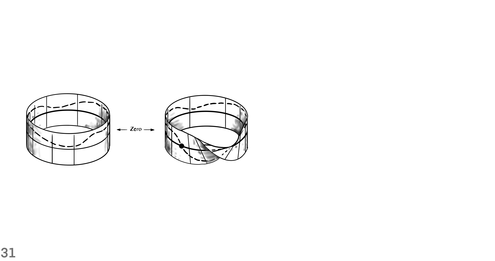

```@meta
Description = "News Report"
```

# Lede


Gauge theories describe local interactions that occur in single spacetime points.
Fields on spacetime often cannot be described simply by a map to a fixed vector space, but rather as *sections* of a non-trivial vector bundle.
The fundamental geometric opbject in a gauge theory is a principal bundle over spacetime with *structure group* given by the gauge group.

# Context

## Where, When, Who, What, How and Why?

Lie groups like the Lorentz and Poincaré groups, which are related to spacetime symmetries, and gauge groups, defining *internal* symmetries, are important cornerstones.
The groups act on fields and leave the spacetime integral over the Lagrangian invariant.
The fibers of a principal bundle are sometimes thought of as an internal space at every spacetime point, not belonging to spacetime itself.


## Where and When


Gauge theories, which are field theories invariant under all gauge transformations, have the huge symmetry group of bundle automorphisms.
The diffeomorphism group ``Diff(M)`` of spacetime ``M`` plays a comparable role in general relativity.
In the case of Minkowski spacetime, rotations correspond to Lorentz transformations.

[Transformations](https://github.com/iamazadi/Porta.jl/blob/master/models/newsreport/spacetime/fig11transformations.jl)

An active Poincaré transformation sends the world vector ``U`` at point ``O`` to a world vector ``V`` at point ``\hat{O}``.
If the transformation also sends the the tetrad at ``O`` to a tetrad at ``\hat{O}``, then the coordinates of ``U`` are the same as those of ``V``.


[Y Negative](https://github.com/iamazadi/Porta.jl/blob/master/models/newsreport/spacetime/fig12ynegative.jl)

The abstract sphere ``\mathcal{y}^-`` of past null directions represents the observer's celectial sphere in a natural way.
The sphere ``S^-``, or its projection to sphere ``S``, gives a more concrete but less invariant realization.


[Stereographic Projection](https://github.com/iamazadi/Porta.jl/blob/master/models/newsreport/spacetime/fig13stereographicprojection.jl)

The stereographic peojection sends points from the sphere ``S^+`` into the Argand plane.
For that purpose, choose the North Pole as a point from which the map projects all other points in the sphere.
Then, the union of the plane and the point at infinity yields the Riemann sphere.


[Spherical Coordinates](https://github.com/iamazadi/Porta.jl/blob/master/models/newsreport/spacetime/fig14spherical.jl)

Light rays reaching the eyes of an observer pierce a sphere centered at the observer's position.
Specify a point in the celectial sphere with a latitude and a longitude.
The geometry of the equation ``\zeta = e^{i \phi} cot(\theta / 2)`` relates the spherical polar angles ``\theta`` and ``\phi`` to the complex stereographic coordinate ``\zeta``.


[Stereographic Projection](https://github.com/iamazadi/Porta.jl/blob/master/models/newsreport/spacetime/fig15stereographicprojection.jl)

In Minkowski space-time, the intersection of the null cone with a plane yields a sphere.
As the plane through curve segment ``ON`` varies it provides the stereographic projection.
The point ``P`` maps to point ``P^\prime``.
The parabolic intersection of the sectional plane with the cone has the same intrinsic Euclidean metric as the Argand plane.


[Four-Screw](https://github.com/iamazadi/Porta.jl/blob/master/models/newsreport/spacetime/fig1678fourscrew.jl)

A Lorentz transformations in Minkowski space-time chooses an inertial frame for an observer.
The properties of Lorentz transformations are best shown on the Riemann sphere because it has all the null directions of an observer.
A proper rotation and a boost in the ``z`` direction combine together to make a four-screw.


[Null Rotation](https://github.com/iamazadi/Porta.jl/blob/master/models/newsreport/spacetime/fig19nullrotation.jl)

A null rotation is a type of Lorentz transformation where a single point is left as the only fixed point.
The rigid transformation of the Argand plane projects to a transformation on the Riemann sphere.
For the Riemann sphere, the points are displaced along circles through the south pole tangent to the y-direction there.


[Null Flag](https://github.com/iamazadi/Porta.jl/blob/master/models/newsreport/spacetime/fig110nullflag.jl)

A null cone is in the tangent space of spacetime at point ``O``.
The representation of a spin-vector requires a pair of infinitesimally separated points on ``\mathcal{y}^+``.
A spin-vector is shown in terms of points ``P`` and ``P^\prime`` of a null flag.


[Cross-Sections](https://github.com/iamazadi/Porta.jl/blob/master/models/newsreport/spacetime/fig111crosssections.jl)

The curve segment connecting point ``O`` to point ``N`` represents the temporal direction.
The temporal direction is normal to a cross-section of the null cone.
The angle between the temporal direction of the two sections determines a metric that measures lengths and angles.
After a transformation in the linear space of the generators of the cone, the sides of triangles are multiplied by a scalar number.


[SO(3)](https://github.com/iamazadi/Porta.jl/blob/master/models/newsreport/spacetime/fig112specialorthogonal3.jl)

Construct a complicated object by annihilating and creating boundaries.
Look at transformations in the tangent bundle, in order to mark the orientation of boundaries.
Follow the following 9 steps for building a tangent bundle on the 3-sphere.

1. Mark the boundary of one copy of ``SO(3)`` with sixteen vertices of a hypercube.
2. Make a tangent frame at origin point ``O`` and parallel transport it to the marked points.
3. Mark the frames with identifier ``I``.
4. Parallel transport a triad from point ``O`` to a boundary point.
5. Switch coordinate charts from chart ``N`` to chart ``S``.
6. Parallel transport the triad to the center of the counterpart copy of ``SO(3)``.
7. Parallel transport the frame to the boundary points, from the center of the other copy of ``SO(3)``.
8. Mark the frames that are parallel transported from the center of chart ``S`` at origin ``O`` with identifier ``II``.
9. Compare them with frames originated from the center of chart ``N`` at origin ``O``.

The twist in frames ``I`` compared to frames ``II`` is like the reorientation of 3D objects in the Euclidean three-dimensional space.
Even though both copies of ``SO(3)`` represent the same 3D orientation, they are distinguished from each other as points in the special linear group of complex dimension two ``SL(2,C)``.

The equivalence class of twisted frames at boundary points defines a group of rotations ``SO(3)``.
The clutching construction makes an associated vector bundle on the 3-dimensional sphere ``S^+``.
The construction creates a vector bundle through a continuous function denoted by ``f``.
The clutching function resolves the conflicts of tangent frames along the boundary.
It does so by producing an image elements in ``SO(3)`` given an element in ``SO(3) \times SO(3)``, over the intersectional region.


[Dirac's scissors problem](https://github.com/iamazadi/Porta.jl/blob/master/models/newsreport/spacetime/fig113diracsscissors.jl)

A line passing through the North Pole intersects a section at point ``P`` and makes a corresponding intersection on the other section.
For showing the metric structure of the sections we choose three points close to each other such that they make similar triangles in every section.
Dirac’s scissors problem says that a continuous rotation of the structure through ``2\pi`` toggles the sign of the half plane that is attached to it.


[Spin structure: one-to-two relation between ``O^{\uparrow}_+(1,3)`` and ``SL(2,\mathbb{C})``](https://github.com/iamazadi/Porta.jl/blob/master/models/newsreport/spacetime/fig114onetotworelation.jl)

This is a one-to-two relation between a restricted Lorentz transformation and the special linear group of complex dimension two, up to a boost.
The topology of the relation is like the one-to-two relation between the special orthogonal group of real dimension three and the special unitary group of complex dimension two.
The geometric structure of similar triangles with vertices: ``P``, ``P^\prime`` and ``P^{\prime\prime}``, undergoes unrestricted spin transformations.


[A null flag bundle](https://github.com/iamazadi/Porta.jl/blob/master/models/newsreport/spacetime/fig115nullflagbundle.jl)

The null-flag bundle ``F`` of ``M``, and its twofold covering space, the spin-vector bundle ``F^\prime`` are shown.
The bundle projection map sends a null-flag to an event in space-time M.
Null-flags in the fiber space are 4-dimensional, which make the total space of the null-flag bundle 8-dimensional.


[A unique frame ``ABCD``](https://github.com/iamazadi/Porta.jl/blob/master/models/newsreport/spacetime/fig116uniqueframe.jl)

The map to ``\mathbb{R}^4``, of future null cone and null flag, provides, in continuous fashion, a unique frame ``ABCD``.
The following 8 steps construct a unique frame that is right-handed and orthonormal with respect to the Euclidean metric of ``\mathbb{R}^4``.
1. Generate a spin-vector with two complex numbers and a time sign.
2. Use vector sum and the antipode of the spin-vector to find the timelike vector inside the future null cone.
3. Generate another spin-vector off of the first spin-vector such that the two spin-vectors make a null flag.
4. Normalize the sum of the flagpole of the original spin-vector and the flagpole of its antipode to give vector ``A`` in Minkowski vector space.
5. Calculate the axis ``B`` by projecting the flagpole to the orthogonal complement hyperplane that has ``A`` as its normal vector.
6. Calculate axis ``C`` by summing the spin-vector that is infinitesimally close to the original spin-vector with the negative of the original spin-vector.
7. Project the result onto the orthogonal hyperplane where ``A`` is its normal.
8. Find axis ``D`` by subtracting every partial component that is along ``A``, ``B`` or ``C`` from a random vector.


[A spin-frame](https://github.com/iamazadi/Porta.jl/blob/master/models/newsreport/spacetime/fig117spinframe.jl)

What is the relation between a spin-frame and a Minkowski tetrad?
A spin-frame is in a vector space over complex numbers.
The spin space has the axioms of an abstract vector space.
If a spin-vector is in ``S^-``, then under restricted spin-transformations it does not leave the sphere ``S^-`` to ``S^+``.


[Spin-vectors in terms of ``S^+``](https://github.com/iamazadi/Porta.jl/blob/master/models/newsreport/spacetime/fig118spinvectorssplus.jl)

A spin-vector is a ratio between a pair of complex numbers, along with a time sign.
Spin-vectors exist in a spin-space that is equipped with three operations: scalar multiplication, inner product and addition.
Unless an unrestricted Lorentz transformation is applied, spin-vectors remain in either the sphere of past null directions ``S^-`` or ``S^+``.


[Sum of angles](https://github.com/iamazadi/Porta.jl/blob/master/models/newsreport/spacetime/fig119sumofangles.jl)

In the sphere of future null directions ``S^+``, a circle connects three points: the north pole ``N``, point ``P`` and point ``Q``.
At point ``P`` a tangent vector is denoted by ``L``. Also, at point ``Q`` a tangent vector is denoted by ``M``.
Any circle on ``S^+`` through points ``P`` and ``Q`` makes the same sum-of-angles with arrows ``L`` and ``M``.


[Argument of the inner product](https://github.com/iamazadi/Porta.jl/blob/master/models/newsreport/spacetime/fig120innerproductphase.jl)

The inner product of two spin-vectors ``\omega`` and ``\kappa`` is a complex number.
When they are combined in a linear fashion, the flagpoles of ``\omega`` and ``\kappa`` span a 2-plane.
Perform these 4 steps in order to calculate the argument of the scalar product.
1. Use the Gram-Schmidt orthogonalization method to find the orthogonal complement of the 2-plane.
2. Find the intersection of the flagplanes of ``\kappa`` and ``\omega`` with the orthogonal complement 2-plane from the previous step.
3. The flagplane of ``\kappa`` intersects along the line ``U``, whereas the flagplane of ``\omega`` intersects along the line ``V``.
4. Find the angle between ``U`` and ``V`` to measure the argument of the inner product: ``\pi + 2 arg\{\kappa, \omega\}`` (mod ``2\pi``).


[Sum of spin-vectors in terms of ``S^+``](https://github.com/iamazadi/Porta.jl/blob/master/models/newsreport/spacetime/fig121spinvectorsum.jl)

The addition of spin-vectors ``\kappa`` and ``\omega`` results in another spin-vector ``\kappa + \omega`` in the spin-space.
The tails of the flagpoles of ``\kappa``, ``\omega`` and ``\kappa + \omega`` are in a circle.
The circumcircle of the triangle made by joining the the three spin-vectors makes the same angle with each of the flagpoles.


[Sum of spin-vectors in terms of the Argand plane](https://github.com/iamazadi/Porta.jl/blob/master/models/newsreport/spacetime/fig122spinvectorssumargandplane.jl)

This shows the sum of spin-vectors in a special Lorentz frame that brings out the symmetry at a spacetime event.
In this inertial frame, we have three mappings in a circular fashion: ``\kappa \mapsto -\omega``, ``\omega \mapsto \kappa + \omega``, and ``\kappa + \omega \mapsto \kappa``.
This way, the flagpole pair and their sum are collinear in the Argand plane.


[A special frame that brings out the symmetry of spin-vector sum](https://github.com/iamazadi/Porta.jl/blob/master/models/newsreport/spacetime/fig123specialframe.jl)

This special frame brings out the symmetry of spin-vector sum.
In this inertial frame, we have four mappings in a circular fashion:
1. ``\kappa \mapsto \frac{1}{\sqrt{2}} (\kappa - \omega)``
2. ``\frac{1}{\sqrt{2}} (\kappa - \omega) \mapsto -\omega``
3. ``\omega \mapsto \frac{1}{\sqrt{2}} (\kappa + \omega)``
4. ``\frac{1}{\sqrt{2}} (\kappa + \omega) \mapsto \kappa``
The two spin-vectors, along with their sum and subtraction, all are in a straight line.

# The Story

## Who


The fact that there are 8 gluons, 3 weak gauge bosons, and 1 photon is related to the dimensions of the Lie groups ``SU(3)`` and ``SU(2) \times U(1)``.
*Connections* on principal bundles, correspond to *gauge fields* whose particle excitations in the associated quantum field theory are the *gauge bosons* that transmit interactions.
Gauge fields correspond to gauge bosons (spin 1 particles) and are described by 1-forms or, dually, vector fields.

### Graph


**Edward Witten** *(1987)*:

If one wants to summarize our knowledge of physics in the briefest possible terms, there are three really fundamental observations:

1. Spacetime is a pseudo-Riemannian manifold ``M``, endowed with a metric tensor and governed by geometrical laws.

2. Over ``M`` is a Principal G-bundle ``X`` with a nonabelian gauge group ``G``.

3. Fermions are sections of ``(\hat{S}_+ \otimes V_R) \oplus (\hat{S}_- \otimes V_{\tilde{R}})``. ``R`` and ``\tilde{R}`` are not isomorphic; their failure to be isomorphic explains why the light fermions are light and presumably has its origins in a representation difference ``\Delta`` in some underlying theory.

All of this must be supplemented with the understanding that the geometrical laws obeyed by the metric tensor, the gauge fields, and the fermions are to be interpreted in quantum mechanical terms.

## What


Matter fields in physics are described by smooth sections of vector bundles ``E`` associated to principal bundles ``P`` via the representations of the gauge group ``G`` on a vector space ``V``.
In the case of fermions, the associated bundle ``E`` is twisted in addition with a *spinor bundle* ``S``, that is, the bundle is ``S \otimes E``.
These particles are fermions (spin ``\frac{1}{2}`` particles) and are described by spinors.

# Perspective

## How


In physics, commutator ``[A_\mu, A_\nu]`` in the expression for the curvature 2-form ``F_{\mu\nu}`` is interpreted as a direct interaction between gauge bosons described by the gauge field ``A_\mu``.
The commutator of the conection 1-form leads to cubic and quartic terms in the *Yang-Mills Lagrangian*.
Given a spin structure on a pseudo-Riemannian manifold and the spinor bundle ``S``, we would like to have a covariant derivative on ``S`` so that we can define field equations involving derivatives of spinors.

[The particular case of a *trivial* bundle and the general case of a *twisted* bundle](https://github.com/iamazadi/Porta.jl/blob/master/models/newsreport/gaugeconnections/fig153bundle.jl)

There is a Cartesian product ``M \times V``, above a local open region of the base manifold.
In a trivial bundle, the points of the fiber bundle are tuples of elements in base ``M`` and fiber ``V``.
In the case of a nontrivial fiber bundle, use multiple coordinate charts to cover the base manifold ``M``.


[How twisting in a fiber bundle occurs.](https://github.com/iamazadi/Porta.jl/blob/master/models/newsreport/gaugeconnections/fig154twisting.jl)

Suppose that the base manifold ``M`` is the skin of the globe.
Further, suppose that the fiber manifold ``V`` is a one-dimensional vector space.
Then, the total space of the trivial bundle is like a torus of revolution, whereas the twisted bundle is like the Mobius strip.


[How to glue two copies of the Riemann sphere for constructing a vector bundle.](https://github.com/iamazadi/Porta.jl/blob/master/models/newsreport/gaugeconnections/fig155gluingspheres.jl)

The clutching construction makes a vector bundle over the sphere.
The twist occurs at the boundary of the two charts.
Clutching construction gives a continuous vector field globally.


[A cross-section of a fiber bundle](https://github.com/iamazadi/Porta.jl/blob/master/models/newsreport/gaugeconnections/fig156crosssection.jl)

A cross section of a bundle is a continuous image of the base manifold.
A section intersects each individual fiber in a single point.
The bundle projection map of a section gives the identity.



[Compare a cross-section of a fiber bundle with the zero section.](https://github.com/iamazadi/Porta.jl/blob/master/models/newsreport/gaugeconnections/fig157zerosection.jl)

The complex plane extends to infinity in every direction from the origin.
But in the Riemann sphere, all directions from the north pole end up at the south pole in Antarctica.
The line bundle can have a global section, where in fact the Clifford bundle can’t have a global section.


[The Clifford bundle](https://github.com/iamazadi/Porta.jl/blob/master/models/newsreport/gaugeconnections/fig158cliffordbundle.jl)

Let ``q`` be a unit quaternion number and its antipodal point ``-q`` is its negative.
The point``q`` is in the unit circle, which is embedded in the two-complex-dimensional plane.
In the plane ``\mathbb{C}^2`` the unit 3-sphere coordinates assert that ``|w|^2 + |z|^2 = 1``.


[The bundle of unit tangent vectors to ``S^2``](https://github.com/iamazadi/Porta.jl/blob/master/models/newsreport/gaugeconnections/fig1510unittangentbundle.jl)

The fibers of the tangent bundle to ``S^2`` are circles.
But, each circle-fiber of the Clifford bundle wraps twice around each circle-fiber of the tangent bundle to ``S^2``.
Wrapping around each circle-fiber of the Clifford bundle once yields the antipodal point in the 3-sphere.


[An example of a complex line bundle](https://github.com/iamazadi/Porta.jl/blob/master/models/newsreport/gaugeconnections/fig1511complexlinebundle.jl)

In the complex 2-plane ``w-z``, the unit circle is given by the equation ``|w|^2 + |z|^2 = 1``.
The complex line bundle is the entire complex line, given by ``Aw + Bz = 0``, where ``A`` and ``B`` are complex numbers.
In the complex line bundle, the base space is the ratio ``A : B``, which is proportional to the slope of the line.


[The tangent bundle and the cotangent bundle](https://github.com/iamazadi/Porta.jl/blob/master/models/newsreport/gaugeconnections/fig1512cotangentbundle.jl)

Use the exponential function for translation along a direction in the tangent space to get a tangent vector at ``q``.
Specify a cross-section of the tangent bundle in order to have a nowhere vanishing vector field.
Define a 1-form by fixing one of the arguments of a scalar product, using elements from the nowhere vanishing vector field.


[A strained line bundle over ``S^1`` with a stretch by a positive factor](https://github.com/iamazadi/Porta.jl/blob/master/models/newsreport/gaugeconnections/fig1516strainedlinebundle.jl)

In order to go from a fixed point to another fixed point along the circle, two paths of different lengths are possible.
In the strained bundle, two horizontal flows are combined with a third flow in the vertical direction.
Measure the strain in the plane-fibers with a connection on the fiber bundle.


[Types of connection on a manifold](https://github.com/iamazadi/Porta.jl/blob/master/models/newsreport/gaugeconnections/fig1517typesofconnection.jl)

A tangent vector at a point in the base manifold ``\mathbb{R}^2`` is represented by a particular point in the fiber manifold ``S^1`` above it.
A horizontal curve in the tangent bundle ``T(\mathbb{R}^2)`` represents the parallel transportation of some vector along a curve in ``\mathbb{R}^2``.
*Constant transport* in the base ``\mathbb{R}^2`` is defined from a notion of *horizontal* in the circle-bundle ``\mathbb{R}^2 \times S^1``.


[How to make the connection of a strained line bundle over ``S^1``](https://github.com/iamazadi/Porta.jl/blob/master/models/newsreport/gaugeconnections/fig1518gluingforconnection.jl)

1. Remove a point from circle ``S^1`` to get a trivial region above it.
2. Apply a linear transformation to the fibers of a copy of the trivial region.
3. Identify the endpoints of the two trivial regions after splitting, such that they make the circle whole again.
A connection measures the scale difference in fibers above one of the regions compared with sections above the other region.


[A local path dependence with curvature](https://github.com/iamazadi/Porta.jl/blob/master/models/newsreport/gaugeconnections/fig1519localpathdependence.jl)

The bundle curvature is shown, as a horizontal loop fails to close above the unit circle.
A complex number, denoted by ``z``, sets the coordinate of a point in the base space ``\mathbb{C}``.
The unit circle ``S^1 \in \mathbb{C}`` is parameterized with ``z = e^{i \theta}``.


[A complex 1-dimensional vector space as the fiber space, where the *stretch* corresponds to multiplication by a real number.](https://github.com/iamazadi/Porta.jl/blob/master/models/newsreport/gaugeconnections/fig1520stretchbyrealnumbers.jl)

We use the explicit connection ``\nabla = \frac{\partial}{\partial z} - A``, where ``A`` is a complex smooth function of ``z``.
If function ``A`` is complex differentiable in a neighborhood of point ``z``, then the bundle curvature vanishes.
But, if ``A = 𝑖 × k × z``, then for the part of the bundle above the unit circle ``S^1`` we get a **real stretch** with a given value of ``k``.


[A complex 1-dimensional vector space as the fiber space, where the *stretch* corresponds to multiplication by a complex number.](https://github.com/iamazadi/Porta.jl/blob/master/models/newsreport/gaugeconnections/fig1521stretchbycomplexnumbers.jl)

One can also extend the symmetry of the fiber space into a 2-dimensional real vector space.
The fiber space can have a complex structure to make it a 1-dimensional complex vector space.
In that case, a **complex stretch** twists the connection ``\nabla`` with multiplication by a complex number ``\mathbb{C}``.

### The Iconic Wall


Let ``q`` be a point in a principal G-bundle, and ``A`` a connection 1-form.
Suppose that the point ``q`` is a vertex of an infinitesimal parallelogram, where two of the edges intersect.
Then, the loop integral of the connection ``A`` along the edges of the parallelogram equals the exterior derivative of the connection ``F_A = dA``.

### Tome


Under gravity, a sphere of test particles deforms into an egg-shaped closed surface.
From the Newtonian inverse-square law, we know that gravity preserves the volume of the surface ``\delta R_{\mu\nu} = 0``.
Whenever matter *is* present ``R \neq 0``, then a volume-reducing force field deforms spacetime too.

Einstein's Spacetime has four degrees of freedom, where objects in free fall move along geodesic curves.
If the loop integral of the gravitational work 1-from does not vanish, a trajectory is stretched.
But, the stretch changes the spacing of the stack representing the 1-form.
The deviation of geodesics means that a Hamiltonian flow lifts a circular path to a spiral trajectory.
He, discards the Weyl curvature, as ``R_{\mu\nu}`` measures the stretch and its trace measures density.
Finally, sets the total matter-energy equal to a combination of of the Ricci ``R_{\mu\nu}`` and scalar ``R`` curvatures.
So, a stick figure walks along Penrose steps or the Escher staircase, seemingly going upward forever.

# Wrap Up

## Why


First, Dirac forms define a Dirac mass term in the Lagrangian for all fermions and, together with the Dirac operator, the kinetic term and the interaction term.
Then, the Higgs mechanism of mass generation for gauge bosons and fermions are done through Yukawa couplings.
Finally, scalar products construct the gauge invariant Yang-Mills Lagrangian.


[Configuration space](https://github.com/iamazadi/Porta.jl/blob/master/models/newsreport/lagrangians/fig201configurationspace.jl)

Each point in the configuration space represents a possible configuration of the chassis, reaction wheel and rolling wheel.
As the system evolves in time, a sequence of telemetry frames make a curve in the configuration space.
The behavior of the robot is constrained with a function that is defined on the tangent bundle of configuration space.


[The Lagrangian on the tangent bundle of configuration space ``T(\mathcal{C})`` vs. the Hamiltonian ``\mathcal{H}`` on the cotangent bundle ``T^*(\mathcal{C})`` (phase space)](https://github.com/iamazadi/Porta.jl/blob/master/models/newsreport/lagrangians/fig202phasespace.jl)

The total space of the Clifford bundle is located at a single spacetime event.
As an example, the Yang-Mills Lagrangian is the scalar product of a differential form on a principal G-bundle with itself.
Alternatively, the Hamiltonian is defined as a smooth function on the phase space, also known as the cotangent bundle of the configuration space.


[Hamilton's principle](https://github.com/iamazadi/Porta.jl/blob/master/models/newsreport/lagrangians/fig203hamiltonprinciple.jl)

One derives the equations of motion for (mostly) kinetic particles such as photons (and neutrinos) using Hamilton's principle.
A particle moves through the configuration space such that the integral of the Lagrangian along a path between two fixed points is stationary, under variations of the curve.
But, the Yang-Mills Lagrangian is an adjoint-invariant scalar product of the curvature 2-form on a principal G-bundle over spacetime.
The adjoint bundle is an associated vector bundle of the principal G-bundle, whose values represent the difference between two connections.


[Staitionary values of a smooth real-valued function ``f`` of several variables](https://github.com/iamazadi/Porta.jl/blob/master/models/newsreport/lagrangians/fig204stationaryvalues.jl)

Geodesic curves describe the shortest distance between two fixed points in a smooth manifold.
The exterior derivative of a scalar field at a stationary point is very small in every direction.
The tangent bundle of the configuration space of a dynamical system has geodesic curves, along which the integral of the Lagrangian is stationary. 


[The Hamiltonian flow](https://github.com/iamazadi/Porta.jl/blob/master/models/newsreport/lagrangians/fig205hamiltonianflow.jl)

The Hamiltonian flow is a section of the cotangent bundle of the configuration space.
The Newtonian time-evolution of a particle in free fall, follows a geodesic trajectory in the configuration space.
The stack of equally spaced parallel planes represents the gravitational work 1-form and its direction is downward.


[Small oscillations](https://github.com/iamazadi/Porta.jl/blob/master/models/newsreport/lagrangians/fig206smalloscillations.jl)

In 1583, Galileo observed that the period of small oscillations is independent of the the maximum distance away from the stable equilibrium point.
As it turns out, acceleration and position transform in a linear way, after expanding a power series of the Hamiltonian about the equilibrium point.
Since the pendulum rotate as a special orthogonal group, the pendulum’s Newtonian time-evolution is unitary.


[Liouville's theorem](https://github.com/iamazadi/Porta.jl/blob/master/models/newsreport/lagrangians/fig207liouvillestheorem.jl)

The boundary of the phase space represents a range of possible initial momentum states.
The shape of the boundary is distorted during the time-evolution of the physical system.
Liouville’s theorem states that the Hamiltonian flow preserves the volume of the initial phase-space boundary.


[The reduced phase space of ``T^*(\mathcal{C})``](https://github.com/iamazadi/Porta.jl/blob/master/models/newsreport/lagrangians/fig208phasespace.jl)

The value of the Hamiltonian function is constant throughout the motion, which implies the conservation of the sum of kinetic and potential energies.
In order to reduce the phase space, substract a partial component of momentum, as a result of projecting momentum onto the line tangent to the trajectory.
It’s remarkable that the reduced phase space can be the configuration space of a physical system.


[Hamilton's principle for field Lagrangians](https://github.com/iamazadi/Porta.jl/blob/master/models/newsreport/lagrangians/fig209fieldlagrangians.jl)

The Yang-Mills Lagrangian is the magnitude of a 2-form with respect to a connection 1-form on spacetime.
The 2-form has an exact symmetry if and only if it is equal to the loop integral of a 1-form along the boundary of an oriented area.
But if this 1-form exists, then the integral introduces a scalar constant, and one has the freedom to transform the gauge as a reference level.


[Hamilton's principle for field Lagrangians](https://github.com/iamazadi/Porta.jl/blob/master/models/newsreport/lagrangians/fig2010fieldlagrangians.jl)

The boundary of a well-behaved compact oriented 4-dimensional region is a 3-dimensional region.
The boundary consists of those points of the 4-region that do not lie in the interior.
Hamilton’s principle states that the integral of a 4-form, scaled by some field Lagrangian, over a 4-dimensional region is stationary.

### Porta.jl


#### What are “horizontal subspaces” and what do they have to do with vector potentials and gauge fields?

A connection (denoted by ``A``) on a principal G-bundle ``P`` assigns a horizontal subspace of the tangent space to each point ``q`` in ``P``, in a smooth way.
First, the tangent space of a principal bundle ``P`` at point ``q`` is equal to the direct sum of the vertical subspace and the horizontal subspace at ``q``, for all ``q`` in ``P``.
Second, the push forward of the horizontal subspace of the Principal G-bundle ``P`` at point ``q`` by an action ``g`` of the structure group ``G`` is equal to the horizontal subspace of the principal G-bundle ``P`` at the transformation of the point ``q`` by the action ``g``, for all ``g`` in ``G`` and ``q`` in ``P``.

If the exterior derivative of the curvature 2-form vanishes, then there exists a 1-form potential that acts as a reference level. The vector representation of the 1-form is called a vector potential. But, the 1-form on spacetime is called a gauge field. So gemoterically, the vector potential is normal to the stack of horizontal planes of the 1-form.

# References

1. [Sir Roger Penrose on the The Portal with Eric Weinstein](https://youtu.be/mg93Dm-vYc8?si=izXyUxIjRv0SmxQw)

2. Mark J.D. Hamilton, Mathematical Gauge Theory: With Applications to the Standard Model of Particle Physics, Springer Cham, [DOI](https://doi.org/10.1007/978-3-319-68439-0), published: 10 January 2018.

3. Sir Roger Penrose, [The Road to Reality](https://www.amazon.com/Road-Reality-Complete-Guide-Universe/dp/0679776311), (2004).

4. Roger Penrose, Wolfgang Rindler, [Spinors and Space-Time](https://doi.org/10.1017/CBO9780511564048), Volume 1: Two-spinor calculus and relativistic fields, (1984).

5. M.J.D. Hamilton, The Higgs boson for mathematicians. Lecture notes on gauge theory and symmetry breaking, arXiv preprint arXiv:1512.02632, (2015).

6. [Edward Witten](https://cds.cern.ch/record/181783/files/cer-000093203.pdf), Physics and Geometry, (1987).

7. The iconic [Wall](https://scgp.stonybrook.edu/archives/6264) of Stony Brook University.

8. Tristan Needham, Visual Differential Geometry and Forms: A Mathematical Drama in Five Acts, Princeton University Press, 2021.