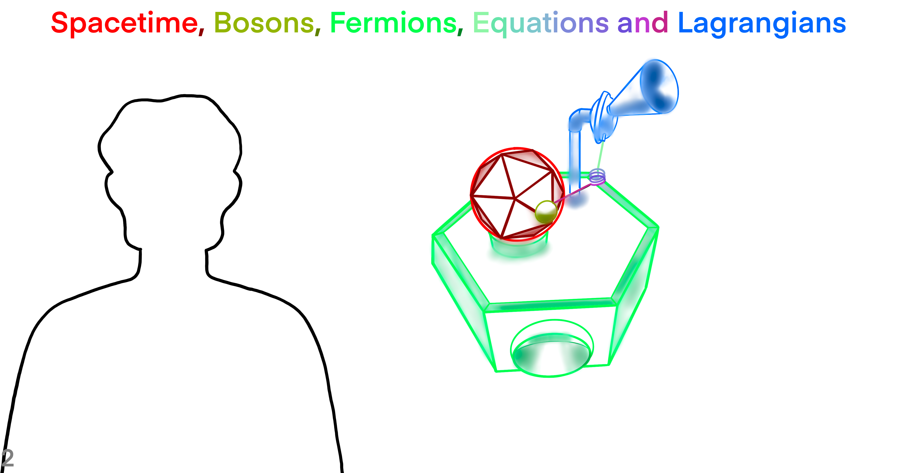
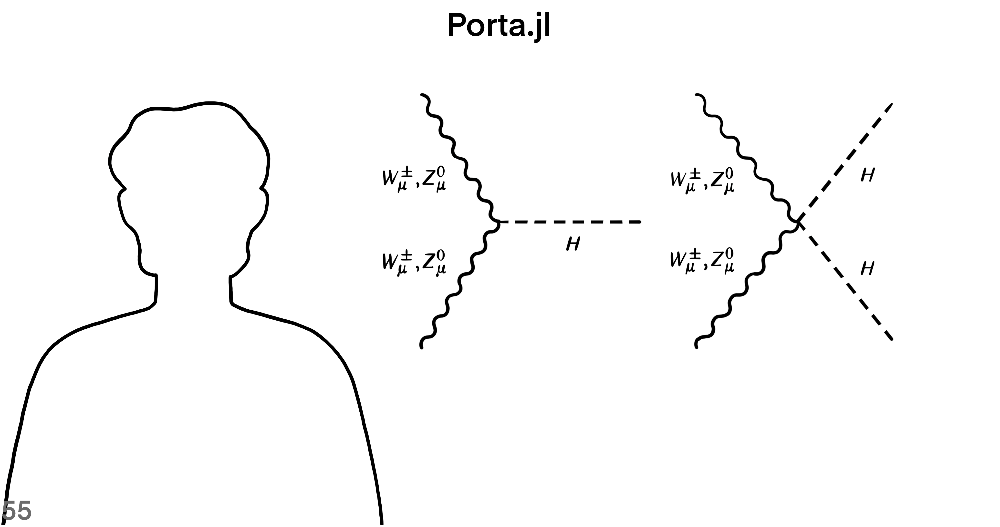

```@meta
Description = "News Report"
```

# Lede

Show a small piece of the story.


# Context

## Where, When, Who, What, How and Why?

Tell us the facts of the story.



## Where and When


[Transformations](https://github.com/iamazadi/Porta.jl/blob/master/models/newsreport/spacetime/fig11transformations.jl)

What is the relation between a spin-frame and a Minkowski tetrad? The spin-frame is denoted by omicron (black) and iota (silver). Omicron and iota serve as two flag poles, where we also show their respective flags. In order to see the flags, find the arcs in the x direction that move with omicron and iota during a series of transformations. The spin-frame is in a vector space over complex numbers. The spin space has the axioms of an abstract vector space. But, we have defined a special inner product for 2-spinors, such that the product of omicron and iota equals unity, whereas the product of iota and omicron equals minus unity. In other words, the inner product eats a pair of spin-vectors in the Hopf bundle and spits out a complex number (a scalar).


[Y Negative](https://github.com/iamazadi/Porta.jl/blob/master/models/newsreport/spacetime/fig12ynegative.jl)

The axes t (red), x (green), y (blue), and z (orange) are parts of a Minkowski tetrad in Minkowski spacetime. Choosing the default Minkowski tetrad, the tetrad aligns with the Cartesian axes of real dimension four. But, when we apply a spin-transformation, the tetrad no longer aligns with Cartesian coordinates, and with it the spin-frame bases omicron and iota change as well. The kinds of spin transformation that we apply are four-screws and null rotations, and so they are restricted transformations. Restricted transformations do not alter the sign of time. Here, the time sign is negative one, which is the same as the wall clock time.


[Stereographic Projection](https://github.com/iamazadi/Porta.jl/blob/master/models/newsreport/spacetime/fig13stereographicprojection.jl)

If you look closely, there are two spheres in the middle that change hue over time. One of them is the past null cone and the other is the sphere S^{-1}. You will recognize the null cone as soon as it turns into a cone momentarily. If a spin-vector is in S^{-1}, then under restricted spin-transformations it does not leave the sphere S^{-1} to S^{+1}. The past null cone is the directions of light that reach our eyes from the past. But, the sphere S^{-1} is the light that we can observe around us in the present moment (assume we’re in deep space and away from heavenly objects). Under spin-transformations the null cone and the sphere S^{-1} change too, because they are embedded in Minkowski spacetime of dimension 4.


[Spherical Coordinates](https://github.com/iamazadi/Porta.jl/blob/master/models/newsreport/spacetime/fig14spherical.jl)

```julia
timesign = -1
ο = SpinVector([Complex(1.0); Complex(0.0)], timesign)
ι = SpinVector([Complex(0.0); Complex(1.0)], timesign)
@assert(isapprox(dot(ο, ι), 1.0), "The inner product of spin vectors $ι and $ο is not unity.")
@assert(isapprox(dot(ι, ο), -1.0), "The inner product of spin vectors $ι and $ο is not unity.")
```


[Stereographic Projection](https://github.com/iamazadi/Porta.jl/blob/master/models/newsreport/spacetime/fig15stereographicprojection.jl)

```julia
generate() = 2rand() - 1 + im * (2rand() - 1)
κ = SpinVector(generate(), generate(), timesign)
ϵ = 0.01
ζ = Complex(κ)
ζ′ = ζ - 1.0 / √2 * ϵ / κ.a[2]
κ = SpinVector(ζ, timesign)
κ′ = SpinVector(ζ′, timesign)
ω = SpinVector(generate(), generate(), timesign)
ζ = Complex(ω)
ζ′ = ζ - 1.0 / √2 * ϵ / ω.a[2]
ω = SpinVector(ζ, timesign)
ω′ = SpinVector(ζ′, timesign)
@assert(isapprox(dot(κ, ι), vec(κ)[1]), "The first component of the spin vector $κ is not equal to the inner product of $κ and $ι.")
@assert(isapprox(dot(κ, ο), -vec(κ)[2]), "The second component of the spin vector $κ is not equal to minus the inner product of $κ and $ο.")
@assert(isapprox(dot(ω, ι), vec(ω)[1]), "The first component of the spin vector $ω is not equal to the inner product of $ω and $ι.")
@assert(isapprox(dot(ω, ο), -vec(ω)[2]), "The second component of the spin vector $ω is not equal to minus the inner product of $ω and $ο.")
```


[Four-Screw](https://github.com/iamazadi/Porta.jl/blob/master/models/newsreport/spacetime/fig1678fourscrew.jl)

```julia
t = 𝕍(1.0, 0.0, 0.0, 0.0)
x = 𝕍(0.0, 1.0, 0.0, 0.0)
y = 𝕍(0.0, 0.0, 1.0, 0.0)
z = 𝕍(0.0, 0.0, 0.0, 1.0)
ο = √2 * (t + z)
ι = √2 * (t - z)
```


[Null Rotation](https://github.com/iamazadi/Porta.jl/blob/master/models/newsreport/spacetime/fig19nullrotation.jl)

The phase of the inner product of spin-vectors is shown as a prism arc. In a Minkowski tetrad with bases t, x, y and z, (with signature (+,-,-,-)) there are a pair of basis vectors for spin-vectors: omicron and iota. For example, the spin-vectors kappa and omega, each are linear combinations of omicron and iota. The product of kappa and omega is a complex number that has a magnitude and a phase. Being spin-vectors, the arrows of omicron, iota, kappa and omega represent the flagpoles, and the flag planes are attached to the flagpoles as arcs.


[Null Flag](https://github.com/iamazadi/Porta.jl/blob/master/models/newsreport/spacetime/fig110nullflag.jl)

In order to find the inner product of kappa and omega we make use of both flagpoles and flag planes. First, note that the flagpoles span a 2-plane in the Minkowski vector space. Then, we perform the Gram-Schmidt orthogonalization method to find the orthogonal complement of the 2-plane. Next, find the intersection of the flag planes and the orthogonal complement 2-plane from the previous step. By this step, the flag plane of kappa results in vector U, whereas the flag plane of omega projects to arrow V. Then, we normalize U and V. Finally, the angle that U and V make with each other measure pi plus two times the argument of the inner product of kappa and omega.


[Cross-Sections](https://github.com/iamazadi/Porta.jl/blob/master/models/newsreport/spacetime/fig111crosssections.jl)

Furthermore, the arrow that is denoted by p bisects the angle between U and V, and measures the phase angle minus pi half (modulus two pi). Also, a spatial rotation about the axis p is done for animating the Minkowski vector space so that all of the components of the inner product are visible from a 720-degree view.


[Special Orthogonal (3)](https://github.com/iamazadi/Porta.jl/blob/master/models/newsreport/spacetime/fig112specialorthogonal3.jl)

A spin-vector is named kappa and another spin-vector is named omega. The extra piece of information that makes spinors special is the flagpoles of spin-vectors. Using a differential operator in the plane of complex numbers, starting with zeta complex, the spin counterpart of the spin vector zeta prime equals zeta minus one over the square root of two times a constant named epsilon, over eta (the second component of the spin-vector). Except for this transformation of zeta to zeta prime, which is parameterized by epsilon, the spin-vectors kappa and kappa prime have the same features such as time sign. The same transformation produces the names omega and omega prime. With iota and omicron as the basis vectors of the spin-space G dot, we assert the following propositions:

- The first component of the spin vector κ is equal to the inner product of κ and ι.
- The second component of the spin vector κ is equal to minus the inner product of κ and ο.
- The first component of the spin vector ω is equal to the inner product of ω and ι.
- The second component of the spin vector ω is equal to minus the inner product of ω and ο.


```julia
κ = 𝕍(κ)
κ′ = 𝕍(κ′)
ω = 𝕍(ω)
ω′ = 𝕍(ω′)
zero = 𝕍(0.0, 0.0, 0.0, 0.0)
B = stack([vec(κ), vec(ω), vec(zero), vec(zero)])
N = LinearAlgebra.nullspace(B)
a = 𝕍(N[begin:end, 1])
b = 𝕍(N[begin:end, 2])
a = 𝕍(LinearAlgebra.normalize(vec(a - κ - ω)))
b = 𝕍(LinearAlgebra.normalize(vec(b - κ - ω)))
```


When we stack the Minkowski vector space representation of kappa and omega and fill the rest with zero to get a square matrix B, the null space of B is where the piece of information about spinors exist. By performing a Gram-Schmidt procedure we find the set of orthonormal basis vectors for the inner product of kappa and omega. In the following lines, the spin-vectors an and b are bases of the null space of matrix B.


```julia
v₁ = κ.a
v₂ = ω.a
v₃ = a.a
v₄ = b.a

e₁ = v₁
ê₁ = normalize(e₁)
e₂ = v₂ - dot(ê₁, v₂) * ê₁
ê₂ = normalize(e₂)
e₃ = v₃ - dot(ê₁, v₃) * ê₁ - dot(ê₂, v₃) * ê₂
ê₃ = normalize(e₃)
e₄ = v₄ - dot(ê₁, v₄) * ê₁ - dot(ê₂, v₄) * ê₂ - dot(ê₃, v₄) * ê₃
ê₄ = normalize(e₄)

ê₁ = 𝕍(ê₁)
ê₂ = 𝕍(ê₂)
ê₃ = 𝕍(ê₃)
ê₄ = 𝕍(ê₄)
```


The flag planes of kappa and omega are obtained by subtracting kappa from kappa prime and omega from omega prime, respectively. Projecting the flag plane of kappa onto the 2-plane spanned by subspace bases of ê₃ and ê₄ gives you vector U. The same subspace gives you V for the flag plane of omega. The inner product eats two spin-vectors such as kappa and omega, and spits out a complex number that has a magnitude and a phase angle. The angle that U and V make with each other determines the phase of the inner product times two plus pi. This 2-plane is the orthogonal complement of the 2-plane that contains kappa and omega (and is spanned by ê₁ and ê₂). The camera looks at the sum of the vectors kappa and omega.


```julia
κflagplanedirection = 𝕍(LinearAlgebra.normalize(vec(κ′ - κ)))
ωflagplanedirection = 𝕍(LinearAlgebra.normalize(vec(ω′ - ω)))
global u = LinearAlgebra.normalize(vec((-dot(ê₃, κflagplanedirection) * ê₃ + -dot(ê₄, κflagplanedirection) * ê₄)))
global v = LinearAlgebra.normalize(vec((-dot(ê₃, ωflagplanedirection) * ê₃ + -dot(ê₄, ωflagplanedirection) * ê₄)))
p = 𝕍(LinearAlgebra.normalize(u + v))
global p = -dot(ê₃, p) * ê₃ + -dot(ê₄, p) * ê₄
axis = normalize(ℝ³(vec(p)[2:4]))
M = mat4(Quaternion(progress * 4π, axis))
ο_transformed = M * Quaternion(vec(ο))
ι_transformed = M * Quaternion(vec(ι))
```


```julia
ζ = Complex(κ + ω)
τ = SpinVector(ζ, timesign)
ζ′ = Complex(κ′ + ω′)
τ′ = SpinVector(ζ′, timesign)
gauge1 = -imag(dot(κ, ω))
gauge2 = -imag(dot(κ, τ))
gauge3 = float(π)
@assert(isapprox(dot(τ, ι), vec(τ)[1]), "The second component of the spin vector $τ  is not equal to minus the inner product of $τ and $ι.")
@assert(isapprox(dot(τ, ο), -vec(τ)[2]), "The second component of the spin vector $τ is not equal to minus the inner product of $τ and $ο.")
```


The geometry of "spin-vector addition" is shown. The spin-vectors exist in a spin-space that is equipped with three operations: scalar multiplication, inner product and addition. The addition of spin-vectors κ and ω results in another spin-vector κ + ω in the spin-space, which has its own flagpole and flag plane. Taking κ and ω as null vectors in the sphere of future null directions, the flagpole of κ is represented by a point (complex number) and the null flag of κ is represented as a point sufficiently close to κ that is used to assign a direction tangent to the sphere at κ.


The tails of the flagpoles of κ, ω and κ + ω are in a circle in the sphere of future null directions. The circumcircle of the triangle made by joining the tails of the three spin-vectors makes angles with the flagpoles and null planes. Meaning, the distance between κ and the center of the circle is equal to the distance between ω and the center. Also, the distance of the addition of κ and ω and the circle center is the same as the distance between κ and the center. For the circumcircle, we have three collinear points in the Argand complex plane. However, lines in the Argand plane become circles in sections of the three-dimensional sphere. The angle that the flagpoles of κ and ω make with the circle should be twice the argument of the inner product of the two spin-vectors (modulus 2π with a possible addition of π).


```julia
w = (Complex(κ + ω) - Complex(κ)) / (Complex(ω) - Complex(κ))
@assert(imag(w) ≤ 0 || isapprox(imag(w), 0.0), "The flagpoles are not collinear: $(Complex(κ)), $(Complex(ω)), $(Complex(κ + ω))")
```


In an interesting way, the argument (phase) of the inner product of κ and ω is equal to half of the sum of the angles that the spin-vectors make with the circle, which is in turn equal to the angle that U and V make with each other minus π (also see the geometric descriptions of the inner product to construct U and V). In the case of spin-vector addition, the angles that the flag planes of κ, ω and κ + ω, each make with the circle are equal. But, be careful with determining the signs of the flag planes and the possible addition of π to the flag plane of κ + ω. For determining flag plane signs, see also Figure 1-21 in page 64 of Roger Penrose and Wolfgang Rindler, Spinors and Space-Time, Volume 1: Two-spinor calculus and relativistic fields, (1984).


For example, the Standard Model is formulated on 4-dimensional Minkowski spacetime, over which all fiber bundles can be trivialized and spinors have a simple explicit description.
For the Symmetries relevant in field theories, the groups act on fields and leave the Lagrangian or the action (the spacetime integral over the Lagrangian) invariant.
In theoretical physics, Lie groups like the Lorentz and Poincaré groups, which are related to spacetime symmetries, and gauge groups, defining *internal* symmetries, are important cornerstones.
Lie algebras are also important in gauge theories: *connections on principal bundles*, also known as *gauge boson fields*, are (locally) 1-forms on spacetime with values in the Lie algebra of the gauge group.
The Lie algebra ``SL(2,\mathbb{C})`` plays a special role in physics, because as a real Lie algebra it is isomorphic to the Lie algebra of the *Lorentz group* of 4-dimensional spacetime.
At least locally, fields in physics can be described by maps on spacetime with values in vector spaces.

The adjoint representation is also important in physics, because *gauge bosons* correspond to fields on spacetime that transform under the adjoint representation of the gauge group.
As we will discuss in Sect. 6.8.2 in more detail, the group ``SL(2,\mathbb{C})`` is the (*orthochronous*) *Lorentz spin group*, i.e. the universal covering of the identity component of the Lorentz group of 4-dimensional spacetime.
The fundamental geometric opbject in a gauge theory is a principal bundle over spacetime with *structure group* given by the gauge group.
The fibers of a principal bundle are sometimes thought of as an internal space at every spacetime point, not belonging to spacetime itself.
Fiber bundles are indispensible in gauge theory and physics in the situation where spacetime, the *base manifold*, has a non-trivial topology.

It also happens if we compactify (Euclidean) spacetime ``\mathbb{R}^4`` to the 4-sphere ``S^4``.
In these situations, fields on spacetime often cannot be described simply by a map to a fixed vector space, but rather as *sections* of a non-trivial vector bundle.
We will see that this is similar to the difference in special relativity between Minkowski spacetime and the choice of an inertial system.
This can be compared, in special relativity, to the choice of an inertial system for Minkowski spacetime ``M``, which defines an identification on ``M \cong \mathbb{R}^4``.
Of course, different choices of gauges are possible, leading to different trivializations of the principal bundle, just as different choices of inertial systems lead to different identifications of spacetime with ``\mathbb{R}^4``.

Note that, if we consider principal bundles over Minkowski spacetime ``\mathbb{R}^4``, it does not matter for this discussion that principal bundles over Euclidean spaces are always trivial by Corollary 4.2.9.
This is very similar to special relativity, where spacetime is trivial, i.e. isomorphic to ``\mathbb{R}^4`` with a Minkowski metric, but what matters is the independence of the actual trivialization, i.e. the choice of inertial system.
Table 4.2 Comparison between notions for special relativity and gauge theory

|                    | Manifold                     | Trivialization                               | Transformations and invariance |
| :----------------- | :--------------------------: | :------------------------------------------: | -----------------------------: |
| Special relativity | Spacetime ``M``              | ``M \cong \mathbb{R}^4`` via inertial system | Lorentz                        |
| Gauge theory       | Principal bundle ``P \to M`` | ``P \cong M \times G`` via choice of gauge   | Gauge                          |

It follows that, given a local gauge of the gauge bundle ``P``, the section in ``E`` corresponds to a unique local map from spacetime into the vector space ``V``.
In particular, we can describe matter fields on a spacetime diffeomorphic to ``\mathbb{R}^4`` by unique maps from ``\mathbb{R}^4`` into a vector space, *once a global gauge for the principal bundle has been chosen*.
At least locally (after a choice of local gauge) we can interpret connection 1-forms as fields on spacetime (the base manifold) with values in the Lie algebra of the gauge group.
Notice that connections are **not unique** (if ``dim M, dim G \ge 1``), not even in the case of trivial principal bundles (all connections that appear in the Standard Model over Minkowski spacetime, for example, are defined on trivial principal bundles).
The diffeomorphism group ``Diff(M)`` of spacetime ``M`` plays a comparable role in general relativity.

This is related to the fact that gauge theories describe local interactions (the interactions occur in single spacetime points).
The local connection 1-form is thus defined on an open subset in the base manifold ``M`` and can be considered as a "field on spacetime" in the usual sense.
Generalized Electric and Magnetic Fields on Minkowski Spacetime of Dimension 4
In quantum field theory, the gauge field ``A_{\mu}`` is a function on spacetime with values in the operators on the Hilbert state space ``V`` (if we ignore for the moment questions of whether this operator is well-defined and issues of regularization).
By Corollary 5.13.5 this difference can be identified with a 1-form on spacetime ``M`` with values in ``Ad(P)``.

In physics this fact is expressed by saying that gauge bosons, the differences ``A_{\mu}-A_{\mu}^0``, are fields on spacetime that transform in the adjoint representation of ``G`` under gauge transformations.
In the case of Minkowski spacetime, rotations correspond to Lorentz transformations.
The pseudo-Riemannian case, like the case of Minkowski spacetime, is discussed less often, even though it is very important for physics (a notable exception is the thorough discussion in Helga Baun's book [13]).
``\mathbb{R}^{s,1}`` and ``\mathbb{R}^{1,t}`` are the two versions of *Minkowski spacetime* (both versions are used in physics).
This includes the particular case of the Lorentz group of Minkowski spacetime.

However, as mentioned above, depending on the convention, 4-dimensional Minkowski spacetime in quantum field theory can have signature ``(+,-,-,-)``, so that time carries the plus sign.
Example 6.1.20 For applications concerning the Standard Model, the most important of these groups is the proper orthochronous Lorentz group ``SO^+(1,3) \cong SO^+(3,1)`` of 4-dimensional Minkoeski spacetime.
They are physical gamma matrices for ``Cl(1,3)``, i.e. for the Clifford algebra of Minkowski spacetime with signature ``(+,-,-,-)``, in the so-called *Weyl representation* or *chiral representation*.
Example 6.3.18 Let ``\Gamma_a`` and ``\gamma_a = i \Gamma_a`` be the physical and mathematical gamma matrices for ``Cl(1,3)`` considered in Example 6.3.17. If we set ``\Gamma_a^\prime = \gamma_a``, ``\gamma_a^\prime = i \Gamma_a^\prime = -\Gamma_a``, then these are physical and Mathematical gamma matrices for ``Cl(1,3)`` of Minkowski spacetime with signature ``(-,+,+,+)``.
Example 6.3.24 For Minkowski spacetime of dimension 4 we have Table 6.1 Complex Clifford algebras

| ``n`` | ``Cl(n)``                                      | ``Cl^0(n)``                                            | ``N``           |
| :---- | :--------------------------------------------: | :----------------------------------------------------: | --------------: |
| Evan  | ``End(\mathbb{C}^N)``                          | ``End(\mathbb{C}^{N/2}) \oplus End(\mathbb{C}^{N/2})`` | ``2^{n/2}``     |
| Odd   | ``End(\mathbb{C}^N) \oplus End(\mathbb{C}^N)`` | ``End(\mathbb{C}^N)``                                  | ``2^{(n-1)/2}`` |

Table 6.2 Real Clifford algebras

| ``\rho \ mod \ 8`` | ``Cl(s,t)``                                    | ``N``           |
| :----------------- | :--------------------------------------------: | --------------: |
| ``0``              | ``End(\mathbb{R}^N)``                          | ``2^{n/2}``     |
| ``1``              | ``End(\mathbb{C}^N)``                          | ``2^{(n-1)/2}`` |
| ``2``              | ``End(\mathbb{H}^N)``                          | ``2^{(n-2)/2}`` |
| ``3``              | ``End(\mathbb{H}^N) \oplus End(\mathbb{H}^N)`` | ``2^{(n-3)/2}`` |
| ``4``              | ``End(\mathbb{H}^N)                         `` | ``2^{(n-2)/2}`` |
| ``5``              | ``End(\mathbb{C}^N)``                          | ``2^{(n-1)/2}`` |
| ``6``              | ``End(\mathbb{R})``                            | ``2^{n/2}``     |
| ``7``              | ``End(\mathbb{R}^N) \oplus End(\mathbb{R}^N)`` | ``2^{(n-1)/2}`` |

Table 6.3 Even part of real Clifford algebras

| ``\rho \ mod \ 8`` | ``Cl^0(s,t)``                                  | ``N``           |
| :----------------- | :--------------------------------------------: | --------------: |
| ``0``              | ``End(\mathbb{R}^N) \oplus End(\mathbb{R}^N)`` | ``2^{(n-2)/2}`` |
| ``1``              | ``End(\mathbb{R}^N)``                          | ``2^{(n-1)/2}`` |
| ``2``              | ``End(\mathbb{C}^N)``                          | ``2^{(n-2)/2}`` |
| ``3``              | ``End(\mathbb{H}^N)``                          | ``2^{(n-3)/2}`` |
| ``4``              | ``End(\mathbb{H}^N) \oplus End(\mathbb{H}^N)`` | ``2^{(n-4)/2}`` |
| ``5``              | ``End(\mathbb{H}^N)``                          | ``2^{(n-3)/2}`` |
| ``6``              | ``End(\mathbb{C^N})``                          | ``2^{(n-2)/2}`` |
| ``7``              | ``End(\mathbb{R}^N)``                          | ``2^{(n-1)/2}`` |

``Cl(1,3) \cong End(\mathbb{R}^4)``

``Cl(3,1) \cong End(\mathbb{H}^2)``

``Cl^0(1,3) \cong Cl^0(3,1) \cong End(\mathbb{C}^2)``

Example 6.6.7 For Minkowski spacetime ``\mathbb{R}^{n-1,1}`` of dimension ``n`` we have ``n = \rho + 2``.

We see that in Minkowski spacetime of dimension 4 there exist both Majorana and Weyl spinors of real dimension 4, but not Majorana-Weyl spinors.
In quantum field theory, spinors become fields of operators on spacetime acting on a Hilbert space.
Explicit formulas for Minkowski Spacetime of Dimension 4
We collect some explicit formulas concerning Clifford algebras and spinors for the case of 4-dimensional Minkowski spacetime.
In Minkowski spacetime of dimension 4 and signature ``(+,-,-,-)`` (usually used in quantum field theory) there exist both Weyl and Majorana spinors, but not Majorana-Weyl spinors.
Our aim in this subsection is to prove that the orthochronous spin group ``Spin^+(1,3)`` of 4-dimensional Minkowski spacetime is isomorphic to the 6-dimensional Lie group ``SL(2,\mathbb{C})``.

# The Story

## Who


With the discovery of a new particle, announced on 4 July 2012 at CERN, whose properties are "consistent with the long-sought Higgs boson" [31], the final elementary particle predicted by the classical Standard Model of particle physics has been found.
Interactions between fields corresponding to elementary particles (quarks, leptons, gauge bosons, Higgs bosons), determined by the Lagrangian.
The Higgs mechanism of mass generation for gauge bosons as well as the mass generation for fermions via Yukawa couplings.
The fact that there are 8 *gluons*, 3 *weak gauge bosons*, and 1 *photon* is related to the dimensions of the Lie groups ``SU(3)`` and ``SU(2) \times U(1)``.
Lie algebras are also important in gauge theories: *connections on principal bundles*, also known as *gauge boson fields*, are (locally) 1-forms on spacetime with values in the Lie algebra of the gauge group.

The adjoint representation is also important in physics, because *gauge bosons* correspond to fields on spacetime that transform under the adjoint representation of the gauge group.
We also discuss special scalar products on Lie algebras which will be used in Sect. 7.3.1 to construct Lagrangians for gauge boson fields.
The gauge bosons corresponding to these gauge groups are described by the *adjoint representation* that we discuss in Sect. 2.1.5.
The representation ``Ad_H`` describes the representation of the gauge boson fields in the Standard Model.
The fact that these scalar products are positive definite is important from a phenomenological point of view, because only then do the kinetic terms in the Yang-Mills Lagrangian have the right sign (the gauge bosons have positive kinetic energy [148]).

*Connections* on principal bundles, that we discuss in Chap. 5, correspond to *gauge fields* whose particle excitations in the associated quantum field theory are the *gauge bosons* that transmit interactions.
These fields are often called *gauge fields* and correspond in the associated quatum field theory to *gauge bosons*.
This implies a direct interaction between gauge bosons (the gluons in QCD) that does not occur in abelian gauge theories like quantum electrodynamics (QED).
The difficulties that are still present nowadays in trying to understand the quantum version of non-abelian gauge theories, like quantum chromodynamics, can ultimately be traced back to this interaction between gauge bosons.
The real-valued fields ``A_\mu^a \in C^\infty(U,\mathbb{R})`` and the corresponding real-valued 1-forms ``A_s \in \Omega^1(U)`` are called *(local) gauge boson fields*.

In physics, the quadratic term ``[A_\mu, A_\nu]`` in the expression for ``F_{\mu\nu}`` (leading to cubic and quartic terms in the *Yang-Mills Lagrangian*, see Definition 7.3.1 and the corresponding local formula in Eq. (7.1)) is interpreted as a direct interaction between gauge bosons described by the gauge field ``A_\mu``.
This explains why gluons, the gauge bosons of QCD, interact directly with each other, while photons, the gauge bosons of QED, do not.
This non-linearity, called *minimal coupling*, leads to non-quadratic terms in the Lagrangian (see Definition 7.5.5 and Definition 7.6.2 as well as the local formulas in Eqs. (7.3) and (7.4)), which are interpreted as an interaction between gauge bosons described by ``A_\mu`` and the particles described by the field ``\phi``.
We then get a better understanding of why gauge bosons in physics are said to transform under the adjoint representation.

Strictly speaking, gauge bosons, the excitations of the gauge field, should then be described classically by the difference ``A - A^0``, where ``A`` is some other connection 1-form and not by the field ``A`` itself.
In physics this fact is expressed by saying that gauge bosons, the differences ``A_\mu - A_\mu^0``, are fields on spacetime that transform in the adjoint represntation of ``G`` under gauge transformations.
Gauge fields correspond to gauge bosons (spin 1 particles) and are described by 1-forms or, dually, vector fields.
Even though spinors are elementary objects, some of their properties (like the periodicity modulo 8, real and quaternionic structures, or bilinear and Hamiltonian scalar products) are not at all obvious, already on the level of linear algebra, and do not have a direct analogue in the bosonic world of vectors and tensors.
The existence of **gauge symmetries** is particularly important: it can be shown that a quantum field theory involving massless spin 1 bosons can be consistent (i.e. unitary, see Sect. 7.1.3) only if it is gauge invariant [125,143].

### Graph


**Edward Witten** *(1987)*:

If one wants to summarize our knowledge of physics in the briefest possible terms, there are three really fundamental observations:

1. Spacetime is a pseudo-Riemannian manifold ``M``, endowed with a metric tensor and governed by geometrical laws.

2. Over ``M`` is a Principal G-bundle ``X`` with a nonabelian gauge group ``G``.

3. Fermions are sections of ``(\hat{S}_+ \otimes V_R) \oplus (\hat{S}_- \otimes V_{\tilde{R}})``. ``R`` and ``\tilde{R}`` are not isomorphic; their failure to be isomorphic explains why the light fermions are light and presumably has its origins in a representation difference ``\Delta`` in some underlying theory.

All of this must be supplemented with the understanding that the geometrical laws obeyed by the metric tensor, the gauge fields, and the fermions are to be interpreted in quantum mechanical terms.

## What


The Higgs mechanism of mass generation for gauge bosons as well as the mass generation for fermions via Yukawa couplings.
Spin groups such as the universal covering of the Lorentz group and its higher dimesnional analogues, are also important in physics, because they are involved in the mathematical description of fermions.
Counting in this way, the Standard Model thus contains at the most elementary level 90 fermions (particles and antiparticles).
The complex vector space ``V`` of fermions, which carries a representation of ``G``, has dimension 45 (plus the same number of corresponding antiparticles) and is the direct sum of the two G-invariant subspaces (sectors): a lepton sector of dimension 9 (where we do not include the hypothetical right-handed neutrinos) and a quark sector of dimension 36.
Matter fields in the Standard Model, like quarks and leptons, or sacalar fields, like the Higgs field, correspond to sections of vector bundles *associated* to the principal bundle (and twisted by *spinor bundles* in the case of fermions).

For example, in the Standard Model, one generation of fermions is described by associated complex vector bundles of rank 8 for left-handed fermions and rank 7 for right-handed fermions, associated to representations of the gauge group ``SU(3) \times SU(2) \times U(1)``.
Matter fields in physics are described by smooth sections of vector bundles ``E`` associated to principal bundles ``P`` via the representations of the gauge group ``G`` on a vector space ``V`` (in the case of fermions the associated bundle ``E`` is twisted in addition with a *spinor bundle* ``S``, i.e. the bundle is ``S \otimes E``).
Additional matter fields, like fermions or scalars, can be introduced using associated vector bundles.
These particles are fermions (spin ``\frac{1}{2}`` particles) and are described by spinor fields (spinors).
Dirac forms are used in the Standard Model to define a **Dirac mass term** in the Lagrangian for all fermions (except possibly neutrinos) and, together with the Dirac operator, the **kinetic term** and the **interaction term**; see Sect. 7.6.
This is related to the fact that the weak interaction in the Standard Model is not invariant under parity inversion that exchanges left-handed with right-handed fermions.

# Perspective

## How


What do the Lie bracket and the Penrose staircase have in common? Every tangent vector in the tangent space of the three-sphere must be a linear combination of these vector fields: ``K_1``, ``K_2`` and ``K_3``. Suppose we have a differential equation where a tangent vector equals the rate of change of a smooth function from the 3-sphere to the real numbers. Then, the solution of the differential equation is called the flow of the vector field.


Now, let us define two vector fields ``g_1`` and ``g_2`` in the tangent space of the three-sphere. Let ``g_1`` be in the direction of ``K_1`` and g in the direction of ``K_2``. Note that the ``K_1`` and ``K_2`` directions in the tangent space of the 3-sphere span the horizontal subspace with respect to the natural connection one-form, whereas ``K_3`` passes through the horizontal subspaces and spans the vertical subspace.


In order to create a Penrose step, first choose a point in the 3-sphere. Second, travel along the flow of ``g_1`` for a small value called epsilon. Third, travel along the flow of ``g_2`` for epsilon. Fourth, travel along the flow of ``g_1`` for minus epsilon. Finally, travel along the flow of ``g_2`` for minus epsilon. We should make a parallelogram during these five steps and come back to the chosen point. However, the point where we arrive at the end of the fifth step is higher or lower in the ``K_3`` direction, even though none of the vector fields ``g_1`` and ``g_2`` have a vertical component! This is what the Lie bracket measures in the local neighborhood of a point in the three-sphere.


Each point in the 3-sphere can be represented by a Quaternions number. Therefore, exponentiating some tangent vector (to get a four by four matrix or another Quaternion) and then multiplying a point on the right by the result, we travel along the flow of a vector field. Repeating the parallelogram thirty times gives us the picture of our path, which resembles the Penrose staircase.


```julia
K₁ = [0 0 0 1;
      0 0 -1 0;
      0 1 0 0;
      -1 0 0 0]
_q = q * Quaternion(exp(ϵ * K₁))
_point = GLMakie.Point3f(vec(project(_q)))
point = GLMakie.Point3f(vec(project(q)))
p = GLMakie.Point3f(LinearAlgebra.normalize(vec(_point) - vec(point)))
g1tail[] = point
g1head[] = p * 0.5
```


Hence, by the uniqueness of integral curves (which is a theorem about the uniqueness of solutions to odrinary differential equations) we have ``\phi_X(s) \cdot \phi_X(t) = \phi_X(s + t) \ \forall t \in I \cap (t_{min} - s, t_{max} - s)``.
This implies the claim by uniqueness of solutions of ordinary differential equations.
The unique solution of this differential equation for ``\gamma(t)`` is ``\gamma(t) = e^{tr(X)t}``.
Then ``e^D = \begin{bmatrix} e^{d_1} & 0 & 0 \\ 0 & e^{d_2} & 0 \\  & \ddots &  \\ 0 & 0 & e^{d_n} \end{bmatrix}`` and the equation ``det(e^D) = e^{d_1} ... e^{d_n} = e^{d_1 + ... + d_n} = e^{tr(D)}`` is trivially satisfied.
Then we can calculate: ``(R^*_gs)_p(X,Y) = \ <L_{(pg)^{-1}*}R_{g*}(X), L_{(pg)^{-1}*}R_{g*}(Y)> \ = \ <Ad_{g^{-1}} \circ L_{p^{-1}*}(X), Ad_{g^{-1}} \circ L_{p^{-1}*}(Y)>`` and ``s_p(X,Y) \ = \ <L_{p^{-1}*}(X), L_{p^{-1}*}(Y)>``, where in both equations we used that ``s`` is left invariant.


Lemma 3.3.3 For ``A \in Mat(m \times m, \mathbb{H})`` and ``v \in \mathbb{H}^m`` the following equation holds: ``det\begin{bmatrix}1 & v \\ 0 & A\end{bmatrix} = det(A)``.
Lemma 4.1.13 (Cocycle Conditions) The transition functions ``\{\phi_{ij}\}_{i,j \in I}`` satisfy the following equations:

- ``\phi_{ii}(x) = Id_F \ for \ x \in U_i``,
- ``\phi_{ij}(x) \circ \phi_{ji}(x) = Id_F \ for \ x \in U_i \cap U_j``,
- ``\phi_{ik}(x) \circ \phi_{kj}(x) \circ \phi_{ji}(x) = Id_F \ for \ x \in U_i \cap U_j \cap U_k``.

The third equation is called the **cycycle condition**.


5.5.2 The structure equation
Theorem 5.5.4 (Structure Equation) The curvature form ``F`` of a connection form ``A`` satisfies ``F = dA + \frac{1}{2}[A,A]``.


Proof We check the formula by inserting ``X,Y \in T_pP`` on both sides of the equation, where we distinguish the following three cases:
1. Both ``X`` and ``Y`` are vertical: Then ``X`` and ``Y`` are fundamental vectors, ``X = \tilde{V}_p, \ Y = \tilde{W}_p`` for certain elements ``V,W \in g``. We get ``F(X,Y) = dA(\pi_H(X), \pi_H(Y)) = 0``. On the other hand we have ``\frac{1}{2}[A,A](X,Y) = [A(X),A(Y)] = [V,W]``. The differential ``dA`` of a 1-form ``A`` is given according to Proposition A.2.22 by ``dA(X,Y) = L_X(A(Y))-L_Y(A(X))-A([X,Y])``, where we extend the vectors ``X`` and ``Y`` to vector fields in a neighbourhood of ``p``. If we choose the extension by fundamental vector fields ``\tilde{V}`` and ``\tilde{W}``, then ``dA(X,Y) = L_X(W) - L_Y(V) - [V,W] = -[V,W]`` since ``V`` and ``W`` are constant maps from ``P`` to ``g`` and we used that ``[\tilde{V},\tilde{W}] = \widetilde{[V,W]}`` according to Proposition 3.4.4. This implies the claim.
2. Both ``X`` and ``Y`` are horizontal: Then ``F(X,Y) = dA(X,Y)`` and ``\frac{1}{2}[A,A](X,Y) = [A(X), A(Y)] = [0,0]=0``. This implies the claim.
3. ``X`` is vertical and ``Y`` is horizontal: Then ``X = \tilde{V}_p`` for some ``V \in g``. We have ``F(X,Y) = dA(\pi_H(X),\pi_H(Y)) = dA(0, Y) = 0`` and ``\frac{1}{2}[A,A](X,Y) = [A(X),A(Y)] - [V,0] = 0``. Furthermore, ``dA(X,Y) = L_{\tilde{V}}(A(Y)) - L_Y(V) - A([\tilde{V},Y]) = -A([\tilde{V},Y]) = 0`` since ``[\tilde{V},Y]`` is horizontal by Lemma 5.5.5. This implies the claim.

The structure equation is very useful when we want to calculate the curvature of a given connection.

By the structure equation we have ``F = dA + \frac{1}{2} [A, A]`` so that ``dF = \frac{1}{2} d[A, A]``.

Proposition 5.6.2 (Local Structure Equation) The local field strength can be calculated as ``F_s = dA_s + \frac{1}{2}[A_s,A_s]`` and ``F_{\mu\nu} = \partial_\mu A_\nu - \partial_\nu A_\mu + [A_\mu, A_\nu]``.

It remains to check that ``F_M`` is closed. In a local gauge ``s`` we have according to the local structure equation ``F_s = dA_s + \frac{1}{2}[A_s,A_s]``.

Proposition 5.6.8 For the connection on the Hopf bundle the following equation holds: ``\frac{1}{2\pi i} \int_{S^2} F_{S^2} = 1``.

We write ``A_\mu = A_s(\partial_\mu), F_{\mu\nu} = F_s(\partial_\mu, \partial_\nu)`` and we have the local structure equation ``F_{\mu\nu} = \partial_\mu A_\nu - \partial_\nu A_\mu + [A_\mu, A_\nu]``.

We will determine ``g(t)`` as the solution of a differential equation.


Proof Properties 1-3 follow from the theory of ordinary differential equations. (Parallel transport)

These covariant derivatives appear in physics, in particular, in the Lagrangians and field equations defining gauge theories.

Recall that for the proof of Theorem 5.8.2 concerning the existence of a horizontal lift ``\gamma^*`` of a curve ``\gamma:[0,1] \to M`` where ``\gamma^*(0) = p \in P_{\gamma(0)}``, we had to solve the differential equation ``\dot{g}(t) = -R_{g(t)*} A(\dot{\delta}(t))``, with ``g(0) = e``, where ``\delta`` is some lift of ``\gamma`` and ``g:[0,1] \to G`` is a map with ``\gamma^*(t) = \delta(t) \cdot g(t)``.

Then the differential equation can be written as ``\frac{dg(t)}{dt} = -A_s(\dot{\gamma}(t)) \cdot g(t)``.

Path-ordered exponentials are useful, because they define solutions to the ordinary differential equation we are interested in.

Then uniqueness of the solution to ordinary differential equations show that ``g \equiv h``, hence ``g`` takes values in ``G``.

The solution to this differential equation is

``g(t) = P exp(- \int_0^t \sum_{\mu=1}^n A_{s\mu}(\gamma(s))\frac{dx^\mu}{ds}ds) = P exp(- \int_{\gamma(0)}^{\gamma(t)} \sum_{\mu=1}^n A_{s\mu} (x^\mu) dx^\mu) = P exp(- \int_{\gamma_t} A_s)``,
where ``\gamma_t`` denotes the restriction of the curve ``\gamma`` to ``[0,t]``.

What is the interpretation of the structure equation?

Taking the determinant of both sides of this equation shows that:

Lemma 6.1.7 Matrices ``A \in O(s,t)`` satisfy ``detA = \pm 1``.

``A^T \begin{bmatrix} I_s & 0 \\ 0 & -I_t \end{bmatrix} A = \begin{bmatrix} I_s & 0 \\ 0 & -I_t \end{bmatrix}``.


Remark 6.2.5 We can think of the linear map ``\gamma`` as a **linear square root** of the symmetric bilinear form ``-Q``: in the definition of Clifford algebras, it suffices to demand that ``\gamma(v)^2 = -Q(v,v) \cdot 1 \ \forall \ v, w \in V``, because, considering this equation for vectors ``v, w, v + w``, the equation ``\{\gamma(v), \gamma(w\} = -2Q(v, w) \cdot 1 \ \forall \ v, w \in V`` follows.


Lemma 6.3.6 Every chirality element ``\omega`` satisfies
- ``\{\omega,e_a\} = 0``
- ``[\omega,e_a \cdot e_b] = 0 \ \forall \ 1 \le a, b \le n``.


Proof The first equation follows from
``e_a \cdot \omega = \lambda e_a \cdot e_1 ... e_n = (-1)^{a - 1} \lambda e_1 ... e_a \cdot e_a ... e_n``

``\omega \cdot e_a = \lambda e_1 ... e_n \cdot e_a = (-1)^{n - a} \lambda e_1 ... e_a \cdot e_a ... e_n = -e_a \cdot \omega``,

since ``n`` is even. The second equation is a consequence of the first.


Let ``\Gamma_1, ..., \Gamma_n`` be physical gamma matrices. We set

``\Gamma_a = \eta^{ac} \Gamma_c``,

``\Gamma^{bc} = \frac{1}{2} [\Gamma^b, \Gamma^c] = \frac{1}{2} (\Gamma^b \Gamma^c - \Gamma^c \Gamma^b)``,

``\Gamma^{n + 1} = -i^{k + t} \Gamma^1 ... \Gamma^n``

and similarly for the mathematical ``\gamma``-matrices (in the first equation there is an implicit sum over ``c``; this is an instance of the Einstein summation convention). These matrices satisfy by Lemma 6.3.6

``\{\Gamma^{n + 1}, \Gamma^a\} = 0``,

``[\Gamma^{n + 1}, \Gamma^{bc}] = 0``,

``\gamma^{bc} = -\Gamma^{bc}``.

In the following examples we use the Pauli matrices

``\sigma_1 = \begin{bmatrix} 0 & 1 \\ 1 & 0 \end{bmatrix}``, ``\sigma_2 = \begin{bmatrix} 0 & -i \\ i & 0 \end{bmatrix}``, ``\sigma_3 = \begin{bmatrix} 1 & 0 \\ 0 & -1 \end{bmatrix}``.

It is easy to check that they satisfy the identities

``\sigma^2 = I_2 \ \ j = 1, 2, 3``,

``\sigma_j \sigma_{j + 1} = -\sigma_{j + 1} \sigma_{j} = i \sigma_{j + 2} \ \ j = 1, 2, 3``,

where in the second equation ``{j + 1}`` and ``j + 2`` are taken ``mod 3``.

``(\psi, \phi) = \psi^T C \phi``

Furthermore property 1. and 2. in Definition 6.7.1 are equivalent to

1. ``\gamma_a^T = \mu C \gamma_a C^{-1} \ \ for \ all \ a = 1, ..., s + t``.
2. ``C^T = \nu C``.

The first equation also holds with the physical Clifford matrices ``\Gamma_a`` instead of the mathematical matrices ``\gamma_a``.

There is an equivalent equation to the first one with physical Clifford matrices ``\Gamma_a : 1 \cdot \Gamma^\dagger_a = -\delta A \Gamma_a A^{-1} \ \ for \ all \ a = 1, ..., s + t``.


Furthermore, property 1. and 2. in Definition 6.7.8 are equivalent to:

1. ``\gamma_a^{\dagger} = \delta A \gamma_a A^{-1} \ \ for \ all \ a = 1, ..., s + t``.
2. ``A^{\dagger} = A``.

Given a spin structure on a pseudo-Riemannian manifold and the spinor bundle ``S``, we would like to have a covariant derivative on ``S`` so that we can define field equations involving derivatives of spinors.

### The Iconic Wall


### Tome


# Wrap Up

## Why


The following three chapters discuss applications in physics: the Lagrangians and interactions in the Standard Model, spontaneous symmetry breaking, the Higgs mechanism of mass generation, and some more advanced and modern topics like neutrino masses and CP violation.
Depending on the time, the interests and the prior knowledge of the reader, he or she can take a shortcut and immediately start at the chapters on connections, spinors or Lagrangians, and then go back if more detailed mathematical knowledge is required at some point.
An interesting and perhaps underappreciated fact is that a substantial number of phenomena in particle physics can be understood by analysing representations of Lie groups and by rewriting or rearranging Lagrangians.


Symmetries of Lagrangians
interactions between fields corresponding to elementary particles (quarks, leptons, gauge bosons, Higgs boson), determined by the Lagrangian.
For the symmetries relevant in field theories, the groups act on fields and leave the *Lagrangian* or the *action* (the spacetime integral over the Lagrangian) invariant.
In the following chapter we will study some associated concepts, like representations (which are used to define the actions of Lie groups on fields) and invariant matrices (which are important in the construction of the gauge invariant Yang-Mills Lagrangian).
We also discuss special scalar products on Lie algebras which will be used in Sect. 7.3.1 to construct Lagrangians for gauge boson fields.


The existence of positive definite Ad-invariant scalar products on the Lie algebra of compact Lie groups is very important in gauge theory, in particular, for the construction of the gauge-invariant *Yang-Mills Lagrangian*; see Sect. 7.3.1.
The fact that these scalar products are positive definite is important from a phenomenological point of view, because only then do the kinetic terms in the Yang-Mills Lagrangian have the right sign (the gauge bosons have positive kinetic energy [148]).
In a gauge-invariant Lagrangian this results in terms of order higher than two in the matter and gauge fields, which are interpreted as interactions between the corresponding particles.
In non-abelian gauge theories, like quantum chromodynamics (QCD), there are also terms in the Lagrangian of order higher than two in the gauge fields themselves, coming from a quadratic term in the curvature that appears in the Yang-Mills Lagrangian.


In physics, the quadratic term ``[A_\mu, A_\nu]`` in the expression for ``F_{\mu\nu}`` (leading to cubic and quartic terms in the *Yang-Mills Lagrangian*, see Definition 7.3.1 and the corresponding local formula in Eq. (7.1)) is interpreted as a direct interaction between gauge bosons described by the gauge field ``A_\mu``.
These covariant derivatives appear in physics, in particular, in the Lagrangians and field equations defining gauge theories.
This non-linearity, called *minimal coupling*, leads to non-quadratic terms in the Lagrangian (see Definition 7.5.5 and Definition 7.6.2 as well as the local formulas in Eqs. (7.3) and (7.4)), which are interpreted as an interaction between gauge bosons described by ``A_\mu`` and the particles described by the field ``\phi``.


Figure 5.2 shows the Feynman diagrams for the cubic and quartic terms which appear in the Klein-Gordon Lagrangian in Eq. (7.3), representing the interaction between a gauge field ``A`` and a charged scalar field described locally by a map ``\phi`` with values in ``V``.
Fig 5.2 Feynman diagrams for interaction between gauge field and charged scalar


Hermitian scalar products are particularly important, because we need them in Chap. 7 to define Lorentz invariant Lagrangians involving spinors.

``<\psi, \phi> \ = \ \overline{\psi} \phi``,

``\overline{\psi} = \psi^\dagger A``.


Dirac forms are used in the Standard Model to define a *Dirac mass term* in the Lagrangian for all fermions (except possibly the neutrinos) and, together with the Dirac operator the *kinetic term* and the *interaction term*; see Sect. 7.6.


### Porta.jl



# References

1. Mark J.D. Hamilton, Mathematical Gauge Theory: With Applications to the Standard Model of Particle Physics, Springer Cham, [DOI](https://doi.org/10.1007/978-3-319-68439-0), published: 10 January 2018.

2. Sir Roger Penrose, [The Road to Reality](https://www.amazon.com/Road-Reality-Complete-Guide-Universe/dp/0679776311), (2004).

3. Roger Penrose, Wolfgang Rindler, [Spinors and Space-Time](https://doi.org/10.1017/CBO9780511564048), Volume 1: Two-spinor calculus and relativistic fields, (1984).

4. M.J.D. Hamilton, The Higgs boson for mathematicians. Lecture notes on gauge theory and symmetry breaking, arXiv preprint arXiv:1512.02632, (2015).

5. [Edward Witten](https://cds.cern.ch/record/181783/files/cer-000093203.pdf), Physics and Geometry, (1987).

6. The iconic [Wall](https://scgp.stonybrook.edu/archives/6264) of Stony Brook University.