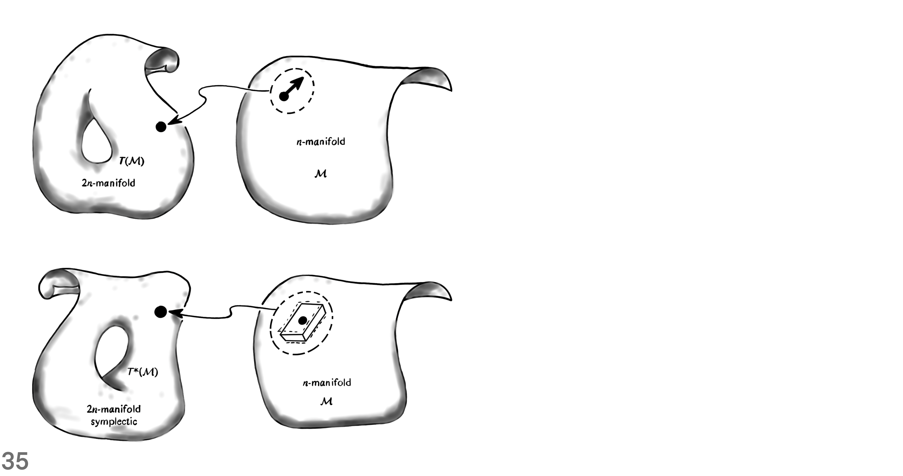
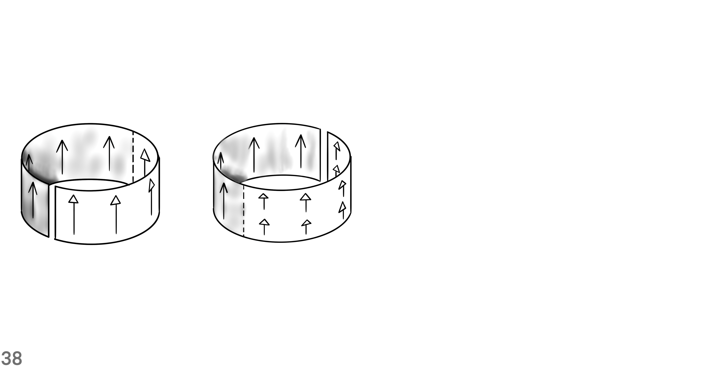

```@meta
Description = "News Report"
```

# Lede

Show a small piece of the story.


# Context

## Where, When, Who, What, How and Why?

Tell us the facts of the story.


## Where and When


[Transformations](https://github.com/iamazadi/Porta.jl/blob/master/models/newsreport/spacetime/fig11transformations.jl)

An active Poincaré transformation sends the world vector ``U`` at point ``O`` to a world vector ``V`` at point ``\hat{O}``.
If the transformation also sends the the tetrad at ``O`` to a tetrad at ``\hat{O}``, then the coordinates of ``U`` are the same as those of ``V``.


[Y Negative](https://github.com/iamazadi/Porta.jl/blob/master/models/newsreport/spacetime/fig12ynegative.jl)

The abstract sphere ``\mathcal{y}^-`` of past null directions represents the observer's celectial sphere in a natural way.
The sphere ``S^-``, or its projection to sphere ``S``, gives a more concrete but less invariant realization.


[Stereographic Projection](https://github.com/iamazadi/Porta.jl/blob/master/models/newsreport/spacetime/fig13stereographicprojection.jl)

The stereographic peojection sends points from the sphere ``S^+`` into the Argand plane.
For that purpose, choose the North Pole as a point from which the map projects all other points in the sphere.
Then, the union of the plane and the point at infinity yields the Riemann sphere.


[Spherical Coordinates](https://github.com/iamazadi/Porta.jl/blob/master/models/newsreport/spacetime/fig14spherical.jl)

Light rays reaching the eyes of an observer pierce a sphere centered at the observer's position.
Specify a point in the celectial sphere with a latitude and a longitude.
The geometry of the equation ``\zeta = e^{i \phi} cot(\theta / 2)`` relates the spherical polar angles ``\theta`` and ``\phi`` to the complex stereographic coordinate ``\zeta``.


[Stereographic Projection](https://github.com/iamazadi/Porta.jl/blob/master/models/newsreport/spacetime/fig15stereographicprojection.jl)

In Minkowski space-time, the intersection of the null cone with a plane yields a sphere.
As the plane through curve segment ``ON`` varies it provides the stereographic projection.
The point ``P`` maps to point ``P^\prime``.
The parabolic intersection of the sectional plane with the cone has the same intrinsic Euclidean metric as the Argand plane.


[Four-Screw](https://github.com/iamazadi/Porta.jl/blob/master/models/newsreport/spacetime/fig1678fourscrew.jl)

A Lorentz transformations in Minkowski space-time chooses an inertial frame for an observer.
The properties of Lorentz transformations are best shown on the Riemann sphere because it has all the null directions of an observer.
A proper rotation and a boost in the ``z`` direction combine together to make a four-screw.


[Null Rotation](https://github.com/iamazadi/Porta.jl/blob/master/models/newsreport/spacetime/fig19nullrotation.jl)

A null rotation is a type of Lorentz transformation where a single point is left as the only fixed point.
The rigid transformation of the Argand plane projects to a transformation on the Riemann sphere.
For the Riemann sphere, the points are displaced along circles through the south pole tangent to the y-direction there.


[Null Flag](https://github.com/iamazadi/Porta.jl/blob/master/models/newsreport/spacetime/fig110nullflag.jl)

A null cone is in the tangent space of spacetime at point ``O``.
The representation of a spin-vector requires a pair of infinitesimally separated points on ``\mathcal{y}^+``.
A spin-vector is shown in terms of points ``P`` and ``P^\prime`` of a null flag.


[Cross-Sections](https://github.com/iamazadi/Porta.jl/blob/master/models/newsreport/spacetime/fig111crosssections.jl)

The curve segment connecting point ``O`` to point ``N`` represents the temporal direction.
The temporal direction is normal to a cross-section of the null cone.
The angle between the temporal direction of the two sections determines a metric that measures lengths and angles.
After a transformation in the linear space of the generators of the cone, the sides of triangles are multiplied by a scalar number.


[SO(3)](https://github.com/iamazadi/Porta.jl/blob/master/models/newsreport/spacetime/fig112specialorthogonal3.jl)

Construct a complicated object by annihilating and creating boundaries.
Look at transformations in the tangent bundle, in order to mark the orientation of boundaries.
Follow the following 9 steps for building a tangent bundle on the 3-sphere.

1. Mark the boundary of one copy of ``SO(3)`` with sixteen vertices of a hypercube.
2. Make a tangent frame at origin point ``O`` and parallel transport it to the marked points.
3. Mark the frames with identifier ``I``.
4. Parallel transport a triad from point ``O`` to a boundary point.
5. Switch coordinate charts from chart ``N`` to chart ``S``.
6. Parallel transport the triad to the center of the counterpart copy of ``SO(3)``.
7. Parallel transport the frame to the boundary points, from the center of the other copy of ``SO(3)``.
8. Mark the frames that are parallel transported from the center of chart ``S`` at origin ``O`` with identifier ``II``.
9. Compare them with frames originated from the center of chart ``N`` at origin ``O``.

The twist in frames ``I`` compared to frames ``II`` is like the reorientation of 3D objects in the Euclidean three-dimensional space.
Even though both copies of ``SO(3)`` represent the same 3D orientation, they are distinguished from each other as points in the special linear group of complex dimension two ``SL(2,C)``.

The equivalence class of twisted frames at boundary points defines a group of rotations ``SO(3)``.
The clutching construction makes an associated vector bundle on the 3-dimensional sphere ``S^+``.
The construction creates a vector bundle through a continuous function denoted by ``f``.
The clutching function resolves the conflicts of tangent frames along the boundary.
It does so by producing an image elements in ``SO(3)`` given an element in ``SO(3) \times SO(3)``, over the intersectional region.


[Dirac's scissors problem](https://github.com/iamazadi/Porta.jl/blob/master/models/newsreport/spacetime/fig113diracsscissors.jl)

A line passing through the North Pole intersects a section at point ``P`` and makes a corresponding intersection on the other section.
For showing the metric structure of the sections we choose three points close to each other such that they make similar triangles in every section.
Dirac’s scissors problem says that a continuous rotation of the structure through ``2\pi`` toggles the sign of the half plane that is attached to it.
For toggling back the sign of the half plane, another rotation through ``2\pi`` is needed.


[Spin structure: one-to-two relation between ``O^{\uparrow}_+(1,3)`` and ``SL(2,\mathbb{C})``](https://github.com/iamazadi/Porta.jl/blob/master/models/newsreport/spacetime/fig114onetotworelation.jl)

This is a one-to-two relation between a restricted Lorentz transformation and the special linear group of complex dimension two, up to a boost.
The topology of the relation is like the one-to-two relation between the special orthogonal group of real dimension three and the special unitary group of complex dimension two.
The geometric structure of similar triangles with vertices: ``P``, ``P^\prime`` and ``P^{\prime\prime}``, undergoes unrestricted spin transformations.


[A null flag bundle](https://github.com/iamazadi/Porta.jl/blob/master/models/newsreport/spacetime/fig115nullflagbundle.jl)

The null-flag bundle ``F`` of ``M``, and its twofold covering space, the spin-vector bundle ``F^\prime`` are shown.
The bundle projection map sends a null-flag to an event in space-time M.
Null-flags in the fiber space are 4-dimensional, which make the total space of the null-flag bundle 8-dimensional.


[A unique frame ``ABCD``](https://github.com/iamazadi/Porta.jl/blob/master/models/newsreport/spacetime/fig116uniqueframe.jl)

The map to ``\mathbb{R}^4``, of future null cone and null flag, provides, in continuous fashion, a unique frame ``ABCD``.
The following 8 steps construct a unique frame that is right-handed and orthonormal with respect to the Euclidean metric of ``\mathbb{R}^4``.
1. Generate a spin-vector with two complex numbers and a time sign.
2. Use vector sum and the antipode of the spin-vector to find the timelike vector inside the future null cone.
3. Generate another spin-vector off of the first spin-vector such that the two spin-vectors make a null flag.
4. Normalize the sum of the flagpole of the original spin-vector and the flagpole of its antipode to give vector ``A`` in Minkowski vector space.
5. Calculate the axis ``B`` by projecting the flagpole to the orthogonal complement hyperplane that has ``A`` as its normal vector.
6. Calculate axis ``C`` by summing the spin-vector that is infinitesimally close to the original spin-vector with the negative of the original spin-vector.
7. Project the result onto the orthogonal hyperplane where ``A`` is its normal.
8. Find axis ``D`` by subtracting every partial component that is along ``A``, ``B`` or ``C`` from a random vector.


[A spin-frame](https://github.com/iamazadi/Porta.jl/blob/master/models/newsreport/spacetime/fig117spinframe.jl)

What is the relation between a spin-frame and a Minkowski tetrad?
A spin-frame is in a vector space over complex numbers.
The spin space has the axioms of an abstract vector space.
If a spin-vector is in ``S^-``, then under restricted spin-transformations it does not leave the sphere ``S^-`` to ``S^+``.


[Spin-vectors in terms of ``S^+``](https://github.com/iamazadi/Porta.jl/blob/master/models/newsreport/spacetime/fig118spinvectorssplus.jl)

A spin-vector is a ratio between a pair of complex numbers, along with a time sign.
Spin-vectors exist in a spin-space that is equipped with three operations: scalar multiplication, inner product and addition.
Unless an unrestricted Lorentz transformation is applied, spin-vectors remain in either the sphere of past null directions ``S^-`` or ``S^+``.


[Sum of angles](https://github.com/iamazadi/Porta.jl/blob/master/models/newsreport/spacetime/fig119sumofangles.jl)

In the sphere of future null directions ``S^+``, a circle connects three points: the north pole ``N``, point ``P`` and point ``Q``.
At point ``P`` a tangent vector is denoted by ``L``. Also, at point ``Q`` a tangent vector is denoted by ``M``.
Any circle on ``S^+`` through points ``P`` and ``Q`` makes the same sum-of-angles with arrows ``L`` and ``M``.


[Argument of the inner product](https://github.com/iamazadi/Porta.jl/blob/master/models/newsreport/spacetime/fig120innerproductphase.jl)

The inner product of two spin-vectors ``\omega`` and ``\kappa`` is a complex number.
When they are combined in a linear fashion, the flagpoles of ``\omega`` and ``\kappa`` span a 2-plane.
Perform these 4 steps in order to calculate the argument of the scalar product.
1. Use the Gram-Schmidt orthogonalization method to find the orthogonal complement of the 2-plane.
2. Find the intersection of the flagplanes of ``\kappa`` and ``\omega`` with the orthogonal complement 2-plane from the previous step.
3. The flagplane of ``\kappa`` intersects along the line ``U``, whereas the flagplane of ``\omega`` intersects along the line ``V``.
4. Find the angle between ``U`` and ``V`` to measure the argument of the inner product: ``\pi + 2 arg\{\kappa, \omega\}`` (mod ``2\pi``).


[Sum of spin-vectors in terms of ``S^+``](https://github.com/iamazadi/Porta.jl/blob/master/models/newsreport/spacetime/fig121spinvectorsum.jl)

The addition of spin-vectors ``\kappa`` and ``\omega`` results in another spin-vector ``\kappa + \omega`` in the spin-space.
The tails of the flagpoles of ``\kappa``, ``\omega`` and ``\kappa + \omega`` are in a circle.
The circumcircle of the triangle made by joining the the three spin-vectors makes the same angle with each of the flagpoles.


[Sum of spin-vectors in terms of the Argand plane](https://github.com/iamazadi/Porta.jl/blob/master/models/newsreport/spacetime/fig122spinvectorssumargandplane.jl)

This shows the sum of spin-vectors in a special Lorentz frame that brings out the symmetry at a spacetime event.
In this inertial frame, we have three mappings in a circular fashion: ``\kappa \mapsto -\omega``, ``\omega \mapsto \kappa + \omega``, and ``\kappa + \omega \mapsto \kappa``.
This way, the flagpole pair and their sum are collinear in the Argand plane.


[A special frame that brings out the symmetry of spin-vector sum](https://github.com/iamazadi/Porta.jl/blob/master/models/newsreport/spacetime/fig123specialframe.jl)

This special frame brings out the symmetry of spin-vector sum.
In this inertial frame, we have four mappings in a circular fashion:
1. ``\kappa \mapsto \frac{1}{\sqrt{2}} (\kappa - \omega)``
2. ``\frac{1}{\sqrt{2}} (\kappa - \omega) \mapsto -\omega``
3. ``\omega \mapsto \frac{1}{\sqrt{2}} (\kappa + \omega)``
4. ``\frac{1}{\sqrt{2}} (\kappa + \omega) \mapsto \kappa``
The two spin-vectors, along with their sum and subtraction, all are in a straight line.

For example, the Standard Model is formulated on 4-dimensional Minkowski spacetime, over which all fiber bundles can be trivialized and spinors have a simple explicit description.
For the Symmetries relevant in field theories, the groups act on fields and leave the Lagrangian or the action (the spacetime integral over the Lagrangian) invariant.
In theoretical physics, Lie groups like the Lorentz and Poincaré groups, which are related to spacetime symmetries, and gauge groups, defining *internal* symmetries, are important cornerstones.
Lie algebras are also important in gauge theories: *connections on principal bundles*, also known as *gauge boson fields*, are (locally) 1-forms on spacetime with values in the Lie algebra of the gauge group.
The Lie algebra ``SL(2,\mathbb{C})`` plays a special role in physics, because as a real Lie algebra it is isomorphic to the Lie algebra of the *Lorentz group* of 4-dimensional spacetime.
At least locally, fields in physics can be described by maps on spacetime with values in vector spaces.

The adjoint representation is also important in physics, because *gauge bosons* correspond to fields on spacetime that transform under the adjoint representation of the gauge group.
As we will discuss in Sect. 6.8.2 in more detail, the group ``SL(2,\mathbb{C})`` is the (*orthochronous*) *Lorentz spin group*, i.e. the universal covering of the identity component of the Lorentz group of 4-dimensional spacetime.
The fundamental geometric opbject in a gauge theory is a principal bundle over spacetime with *structure group* given by the gauge group.
The fibers of a principal bundle are sometimes thought of as an internal space at every spacetime point, not belonging to spacetime itself.
Fiber bundles are indispensible in gauge theory and physics in the situation where spacetime, the *base manifold*, has a non-trivial topology.

It also happens if we compactify (Euclidean) spacetime ``\mathbb{R}^4`` to the 4-sphere ``S^4``.
In these situations, fields on spacetime often cannot be described simply by a map to a fixed vector space, but rather as *sections* of a non-trivial vector bundle.
We will see that this is similar to the difference in special relativity between Minkowski spacetime and the choice of an inertial system.
This can be compared, in special relativity, to the choice of an inertial system for Minkowski spacetime ``M``, which defines an identification on ``M \cong \mathbb{R}^4``.
Of course, different choices of gauges are possible, leading to different trivializations of the principal bundle, just as different choices of inertial systems lead to different identifications of spacetime with ``\mathbb{R}^4``.

Note that, if we consider principal bundles over Minkowski spacetime ``\mathbb{R}^4``, it does not matter for this discussion that principal bundles over Euclidean spaces are always trivial by Corollary 4.2.9.
This is very similar to special relativity, where spacetime is trivial, i.e. isomorphic to ``\mathbb{R}^4`` with a Minkowski metric, but what matters is the independence of the actual trivialization, i.e. the choice of inertial system.
Table 4.2 Comparison between notions for special relativity and gauge theory

|                    | Manifold                     | Trivialization                               | Transformations and invariance |
| :----------------- | :--------------------------: | :------------------------------------------: | -----------------------------: |
| Special relativity | Spacetime ``M``              | ``M \cong \mathbb{R}^4`` via inertial system | Lorentz                        |
| Gauge theory       | Principal bundle ``P \to M`` | ``P \cong M \times G`` via choice of gauge   | Gauge                          |

It follows that, given a local gauge of the gauge bundle ``P``, the section in ``E`` corresponds to a unique local map from spacetime into the vector space ``V``.
In particular, we can describe matter fields on a spacetime diffeomorphic to ``\mathbb{R}^4`` by unique maps from ``\mathbb{R}^4`` into a vector space, *once a global gauge for the principal bundle has been chosen*.
At least locally (after a choice of local gauge) we can interpret connection 1-forms as fields on spacetime (the base manifold) with values in the Lie algebra of the gauge group.
Notice that connections are **not unique** (if ``dim M, dim G \ge 1``), not even in the case of trivial principal bundles (all connections that appear in the Standard Model over Minkowski spacetime, for example, are defined on trivial principal bundles).
The diffeomorphism group ``Diff(M)`` of spacetime ``M`` plays a comparable role in general relativity.

This is related to the fact that gauge theories describe local interactions (the interactions occur in single spacetime points).
The local connection 1-form is thus defined on an open subset in the base manifold ``M`` and can be considered as a "field on spacetime" in the usual sense.
Generalized Electric and Magnetic Fields on Minkowski Spacetime of Dimension 4
In quantum field theory, the gauge field ``A_{\mu}`` is a function on spacetime with values in the operators on the Hilbert state space ``V`` (if we ignore for the moment questions of whether this operator is well-defined and issues of regularization).
By Corollary 5.13.5 this difference can be identified with a 1-form on spacetime ``M`` with values in ``Ad(P)``.

In physics this fact is expressed by saying that gauge bosons, the differences ``A_{\mu}-A_{\mu}^0``, are fields on spacetime that transform in the adjoint representation of ``G`` under gauge transformations.
In the case of Minkowski spacetime, rotations correspond to Lorentz transformations.
The pseudo-Riemannian case, like the case of Minkowski spacetime, is discussed less often, even though it is very important for physics (a notable exception is the thorough discussion in Helga Baun's book [13]).
``\mathbb{R}^{s,1}`` and ``\mathbb{R}^{1,t}`` are the two versions of *Minkowski spacetime* (both versions are used in physics).
This includes the particular case of the Lorentz group of Minkowski spacetime.

However, as mentioned above, depending on the convention, 4-dimensional Minkowski spacetime in quantum field theory can have signature ``(+,-,-,-)``, so that time carries the plus sign.
Example 6.1.20 For applications concerning the Standard Model, the most important of these groups is the proper orthochronous Lorentz group ``SO^+(1,3) \cong SO^+(3,1)`` of 4-dimensional Minkoeski spacetime.
They are physical gamma matrices for ``Cl(1,3)``, i.e. for the Clifford algebra of Minkowski spacetime with signature ``(+,-,-,-)``, in the so-called *Weyl representation* or *chiral representation*.
Example 6.3.18 Let ``\Gamma_a`` and ``\gamma_a = i \Gamma_a`` be the physical and mathematical gamma matrices for ``Cl(1,3)`` considered in Example 6.3.17. If we set ``\Gamma_a^\prime = \gamma_a``, ``\gamma_a^\prime = i \Gamma_a^\prime = -\Gamma_a``, then these are physical and Mathematical gamma matrices for ``Cl(1,3)`` of Minkowski spacetime with signature ``(-,+,+,+)``.
Example 6.3.24 For Minkowski spacetime of dimension 4 we have Table 6.1 Complex Clifford algebras

| ``n`` | ``Cl(n)``                                      | ``Cl^0(n)``                                            | ``N``           |
| :---- | :--------------------------------------------: | :----------------------------------------------------: | --------------: |
| Evan  | ``End(\mathbb{C}^N)``                          | ``End(\mathbb{C}^{N/2}) \oplus End(\mathbb{C}^{N/2})`` | ``2^{n/2}``     |
| Odd   | ``End(\mathbb{C}^N) \oplus End(\mathbb{C}^N)`` | ``End(\mathbb{C}^N)``                                  | ``2^{(n-1)/2}`` |

Table 6.2 Real Clifford algebras

| ``\rho \ mod \ 8`` | ``Cl(s,t)``                                    | ``N``           |
| :----------------- | :--------------------------------------------: | --------------: |
| ``0``              | ``End(\mathbb{R}^N)``                          | ``2^{n/2}``     |
| ``1``              | ``End(\mathbb{C}^N)``                          | ``2^{(n-1)/2}`` |
| ``2``              | ``End(\mathbb{H}^N)``                          | ``2^{(n-2)/2}`` |
| ``3``              | ``End(\mathbb{H}^N) \oplus End(\mathbb{H}^N)`` | ``2^{(n-3)/2}`` |
| ``4``              | ``End(\mathbb{H}^N)                         `` | ``2^{(n-2)/2}`` |
| ``5``              | ``End(\mathbb{C}^N)``                          | ``2^{(n-1)/2}`` |
| ``6``              | ``End(\mathbb{R})``                            | ``2^{n/2}``     |
| ``7``              | ``End(\mathbb{R}^N) \oplus End(\mathbb{R}^N)`` | ``2^{(n-1)/2}`` |

Table 6.3 Even part of real Clifford algebras

| ``\rho \ mod \ 8`` | ``Cl^0(s,t)``                                  | ``N``           |
| :----------------- | :--------------------------------------------: | --------------: |
| ``0``              | ``End(\mathbb{R}^N) \oplus End(\mathbb{R}^N)`` | ``2^{(n-2)/2}`` |
| ``1``              | ``End(\mathbb{R}^N)``                          | ``2^{(n-1)/2}`` |
| ``2``              | ``End(\mathbb{C}^N)``                          | ``2^{(n-2)/2}`` |
| ``3``              | ``End(\mathbb{H}^N)``                          | ``2^{(n-3)/2}`` |
| ``4``              | ``End(\mathbb{H}^N) \oplus End(\mathbb{H}^N)`` | ``2^{(n-4)/2}`` |
| ``5``              | ``End(\mathbb{H}^N)``                          | ``2^{(n-3)/2}`` |
| ``6``              | ``End(\mathbb{C^N})``                          | ``2^{(n-2)/2}`` |
| ``7``              | ``End(\mathbb{R}^N)``                          | ``2^{(n-1)/2}`` |

``Cl(1,3) \cong End(\mathbb{R}^4)``

``Cl(3,1) \cong End(\mathbb{H}^2)``

``Cl^0(1,3) \cong Cl^0(3,1) \cong End(\mathbb{C}^2)``

Example 6.6.7 For Minkowski spacetime ``\mathbb{R}^{n-1,1}`` of dimension ``n`` we have ``n = \rho + 2``.

We see that in Minkowski spacetime of dimension 4 there exist both Majorana and Weyl spinors of real dimension 4, but not Majorana-Weyl spinors.
In quantum field theory, spinors become fields of operators on spacetime acting on a Hilbert space.
Explicit formulas for Minkowski Spacetime of Dimension 4
We collect some explicit formulas concerning Clifford algebras and spinors for the case of 4-dimensional Minkowski spacetime.
In Minkowski spacetime of dimension 4 and signature ``(+,-,-,-)`` (usually used in quantum field theory) there exist both Weyl and Majorana spinors, but not Majorana-Weyl spinors.
Our aim in this subsection is to prove that the orthochronous spin group ``Spin^+(1,3)`` of 4-dimensional Minkowski spacetime is isomorphic to the 6-dimensional Lie group ``SL(2,\mathbb{C})``.

# The Story

## Who


With the discovery of a new particle, announced on 4 July 2012 at CERN, whose properties are "consistent with the long-sought Higgs boson" [31], the final elementary particle predicted by the classical Standard Model of particle physics has been found.
Interactions between fields corresponding to elementary particles (quarks, leptons, gauge bosons, Higgs bosons), determined by the Lagrangian.
The Higgs mechanism of mass generation for gauge bosons as well as the mass generation for fermions via Yukawa couplings.
The fact that there are 8 *gluons*, 3 *weak gauge bosons*, and 1 *photon* is related to the dimensions of the Lie groups ``SU(3)`` and ``SU(2) \times U(1)``.
Lie algebras are also important in gauge theories: *connections on principal bundles*, also known as *gauge boson fields*, are (locally) 1-forms on spacetime with values in the Lie algebra of the gauge group.

The adjoint representation is also important in physics, because *gauge bosons* correspond to fields on spacetime that transform under the adjoint representation of the gauge group.
We also discuss special scalar products on Lie algebras which will be used in Sect. 7.3.1 to construct Lagrangians for gauge boson fields.
The gauge bosons corresponding to these gauge groups are described by the *adjoint representation* that we discuss in Sect. 2.1.5.
The representation ``Ad_H`` describes the representation of the gauge boson fields in the Standard Model.
The fact that these scalar products are positive definite is important from a phenomenological point of view, because only then do the kinetic terms in the Yang-Mills Lagrangian have the right sign (the gauge bosons have positive kinetic energy [148]).

*Connections* on principal bundles, that we discuss in Chap. 5, correspond to *gauge fields* whose particle excitations in the associated quantum field theory are the *gauge bosons* that transmit interactions.
These fields are often called *gauge fields* and correspond in the associated quatum field theory to *gauge bosons*.
This implies a direct interaction between gauge bosons (the gluons in QCD) that does not occur in abelian gauge theories like quantum electrodynamics (QED).
The difficulties that are still present nowadays in trying to understand the quantum version of non-abelian gauge theories, like quantum chromodynamics, can ultimately be traced back to this interaction between gauge bosons.
The real-valued fields ``A_\mu^a \in C^\infty(U,\mathbb{R})`` and the corresponding real-valued 1-forms ``A_s \in \Omega^1(U)`` are called *(local) gauge boson fields*.

In physics, the quadratic term ``[A_\mu, A_\nu]`` in the expression for ``F_{\mu\nu}`` (leading to cubic and quartic terms in the *Yang-Mills Lagrangian*, see Definition 7.3.1 and the corresponding local formula in Eq. (7.1)) is interpreted as a direct interaction between gauge bosons described by the gauge field ``A_\mu``.
This explains why gluons, the gauge bosons of QCD, interact directly with each other, while photons, the gauge bosons of QED, do not.
This non-linearity, called *minimal coupling*, leads to non-quadratic terms in the Lagrangian (see Definition 7.5.5 and Definition 7.6.2 as well as the local formulas in Eqs. (7.3) and (7.4)), which are interpreted as an interaction between gauge bosons described by ``A_\mu`` and the particles described by the field ``\phi``.
We then get a better understanding of why gauge bosons in physics are said to transform under the adjoint representation.

Strictly speaking, gauge bosons, the excitations of the gauge field, should then be described classically by the difference ``A - A^0``, where ``A`` is some other connection 1-form and not by the field ``A`` itself.
In physics this fact is expressed by saying that gauge bosons, the differences ``A_\mu - A_\mu^0``, are fields on spacetime that transform in the adjoint represntation of ``G`` under gauge transformations.
Gauge fields correspond to gauge bosons (spin 1 particles) and are described by 1-forms or, dually, vector fields.
Even though spinors are elementary objects, some of their properties (like the periodicity modulo 8, real and quaternionic structures, or bilinear and Hamiltonian scalar products) are not at all obvious, already on the level of linear algebra, and do not have a direct analogue in the bosonic world of vectors and tensors.
The existence of **gauge symmetries** is particularly important: it can be shown that a quantum field theory involving massless spin 1 bosons can be consistent (i.e. unitary, see Sect. 7.1.3) only if it is gauge invariant [125,143].

### Graph


**Edward Witten** *(1987)*:

If one wants to summarize our knowledge of physics in the briefest possible terms, there are three really fundamental observations:

1. Spacetime is a pseudo-Riemannian manifold ``M``, endowed with a metric tensor and governed by geometrical laws.

2. Over ``M`` is a Principal G-bundle ``X`` with a nonabelian gauge group ``G``.

3. Fermions are sections of ``(\hat{S}_+ \otimes V_R) \oplus (\hat{S}_- \otimes V_{\tilde{R}})``. ``R`` and ``\tilde{R}`` are not isomorphic; their failure to be isomorphic explains why the light fermions are light and presumably has its origins in a representation difference ``\Delta`` in some underlying theory.

All of this must be supplemented with the understanding that the geometrical laws obeyed by the metric tensor, the gauge fields, and the fermions are to be interpreted in quantum mechanical terms.

## What


The Higgs mechanism of mass generation for gauge bosons as well as the mass generation for fermions via Yukawa couplings.
Spin groups such as the universal covering of the Lorentz group and its higher dimesnional analogues, are also important in physics, because they are involved in the mathematical description of fermions.
Counting in this way, the Standard Model thus contains at the most elementary level 90 fermions (particles and antiparticles).
The complex vector space ``V`` of fermions, which carries a representation of ``G``, has dimension 45 (plus the same number of corresponding antiparticles) and is the direct sum of the two G-invariant subspaces (sectors): a lepton sector of dimension 9 (where we do not include the hypothetical right-handed neutrinos) and a quark sector of dimension 36.
Matter fields in the Standard Model, like quarks and leptons, or sacalar fields, like the Higgs field, correspond to sections of vector bundles *associated* to the principal bundle (and twisted by *spinor bundles* in the case of fermions).

For example, in the Standard Model, one generation of fermions is described by associated complex vector bundles of rank 8 for left-handed fermions and rank 7 for right-handed fermions, associated to representations of the gauge group ``SU(3) \times SU(2) \times U(1)``.
Matter fields in physics are described by smooth sections of vector bundles ``E`` associated to principal bundles ``P`` via the representations of the gauge group ``G`` on a vector space ``V`` (in the case of fermions the associated bundle ``E`` is twisted in addition with a *spinor bundle* ``S``, i.e. the bundle is ``S \otimes E``).
Additional matter fields, like fermions or scalars, can be introduced using associated vector bundles.
These particles are fermions (spin ``\frac{1}{2}`` particles) and are described by spinor fields (spinors).
Dirac forms are used in the Standard Model to define a **Dirac mass term** in the Lagrangian for all fermions (except possibly neutrinos) and, together with the Dirac operator, the **kinetic term** and the **interaction term**; see Sect. 7.6.
This is related to the fact that the weak interaction in the Standard Model is not invariant under parity inversion that exchanges left-handed with right-handed fermions.

# Perspective

## How


[The particular case of a *trivial* bundle and the general case of a *twisted* bundle](https://github.com/iamazadi/Porta.jl/blob/master/models/newsreport/gaugeconnections/fig153bundle.jl)

There is a Cartesian product ``M \times V``, above a local open region of the base manifold.
In a trivial bundle, the points of the fiber bundle are tuples of elements in base ``M`` and fiber ``V``.
In the case of a nontrivial fiber bundle, use multiple coordinate charts to cover the base manifold ``M``.


[How twisting in a fiber bundle occurs.](https://github.com/iamazadi/Porta.jl/blob/master/models/newsreport/gaugeconnections/fig154twisting.jl)

Suppose that the base manifold ``M`` is the skin of the globe.
Further, suppose that the fiber manifold ``V`` is a one-dimensional vector space.
Then, the total space of the trivial bundle is like a torus of revolution, whereas the twisted bundle is like the Mobius strip.


[How to glue two copies of the Riemann sphere for constructing a vector bundle.](https://github.com/iamazadi/Porta.jl/blob/master/models/newsreport/gaugeconnections/fig155gluingspheres.jl)

The clutching construction makes a vector bundle over the sphere.
The twist occurs at the boundary of the two charts.
Clutching construction gives a continuous vector field globally.

1. Bring two copies of a 2-dimensional sphere side by side.
2. Remove the south pole as a point from the Riemann sphere in order to make an open complex plane.
3. Transform each copy of the complex plane into an open disk using azimuthal equidistant projection.
4. Put the two open disks on top of each other and identify the corresponding points across the boundaries such that they make a closed two-surface with the identification.
5. Change the sign of latitude coordinates in one of the disks and then glue them along their boundaries.
6. Inflate the resulting closed two-surface after gluing for making a unit two-sphere.


[A cross-section of a fiber bundle](https://github.com/iamazadi/Porta.jl/blob/master/models/newsreport/gaugeconnections/fig156crosssection.jl)

A cross section of a bundle is a continuous image of the base manifold.
A section intersects each individual fiber in a single point.
The bundle projection map of a section gives the identity.


[Compare a cross-section of a fiber bundle with the zero section.](https://github.com/iamazadi/Porta.jl/blob/master/models/newsreport/gaugeconnections/fig157zerosection.jl)

The complex plane extends to infinity in every direction from the origin.
But in the Riemann sphere, all directions from the north pole end up at the south pole in Antarctica.
The line bundle can have a global section, where in fact the Clifford bundle can’t have a global section.


[The Clifford bundle](https://github.com/iamazadi/Porta.jl/blob/master/models/newsreport/gaugeconnections/fig158cliffordbundle.jl)

Let ``q`` be a unit quaternion number and its antipodal point ``-q`` is its negative.
The point``q`` is in the unit circle, which is embedded in the two-complex-dimensional plane.
In the plane ``\mathbb{C}^2`` the unit 3-sphere coordinates assert that ``|w|^2 + |z|^2 = 1``.


[The bundle of unit tangent vectors to ``S^2``](https://github.com/iamazadi/Porta.jl/blob/master/models/newsreport/gaugeconnections/fig1510unittangentbundle.jl)

The fibers of the tangent bundle to ``S^2`` are circles.
But, each circle-fiber of the Clifford bundle wraps twice around each circle-fiber of the tangent bundle to ``S^2``.
Wrapping around each circle-fiber of the Clifford bundle once yields the antipodal point in the 3-sphere.


[An example of a complex line bundle](https://github.com/iamazadi/Porta.jl/blob/master/models/newsreport/gaugeconnections/fig1511complexlinebundle.jl)

In the complex 2-plane ``w-z``, the unit circle is given by the equation ``|w|^2 + |z|^2 = 1``.
The complex line bundle is the entire complex line, given by ``Aw + Bz = 0``, where ``A`` and ``B`` are complex numbers.
In the complex line bundle, the base space is the ratio ``A : B``, which is proportional to the slope of the line.



[The tangent bundle and the cotangent bundle](https://github.com/iamazadi/Porta.jl/blob/master/models/newsreport/gaugeconnections/fig1512cotangentbundle.jl)

Use the exponential function for translation along a direction in the tangent space to get a tangent vector at ``q``.
Specify a cross-section of the tangent bundle in order to have a nowhere vanishing vector field.
Define a 1-form by fixing one of the arguments of a scalar product, using elements from the nowhere vanishing vector field.


[A strained line bundle over ``S^1`` with a stretch by a positive factor](https://github.com/iamazadi/Porta.jl/blob/master/models/newsreport/gaugeconnections/fig1516strainedlinebundle.jl)

In order to go from a fixed point to another fixed point along the circle, two paths of different lengths are possible.
In the strained bundle, two horizontal flows are combined with a third flow in the vertical direction.
Measure the strain in the plane-fibers with a connection on the fiber bundle.


[Types of connection on a manifold](https://github.com/iamazadi/Porta.jl/blob/master/models/newsreport/gaugeconnections/fig1517typesofconnection.jl)

A tangent vector at a point in the base manifold ``\mathbb{R}^2`` is represented by a particular point in the fiber manifold ``S^1`` above it.
A horizontal curve in the tangent bundle ``T(\mathbb{R}^2)`` represents the parallel transportation of some vector along a curve in ``\mathbb{R}^2``.
*Constant transport* in the base ``\mathbb{R}^2`` is defined from a notion of *horizontal* in the circle-bundle ``\mathbb{R}^2 \times S^1``.



[How to make the connection of a strained line bundle over ``S^1``](https://github.com/iamazadi/Porta.jl/blob/master/models/newsreport/gaugeconnections/fig1518gluingforconnection.jl)

1. Remove a point from circle ``S^1`` to get a trivial region above it.
2. Apply a linear transformation to the fibers of a copy of the trivial region.
3. Identify the endpoints of the two trivial regions after splitting, such that they make the circle whole again.
A connection measures the scale difference in fibers above one of the regions compared with sections above the other region.


[A local path dependence with curvature](https://github.com/iamazadi/Porta.jl/blob/master/models/newsreport/gaugeconnections/fig1519localpathdependence.jl)

The bundle curvature is shown, as a horizontal loop fails to close above the unit circle.
A complex number, denoted by ``z``, sets the coordinate of a point in the base space ``\mathbb{C}``.
The unit circle ``S^1 \in \mathbb{C}`` is parameterized with ``z = e^{i \theta}``.


[A complex 1-dimensional vector space as the fiber space, where the *stretch* corresponds to multiplication by a real number.](https://github.com/iamazadi/Porta.jl/blob/master/models/newsreport/gaugeconnections/fig1520stretchbyrealnumbers.jl)

We use the explicit connection ``\nabla = \frac{\partial}{\partial z} - A``, where ``A`` is a complex smooth function of ``z``.
If function ``A`` is complex differentiable in a neighborhood of point ``z``, then the bundle curvature vanishes.
But, if ``A = 𝑖 × k × z``, then for the part of the bundle above the unit circle ``S^1`` we get a **real stretch** with a given value of ``k``.


[A complex 1-dimensional vector space as the fiber space, where the *stretch* corresponds to multiplication by a complex number.](https://github.com/iamazadi/Porta.jl/blob/master/models/newsreport/gaugeconnections/fig1521stretchbycomplexnumbers.jl)

One can also extend the symmetry of the fiber space into a 2-dimensional real vector space.
The fiber space can have a complex structure to make it a 1-dimensional complex vector space.
In that case, a **complex stretch** twists the connection ``\nabla`` through multiplication with a complex number ``\mathbb{C}``.

Hence, by the uniqueness of integral curves (which is a theorem about the uniqueness of solutions to ordinary differential equations) we have ``\phi_X(s) \cdot \phi_X(t) = \phi_X(s + t) \ \forall t \in I \cap (t_{min} - s, t_{max} - s)``.
This implies the claim by uniqueness of solutions of ordinary differential equations.
The unique solution of this differential equation for ``\gamma(t)`` is ``\gamma(t) = e^{tr(X)t}``.
Then ``e^D = \begin{bmatrix} e^{d_1} & 0 & 0 \\ 0 & e^{d_2} & 0 \\  & \ddots &  \\ 0 & 0 & e^{d_n} \end{bmatrix}`` and the equation ``det(e^D) = e^{d_1} ... e^{d_n} = e^{d_1 + ... + d_n} = e^{tr(D)}`` is trivially satisfied.
Then we can calculate: ``(R^*_gs)_p(X,Y) = \ <L_{(pg)^{-1}*}R_{g*}(X), L_{(pg)^{-1}*}R_{g*}(Y)> \ = \ <Ad_{g^{-1}} \circ L_{p^{-1}*}(X), Ad_{g^{-1}} \circ L_{p^{-1}*}(Y)>`` and ``s_p(X,Y) \ = \ <L_{p^{-1}*}(X), L_{p^{-1}*}(Y)>``, where in both equations we used that ``s`` is left invariant.

Lemma 3.3.3 For ``A \in Mat(m \times m, \mathbb{H})`` and ``v \in \mathbb{H}^m`` the following equation holds: ``det\begin{bmatrix}1 & v \\ 0 & A\end{bmatrix} = det(A)``.
Lemma 4.1.13 (Cocycle Conditions) The transition functions ``\{\phi_{ij}\}_{i,j \in I}`` satisfy the following equations:

- ``\phi_{ii}(x) = Id_F \ for \ x \in U_i``,
- ``\phi_{ij}(x) \circ \phi_{ji}(x) = Id_F \ for \ x \in U_i \cap U_j``,
- ``\phi_{ik}(x) \circ \phi_{kj}(x) \circ \phi_{ji}(x) = Id_F \ for \ x \in U_i \cap U_j \cap U_k``.

The third equation is called the **cocycle condition**.

5.5.2 The structure equation
Theorem 5.5.4 (Structure Equation) The curvature form ``F`` of a connection form ``A`` satisfies ``F = dA + \frac{1}{2}[A,A]``.

Proof We check the formula by inserting ``X,Y \in T_pP`` on both sides of the equation, where we distinguish the following three cases:
1. Both ``X`` and ``Y`` are vertical: Then ``X`` and ``Y`` are fundamental vectors, ``X = \tilde{V}_p, \ Y = \tilde{W}_p`` for certain elements ``V,W \in g``. We get ``F(X,Y) = dA(\pi_H(X), \pi_H(Y)) = 0``. On the other hand we have ``\frac{1}{2}[A,A](X,Y) = [A(X),A(Y)] = [V,W]``. The differential ``dA`` of a 1-form ``A`` is given according to Proposition A.2.22 by ``dA(X,Y) = L_X(A(Y))-L_Y(A(X))-A([X,Y])``, where we extend the vectors ``X`` and ``Y`` to vector fields in a neighbourhood of ``p``. If we choose the extension by fundamental vector fields ``\tilde{V}`` and ``\tilde{W}``, then ``dA(X,Y) = L_X(W) - L_Y(V) - [V,W] = -[V,W]`` since ``V`` and ``W`` are constant maps from ``P`` to ``g`` and we used that ``[\tilde{V},\tilde{W}] = \widetilde{[V,W]}`` according to Proposition 3.4.4. This implies the claim.
2. Both ``X`` and ``Y`` are horizontal: Then ``F(X,Y) = dA(X,Y)`` and ``\frac{1}{2}[A,A](X,Y) = [A(X), A(Y)] = [0,0]=0``. This implies the claim.
3. ``X`` is vertical and ``Y`` is horizontal: Then ``X = \tilde{V}_p`` for some ``V \in g``. We have ``F(X,Y) = dA(\pi_H(X),\pi_H(Y)) = dA(0, Y) = 0`` and ``\frac{1}{2}[A,A](X,Y) = [A(X),A(Y)] - [V,0] = 0``. Furthermore, ``dA(X,Y) = L_{\tilde{V}}(A(Y)) - L_Y(V) - A([\tilde{V},Y]) = -A([\tilde{V},Y]) = 0`` since ``[\tilde{V},Y]`` is horizontal by Lemma 5.5.5. This implies the claim.

The structure equation is very useful when we want to calculate the curvature of a given connection.

By the structure equation we have ``F = dA + \frac{1}{2} [A, A]`` so that ``dF = \frac{1}{2} d[A, A]``.

Proposition 5.6.2 (Local Structure Equation) The local field strength can be calculated as ``F_s = dA_s + \frac{1}{2}[A_s,A_s]`` and ``F_{\mu\nu} = \partial_\mu A_\nu - \partial_\nu A_\mu + [A_\mu, A_\nu]``.

It remains to check that ``F_M`` is closed. In a local gauge ``s`` we have according to the local structure equation ``F_s = dA_s + \frac{1}{2}[A_s,A_s]``.

Proposition 5.6.8 For the connection on the Hopf bundle the following equation holds: ``\frac{1}{2\pi i} \int_{S^2} F_{S^2} = 1``.

We write ``A_\mu = A_s(\partial_\mu), F_{\mu\nu} = F_s(\partial_\mu, \partial_\nu)`` and we have the local structure equation ``F_{\mu\nu} = \partial_\mu A_\nu - \partial_\nu A_\mu + [A_\mu, A_\nu]``.

We will determine ``g(t)`` as the solution of a differential equation.

Proof Properties 1-3 follow from the theory of ordinary differential equations. (Parallel transport)

These covariant derivatives appear in physics, in particular, in the Lagrangians and field equations defining gauge theories.

Recall that for the proof of Theorem 5.8.2 concerning the existence of a horizontal lift ``\gamma^*`` of a curve ``\gamma:[0,1] \to M`` where ``\gamma^*(0) = p \in P_{\gamma(0)}``, we had to solve the differential equation ``\dot{g}(t) = -R_{g(t)*} A(\dot{\delta}(t))``, with ``g(0) = e``, where ``\delta`` is some lift of ``\gamma`` and ``g:[0,1] \to G`` is a map with ``\gamma^*(t) = \delta(t) \cdot g(t)``.

Then the differential equation can be written as ``\frac{dg(t)}{dt} = -A_s(\dot{\gamma}(t)) \cdot g(t)``.

Path-ordered exponentials are useful, because they define solutions to the ordinary differential equation we are interested in.

Then uniqueness of the solution to ordinary differential equations show that ``g \equiv h``, hence ``g`` takes values in ``G``.

The solution to this differential equation is

``g(t) = P exp(- \int_0^t \sum_{\mu=1}^n A_{s\mu}(\gamma(s))\frac{dx^\mu}{ds}ds) = P exp(- \int_{\gamma(0)}^{\gamma(t)} \sum_{\mu=1}^n A_{s\mu} (x^\mu) dx^\mu) = P exp(- \int_{\gamma_t} A_s)``,
where ``\gamma_t`` denotes the restriction of the curve ``\gamma`` to ``[0,t]``.

What is the interpretation of the structure equation?

Taking the determinant of both sides of this equation shows that:

Lemma 6.1.7 Matrices ``A \in O(s,t)`` satisfy ``detA = \pm 1``.

``A^T \begin{bmatrix} I_s & 0 \\ 0 & -I_t \end{bmatrix} A = \begin{bmatrix} I_s & 0 \\ 0 & -I_t \end{bmatrix}``.

Remark 6.2.5 We can think of the linear map ``\gamma`` as a **linear square root** of the symmetric bilinear form ``-Q``: in the definition of Clifford algebras, it suffices to demand that ``\gamma(v)^2 = -Q(v,v) \cdot 1 \ \forall \ v, w \in V``, because, considering this equation for vectors ``v, w, v + w``, the equation ``\{\gamma(v), \gamma(w\} = -2Q(v, w) \cdot 1 \ \forall \ v, w \in V`` follows.

Lemma 6.3.6 Every chirality element ``\omega`` satisfies
- ``\{\omega,e_a\} = 0``
- ``[\omega,e_a \cdot e_b] = 0 \ \forall \ 1 \le a, b \le n``.

Proof The first equation follows from
``e_a \cdot \omega = \lambda e_a \cdot e_1 ... e_n = (-1)^{a - 1} \lambda e_1 ... e_a \cdot e_a ... e_n``

``\omega \cdot e_a = \lambda e_1 ... e_n \cdot e_a = (-1)^{n - a} \lambda e_1 ... e_a \cdot e_a ... e_n = -e_a \cdot \omega``,

since ``n`` is even. The second equation is a consequence of the first.

Let ``\Gamma_1, ..., \Gamma_n`` be physical gamma matrices. We set

``\Gamma_a = \eta^{ac} \Gamma_c``,

``\Gamma^{bc} = \frac{1}{2} [\Gamma^b, \Gamma^c] = \frac{1}{2} (\Gamma^b \Gamma^c - \Gamma^c \Gamma^b)``,

``\Gamma^{n + 1} = -i^{k + t} \Gamma^1 ... \Gamma^n``

and similarly for the mathematical ``\gamma``-matrices (in the first equation there is an implicit sum over ``c``; this is an instance of the Einstein summation convention). These matrices satisfy by Lemma 6.3.6

``\{\Gamma^{n + 1}, \Gamma^a\} = 0``,

``[\Gamma^{n + 1}, \Gamma^{bc}] = 0``,

``\gamma^{bc} = -\Gamma^{bc}``.

In the following examples we use the Pauli matrices

``\sigma_1 = \begin{bmatrix} 0 & 1 \\ 1 & 0 \end{bmatrix}``, ``\sigma_2 = \begin{bmatrix} 0 & -i \\ i & 0 \end{bmatrix}``, ``\sigma_3 = \begin{bmatrix} 1 & 0 \\ 0 & -1 \end{bmatrix}``.

It is easy to check that they satisfy the identities

``\sigma^2 = I_2 \ \ j = 1, 2, 3``,

``\sigma_j \sigma_{j + 1} = -\sigma_{j + 1} \sigma_{j} = i \sigma_{j + 2} \ \ j = 1, 2, 3``,

where in the second equation ``{j + 1}`` and ``j + 2`` are taken ``mod 3``.

``(\psi, \phi) = \psi^T C \phi``

Furthermore property 1. and 2. in Definition 6.7.1 are equivalent to

1. ``\gamma_a^T = \mu C \gamma_a C^{-1} \ \ for \ all \ a = 1, ..., s + t``.
2. ``C^T = \nu C``.

The first equation also holds with the physical Clifford matrices ``\Gamma_a`` instead of the mathematical matrices ``\gamma_a``.

There is an equivalent equation to the first one with physical Clifford matrices ``\Gamma_a : 1 \cdot \Gamma^\dagger_a = -\delta A \Gamma_a A^{-1} \ \ for \ all \ a = 1, ..., s + t``.

Furthermore, property 1. and 2. in Definition 6.7.8 are equivalent to:

1. ``\gamma_a^{\dagger} = \delta A \gamma_a A^{-1} \ \ for \ all \ a = 1, ..., s + t``.
2. ``A^{\dagger} = A``.

Given a spin structure on a pseudo-Riemannian manifold and the spinor bundle ``S``, we would like to have a covariant derivative on ``S`` so that we can define field equations involving derivatives of spinors.

### The Iconic Wall


#### What is F_A geometrically?

The loop integral of a connection at a point q along the edges of a parallelogram with infinitesimal edges is equal to the exterior derivative of the connection A, which in turn equals F. The exterior derivative of the connection 1-form A is a 2-form F, which has two indices downstairs in order to denote two inputs. The point q is a vertex of the infinitesimal parallelogram where two of the edges intersect. These edges are inputs to the 2-form F.

#### What are R_munu and R geometrically?

Whenever matter is not present, like inside vacuum, spacetime curves under tidal force fields that deform a sphere of test particles into an egg-shaped surface. However, when matter is present, then a volume-reducing force field deforms spacetime too. From the inverse-square law of Newtonian physics we understand gravity as the volume-preservation of the Ricci component of the Riemann curvature tensor. The Riemann curvature tensor is a three-piece object, two of whose components are denoted by R_munu and R. Einstein’s spacetime discards the Weyl component of the curvature tensor and calculates the scalar curvature component R by taking the trace of the Ricci curvature component.

#### How do they relate?

The role of the Weyl curvature is not explained by Einstein’s field equation, even though cosmological observations suggest a role for it on a large scale. Einstein’s field equation combines the tidal effects of preserving the volume of spatial planes with respect to time, R_munu, and changes in matter density which turn out to be the curvature scalar R.
What does this have to do with Penrose steps?
When the Riemann curvature tensor in the presence of matter shows R_munu not equal to zero, the vector fields that flow along spatial and temporal directions deviate from their orthogonal geodesics. The Ricci curvature takes two vectors as input and outputs a scalar number. For an infinitesimal parallelogram at a spacetime event, the Ricci scalar is just the integral of a 1-form along the edges of the infinitesimal parallelogram. The exterior derivative of the 1-from becomes nonzero and so parallel transport stretches the path of a tangent vector with multiplication by either a scalar or a complex number. In a principal U(1)-bundle, a circular path in the base space forms a stack of circles in the total space as a result of the stretch with multiplication (in the presence of matter.) Therefore, the trajectory of a tangent vector along a circular path on the base space forms a spiral in the total space, which resembles the shape of Penrose steps or the Escher staircase.

#### What are “horizontal subspaces” and what do they have to do with vector potentials and gauge fields?

A connection (denoted by A) on a principal G-bundle P assigns a horizontal subspace of the tangent space to each point q in P, in a smooth way. First, the tangent space of a principal bundle P at point q is equal to the direct sum of the vertical subspace and the horizontal subspace at q, for all q in P. Second, the push forward of the horizontal subspace of the Principal G-bundle P at point q by an action g of the structure group G is equal to the horizontal subspace of the principal G-bundle P at the transformation of the point q by the action g, for all g in G and q in P.
The Ricci curvature is 2-form with respect to a connection 1-form on spacetime. The 2-form that appears in the Yang-Mills Lagrangian is exact if and only if it is equal to the loop integral of a 1-form along the boundary of a very small oriented area (F_munu = dϕ). In other words, the loop integral of the 1-form ϕ, along the boundary of a region (a parallelogram) equals the integral of the exterior derivative of the 1-form over the region. But if this 1-form exists (an exact symmetry,) then the integral introduces a gauge potential, where one has the freedom to change the constant as a reference level, also known as a gauge transformation.


### Tome


# Wrap Up

## Why


[Configuration space](https://github.com/iamazadi/Porta.jl/blob/master/models/newsreport/lagrangians/fig201configurationspace.jl)

Each point in the configuration space represents a possible configuration of the chassis, reaction wheel and rolling wheel.
As the system evolves in time, a sequence of telemetry frames make a curve in the configuration space.
The behavior of the robot is constrained with a function that is defined on the tangent bundle of configuration space.


[The Lagrangian on the tangent bundle of configuration space ``T(\mathcal{C})`` vs. the Hamiltonian ``\mathcal{H}`` on the cotangent bundle ``T^*(\mathcal{C})`` (phase space)](https://github.com/iamazadi/Porta.jl/blob/master/models/newsreport/lagrangians/fig202phasespace.jl)

The total space of the Clifford bundle is located at a single spacetime event.
As an example, the Yang-Mills Lagrangian is the scalar product of a differential form on a principal G-bundle with itself.
Alternatively, the Hamiltonian is defined as a smooth function on the phase space, also known as the cotangent bundle of the configuration space.


[Hamilton's principle](https://github.com/iamazadi/Porta.jl/blob/master/models/newsreport/lagrangians/fig203hamiltonprinciple.jl)

One derives the equations of motion for (mostly) kinetic particles such as photons (and neutrinos) using Hamilton's principle.
A particle moves through the configuration space such that the integral of the Lagrangian along a path between two fixed points is stationary, under variations of the curve.
But, the Yang-Mills Lagrangian is an adjoint-invariant scalar product of the curvature 2-form on a principal G-bundle over spacetime.
The adjoint bundle is an associated vector bundle of the principal G-bundle, whose values represent the difference between two connections.


[Staitionary values of a smooth real-valued function ``f`` of several variables](https://github.com/iamazadi/Porta.jl/blob/master/models/newsreport/lagrangians/fig204stationaryvalues.jl)

Geodesic curves describe the shortest distance between two fixed points in a smooth manifold.
The exterior derivative of a scalar field at a stationary point is very small in every direction.
The tangent bundle of the configuration space of a dynamical system has geodesic curves, along which the integral of the Lagrangian is stationary. 


[The Hamiltonian flow](https://github.com/iamazadi/Porta.jl/blob/master/models/newsreport/lagrangians/fig205hamiltonianflow.jl)

The Hamiltonian flow is a section of the cotangent bundle of the configuration space.
The Newtonian time-evolution of a particle in free fall, follows a geodesic trajectory in the configuration space.
The stack of equally spaced parallel planes represents the gravitational work 1-form and its direction is downward.


[Small oscillations](https://github.com/iamazadi/Porta.jl/blob/master/models/newsreport/lagrangians/fig206smalloscillations.jl)

In 1583, Galileo observed that the period of small oscillations is independent of the the maximum distance away from the stable equilibrium point.
As it turns out, acceleration and position transform in a linear way, after expanding a power series of the Hamiltonian about the equilibrium point.
Since the pendulum rotate as a special orthogonal group, the pendulum’s Newtonian time-evolution is unitary.


[Liouville's theorem](https://github.com/iamazadi/Porta.jl/blob/master/models/newsreport/lagrangians/fig207liouvillestheorem.jl)

The boundary of the phase space represents a range of possible initial momentum states.
The shape of the boundary is distorted during the time-evolution of the physical system.
Liouville’s theorem states that the Hamiltonian flow preserves the volume of the initial phase-space boundary.


[The reduced phase space of ``T^*(\mathcal{C})``](https://github.com/iamazadi/Porta.jl/blob/master/models/newsreport/lagrangians/fig208phasespace.jl)

The value of the Hamiltonian function is constant throughout the motion, which implies the conservation of the sum of kinetic and potential energies.
In order to reduce the phase space, substract a partial component of momentum, as a result of projecting momentum onto the line tangent to the trajectory.
It’s remarkable that the reduced phase space can be the configuration space of a physical system.


[Hamilton's principle for field Lagrangians](https://github.com/iamazadi/Porta.jl/blob/master/models/newsreport/lagrangians/fig209fieldlagrangians.jl)

The Yang-Mills Lagrangian is the magnitude of a 2-form with respect to a connection 1-form on spacetime.
The 2-form has an exact symmetry if and only if it is equal to the loop integral of a 1-form along the boundary of an oriented area.
But if this 1-form exists, then the integral introduces a scalar constant, and one has the freedom to transform the gauge as a reference level.

Points in S³ are represented by unit Quaternion numbers (vectors in ℝ⁴.)
Multiplication on both the left and right sides of a Quaternion number with another Quaternion preserves the round metric on S³.
There are three different flows on the surface of the 3-sphere.
The first flow is in the direction of the vector field K₁, the second flow follows along vector field K₂, and finally the third flow moves in the direction of K₃ ∈ so(4).
Each element of the vector fields K₁, K₂ and K₃ is a 4x4 matrix of real elements ℝ, as a basis for the special orthogonal group so(4), the Lie algebra of the group of rotations of ℝ⁴ and motions in S³.
Since lengths and angles are preserved along the flows, the Quaternionic motion pushes elements around in a 3-sphere.
Yet, so(4) is a 6-dimensional symmetry group because multiplication is not commutative for a pair of Quaternions.
Another way to think about it is: four choose two equals six, where we count the number of basis 2-forms in four dimensions.
As a consequence, there is a linear transformation that preserves a scalar product, mapping from 2 copies of S³ to the Special Orthogonal group of real dimension 4, SO(4).
However, the multiplication of the identity matrix with itself results in no motion at all, so does the multiplication of minus identity with itself.
Therefore, if we denote the 4 by 4 identity matrix with ‘I’, then the tuple of inputs (I, I) and (-I, -I) are in the kernel of the map: S³ × S³ \ {(I, I), (-I, -I)} → SO(4).

An Ehresmann connection distributes the tangent bundle of S³ into two orthogonal subspaces.
Vectors tangent to S³ make a right angle with a radial line.
A connection 1-form ϕ on the Clifford bundle eats a vector tangent to S³ as input, and together with the infinitesimal motion along K₃, uses a scalar product to spit out a scalar number as output.
On the other hand, vectors ϵu and ϵv show infinitesimal motions in the direction of K₁ and K₂, respectively.
Then, the exterior derivative of the 1-form is calculated as Ω = (ϕb_v - ϕd_v) - (ϕc_u - ϕa_u), where ϕa_u denotes the value of the 1-form ϕ at point ‘a’ in the direction of ϵu.
So, the exterior derivative of a 1-form ϕ is a 2-form Ω.
We assume that all three flows (K₁, K₂ and K₃) are closed, meaning the exterior derivative of each one of the flows equals zero.
Counting the number of equally-spaced sections pierced by K₃, one finds that the flow has non-zero period (circulation).
Now, for a general vector field on S³ where a linear combination of vector fields K₁, K₂ and K₃ represents a flow, the period is no longer a scalar and is calculated as a 3-vector of the contribution of each one of the three flows.
This implies that the first de Rahm cohomology group of S³ is equal to ℝ³.

After continuous deformations of a parallelepiped at point ‘p’, one can think of the volume form of three tangent vectors in K₁, K₂ and K₃ as a blister, enclosing a 3-region.
The exterior derivative of a closed 2-form (dΩ) is equal to zero.
Deformation theorem for closed 2-forms states that the period of a closed 2-form out of a closed 2-surface is invariant under a continuous deformation of the surface.
Because the 2-form is closed dΩ = 0, what flows into the blister must flow out.
So the flux out of the volume is invariant under deformations.
Furthermore, Hamilton’s principle for field Lagrangians means that a field configuration follows a geodesic in the configuration space, whose tangent bundle is where the Lagrangian is defined.
The case that we illustrate here, configures the 2-form with two vectors ϵu and ϵv in the horizontal subspace at ‘p’, where the loop integral of ϕ along the boundary of a parallelogram (with midpoints a, b, c and d) is stationary.
In spacetime however, the Yang-Mills Lagrangian scales a 4-form at each point, such that the integral of the scaled differential form is stationary over a 4-region, which is enclosed between two fixed 3-regions.
The boundary of the pair of 3-regions can come together in an asymptotic way, or they can be glued together.
For example, in the case of gluing two copies of a sphere together, we use the clutching construction to build the tangent bundle, which in turn gives rise to spinors that define the Dirac Lagrangian.


[Hamilton's principle for field Lagrangians](https://github.com/iamazadi/Porta.jl/blob/master/models/newsreport/lagrangians/fig2010fieldlagrangians.jl)

The boundary of a well-behaved compact oriented 4-dimensional region is a 3-dimensional region.
The boundary consists of those points of the 4-region that do not lie in the interior.
Hamilton’s principle states that the integral of a 4-form, scaled by some field Lagrangian, over a 4-dimensional region is stationary.

The following three chapters discuss applications in physics: the Lagrangians and interactions in the Standard Model, spontaneous symmetry breaking, the Higgs mechanism of mass generation, and some more advanced and modern topics like neutrino masses and CP violation.
Depending on the time, the interests and the prior knowledge of the reader, he or she can take a shortcut and immediately start at the chapters on connections, spinors or Lagrangians, and then go back if more detailed mathematical knowledge is required at some point.
An interesting and perhaps underappreciated fact is that a substantial number of phenomena in particle physics can be understood by analysing representations of Lie groups and by rewriting or rearranging Lagrangians.

Symmetries of Lagrangians
interactions between fields corresponding to elementary particles (quarks, leptons, gauge bosons, Higgs boson), determined by the Lagrangian.
For the symmetries relevant in field theories, the groups act on fields and leave the *Lagrangian* or the *action* (the spacetime integral over the Lagrangian) invariant.
In the following chapter we will study some associated concepts, like representations (which are used to define the actions of Lie groups on fields) and invariant matrices (which are important in the construction of the gauge invariant Yang-Mills Lagrangian).
We also discuss special scalar products on Lie algebras which will be used in Sect. 7.3.1 to construct Lagrangians for gauge boson fields.

The existence of positive definite Ad-invariant scalar products on the Lie algebra of compact Lie groups is very important in gauge theory, in particular, for the construction of the gauge-invariant *Yang-Mills Lagrangian*; see Sect. 7.3.1.
The fact that these scalar products are positive definite is important from a phenomenological point of view, because only then do the kinetic terms in the Yang-Mills Lagrangian have the right sign (the gauge bosons have positive kinetic energy [148]).
In a gauge-invariant Lagrangian this results in terms of order higher than two in the matter and gauge fields, which are interpreted as interactions between the corresponding particles.
In non-abelian gauge theories, like quantum chromodynamics (QCD), there are also terms in the Lagrangian of order higher than two in the gauge fields themselves, coming from a quadratic term in the curvature that appears in the Yang-Mills Lagrangian.

In physics, the quadratic term ``[A_\mu, A_\nu]`` in the expression for ``F_{\mu\nu}`` (leading to cubic and quartic terms in the *Yang-Mills Lagrangian*, see Definition 7.3.1 and the corresponding local formula in Eq. (7.1)) is interpreted as a direct interaction between gauge bosons described by the gauge field ``A_\mu``.
These covariant derivatives appear in physics, in particular, in the Lagrangians and field equations defining gauge theories.
This non-linearity, called *minimal coupling*, leads to non-quadratic terms in the Lagrangian (see Definition 7.5.5 and Definition 7.6.2 as well as the local formulas in Eqs. (7.3) and (7.4)), which are interpreted as an interaction between gauge bosons described by ``A_\mu`` and the particles described by the field ``\phi``.

Figure 5.2 shows the Feynman diagrams for the cubic and quartic terms which appear in the Klein-Gordon Lagrangian in Eq. (7.3), representing the interaction between a gauge field ``A`` and a charged scalar field described locally by a map ``\phi`` with values in ``V``.
Fig 5.2 Feynman diagrams for interaction between gauge field and charged scalar

Hermitian scalar products are particularly important, because we need them in Chap. 7 to define Lorentz invariant Lagrangians involving spinors.

``<\psi, \phi> \ = \ \overline{\psi} \phi``,

``\overline{\psi} = \psi^\dagger A``.

Dirac forms are used in the Standard Model to define a *Dirac mass term* in the Lagrangian for all fermions (except possibly the neutrinos) and, together with the Dirac operator the *kinetic term* and the *interaction term*; see Sect. 7.6.

### Porta.jl


Inspired by [Sir Roger Penrose on the The Portal with Eric Weinstein](https://youtu.be/mg93Dm-vYc8?si=izXyUxIjRv0SmxQw)

# References

1. Mark J.D. Hamilton, Mathematical Gauge Theory: With Applications to the Standard Model of Particle Physics, Springer Cham, [DOI](https://doi.org/10.1007/978-3-319-68439-0), published: 10 January 2018.

2. Sir Roger Penrose, [The Road to Reality](https://www.amazon.com/Road-Reality-Complete-Guide-Universe/dp/0679776311), (2004).

3. Roger Penrose, Wolfgang Rindler, [Spinors and Space-Time](https://doi.org/10.1017/CBO9780511564048), Volume 1: Two-spinor calculus and relativistic fields, (1984).

4. M.J.D. Hamilton, The Higgs boson for mathematicians. Lecture notes on gauge theory and symmetry breaking, arXiv preprint arXiv:1512.02632, (2015).

5. [Edward Witten](https://cds.cern.ch/record/181783/files/cer-000093203.pdf), Physics and Geometry, (1987).

6. The iconic [Wall](https://scgp.stonybrook.edu/archives/6264) of Stony Brook University.

7. Tristan Needham, Visual Differential Geometry and Forms: A Mathematical Drama in Five Acts, Princeton University Press, 2021.