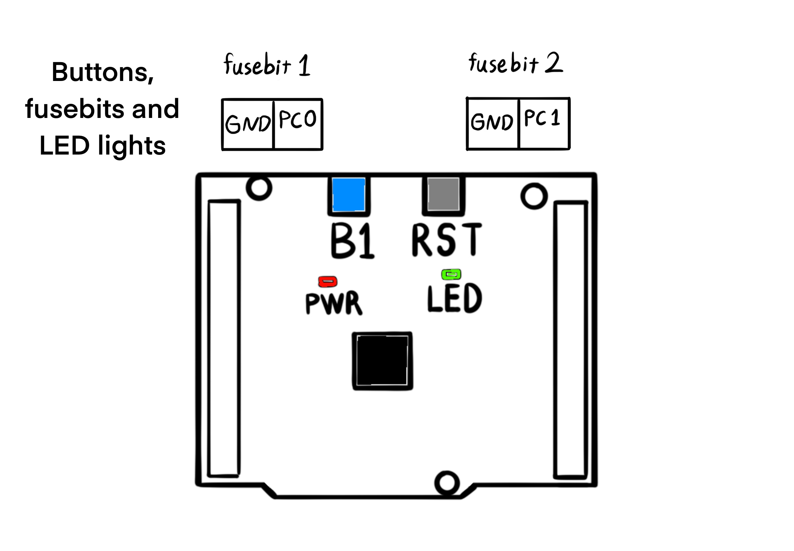

```@meta
Description = "How the reaction wheel unicycle works."
```

# How the Reaction Wheel Unicycle Works

This is a model of a unicycle with two symmetrically attached rotors. One of the reasons the matrix of inertia is not trivial is that the rotors’ axes of rotation do not intersect at a point. The constraint on the system is conservation of angular momentum. The angular velocity of the body is related to the rotor velocities. That relation gives rise to a differential equation in the rotation group Special Orthogonal (3) for the robot’s body. Using the Euler parameters of SO(3) we obtain a local coordinate description of the differential equation, in terms of the roll, pitch and yaw angles. The robot can be repositioned by controlling the rotor velocities. The Linear Quadratic Regulator regulates the roll and pitch angles by a choice of a suitable input.

## Introducing Reinforcement Learning and Feedback Control

## Natural Decision Methods

## An Optimal Adaptive Controller

System states in real time. Even though the matrix of inertia (among other physical parameters) is unknown, the adaptive controller based on value iteration keeps the states stable and regulates them to zero. The index `k` denotes value iteration whereas the index `j` counts the number of policy updates.

## The Z-Euler Angle Is Not Observable


- 
```c
void updateIMU(LinearQuadraticRegulator *model)
```

- 
```c
updateIMU1(&(model->imu1));
updateIMU2(&(model->imu2));
```

- 
```c
typedef struct
{
  int16_t accX_offset;
  int16_t accY_offset;
  int16_t accZ_offset;
  float accX_scale;
  float accY_scale;
  float accZ_scale;
  int16_t gyrX_offset;
  int16_t gyrY_offset;
  int16_t gyrZ_offset;
  float gyrX_scale;
  float gyrY_scale;
  float gyrZ_scale;
  int16_t rawAccX;
  int16_t rawAccY;
  int16_t rawAccZ;
  int16_t rawGyrX;
  int16_t rawGyrY;
  int16_t rawGyrZ;
  float accX;
  float accY;
  float accZ;
  float gyrX;
  float gyrY;
  float gyrZ;
  float roll;
  float pitch;
  float yaw;
  float roll_velocity;
  float pitch_velocity;
  float yaw_velocity;
  float roll_acceleration;
  float pitch_acceleration;
  float yaw_acceleration;
} IMU;
```

- 
```c
R1[0] = model->imu1.accX;
R1[1] = model->imu1.accY;
R1[2] = model->imu1.accZ;
R2[0] = model->imu2.accX;
R2[1] = model->imu2.accY;
R2[2] = model->imu2.accZ;
```

- 
```c
_R1[0] = 0.0;
_R1[1] = 0.0;
_R1[2] = 0.0;
_R2[0] = 0.0;
_R2[1] = 0.0;
_R2[2] = 0.0;
for (int i = 0; i < 3; i++)
{
  for (int j = 0; j < 3; j++)
  {
    _R1[i] += B_A1_R[i][j] * R1[j];
    _R2[i] += B_A2_R[i][j] * R2[j];
  }
}
```

- 
```c
for (int i = 0; i < 3; i++)
{
  Matrix[i][0] = _R1[i];
  Matrix[i][1] = _R2[i];
}
```

- 
```c
for (int i = 0; i < 3; i++)
{
  for (int j = 0; j < 4; j++)
  {
    Q[i][j] = 0.0;
    for (int k = 0; k < 2; k++)
    {
      Q[i][j] += Matrix[i][k] * X[k][j];
    }
  }
}
```

- 
```c
g[0] = Q[0][0];
g[1] = Q[1][0];
g[2] = Q[2][0];
```

- 
```c
beta = atan2(-g[0], sqrt(pow(g[1], 2) + pow(g[2], 2)));
```

- 
```c
gamma1 = atan2(g[1], g[2]);
```

- 
```c
G1[0] = model->imu1.gyrX;
G1[1] = model->imu1.gyrY;
G1[2] = model->imu1.gyrZ;
G2[0] = model->imu2.gyrX;
G2[1] = model->imu2.gyrY;
G2[2] = model->imu2.gyrZ;
```

- 
```c
_G1[0] = 0.0;
_G1[1] = 0.0;
_G1[2] = 0.0;
_G2[0] = 0.0;
_G2[1] = 0.0;
_G2[2] = 0.0;
for (int i = 0; i < 3; i++)
{
  for (int j = 0; j < 3; j++)
  {
    _G1[i] += B_A1_R[i][j] * G1[j];
    _G2[i] += B_A2_R[i][j] * G2[j];
  }
}
```

- 
```c
for (int i = 0; i < 3; i++)
{
  r[i] = (_G1[i] + _G2[i]) / 2.0;
}
```

- 
```
E[0][0] = 0.0;
E[0][1] = sin(gamma1) / cos(beta);
E[0][2] = cos(gamma1) / cos(beta);
E[1][0] = 0.0;
E[1][1] = cos(gamma1);
E[1][2] = -sin(gamma1);
E[2][0] = 1.0;
E[2][1] = sin(gamma1) * tan(beta);
E[2][2] = cos(gamma1) * tan(beta);
```

- 
```c
r_dot[0] = 0.0;
r_dot[1] = 0.0;
r_dot[2] = 0.0;
for (int i = 0; i < 3; i++)
{
  for (int j = 0; j < 3; j++)
  {
    r_dot[i] += E[i][j] * r[j];
    r_dot[i] += E[i][j] * r[j];
    r_dot[i] += E[i][j] * r[j];
    r_dot[i] += E[i][j] * r[j];
  }
}
```

- 
```c
fused_beta = kappa1 * beta + (1.0 - kappa1) * (fused_beta + model->dt * (r_dot[1] / 180.0 * M_PI));
```

- 
```c
fused_gamma = kappa2 * gamma1 + (1.0 - kappa2) * (fused_gamma + model->dt * (r_dot[2] / 180.0 * M_PI));
```

- 
```c
float _roll = fused_beta;
float _pitch = -fused_gamma;
```

- 
```c
float _roll_velocity = ((r_dot[1] / 180.0 * M_PI) + (_roll - model->imu1.roll) / model->dt) / 2.0;
float _pitch_velocity = ((-r_dot[2] / 180.0 * M_PI) + (_pitch - model->imu1.pitch) / model->dt) / 2.0;
```

- 
```c
model->imu1.roll_acceleration = _roll_velocity - model->imu1.roll_velocity;
model->imu1.pitch_acceleration = _pitch_velocity - model->imu1.pitch_velocity;
```

- 
```c
model->imu1.roll_velocity = _roll_velocity;
model->imu1.pitch_velocity = _pitch_velocity;
model->imu1.roll = _roll;
model->imu1.pitch = _pitch;
```

## Stepping Through the Implementation

In this section, we step through the implementation of the robot's controller in the order of execution. The controller is implemented in the C programming language. It runs on a STM32F401RE mictocontroller, which is clocked at 84 MHz. Here. we focus on the part of the code that runs in the main loop, which is a `while` loop in the main function of the program.

- 
The microcontroller is built around a Cortex-M4 with Floating Point Unit (FPU) core, which contains hardware extensions for debugging features. The debug extensions allow the core to be stopped either on a given instruction fetch (breakpoint), or on data access (watchpoint). When stopped, the core's internal state and the system's external state may be examined. Once examination is complete, the core and the system may be restored and program execution resumed.


The ARM Cortex-M4 with FPU core provides integrated on-chip debug support. One of the debug features is called Data Watchpoint Trigger (DWT). The DWT unit  provides a means to give the number of clock cycles. The DWT register `CYCCNT` counts the number of clock cycles. The period of a control cycle is required in the application for integrating the gyroscopic angle rates. If we count the number of clocks twice: one time before the loop begins and one time after the loop ends, then we can find the time period that it takes to complete a control loop. In the beginning, we count the number of clocks by assigning the register value to a variable called `t1`.

```c
t1 = DWT->CYCCNT;
```

- 
There are two fuse bits on the robot for configuration without flashing a program. The first one is connected to the port C of the general purpose input / output, pin 0. The fuse bit is active whenever the connected pin is grounded. The fuse bit deactivates the linear quadratic regulator by clearing the `active` field as a flag in the model structure. Even though the status of the fuse bit 0 is necessary to activate the model, it is not a sufficient condition. The user must connect the fuse bit and also push a blue push button once on the robot for activating the model. The push button is the same blue button that is found on the NUCLEOF401RE board. These two conditions are chained together for safety reasons. If the model is not active, then the robot must stop moving. Therefore, the output of the model must be set to zero as well in order to override the last action of the model. But, the speed of a direct current motor is directly proportional to the amplitude of the enable signals of the motor driver, L293D. In the peripherals of the microcontroller, two channels of Timer 2 generate the driver enable signals: EN1,2 and EN3,4. If the model is not active, then the duty cycle of the Pulse Width Modulation (PWM) of each timer channel is set to zero for safety. 



```c
if (HAL_GPIO_ReadPin(GPIOC, GPIO_PIN_0) == 0)
{
  if (HAL_GPIO_ReadPin(GPIOC, GPIO_PIN_13) == 0)
  {
    HAL_GPIO_WritePin(GPIOA, GPIO_PIN_5, GPIO_PIN_RESET);
    model.active = 1;
  }
}
else
{
  model.active = 0;
  model.reactionPWM = 0.0;
  model.rollingPWM = 0.0;
  TIM2->CCR1 = 0;
  TIM2->CCR2 = 0;
}
```

- 
When the reaction wheel unicycle falls over, the roll and pitch angles of the chassis with respect to the pivot point exeed ten degrees. The geared motors produce high torques in stall mode after their failure to prevent the fall from happening. It makes sense to disable the actuators to save energy resources and reduce physical shocks to the motor gearboxes. The lower and upper bounds on the roll and pitch angles are combined using the logical "or" operator `||` with the episode counter so that the model stops running after the maximum number of interactions with the environment, the total steps in an episode. A fall or a certain number of interactions, whichever comes first, causes the model to deactivate. In order to make the robot live longer and consume less power, three conditions must be met, or else the model is deactivated and the green light on the NUCLEOF401RE turns on to signify that the controller is no longer active. The user has four options in whenever the green LED lights up:

1. Pick the robot up and make it stand upright, before pushing the blue push button to run again.

2. Switch the power button on the chassis to condition zero, in order to power off the robot.

3. Connect to the robot WiFi network and execute the following command in the terminal for printing the logs. Print uart6 serial messages by executing: `nc 192.168.4.1 10000`

4. Activate the Porta.jl environment in a Julia REPL and run the linked script for visualizing the logs: [Unicycle](https://github.com/iamazadi/Porta.jl/blob/master/models/unicycle.jl)

The controller stops spinning and stays that way, unless one of the above are performed by the user.

```c
if (fabs(model.imu1.roll) > roll_safety_angle || fabs(model.imu1.pitch) > pitch_safety_angle || model.k > max_episode_length)
{
  model.active = 0;
  HAL_GPIO_WritePin(GPIOA, GPIO_PIN_5, GPIO_PIN_SET);
}
```

- 
If the model is set to be active, then the controller takes one step forward. The function `stepForward` takes as argument a pointer to the model, mainly because two of its fields require persistent memory: the filter matrix `W_n` and the inverse autocorrelation matrix `P_n`. But also partly because the sensory fields among others are updated inside the function. The actual side effect of this function call is the action of the feedback policy, which changes the angular velocity of the motors.

```c
if (model.active == 1)
{
  stepForward(&model);
}
```

- 
In case the model is not active, a block of code runs instead of the `stepForward` function, in order to make sure the motors stop moving, and to update sensors for development purposes. First, the duty cycles are set to zero, both in the model struct fields and in the respective channels of Timer 2. Second, the driver inputs are all cleared to make a breaking condition according to the driver's data sheet. Third, the encoder of the reaction wheel is updated by calling the `encodeWheel` function, supplying a pointer to the encoder's instantiation and the value of the counter register `CNT` of Timer 3. Timer 3 is configured with two cannels A nd B for reading the absolute position of the wheel. What Timer 3 counts in the "encoder mode" is the angular position of the reaction wheel. Then, the `encodeWheel` function transforms the angular position to the angular velocity for the linear quadratic regulator model. The rolling wheel's encoder works in the same way, except Timer 4 is used. Next, the rate of electric current in the coils of the motors is measured by calling the `senseCurrent` function with pointers to the current sensor struct of the motors.

Finally, the Inertial Measurement Unit (IMU) is updated by calling the `updateIMU` function with the pointer to the model struct. There are two IMUs on the robot for estimating tilt at the pivot point rather than the point where the IMUs are located. The essential feature of the `updateIMU` function is the ability to calculate the roll and pitch angles using the static acceleration of gravity, discarding the dynamical part of acceleration beforehand. The quality of tilt estimation depends on three features:

1. The calculation is done for the pivot point.

2. The calculation does not consider dynamical accelerations of the robot.

3. The tilt estimation given the accelerometers is enhanced by fusing it with gyroscopic measurements.

```c
else
{
  model.reactionPWM = 0.0;
  model.rollingPWM = 0.0;
  TIM2->CCR1 = 0;
  TIM2->CCR2 = 0;
  HAL_GPIO_WritePin(GPIOB, GPIO_PIN_13, GPIO_PIN_RESET);
  HAL_GPIO_WritePin(GPIOB, GPIO_PIN_14, GPIO_PIN_RESET);
  HAL_GPIO_WritePin(GPIOC, GPIO_PIN_2, GPIO_PIN_RESET);
  HAL_GPIO_WritePin(GPIOC, GPIO_PIN_3, GPIO_PIN_RESET);
  encodeWheel(&model.reactionEncoder, TIM3->CNT);
  encodeWheel(&model.rollingEncoder, TIM4->CNT);
  senseCurrent(&(model.reactionCurrentSensor), &(model.rollingCurrentSensor));
  updateIMU(&model);
}
```

- 
An episode is defined as one or more sequential interactions with the environment. An episode is finished once the robot falls over or when the control policy is updated. The field `k` of the model counts the number of environment interactions in an episode. Since the `stepForward` function is essentially a Recursive Least Squares (RLS) algorithm, it will make the filter matrix `W_n` and the inverse autocorrelation matrix `P_n` converge after a finite number of runs. The exact number of runs for the RLS to converge is not constant, but we can assume that it is small when the robot approaches a state in which opposing angular momenta are balanced. Therefore, by counting the number of `stepForward` function calls we can insert control policy updates periodically. The function `updateControlPolicy` is given a pointer to the model object and its side effect is an update to the feedback policy matrix `K_j`. The index of the feeback policy matrix is different from the index of the filter matrix `W_n` and the inverse autocorrelation matrix `P_n`. A second counter variable `j` is incremented every time the control policy is updated, whereas the variable `k` counts the number of calls to the `stepForward` function. However, if the update frequency is higher than one control cycle then the variable `j` counts at a slower rate than the variable `k`. As the model learns from experience online and in real time, the variable `updatePolicyPeriod` determines how much experience is accumulated before a policy update. Experimentally, 10 value iterations per policy update is the optimal ratio.

```c
if (model.k % updatePolicyPeriod == 0 || triggerUpdate == 1)
{
  updateControlPolicy(&model);
  triggerUpdate = 0;
}
```

- 
In order to monitor the controller and debug issues we write the logs periodically to the standard input / output console. The variable `log_counter` is incremented by one every control cycle. Then, the log counter is compared to the constnt `LOG_CYCLE` for finding out if a cycle should be logged. But it is not a sufficient condition for logging because a second fuse bit is also rquired for permission to log. The second fuse bit is connected to the port C of the general purpose input / output, pin 1. Whenever the fuse bit pin is grounded it is activated. Once the fuse bit is active, the transmission flag `transmit` is set at the appropriate control cycle count. The reason for `LOG_CYCLE` is to limit the total number of logs per second, as the Micro-Controller Unit (MCU) is too fast for a continuous report. And the second fuse bit is there to turn off logging for saving time, as log transmissions takes time away from the control processes. So by using the logical "and" operator `&&` we can combine the logging cycle condition with the logging fuse bit, in order to regulate the frequnecy of transmissions.

```c
log_counter++;
if (log_counter > LOG_CYCLE && HAL_GPIO_ReadPin(GPIOC, GPIO_PIN_1) == 0)
{
  transmit = 1;
}
```

- 

If the `transmit` variable is equal to one, then the log counter is cleard along with the `transmit` variable before transmission. The function `sprintf` is called with a message buffer `MSG` and a formatted character string to populate the buffer with numbers. A log message can be anything, but for finding the matrix of known parameters in tilt estimation, the accelerometrs data must be included. After the message is composed, it is given as an argument to the function `HAL_UART_Transmit`, which stands for: Hardware Abstraction Layer, Universal Asynchronous Receiver / Transmitter, Transmit. The function also requires a pointer to `uart6`, which is a micro-controller peripheral for serial communication, and the size of the message buffer, along with a time out delay. Printing and transmitting the log finishes the main control loop. The console on the other side of tranmission receives a line like this:
`AX1: 0.34, AY1: 0.03, AZ1: 0.95, | AX2: 0.34, AY2: 0.02, AZ2: 0.94, | roll: -0.34, pitch: -0.03, | encT: 0.00, encB: 0.00, | k: 1, j: 1, | x0: 0.00, x1: 0.00, x2: 0.00, x3: 0.00, x4: 0.00, x5: 0.00, x6: 0.00, x7: 0.00, x8: 0.00, x9: 0.00, x10: 0.00, x11: 0.00, | P0: 0.12, P1: 1.00, P2: 1.00, P3: 1.00, P4: 1.00, P5: 1.00, P6: 1.00, P7: 1.00, P8: 1.00, P9: 1.00, P10: 1.00, P11: 1.00, dt: 0.001847`.

You can visualize this example message using the [Unicycle](https://github.com/iamazadi/Porta.jl/blob/master/models/unicycle.jl) script. The example includes: the tri-axis acceleromer measurements of IMU 1 and IMU 2, the roll and pitch angles after sensor fusion, the absolute position of both encoders, and the diagonal entries of the inverse auto-correlation matrix `P_n`. Different messages can be composed for different use cases, for example printing raw sensor readings for calibrating the zero point and the scale of the accelerometers axes.

```c
if (transmit == 1)
{
  transmit = 0;
  log_counter = 0;
  sprintf(MSG,
          "AX1: %0.2f, AY1: %0.2f, AZ1: %0.2f, | AX2: %0.2f, AY2: %0.2f, AZ2: %0.2f, | roll: %0.2f, pitch: %0.2f, | encT: %0.2f, encB: %0.2f, | k: %f, j: %f, | x0: %0.2f, x1: %0.2f, x2: %0.2f, x3: %0.2f, x4: %0.2f, x5: %0.2f, x6: %0.2f, x7: %0.2f, x8: %0.2f, x9: %0.2f, x10: %0.2f, x11: %0.2f, | P0: %0.2f, P1: %0.2f, P2: %0.2f, P3: %0.2f, P4: %0.2f, P5: %0.2f, P6: %0.2f, P7: %0.2f, P8: %0.2f, P9: %0.2f, P10: %0.2f, P11: %0.2f, dt: %0.6f\r\n",
          model.imu1.accX, model.imu1.accY, model.imu1.accZ, model.imu2.accX, model.imu2.accY, model.imu2.accZ, model.imu1.roll, model.imu1.pitch, model.reactionEncoder.radianAngle, model.rollingEncoder.radianAngle, (float) model.k, (float) model.j, model.dataset.x0, model.dataset.x1, model.dataset.x2, model.dataset.x3, model.dataset.x4, model.dataset.x5, model.dataset.x6, model.dataset.x7, model.dataset.x8, model.dataset.x9, model.dataset.x10, model.dataset.x11, getIndex(model.P_n, 0, 0), getIndex(model.P_n, 1, 1), getIndex(model.P_n, 2, 2), getIndex(model.P_n, 3, 3), getIndex(model.P_n, 4, 4), getIndex(model.P_n, 5, 5), getIndex(model.P_n, 6, 6), getIndex(model.P_n, 7, 7), getIndex(model.P_n, 8, 8), getIndex(model.P_n, 9, 9), getIndex(model.P_n, 10, 10), getIndex(model.P_n, 11, 11), dt);
  HAL_UART_Transmit(&huart6, MSG, sizeof(MSG), 1000);
}
// Rinse and repeat :)
```

In order to enable the function `sprintf` to use floating point numbers, do the following steps:
1. Open the file `gcc-arm-none-eabi.cmake` that is created by CubeMX.
2. Add the option `-u _printf_float` to `CMAKE_C_FLAGS`.


Set the baudrate of `uart6` to 921600, for the wifi module HC-25. The HC-25 module settings are on the IP address `192.168.4.1` as a web page. Here is the checklist to set up a new module:
1. The password is not set for new modules. So just login without a password to access the settings page.
2. Set a username and password for the robot's access point.
3. Set the *WiFi Mode* to **AP** for Access Point.
4. Change the port number from *8080* to *10000*.
5. Set the *Baud Rate* parameter to 921600 Bits/s.

- 
At the end of the control loop, where the model has taken one step forward and possibly the control policy has been updated, it is time to count the number of the processor's clock cycles for a second time for measuring delta `t`. At this point, by assigning the value of the DWT counter register to the variable `t2` we can know how many cycles are there between `t1` and `t2`. Having calculated the temporal difference between the start of the main loop and its end in terms of the processor's cycles, we then divide the difference by the number of Central Processing Unit (CPU) clock cycles per second for finding the period of the control cycle in the unit of seconds. The field `dt` of the model struct stores the control period for intermediate physical calculations. The control period is ususally 2 to 5 milliseconds on a NUCLEOF401RE, which clocks at 84 Mhz.

```c
t2 = DWT->CYCCNT;
diff = t2 - t1;
dt = (float)diff / CPU_CLOCK;
model.dt = dt;
```

- 
The function `stepForward` identifies the Q function using RLS with the given pointer to the `model`. The algorithm updates the Q function at each step. The main side effect of the function is an interaction with the environment, which consists of reading the sensors and changing the speed of rotation of the motors. In the end, the filter matrix `W_n` and the inverse auto-correlation matrix `P_n` are updated.

```c
void stepForward(LinearQuadraticRegulator *model)
```

- 
The vector `x_k` is initialized as an array of element type `float` with the model data set. The data set (xₖ, uₖ, xₖ₊₁, uₖ₊₁) contains data from two consecutive time steps `k` and `k + 1`. The number of dimensions of the `x_k` vector is equal to n = 10, storing the system state at time `k`. Each element of the state vector xₖ ∈ ℝⁿ has a name that represents a physical quantity. The order of the feature names are the same in both time indices: the roll angle, the roll angular velocity, the roll angular acceleration, the pitch angle, the pitch angular velocity, the pitch angular acceleration, the angular velocity of the reaction wheel, the angular velocity of the rolling wheel, the electric current velocity of the reaction motor, and the electric current velocity of the rolling motor.

```c
x_k[0] = model->dataset.x0;
x_k[1] = model->dataset.x1;
x_k[2] = model->dataset.x2;
x_k[3] = model->dataset.x3;
x_k[4] = model->dataset.x4;
x_k[5] = model->dataset.x5;
x_k[6] = model->dataset.x6;
x_k[7] = model->dataset.x7;
x_k[8] = model->dataset.x8;
x_k[9] = model->dataset.x9;
```

- 
After initializing the state buffer `x_k`, another buffer is initialized with the feedback policy matrix `K_j`. The matrix Kⱼ ∈ ℝᵐˣⁿ has m = 2 rows since there are two inputs and it has n = 10 columns as there are ten states. The only reason for initializing `K_j` in the `stepForward` function is to execute a feedback policy action right before performing the measurements of the next time step `k + 1`. So the matrix and its index `j` stay constant throughout this function call.

```c
K_j[0][0] = model->K_j.x00;
K_j[0][1] = model->K_j.x01;
K_j[0][2] = model->K_j.x02;
K_j[0][3] = model->K_j.x03;
K_j[0][4] = model->K_j.x04;
K_j[0][5] = model->K_j.x05;
K_j[0][6] = model->K_j.x06;
K_j[0][7] = model->K_j.x07;
K_j[0][8] = model->K_j.x08;
K_j[0][9] = model->K_j.x09;
K_j[1][0] = model->K_j.x10;
K_j[1][1] = model->K_j.x11;
K_j[1][2] = model->K_j.x12;
K_j[1][3] = model->K_j.x13;
K_j[1][4] = model->K_j.x14;
K_j[1][5] = model->K_j.x15;
K_j[1][6] = model->K_j.x16;
K_j[1][7] = model->K_j.x17;
K_j[1][8] = model->K_j.x18;
K_j[1][9] = model->K_j.x19;
```

- 
The inputs of the system are stored in a vector uₖ ∈ ℝᵐ, which is the result of a matrix-vector product. The input is a function of the current system state at time step `k`. The feedback policy matrix `K_j` times the state vector `x_k` equals the negative of the input `u_k`. It is called the input because the product produces m = 2 floating point numbers that are used to modulate the duty cycle of the motors.

- 
```c
u_k[0] = 0.0;
u_k[1] = 0.0;
for (int i = 0; i < model->m; i++)
{
  for (int j = 0; j < model->n; j++)
  {
    u_k[i] += -K_j[i][j] * x_k[j];
  }
}
```

- 
The data set (xₖ, uₖ, xₖ₊₁, uₖ₊₁) of the Linear Quadratic Regulator (LQR) model directly sums up the ststem state `x_k` and the system input `u_k`. The roll and pitch angles and their derivatives with respect to time are divided by π in order to normalize the anglular values. The velocities of the wheels and the current rates of the motors are also normalized to be in the closed interval [-1, 1]. But those normalizations are encapsulated inside the `encodeWheel` and `senseCurrent` functions respectively. Since the RLS algorithm is an iterative computation, normalizing data makes the numerical results stable by limiting the absolute value of the elements of the matrices `W_n` and `P_n`. The first half of the data set pertains to the time step `k`, which occurs before the action is executed. The second half of the data set is assiged after the action has taken place.

``(x_k, u_k, x_{k + 1}, u_{k + 1})``

```c
model->dataset.x0 = model->imu1.roll / M_PI;
model->dataset.x1 = model->imu1.roll_velocity / M_PI;
model->dataset.x2 = model->imu1.roll_acceleration / M_PI;
model->dataset.x3 = model->imu1.pitch / M_PI;
model->dataset.x4 = model->imu1.pitch_velocity / M_PI;
model->dataset.x5 = model->imu1.pitch_acceleration / M_PI;
model->dataset.x6 = model->reactionEncoder.velocity;
model->dataset.x7 = model->rollingEncoder.velocity;
model->dataset.x8 = model->reactionCurrentSensor.currentVelocity;
model->dataset.x9 = model->rollingCurrentSensor.currentVelocity;
model->dataset.x10 = u_k[0];
model->dataset.x11 = u_k[1];
```

- 
The LQR inputs are bidirectional and analog. The LQR regulates the roll and pitch angles by a choice of a suitable input. There are four digital input pins: **1A**, **2A**, **3A**, **4A**, and a pair of analog enable pins: **1,2En** and **3,4EN**. The enable pins control the speeds of rotation with a 16-bit resolution, whereas the logical input pins: **1A**, **2A**, **3A** and **4A** control the direction of rotation. A motor rotates in reverse by swapping the values of Input 1 with Input 2, switching 2 values in the memory. Therefore, LQR controls the roll and pitch angles by making changes to two variables: `rollingPWM` corresponding to **1,2EN** and `reactionPWM` corresponding to **3,4EN**. LQR adds / subtracts from the two variables when it acts in the environment. To drive a direct current actuator, the driver generates an electric potential at the two ends of the actuator's coil. An electric current in the power terminals (**1Y** and **2Y**, or, **3Y** and **4Y**) occurs whenever the electric potential at the two end points are sufficiently different in intensity. The duty cycle of a PWM signal shapes the line graph of an analog voltage. In a Voltage versus Time graph, the PWM signal is a point on the graph and varies with time. There are two independent PWM signals: the reaction wheel's motor enable pin and the rolling wheel's motor enable pin. In turn, the duty cycles of the PWM signals, tell the Integrated Circuit (IC) to adjust the electric potential at the output pins of the IC: **1Y**, **2Y**, **3Y** and **4Y**. Making changes to the duty cycles with the given feedback policy `u_k`, the registers of channels one and two of Timer 2 are changed after scaling the variables and casting them to integer values.


The control policy takes an action by writing to MCU registers. The MCU is capable of writing to millions of registers in less than one second. However, it takes about 2 to 5 milliseconds to solve for 2 input variables in a multi-input / multi-output system. By integrating the input vector `u_k` with a suitable step size, the duty cycle becomes approximately continuous. A big pulse step results in overshooting input adjustments in the pursuit of the equiblirium state. Since the harware power (in terms of revolutions per second and output torque) varies from motor to motor, the variable `pulseStep` helps limit changes to the input. Therefore, fine motor functions are acheived with a calibrated value of the parameter `pulseStep`.

```c
model->reactionPWM += (255.0 * pulseStep) * u_k[0];
model->rollingPWM += (255.0 * pulseStep) * u_k[1];
model->reactionPWM = fmin(255.0 * 255.0, model->reactionPWM);
model->reactionPWM = fmax(-255.0 * 255.0, model->reactionPWM);
model->rollingPWM = fmin(255.0 * 255.0, model->rollingPWM);
model->rollingPWM = fmax(-255.0 * 255.0, model->rollingPWM);
TIM2->CCR1 = (int)fabs(model->rollingPWM);
TIM2->CCR2 = (int)fabs(model->reactionPWM);
if (model->reactionPWM < 0)
{
  HAL_GPIO_WritePin(GPIOB, GPIO_PIN_13, GPIO_PIN_RESET);
  HAL_GPIO_WritePin(GPIOB, GPIO_PIN_14, GPIO_PIN_SET);
}
else
{
  HAL_GPIO_WritePin(GPIOB, GPIO_PIN_13, GPIO_PIN_SET);
  HAL_GPIO_WritePin(GPIOB, GPIO_PIN_14, GPIO_PIN_RESET);
}
if (model->rollingPWM < 0)
{
  HAL_GPIO_WritePin(GPIOC, GPIO_PIN_2, GPIO_PIN_RESET);
  HAL_GPIO_WritePin(GPIOC, GPIO_PIN_3, GPIO_PIN_SET);
}
else
{
  HAL_GPIO_WritePin(GPIOC, GPIO_PIN_2, GPIO_PIN_SET);
  HAL_GPIO_WritePin(GPIOC, GPIO_PIN_3, GPIO_PIN_RESET);
}
```

- 
After the action, the agent begins sensing the environment for feedback. The first to update is the encoder of the reaction wheel. There is an encoder wheel at the opposite the end of the reaction wheel's motor. Since the gearbox reduces the speed of rotation of the reaction wheel in exchange for multiplying the output torque, the encoder's wheel rotates faster than the reaction wheel. The difference in the speed of rotation between the output reaction wheel and the input encoder wheel allows the encoder to be more precise. Also in the motor / encoder assembley, there is an array of small magnets on the circumference of the encoder's wheel. The resolution of the encoder depends on the number of magnets in the circular array and the gearbox ratio. A Hall effect sensor produces a voltage proportional to an axial component of the magnetic field vector produced by the magnetic array. The encoder measures the absolute position of the wheel using two channels. A pair of Hall effect sensors are mounted near the surface of the encoder's wheel, such that the magnets pass by the Hall effect sensors. Timer 3 of the MCU is set up to work in encoder mode, with a register of the absolute position of the encoder's wheel. When Timer 3 is in the encoder mode, it compares the pair of channels at each rising edge of the signals to find the position. Therefore, we call the `encodeWheel` function with a pointer to the `Encoder` object of the reaction wheel along with the value of the counter register of Timer 3. The function `encodeWheel` updates the velocity field of the reaction wheel's encoder struct to be used in the LQR model as a system state.

```c
encodeWheel(&(model->reactionEncoder), TIM3->CNT);
```


- 
The rolling wheel's encoder works the same as the reaction wheel's encoder, except for the fact that the hardware of the channels sensors is photonic rather than magnetic. The rolling wheel encoder's disk has an alternating pattern of stripes on it for a pair of infrared light emmiting diodes and a pair of photo transistors to sense its rotation. The IR LEDs send light from one side of the wheel to be received by photo transistors on the other side through the alternating pattern. The amount of light received by the photo transistors is translated to two channels of representative electrical signals, which are fed to Timer 4 of the MCU. Supplying the `encodeWheel` function with a pointer to the rolling wheel's encoder object and the value of the counter register of Timer 4, the function call updates the wheel velocity. Before connecting the encoder signals to the MCU timer, a voltage division is applied for making sure the amplitudes of the signals do not exceed 3.3 volts.

```c
encodeWheel(&(model->rollingEncoder), TIM4->CNT);
```


- The `senseCurrent` function computes the current rates of the reaction and rolling motors. The function accepts two pointers of the `CurrentSensor` type and updates the `currentVelocity` field of the respective arguments. Measuring the electric current rate is the result of two Analog to Digital Conversion (ADC) channels, as peripherals of the MCU (pins `PC4` and `PA4` of the ADC unit). A pair of Hall effect sensors are powered using a regulated 5-Volt direct current source. To measure the current rate of the driver's output, two of the wires that connect the driver IC pins (**1Y** and **4Y**) to the respective motor coils (**MotorA2** and **MotorB2**), are routed in such a way that they pass by the respective current sensing Hall effect sensors. When the IC drives a voltage across the motor terminals (**MA1** and **MA2**, or **MB1** and **MB2**), the Hall effect sensors measure the magnetic field vector that is caused by the electric field inside the wires between the motors and the driver. The ratio-metric readings from the magnetic field vectors represent the flows of the electric current of the reaction motor's and the rolling motor's coils. The LQR model observes the current rates and regulates them to zero by generating suitable inputs.

```c
senseCurrent(&(model->reactionCurrentSensor), &(model->rollingCurrentSensor));
```


- 
The function `updateIMU` provides the main source of data for the objective of the system. Through this function, the MCU talks to the IMU modules 1 and 2 for updating the roll and pitch angles along with their first and second derivatives. This is done by calling the function and giving it a pointer to the LQR model object. Although both IMUs are used for tilt estimation, the final result is assigned to the field of IMU 1. This function encapsulates matrix-vector multiplications for coordinate transformations, the singular value decomposition for obtaining the gravity vector, and sensor fusion between the tri-axis accelerometers and the tri-axis gyroscopes. Knowing about the position and orientation of each IMU with respect to the body, the function excludes linear accelerations from calculations. So, `UpdateIMU` gathers the latest inertial measurements form multiple sensor units and computes the roll and pitch angles using known parameters of the system configuration.

```c
updateIMU(model);
```

In terms of connectivity, The MCU peripheral USART1 is used to talk to IMU #2 (GY-95T). Set the baudrate of uart1 to 115200 Bits/s for the GY-95 IMU module. Set the Pin6 (PS: IIC/USART output mode selection) of IMU #2 (GY-25T) to zero, in order to use the I2C protocol. The I2C cock speed is set at 100000 Hz in the stanard mode. For saving MCU clock cycles and time, added a DMA request with USART1_RX and DMA2 Stream 2 from peripheral to memory and low priority. The mode is circular and the request call is made once in the main function by passing the usart1 handle and the receive buffer. The request increments the address of memory. The data width is one Byte for both the preipheral and memory.


- 
Once the action is complete and the sensory information is refreshed, the second half of the data set is assigned. The elements `x12` through `x23` mirror the elements `x0` through `x11`, with the only difference being the respective time indices `k + 1` and `k`. There should be about a 5-millisecond interval between `k` and `k + 1`, which is long enough to judge the quality of the action. The two consecutive time steps are separated by an action happening in time step `k` using the input `u_k`, and the subsequent sensor measurements.

```
// dataset = (xₖ, uₖ, xₖ₊₁, uₖ₊₁)
model->dataset.x12 = model->imu1.roll / M_PI;
model->dataset.x13 = model->imu1.roll_velocity / M_PI;
model->dataset.x14 = model->imu1.roll_acceleration / M_PI;
model->dataset.x15 = model->imu1.pitch / M_PI;
model->dataset.x16 = model->imu1.pitch_velocity / M_PI;
model->dataset.x17 = model->imu1.pitch_acceleration / M_PI;
model->dataset.x18 = model->reactionEncoder.velocity;
model->dataset.x19 = model->rollingEncoder.velocity;
model->dataset.x20 = model->reactionCurrentSensor.currentVelocity;
model->dataset.x21 = model->rollingCurrentSensor.currentVelocity;
```

- 
After the action, the model determines the quality of the system state. The ideal state is where the first half of the data set is approximately equal to zero and at the same time equal to the second half. In other words, the best quality means that each element of the data set with index `k` is equal to its counterpart element with index `k + 1`. Unlike the pair of elements `x10` and `x11` (input `u_k` of step `k`), the pair of elements `x22` and `x23` (input `u_k1` of step `k + 1`) are not used for action until the next call to the `stepForward` function. But, one can see that `u_k1` will be applied to the action of step `k + 1` at the next `stepForward` function call, if the `j` index is the same across the consecutive calls. The input vector `u_k1` of the time step `k + 1` is the result of a matrix-vector multiplication between the policy matrix `K_j` and the next system state vector `x_k1`. Even though `u_k1` is not used for action at step `k`, it informs the model about the future of the system trajectory in case the filter matrix `W_n` and the inverse auto-correlation matrix `P_n` are not updated. When the last two elements of the data set (`x22` and `x23`) are computed, the value iteration algorithm can calculate an error and correct the priors of the model to find the next filter matrix Wⱼ₊₁, such that the error is minimized.

``j = 0``

``u_k = -K^0 x_k``

``u_k = -K^j x_k``

``u_{k + 1} = -K^j x_{k + 1}``

```c
x_k1[0] = model->dataset.x12;
x_k1[1] = model->dataset.x13;
x_k1[2] = model->dataset.x14;
x_k1[3] = model->dataset.x15;
x_k1[4] = model->dataset.x16;
x_k1[5] = model->dataset.x17;
x_k1[6] = model->dataset.x18;
x_k1[7] = model->dataset.x19;
x_k1[8] = model->dataset.x20;
x_k1[9] = model->dataset.x21;

u_k1[0] = 0.0;
u_k1[1] = 0.0;

for (int i = 0; i < model->m; i++)
{
  for (int j = 0; j < model->n; j++)
  {
    u_k1[i] += -K_j[i][j] * x_k1[j];
  }
}

model->dataset.x22 = u_k1[0];
model->dataset.x23 = u_k1[1];
```

- 
The data set can be through of as a pair of vectors in an abstract vector space. A vector with index `k` and another with index `k + 1`. At this stage, compute the quadratic basis sets ϕ(zₖ) and ϕ(zₖ₊₁). Here, the transformation ϕ is the identity matrix. These are a pair of besis sets that are separated by a policy implementation and so differ in a time index.

``For \ k = 1, 2, ... \ compute``

``z_k = {\begin{bmatrix} x_k^T & u_k^T \end{bmatrix}}^T``

``\left\{ \begin{array}{l} \phi(z_k) &\\ \phi(z_{k + 1}) \end{array} \right.``

```c
z_k[0] = model->dataset.x0;
z_k[1] = model->dataset.x1;
z_k[2] = model->dataset.x2;
z_k[3] = model->dataset.x3;
z_k[4] = model->dataset.x4;
z_k[5] = model->dataset.x5;
z_k[6] = model->dataset.x6;
z_k[7] = model->dataset.x7;
z_k[8] = model->dataset.x8;
z_k[9] = model->dataset.x9;
z_k[10] = model->dataset.x10;
z_k[11] = model->dataset.x11;

z_k1[0] = model->dataset.x12;
z_k1[1] = model->dataset.x13;
z_k1[2] = model->dataset.x14;
z_k1[3] = model->dataset.x15;
z_k1[4] = model->dataset.x16;
z_k1[5] = model->dataset.x17;
z_k1[6] = model->dataset.x18;
z_k1[7] = model->dataset.x19;
z_k1[8] = model->dataset.x20;
z_k1[9] = model->dataset.x21;
z_k1[10] = model->dataset.x22;
z_k1[11] = model->dataset.x23;

for (int i = 0; i < (model->n + model->m); i++)
{
  basisset0[i] = z_k[i];
  basisset1[i] = z_k1[i];
}
```

The vector of filter coefficients ``\textbf{w}_n = \begin{bmatrix} w_n(0) & w_n(1) & \ldots & w_n(p) \end{bmatrix}^T`` at time ``n`` minimizes the weighted least squares error. The weighted least squares error is equal to the squared norm of the error at time ``i`` times an exponential weighting factor, sumed over the observation interval. ``\Epsilon (n) = \sum_{i = 0}^{n} \lambda^{n - i} | e(i) |^2``. The exponential weighting (forgetting) factor ``\lambda`` is greater than zero and, less than or equal to one. ``0 < \lambda \leq 1``. The error at time ``i`` is equal to the difference between the desired signal and the filter output. ``e(i) = d(i) - y(i) = d(i) - \textbf{w}_n^T x(i)``. In the definition of the error, ``d(i)`` is the desired signal at time ``i``, and ``y(i)`` is the filter output at time ``i``. The filter output is the result of the matrix-vector product of the filter coefficients and the new data vector. The latest set of filter coefficients ``\textbf{w}_n(k)`` is used for minimizing the weighted least squares error ``\Epsilon (n)``. Also, it is assumed that the weights ``\textbf{w}_n`` are constant over the observation interval with end points zero and `n`: ``[0, n]``.

For the error minimization objective, the partial derivative of the weighted least squares error with respect to the filter coefficients must be equal to zero. Setting the partial derivative equal to zero minimizes the weighted least squares error ``\frac{\partial \Epsilon (n)}{\partial \textbf{w}_n^* (k)} = 0`` for ``k = 0, 1, ..., p``. Following the implications of the partial derivative equation, the filter coefficients are transformed by the exponentially weighted deterministic autocorrelation matrix ``\textbf{R}_x(n) \textbf{w}_n = \textbf{r}_{dx}(n)`` in order to produce the deterministic cross-correlation between the desired signal ``d(n) = \begin{bmatrix} d(n) & d(n - 1) & \ldots & d(0) \end{bmatrix}^T`` and the new data vector ``\textbf{x}(i) = \begin{bmatrix} x(i) & x(i - 1) & \ldots & x(i - p) \end{bmatrix}^T``.

Therefore, the deterministic normal equations define the optimum filter coefficients. The exponentially weighted deterministic autocorrelation matrix ``\textbf{R}_x(n) \in \mathbb{R}^{(p + 1) \times (p + 1)}`` for the new data vector ``\textbf{x}(n)`` is defined as the sum of the outer product of the data vector with itself, in an exponential way with the given exponential factor ``\lambda``. In contrast, the deterministic cross-correlation ``\textbf{r}_{dx}(n)`` is the outer product between the desired signal ``d(n)`` and the data vector ``\textbf{x}(n)``.

``\left\{ \begin{array}{l} \textbf{r}_{dx}(n) = \sum_{i = 0}^n \lambda^{n - i} d(i) \textbf{x}^*(i) &\\ \textbf{R}_x(n) = \sum_{i = 0}^n \lambda^{n - i} \textbf{x}^*(i) \textbf{x}^T(i) \end{array} \right.``

Multiplying the data vector ``\textbf{x}(i)`` with the deterministic cross-correlation on the left and then subtracting the result from the weighted norm of the desired signal ``|| d(n) ||_\lambda^2`` yields the minimum error ``\{\Epsilon(n)\}_{min} = || d(n) ||_\lambda^2 - \textbf{r}_{dx}^H(n) \textbf{w}_n``.

Both the deterministic autocorrelation matrix ``\textbf{R}_x(n)`` and the deterministic cross-correlation matrix ``\textbf{r}_{dx}(n)`` depend on the time variable ``n``. So instead of directly solving the deterministic normal equations ``\textbf{R}_x(n) \textbf{w}_n = \textbf{r}_{dx}(n)``, it is easier to derive a recursive solution for the filter coefficients ``\textbf{w}_n``. A correction ``\Delta \textbf{w}_{n - 1}`` that is applied to the solution at time ``n - 1`` results in the filter coefficients ``\textbf{w}_n = \textbf{w}_{n - 1} + \Delta \textbf{w}_{n - 1}`` at time ``n``.

For a recursive equation, first derive the deterministic cross-correlation ``\textbf{r}_{dx}(n)`` at time ``n`` in terms of the cross-correlation ``\textbf{r}_{dx}(n - 1)`` at time ``n - 1``. To solve for the filter coefficients, multiply both sides of the deterministic normal equations on the left by the inverse of the deterministic autocorrelation matrix: ``\textbf{w}_n = \textbf{R}_x^{-1}(n) \textbf{r}_{dx}(n)``. Second, derive the inverse of the deterministic autocorrelation matrix ``\textbf{R}_x^{-1}(n)`` in terms of the inverse autocorrelation at the previous time ``\textbf{R}_x^{-1}(n - 1)`` and the new data vector ``\textbf{x}(n)``. So on the one hand, the cross-correlation ``\textbf{r}_{dx}(n) = \sum_{i = 0}^n \lambda^{n - i} d(i) \textbf{x}^*(i)`` may be updated recursively as the sum of the previous cross-correlation times the weighting factor, and the desired signal times new data. On the other hand, the autocorrelation matrix ``\textbf{R}_x(n)`` may be updated recursively from the autocorrlation of the previous time ``\textbf{R}_x(n - 1)`` and the new data vector ``\textbf{x}(n)`` in this way: multiply the previous autocorrelation by the weighting factor and then add the result to the outer product of the new data vector.

``\left\{ \begin{array}{l} \textbf{r}_{dx}(n) = \lambda \textbf{r}_{dx}(n - 1) + d(n) \textbf{x}^*(n) &\\ \textbf{R}_x(n) = \lambda \textbf{R}_x(n - 1) + \textbf{x}^*(n) \textbf{x}^T(n) \end{array} \right.``

Since we are interested in the inverse of the autocorrelation matrix ``\textbf{R}_x(n)`` we use the Woodbury's Identity. The Woodbury matrix identity ``(\textbf{A} + \textbf{u} \textbf{v}^H)^{-1} = \textbf{A}^{-1} - \frac{\textbf{A}^{-1} \textbf{u} \textbf{v}^H \textbf{A}^{-1}}{1 + \textbf{v}^H \textbf{A}^{-1} \textbf{u}}`` says that the inverse of a rank-k correction of some matrix can be computed by doing a rank-k correction to the inverse of the original matrix. Therefore, the multiplication of the weighting factor ``\lambda`` and the autocorrelation matrix ``\textbf{R}_x(n - 1)`` at time ``n - 1`` should be the original matrix, whereas the pair of vectors in the identity are equal to the new data vector ``\textbf{x}^*(n)``.

``\left\{ \begin{array}{l} \textbf{A} = \lambda \textbf{R}_x(n - 1) &\\ \textbf{u} = \textbf{v} = \textbf{x}^*(n) \end{array} \right.``

``\textbf{R}_x^{-1}(n) = \lambda^{-1} \textbf{R}_x^{-1} (n - 1) - \frac{\lambda^{-2} \textbf{R}_x^{-1} (n - 1) \textbf{x}^*(n) \textbf{x}^T(n) \textbf{R}_x^{-1}(n - 1)}{1 + \lambda^{-1} \textbf{x}^T(n) \textbf{R}_x^{-1}(n - 1) \textbf{x}^*(n)}``

Writing the inverse of the deterministic autocorrelation matrix using Woodbury's identity, ``\textbf{P}(n) = \lambda^{-1} [\textbf{P}(n - 1) - \textbf{g}(n) \textbf{x}^T(n) \textbf{P}(n -1)]``, we find that the inverse of the autocorrelation matrix ``\textbf{P}(n) = \textbf{R}_x^{-1}(n)`` at time ``n`` involves two terms, one of which is the weighted version of the matrix at time ``n - 1``. The other term in the calculation of the inverse matrix is the multiplication of the gain vector and the data vector and the inverse matrix at time ``n - 1``. The gain vector is the solution to the equations ``\textbf{R}_x(n) \textbf{g}(n) = \textbf{x}^*(n)``. As such, the gain vector ``\textbf{g}(n) = \frac{\lambda^{-1} \textbf{P}(n - 1) \textbf{x}^*(n)}{1 + \lambda^{-1} \textbf{x}^T(n) \textbf{P}(n - 1) \textbf{x}^*(n)}`` is transformed by the deterministic autocorrelation matrix to yield the new data vector. Alternatively one can say that the new data vector is transformed by the inverse of the deterministic autocorrelation matrix in order to produce the gain vector ``\textbf{g}(n) = \textbf{P}(n) \textbf{x}^*(n)``. This is the same as the deterministic normal equations, but the cross-correlation vector ``\textbf{r}_{dx}(n)`` is replaced with the data vector ``\textbf{x}^*(n)``:

``\left\{ \begin{array}{l} \textbf{R}_x(n) \textbf{w}_n = \textbf{r}_{dx}(n) &\\ \textbf{R}_x(n) \textbf{g}(n) = \textbf{x}^*(n) \end{array} \right.``

The derivation of the time-update equation for the coefficient vector ``\textbf{w}_n`` completes the recursion. Start with the fact that the transformation of the cross-correlation by the inverse autoccorrelation results in the filter coefficients. Then, replace the cross-correlation with the recursive solution.

``\left\{ \begin{array}{l} \textbf{w}_n = \textbf{P}(n) \textbf{r}_{dx}(n) &\\ \textbf{r}_{dx}(n) = \lambda \textbf{r}_{dx}(n - 1) + d(n) \textbf{x}^*(n) \end{array} \right.``

Replacing the solution with a recursive term gets us half of the way, because we still need to replace the inverse autocorrelation matrix in the time-update equation with its recursive counterpart as well: ``\textbf{w}_n = \lambda \textbf{P}(n) \textbf{r}_{dx}(n - 1) + d(n) \textbf{P}(n) \textbf{x}^*(n)``. Recall that the transformation of the data vector by the inverse autocorrelation matrix gives us the gain vector. But we also established that the recursive relation of the inverse autocorrelation matrix includes the gain vector.

``\left\{ \begin{array}{l} \textbf{P}(n) \textbf{x}^*(n) = \textbf{g}(n) &\\ \textbf{P}(n) = \lambda^{-1} [\textbf{P}(n - 1) - \textbf{g}(n) \textbf{x}^T(n) \textbf{P}(n - 1)] \end{array} \right.``

Given these two facts, the time-update of the filter coefficients at time ``n`` is rewritten, ``\textbf{w}_n = [\textbf{P}(n - 1) - \textbf{g}(n) \textbf{x}^T(n) \textbf{P}(n - 1)] \textbf{r}_{dx}(n - 1) + d(n) \textbf{g}(n)``, so that it becomes dependent on the inverse autocorrelation matrix at time ``n - 1``. To simplify the time-update equation, we use the filter coefficients at time ``n - 1`` in place of the transformation of the cross-correlation by the inverse autocorrelation: ``\textbf{P}(n - 1) \textbf{r}_{dx}(n - 1) = \textbf{w}_{n - 1}``. So far, the filter coefficients vector is derived in terms of the following: the filter coefficients at time ``n - 1``, the gain vector at time ``n``, the desired signal at time ``n``, and the new data vector: ``\textbf{w}_n = \textbf{w}_{n - 1} + \textbf{g}(n) [d(n) - \textbf{w}_{n - 1}^T \textbf{x}(n)]``.

Here is yet another simplification for defining the correction to the filter coefficients as the *a priori error* transforming the gain vector: ``\textbf{w}_n = \textbf{w}_{n - 1} + \alpha(n) \textbf{g}(n)``. The *a priori error* ``\alpha(n) = d(n) - \textbf{w}_{n - 1}^T \textbf{x}(n)`` is the difference relation between the desired signal at time ``n`` and ``\textbf{w}_{n - 1}^T \textbf{x}(n)`` the estimate of the desired signal ``d(n)`` using the previous set of filter coefficients ``\textbf{w}_{n - 1}`` at time ``n - 1``.

``\left\{ \begin{array}{l} \alpha(n) = d(n) - \textbf{w}_{n - 1}^T \textbf{x}(n) &\\ e(n) = d(n) - \textbf{w}_n^T \textbf{x}(n) \end{array} \right.``

The *a priori error* ``\alpha(n)`` is defined as the error that would occur if the filter coefficients were not updated, whereas the *a posteriori error* ``e(n)`` is defined as the error that occurs after the weight vector ``\textbf{w}_n`` is updated.

The definition of the filtered information vector ``\textbf{z}(n) = \textbf{P}(n - 1) \textbf{x}^*(n)``  makes the equations for the gain vector and the inverse of the deterministic autocorrelation matrix simple.

``\left\{ \begin{array}{l} \textbf{g}(n) = \frac{\lambda^{-1} \textbf{P}(n - 1) \textbf{x}^*(n)}{1 + \lambda^{-1} \textbf{x}^T(n) \textbf{P}(n - 1) \textbf{x}^*(n)} &\\ \textbf{P}(n) = \lambda^{-1} [\textbf{P}(n - 1) - \textbf{g}(n) \textbf{x}^T(n) \textbf{P}(n - 1)] \end{array} \right.``

The filtered information vector ``z(n)`` at time ``n`` is the transformation of the new data vector at time ``n`` by the inverse of the autocorrelation matrix at time ``n - 1``.

``\left\{ \begin{array}{l} \textbf{g}(n) = \frac{1}{\lambda + \textbf{x}^T(n) \textbf{z}(n)} \textbf{z}(n) &\\ \textbf{P}(n) = \frac{1}{\lambda} [\textbf{P}(n - 1) - \textbf{g}(n) \textbf{z}^H(n)] \end{array} \right.``


In short, we derived five equations for minimizing the weighted least squares error ``\Epsilon (n)`` in a recursive way: the filtered information vector, the *a priori error*, the gain vector, the filter coefficients, and the inverse of the autocorrelation matrix. These equations are parts of what is called the exponentially weighted Recursive Least Squares (RLS) algorithm.

``\left\{ \begin{array}{l} \textbf{z}(n) = \textbf{P}(n - 1) \textbf{x}^*(n) &\\ \alpha(n) = d(n) - \textbf{w}_{n - 1}^T \textbf{x}(n) &\\ \textbf{g}(n) = \frac{1}{\lambda + \textbf{x}^T(n) \textbf{z}(n)} \textbf{z}(n) &\\ \textbf{w}_n = \textbf{w}_{n - 1} + \alpha(n) \textbf{g}(n) &\\ \textbf{P}(n) = \frac{1}{\lambda} [\textbf{P}(n - 1) - \textbf{g}(n) \textbf{z}^H(n)] \end{array} \right.``

Whenever the weighting factor is equal to one, ``\lambda = 1``, the algorithm is called the growing window RLS algorithm, because it has infinite memory of the system's trajectory. Meaning the algorithm does not forget outliers, even though it can make the effects of older data less significant over time with a forgetting facter ``\lambda`` less than one. But a sliding window variant of the algorithm can forget outlier at the cost of doubling the computation.

The recursive updating of the filter coefficients ``\textbf{w}_n`` and the inverse autocorrelation matrix ``\textbf{P}(n)`` requires initial conditions for both terms. A suggestion would be to initialize the deterministic autocorrelation matrix with the identity matrix multiplied by a small positive constant ``\delta``.

``\left\{ \begin{array}{l} \textbf{R}_x(0) = \delta \textbf{I} &\\ \textbf{P}(0) = \delta^{-1} \textbf{I} &\\ \textbf{w}_0 = \textbf{0} \end{array} \right.``

But setting an initial zero vector for the filter coefficients does not minimize the weighted least squares error ``\Epsilon(0)``, and so ``\textbf{w}_0`` is not an optimal initial vector. However, with an exponential weighting factor less than one, ``\lambda < 1``, the bias in the least squares solution goes to zero as ``n`` increases.

- 
``W_{j + 1}^T (\phi (z_k) - \gamma \phi (z_{k + 1})) = r (x_k, h_j(x_k))``

``h_{j + 1} (x_k) = \underset{u}{arg \ min} (W_{j + 1}^T \phi (x_k, u))``, for all ``x \in X``

``Q(x_k, u_k) = Q(z_k) \equiv (\frac{1}{2}) z_k^T S z_k``

``Q(x_k, u_k) = \frac{1}{2} \begin{bmatrix} x_k \\ u_k \end{bmatrix} \begin{bmatrix} A^T P A + Q & B^T P A \\ A^T P B & B^T P B + R \end{bmatrix} \begin{bmatrix} x_k \\ u_k \end{bmatrix}``

``Q(x, u) = Q(z) = W^T \phi(z)``

``x_k \in \mathbb{R^n}, \ u_k \in \mathbb{R^m} \longrightarrow length(W) = (n + m) (n + m + 1) / 2``

``W_{j + 1}^T (\phi(z_k) - \gamma \phi(z_{k + 1})) = r(x_k, h_j(x_k))``

``W_{j + 1}^T (\phi(z_k) - \phi(z_{k + 1})) = \frac{1}{2} (x_k^T Q x_k + u_k^T R u_k)``

``n (n + 1) / 2``

Perform a one-step update in the parameter vector W by applying RLS to equation.

``Q(x_k, u_k) = \frac{1}{2} {\begin{bmatrix} x_k \\ u_k \end{bmatrix}}^T S \begin{bmatrix} x_k \\ u_k \end{bmatrix} = \frac{1}{2} {\begin{bmatrix} x_k \\ u_k \end{bmatrix}}^T \begin{bmatrix} S_{xx} & S_{xu} \\ S_{ux} & S_{uu} \end{bmatrix} \begin{bmatrix} x_k \\ u_k \end{bmatrix}``


```c
for (int i = 0; i < (model->n + model->m); i++)
{
  z_n[i] = 0.0;
}
for (int i = 0; i < (model->n + model->m); i++)
{
  for (int j = 0; j < (model->n + model->m); j++)
  {
    z_n[i] += getIndex(model->P_n, i, j) * z_k1[j];
  }
}

z_k_dot_z_n = 0.0;
float buffer = 0.0;
for (int i = 0; i < (model->n + model->m); i++)
{
  buffer = z_k1[i] * z_n[i];
  if (isnanf(buffer) == 0)
  {
    z_k_dot_z_n += buffer;
  }
}

if (fabs(model->lambda + z_k_dot_z_n) > 0)
{
  for (int i = 0; i < (model->n + model->m); i++)
  {
    g_n[i] = (1.0 / (model->lambda + z_k_dot_z_n)) * z_n[i];
  }
}
else
{
  for (int i = 0; i < (model->n + model->m); i++)
  {
    g_n[i] = (1.0 / model->lambda) * z_n[i];
  }
}

for (int i = 0; i < (model->n + model->m); i++)
{
  alpha_n[i] = 0.0;
}
for (int i = 0; i < (model->n + model->m); i++)
{
  for (int j = 0; j < (model->n + model->m); j++)
  {
    alpha_n[i] +=  0.0 - getIndex(model->W_n, i, j) * basisset1[j];
  }
}

updateChange = 0.0;
float correction = 0.0;
for (int i = 0; i < (model->n + model->m); i++)
{
  for (int j = 0; j < (model->n + model->m); j++)
  {
    correction = alpha_n[i] * g_n[j];
    // sum the absolute value of the corrections to the filter coefficients to see if there is any update
    updateChange += fabs(getIndex(model->W_n, i, j) - correction);
    buffer = getIndex(model->W_n, i, j) + correction;
    if (isnanf(buffer) == 0)
    {
      setIndex(&(model->W_n), i, j, buffer); 
    }
  }
}
// trigger a policy update if the RLS algorithm has converged
if (fabs(updateChange) < minimumChange) {
  triggerUpdate = 1;
}

int scaleFlag = 0;
for (int i = 0; i < (model->n + model->m); i++)
{
  for (int j = 0; j < (model->n + model->m); j++)
  {
    buffer = (1.0 / model->lambda) * (getIndex(model->P_n, i, j) - g_n[i] * z_n[j]);
    if (isnanf(buffer) == 0)
    {
      if (fabs(buffer) > clipping)
      {
        scaleFlag = 1;
      }
      setIndex(&(model->P_n), i, j, buffer);
    }
  }
}
if (scaleFlag == 1)
{
  for (int i = 0; i < (model->n + model->m); i++)
  {
    for (int j = 0; j < (model->n + model->m); j++)
    {
      setIndex(&(model->P_n), i, j, clippingFactor * getIndex(model->P_n, i, j));
    }
  }
}
```

- 
The counter variable `k` is incremented every time the `stepForward` function is called for keeping track of the number of steps in an episode. This reminds us of the counter variable `j`, which counts the number of policy updates in the function `updateControlPolicy`. In the `stepForward` function, the variable `k` is incremented before returning to the `main` function. Repeat at the next time `k + 1` and continue until RLS converges and the new parameter vector Wⱼ₊₁ is found.

```c
model->k = model->k + 1;
```

- 
```c
typedef struct
{
  float row0[N + M];
  float row1[N + M];
  float row2[N + M];
  float row3[N + M];
  float row4[N + M];
  float row5[N + M];
  float row6[N + M];
  float row7[N + M];
  float row8[N + M];
  float row9[N + M];
  float row10[N + M];
  float row11[N + M];
} Mat12;
```

- 
```c
float getIndex(Mat12 matrix, int i, int j)
void setIndex(Mat12 *matrix, int i, int j, float value)
```

- 
```c
void updateControlPolicy(LinearQuadraticRegulator *model)
```

- 
```c
// unpack the vector Wⱼ₊₁ into the kernel matrix
// Q(xₖ, uₖ) ≡ 0.5 * transpose([xₖ; uₖ]) * S * [xₖ; uₖ] = 0.5 * transpose([xₖ; uₖ]) * [Sₓₓ Sₓᵤ; Sᵤₓ Sᵤᵤ] * [xₖ; uₖ]
model->k = 1;
model->j = model->j + 1;
```

- 
``u_k = -S_{uu}^{-1} S_{ux} x_k``

```c
// initialize the filter matrix
// putBuffer(model->m + model->n, model->m + model->n, W_n, model->W_n);

for (int i = 0; i < model->m; i++)
{
  for (int j = 0; j < model->n; j++)
  {
    S_ux[i][j] = getIndex(model->W_n, model->n + i, j);
  }
}
```

- 
```c
for (int i = 0; i < model->m; i++)
{
  for (int j = 0; j < model->m; j++)
  {
    S_uu[i][j] = getIndex(model->W_n, model->n + i, model->n + j);
  }
}
```

- 
```c
// Perform the control update using (S24), which is uₖ = -S⁻¹ᵤᵤ * Sᵤₓ * xₖ
// uₖ = -S⁻¹ᵤᵤ * Sᵤₓ * xₖ
float determinant = S_uu[1][1] * S_uu[2][2] - S_uu[1][2] * S_uu[2][1];
// check the rank of S_uu to see if it's equal to 2 (invertible matrix)
```

- 
```c
if (fabs(determinant) > 0.0001) // greater than zero
{
  S_uu_inverse[0][0] = S_uu[1][1] / determinant;
  S_uu_inverse[0][1] = -S_uu[0][1] / determinant;
  S_uu_inverse[1][0] = -S_uu[1][0] / determinant;
  S_uu_inverse[1][1] = S_uu[0][0] / determinant;
  // initialize the gain matrix
  for (int i = 0; i < model->m; i++)
  {
    for (int j = 0; j < model->n; j++)
    {
      K_j[i][j] = 0.0;
    }
  }
  for (int i = 0; i < model->m; i++)
  {
    for (int j = 0; j < model->n; j++)
    {
      for (int k = 0; k < model->m; k++)
      {
        K_j[i][j] += S_uu_inverse[i][k] * S_ux[k][j];
      }
    }
  }
  model->K_j.x00 = K_j[0][0];
  model->K_j.x01 = K_j[0][1];
  model->K_j.x02 = K_j[0][2];
  model->K_j.x03 = K_j[0][3];
  model->K_j.x04 = K_j[0][4];
  model->K_j.x05 = K_j[0][5];
  model->K_j.x06 = K_j[0][6];
  model->K_j.x07 = K_j[0][7];
  model->K_j.x08 = K_j[0][8];
  model->K_j.x09 = K_j[0][9];
  model->K_j.x10 = K_j[1][0];
  model->K_j.x11 = K_j[1][1];
  model->K_j.x12 = K_j[1][2];
  model->K_j.x13 = K_j[1][3];
  model->K_j.x14 = K_j[1][4];
  model->K_j.x15 = K_j[1][5];
  model->K_j.x16 = K_j[1][6];
  model->K_j.x17 = K_j[1][7];
  model->K_j.x18 = K_j[1][8];
  model->K_j.x19 = K_j[1][9];
}
```

- 
```c
// instantiate a model and initialize it
LinearQuadraticRegulator model;
```

- 
```c
// Represents a Linear Quadratic Regulator (LQR) model.
typedef struct
{
  Mat12 W_n;                           // filter matrix
  Mat12 P_n;                           // inverse autocorrelation matrix
  Mat210f K_j;                         // feedback policy
  Vec24f dataset;                      // (xₖ, uₖ, xₖ₊₁, uₖ₊₁)
  int j;                               // step number
  int k;                               // time k
  int n;                               // xₖ ∈ ℝⁿ
  int m;                               // uₖ ∈ ℝᵐ
  float lambda;                        // exponential wighting factor
  float delta;                         // value used to intialize P(0)
  int active;                          // is the model controller active
  float dt;                            // period in seconds
  float reactionPWM;                   // reaction wheel's motor PWM duty cycle
  float rollingPWM;                    // rolling wheel's motor PWM duty cycle
  IMU imu1;                            // the first inertial measurement unit
  IMU imu2;                            // the second inertial measurement unit
  Encoder reactionEncoder;             // the reaction wheel encoder
  Encoder rollingEncoder;              // the rolling wheel encoder
  CurrentSensor reactionCurrentSensor; // the reaction wheel's motor current sensor
  CurrentSensor rollingCurrentSensor;  // the rolling wheel's motor current sensor
} LinearQuadraticRegulator;
```

- 
```c
typedef struct
{
  int pulse_per_revolution; // the number of pulses per revolution
  int value;                // the counter
  float radianAngle;        // the angle in radian
  float angle;              // the absolute angle
  float velocity;           // the angular velocity
  float acceleration;       // the angular acceleration
} Encoder;
```

- 
```c
void encodeWheel(Encoder *encoder, int newValue)
```

- 
```c
encoder->value = newValue;
encoder->radianAngle = (float)(encoder->value % encoder->pulse_per_revolution) / (float)encoder->pulse_per_revolution * 2.0 * M_PI;
```

- 
```c
float angle = sin(encoder->radianAngle);
```

- 
```c
float velocity = angle - encoder->angle;
float acceleration = velocity - encoder->velocity;
```

- 
```c
encoder->angle = angle;
encoder->velocity = velocity;
encoder->acceleration = acceleration;
```

- 
```c
typedef struct
{
  float currentScale;
  int current0;
  int current1;
  float currentVelocity;
} CurrentSensor;
```

- 
```c
void senseCurrent(CurrentSensor *reactionCurrentSensor, CurrentSensor *rollingCurrentSensor)
```

- 
```c
// Start ADC Conversion in DMA Mode (Periodically Every 1ms)
HAL_ADC_Start_DMA(&hadc1, AD_RES_BUFFER, 2);
```

- 
```c
reactionCurrentSensor->current1 = reactionCurrentSensor->current0;
rollingCurrentSensor->current1 = rollingCurrentSensor->current0;
```

- 
```c
reactionCurrentSensor->current0 = (AD_RES_BUFFER[0] << 4);
rollingCurrentSensor->current0 = (AD_RES_BUFFER[1] << 4);
```

- 
```c
reactionCurrentSensor->currentVelocity = (float)(reactionCurrentSensor->current0 - reactionCurrentSensor->current1) / reactionCurrentSensor->currentScale;
rollingCurrentSensor->currentVelocity = (float)(rollingCurrentSensor->current0 - rollingCurrentSensor->current1) / rollingCurrentSensor->currentScale;
```

- 
```c
void updateIMU1(IMU *sensor) // GY-25 I2C
```

- 
```c
do
{
  HAL_I2C_Master_Transmit(&hi2c1, (uint16_t)SLAVE_ADDRESS, (uint8_t *)&transferRequest, 1, 10);
  while (HAL_I2C_GetState(&hi2c1) != HAL_I2C_STATE_READY)
    ;
} while (HAL_I2C_GetError(&hi2c1) == HAL_I2C_ERROR_AF);
```

- 
```c
do
{
  HAL_I2C_Master_Receive(&hi2c1, (uint16_t)SLAVE_ADDRESS, (uint8_t *)raw_data, 12, 10);
  while (HAL_I2C_GetState(&hi2c1) != HAL_I2C_STATE_READY)
    ;
  sensor->rawAccX = (raw_data[0] << 8) | raw_data[1];
  sensor->rawAccY = (raw_data[2] << 8) | raw_data[3];
  sensor->rawAccZ = (raw_data[4] << 8) | raw_data[5];
  sensor->rawGyrX = (raw_data[6] << 8) | raw_data[7];
  sensor->rawGyrY = (raw_data[8] << 8) | raw_data[9];
  sensor->rawGyrZ = (raw_data[10] << 8) | raw_data[11];
  sensor->accX = sensor->accX_scale * (sensor->rawAccX - sensor->accX_offset);
  sensor->accY = sensor->accY_scale * (sensor->rawAccY - sensor->accY_offset);
  sensor->accZ = sensor->accZ_scale * (sensor->rawAccZ - sensor->accZ_offset);
  sensor->gyrX = sensor->gyrX_scale * (sensor->rawGyrX - sensor->gyrX_offset);
  sensor->gyrY = sensor->gyrY_scale * (sensor->rawGyrY - sensor->gyrY_offset);
  sensor->gyrZ = sensor->gyrZ_scale * (sensor->rawGyrZ - sensor->gyrZ_offset);
} while (HAL_I2C_GetError(&hi2c1) == HAL_I2C_ERROR_AF);
```

- 
```c
void updateIMU2(IMU *sensor) // GY-95 USART
```

- 
```c
if (uart_receive_ok == 1)
```

- 
```c
if (UART1_rxBuffer[0] == UART1_txBuffer[0] && UART1_rxBuffer[1] == UART1_txBuffer[1] && UART1_rxBuffer[2] == UART1_txBuffer[2] && UART1_rxBuffer[3] == UART1_txBuffer[3])
```

- 
```c
sensor->rawAccX = (UART1_rxBuffer[5] << 8) | UART1_rxBuffer[4];
sensor->rawAccY = (UART1_rxBuffer[7] << 8) | UART1_rxBuffer[6];
sensor->rawAccZ = (UART1_rxBuffer[9] << 8) | UART1_rxBuffer[8];
sensor->rawGyrX = (UART1_rxBuffer[11] << 8) | UART1_rxBuffer[10];
sensor->rawGyrY = (UART1_rxBuffer[13] << 8) | UART1_rxBuffer[12];
sensor->rawGyrZ = (UART1_rxBuffer[15] << 8) | UART1_rxBuffer[14];
```

- 
```c
sensor->accX = sensor->accX_scale * (sensor->rawAccX - sensor->accX_offset);
sensor->accY = sensor->accY_scale * (sensor->rawAccY - sensor->accY_offset);
sensor->accZ = sensor->accZ_scale * (sensor->rawAccZ - sensor->accZ_offset);
sensor->gyrX = sensor->gyrX_scale * (sensor->rawGyrX - sensor->gyrX_offset);
sensor->gyrY = sensor->gyrY_scale * (sensor->rawGyrY - sensor->gyrY_offset);
sensor->gyrZ = sensor->gyrZ_scale * (sensor->rawGyrZ - sensor->gyrZ_offset);
```

- 
```c
float dummyx = cos(sensorAngle) * sensor->accX - sin(sensorAngle) * sensor->accY;
float dummyy = sin(sensorAngle) * sensor->accX + cos(sensorAngle) * sensor->accY;
sensor->accX = -dummyy;
sensor->accY = dummyx;
dummyx = cos(sensorAngle) * sensor->gyrX - sin(sensorAngle) * sensor->gyrY;
dummyy = sin(sensorAngle) * sensor->gyrX + cos(sensorAngle) * sensor->gyrY;
sensor->gyrX = -dummyy;
sensor->gyrY = dummyx;
```

- 
```c
uart_receive_ok = 0;
```

- 
```c
void HAL_UART_RxCpltCallback(UART_HandleTypeDef *huart)
{
  if (uart_receive_ok == 0 && huart->Instance == USART1)
  {
    uart_receive_ok = 1;
  }
}
```

- 
```c
// Initialize the randomizer using the current timestamp as a seed
// (The time() function is provided by the <time.h> header file)
// srand(time(NULL));
void initialize(LinearQuadraticRegulator *model)
```

- 
``p = Filter \ order``

``\lambda = Exponential \ weighting \ factor``

``\delta = Value \ used \ to \ initialize \ \textbf{P}(0)``

```c
model->j = 1;
model->k = 1;
model->n = dim_n;
model->m = dim_m;
model->lambda = 0.99;
model->delta = 0.01;
model->active = 0;
model->dt = 0.0;
```

- 
``\textbf{w}_0 = \textbf{0}``

``\textbf{P}(0) = \delta^{-1} \textbf{I}``

```c
for (int i = 0; i < (model->n + model->n); i++)
{
  for (int j = 0; j < (model->n + model->n); j++)
  {
    setIndex(&(model->W_n), i, j, (float)(rand() % 100) / 100.0);
    if (i == j)
    {
      setIndex(&(model->P_n), i, j, 1.0);
    }
    else
    {
      setIndex(&(model->P_n), i, j, 0.0);
    }
  }
}
```

- 
```c
model->K_j.x00 = (float)(rand() % 100) / 100.0;
model->K_j.x01 = (float)(rand() % 100) / 100.0;
model->K_j.x02 = (float)(rand() % 100) / 100.0;
model->K_j.x03 = (float)(rand() % 100) / 100.0;
model->K_j.x04 = (float)(rand() % 100) / 100.0;
model->K_j.x05 = (float)(rand() % 100) / 100.0;
model->K_j.x06 = (float)(rand() % 100) / 100.0;
model->K_j.x07 = (float)(rand() % 100) / 100.0;
model->K_j.x08 = (float)(rand() % 100) / 100.0;
model->K_j.x09 = (float)(rand() % 100) / 100.0;
model->K_j.x10 = (float)(rand() % 100) / 100.0;
model->K_j.x11 = (float)(rand() % 100) / 100.0;
model->K_j.x12 = (float)(rand() % 100) / 100.0;
model->K_j.x13 = (float)(rand() % 100) / 100.0;
model->K_j.x14 = (float)(rand() % 100) / 100.0;
model->K_j.x15 = (float)(rand() % 100) / 100.0;
model->K_j.x16 = (float)(rand() % 100) / 100.0;
model->K_j.x17 = (float)(rand() % 100) / 100.0;
model->K_j.x18 = (float)(rand() % 100) / 100.0;
model->K_j.x19 = (float)(rand() % 100) / 100.0;
```

- 
```c
model->dataset.x0 = 0.0;
model->dataset.x1 = 0.0;
model->dataset.x2 = 0.0;
model->dataset.x3 = 0.0;
model->dataset.x4 = 0.0;
model->dataset.x5 = 0.0;
model->dataset.x6 = 0.0;
model->dataset.x7 = 0.0;
model->dataset.x8 = 0.0;
model->dataset.x9 = 0.0;
model->dataset.x10 = 0.0;
model->dataset.x11 = 0.0;
model->dataset.x12 = 0.0;
model->dataset.x13 = 0.0;
model->dataset.x14 = 0.0;
model->dataset.x15 = 0.0;
model->dataset.x16 = 0.0;
model->dataset.x17 = 0.0;
model->dataset.x18 = 0.0;
model->dataset.x19 = 0.0;
model->dataset.x20 = 0.0;
model->dataset.x21 = 0.0;
model->dataset.x22 = 0.0;
model->dataset.x23 = 0.0;
```

- 
```c
// scale : 1 / 2048
IMU imu1 = {-24, -60, 27, 0.000488281, 0.000488281, 0.000488281, 0, 0, 0, 0.017444444, 0.017444444, 0.017444444, 0, 0, 0, 0, 0, 0, 0, 0, 0, 0, 0, 0, 0, 0, 0, 0, 0, 0, 0, 0, 0};
IMU imu2 = {75, -25, -18, 0.000488281, 0.000488281, 0.000488281, 0, 0, 0, 0.017444444, 0.017444444, 0.017444444, 0, 0, 0, 0, 0, 0, 0, 0, 0, 0, 0, 0, 0, 0, 0, 0, 0, 0, 0, 0, 0};
```

- 
```c
Encoder reactionEncoder = {1736, 0, 0, 0, 0, 0};
Encoder rollingEncoder = {3020, 0, 0, 0, 0, 0};
```

- 
```c
CurrentSensor reactionCurrentSensor = {32000.0, 0, 0, 0};
CurrentSensor rollingCurrentSensor = {32000.0, 0, 0, 0};
```

- 
```c
model->imu1 = imu1;
model->imu2 = imu2;
model->reactionEncoder = reactionEncoder;
model->rollingEncoder = rollingEncoder;
model->reactionCurrentSensor = reactionCurrentSensor;
model->rollingCurrentSensor = rollingCurrentSensor;
model->reactionPWM = 0.0;
model->rollingPWM = 0.0;
```

## The Convergence of Selected Algebraic Riccati Equation Solution Parameters

Convergence of selected algebraic Riccati equation solution parameters. The adaptive controller based on value iteration converges to the ARE solution in real time without knowing the system matrix (including the inertia matrix, and the torque and the electromotive force constants of the motors.)

## The Controllability of the Z-Euler Angle

## Nonholonomic Motion Planning

## Steering Using Sinusoids

## Steering Second-Order Canonical Systems

## Attitude Control of A Space Platform / Manipulator System Using Internal Motion

## Porta

## Fiber Optic Gyroscopes

## Resources

1. Yohanes Daud, Abdullah Al Mamun and Jian-Xin Xu, *Dynamic modeling and characteristics analysis of lateral-pendulum unicycle robot*, Robotica (2017) volume 35, pp. 537–568. Cambridge University Press 2015, doi: 10.1017/S0263574715000703.

2. Sebastian Trimpe and Raffaello D’Andrea, *Accelerometer-based Tilt Estimation of a Rigid Body with only Rotational Degrees of Freedom*, 2010 IEEE International Conference on Robotics and Automation, Anchorage Convention District, May 3-8, 2010, Anchorage, Alaska, USA.

3. K. G. Vamvoudakis, D. Vrabie and F. L. Lewis, "Online adaptive learning of optimal control solutions using integral reinforcement learning," 2011 IEEE Symposium on Adaptive Dynamic Programming and Reinforcement Learning (ADPRL), Paris, France, 2011, pp. 250-257, doi: 10.1109/ADPRL.2011.5967359.

4. Y. Engel, S. Mannor, and R. Meir, “The kernel recursive least-squares algorithm,” IEEE Transactions on Signal Processing, vol. 52, no. 8, pp. 2275–2285, 2004.

5. C. Fernandes, L. Gurvits and Z. X. Li, "Attitude control of space platform/manipulator system using internal motion," Proceedings 1992 IEEE International Conference on Robotics and Automation, Nice, France, 1992, pp. 893-898 vol.1, doi: 10.1109/ROBOT.1992.220183.

6. G. C. Walsh and S. S. Sastry, "On reorienting linked rigid bodies using internal motions," in IEEE Transactions on Robotics and Automation, vol. 11, no. 1, pp. 139-146, Feb. 1995, doi: 10.1109/70.345946.

7. Hayes, Monson H. (1996). "9.4: Recursive Least Squares". Statistical Digital Signal Processing and Modeling. Wiley. p. 541. ISBN 0-471-59431-8.

8. Richard M. Murray, Zexiang Li, and S. Shankar Sastry, *A Mathematical Introduction to Robotic Manipulation*, CRC-Press, March 22, 1994, ISBN 9780849379819, 0849379814.

9. S. Haykin, Adaptive Filter Theory, Prentice-Hall, Englewood-Cliffs, NJ, 1986.