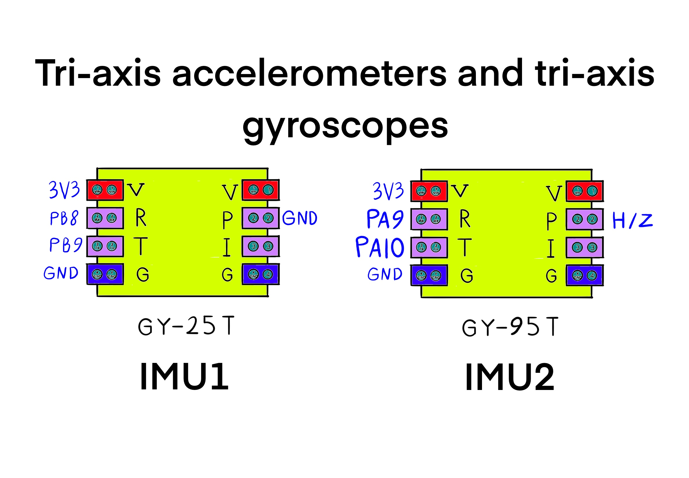
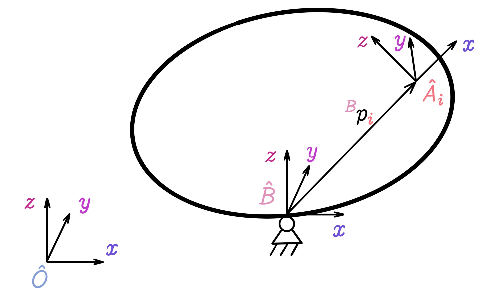
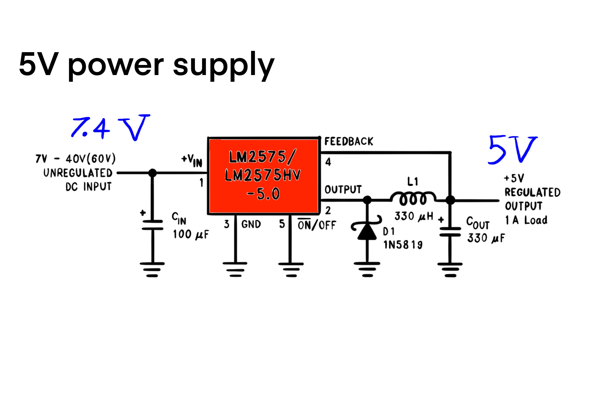

```@meta
Description = "How the reaction wheel unicycle works."
```

# How the Reaction Wheel Unicycle Works


This is a model of a unicycle with two symmetrically attached rotors. One of the reasons the matrix of inertia is not trivial is that the rotors’ axes of rotation do not intersect at a point. The constraint on the system is conservation of angular momentum. The angular velocity of the body is related to the rotor velocities. That relation gives rise to a differential equation in the rotation group Special Orthogonal of real dimension 3 for the robot’s body. Using the Euler parameters of ``SO(3)`` we obtain a local coordinate description of the differential equation, in terms of the roll, pitch and yaw angles. The robot can be repositioned by controlling the rotor velocities. The Linear Quadratic Regulator regulates the roll and pitch angles by a choice of a suitable input.


## Unicycle Balance Control

Here we deal with non-linear control systems that are described in terms of either differential equations or difference equations. In other words we consider the follwoing two types:

1. Differential equations: ``\left\{ \begin{array}{l} \dot{x}(t) = f(x(t), u(t)) &\\ y(t) = h(x(t), u(t)) \end{array} \right.``

2. Difference equations: ``\left\{ \begin{array}{l} x(k + 1) = f(x(k), u(k)) &\\ y(k) = h(x(k), u(k)) \end{array} \right.``

The variable ``x`` denotes the system state, the variable ``u`` denotes the control input to the system, and finally, the ``y`` variable denotes the output of the system. In the following, we explain how the system works through a robotics application. In this section, we see how the system works. But in the next section, we build a regulator to control the system state by generating suitable inputs for a given time frame.

The policy function produces the control inputs ``u(t)`` (or ``u(k)`` in the descrete case). The feeadback policy is called optimal control whenever it makes the system state ``x`` approximately equal to zero as the result of its application. The feeback policy is able to adapt through periodic policy updates. Between each two consecutive policy updates, a recursive relation updates filter coefficients, blocks of which are used to update the policy function. The policy update loop is slower whereas the filter coefficients update loop is faster.

The function ``h``, which produces the output ``y``, and the quality ``Q(x, u)`` are similar functions. The similarity of ``h(x, u)`` and the quality function ``Q(x, u)`` is first because both have the same parameter signature that includes the statem state vector ``x`` and the input vector ``u``. Second, because both ``h`` and ``Q`` produce verifiable statements about the value of the ststem state at the next time step ``k + 1`` or ``t`` in the immediate future. Later in the next section, we see how a least squares relation can be used to calculate a difference equation between the desired state and the measured state, as a feedback signal for enhancing the quality function ``Q`` and producing accurate outputs ``y`` over time.

On one hand, the filter coefficients play the role of a critic that evaluates the quality of being in state ``x`` and having taken input ``u``. On the other hand, the policy plays the role of an actor that uses the system state ``x`` as input to a matrix-vector product that produces the feedback policy ``u``. The Actor/Critic architechture uses the first principles of reinforcement learning for adapting the optimal control inputs. The adpativeness of the controller increases the probability that the quality of the system state ``x`` is measured higher as the time variable ``t`` in differential equations (or ``k`` in the case of difference equations) progresses forward in time.


System states in real time. Even though the matrix of inertia (among other physical parameters) is unknown, the adaptive controller based on value iteration keeps the states stable and regulates them to zero.


### Example

The robot that we build here is a self-balancing reaction wheel unicycle. As it is known from the name, this robot has only one wheel and therefore has one contact point with the ground surface. Just one contact point is the reason it is more complex compared to two-wheel balance robots. In fact, the robot has to preserve it balance in two directions around two perpendicular axes. In this robot, the motion in the forward/backward direction is like balancing a two-wheel balance robots, and so it obeys the same laws of physics. But since the robot has no way of moving to either left or right, in order to balance along the left/right direction we have to use another torque generator. For that purpose, we use a rotating mass, which is also called a reaction wheel. This rotating mass, which is mounted at the top of the robot, works based on the physical principle that if we apply a torque on it until it starts moving, then that mass also applies a torque on the robot's chassis, as large as the torque that is applied to it. One of the physical principles called the preservation of angular momentum explains this phenomenon. According to this principle, the sum of the angular momenta of a rotating set around a specific axis remains constant, unless it is acted upon by an external torque. So if one of the parts of the rotating set starts rotating using its internal torque, then the complement of the part (the other parts of the set) start rotating in the opposite direction in order to neutralize the internal motion of that part. Otherwise the angular momentum of the entire set will not be preserved. Using this reaction torque we can take control of the angle of the robot's bofy in the left and right directions.

The one-wheel balance robot may not seem so practical at first, but similar to two-wheel balance robots, or different kinds of the inverted pendulum, provides proper conditions for experimenting with various control algorithms. In addition, the most important part of the robot, the reaction wheel has a special application in satellites. After a satellite is placed into orbit around a celestial body, the only force acting on it is caused by the gravitational field. Therefore, it will have no control over its own motion. In order for the satellite to make small maneuvres along its path, or to be able to make small adjustments to its orbit, usually they equip it with three motion systems: the propulsion motor, the electromagnetic torque generator, or the reaction wheel. The first item is outside of the scope of this project. The reaction wheel is applied in satellites by rotating the wheel in the opposite direction for as much as needed for pointing at a specific direction. The amount of rotation is determined based on the ratio of the rotational momenta between the satellite and the wheel. To control the rotation of the satellite in all spatial directions, it is equipped with three wheels that are mounted in mutually perpendicular directions. Professional motorcyclists also take advantage of this property of the preservation of rotational inertia. Whenever a motorcyclist makes a jump and is detatched from the Earth, The only force acting on in that moment is the gravity of the Earth, which is outside of the control of the cyclist. In this situation, the cyclist can set its landing angle (attack vector) by accelerating the rear wheel or decelerating (braking). The effect of the reaction of the rear wheel that is applied to the body of the motorcycle, rotates the whole system in the upward or downward direction. To build this robot, it is required to become familiar with the mechanical structure, mathematical modelling, control algorithms, digital design and electronic circuits.


## The Z-Euler Angle Is Not Observable

The control and navigation of mobile robots is not pissible without knowing the position. For positioning, various sensors have been designed and built, which are used based on their specific applications. Among positioning systems one can name a list: accurate accelerometrs used in rockets, existing gyroscopes in flying machines, altimeters, navigation systems based on the magnetic field of the Earth, or even more advanced navigation systems based on the images of stars that are used in satellites and spacecrafts.


Nowadays, the electromechanical sensors are manufactured in small scales (micrometers). This technology is known by the name of Micro-Electro-Mechanical Systems (MEMS). The birth of the MEMS technology has had a great effect on the price, size and the improved precision of different kinds of electronic sensors in the market. This subject makes it possible to use a multiple of such sensors in a small robot. In some cases, manufacturers offer multiple sensors of different types in a unit microchip package.


Among positioning peripherals, sensors that measure the acceleration, the rotational velocity (gyroscopes), and the magnetic field are the most applicable in small self-driving robots. This section focuses on the accelerometer and the gyroscope sensors. Using accelerometers you can calculate the accleration of your robot, along with its velocity and position through integration. You should know that the gravitational field of the Earth has an effect on the measurements of an accelerometer. This issue makes it harder to find the position, but it is useful for measuring the deviation from the gravitational direction (the vertical line). Also, the gyroscope essentially measures the angular velocity, after which it will be possible to calculate the angular position (direction) using integration. This way, with the help of accelerometrs and gyroscopes you have the ability to measure the position and orientation of the motion of your robot, and in particular the estimate of the angle of deviation from the vertical line (the direction of gravity) is possible.

### Acclerometers

Every accelerometer based on Micro Electro Mechanical Systems (MEMS) has some sort of moving part inside of it, such that it moves under the influence of external forces. This part is held in place using a spring structure, and the displacement caused by the external force on it, is measured using various methods such as the change in capacitance. The Hooke's law states that the force excerted by a spring is directly proportional to the displacement caused by that force. Then, knowing the spring constant (the force per unit of distance traveled) and the mass of the part, this displacement is transformed to its equivalent acceleration. Therefore, MEMS accelerometers measure an external force excerted on the moving part. That is why these accelerometers measure the static acceleration (the Earth's gravity) and the dynamical acceleration (due to changes in velocity) the same and decomposing the two measurements is your responsibility. In this way, if the direction of the accelerometer is in the direction of the Earth's gravitational field, then the measurement value is the representation of the acceleration due to motion in addition to the gravitational acceleration (``9.8 \frac{m}{s^2}``). And if the direction of the measurement of the sensor is in the horizontal direction (perpendicular to the gravitational field of the Earth) then only the dynamical acceleration is measured and gravity will not have any effect on the measurement. So, in case a one-axis accelerometer (capable of measuring in one of the directions of the coordinate system) is used in a system, the orientation of it must be specified with respect to the gravitational direction so that the static acceleration is computable.


Using a two-axis accelerometer for measuring the direction of the Earth's gravity in the plane perpendicular to the Earth. In this figure, the orientation of the two-axis accelerometer (X-Y) with respect to the horizontal direction is computable using the given relation.

``\alpha = tan^{-1}(\frac{A_X}{A_Y})``

Now, imagine that you have two or three accelerometers such that their directions of measurement are mutually orthogonal (like the X, Y, and Z coordinate axes of the standard Cartesian coordinate system). If the velocity of this set is constant and only the static accelration due to gravity acts on it, by comparing the ratio of the measured accelerations across the axes, the orientation angle of the set with respect to the direction of gravity is computable. This is the way that many electronic balances and mobile robots use to measure the angle of orientation with respect to the direction of gravity.


Using a tri-axis accelerometer for measuring the direction of the Earth's gravity in the three-dimensional space. In this figure, the orientation of the three-axis accelerometer (X-Y-Z) with respect to the hirozontal plane and the direction of gravity is computable using the given relations.

``\alpha = tan^{-1}(\frac{A_{X,OUT}}{\sqrt{A^2_{Y,OUT} + A^2_{Z,OUT}}})``

``\beta = tan^{-1}(\frac{A_{Y,OUT}}{\sqrt{A^2_{X,OUT} + A^2_{Z,OUT}}})``

``\gamma = tan^{-1}(\frac{\sqrt{A^2_{X,OUT} + A^2_{Y,OUT}}}{A_{Z,OUT}})``

Note that knowing the angles between each axis and the direction of gravity, does not give the general angular orientation of the accelerometer in the three-dimensional space. In fact, if this accelerometer is rotated about an axis parallel to gravity, all three axes will measure the same result compared to before the rotation. The reason for the Z-Euler angle not being observable is that the projection of the gravity vector onto the horizontal plane looks like a point (approximately the zero vector). In order to determine the angular orientation of the accelerometer in a complete way, it needs to measure at least two known vectors that are not parallel with respect to each other (the gravity vector and another vector). In every case, using a three-axis accelerometer one can build an electronic balance that can measure tilt in two mutually perpendicular directions.

Many manufacturers, make two-axis and tri-axis accelerometers as one chip, where two and three accelerometers (respectively) are placed in perpendicular directions in a unit package.

One of the fundamental problems of using accelerometrs to measure deviation, is the effect of dynamical accelerations (caused by changes in velocity) on the measurement of direction. For example, if you install such a device on a car and want to measure the slope of the road, the measured direction is correct as long as the vehicle has constant velocity. But when the car's velocity changes, the vector of dynamical acceleration is added to the vector of static acceleration and your measuring device measures the direction of this new vector (which is different from the direction of the Earth's gravity). One other disadvantage of accelerometers is the sensitivity to vibrations and the production of noisy results.


Estimating the slope of the road through measuring the direction of gravity using the accelerometer that is embedded in the car. In (a) the car has positive acceleration (increasing velocity), and in (b) without acceleration (constant velocity), and in (c) the car has negative acceleration (braking). As you can see, only in the figure (b) the direction of gravitational acceleration and the slope of the road are measured correctly.

Sensitivity to vibrations and dependence on dynamical accelerations, make it necessary to get help from other sensors such as gyroscopes and the magnetic field sensor (the electronic compass) for measuring the direction of the Earth's gravity.


To choose an accelerometer, one should pay attention to the measurement range, the sampling rate, the interface (the analog or digital communication protocol) and also the number of axes that are needed in the project (the number dimensions). Other parameters that should be considered in MEMS accelerometers are sensitivity to temperature and supply voltage changes, and the existence of an initial offset (the value read at zero acceleration), which is corrected with calbration. Here, we show how to use three-axis accelerometers.

### Gyroscopes

As you know, a gyroscope essentially measures the angular velocity about an axis. A rotation about an axis is measured with a specific value (often in terms of degrees per second ``\frac{deg}{s}``) and a rotation in the opposite direction results in a value with the opposite sign, and in the case where the rotation is stopped, the value of zero is measured. Mechanical gyroscopes that work based on coriolis forces / the coriolis effect of a rotating mass, had been used in airplanes and rockets for a while until optical gyroscopes and various kinds of MEMS were built. Among gyroscopes, optical gyroscopes are the most accurate, whereas the MEMS gyroscopes are the cheapest and the most applied type of this measuring device.

Unlike accelerometers, a gyroscope is not generally sensitive to vibrations and produces more continuous measurement results. But, since the angular velocity is not that useful on its own, and the angular orientation is more useful to mobile vehicles, the output of this sensor is integrated to extract the angular position. Having an integrator in a positioning system based on gyroscopes causes the accumulation of the smallest offsets and unavoidable permanent errors over time to produce greater errors. As such, the angular position computed by  the integrator using the output of the gyroscope drifts away from the real value over time, so much that after the passgae of a few minutes (or even a few seconds) the computed values are no longer valid. This issue forces the use of other sensors such as a detector of the Earth's magnetic field or an acclerometer along with the gyroscope, unless the goal of measurement is only the angular velocity and not the angular position, in which case the integrator is removed and the output of the gyroscope will be accurate enough.

Like MESMS accelerometers, MEMS gyroscopes are manufactured in small sizes with afforable prices, and many manufacturers provide two or three gyroscopes in a single electronic package for measurements along different directions that are perpendicular with respect to one another.


A three-axis gyroscope measures the angular velocity about three mutually perpenducular axes (X, Y and Z). Ususally, the right-handed rotation about each axis is denoted by the positive sign and the left-handed rotation is denoted by the negative sign. The angular velocity is expressed in terms of degrees per second ``\frac{deg}{s}``. In flying vehicles such as rockets and airplanes and also some mobile robots, the names Roll, Yaw and Pitch are used to label the rotation axes. The axes Roll, Yaw and Pitch are not necessarily aligned with the X, Y and Z axes and this fact depends on the assignment of the coordinate system axes to the mobile object.

When choosing a gyroscope, one should consider its measurable velocity range, the sampling rate, the way to communicate with it (analog or digital), and also the number of required axes in the project (the number of dimensions). In addition to those parameters, consider issues such as the sensitivity to temperature and supply voltage changes, the initial offset (the value read in the stationary state) and the cross-sxis sensitivity. If a gyroscope is rotated around an axis perpendicular to the measurement axis, it should measure the value zero, but it is not the case in practice. The gyroscope can show sensitivity to rotation in directions other than the one that is to be measured. This value, which must be as small as possible, represents the cross-axis sensitivity and is expressed in terms of the error percentage.


The function `updateIMU` provides the main source of data for the objective of the system. Through this function, the Micro-Controller Unit (MCU) talks to the Inertial Measurement Unit (IMU) modules 1 and 2 for updating the roll and pitch angles along with their first and second derivatives. This is done by calling the function and giving it a pointer to the Linear Quadratic Regulator (LQR) model object. Although both IMUs are used for tilt estimation, the final result is assigned to the field of IMU 1. This function encapsulates matrix-vector multiplications for coordinate transformations, the singular value decomposition for obtaining the gravity vector, and sensor fusion between the tri-axis accelerometers and the tri-axis gyroscopes. Knowing about the position and orientation of each IMU with respect to the body, the function excludes linear accelerations from calculations. So, `UpdateIMU` gathers the latest inertial measurements form multiple sensor units and computes the roll and pitch angles using known parameters of the system configuration.



In terms of connectivity, The MCU peripheral USART1 is used to talk to IMU #2 (GY-95T). Set the baudrate of uart1 to 115200 Bits/s for the GY-95 IMU module. Set the Pin6 (PS: IIC/USART output mode selection) of IMU #2 (GY-25T) to zero, in order to use the I2C protocol. The I2C clock speed is set at 100000 Hz in the stanard mode. For saving MCU clock cycles and time, added a DMA request with USART1_RX and DMA2 Stream 2 from peripheral to memory and low priority. The mode is circular and the request call is made once in the main function by passing the usart1 handle and the receive buffer. The request increments the address of memory. The data width is one Byte for both the preipheral and memory.




```c
void updateIMU(LinearQuadraticRegulator *model)
{
  updateIMU1(&(model->imu1));
  updateIMU2(&(model->imu2));
  setIndexVec3(&(model->imu1.R), 0, model->imu1.accX);
  setIndexVec3(&(model->imu1.R), 1, model->imu1.accY);
  setIndexVec3(&(model->imu1.R), 2, model->imu1.accZ);
  setIndexVec3(&(model->imu2.R), 0, model->imu2.accX);
  setIndexVec3(&(model->imu2.R), 1, model->imu2.accY);
  setIndexVec3(&(model->imu2.R), 2, model->imu2.accZ);

  for (int i = 0; i < 3; i++)
  {
    setIndexVec3(&(model->imu1._R), i, 0.0);
    setIndexVec3(&(model->imu2._R), i, 0.0);
  }

  for (int i = 0; i < 3; i++)
  {
    for (int j = 0; j < 3; j++)
    {
      setIndexVec3(&(model->imu1._R), i, getIndexVec3(model->imu1._R, i) + getIndexMat3(model->imu1.B_A_R, i, j) * getIndexVec3(model->imu1.R, j));
      setIndexVec3(&(model->imu2._R), i, getIndexVec3(model->imu2._R, i) + getIndexMat3(model->imu2.B_A_R, i, j) * getIndexVec3(model->imu2.R, j));
    }
  }

  for (int i = 0; i < 3; i++)
  {
    setIndexMat32(&(model->Matrix), i, 0, getIndexVec3(model->imu1._R, i));
    setIndexMat32(&(model->Matrix), i, 1, getIndexVec3(model->imu2._R, i));
  }

  for (int i = 0; i < 3; i++)
  {
    for (int j = 0; j < 4; j++)
    {
      setIndexMat34(&(model->Q), i, j, 0.0);
      for (int k = 0; k < 2; k++)
      {
        setIndexMat34(&(model->Q), i, j, getIndexMat34(model->Q, i, j) + getIndexMat32(model->Matrix, i, k) * getIndexMat24(model->X, k, j));
      }
    }
  }
  setIndexVec3(&(model->g), 0, getIndexMat34(model->Q, 0, 0));
  setIndexVec3(&(model->g), 1, getIndexMat34(model->Q, 1, 0));
  setIndexVec3(&(model->g), 2, getIndexMat34(model->Q, 2, 0));
  model->beta = atan2(-getIndexVec3(model->g, 0), sqrt(pow(getIndexVec3(model->g, 1), 2) + pow(getIndexVec3(model->g, 2), 2)));
  model->gamma = atan2(getIndexVec3(model->g, 1), getIndexVec3(model->g, 2));

  setIndexVec3(&(model->imu1.G), 0, model->imu1.gyrX);
  setIndexVec3(&(model->imu1.G), 1, model->imu1.gyrY);
  setIndexVec3(&(model->imu1.G), 2, model->imu1.gyrZ);
  setIndexVec3(&(model->imu2.G), 0, model->imu2.gyrX);
  setIndexVec3(&(model->imu2.G), 1, model->imu2.gyrY);
  setIndexVec3(&(model->imu2.G), 2, model->imu2.gyrZ);

  for (int i = 0; i < 3; i++)
  {
    setIndexVec3(&(model->imu1._G), i, 0.0);
    setIndexVec3(&(model->imu2._G), i, 0.0);
  }

  for (int i = 0; i < 3; i++)
  {
    for (int j = 0; j < 3; j++)
    {
      setIndexVec3(&(model->imu1._G), i, getIndexVec3(model->imu1._G, i) + getIndexMat3(model->imu1.B_A_R, i, j) * getIndexVec3(model->imu1.G, j));
      setIndexVec3(&(model->imu2._G), i, getIndexVec3(model->imu2._G, i) + getIndexMat3(model->imu2.B_A_R, i, j) * getIndexVec3(model->imu2.G, j));
    }
  }
  for (int i = 0; i < 3; i++)
  {
    setIndexVec3(&(model->r), i, (getIndexVec3(model->imu1._G, i) + getIndexVec3(model->imu2._G, i)) / 2.0);
  }

  setIndexMat3(&(model->E), 0, 0, 0.0);
  setIndexMat3(&(model->E), 0, 1, sin(model->gamma) / cos(model->beta));
  setIndexMat3(&(model->E), 0, 2, cos(model->gamma) / cos(model->beta));
  setIndexMat3(&(model->E), 1, 0, 0.0);
  setIndexMat3(&(model->E), 1, 1, cos(model->gamma));
  setIndexMat3(&(model->E), 1, 2, -sin(model->gamma));
  setIndexMat3(&(model->E), 2, 0, 1.0);
  setIndexMat3(&(model->E), 2, 1, sin(model->gamma) * tan(model->beta));
  setIndexMat3(&(model->E), 2, 2, cos(model->gamma) * tan(model->beta));

  for (int i = 0; i < 3; i++)
  {
    setIndexVec3(&(model->rDot), i, 0.0);
  }

  for (int i = 0; i < 3; i++)
  {
    for (int j = 0; j < 3; j++)
    {
      setIndexVec3(&(model->rDot), i, getIndexVec3(model->rDot, i) + getIndexMat3(model->E, i, j) * getIndexVec3(model->r, j));
    }
  }

  model->fusedBeta = model->kappa1 * model->beta + (1.0 - model->kappa1) * (model->fusedBeta + model->dt * (getIndexVec3(model->rDot, 1) / 180.0 * M_PI));
  model->fusedGamma = model->kappa2 * model->gamma + (1.0 - model->kappa2) * (model->fusedGamma + model->dt * (getIndexVec3(model->rDot, 2) / 180.0 * M_PI));
  model->imu1.yaw += model->dt * getIndexVec3(model->rDot, 0);

  float _roll = model->fusedBeta;
  float _pitch = -model->fusedGamma;
  float _roll_velocity = ((getIndexVec3(model->rDot, 1) / 180.0 * M_PI) + (_roll - model->imu1.roll) / model->dt) / 2.0;
  float _pitch_velocity = ((-getIndexVec3(model->rDot, 2) / 180.0 * M_PI) + (_pitch - model->imu1.pitch) / model->dt) / 2.0;
  model->imu1.roll_acceleration = _roll_velocity - model->imu1.roll_velocity;
  model->imu1.pitch_acceleration = _pitch_velocity - model->imu1.pitch_velocity;
  model->imu1.roll_velocity = _roll_velocity;
  model->imu1.pitch_velocity = _pitch_velocity;
  model->imu1.roll = _roll;
  model->imu1.pitch = _pitch;
}
```

## Stepping Through the Implementation

In this section, we step through the implementation of the robot's controller in the order of execution. The controller is implemented in the C programming language. It runs on a STM32F401RE mictocontroller, which is clocked at 84 MHz. Starting from first principles, there are at least two loops in a reinforcement learning program: the actor loop and the critic loop. The critic loop operates at a faster timescale and finds filter coefficients by taking actions, making mesurements and computing a recursive algorithm. In contrast, the actor loop is slower and updates the control policy, which is a function that produces actions. Even though actions are taken in the critic loop, the feedback policy function is the same across multiple runs of the loop. The actor loop is where the feedback policy is updated as a function of the latest set of filter coefficients. The state estimations and matrix parameters of the controller are stored in a data structure. The `LinearQuadraticRegulator` type is instantiated and initialized once, before either of the loops begin execution.

```c
typedef struct
{
  Mat12 W_n;                           // filter matrix
  Mat12 P_n;                           // inverse autocorrelation matrix
  Mat210 K_j;                          // feedback policy
  Vec12 dataset;                       // (xₖ, uₖ)
  Vec12 z_n;                           // z_n in RLS
  Vec12 g_n;                           // g_n in RLS
  Vec12 alpha_n;                       // alpha_n in RLS
  float x_n_dot_z_n;                   // the inner product of the x_n (dataset) and z_n
  int j;                               // step number (policy iteration)
  int k;                               // time k (value iteration)
  int n;                               // the state estimation vector xₖ ∈ ℝⁿ
  int m;                               // the system input vector uₖ ∈ ℝᵐ
  float lambda;                        // exponential wighting factor
  float delta;                         // value used to intialize P(0)
  int active;                          // is the model controller active
  float cpuClock;                      // the CPU clock
  float dt;                            // period in seconds
  float reactionDutyCycle;             // reaction wheel's motor PWM duty cycle
  float rollingDutyCycle;              // rolling wheel's motor PWM duty cycle
  float reactionDutyCycleChange;       // the maximum incremental change in the reaction motor's duty cycle
  float rollingDutyCycleChnage;        // the maximum incremental change in the rolling motor's duty cycle
  float clippingValue;                 // the clipping value for any of the P matrix elements at which the clipping is applied
  float clippingFactor;                // the coefficient by which the P matrix elements are rescaled through scalar multiplication
  float rollSafetyAngle;               // the roll angle in radian beyond which the controller must become deactive for safety
  float pitchSafetyAngle;              // the pitch angle in radian beyond which the controller must become deactive for safety
  float kappa1;                        // tuning parameters to minimize estimate variance (the ratio between the accelerometer and the gyroscope in sensor fusion)
  float kappa2;                        // tuning parameters to minimize estimate variance (the ratio between the accelerometer and the gyroscope in sensor fusion)
  int maxEpisodeLength;                // the maximum number of interactions with the nevironment before the model becomes deactive for safety
  int logPeriod;                       // the period between printing two log messages in terms of control cycles
  int logCounter;                      // the number of control cycles elpased since the last log message printing
  int maxOutOfBounds;                  // the maximum number of consecutive cycles where states are out of the safety bounds
  int outOfBoundsCounter;              // the number of consecutive times when either of safety angles have been detected out of bounds
  float beta;                          // y-Euler angle (pitch)
  float gamma;                         // x-Euler angle (roll)
  float fusedBeta;                     // y-Euler angle (pitch) as the result of fusing the accelerometer sensor measurements with the gyroscope sensor measurements
  float fusedGamma;                    // x-Euler angle (roll) as the result of fusing the accelerometer sensor measurements with the gyroscope sensor measurements
  Mat34 Q;                             // The matrix of unknown parameters
  Vec3 r;                              // the average of the body angular rate from rate gyro
  Vec3 rDot;                           // the average of the body angular rate in Euler angles
  Mat3 E;                              // a matrix transfom from body rates to Euler angular rates
  Mat24 X;                             // The optimal fusion matrix
  Mat32 Matrix;                        // all sensor measurements combined
  Vec3 g;                              // The gravity vector
  Mat2 Suu;                            // The input-input kernel
  Mat2 SuuInverse;                     // the inverse of the input-input kernel
  Mat210 Sux;                          // the input-state kernel
  Vec2 u_k;                            // the input vector
  IMU imu1;                            // the first inertial measurement unit
  IMU imu2;                            // the second inertial measurement unit
  Encoder reactionEncoder;             // the reaction wheel encoder
  Encoder rollingEncoder;              // the rolling wheel encoder
  CurrentSensor reactionCurrentSensor; // the reaction wheel's motor current sensor
  CurrentSensor rollingCurrentSensor;  // the rolling wheel's motor current sensor
} LinearQuadraticRegulator;
```


There are two fuse bits on the robot for configuration without flashing a program. The first one is connected to the port C of the general purpose input / output, pin 0. The fuse bit is active whenever the connected pin is grounded. The fuse bit deactivates the linear quadratic regulator by clearing the `active` field as a flag in the model structure. Even though the status of the fuse bit 0 is necessary to activate the model, it is not a sufficient condition. The user must connect the fuse bit and also push a blue push button once on the robot for activating the model. The push button is the same blue button that is found on the NUCLEOF401RE board. These two conditions are chained together for safety reasons. If the model is not active, then the robot must stop moving by calling the function `resetActuators`.


```c
if (HAL_GPIO_ReadPin(GPIOC, GPIO_PIN_0) == 0)
{
  if (HAL_GPIO_ReadPin(GPIOC, GPIO_PIN_13) == 0)
  {
    HAL_GPIO_WritePin(GPIOA, GPIO_PIN_5, GPIO_PIN_RESET);
    model.active = 1;
  }
}
else
{
  model.active = 0;
  resetActuators(&model);
}
```

When the reaction wheel unicycle falls over, the roll and pitch angles of the chassis with respect to the pivot point exceed ten degrees. It makes sense to disable the actuators after a fall has been detected to both save energy and minimize physical shock to gearboxes. The lower and upper bounds on the roll and pitch angles are combined using the logical "or" operator `||` with the episode counter so that the model stops running after the maximum number of interactions with the environment, the total steps in an episode. A fall or a certain number of interactions, whichever comes first, must cause the model to deactivate on its own. When the model is deactivated, the green light on the NUCLEOF401RE turns on to signify that the controller is no longer active. The user has four options whenever the green LED lights up:

1. Pick the robot up and make it stand upright, before pushing the blue push button to run again.

2. Switch the power button on the chassis to condition zero, in order to power off the robot.

3. Connect to the robot WiFi network and execute the following command in the terminal for printing the logs. Print `uart6` serial messages by executing: `nc 192.168.4.1 10000`

4. Activate the Porta.jl environment in a Julia REPL and then run the linked script for visualizing the logs: [Unicycle](https://github.com/iamazadi/Porta.jl/blob/master/models/unicycle.jl)

Since the robot is portable and has a feedback loop related to the motion of its body, violating the safety angle bounds does not immediately disable the model. Instead, the `outOfBoundsCounter` is incremented every time the safety conditions are violated and is decremented otherwise. Then the model is deactivated if the out of bounds counter is greater than `maxOutOfBounds`. This approach reduces the probability that a discontinous state estimation is able to trigger deactivation.

```c
if (fabs(model.imu1.roll) > model.rollSafetyAngle || fabs(model.imu1.pitch) > model.pitchSafetyAngle || model.j > model.maxEpisodeLength)
{
  model.outOfBoundsCounter = model.outOfBoundsCounter + 1;
}
else
{
  model.outOfBoundsCounter = fmax(0, model.outOfBoundsCounter - 1);
}

if (model.outOfBoundsCounter > model.maxOutOfBounds)
{
  model.active = 0;
  HAL_GPIO_WritePin(GPIOA, GPIO_PIN_5, GPIO_PIN_SET);
}
```

The microcontroller is built around a Cortex-M4 with Floating Point Unit (FPU) core, which contains hardware extensions for debugging features. The debug extensions allow the core to be stopped either on a given instruction fetch (breakpoint), or on data access (watchpoint). When stopped, the core's internal state and the system's external state may be examined. Once examination is complete, the core and the system may be restored and program execution resumed.


The ARM Cortex-M4 with FPU core provides integrated on-chip debug support. One of the debug features is called Data Watchpoint Trigger (DWT). The DWT unit provides a means to give the number of clock cycles. The DWT register `CYCCNT` counts the number of clock cycles. The period of a control loop is required in the application for integrating the gyroscopic angle rates. If we count the number of clocks twice: one time before the loop begins and one time after the loop ends, then we can find the time period that it takes to complete a control loop. In the beginning, we count the number of clocks by assigning the register value to a local variable called `t1`.

At the end of the control loop, where the model has taken one step forward, it is time to count the number of the processor's clock cycles for a second time for measuring delta `t`. At this point, by assigning the value of the `DWT` counter register to the variable `t2` we can know how many cycles are there between `t1` and `t2`. Then divide the difference by the number of Central Processing Unit (CPU) clock cycles per second `cpuClock` for finding the period of the control loop. The field `dt` of the model struct saves the control period.

If the model is set to active, then the controller takes one step forward. The function `stepForward` takes as argument a pointer to the model, mainly because two of its fields require persistent memory across runs: the filter matrix `W_n` and the inverse autocorrelation matrix `P_n`. The system state estimation is done by calling `updateSensors`. But since we extend the meaning of the value function to the quality function ``Q(x, u)``, the states ``x_k`` are appended by the inputs ``u_k``, which in turn are computed by calling `computeFeedbackPolicy`. The function call `applyFeedbackPolicy` applies the action of the feedback policy, changing the angular velocity of the motors.

``Q(x, u) = Q(z) = W^T \phi(z)``

``x_k \in \mathbb{R^n}, \ u_k \in \mathbb{R^m}``

In the case where the model is active, the critic loop is run for a few times before the policy is updated by calling the `updateControlPolicy` function. However, when the model in not active, neither the critic loop nor the actor loop are executed. During the inactive mode of operation, the program makes measurements by calling the functions `updateSensors` and `computeFeedbackPolicy`, and resets the actuators by calling the function `resetActuators`.

```c
if (model.active == 1)
{
  model.logPeriod = 20;
  for (int i = 0; i < 5; i++)
  {
    t1 = DWT->CYCCNT;
    updateSensors(&model);
    computeFeedbackPolicy(&model);
    applyFeedbackPolicy(&model);
    stepForward(&model);
    model.logCounter = model.logCounter + 1;
    t2 = DWT->CYCCNT;
    diff = t2 - t1;
    model.dt = (float)diff / model.cpuClock;
  }
  updateControlPolicy(&model);
}
else
{
  model.logPeriod = 80;
  t1 = DWT->CYCCNT;
  resetActuators(&model);
  updateSensors(&model);
  computeFeedbackPolicy(&model);
  model.logCounter = model.logCounter + 1;
  t2 = DWT->CYCCNT;
  diff = t2 - t1;
  model.dt = (float)diff / model.cpuClock;
}
```

In order to monitor the controller and debug issues, we write the logs periodically to the standard input / output console. The variable `log_counter` is incremented by one every control cycle. Then, the log counter variable `logCounter` is compared to the constnt `logPeriod` for finding out if a cycle should be logged. But it is not a sufficient condition for logging, because a second fuse bit is also rquired for permission to log. The second fuse bit is connected to the port C of the general purpose input / output, pin 1. Whenever the fuse bit pin is grounded, it is activated. Once the fuse bit is active, the local transmission flag `transmit` is set at the relevant control cycle count. The reason for `logPeriod` is to limit the total number of logs per second, as the Micro-Controller Unit (MCU) is too fast for a continuous report. And the second fuse bit is there to turn off logging for saving time, as log transmission takes time away from the control processes. So by using the logical "and" operator `&&` we can combine the logging period condition with the logging fuse bit, in order to manage the frequnecy of transmissions.

```c
if (model.logCounter > model.logPeriod && HAL_GPIO_ReadPin(GPIOC, GPIO_PIN_1) == 0)
{
  transmit = 1;
}
```

If the `transmit` variable is equal to one, then the log counter `logCounter` is cleard along with the `transmit` variable, before transmission. The function `sprintf` is called with a message buffer `MSG` and a formatted string to populate the buffer with numbers. A log message can be anything, but for finding the matrix of known parameters in tilt estimation, the accelerometrs data must be included. After the message is composed, it is given as an argument to the function `HAL_UART_Transmit`, which stands for: Hardware Abstraction Layer, Universal Asynchronous Receiver / Transmitter, Transmit. The function also requires a pointer to `uart6`, which is a micro-controller peripheral for serial communications, and the size of the message buffer, along with a time out delay. Printing and transmitting the log finishes the actor loop. The console on the other side of tranmission should receive a line like this:
`AX1: -0.01, AY1: 1.03, AZ1: 0.00, | AX2: -0.05, AY2: 0.97, AZ2: -0.04, | roll: 0.03, pitch: -1.59, | encT: 0.46, encB: 4.31, | j: 1038.000000, | x0: -0.02, x1: -0.12, x2: 0.03, x3: -1.22, x4: -0.90, x5: 0.05, x6: 0.09, x7: -0.04, x8: 0.00, x9: -0.01, x10: 0.00, x11: 0.00, | P0: -96.08, P1: 0.27, P2: 2.04, P3: 1.18, P4: 1.36, P5: 0.34, P6: 0.03, P7: 0.77, P8: 0.08, P9: 0.57, P10: 62.48, P11: 62.48, dt: 0.001947`.

You can visualize this example message using the [Unicycle](https://github.com/iamazadi/Porta.jl/blob/master/models/unicycle.jl) script. The example includes: the tri-axis acceleromer measurements of IMU 1 and IMU 2, the roll and pitch angles after the primary and secondary sensor fusions, the absolute position of both rotary encoders, and the diagonal entries of the inverse auto-correlation matrix `P_n`. Different messages can be composed for different use cases, for example printing raw sensor readings for calibrating the zero point and the scale of the accelerometers axes.

```c
if (transmit == 1)
{
  transmit = 0;
  model.logCounter = 0;

  sprintf(MSG,
          "AX1: %0.2f, AY1: %0.2f, AZ1: %0.2f, | AX2: %0.2f, AY2: %0.2f, AZ2: %0.2f, | roll: %0.2f, pitch: %0.2f, | encT: %0.2f, encB: %0.2f, | j: %0.1f, | x0: %0.2f, x1: %0.2f, x2: %0.2f, x3: %0.2f, x4: %0.2f, x5: %0.2f, x6: %0.2f, x7: %0.2f, x8: %0.2f, x9: %0.2f, x10: %0.2f, x11: %0.2f, | P0: %0.2f, P1: %0.2f, P2: %0.2f, P3: %0.2f, P4: %0.2f, P5: %0.2f, P6: %0.2f, P7: %0.2f, P8: %0.2f, P9: %0.2f, P10: %0.2f, P11: %0.2f, dt: %0.6f\r\n",
          model.imu1.accX, model.imu1.accY, model.imu1.accZ, model.imu2.accX, model.imu2.accY, model.imu2.accZ, model.imu1.roll, model.imu1.pitch, model.reactionEncoder.radianAngle, model.rollingEncoder.radianAngle, (float)model.j, model.dataset.x0, model.dataset.x1, model.dataset.x2, model.dataset.x3, model.dataset.x4, model.dataset.x5, model.dataset.x6, model.dataset.x7, model.dataset.x8, model.dataset.x9, model.dataset.x10, model.dataset.x11, getIndexMat12(model.P_n, 0, 0), getIndexMat12(model.P_n, 1, 1), getIndexMat12(model.P_n, 2, 2), getIndexMat12(model.P_n, 3, 3), getIndexMat12(model.P_n, 4, 4), getIndexMat12(model.P_n, 5, 5), getIndexMat12(model.P_n, 6, 6), getIndexMat12(model.P_n, 7, 7), getIndexMat12(model.P_n, 8, 8), getIndexMat12(model.P_n, 9, 9), getIndexMat12(model.P_n, 10, 10), getIndexMat12(model.P_n, 11, 11), model.dt);

  HAL_UART_Transmit(&huart6, MSG, sizeof(MSG), 1000);
}
// Rinse and repeat :)
```

In order to enable the function `sprintf` to use floating point numbers, do the following steps:
1. Open the file `gcc-arm-none-eabi.cmake` that is created by CubeMX.
2. Add the option `-u _printf_float` to `CMAKE_C_FLAGS`.


Set the baudrate of `uart6` to 921600, for the wifi module HC-25. The HC-25 module settings are on the IP address `192.168.4.1` as a web page. Here is the checklist to set up a new module:
1. The password is not set for new modules. So just login without a password to access the settings page.
2. Set a username and password for the robot's access point.
3. Set the *WiFi Mode* to **AP** for Access Point.
4. Change the port number from *8080* to *10000*.
5. Set the *Baud Rate* parameter to 921600 Bits/s.


## Step Forward

The function `stepForward` identifies the Q function using RLS with the given pointer to the `model`. The algorithm updates the Q function at each step. As a result, the filter matrix `W_n` and the inverse auto-correlation matrix `P_n` are updated. Performs a one-step update in the parameter vector W by applying RLS to equation.

``W_{j + 1}^T (\phi(z_k) - \gamma \phi(z_{k + 1})) = r(x_k, h_j(x_k))``

``W_{j + 1}^T (\phi(z_k) - \phi(z_{k + 1})) = \frac{1}{2} (x_k^T Q x_k + u_k^T R u_k)``

```c
void stepForward(LinearQuadraticRegulator *model)
```

The vector of filter coefficients ``\textbf{w}_n = \begin{bmatrix} w_n(0) & w_n(1) & \ldots & w_n(p) \end{bmatrix}^T`` at time ``n`` minimizes the weighted least squares error. The weighted least squares error is equal to the squared norm of the error at time ``i`` times an exponential weighting factor, sumed over the observation interval. ``\Epsilon (n) = \sum_{i = 0}^{n} \lambda^{n - i} | e(i) |^2``. The exponential weighting (forgetting) factor ``\lambda`` is greater than zero and, less than or equal to one. ``0 < \lambda \leq 1``. The error at time ``i`` is equal to the difference between the desired signal and the filter output. ``e(i) = d(i) - y(i) = d(i) - \textbf{w}_n^T x(i)``. In the definition of the error, ``d(i)`` is the desired signal at time ``i``, and ``y(i)`` is the filter output at time ``i``. The filter output is the result of the matrix-vector product of the filter coefficients and the new data vector. The latest set of filter coefficients ``\textbf{w}_n(k)`` is used for minimizing the weighted least squares error ``\Epsilon (n)``. Also, it is assumed that the weights ``\textbf{w}_n`` are constant over the observation interval ``[0, n]`` with end points zero and ``n``.

For the error minimization objective, the partial derivative of the weighted least squares error with respect to the filter coefficients must be equal to zero. Setting the partial derivative equal to zero minimizes the weighted least squares error ``\frac{\partial \Epsilon (n)}{\partial \textbf{w}_n^* (k)} = 0`` for ``k = 0, 1, ..., p``, where ``p`` denotes the filter order. Following the implications of the partial derivative equation, the filter coefficients are transformed by the exponentially weighted deterministic autocorrelation matrix ``\textbf{R}_x(n) \textbf{w}_n = \textbf{r}_{dx}(n)`` in order to produce the deterministic cross-correlation between the desired signal ``d(n) = \begin{bmatrix} d(n) & d(n - 1) & \ldots & d(0) \end{bmatrix}^T`` and the new data vector ``\textbf{x}(i) = \begin{bmatrix} x(i) & x(i - 1) & \ldots & x(i - p) \end{bmatrix}^T``.

Therefore, the deterministic normal equations define the optimum filter coefficients. The exponentially weighted deterministic autocorrelation matrix ``\textbf{R}_x(n) \in \mathbb{R}^{(p + 1) \times (p + 1)}`` for the new data vector ``\textbf{x}(n)`` is defined as the sum of the outer product of the data vector with itself, in an exponential way with the given exponential factor ``\lambda``. In contrast, the deterministic cross-correlation ``\textbf{r}_{dx}(n)`` is the outer product between the desired signal ``d(n)`` and the data vector ``\textbf{x}(n)``.

``\left\{ \begin{array}{l} \textbf{r}_{dx}(n) = \sum_{i = 0}^n \lambda^{n - i} d(i) \textbf{x}^*(i) &\\ \textbf{R}_x(n) = \sum_{i = 0}^n \lambda^{n - i} \textbf{x}^*(i) \textbf{x}^T(i) \end{array} \right.``

Multiplying the filter coefficients with the deterministic cross-correlation on the left and then subtracting the result from the weighted norm of the desired signal ``|| d(n) ||_\lambda^2`` yields the minimum error ``\{\Epsilon(n)\}_{min} = || d(n) ||_\lambda^2 - \textbf{r}_{dx}^H(n) \textbf{w}_n``.

Both the deterministic autocorrelation matrix ``\textbf{R}_x(n)`` and the deterministic cross-correlation ``\textbf{r}_{dx}(n)`` depend on the time variable ``n``. So instead of directly solving the deterministic normal equations ``\textbf{R}_x(n) \textbf{w}_n = \textbf{r}_{dx}(n)``, it is easier to derive a recursive solution for the filter coefficients ``\textbf{w}_n``. A correction ``\Delta \textbf{w}_{n - 1}`` that is applied to the solution at time ``n - 1`` results in the filter coefficients ``\textbf{w}_n = \textbf{w}_{n - 1} + \Delta \textbf{w}_{n - 1}`` at time ``n``.

For a recursive equation, first derive the deterministic cross-correlation ``\textbf{r}_{dx}(n)`` at time ``n`` in terms of the cross-correlation ``\textbf{r}_{dx}(n - 1)`` at time ``n - 1``. To solve for the filter coefficients, multiply both sides of the deterministic normal equations on the left by the inverse of the deterministic autocorrelation matrix: ``\textbf{w}_n = \textbf{R}_x^{-1}(n) \textbf{r}_{dx}(n)``. Second, derive the inverse of the deterministic autocorrelation matrix ``\textbf{R}_x^{-1}(n)`` in terms of the inverse autocorrelation at the previous time ``\textbf{R}_x^{-1}(n - 1)`` and the new data vector ``\textbf{x}(n)``. On the one hand, the cross-correlation ``\textbf{r}_{dx}(n) = \sum_{i = 0}^n \lambda^{n - i} d(i) \textbf{x}^*(i)`` may be updated recursively as the sum of the previous cross-correlation times the weighting factor, and the desired signal times new data. On the other hand, the autocorrelation matrix ``\textbf{R}_x(n)`` may be updated recursively from the autocorrlation of the previous time ``\textbf{R}_x(n - 1)`` and the new data vector ``\textbf{x}(n)`` in this way: multiply the previous autocorrelation by the weighting factor and then add the result to the outer product of the new data vector with itself.

``\left\{ \begin{array}{l} \textbf{r}_{dx}(n) = \lambda \textbf{r}_{dx}(n - 1) + d(n) \textbf{x}^*(n) &\\ \textbf{R}_x(n) = \lambda \textbf{R}_x(n - 1) + \textbf{x}^*(n) \textbf{x}^T(n) \end{array} \right.``

Since we are interested in the inverse of the autocorrelation matrix ``\textbf{R}_x(n)`` we use the Woodbury's Identity. The Woodbury matrix identity ``(\textbf{A} + \textbf{u} \textbf{v}^H)^{-1} = \textbf{A}^{-1} - \frac{\textbf{A}^{-1} \textbf{u} \textbf{v}^H \textbf{A}^{-1}}{1 + \textbf{v}^H \textbf{A}^{-1} \textbf{u}}`` says that the inverse of a rank-k correction of some matrix can be computed by doing a rank-k correction to the inverse of the original matrix. Therefore, the multiplication of the weighting factor ``\lambda`` and the autocorrelation matrix ``\textbf{R}_x(n - 1)`` at time ``n - 1`` should be the original matrix ``\textbf{A}``, whereas the pair of vectors ``\textbf{u}`` and ``\textbf{v}`` in the identity are both equal to the new data vector ``\textbf{x}^*(n)``.

``\left\{ \begin{array}{l} \textbf{A} = \lambda \textbf{R}_x(n - 1) &\\ \textbf{u} = \textbf{v} = \textbf{x}^*(n) \end{array} \right.``

``\textbf{R}_x^{-1}(n) = \lambda^{-1} \textbf{R}_x^{-1} (n - 1) - \frac{\lambda^{-2} \textbf{R}_x^{-1} (n - 1) \textbf{x}^*(n) \textbf{x}^T(n) \textbf{R}_x^{-1}(n - 1)}{1 + \lambda^{-1} \textbf{x}^T(n) \textbf{R}_x^{-1}(n - 1) \textbf{x}^*(n)}``

Writing the inverse of the deterministic autocorrelation matrix using Woodbury's identity, ``\textbf{P}(n) = \lambda^{-1} [\textbf{P}(n - 1) - \textbf{g}(n) \textbf{x}^T(n) \textbf{P}(n -1)]``, we find that the inverse of the autocorrelation matrix ``\textbf{P}(n) = \textbf{R}_x^{-1}(n)`` at time ``n`` involves two terms, one of which is the weighted version of the matrix at time ``n - 1``. The other term in the calculation of the inverse matrix is the multiplication of the gain vector and the data vector and the inverse matrix at time ``n - 1``. The gain vector is the solution to the equation ``\textbf{R}_x(n) \textbf{g}(n) = \textbf{x}^*(n)``. As such, the gain vector ``\textbf{g}(n) = \frac{\lambda^{-1} \textbf{P}(n - 1) \textbf{x}^*(n)}{1 + \lambda^{-1} \textbf{x}^T(n) \textbf{P}(n - 1) \textbf{x}^*(n)}`` is transformed by the deterministic autocorrelation matrix to yield the new data vector. Alternatively one can say that the new data vector is transformed by the inverse of the deterministic autocorrelation matrix in order to produce the gain vector ``\textbf{g}(n) = \textbf{P}(n) \textbf{x}^*(n)``. This is the same as the deterministic normal equations, but the cross-correlation vector ``\textbf{r}_{dx}(n)`` is replaced with the data vector ``\textbf{x}^*(n)``:

``\left\{ \begin{array}{l} \textbf{R}_x(n) \textbf{w}_n = \textbf{r}_{dx}(n) &\\ \textbf{R}_x(n) \textbf{g}(n) = \textbf{x}^*(n) \end{array} \right.``

```c
model->x_n_dot_z_n = 0.0;
float buffer = 0.0;
for (int i = 0; i < (model->n + model->m); i++)
{
  buffer = getIndexVec12(model->dataset, i) * getIndexVec12(model->z_n, i);
  if (isnanf(buffer) == 0)
  {
    model->x_n_dot_z_n += buffer;
  }
}
if (fabs(model->lambda + model->x_n_dot_z_n) > 0)
{
  for (int i = 0; i < (model->n + model->m); i++)
  {
    setIndexVec12(&(model->g_n), i, (1.0 / (model->lambda + model->x_n_dot_z_n)) * getIndexVec12(model->z_n, i));
  }
}
else
{
  for (int i = 0; i < (model->n + model->m); i++)
  {
    setIndexVec12(&(model->g_n), i, (1.0 / model->lambda) * getIndexVec12(model->z_n, i));
  }
}
```

The derivation of the time-update equation for the coefficient vector ``\textbf{w}_n`` completes the recursion. Start with the fact that the transformation of the cross-correlation by the inverse autoccorrelation results in the filter coefficients. Then, replace the cross-correlation with the recursive solution.

``\left\{ \begin{array}{l} \textbf{w}_n = \textbf{P}(n) \textbf{r}_{dx}(n) &\\ \textbf{r}_{dx}(n) = \lambda \textbf{r}_{dx}(n - 1) + d(n) \textbf{x}^*(n) \end{array} \right.``

Replacing the solution with a recursive term gets us half of the way, because in the time-update equation we still need to replace the inverse autocorrelation matrix with a recursive inverse autocorrelation: ``\textbf{w}_n = \lambda \textbf{P}(n) \textbf{r}_{dx}(n - 1) + d(n) \textbf{P}(n) \textbf{x}^*(n)``. Recall that the transformation of the data vector by the inverse autocorrelation matrix gives us the gain vector. But we also established that the recursive relation of the inverse autocorrelation matrix includes the gain vector.

``\left\{ \begin{array}{l} \textbf{P}(n) \textbf{x}^*(n) = \textbf{g}(n) &\\ \textbf{P}(n) = \lambda^{-1} [\textbf{P}(n - 1) - \textbf{g}(n) \textbf{x}^T(n) \textbf{P}(n - 1)] \end{array} \right.``

Given these two facts, the time-update of the filter coefficients at time ``n`` is rewritten, ``\textbf{w}_n = [\textbf{P}(n - 1) - \textbf{g}(n) \textbf{x}^T(n) \textbf{P}(n - 1)] \textbf{r}_{dx}(n - 1) + d(n) \textbf{g}(n)``, so that it becomes dependent on the inverse autocorrelation matrix at time ``n - 1``. So far, the filter coefficients vector is derived in terms of the following: the filter coefficients at time ``n - 1``, the gain vector at time ``n``, the desired signal at time ``n``, and the new data vector: ``\textbf{w}_n = \textbf{w}_{n - 1} + \textbf{g}(n) [d(n) - \textbf{w}_{n - 1}^T \textbf{x}(n)]``. To simplify the time-update equation, we use the filter coefficients at time ``n - 1`` in place of the transformation of the cross-correlation by the inverse autocorrelation: ``\textbf{P}(n - 1) \textbf{r}_{dx}(n - 1) = \textbf{w}_{n - 1}``.

```c
for (int i = 0; i < (model->n + model->m); i++)
{
  setIndexVec12(&(model->alpha_n), i, 0.0);
}
for (int i = 0; i < (model->n + model->m); i++)
{
  for (int j = 0; j < (model->n + model->m); j++)
  {
    setIndexVec12(&(model->alpha_n), i, getIndexVec12(model->alpha_n, i) + 0.0 - getIndexMat12(model->W_n, i, j) * getIndexVec12(model->dataset, j));
  }
}
```

Here is yet another simplification for defining the correction to the filter coefficients as the *a priori error* transforming the gain vector: ``\textbf{w}_n = \textbf{w}_{n - 1} + \alpha(n) \textbf{g}(n)``. The *a priori error* ``\alpha(n) = d(n) - \textbf{w}_{n - 1}^T \textbf{x}(n)`` is the difference relation between the desired signal ``d(n)`` at time ``n`` and the estimate of the desired signal ``\textbf{w}_{n - 1}^T \textbf{x}(n)`` using the previous set of filter coefficients ``\textbf{w}_{n - 1}`` at time ``n - 1``.

``\left\{ \begin{array}{l} \alpha(n) = d(n) - \textbf{w}_{n - 1}^T \textbf{x}(n) &\\ e(n) = d(n) - \textbf{w}_n^T \textbf{x}(n) \end{array} \right.``

The *a priori error* ``\alpha(n)`` is defined as the error that would occur if the filter coefficients were not updated, whereas the *a posteriori error* ``e(n)`` is defined as the error that occurs after the weight vector ``\textbf{w}_n`` is updated.

```c
for (int i = 0; i < (model->n + model->m); i++)
{
  setIndexVec12(&(model->z_n), i, 0.0);
}
for (int i = 0; i < (model->n + model->m); i++)
{
  for (int j = 0; j < (model->n + model->m); j++)
  {
    setIndexVec12(&(model->z_n), i, getIndexVec12(model->z_n, i) + getIndexMat12(model->P_n, i, j) * getIndexVec12(model->dataset, j));
  }
}
```

The definition of the filtered information vector ``\textbf{z}(n) = \textbf{P}(n - 1) \textbf{x}^*(n)``  makes the equations for the gain vector and the inverse of the deterministic autocorrelation matrix simple.

``\left\{ \begin{array}{l} \textbf{g}(n) = \frac{\lambda^{-1} \textbf{P}(n - 1) \textbf{x}^*(n)}{1 + \lambda^{-1} \textbf{x}^T(n) \textbf{P}(n - 1) \textbf{x}^*(n)} &\\ \textbf{P}(n) = \lambda^{-1} [\textbf{P}(n - 1) - \textbf{g}(n) \textbf{x}^T(n) \textbf{P}(n - 1)] \end{array} \right.``

The filtered information vector ``z(n)`` at time ``n`` is the transformation of the new data vector at time ``n`` by the inverse of the autocorrelation matrix at time ``n - 1``.

``\left\{ \begin{array}{l} \textbf{g}(n) = \frac{1}{\lambda + \textbf{x}^T(n) \textbf{z}(n)} \textbf{z}(n) &\\ \textbf{P}(n) = \frac{1}{\lambda} [\textbf{P}(n - 1) - \textbf{g}(n) \textbf{z}^H(n)] \end{array} \right.``

```c
for (int i = 0; i < (model->n + model->m); i++)
{
  for (int j = 0; j < (model->n + model->m); j++)
  {
    buffer = getIndexMat12(model->W_n, i, j) + getIndexVec12(model->alpha_n, i) * getIndexVec12(model->g_n, j);
    if (isnanf(buffer) == 0)
    {
      setIndexMat12(&(model->W_n), i, j, buffer);
    }
  }
}
```

In short, we derived five equations for minimizing the weighted least squares error ``\Epsilon (n)`` in a recursive way: the filtered information vector, the *a priori error*, the gain vector, the filter coefficients, and the inverse of the autocorrelation matrix. These equations are parts of what is called the exponentially weighted Recursive Least Squares (RLS) algorithm.

``\left\{ \begin{array}{l} \textbf{z}(n) = \textbf{P}(n - 1) \textbf{x}^*(n) &\\ \alpha(n) = d(n) - \textbf{w}_{n - 1}^T \textbf{x}(n) &\\ \textbf{g}(n) = \frac{1}{\lambda + \textbf{x}^T(n) \textbf{z}(n)} \textbf{z}(n) &\\ \textbf{w}_n = \textbf{w}_{n - 1} + \alpha(n) \textbf{g}(n) &\\ \textbf{P}(n) = \frac{1}{\lambda} [\textbf{P}(n - 1) - \textbf{g}(n) \textbf{z}^H(n)] \end{array} \right.``

```c
int scaleFlag = 0;
for (int i = 0; i < (model->n + model->m); i++)
{
  for (int j = 0; j < (model->n + model->m); j++)
  {
    buffer = (1.0 / model->lambda) * (getIndexMat12(model->P_n, i, j) - getIndexVec12(model->g_n, i) * getIndexVec12(model->z_n, j));
    if (isnanf(buffer) == 0)
    {
      if (fabs(buffer) > model->clippingValue)
      {
        scaleFlag = 1;
      }
      setIndexMat12(&(model->P_n), i, j, buffer);
    }
  }
}
if (scaleFlag == 1)
{
  for (int i = 0; i < (model->n + model->m); i++)
  {
    for (int j = 0; j < (model->n + model->m); j++)
    {
      setIndexMat12(&(model->P_n), i, j, model->clippingFactor * getIndexMat12(model->P_n, i, j));
    }
  }
}
```

Whenever the weighting factor is equal to one, ``\lambda = 1``, the algorithm is called the growing window RLS algorithm, because it has infinite memory of the system's trajectory. Meaning the algorithm does not forget outliers, even though it can make the effects of older data less significant over time with a forgetting facter ``\lambda`` less than one. But a sliding window variant of the algorithm can forget outlier at the cost of doubling the computation.

The recursive updating of the filter coefficients ``\textbf{w}_n`` and the inverse autocorrelation matrix ``\textbf{P}(n)`` requires initial conditions for both terms. A suggestion would be to initialize the deterministic autocorrelation matrix with the identity matrix multiplied by a small positive constant ``\delta``.

``\left\{ \begin{array}{l} \textbf{R}_x(0) = \delta \textbf{I} &\\ \textbf{P}(0) = \delta^{-1} \textbf{I} &\\ \textbf{w}_0 = \textbf{0} \end{array} \right.``

But setting an initial zero vector for the filter coefficients does not minimize the weighted least squares error ``\Epsilon(0)``, and so ``\textbf{w}_0`` is not an optimal initial vector. However, with an exponential weighting factor less than one, ``\lambda < 1``, the bias in the least squares solution goes to zero as ``n`` increases.

- 
An adaptive control algorithm based on Q learning that converges to the solution to the discrete-time LQR problem. This is accomplished by solving athe algebraic Riccati equation in real time without knowing the system dynamics by using data measured along the system trajectories.

Q learning is implemented by repeatedly performing the iterations ``W_{j + 1}^T (\phi (z_k) - \gamma \phi (z_{k + 1})) = r (x_k, h_j(x_k))`` and ``h_{j + 1} (x_k) = \underset{u}{arg \ min} (W_{j + 1}^T \phi (x_k, u))``, for all ``x \in X``. In it is seen that the LQR Q function is quadratic in the states and inputs so that ``Q(x_k, u_k) = Q(z_k) \equiv (\frac{1}{2}) z_k^T S z_k`` where ``z_k = \begin{bmatrix} x_k^T &\\ u_k^T \end{bmatrix}``.

The counter variable `k` is incremented every time the `stepForward` function is called for keeping track of the number of steps in an episode. This reminds us of the counter variable `j`, which counts the number of policy updates in the function `updateControlPolicy`. In the `stepForward` function, the variable `k` is incremented before returning to the `main` function. Repeat at the next time `k + 1` and continue until RLS converges and the new parameter vector Wⱼ₊₁ is found.

```c
model->k = model->k + 1;
```

## Update Control Policy


```c
void updateControlPolicy(LinearQuadraticRegulator *model)
{
  // unpack the vector Wⱼ₊₁ into the kernel matrix
  // Q(xₖ, uₖ) ≡ 0.5 * transpose([xₖ; uₖ]) * S * [xₖ; uₖ] = 0.5 * transpose([xₖ; uₖ]) * [Sₓₓ Sₓᵤ; Sᵤₓ Sᵤᵤ] * [xₖ; uₖ]
  model->k = 1;
  model->j = model->j + 1;

  for (int i = 0; i < model->m; i++)
  {
    for (int j = 0; j < model->n; j++)
    {
      setIndexMat210(&(model->Sux), i, j, getIndexMat12(model->W_n, model->n + i, j));
    }
  }
  for (int i = 0; i < model->m; i++)
  {
    for (int j = 0; j < model->m; j++)
    {
      setIndexMat2(&(model->Suu), i, j, getIndexMat12(model->W_n, model->n + i, model->n + j));
    }
  }

  // Perform the control update using (S24), which is uₖ = -S⁻¹ᵤᵤ * Sᵤₓ * xₖ
  // uₖ = -S⁻¹ᵤᵤ * Sᵤₓ * xₖ
  float determinant = getIndexMat2(model->Suu, 1, 1) * getIndexMat2(model->Suu, 2, 2) - getIndexMat2(model->Suu, 1, 2) * getIndexMat2(model->Suu, 2, 1);
  // check the rank of S_uu to see if it's equal to 2 (invertible matrix)
  if (fabs(determinant) > 0.001) // greater than zero
  {
    setIndexMat2(&(model->SuuInverse), 0, 0, getIndexMat2(model->Suu, 1, 1) / determinant);
    setIndexMat2(&(model->SuuInverse), 0, 1, -getIndexMat2(model->Suu, 0, 1) / determinant);
    setIndexMat2(&(model->SuuInverse), 1, 0, -getIndexMat2(model->Suu, 1, 0) / determinant);
    setIndexMat2(&(model->SuuInverse), 1, 1, getIndexMat2(model->Suu, 0, 0) / determinant);
    // initialize the gain matrix
    for (int i = 0; i < model->m; i++)
    {
      for (int j = 0; j < model->n; j++)
      {
        setIndexMat210(&(model->K_j), i, j, 0.0);
      }
    }
    for (int i = 0; i < model->m; i++)
    {
      for (int j = 0; j < model->n; j++)
      {
        for (int k = 0; k < model->m; k++)
        {
          setIndexMat210(&(model->K_j), i, j, getIndexMat210(model->K_j, i, j) + getIndexMat2(model->SuuInverse, i, k) * getIndexMat210(model->Sux, k, j));
        }
      }
    }
  }
  return;
}
```

``Q(x_k, u_k) = \frac{1}{2} {\begin{bmatrix} x_k \\ u_k \end{bmatrix}}^T S \begin{bmatrix} x_k \\ u_k \end{bmatrix} = \frac{1}{2} {\begin{bmatrix} x_k \\ u_k \end{bmatrix}}^T \begin{bmatrix} S_{xx} & S_{xu} \\ S_{ux} & S_{uu} \end{bmatrix} \begin{bmatrix} x_k \\ u_k \end{bmatrix}``


## The Convergence of Selected Algebraic Riccati Equation Solution Parameters


Convergence of selected algebraic Riccati equation solution parameters. The adaptive controller based on value iteration converges to the ARE solution in real time without knowing the system matrix (including the inertia matrix, and the torque and the electromotive force constants of the motors.)

``Q(x_k, u_k) = \frac{1}{2} \begin{bmatrix} x_k \\ u_k \end{bmatrix} \begin{bmatrix} A^T P A + Q & B^T P A \\ A^T P B & B^T P B + R \end{bmatrix} \begin{bmatrix} x_k \\ u_k \end{bmatrix}``


## The Controllability of the Z-Euler Angle

## Nonholonomic Motion Planning

## Steering Using Sinusoids

## Steering Second-Order Canonical Systems

## Attitude Control of A Space Platform / Manipulator System Using Internal Motion




The LQR inputs are bidirectional and analog. The LQR regulates the roll and pitch angles by a choice of a suitable input. There are four digital input pins: **1A**, **2A**, **3A**, **4A**, and a pair of analog enable pins: **1,2En** and **3,4EN**. The enable pins control the speeds of rotation with a 16-bit resolution, whereas the logical input pins: **1A**, **2A**, **3A** and **4A** control the direction of rotation. A motor rotates in reverse by swapping the values of Input 1 with Input 2, switching 2 values in the memory. Therefore, LQR controls the roll and pitch angles by making changes to two variables: `rollingPWM` corresponding to **1,2EN** and `reactionPWM` corresponding to **3,4EN**. LQR adds / subtracts from the two variables when it acts in the environment. To drive a direct current actuator, the driver generates an electric potential at the two ends of the actuator's coil. An electric current in the power terminals (**1Y** and **2Y**, or, **3Y** and **4Y**) occurs whenever the electric potential at the two end points are sufficiently different in intensity. The duty cycle of a PWM signal shapes the line graph of an analog voltage. In a Voltage versus Time graph, the PWM signal is a point on the graph and varies with time. There are two independent PWM signals: the reaction wheel's motor enable pin and the rolling wheel's motor enable pin. In turn, the duty cycles of the PWM signals, tell the Integrated Circuit (IC) to adjust the electric potential at the output pins of the IC: **1Y**, **2Y**, **3Y** and **4Y**. Making changes to the duty cycles with the given feedback policy `u_k`, the registers of channels one and two of Timer 2 are changed after scaling the variables and casting them to integer values.


 There is an encoder wheel at the opposite the end of the reaction wheel's motor. Since the gearbox reduces the speed of rotation of the reaction wheel in exchange for multiplying the output torque, the encoder's wheel rotates faster than the reaction wheel. The difference in the speed of rotation between the output reaction wheel and the input encoder wheel allows the encoder to be more precise. Also in the motor / encoder assembley, there is an array of small magnets on the circumference of the encoder's wheel. The resolution of the encoder depends on the number of magnets in the circular array and the gearbox ratio. A Hall effect sensor produces a voltage proportional to an axial component of the magnetic field vector produced by the magnetic array. The encoder measures the absolute position of the wheel using two channels. A pair of Hall effect sensors are mounted near the surface of the encoder's wheel, such that the magnets pass by the Hall effect sensors. Timer 3 of the MCU is set up to work in encoder mode, with a register of the absolute position of the encoder's wheel. When Timer 3 is in the encoder mode, it compares the pair of channels at each rising edge of the signals to find the position. Therefore, we call the `encodeWheel` function with a pointer to the `Encoder` object of the reaction wheel along with the value of the counter register of Timer 3. The function `encodeWheel` updates the velocity field of the reaction wheel's encoder struct to be used in the LQR model as a system state.


The rolling wheel's encoder works the same as the reaction wheel's encoder, except for the fact that the hardware of the channels sensors is photonic rather than magnetic. The rolling wheel encoder's disk has an alternating pattern of stripes on it for a pair of infrared light emmiting diodes and a pair of photo transistors to sense its rotation. The IR LEDs send light from one side of the wheel to be received by photo transistors on the other side through the alternating pattern. The amount of light received by the photo transistors is translated to two channels of representative electrical signals, which are fed to Timer 4 of the MCU. Supplying the `encodeWheel` function with a pointer to the rolling wheel's encoder object and the value of the counter register of Timer 4, the function call updates the wheel velocity. Before connecting the encoder signals to the MCU timer, a voltage division is applied for making sure the amplitudes of the signals do not exceed 3.3 volts.


The `senseCurrent` function computes the current rates of the reaction and rolling motors. The function accepts two pointers of the `CurrentSensor` type and updates the `currentVelocity` field of the respective arguments. Measuring the electric current rate is the result of two Analog to Digital Conversion (ADC) channels, as peripherals of the MCU (pins `PC4` and `PA4` of the ADC unit). A pair of Hall effect sensors are powered using a regulated 5-Volt direct current source. To measure the current rate of the driver's output, two of the wires that connect the driver IC pins (**1Y** and **4Y**) to the respective motor coils (**MotorA2** and **MotorB2**), are routed in such a way that they pass by the respective current sensing Hall effect sensors. When the IC drives a voltage across the motor terminals (**MA1** and **MA2**, or **MB1** and **MB2**), the Hall effect sensors measure the magnetic field vector that is caused by the electric field inside the wires between the motors and the driver. The ratio-metric readings from the magnetic field vectors represent the flows of the electric current of the reaction motor's and the rolling motor's coils. The LQR model observes the current rates and regulates them to zero by generating suitable inputs.


## Fiber Optic Gyroscopes

## Resources

1. Yohanes Daud, Abdullah Al Mamun and Jian-Xin Xu, *Dynamic modeling and characteristics analysis of lateral-pendulum unicycle robot*, Robotica (2017) volume 35, pp. 537–568. Cambridge University Press 2015, doi: 10.1017/S0263574715000703.

2. Sebastian Trimpe and Raffaello D’Andrea, *Accelerometer-based Tilt Estimation of a Rigid Body with only Rotational Degrees of Freedom*, 2010 IEEE International Conference on Robotics and Automation, Anchorage Convention District, May 3-8, 2010, Anchorage, Alaska, USA.

3. K. G. Vamvoudakis, D. Vrabie and F. L. Lewis, "Online adaptive learning of optimal control solutions using integral reinforcement learning," 2011 IEEE Symposium on Adaptive Dynamic Programming and Reinforcement Learning (ADPRL), Paris, France, 2011, pp. 250-257, doi: 10.1109/ADPRL.2011.5967359.

4. Y. Engel, S. Mannor, and R. Meir, “The kernel recursive least-squares algorithm,” IEEE Transactions on Signal Processing, vol. 52, no. 8, pp. 2275–2285, 2004.

5. C. Fernandes, L. Gurvits and Z. X. Li, "Attitude control of space platform/manipulator system using internal motion," Proceedings 1992 IEEE International Conference on Robotics and Automation, Nice, France, 1992, pp. 893-898 vol.1, doi: 10.1109/ROBOT.1992.220183.

6. G. C. Walsh and S. S. Sastry, "On reorienting linked rigid bodies using internal motions," in IEEE Transactions on Robotics and Automation, vol. 11, no. 1, pp. 139-146, Feb. 1995, doi: 10.1109/70.345946.

7. Hayes, Monson H. (1996). "9.4: Recursive Least Squares". Statistical Digital Signal Processing and Modeling. Wiley. p. 541. ISBN 0-471-59431-8.

8. Richard M. Murray, Zexiang Li, and S. Shankar Sastry, *A Mathematical Introduction to Robotic Manipulation*, CRC-Press, March 22, 1994, ISBN 9780849379819, 0849379814.

9. S. Haykin, Adaptive Filter Theory, Prentice-Hall, Englewood-Cliffs, NJ, 1986.

10. Richard S. Sutton and Andrew G. Barto, Reinforcement Learning (An Introduction), second edition, 2018, The MIT Press, Cambridge, Massachusetts, London, England, ISBN: 978-0-262-19398-6.