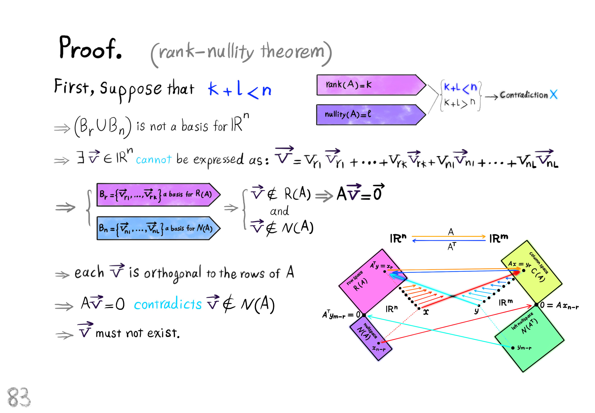
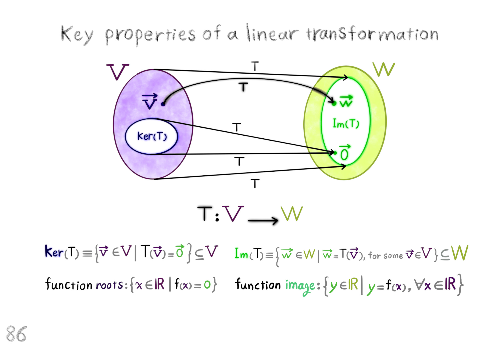

```@meta
Description = "Describes the mathematical model of a reaction wheel unicycle robot."
```

# Ordinary Differential Equations

```@raw html
<div dir = "rtl">
<h1>

معادله‌ی دیفرانسیل معمولی

</h1>
<p>

معادلاتی به شکل زیر: 

</p>
</div>
```

``F(x, y, y^{\prime}, y^{\prime \prime}, ..., y^{(n)})``

```@raw html
<div dir = "rtl">
<p>

یعنی معادلاتی که در آن‌ها تابع مجهول وای: 

</p>
</div>
```

``y = f(x)``

```@raw html
<div dir = "rtl">
<p>

به همراه یک یا چند مشتق مراتب مختلف آن و همچنین به احتمال متغیر مستقل ایکس وجود دارد، معادلات دیفرانسیل معمولی گفته می‌شود.

</p>
<h3>

چند مثال:

</h3>
</div>
```

- ``y^{\prime \prime} - 3 y^{\prime} + x y = y^2``

- ``y^{\prime} + y = 0``

- ``4y^{(5)} - y + x = 0``

```@raw html
<div dir = "rtl">
<p>

اما مثال زیر یک معادله‌ی دیفرانسیل نیست:

</p>
</div>
```

``2y - y^2 = 0``

```@raw html
<div dir = "rtl">
<p>

حل کردن یک معادله‌ی دیفرانسیل یعنی پیدا کردن تابع مجهول وای.

</p>
<h3>

مرتبه‌ی معادله‌ی دیفرانسیل

</h3>
<p>

بالاترین مرتبه‌ی مشتق ظاهر شده در معادله‌ی دیفرانسیل را مرتبه‌ی معادله‌ی دیفرانسیل می‌گویند.

</p>
<h3>

حل چند مثال ساده

</h3>
</div>
```

- ``y^{\prime} = 3``,

``y = 3x + c``.

- ``y^{\prime} - y = 0``,

``y^{\prime} = y``,

``y = ce^x``.

- ``y^{\prime} = e^x``,

``y = e^x + c``.

- ``y^{\prime} = 4e^x``,

``y = 4e^x``.

```@raw html
<div dir = "rtl">
<h3>

یادآوری ریاضی عمومی:

</h3>
</div>
```

``(e^u)^{\prime} = u^{\prime} e^u``.

``(e^x)^{\prime} = 1 e^x = e^x``,

``(kf)^{\prime} = kf^{\prime}``.

```@raw html
<div dir = "rtl">
<p>

چون تنوع معادلات دیفرانسیل زیاد است، آن‌ها را در چند نوع طبقه‌بندی می‌کنند و برای هر کدام روش حل ارایه می‌شود. انواع معادلات دیفرانسیل معمولی مرتبه‌ی اول: جداشدنی، کامل، همگن، خطی با ضرایب ثابت، برنولی و ریکاتی. مجهول ما در معادله، وای برابر با تابعی از ایکس می‌باشد.

</p>
<h2>

معادله‌ی دیفرانسیل جداشدنی (تفکیک پذیر)

</h2>
<p>

اگر معادله‌ی دیفرانسیل را بتوان به شکل زیر نوشت:

</p>
</div>
```

``f(y) \ dy = f(x) \ dx``

```@raw html
<div dir = "rtl">
<p>

اف ایکس تابعی به طور تمام بر حسب ایکس است و اف وای تابعی به طور تمام بر حسب وای است. می‌گوییم این معادله جدا شده است و برای حل کردن آن از دو طرف انتگرال می‌گیریم.

</p>
<h3>

مثال

</h3>
</div>
```

``y^{\prime} = \frac{2x}{3y^2} \longrightarrow \frac{dy}{dx} = \frac{2x}{3y^2} \longrightarrow 3y^2 \ dy = 2x \ dx``,

``\int 3y^2 \ dy = \int 2x \ dx \longrightarrow y^3 = x^2 + c \longrightarrow y = \sqrt[3]{x^2 + c}``.

```@raw html
<div dir = "rtl">
<h3>

مثال

</h3>
</div>
```

``y^{\prime} = e^{x + y} \longrightarrow \frac{dy}{dx} = e^x \ e^y \longrightarrow \frac{dy}{e^y} = e^x \ dx``,

``e^{-y} \ dy = e^x \ dx \longrightarrow \int e^{-y} \ dy = \int e^x \ dx \longrightarrow -e^{-y} = e^x + c``,

``e^{-y} = c - e^x \longrightarrow ln(e^{-y}) = ln(c - e^x) \longrightarrow -y = ln(c - e^x)``,

``y = -ln(c - e^x)``.

```@raw html
<div dir = "rtl">
<h3>

یادآوری درباره‌ی لگاریتم طبیعی

</h3>
</div>
```

``ln(x) = log_e^x``,

``ln(7) = log_e^7 = 1.94591014906 \longrightarrow e^{1.94591014906} = 7``,

``log_a^b = log_a^b``,

``a^{log_a^b} = b``,

``ln(e^{-y}) = log_e^{e^{-y}}``.

```@raw html
<div dir = "rtl">
<p>

خاصیت لگاریتم طبیعی

</p>
</div>
```

``log_a^{b^n} = n \ log_a^b``,

``log_e^{e^{-y}} = -y \ log_e^e = -y``.

```@raw html
<div dir = "rtl">
<p>

روش تغییر متغیر برای حل کردن انتگرال تابع نمایی

</p>
</div>
```

``\int e^{-y}``

``u = -y \longrightarrow du = -dy \longrightarrow -\int e^u \ du = -e^u = -e^{-y}``.

```@raw html
<div dir = "rtl">
<h3>

مثال

</h3>
<p>

معادله‌ی دیفرانسیل جداشدنی زیر را حل کنید.

</p>
</div>
```

``sec^2(x) \ tan(y) \ dx + sec^2(y) \ tan(x) \ dy = 0``

``sec(x) = \frac{1}{cos(x)}``

``sec^2(x) \ tan(y) \ dx = -sec^2(y) \ tan(x) \ dy``

``\frac{sec^2(x) dx}{tan(x)} = \frac{-sec^2(y) dy}{tan(y)}``

``\int \frac{sec^2(x)}{tan(x)} dx = -\int \frac{sec^2(y)}{tan(y)} dy \longrightarrow ln|tan(x)| = -ln|tan(y)| + c``

``\int \frac{u^{\prime}}{u} du = ln|u| + c``

``(tan(x))^{\prime} = sec^2(x)``

``(tan(u))^{\prime} = u^{\prime} (1 + tan^2(u)) \longrightarrow (tan(x))^{\prime} = 1 + tan^2(x)``

``1 + tan^2(x) = 1 + \frac{sin^2(x)}{cos^2(x)} = \frac{cos^2(x) + sin^2(x)}{cos^2(x)} = \frac{1}{cos^2(x)} = sec^2(x)``

``ln|tan(x)| + ln|tan(y)| = c \longrightarrow ln|tan(y)| = c - ln|tan(x)|``

``ln|tan(x) \ tan(y)| = c \longrightarrow e^{ln|tan(x) \ tan(y)|} = e^c``

``tan(x) \ tan(y) = e^c \longrightarrow tan(y) = \frac{e^c}{tan(x)} \longrightarrow y = tan^{-1} (\frac{e^c}{tan(x)})``.

```@raw html
<div dir = "rtl">
<h2>

معادلات دیفرانسیل کامل

</h2>
<p>

معادلاتی هستند به شکل کلی زیر:

</p>
</div>
```

``M(x, y) \ dx + N(x, y) \ dy = 0``

```@raw html
<div dir = "rtl">
<p>

به شرطی که:

</p>
</div>
```

``\frac{\partial M}{\partial y} = \frac{\partial N}{\partial x}``.

```@raw html
<div dir = "rtl">
<p>

برای حل کردن این دسته از معادلات فرض می‌کنیم که اف ایکس و وای جواب معادله باشد و قرار می‌دهیم:

</p>
</div>
```

``f(x, y) = \int M(x, y) \ dx + h(y)``

```@raw html
<div dir = "rtl">
<p>

که در اینجا ایچ وای تابعی به طور تمام بر حسب وای است. در ادامه، مقدار مشتق جزیی تابع اف نسبت به متغیر وای را به دست می‌آوریم و قرار می‌دهیم:

</p>
</div>
```

``N(x, y) = \frac{\partial f(x, y)}{\partial y}``

```@raw html
<div dir = "rtl">
<p>

از این راه، تابع ایچ وای را به دست می‌آوریم و در آخر تابع اف ایکس و وای را به طور تمام به دست می‌آوریم.

</p>
<h3>

مثال

</h3>
<p>

معادله‌ی دیفرانسیل کامل زیر را حل کنید.

</p>
</div>
```

``(x + y + 1) dx + (x - y^2 + 3) dy = 0``

``\left\{ \begin{array}{l} M(x, y) = x + y + 1 &\\ N(x, y) = x - y^2 + 3 \end{array} \right.``

``\left\{ \begin{array}{l} \frac{\partial M(x, y)}{\partial y} = 1 &\\ \frac{\partial N(x, y)}{\partial x} = 1 \end{array} \right.``

``f(x, y) = \int (x + y + 1) dx + h(y) = \frac{x^2}{2} + y x + x + c + h(y)``

``\frac{\partial f(x, y)}{\partial y} = x + h^{\prime}(y)``

``x + h^{\prime}(y) = x - y^2 + 3 \longrightarrow h^{\prime}(y) = x - y^2 + 3 - x``

``h(y) = \int (-y^2 + 3) dy = \frac{-y^3}{3} + 3y``

``f(x, y) = \frac{x^2}{2} + yx + x - \frac{y^3}{3} + 3y + c``.

```@raw html
<div dir = "rtl">
<h3>

مثال

</h3>
<p>

معادله‌ی دیفرانسیل کامل زیر را حل کنید.

</p>
</div>
```

``(2x^2 + 2xy^2 + 4y) dx + (2x^2y + 4x + 5y^4) dy = 0``

``\left\{ \begin{array}{l} M(x, y) = 2x^2 + 2xy^2 + 4y &\\ N(x, y) = 2x^2y + 4x + 5y^4 \end{array} \right.``

``\left\{ \begin{array}{l} \frac{\partial M(x, y)}{\partial y} = 4xy + 4 &\\ \frac{\partial N(x, y)}{\partial x} = 4xy + 4 \end{array} \right.``

``f(x, y) = \int (2x^2 + 2xy^2 + 4y) dx + h(y)``

``f(x, y) = \frac{2}{3} x^3 + x^2y^2 + 4yx + c + h(y)``

``N(x, y) = \frac{\partial f}{\partial y} = \frac{\partial}{\partial y} (\frac{2}{3} x^3 + x^2y^2 + 4yx + c + h(y))``

``N(x, y) = 2x^2y + 4x + h^{\prime}(y) = 2x^2 y + 4x + 5y^4``

``h^{\prime}(y) = 2x^2 y + 4x + 5y^4 - 4x - 2x^2y = 5y^4``

``h(y) = \int h^{\prime}(y) dy = \int 5y^4 dy = y^5 + c``

``f(x, y) = \frac{2}{3} x^3 + x^2y^2 + 4yx + y^5 + c``.

```@raw html
<div dir = "rtl">
<h3>

تعریف تابع همگن

</h3>
<p>

تابع اف ایکس و وای را همگن از درجه‌ی ان (ان عضوی از اعداد صحیح) می‌گویند، هرگاه عدد غیر صفری مانند تی وجود داشته باشد، به طوری که:

</p>
</div>
```

``f(tx, ty) = t^n f(x, y)``,

``n \in \mathbb{Z}``,

``t \neq 0``.

```@raw html
<div dir = "rtl">
<h3>

مثال

</h3>
<p>

تابع اف ایکس و وای که با ضابطه‌ی زیر تعریف شده است یک تابع همگن از درجه‌ی چند است؟

</p>
</div>
```

``f(x, y) = x^4 - x^3 y``

``f(tx, ty) = (tx)^4 - (tx)^3 (ty) = t^4 x^4 - t^3 x^3 t y = t^4 x^4 - t^4 x^3 y = t^4 (x^4 - x^3 y) = t^4 f(x, y)``

``n = 4``

```@raw html
<div dir = "rtl">
<p>

پس تابع اف ایکس و وای یک تابع همگن از درجه‌ی چهار است.

</p>
<h2>

معادلات دیفرانسیل مرتبه‌ی اول همگن

</h2>
<p>

معادلاتی به فرم زیر هستند:

</p>
</div>
```

``M(x, y) dx + N(x, y) dy = 0``

```@raw html
<div dir = "rtl">
<p>

به طوری که تابع‌های ام و ان همگن هستند.

</p>
<p>

روش حل: با تغییر متغیر زیر، معادله را به یک معادله‌ی جداشدنی تبدیل می‌کنیم و سپس آن را حل می‌کنیم.

</p>
</div>
```

``u = \frac{y}{x}``

```@raw html
<div dir = "rtl">
<h3>

مثال

</h3>
<p>

معادله‌ی دیفرانسیل همگن زیر را حل کنید.

</p>
</div>
```

``y^{\prime} = 1 + \frac{y}{x}``

``y^{\prime} = \frac{x + y}{x}``

```@raw html
<div dir = "rtl">
<p>

واضح است که ام و ان تابع‌هایی همگن از درجه‌ی یک هستند. پس از روش تغییر متغیر استفاده می‌کنیم.

</p>
</div>
```

``M(tx, ty) = tx + ty = t(x + y) = t^1 M(x, y)``

``\left\{ \begin{array}{l} M(x, y) dx = N(x, y) dy &\\ (x + y) dx = (x) dy \end{array} \right.``

``y = ux \longrightarrow dy = x \ du + u \ dx``

``(x + ux) dx - x(x \ du + u \ dx) = 0``

``x \ dx + u x \ dx - x^2 \ du - x u \ dx = 0``

``x \ dx = x^2 \ du \longrightarrow \frac{1}{x} dx = du``

```@raw html
<div dir = "rtl">
<p>

معادله بر حسب متغیرهای ایکس و وای تفکیک شد. حالا از دو طرف معادله انتگرال می‌گیریم تا به تابع مجهول وای بر حسب متغیر ایکس برسیم.

</p>
</div>
```

``\int \frac{1}{x} dx = \int du``,

``ln(x) = u + c \longrightarrow ln(x) = \frac{y}{x} + c \longrightarrow ln(x) = \frac{y + cx}{x}``,

``y = x \ ln(x) - cx``.

```@raw html
<div dir = "rtl">
<h3>

مثال

</h3>
<p>

معادله‌ی دیفرانسیل همگن زیر را حل کنید.

</p>
</div>
```

``(x e^{\frac{y}{x}} + y) dx - x \ dy = 0``.

``y = ux \longrightarrow dy = x \ du + u \ dx \longrightarrow (x e^u + ux) dx - x (x \ du + u \ dx) = 0``

``x e^u \ dx + ux \ dx - x^2 \ du - xu \ dx = 0``

``x e^u \ dx = x^2 \ du \longrightarrow \frac{1}{x} dx = e^{-u} du``

``\int \frac{1}{x} dx = \int e^{-u} du \longrightarrow ln(x) = -e^{-u} + c``

``ln(x) = -e^{-\frac{y}{x}} + c``

``ln(c - ln(x)) = ln(e^{-\frac{y}{x}}) \longrightarrow ln(c - ln(x)) = -ln(e^{\frac{y}{x}}) \longrightarrow -ln(c - ln(x)) = \frac{y}{x}``

``y = -x \ ln(c - ln(x))``.

```@raw html
<div dir = "rtl">
<p>

یادآوری

</p>
</div>
```

``log_b^a = log_b^a``,

``b^{log_b^a} = a``,

``log_e^{e^y} = y \ log_e^e = y``.

```@raw html
<div dir = "rtl">
<h2>

معادله‌ی دیفرانسیل خطی مرتبه‌ی اول

</h2>
<p>

حل کردن معادله‌ی دیفرانسیل خطی مرتبه‌ی اول به فرم زیر

</p>
</div>
```

``y^{\prime} + p(x) y = q(x)``

```@raw html
<div dir = "rtl">
<p>

که تابع پی و تابع کیو، تابع‌هایی پیوسته و بر حسب ایکس هستند. جواب این معادله به صورت زیر است:

</p>
</div>
```

``y = \frac{1}{e^{\int p(x)dx}}(\int e^{\int p(x)dx} q(x)dx + c)``

```@raw html
<div dir = "rtl">
<h3>

مثال

</h3>
<p>

معادله‌ی خطی مرتبه‌ی اول زیر را حل کنید.

</p>
</div>
```

``y^{\prime} + y = e^x``

``\left\{ \begin{array}{l} p(x) = 1 &\\ q(x) = e^x \end{array} \right.``

``\int p(x) dx = \int dx = x + c``

``y = \frac{1}{e^{x + c}} (\int e^{x + c} e^x dx + c)``

``y = \frac{1}{e^{x + c}} (\int e^{2x + c} dx + c) = \frac{1}{e^{x + c}} (\frac{e^{2x + c}}{2} + c)``

``y = \frac{e^x}{2} + ce^{-x - c}``

``y = \frac{1}{e^x} (\frac{1}{2} e^{2x} + c)``.

```@raw html
<div dir = "rtl">
<h3>

مثال

</h3>
</div>
```

``y^{\prime} + \frac{2x}{1 + x^2} y = \frac{cot(x)}{1 + x^2}``

``\left\{ \begin{array}{l} p(x) = \frac{2x}{1 + x^2} &\\ q(x) = \frac{cot(x)}{1 + x^2} \end{array} \right.``

```@raw html
<div dir = "rtl">
<p>

فرم کلی معادلات خطی:

</p>
</div>
```

``y^{\prime} + p(x) y = q(x)``

``e^{\int p(x) dx} = e^{\int \frac{2x}{1 + x^2} dx} = e^{\int \frac{du}{u}} = e^{ln|u|} = u``.

``e^{\int p(x) dx} = u = 1 + x^2``

``y = \frac{1}{1 + x^2} (\int q(x) e^{\int p(x) dx} dx + c)``

``y = \frac{1}{1 + x^2} (\int \frac{cot(x)}{1 + x^2} (1 + x^2) dx + c)``

``y = \frac{1}{1 + x^2} (\int cot(x) dx + c) = \frac{1}{1 + x^2} (ln(|sin(x)|) + c)``

```@raw html
<div dir = "rtl">
<p>

یادآوری

</p>
</div>
```

``\int cot(x) dx = \int \frac{cos(x)}{sin(x)} dx = ln|sin(x)| + c``.

```@raw html
<div dir = "rtl">
<h2>

معادلات برنولی

</h2>
<p>

معادلاتی هستند به فرم

</p>
</div>
```

``y^{\prime} + p(x) y = q(x) y^n``.

```@raw html
<div dir = "rtl">
<p>

در حالتی که ان برابر با صفر باشد و در حالتی که ان برابر با یک باشد، معادلات برنولی همان معادلات خطی مرتبه‌ی اول هستند.

</p>
</div>
```

``n = 0, n = 1``

```@raw html
<div dir = "rtl">
<p>

بنابراین، این معادلات را در حالتی که ان نابرابر با صفر ونابرابر با یک است، حل می‌کنیم.

</p>
</div>
```

``n \neq 0, n \neq 1``

```@raw html
<div dir = "rtl">
<p>

روش حل: برای حل معادلات برنولی، ابتدا طرفین معادله را بر وای به توان ان تقسیم می‌کنیم.

</p>
</div>
```

``/ y^n``

```@raw html
<div dir = "rtl">
<p>

و سپس با تغییر متغیر زیر، معادله را به یک معادله‌ی خطی مرتبه‌ی اول بر حسب ایکس و یو تبدیل می‌کنیم و بعد آن راحل می‌کنیم.

</p>
</div>
```

``u = \frac{1}{y^{n - 1}}``

```@raw html
<div dir = "rtl">
<h3>

مثال

</h3>
<p>

معادله‌ی برنولی زیر را حل کنید.

</p>
</div>
```

``y^{\prime} + \frac{1}{x} y = y^2``

```@raw html
<div dir = "rtl">
<p>

حل: تقسیم دو طرف معادله بر وای به توان ان:

</p>
</div>
```

``n = 2 \longrightarrow y^n = y^2``

``\frac{y^{\prime}}{y^2} + \frac{1}{xy} = 1``

```@raw html
<div dir = "rtl">
<p>

تغییر متغیر

</p>
</div>
```

``\left\{ \begin{array}{l} u = \frac{1}{y} = y^{-1} &\\ du = d(y^{-1}) = -y^{-2} dy \end{array} \right.``

```@raw html
<div dir = "rtl">
<p>

معادله را بر حسب متغیر یو بازنویسی می‌کنیم.

</p>
</div>
```

``\frac{y^{\prime}}{y^2} + \frac{1}{x} \frac{1}{y} = 1``

``y^{\prime} u^2 + \frac{u}{x} = 1``

``\left\{ \begin{array}{l} -du = dy \ y^{-2} &\\ u^{\prime} = - y^{\prime} y^{-2} \end{array} \right.``

``-u^{\prime} + \frac{u}{x} = 1``

``u^{\prime} - \frac{u}{x} = -1 \longrightarrow u^{\prime} - \frac{u}{x} + 1 = 0``

```@raw html
<div dir = "rtl">
<p>

معادله خطی مرتبه‌ی اول بر حسب متغیرهای یو و ایکس است.

</p>
</div>
```

``\left\{ \begin{array}{l} p(x) = \frac{-1}{x} &\\ q(x) = -1 \end{array} \right.``

``e^{\int p(x) dx} = e^{\int -\frac{1}{x} dx} = e^{-ln|x|} = \frac{1}{x}``

``u = \frac{1}{e^{\int p(x) dx}} (\int q(x) e^{\int p(x) dx} dx + c)``

``u = x (\int (-1) \frac{1}{x} dx + c) = x(\int -\frac{1}{x} dx + c)``

``u = x (-ln|x| + c)``

``u = \frac{1}{y}``

``y^{-1} = u = x(-ln|x| + c) \longrightarrow y = \frac{1}{x(-ln|x| + c)}``.

```@raw html
<div dir = "rtl">
<h3>

یادآوری

</h3>
<p>

به طور کلی متغیر وای عبارتیست بر حسب متغیر ایکس.

</p>
</div>
```

``(y^n)^{\prime} = n y^{\prime} y^{n - 1}``

```@raw html
<div dir = "rtl">
<p>

در حالت خاص

</p>
</div>
```

``y = x \longrightarrow (x^n)^{\prime} = n x^{\prime} x^{n - 1}``.

```@raw html
<div dir = "rtl">
<h3>

تمرین‌های دوره‌ای

</h3>
<h4>

تمرین معادله‌ی جداشدنی

</h4>
</div>
```

- ``y^\prime = \frac{5x}{2y^2}``

``\frac{dy}{dx} = \frac{5x}{2y^2} \longrightarrow 5x \ dx = 2y^2 \ dy``

``\int 5x \ dx = \int 2y^2 \ dy \longrightarrow \frac{5x^2}{2} = \frac{2y^3}{3} + c``

``\frac{2y^3}{3} = \frac{5x^2}{2} + c \longrightarrow y^3 = \frac{3}{2} (\frac{5x^2}{2} - c)``

``y = \sqrt[3]{\frac{3}{2} (\frac{5x^2}{2} - c)}``.

- ``xy^\prime + y = y^2``

``x \frac{dy}{dx} + y = y^2 \longrightarrow \frac{x}{dx} + \frac{y}{dy} = \frac{y^2}{dy}``

``\frac{x}{dx} = \frac{y^2}{dy} - \frac{y}{dy} \longrightarrow \frac{x}{dx} = \frac{y^2 - y}{dy}``

``\frac{dx}{x} = \frac{dy}{y^2 - y} \longrightarrow \frac{dx}{x} = \frac{dy}{y (y - 1)}``

``\frac{dx}{x} = dy (\frac{A}{y} + \frac{B}{y - 1}) \longrightarrow \frac{dx}{x} = \frac{-dy}{y} + \frac{dy}{y - 1}``

``\frac{A (y - 1) + B y}{y (y - 1)} = \frac{1}{y (y - 1)}``

``Ay - A + By = 1``

``\left\{ \begin{array}{l} A + B = 0 &\\ -A = 1 \end{array} \right.``

``\left\{ \begin{array}{l} A = -1 &\\ B = 1 \end{array} \right.``

``\int \frac{dx}{x} = - \int \frac{dy}{y} + \int \frac{dy}{y - 1} \longrightarrow ln|x| = -ln|y| + ln|y - 1| + c``

``ln|x| = ln|\frac{y - 1}{y}| + c \longrightarrow e^{ln|x|} = e^{ln|\frac{y - 1}{y}| + c} \longrightarrow x = \frac{y - 1}{y} + c_1``

``x = 1 - \frac{1}{y} + c_1 \longrightarrow \frac{1}{y} = 1 - x + c_1``

``y = \frac{1}{1 - x + c_1}``.

```@raw html
<div dir = "rtl">
<h4>

تمرین معادله‌ی همگن

</h4>
</div>
```

- ``(x^2 + y^2) dx + 2xy \ dy = 0``

``u = \frac{y}{x} \longrightarrow y = ux \longrightarrow dy = u \ dx + x \ du``

``(x^2 + u^2 x^2) dx + 2x ux \ dy = 0``

``x^2 (u^2 + 1) dx + 2x^2 u \ dy = 0 \longrightarrow x^2 (u^2 + 1) dx + 2x^2 u (u \ dx + x \ du) = 0``

``(u^2 + 1) dx + 2u^2 \ dx + 2ux \ du = 0``

``dx(u^2 + 1 + 2u^2) + 2ux \ du = 0 \longrightarrow (3u^2 + 1) dx + 2ux \ du = 0``

``\frac{3u^2 + 1}{x} dx + 2u \ du = 0 \longrightarrow \frac{dx}{x} + \frac{2u}{3u^2 + 1} du = 0``

``\frac{dx}{x} = \frac{-2u}{3u^2 + 1} du \longrightarrow \int \frac{dx}{x} = \int \frac{-2u}{3u^2 + 1} du``

``ln|x| = \frac{-1}{3} \int \frac{2u}{u^2 + 1} du \longrightarrow ln|x| = \frac{-1}{3} ln|u^2 +1| + c``

``e^{ln|x|} = e^{\frac{-1}{3} ln|u^2 + 1| + c}``

``x = e^{ln|(u^2 + 1)^{\frac{-1}{3}}| + c} \longrightarrow x = \frac{1}{\sqrt[3]{u^2 + 1}} + c_1``

``\frac{1}{x} = \sqrt[3]{u^2 + 1} + c_1 \longrightarrow \frac{1}{x^3} = u^2 + 1 + c_1``

``u^2 = \frac{1}{x^3} - 1 - c_1 \longrightarrow u = \sqrt{\frac{1}{x^3} - 1 - c_1}``

``\frac{y}{x} = \sqrt{\frac{1}{x^3} - 1 - c_1}``

``y = x \sqrt{\frac{1}{x^3} - 1 - c_1}``.

- ``y^\prime = 2 + \frac{y}{x}``

``u = \frac{y}{x} \longrightarrow y = ux \longrightarrow dy = u \ dx + x \ du``

``\frac{dy}{dx} = u + x \frac{du}{dx} \longrightarrow y^\prime = u + x u^\prime``

``u + xu^\prime = 2 + u \longrightarrow x u^\prime = 2 \longrightarrow u^\prime = \frac{2}{x}``

``\frac{du}{dx} = \frac{2}{x} \longrightarrow du = \frac{2 dx}{x}``

``\int du = \int 2 \frac{dx}{x} \longrightarrow u = 2 ln|x| + c``

``\frac{y}{x} = ln(x^2) + c \longrightarrow y = x \ ln(x^2) + cx``.

```@raw html
<div dir = "rtl">
<h4>

تمرین معادله‌ی کامل

</h4>
</div>
```

- ``(x + y + 2) dx + (x - y^2 + 1) dy = 0``

``f(x, y) = \int (x + y + 2) dx + h(y) = \frac{x^2}{2} + xy + 2x + c + h(y)``

``\frac{\partial f}{\partial y} = N(x, y)``

``x + h^\prime (y) = x - y^2 + 1 \longrightarrow h^\prime (y) = \int h(y) dy = \int (1 - y^2) dy = y - \frac{y^3}{3} + c_1``

``f(x, y) = \frac{x^2}{2} + xy + 2x + y - \frac{y^3}{3} + c_2``.

- ``(2x^2 + 4y) dx + (4x - 3y^2) dy = 0``

``f(x, y) = \int M(x, y) dx + h(y) \longrightarrow f(x, y) = \int (2x^2 + 4y) dx + h(y) = \frac{2x^3}{3} + 4xy + h(y)``

``\frac{\partial f(x, y)}{\partial y} = N(x, y) \longrightarrow 4x + h^\prime (y) = 4x - 3y^2 \longrightarrow h^\prime (y) = -3y^2``

``h(y) = \int h^\prime (y) dy \longrightarrow h(y) = \int -3y^2 \ dy \longrightarrow h(y) = -3 \frac{y^3}{3} + c \longrightarrow h(y) = -y^3 + c``

``f(x, y) = \frac{2}{3} x^3 + 4xy - y^3 + c``.

- ``(2xe^y + e^x) dx + (x^2 + 1) e^y dy = 0``

``f(x, y) = \int M(x, y) dx + h(y) = \int (2xe^y + e^x) dx + h(y) = \frac{2x^2}{2} e^y + e^x + c + h(y)``

``\frac{\partial f(x, y)}{\partial y} = N(x, y) \longrightarrow x^2 e^y + h^\prime (y) = e^y (x^2 + 1)``

``h^\prime (y) = e^y (x^2 + 1) - x^2 e^y = e^y x^2 + e^y - e^y x^2 = e^y``

``h(y) = \int h^\prime (y) dy = \int e^y dy = e^y + c_1``

``f(x, y) = x^2 e^y + e^x + e^y + c_2``

```@raw html
<div dir = "rtl">
<h4>

تمرین معادله‌ی خطی مرتبه اول

</h4>
</div>
```

- ``\frac{dy}{dx} + y = e^x``

``\left\{ \begin{array}{l} p(x) = 1 &\\ q(x) = e^x \end{array} \right.``

``\int p(x) dx = \int dx = x``

``y = \frac{1}{e^{\int p(x) dx}} (\int e^{\int p(x) dx} q(x) dx + c)``

``y = \frac{1}{e^x} (\int e^x e^x dx + c) \longrightarrow y = e^{-x} (\int e^{2x} dx + c)``

``y = e^{-x} (\frac{e^{2x}}{2} + c) \longrightarrow y = \frac{e^x}{2} + c e^{-x}``.

- ``\frac{dy}{dx} = \frac{e^{2y}}{xe^{2y} - y}``

``\frac{dx}{dy} = \frac{x e^{2y} - y}{e^{2y}} = \frac{x e^{2y}}{e^{2y}} - \frac{y}{e^{2y}}``

``\frac{dx}{dy} = x - \frac{y}{e^{2y}} \longrightarrow x^\prime - x = -\frac{y}{e^{2y}}``

``\left\{ \begin{array}{l} p(y) = -1 &\\ q(y) = \frac{-y}{e^{2y}} \end{array} \right.``

``\int p(y) dy = \int -dy = -y``

``x = \frac{1}{e^{\int p(y) dy}} (\int e^{\int p(y) dy} q(y) dy + c)``

``x = \frac{1}{e^{-y}} (\int e^{-y} \frac{-y}{e^{2y}} dy + c) \longrightarrow x = e^y (\int -e^{-3y} y \ dy + c)``

``\left\{ \begin{array}{l} u = y \longrightarrow du = dy &\\ dv = -e^{-3y} dy \longrightarrow v = \frac{e^{-3y}}{3} \end{array} \right.``

``\int -e^{-3y} y \ dy = \int u \ dv = uv - \int v \ du = y \frac{e^{-3y}}{3} - \int \frac{e^{-3y}}{3} dy``

``\int -e^{-3y} y \ dy = \frac{y}{3e^{3y}} - (\frac{-1}{3})) \frac{e^{-3y}}{3} = \frac{y}{3e^{3y}} + \frac{1}{9} e^{-3y}``

``x = e^y (\frac{y}{3} e^{-3y} + \frac{1}{9} e^{-3y} + c) \longrightarrow x = e^{-2y} (\frac{y}{3} + \frac{1}{9}) + c e^y``.

```@raw html
<div dir = "rtl">
<h4>

تمرین معادله‌ی برنولی

</h4>
</div>
```

- ``y^\prime - \frac{y}{x} = y^2``

``n = 2``

``y^\prime y^{-2} - \frac{1}{xy} = 1``

``u = \frac{1}{y^{2 - 1}} = \frac{1}{y} \longrightarrow y = \frac{1}{u} \longrightarrow y^\prime = (u^{-1})^\prime = -u^{-2} u^\prime``

``u^\prime (-u^{-2}) (u^2) - \frac{u}{x} = 1``

``-u^\prime - \frac{u}{x} = 1 \longrightarrow u^\prime + \frac{u}{x} = -1``

``\left\{ \begin{array}{l} p(x) = \frac{1}{x} &\\ q(x) = -1 \end{array} \right.``

``\int p(x) dx = \int \frac{dx}{x} = ln|x|``

``u = \frac{1}{e^{\int p(x) dx}} (\int e^{\int p(x) dx} q(x) dx + c)``

``u = \frac{1}{e^{ln|x|}} (\int e^{ln|x|} (-1) dx + c)``

``u = \frac{1}{x} (\int -\frac{dx}{x} + c) = \frac{1}{x} (-ln|x| + c)``

``\frac{1}{y} = \frac{-ln|x| + c}{x}``

``y = \frac{x}{-ln|x| + c}``.

- ``y^\prime + xy = \frac{x}{y^3}``

``n = 3``

``u = \frac{1}{y^{3 - 1}} = \frac{1}{y^2} \longrightarrow y^{-2} = u \longrightarrow -2y^{-3}dy = du \longrightarrow dy = \frac{du}{-2}y^3``

``y^\prime y^{-3} + xy^{-2} = x``

``\frac{-u^\prime}{2} + xu = x \longrightarrow u^\prime - 2xu = -2x``

``\left\{ \begin{array}{l} p(x) = -2x &\\ q(x) = -2x \end{array} \right.``

``\int p(x) dx = \int -2x \ dx = -x^2``

``u = \frac{1}{e^{\int p(x) dx}} (\int e^{\int p(x) dx} q(x) dx + c)``

``u = \frac{1}{e^{-x^2}} (\int e^{-x^2} (-2x) dx + c)``

``\left\{ \begin{array}{l} v = -x^2 &\\ dv = -2x \ dx \end{array} \right.``

``\int -e^{-x^2} 2x \ dx = \int e^v dv = e^v = e^{-x^2}``

``u = \frac{1}{e^{-x^2}} (e^{-x^2} + c) = 1 + c e^{x^2}``

``\frac{1}{y^2} = 1 + c e^{x^2} \longrightarrow y^2 = \frac{1}{1 + c e^{x^2}}``

``y = \sqrt{\frac{1}{1 + c e^{x^2}}}``.

```@raw html
<div dir = "rtl">
<h2>

معادلات خطی مرتبه‌ی دوم همگن (با ضرایب ثابت)

</h2>
<p>

معادلاتی هستند به فرم زیر

</p>
</div>
```

``y^{\prime \prime} + a y^{\prime} + by = 0``

```@raw html
<div dir = "rtl">
<p>

که در اینجا آ و ب عددهای ثابتی هستند. به این دسته از معادلات همگن نیز گفته می‌شود زیرا در سمت راست معادله صفر وجود دارد. برای حل کردن این نوع معادلات، ابتدا باید معادله‌ی مفسر (مشخصه) را به دست آوریم و حل کنیم. معادله‌ی مفسر، معادله‌ای درجه دوم است که به صورت زیر به دست می‌آید:

</p>
</div>
```

``r^2 + ar + b = 0``

```@raw html
<div dir = "rtl">
<p>

این معادله را با روش دلتا حل می‌کنیم.

</p>
<h3>

حالت اول

</h3>
<p>

اگر دلتا بزرگتر از صفر باشد، معادله‌ی مفسر دو ریشه‌ی مجزا آر پایین‌نویس ۱ و آر پایین‌نویس ۲ خواهد داشت. در این صورت جواب معادله‌ی دیفرانسیل به شکل زیر است:

</p>
</div>
```

``\Delta > 0 \longrightarrow y = c_1 e^{r_1 x} + c_2 e^{r_2 x}``.

```@raw html
<div dir = "rtl">
<h3>

مثال

</h3>
<p>

معادله‌ی دیفرانسیل زیر را حل کنید.

</p>
</div>
```

``y^{\prime \prime} + y^{\prime} - 2y = 0``

``\left\{ \begin{array}{l} a = 1 &\\ b = -2 \end{array} \right.``

```@raw html
<div dir = "rtl">
<p>

معادله‌ی مفسر را تشکیل می‌دهیم.

</p>
</div>
```

``r^2 + r - 2 = 0``,

``\Delta = 1^2 - 4 (1) (-2) = 9 > 0``,

``r_1 = \frac{-1 + \sqrt{9}}{2 (1)} = 1``,

``r_2 = \frac{-1 - \sqrt{9}}{2 (1)} = -2``,

``y = c_1 e^{x} + c_2 e^{-2x}``.

```@raw html
<div dir = "rtl">
<h3>

حالت دوم

</h3>
<p>

اگر دلتا برابر با صفر باشد، در این حالت معادله‌ی مفسر یک ریشه‌ی مضاعف دارد. فرض کنید که آر ریشه‌ی آن باشد. جواب معادله‌ی دیفرانسیل به صورت زیر است:

</p>
</div>
```

``\Delta = 0 \longrightarrow y = (c_1 + c_2 x) e^{r x}``.

```@raw html
<div dir = "rtl">
<h3>

مثال

</h3>
<p>

معادله‌ی دیفرانسیل زیر را حل کنید.

</p>
</div>
```

``y^{\prime \prime} + 4 y^{\prime} + 4y = 0``.

```@raw html
<div dir = "rtl">
<p>

معادله‌ی مفسر را تشکیل می‌دهیم:

</p>
</div>
```

``r^2 + 4r + 4 = 0``

``\Delta = 4^2 - 4 (1) (4) = 0 \longrightarrow r = \frac{-4}{2 (1)} = -2``

``y = (c_1 + c_2 x) e^{-2x}``.

```@raw html
<div dir = "rtl">
<h3>

حالت سوم

</h3>
</div>
```

``\Delta < 0``

```@raw html
<div dir = "rtl">
<p>

اگر دلتا کوچکتر از صفر باشد، معادله‌ی مفسر ریشه‌ی حقیقی ندارد. عدد آی عددی موهومی است.

</p>
</div>
```

``i^2 = -1 \longrightarrow i = \sqrt{-1}``

``z^2 = -1 \longrightarrow z^2 + 1 = 0``

``i \in \mathbb{C}``


```@raw html
<div dir = "rtl">
<p>

در این حالت، معادله‌ی مفسر دو ریشه‌ی مختلط به شکل زیر دارد.

</p>
</div>
```

``\left\{ \begin{array}{l} r_1 = \alpha + \beta i &\\ r_2 = \alpha - \beta i \end{array} \right.``

``r_1, r_2 \in \mathbb{C} = \{ x + y i | x \in \mathbb{R}, y \in \mathbb{R} \}``

```@raw html
<div dir = "rtl">
<p>

در این صورت، جواب معادله‌ی دیفرانسیل به شکل زیر خواهد بود:

</p>
</div>
```

``y = e^{\alpha x} (c_1 cos(\beta x) + c_2 sin(\beta x))``

```@raw html
<div dir = "rtl">
<h3>

مثال

</h3>
<p>

معادله‌ی مرتبه دوم با ضرایب ثابت (همگن) را حل کنید.

</p>
</div>
```

``y^{\prime \prime} + 4 y^{\prime} + 5y = 0``

```@raw html
<div dir = "rtl">
<p>

معادله‌ی مشخصه را تشکیل می‌دهیم.

</p>
</div>
```

``r^2 + 4r + 5 = 0``,

``\Delta = 16 - 20 = -4``,

``r_1 = \frac{-4 + \sqrt{-4}}{2} = -2 + i``,

``r_2 = \frac{-4 - \sqrt{-4}}{2} = -2 - i``,

``\left\{ \begin{array}{l} \alpha = -2 &\\ \beta = 1 \end{array} \right.``,

``y = e^{-2x} (c_1 cos(x) + c_2 sin(x))``.

```@raw html
<div dir = "rtl">
<h2>

معادلات غیرکامل

</h2>
<p>

پیش‌تر گفتیم که معادلاتی به شکل زیر به شرطی که مشتق جزیی تابع ام نسبت به متغیر وای برابر با مشتق جزیی تابع ان نسبت به متغیر ایکس باشد کامل هستند.

</p>
</div>
```

``\left\{ \begin{array}{l} M(x, y) dx + N(x, y) dy = 0 &\\ \frac{\partial M}{\partial y} = \frac{\partial N}{\partial x} \end{array} \right.``

```@raw html
<div dir = "rtl">
<p>

اگر شرط بالا برقرار نباشد، معادله غیر کامل است.

</p>
</div>
```

``\frac{\partial M}{\partial y} \neq \frac{\partial N}{\partial x}``

```@raw html
<div dir = "rtl">
<p>

برای حل کردن معادلات غیر کامل، باید عبارتی مانند تابع ایچ بر حسب متغیرهای ایکس و وای را پیدا کنیم، به طوری که با ضرب کردن دو طرف معادله در تابع ایچ معادله کامل شود.

</p>
</div>
```

``h(x, y)``

```@raw html
<div dir = "rtl">
<p>

یعنی معادله‌ی زیر کامل باشد.

</p>
</div>
```

``h(x, y) M(x, y) dx + h(x, y) N(x, y) dy = 0``

```@raw html
<div dir = "rtl">
<p>

به تابع ایچ که بر حسب متغیرهای ایکس و وای است عامل انتگرال‌ساز گفته می‌شود. عامل انتگرال‌ساز منحصر به فرد نمی‌باشد. و در حالت کلی پیدا کردن عامل انتگرال‌ساز کار بسیار سختی است. اما در اینجا در دو حالت خیلی خاص عامل انتگرال‌ساز را معرفی می‌کنیم.

</p>
<h3>

حالت اول

</h3>
<p>

اگر معادله‌ی زیر غیر کامل باشد، یعنی مشتق جزیی تابع ام نسبت به متغیر وای نابرابر با مشتق جزیی تابع ان نسبت به متغیر ایکس باشد،

</p>
</div>
```

``\left\{ \begin{array}{l} M(x, y) dx + N(x, y) dy = 0 &\\ \frac{\partial M}{\partial y} \neq \frac{\partial N}{\partial x} \end{array} \right.``

```@raw html
<div dir = "rtl">
<p>

و همچنین عبارت پی عبارتی فقط بر حسب متغیر ایکس باشد،

</p>
</div>
```

``p(x) = \frac{1}{N} (\frac{\partial M}{\partial y} - \frac{\partial N}{\partial x})``

```@raw html
<div dir = "rtl">
<p>

آن‌گاه عامل انتگرال‌ساز برابر است با:

</p>
</div>
```

``e^{\int p(x) dx}``.

```@raw html
<div dir = "rtl">
<h3>

حالت دوم

</h3>
<p>

اگر عبارت پی عبارتی فقط بر حسب متغیر وای باشد،

</p>
</div>
```

``p(y) = \frac{-1}{M} (\frac{\partial M}{\partial y} - \frac{\partial N}{\partial x})``

```@raw html
<div dir = "rtl">
<p>

آن‌گاه عامل انتگرال‌ساز برابر است با:

</p>
</div>
```

``e^{\int p(y) dy}``.

```@raw html
<div dir = "rtl">
<h3>

مثال

</h3>
<p>

معادله‌ی غیرکامل زیر را حل کنید.

</p>
</div>
```

``dx + \frac{x - sin(y)}{y} dy = 0``.

``\left\{ \begin{array}{l} M(x, y) = 1 &\\ N(x, y) = \frac{x - sin(y)}{y} \end{array} \right.``

``\left\{ \begin{array}{l} \frac{\partial M}{\partial y} = 0 &\\ \frac{\partial N}{\partial x} = \frac{1}{y} \end{array} \right.``

``\left\{ \begin{array}{l} 0 \neq \frac{1}{y} &\\ \frac{\partial M}{\partial y} \neq \frac{\partial N}{\partial x} \end{array} \right.``

```@raw html
<div dir = "rtl">
<p>

پس معادله غیرکامل است. حالا مقدار عبارت پی را محاسبه می‌کنیم تا عامل انتگرال‌ساز را پیدا کنیم.

</p>
</div>
```

``p(y) = \frac{-1}{1} (0 - \frac{1}{y}) = \frac{1}{y}``

```@raw html
<div dir = "rtl">
<p>

عبارت پی به طور تمام بر حسب متغیر وای به دست آمد. سپس عامل انتگرال‌ساز را به شکل زیر به دست می‌آوریم:

</p>
</div>
```

``e^{\int p(y) dy} = e^{\int \frac{1}{y} dy} = e^{ln|y|} = y``

```@raw html
<div dir = "rtl">
<p>

دو طرف معادله را در عامل انتگرال‌ساز ضرب می‌کنیم تا معادله کامل شود.

</p>
</div>
```

``y \ dx + (x - sin(y)) dy = 0``

``\left\{ \begin{array}{l} M_1(x, y) = y &\\ N_1(x, y) = x - sin(y) \end{array} \right.``

```@raw html
<div dir = "rtl">
<p>

دوباره شرط کامل بودن معادله را بررسی می‌کنیم.

</p>
</div>
```

``\left\{ \begin{array}{l} \frac{\partial M_1}{\partial y} = 1 &\\ \frac{\partial N_1}{\partial x} = 1 \end{array} \right.``

``\frac{\partial M_1}{\partial y} = \frac{\partial N_1}{\partial x}``

```@raw html
<div dir = "rtl">
<p>

پس معادله کامل شد. در ادامه، معادله‌ی کامل را حل می‌کنیم تا به تابع مجهول اف برسیم.

</p>
</div>
```

``f(x, y) = \int M_1(x, y) dx + h(y) = \int y \ dx + h(y)``

``f(x, y) = xy + c + h(y)``

``\frac{\partial f(x, y)}{\partial y} = N_1(x, y) = \frac{\partial}{\partial y} (xy + c + h(y))``

```@raw html
<div dir = "rtl">
<p>

مقدار مشتق جزیی تابع اف نسبت به متغیر ایگرگ را با مقدار عبارت تابع ان پایین‌نویس ۱ مقایسه می‌کنیم تا مقدار مشتق تابع ایچ بر حسب متغیر ایگرگ را بیابیم.

</p>
</div>
```

``N_1(x, y) = x + h^{\prime}(y)``,

``x + h^{\prime}(y) = x - sin(y) \longrightarrow h^{\prime}(y) = -sin(y)``,

``f(x, y) = xy + c + \int h^{\prime}(y) dy = xy + c + \int -sin(y) dy``,

``f(x, y) = xy + c + cos(y) + c_1``,

``f(x, y) = xy + cos(y) + c_2``.

```@raw html
<div dir = "rtl">
<h3>

تمرین

</h3>
<p>

معادله‌ی غیرکامل را حل کنید.

</p>
</div>
```

``(x^2 + x - y^2) dx + x y \ dy = 0``.

``\left\{ \begin{array}{l} M(x, y) = x^2 + x - y^2 &\\ N(x, y) = xy \end{array} \right.``

``\left\{ \begin{array}{l} \frac{\partial M(x, y)}{\partial y} = -2y &\\ \frac{\partial N(x, y)}{\partial x} = y \end{array} \right.``

``\frac{\partial M}{\partial y} \neq \frac{\partial N}{\partial x}``

```@raw html
<div dir = "rtl">
<p>

معادله غیرکامل است. برای پیدا کردن عامل انتگرال‌ساز به شکل زیر عمل می‌کنیم.

</p>
</div>
```

``\frac{\partial M}{\partial y} - \frac{\partial N}{\partial x} = -2y - y = -3y``

``p(x) = \frac{1}{N} (\frac{\partial M}{\partial y} - \frac{\partial N}{\partial x}) = \frac{1}{xy} (-3y) = \frac{-3}{x}``

```@raw html
<div dir = "rtl">
<p>

به دلیل اینکه پی عبارتی فقط بر حسب متغیر ایکس است، عامل انتگرال‌ساز برابر است با:

</p>
</div>
```

``e^{\int p(x) dx} = e^{-3 \int \frac{dx}{x}} = e^{-3 ln|x|} = e^{ln|x^{-3}|} = x^{-3}``

```@raw html
<div dir = "rtl">
<p>

با ضرب کردن عامل انتگرال‌ساز در دو طرف معادله، آن را کامل می‌کنیم.

</p>
</div>
```

``x^{-3} (x^2 + x - y^2) dx + x^{-3} (xy) dy = 0``

``(x^{-1} + x^{-2} - y^2 x^{-3}) dx + (x^{-2} y) dy = 0``

``\left\{ \begin{array}{l} M_1(x, y) = x^{-1} + x^{-2} - y^2 x^{-3} &\\ N_1(x, y) = x^{-2} y \end{array} \right.``

``\frac{\partial M_1}{\partial y} = -2y x^{-3}``

``\frac{\partial N_1}{\partial x} = -2x^{-3} y``

```@raw html
<div dir = "rtl">
<p>

معادله‌ی دیفرانسیل پس از ضرب کردن عامل انتگرال‌ساز کامل شد.

</p>
</div>
```

``\frac{\partial M_1}{\partial y} = \frac{\partial N_1}{\partial x}``

``f(x, y) = \int M_1(x, y) dx + h(y) = \int x^{-1} + x^{-2} - y^2 x^{-3} \ dx + h(y)``

``f(x, y) = ln|x| - \frac{1}{x} + y^2 \frac{x^{-2}}{2} + c + h(y)``

``N_1(x, y) = \frac{\partial f(x, y)}{\partial y} = \frac{\partial}{\partial y} (ln|x| - \frac{1}{x} + y^2 \frac{x^{-2}}{2} + c + h(y))``

```@raw html
<div dir = "rtl">
<p>

مشتق جزیی تابع اف نسبت به متغیر ایگرگ را با تابع ان پایین‌نویس ۱ مقایسه می‌کنیم تا مقدار مشتق تابع ایچ را پیدا کنیم.

</p>
</div>
```

``N_1(x, y) = yx^{-2} + h^{\prime}(y)``,

``h^{\prime}(y) = 0 \longrightarrow h(y) = \int h^{\prime}(y) dy = \int 0 dy = c_1``,

``f(x, y) = ln|x| - \frac{1}{x} + y^2 \frac{x^{-2}}{2} + c + c_1``,

``f(x, y) = ln|x| - \frac{1}{x} + y^2 \frac{x^{-2}}{2} + c_2``.

```@raw html
<div dir = "rtl">
<h2>

تبدیل لاپلاس

</h2>
<p>

در ریاضیات تبدیل‌هایی داریم که یک تابع را به تابع دیگری تبدیل می‌کند. برای مثال، مشتق‌گیری یک تبدیل است که تابع اف بر حسب متغیر ایکس را به تابع اف پریم بر حسب متغیر ایکس تبدیل می‌کند.

</p>
</div>
```

``D: f(x) \to f^{\prime}(x)``,

``D f(x) = f^{\prime}(x)``.

```@raw html
<div dir = "rtl">
<p>

تبدیل لاپلاس یک تبدیل انتگرالی است که تابع اف بر حسب متغیر تی (که به طور معمول زمان فرض می‌شود) را به تابع اف بر حسب متغیر اس  (که به طور معمول فرکانس فرض می‌شود) تبدیل می‌کند. تبدیل لاپلاس کاربردهایی در فیزیک دارد، اما در اینجا (درس معادلات دیفرانسیل) ما فقط به این نکته توجه می‌کنیم که تبدیل لاپلاس می‌تواند ابزاری برای حل بعضی از معادلات دیفرانسیل باشد. تبدیل لاپلاس تابع اف بر حسب متغیر تی به صورت زیر تعریف می‌شود:

</p>
</div>
```

``L\{ f(t) \} = \int_0^\infty e^{-st} f(t) dt = F(s)``.

```@raw html
<div dir = "rtl">
<h3>

مثال

</h3>
<p>

تبدیل لاپلاس تابع اف بر حسب متغیر تی با ضابطه‌ی داده شده در زیر، را به دست آورید.

</p>
</div>
```

``f(t) = 1``

``L\{ f(t) \} = \int_0^{\infty} e^{-st} dt = -\frac{1}{s} e^{-st} |_0^\infty = 0 - (-\frac{1}{s}) = \frac{1}{s}``.

```@raw html
<div dir = "rtl">
<p>

به شرطی که متغیر اس بزرگ‌تر از صفر باشد.

</p>
</div>
```

``s > 0``

```@raw html
<div dir = "rtl">
<p>

به دلیل اینکه علامت منفی متغیر اس انتگرال را بی‌نهایت می‌کند. یعنی انتگرال واگرا می‌شود. divergent

</p>
<h3>

مثال

</h3>
<p>

تبدیل لاپلاس تابع اف بر حسب متغیر تی را به دست آورید.

</p>
</div>
```

``f(t) = e^{at}``

``L\{ e^{at} \} = \int_0^\infty e^{-st} e^{at} dt = \int_0^\infty e^{(a - s) t} dt``

``L\{ e^{at} \} = \frac{e^{(a - s) t}}{a - s} |_0^\infty = \frac{e^{(a - s) \infty}}{a - s} - \frac{e^0}{a - s}``

``\left\{ \begin{array}{l} a > s \longrightarrow \infty &\\ a < s \longrightarrow -\frac{1}{a - s} = \frac{1}{s - a} \end{array} \right.``

```@raw html
<div dir = "rtl">
<h3>

یادآوری ریاضی عمومی

</h3>
<p>

روش تغییر متغیر:

</p>
</div>
```

``\int e^{at} dt``

``u = at \longrightarrow du = a \ dt``

``\frac{1}{a} \int e^u du = \int e^{at} dt = \frac{1}{a} e^u + c = \frac{1}{a} e^{at} + c``

```@raw html
<div dir = "rtl">
<h3>

جدول تبدیل لاپلاس

</h3>
</div>
```

``f(t) \to L \{ f(t) \} = F(s)``:

``f(t) = 1 \to L\{ 1 \} = F(s) = \frac{1}{s}, \ D_F: s > 0``,

``f(t) = e^{at} \to L\{ e^{at} \} = F(s) = \frac{1}{s - a}, \ D_F: s > 0``,

``f(t) = t \to L\{ t \} = F(s) = \frac{1}{s^2}, \ D_F: s > 0``,

``f(t) = t^n \ (n \in \mathbb{N}) \to L\{ t^n \} = F(s) = \frac{n!}{s^{n + 1}}, \ D_F: s > 0``,

``f(t) = cos(at) \to L\{ cos(at) \} = F(s) = \frac{s}{s^2 + a^2}, \ D_F: s > 0``,

``f(t) = sin(at) \to L\{ sin(at) \} = F(s) = \frac{a}{s^2 + a^2}, \ D_F: s > 0``.

```@raw html
<div dir = "rtl">
<h2>

تبدیل معکوس لاپلاس

</h2>
</div>
```

``F(s) \leftrightarrow f(t)``

```@raw html
<div dir = "rtl">
<p>

فرض کنید تابع اف بزرگ بر حسب متغیر اس را داشته باشیم و بخواهیم تابع اف کوچک بر حسب متغیر تی را پیدا کنیم. به این کار، تبدیل معکوس لاپلاس گفته می‌شود. برای مثال، فرض کنیم داشته باشیم:

</p>
</div>
```

``F(s) = \frac{1}{s - 8}``

```@raw html
<div dir = "rtl">
<p>

آن‌گاه داریم:

</p>
</div>
```

``L^{-1}\{ \frac{1}{s - 8} \} = e^{8t} = f(t)``

```@raw html
<div dir = "rtl">
<h3>

مثال

</h3>
<p>

تبدیل معکوس لاپلاس تابع زیر را به دست آورید.

</p>
</div>
```

``F(s) = \frac{5s - 1}{s^2 - 1}``

``\frac{5s - 1}{s^2 - 1} = \frac{5s - 1}{(s + 1) (s - 1)} = \frac{A}{s - 1} + \frac{B}{s + 1} = \frac{A (s + 1) + B (s - 1)}{(s - 1) (s + 1)}``

``\frac{As + Bs + A - B}{(s - 1) (s + 1)} = \frac{(A + B) s + (A - B)}{(s - 1) (s + 1)}``

``\left\{ \begin{array}{l} A + B = 5 &\\ A - B = -1 \end{array} \right.``

``\left\{ \begin{array}{l} 2A = 4 \longrightarrow A = 2 &\\ B = 3 \end{array} \right.``

```@raw html
<div dir = "rtl">
<p>

از خاصیت خطی تبدیل لاپلاس معکوس استفاده می‌کنیم.

</p>
</div>
```

``L^{-1} \{ \frac{5s - 1}{s^2 - 1} \} = L^{-1} \{ \frac{2}{s - 1} + \frac{3}{s + 1} \} = 2 e^t + 3 e^{-t}``.

```@raw html
<div dir = "rtl">
<h3>

تمرین

</h3>
</div>
```

``L^{-1} \{ \frac{3s - 2}{s^3} \}``

``L^{-1} \{ \frac{3s - 2}{s^3} \} = L^{-1} \{ \frac{A}{s^3} + \frac{B}{s^2} + \frac{C}{s} \} = L^{-1} \{ \frac{A + Bs + Cs^2}{s^3} \}``

``3s - 2 = A + Bs + C s^2``

``\left\{ \begin{array}{l} A = -2 &\\ B = 3 &\\ C = 0 \end{array} \right.``

``L^{-1} \{ \frac{3s - 2}{s^3} \} = L^{-1} \{ \frac{-2}{s^3} + \frac{3}{s^2} + \frac{0}{s} \} = L^{-1} \{ \frac{-2}{s^3} \} + L^{-1} \{ \frac{3}{s^2} \} = -t^2 + 3t``

``t^n \leftrightarrow \frac{n!}{s^{n + 1}}``

```@raw html
<div dir = "rtl">
<h2>

تبدیل لاپلاس مشتق

</h2>
<p>

اگر تبدیل لاپلاس تابع اف بر حسب متغیر تی و تبدیل لاپلاس تابع اف پریم بر حسب متغیر تی موجود باشد،

</p>
</div>
```

``L\{ f(t) \}, \ L\{ f^{\prime}(t) \}``

```@raw html
<div dir = "rtl">
<p>

آن گاه:

</p>
</div>
```

``L \{ f^{\prime}(t) \} = s L \{ f(t) \} - f(0)``

``L \{ f^{\prime \prime}(t) \} = s L \{ f^\prime (t) \} - f^\prime (0)``

``L \{ f^{\prime \prime} (t) \} = s (s L \{ f(t) \} - f(0)) - f^\prime (0)``

``L \{ f^{\prime \prime} (t) \} = s^2 L \{ f(t) \} - s \ f(0) - f^\prime (0)``

```@raw html
<div dir = "rtl">
<h3>

مثال

</h3>
<p>

به کمک تبدیل لاپلاس، معادله‌ی دیفرانسیل زیر را با شرایط اولیه‌ی داده شده حل کنید.

</p>
</div>
```

``y^\prime + y = e^{2t}``,

``f(0) = y(0) = 0``.

```@raw html
<div dir = "rtl">
<p>

برای حل کردن معادله از دو طرف معادله تبدیل لاپلاس می‌گیریم.

</p>
</div>
```

``L \{ y^\prime + y \} = L \{ e^{2t} \}``

``L \{ y^\prime \} + L \{ y \} = \frac{1}{s - 2}``

``s \ L \{ y \} - y(0) + L \{ y \} = \frac{1}{s - 2}``

``L \{ y \} (s + 1) = \frac{1}{s - 2}``

``L \{ y \} = \frac{1}{(s + 1) (s - 2)} \longrightarrow y = L^{-1} \{ \frac{1}{(s + 1) (s - 2)} \}``

``\frac{1}{(s + 1) (s - 2)} = \frac{A}{s + 1} + \frac{B}{s - 2} = \frac{A (s - 2) + B (s + 1)}{(s + 1) (s - 2)} = \frac{(A + B) s - 2A + B}{(s + 1) (s - 2)}``

``\left\{ \begin{array}{l} A + B = 0 &\\ -2A + B = 1 \end{array} \right.``

``3A = -1 \longrightarrow A = \frac{-1}{3} \longrightarrow B = \frac{1}{3}``

``y = L^{-1} \{ \frac{\frac{-1}{3}}{s + 1} + \frac{\frac{1}{3}}{s - 2} \} = \frac{-1}{3} L^{-1} \{ \frac{1}{s + 1} \} + \frac{1}{3} L^{-1} \{ \frac{1}{s - 2} \}``

``y = \frac{-1}{3} e^{-t} + \frac{1}{3} e^{2t}``.

```@raw html
<div dir = "rtl">
<p>

یادآوری

</p>
</div>
```

``L \{ y^\prime \} = s L \{ y \} - y(0)``.

``L \{ y^{\prime \prime} \} = s L \{ y^{\prime} \} - y^\prime (0) = s (s L \{ y \} - y(0)) - y^\prime (0)``,

``L \{ y^{\prime \prime} \} = s^2 L \{ y \} - s \ y(0) - y^{\prime} (0)``.

```@raw html
<div dir = "rtl">
<h3>

مثال

</h3>
<p>

معادله‌ی دیفرانسیل زیر با شرایط اولیه‌ی داده شده را با استفاده از تبدیل لاپلاس حل کنید.

</p>
</div>
```

``y^{\prime \prime} - 4 y^\prime - 5 y = 0``,

``\left\{ \begin{array}{l} y(0) = 1 &\\ y^\prime (0) = 0 \end{array} \right.``.

``L \{ y^{\prime \prime} - 4 y^\prime - 5y \} = L \{ 0 \}``

``L \{ y^{\prime \prime} \} - 4 L \{ y^\prime \} - 5 L \{ y \} = 0``

``s^2 L \{ y \} - s (1) - 4 (s L \{ y \} - 1) - 5 L \{ y \} = 0``

``s^2 L \{ y \} - s - 4s L \{ y \} + 4 - 5 L \{ y \} = 0``

``L \{ y \} (s^2 - 4s - 5) - s + 4 = 0``

``L \{ y \} (s^2 - 4s - 5) = s - 4``

``L \{ y \} = \frac{s - 4}{s^2 - 4s - 5} \longrightarrow y = L^{-1} \{ \frac{s - 4}{s^2 - 4s - 5} \}``

``\frac{s - 4}{s^2 - 4s - 5} = \frac{s - 4}{(s + 1) (s - 5)} = \frac{A}{s + 1} + \frac{B}{s - 5}``

``\frac{A (s - 5) + B (s + 1)}{(s + 1) (s - 5)} = \frac{(A + B) s - 5A + B}{(s + 1) (s - 5)}``

``\left\{ \begin{array}{l} A + B = 1 &\\ -5A + B = -4 \end{array} \right.``

``\left\{ \begin{array}{l} A + B = 1 &\\ 5A - B = 4 \end{array} \right.``

``\left\{ \begin{array}{l} 6A = 5 \longrightarrow A = \frac{5}{6} &\\ B = 1 - \frac{5}{6} = \frac{1}{6} \end{array} \right.``

``y = L^{-1} \{ \frac{\frac{5}{6}}{s + 1} + \frac{\frac{1}{6}}{s - 5} \} = \frac{5}{6} L^{-1} \{ \frac{1}{s + 1} \} + \frac{1}{6} L^{-1} \{ \frac{1}{s - 5} \}``

``y = \frac{5}{6} e^{-t} + \frac{1}{6} e^{5t}``

```@raw html
<div dir = "rtl">
<p>

اگر که بخواهیم سوال را با روش قبل حل کنیم:

</p>
</div>
```

``y^{\prime \prime} - 4 y^\prime - 5y = 0``

```@raw html
<div dir = "rtl">
<p>

معادله‌ی مفسر را می‌نویسیم:

</p>
</div>
```

``r^2 - 4r - 5 = 0``

``\Delta = \frac{4 \pm \sqrt{16 + 20}}{2}``

``\Delta = \frac{4 \pm 6}{2} = 2 \pm 3``

``\left\{ \begin{array}{l} r_1 = 5 &\\ r_2 = -1 \end{array} \right.``

``(r + 1) (r - 5) = 0``

``y = c_1 e^{r_1 x} + c_2 e^{r_2 x} \longrightarrow y = c_1 e^{-t} + c_2 e^{5t}``

```@raw html
<div dir = "rtl">
<p>

شرایط اولیه‌ی معادله را بررسی می‌کنیم تا ضریب‌های تابع نمایی را پیدا کنیم.

</p>
</div>
```

``\left\{ \begin{array}{l} y(0) = 1 &\\ y^\prime (0) = 0 \end{array} \right.``

``y(0) = 1 \longrightarrow c_1 e^{-(0)} + c_2 e^{5 (0)} = 1 \longrightarrow c_1 + c_2 = 1``

``y^\prime (0) = 0 \longrightarrow y^\prime = -c_1 e^{-x} + 5 c_2 e^{5x} = 0``

``y^\prime (0) = -c_1 e^0 + 5c_2 e^0 = 0 \longrightarrow -c_1 + 5c_2 = 0``

``\left\{ \begin{array}{l} c_1 + c_2 = 1 &\\ -c_1 + 5c_2 = 0 \end{array} \right.``

``6c_2 = 1 \longrightarrow c_2 = \frac{1}{6}``

``c_1 + \frac{1}{6} = 1 \longrightarrow c_1 = 1 - \frac{1}{6} = \frac{5}{6}``

``y = \frac{5}{6} e^{-t} + \frac{1}{6} e^{5t}``.

```@raw html
<div dir = "rtl">
<h3>

تمرین

</h3>
<p>

معادله‌ی دیفرانسیل زیر را به کمک تبدیل لاپلاس حل کنید.

</p>
</div>
```

``y^{\prime \prime} - 2 y^\prime - 8y = 0``,

``\left\{ \begin{array}{l} y(0) = 1 &\\ y^\prime (0) = 0 \end{array} \right.``

```@raw html
<div dir = "rtl">
<p>

تبدیل لاپلاس مشتق‌های مرتبه‌ی اول و مرتبه‌ی دوم را محاسبه می‌کنیم.

</p>
</div>
```

``L \{ y^\prime \} = s L \{ y \} - y(0)``

``L \{ y^{\prime \prime} \} = s L \{ y^\prime \} - y^\prime (0) = s (s L \{ y \} - y(0)) - y^\prime (0)``

``L \{ y^{\prime \prime} \} = s^2 L \{ y \} - s \ y(0) - y^\prime (0)``

```@raw html
<div dir = "rtl">
<p>

از خاصیت خطی بودن تبدیل لاپلاس استفاده می‌کنیم تا معادله‌ی دیفرانسیل را تبدیل کنیم.

</p>
</div>
```

``s^2 L \{ y \} - s \ y(0) - y^\prime (0) - 2s \ L \{ y \} + 2y(0) - 8 L \{ y \} = 0``.

```@raw html
<div dir = "rtl">
<p>

از تبدیل لاپلاس متغیر وای فاکتور می‌گیریم.

</p>
</div>
```

``L \{ y \} (s^2 - 2s - 8) - s y(0) - y^\prime (0) + 2 y(0) = 0``

```@raw html
<div dir = "rtl">
<p>

شرایط اولیه را در معادله‌ی تبدیل شده جایگذاری می‌کنیم.

</p>
</div>
```

``L \{ y \} (s^2 - 2s - 8) - s + 2 = 0 \longrightarrow L \{ y \} (s^2 - 2s - 8) = s - 2``

``L \{ y \} = \frac{s - 2}{s^2 - 2s - 8} \longrightarrow L \{ y \} = \frac{s - 2}{(s - 4) (s + 2)}``

``\sqrt{\Delta} = \sqrt{(-2)^2 - 4 (1) (-8)} = \sqrt{4 + 32} = \sqrt{36} = 6``

``s_{1, 2} = \frac{2 \pm 6}{2} = 1 \pm 3``

``\left\{ \begin{array}{l} s_1 = 4 &\\ s_2 = -2 \end{array} \right.``

``y = L^{-1} \{ \frac{s - 2}{(s - 4) (s + 2)} \} = L^{-1} \{ \frac{A}{s - 4} + \frac{B}{s + 2} \}``

``y = L^{-1} \{ \frac{A (s + 2)}{(s - 4) (s + 2)} + \frac{B (s - 4)}{(s - 4) (s + 2)} \}``

``y = L^{-1} \{ \frac{As + 2A + Bs - 4B}{(s - 4) (s + 2)} \} = L^{-1} \{ \frac{s - 2}{(s - 4) (s + 2)} \}``

``\left\{ \begin{array}{l} A + B = 1 &\\ 2A - 4B = -2 \end{array} \right.``

``\left\{ \begin{array}{l} A + B = 1 &\\ -A + 2B = 1 \end{array} \right.``

``3B = 2 \longrightarrow B = \frac{2}{3} \longrightarrow A = \frac{1}{3}``

``y = L^{-1} \{ \frac{\frac{1}{3}}{s - 4} + \frac{\frac{2}{3}}{s + 2} \} = \frac{1}{3} L^{-1} \{ \frac{1}{s - 4} \} + \frac{2}{3} L^{-1} \{ \frac{1}{s + 2} \}``

``y = \frac{1}{3} e^{4t} + \frac{2}{3} e^{-2t}``.

```@raw html
<div dir = "rtl">
<h3>

نکته

</h3>
<p>

برای استفاده کردن از شتاب در معادله‌ی دیفرانسیل به سرعت اولیه نیاز داریم. اما برای استفاده کردن از سرعت در معادله‌ی دیفرانسیل به مکان اولیه نیاز داریم.

</p>
<h2>

دستگاه معادلات دیفرانسیل

</h2>
</div>
```

``\left\{ \begin{array}{l} y_1^{\prime} = 2 y_1 + 3 y_2 &\\ y_2^{\prime} = 4 y_1 - 2 y_2 \end{array} \right.``,

``y = f(x)``.

``y_1^{\prime \prime} = 2y_1^\prime + 3y_2^\prime \longrightarrow y_1^{\prime \prime} = 2y_1^\prime + 3(4y_1 - 2y_2) \longrightarrow y_1^{\prime \prime} = 2y_1^\prime + 12y_1 - 2(3y_2)``

``y_1^{\prime \prime} = 2y_1^\prime + 12y_1 - 2(y_1^\prime - 2y_1) \longrightarrow y_1^{\prime \prime} = 16y_1 \longrightarrow y_1^{\prime \prime} - 16y_1 = 0``

```@raw html
<div dir = "rtl">
<p>

به یک معادله‌ی دیفرانسیل خطی مرتبه‌ی دوم با ضرایب ثابت رسیدیم. حالا معادله‌ی مفسر را تشکیل می‌دهیم.

</p>
</div>
```

``r^2 - 16 = 0 \longrightarrow r^2 = 16 \longrightarrow r = \pm 4``

```@raw html
<div dir = "rtl">
<p>

یادآوری: معادله‌ی خطی مرتبه دوم با ضرایب ثابت.

</p>
</div>
```

``\left\{ \begin{array}{l} y^{\prime \prime} + ay^\prime + by = 0 &\\ r^2 + ar + b = 0 \end{array} \right.``

```@raw html
<div dir = "rtl">
<p>

در نتیجه برای حل معادله داریم:

</p>
</div>
```

``y_1 = c_1 e^{r_1 x} + c_2 e^{r_2 x} = c_1 e^{4x} + c_2 e^{-4x}``

``y_1^\prime = 4c_1 e^{4x} - 4c_2 e^{-4x} = 2(c_1 e^{4x} + c_2 e^{-4x}) + 3y_2``

``y_2 = \frac{1}{3} (4c_1 e^{4x} - 4c_2 e^{-4x} - 2(c_1 e^{4x} + c_2 e^{-4x}))``

``y_2 = \frac{1}{3} ((4c_1 - 2c_1) e^{4x} + (-2 c_2 - 4 c_2) e^{-4x})``

``y_2 = \frac{2}{3} c_1 e^{4x} - 2c_2e^{-4x}``

```@raw html
<div dir = "rtl">
<h3>

تمرین

</h3>
<p>

دستگاه معادله ی دیفرانسیل زیر را حل کنید.

</p>
</div>
```

``\left\{ \begin{array}{l} y_1^\prime = y_1 + y_2 &\\ y_2^\prime = 4y_1 - 2y_2 \end{array} \right.``

``y = f(x)``

``y_1^{\prime \prime} = y_1^\prime + y_2^\prime \longrightarrow y_1^{\prime \prime} = y_1^\prime + (4y_1 - 2y_2)``

``y_1^{\prime \prime} = y_1^\prime + 4y_1 - 2(y_1^\prime - y_1) \longrightarrow y_1^{\prime \prime} = -y_1^\prime + 6y_1``

``y_1^{\prime \prime} + y_1^\prime - 6y_1 = 0``.

```@raw html
<div dir = "rtl">
<p>

به یک معادله‌ی دیفرانسیل خطی مرتبه‌ی دوم با ضرایب ثابت رسیدیم. پس باید معادله‌ی مفسر را در ادامه بنویسیم.

</p>
</div>
```

``\left\{ \begin{array}{l} r^2 + ar + b = 0 &\\ y^{\prime \prime} + ay^\prime + by = 0 \end{array} \right.``

``\left\{ \begin{array}{l} a = 1 &\\ b = -6 \end{array} \right.``

``r^2 + r - 6 = 0``

``r_{1, 2} = \frac{-1 \pm \sqrt{(1)^2 - 4 (1) (-6)}}{2} = \frac{-1 \pm \sqrt{1 - (-24)}}{2} = \frac{-1 \pm \sqrt{25}}{2}``

``\left\{ \begin{array}{l} r_1 = -3 &\\ r_2 = 2 \end{array} \right.``

``\Delta = 25 > 0``

``y_1 = c_1 e^{r_1 x} + c_2 e^{r_2 x} \longrightarrow y_1 = c_1 e^{2 x} + c_2 e^{-3 x}``

``y_1^\prime = 2 c_1 e^{2 x} - 3 c_2 e^{-3 x}``

``y_2 = y_1^\prime - y_1 = 2 c_1 e^{2 x} - 3 c_2 e^{-3 x} - y_1``

``y_2 = 2 c_1 e^{2 x} - 3 c_2 e^{-3 x} - c_1 e^{2 x} - c_2 e^{-3 x}``.

```@raw html
<div dir = "rtl">
<h3>

تمرین

</h3>
<p>

دستگاه معادله ی دیفرانسیل زیر را حل کنید.

</p>
</div>
```

``\left\{ \begin{array}{l} y_1^\prime = 2y_1 - 5y_2 &\\ y_2^\prime = 5y_1 - 6y_2 \end{array} \right.``

``y = f(x)``

```@raw html
<div dir = "rtl">
<p>

از مشتق تابع وای پایین‌نویس ۱، یک بار مشتق می‌گیریم تا به مشتق مرتبه‌ی دوم آن دست پیدا کنیم.

</p>
</div>
```

``y_1^{\prime \prime} = 2y_1^\prime - 5y_2^\prime = 2y_1^\prime - 5(5y_1 - 6y_2) = 2y_1^\prime - 25y_1 + 30y_2``

```@raw html
<div dir = "rtl">
<p>

از طرفی داریم:

</p>
</div>
```

``-5y_2 = y_1^\prime - 2y_1 \longrightarrow y_2 = \frac{-1}{5}y_1^\prime + \frac{2}{5} y_1``

``y_1^{\prime \prime} = 2y_1^{\prime} - 25y_1 + 30(\frac{-1}{5}y_1^\prime + \frac{2}{5}y_1) = 2y_1^\prime - 25y_1 - 6y_1^\prime + 12y_1``

``y_1 ^{\prime \prime} = -4y_1^\prime - 13y_1 \longrightarrow y_1^{\prime \prime} + 4y_1^\prime + 13y_1 = 0``

```@raw html
<div dir = "rtl">
<p>

به یک معادله‌ی خطی مرتبه دوم با ضرایب ثابت رسیدیم. پس معادله‌ی مفسر را ایجاد می‌کنیم.

</p>
</div>
```

``\left\{ \begin{array}{l} r^2 + ar + b = 0 &\\ y^{\prime \prime} + ay^\prime + by = 0 \end{array} \right.``

``\left\{ \begin{array}{l} a = 4 &\\ b = 13 \end{array} \right.``

``r^2 + 4r + 13 = 0``

``\sqrt{\Delta} = \sqrt{b_1^2 - 4a_1c_1} = \sqrt{(4)^2 - 4 (1) (13)} = \sqrt{16 - 52} = \sqrt{-36} = 6i``

``\Delta = -36 < 0``.

```@raw html
<div dir = "rtl">
<p>

مقدار دلتا کوچک‌تر از صفر شد. پس جواب معادله‌ی دیفرانسیل به شکل زیر است:

</p>
</div>
```

``\left\{ \begin{array}{l} r_1 = \alpha + i \beta &\\ r_2 = \alpha - i \beta \end{array} \right.``

``\left\{ \begin{array}{l} r_1 = \frac{-4 + 6i}{2} &\\ r_2 = \frac{-4 - 6i}{2} \end{array} \right.``

``\left\{ \begin{array}{l} r_1 = -2 + 3i &\\ r_2 = -2 - 3i \end{array} \right.``

``\left\{ \begin{array}{l} \alpha = -2 &\\ \beta = 3 \end{array} \right.``

``y = e^{\alpha x} (c_1 \ cos(\beta x) + c_2 \ sin(\beta x))``

``y_1 = e^{-2x} (c_1 \ cos(3x) + c_2 \ sin(3x))``

``y_1^\prime = -2e^{-2x}(c_1cos(3x) + c_2sin(3x)) + e^{-2x}(-3c_1sin(3x) + 3c_2cos(3x))``

```@raw html
<div dir = "rtl">
<p>

با جایگذاری مقدارهای تابع ایگرگ پایین‌نویس ۱ و مشتق آن در دستگاه معادلات دیفرانسیل به مقدار تابع ایگرگ پایین‌نویس ۲ می‌رسیم.

</p>
</div>
```

``y_1^\prime = 2y_1 - 5y_2 \longrightarrow y_2 = \frac{-1}{5} y_1^\prime + \frac{2}{5}y_1``,

``y_2 = \frac{-1}{5}(-2e^{-2x}(c_1cos(3x) + c_2sin(3x)) + e^{-2x}(-3c_1sin(3x) + 3c_2cos(3x))) + \frac{2}{5} e^{-2x}(c_1cos(3x) + c_2sin(3x))``.

# The Shape Operator








# Square Roots of Definite Matrices

```@raw html
<div dir = "rtl">
<h1>

ریشه‌ی دوم ماتریس‌های معین

</h1>
<p>

ماتریس هرمیتی یا خودآبن ماتریسی است مربعی که ترانهاده‌ی مزدوج مختلط آن با خودش برابر باشد:

</p>
</div>
```

``A = \overline{A^T}``

``a_{ij} = \overline{a_{ji}}``

``a_{i, j} = a_{j, i}^*``

``A = A^\dagger``

```@raw html
<div dir = "rtl">
<p>

اول از همه، به یاد بیاورید که یک ماتریس هرمیتی قابل تبدیل شدن به یک ماتریس قطری با مقدارهای ویژه‌ی حقیقی است. پس، بگذارید ماتریس آ یک ماتریس مربعی ان در ان باشد به طوری که شرط زیر برقرار باشد:

</p>
</div>
```

``A \in \mathbb{R}^{n \times n}``

``A^* = A``

```@raw html
<div dir = "rtl">
<p>

و بگذارید ان مقدار ویژه‌اش (به همراه تکرارها) با عبارت لاندا پایین‌نویس ۱، لاندا پایین‌نویس ۲، تا لاندا پایین‌نویس ان باشد.

</p>
</div>
```

``{\lambda}_1, {\lambda}_2, ..., {\lambda}_n``

```@raw html
<div dir = "rtl">
<p>

ماتریس دی را به شکل زیر تعریف کنید:

</p>
</div>
```

``D = diag[\lambda_1, \lambda_2, ..., \lambda_n]``

```@raw html
<div dir = "rtl">
<p>

پس یک ماتریس یکانی با ابعاد ان در ان وجود دارد که با حرف یو نشان داده می‌شود به طوری که:

</p>
</div>
```

``U \in \mathbb{R}^{n \times n}``

``U^* U = I``

``A = U D U^*``

```@raw html
<div dir = "rtl">
<p>

یک ماتریس هرمیتی، مثبت معین (مثبت شبه‌معین) نامیده می‌شود اگر برای متغیر غیر صفر ایکس در فضای ان بعدی مختلط عبارت زیر برقرار باشد:

</p>
</div>
```

``x^* A x > 0 \\ (x^* A x \geq 0)``

``x \in \mathbb{C}^n``

```@raw html
<div dir = "rtl">
<p>

تعریف‌های مشابهی برای ماتریس‌های منفی معین و منفی شبه‌معین صادق است. در این چهار مورد ما به ترتیب نابرابری‌های زیر را می‌نویسیم:

</p>
</div>
```

``\left\{ \begin{array}{l} A > 0 &\\ A \geq 0 &\\ A < 0 &\\ A \leq 0 \end{array} \right.``

```@raw html
<div dir = "rtl">
<p>

در مورد «مثبت» دو مشخصه‌ی دیگر صادق است و در نتیجه‌ی مقدماتی زیر وجود دارد.

</p>
<h3>

قضیه ۱

</h3>
<p>

سه عبارت زیر با یکدیگر معادل هستند:

</p>
</div>
```

- ``A > 0 \\ (A \geq 0)``

- ``\lambda_j > 0 \\ (\lambda_j \geq 0)``

```@raw html
<div dir = "rtl">
<p>

به ازای همه‌ی مقدارهای ویژه‌ی ماتریس آ که با عبارت لاندا پایین‌نویس جی بیان می‌شوند.

</p>
</div>
```

- ``A_0 > 0 \\ (A_0 \geq 0) \longrightarrow A_0^2 = A``

```@raw html
<div dir = "rtl">
<p>

یک ماتریس به نام آ پایین‌نویس صفر وجود دارد به طوری که مجذور آن با ماتریس آ برابر است.

</p>
<p>

ماتریس آ پایین‌نویس صفر در قسمت سوم قضیه‌ی بالا به طور طبیعی به صورت زیر نوشته می‌شود:

</p>
</div>
```

``A_0 = A^{\frac{1}{2}}``

```@raw html
<div dir = "rtl">
<p>

همچنین توجه کنید که وقتی ماتریس آ حقیقی است، آنگاه ماتریس ریشه‌ی دوم آ نیز حقیقی است.

</p>
<p>

روشن است که ماتریس آ بزرگ‌تر مساوی با صفر این نتیجه را می‌دهد که داریم ماتریس دی بزرگ‌تر مساوی با صفر است. همچنین، ریشه‌ی دوم ماتریس دی برابر با مقدار زیر است:

</p>
</div>
```

``A \geq 0 \longrightarrow D \geq 0``

``D^{1/2} = diag[\lambda_1^{1/2}, \lambda_2^{1/2}, ..., \lambda_n^{1/2}]``

```@raw html
<div dir = "rtl">
<p>

و با توجه به رابطه‌ی ریشه‌ی دوم ماتریس آ و ماتریس دی داریم:

</p>
</div>
```

``A^{1/2} = U D^{1 / 2} U^*``

```@raw html
<div dir = "rtl">
<p>

فرض کنید که مقدارهای ویژه مثبت باشند و مقدارهای ویژه با پایین‌نوشت بزرگ‌تر از متغیر آر برابر با صفر باشند.

</p>
</div>
```

``\lambda_1, \lambda_2, ..., \lambda_r > 0``

``\lambda_{r + 1} = \lambda_{r + 2} = ... = \lambda_n = 0``

```@raw html
<div dir = "rtl">
<p>

اگر ستون‌های ماتریس یو با متغیرهای زیر نشان داده شوند:

</p>
</div>
```

``u_1, u_2, ..., u_n``

```@raw html
<div dir = "rtl">
<p>

پس رابطه‌های ماتریس آ و ریشه‌ی دوم ماتریس آ در بالا به صورت زیر بازنویسی می‌شوند:

</p>
</div>
```

``A = \sum_{j = 1}^r \lambda_j u_j u_j^*``

``A^{1 / 2} = \sum_{j = 1}^r \lambda_j^{1 / 2} u_j u_j^*``

```@raw html
<div dir = "rtl">
<p>

بلافاصله نتیجه می‌شود که:

</p>
</div>
```

``Ker(A^{1 / 2}) = Ker \ A = span\{ u_{r + 1}, ..., u_n \}``

``Im(A^{1 / 2}) = Im \ A = span\{ u_1, ..., u_r \}``

```@raw html
<div dir = "rtl">
<p>

به طور ویژه، ریشه‌ی دوم ماتریس آ و ماتریس آ از یک مرتبه هستند. این رابطه‌ها به شکل زیر مستحکم می‌شوند.

</p>
<h3>

قضیه ۲

</h3>
<p>

اگر ماتریس آ بزرگ‌تر مساوی با صفر باشد، پس هسته‌ی ماتریس حاصل‌ضرب ریشه‌ی دوم ماتریس آ در ماتریس ایکس برابر است با هسته‌ی ماتریس حاصل‌ضرب ماتریس آ در ماتریس ایکس به ازای تمام ماتریس‌های ان در ام به نام ماتریس ایکس، و تصویر ماتریس حاصل‌ضرب ماتریس ایگرگ در ریشه‌ی دوم ماتریس آ برابر است با تصویر ماتریس حاصل‌ضرب ماتریس ایگرگ در ماتریس آ به ازای تمام ماتریس‌های ام در ان به نام ماتریس ایگرگ.

</p>
</div>
```

``A \geq 0 \longrightarrow Ker (A^{1 / 2} X) = Ker(AX)``

``Im(Y A^{1 / 2}) = Im(Y A)``

``X \in \mathbb{R}^{n \times m}, \ y \in \mathbb{R}^{m \times n}``

```@raw html
<div dir = "rtl">
<h3>

اثبات

</h3>
<p>

اگر رابطه‌ی زیر به ازای بردار ایکس در فضای برداری مختلط ام‌بعدی برقرار باشد

</p>
</div>
```

``x \in \mathbb{C}^m``

``A^{1 / 2} X x = 0``

```@raw html
<div dir = "rtl">
<p>

پس داریم:

</p>
</div>
```

``A X x = A^{1 / 2} (A^{1 / 2} X x) = 0``

```@raw html
<div dir = "rtl">
<p>

این ثابت می‌کند که هسته‌ی حاصل‌ضرب ریشه‌ی دوم ماتریس آ در ماتریس ایکس زیرمجموعه‌ی هسته‌ی حاصل‌ضرب ماتریس آ در ماتریس ایکس است.

</p>
</div>
```

``Ker(A^{1 / 2} X) \subseteq Ker(A X)``

```@raw html
<div dir = "rtl">
<p>

برای اثبات عکس شمول، بگذارید که مقدمه‌ی زیر درست باشد:

</p>
</div>
```

``A X x = 0``

```@raw html
<div dir = "rtl">
<p>

بعد در نتیجه داریم:

</p>
</div>
```

``|| A^{ 1 / 2} X x ||^2 \ = \ <A^{1 / 2} X x, A^{1 / 2} X x > \ = \ < A X x, A X x > \ = \ 0``

```@raw html
<div dir = "rtl">
<p>

و بنابراین حاصل‌ضرب ریشه‌ی دوم ماتریس آ در ماتریس ایکس در بردار ایکس برابر است با صفر.

</p>
</div>
```

``A X x = 0``


``A \geq 0 \longrightarrow Im(Y A^{1 / 2}) = Im(Y A)``

```@raw html
<div dir = "rtl">
<p>

برای اثبات قسمت دوم این قضیه، ابتدا قرار دهید:.

</p>
</div>
```

``y Y A^{1 / 2} = 0``

``y \in \mathbb{C}^m``

```@raw html
<div dir = "rtl">
<p>

بعد درنتیجه داریم:

</p>
</div>
```

``y Y A = (y Y A^{1 / 2}) A^{1 / 2} = 0``

```@raw html
<div dir = "rtl">
<p>

این ثابت می‌کند که تصویر حاصل‌ضرب ماتریس ایگرگ در ریشه‌ی دوم آ زیرمجموعه‌ی تصویر حاصل‌ضرب ماتریس ایگرگ در آ است.

</p>
</div>
```

``Im(Y A^{1 / 2}) \subseteq Im(Y A)``

```@raw html
<div dir = "rtl">
<p>

برای اثبات عکس شمول، قرار دهید:

</p>
</div>
```

``y Y A = 0``

```@raw html
<div dir = "rtl">
<p>

که نتیجه می‌دهد:

</p>
</div>
```

``|| y Y A^{1 / 2}||^2 \ = \ < y Y A^{1 / 2}, y Y A^{1 / 2} > \ = \ < y Y A, y Y A > \ = \ 0``

```@raw html
<div dir = "rtl">
<p>

و بنابراین حاصل‌ضرب بردار ایگرگ در ماتریس ایگرگ در ریشه‌ی دوم آ برابر است با صفر.

</p>
</div>
```

``y Y A^{1 / 2} = 0``.

``\square``

# Linear Quadratic Regulator

```@raw html
<div dir = "rtl">
<h1>

سامانگر درجه دوم خطی

</h1>
<p>

مساله‌ی «سامانگر درجه دوم خطی» در کنترل بهینه به احتمال بزرگ‌ترین انگیزه را برای تحقیق درباره‌ی معادلات ریکاتی ماتریسی در فرم‌های دیفرانسیلی، تفاضلی، و جبری فراهم کرده است. در این بخش ابتدا مسایل سامانگر درجه دوم خطی پیوسته و گسسته را مطرح خواهیم کرد و سپس پاسخ این مسایل با استفاده از معادلات ریکاتی توسعه داده می‌شوند. در اینجا، توجه ما به مسایل ثابت در زمان معطوف است (یعنی ضرایب ثابت)، با این وجود که بخش قابل توجهی از این نظریه به طور آماده به مسایل خطی متغیر در زمان تعمیم داده می‌شوند (برای مثال، در بخش منابع بروکت ۱۳۴۸ را ببینید، همچنین کالمن، فالب و آربیب ۱۳۴۷، یا راسل ۱۳۵۷).

</p>
<h2>

مشکل بهینه‌سازی

</h2>
<p>

یک سامانه‌ی خطی ثابت در زمان ابتدایی به فرم زیر را در نظر بگیرید:

</p>
</div>
```

``\dot{x}(t) = A x(t) + B u(t)``, ``x(0) = x^0``

```@raw html
<div dir = "rtl">
<p>

که در آن ماتریس‌های آ و ب دارای ابعاد زیر هستند:

</p>
</div>
```

``A \in \mathbb{C}^{n \times n}``

``B \in \mathbb{C}^{n \times m}``

```@raw html
<div dir = "rtl">
<p>

تابع‌های برداری که با عبارت‌های یو بر حسب متغیر تی و ایکس بر حسب متغیر تی بیان می‌شوند، به ترتیب با عنوان بردارهای کنترل (یا ورودی) و حالت شناخته می‌شوند. مشاهده کنید که تابع ایکس بر حسب متغیر تی به طور منحصربه‌فرد با یک تابع کنترل قابل انتگرال‌گیری به نام تابع یو بر حسب متغیر تی و یک بردار اولیه‌ی ایکس بالا‌نویس صفر به صورت زیر تعریف می‌شود.

</p>
</div>
```

``x(t) = e^{At} x^0 + \int_0^t e^{A(t - s)} B u(s) \ ds``

```@raw html
<div dir = "rtl">
<p>

وقتی که بخواهیم روی این وابستگی‌ها تاکید کنیم، می‌نویسیم:

</p>
</div>
```

``x(t) = x^u (t; x^0)``

```@raw html
<div dir = "rtl">
<p>

فرض خواهد شد که تابع‌های کنترل یو بر حسب متغیر تی برای زمان‌های تی بزرگ‌تر مساوی با صفر و کوچک‌تر از بینهایت تعریف شده‌اند و دارای ویژگی زیر می‌باشند:

</p>
</div>
```

``0 \leq t < \infty``

``u \in L_m^2(0, T)`` for all ``T > 0``

```@raw html
<div dir = "rtl">
<p>

بگذارید که این دسته از تابع‌ها با نماد زیر بیان شوند:

</p>
</div>
```

``\large{\textrm{u}}``

```@raw html
<div dir = "rtl">
<p>

پس داریم

</p>
</div>
```

``\large{\textrm{u}} = \cap_{T > 0} L_m^2 (0, T)``

```@raw html
<div dir = "rtl">
<p>

به طور ویژه، تابع‌های درون دسته‌ی زیر، کنترل‌های قابل پذیرش هستند:

</p>
</div>
```

``L_m^2(0, \infty)``

```@raw html
<div dir = "rtl">
<p>

فضایی که با حرف ال بزرگ نشان داده می‌شود، به طور معمول، فضای هیلبرت تابع‌های برداری ایگرگ و زد در بازه‌ی باز با نقطه‌های ایتدایی و انتهایی به ترتیب آ و ب است، با مقدارهایی در فضای برداری مختلط کا بعدی و ضرب داخلی زیر:

</p>
</div>
```

``L_k^2 (a, b)``

``y \in \mathbb{C}^k``, ``z \in \mathbb{C}^k``

``(y, z) = \int_a^b z(t)^* y(t) dt``

```@raw html
<div dir = "rtl">
<p>

برای تعریف کردن یک هزینه مرتبط با کنترل‌ها و بردارهای اولیه، اول فرض کنید که یک ماتریس شبه‌معین مثبت به نام آر کلاه‌دار با اندازه‌ی ان به اضافه‌ی ام داده شده است

</p>
</div>
```

``\hat{R} \in \mathbb{R}^{(n + m) \times (n + m)}``

``\hat{R} = \begin{bmatrix} Q & S \\ S^* & R \end{bmatrix} \geq 0``

``Q \in \mathbb{R}^{n \times n}``

``R \in \mathbb{R}^{m \times m}``

```@raw html
<div dir = "rtl">
<p>

فرض می‌شود که ماتریس آر بزرگ‌تر از صفر باشد و، به طور الزامی، ماتریس کیو بزرگ‌تر مساوی با صفر است.

</p>
</div>
```

``R > 0 \longrightarrow Q \geq 0``

```@raw html
<div dir = "rtl">
<p>

می‌گوییم که ماتریس آر کلاه‌دار غیرتبهگن است اگر که مرتبه‌ی ماتریس آر کلاه‌دار برابر باشد با مجموع مرتبه‌های ماتریس کیو و ماتریس آر

</p>
</div>
```

``rank \ \hat{R} = rank \ Q + rank \ R``

```@raw html
<div dir = "rtl">
<p>

حالا تابعک هزینه‌ی درجه دوم را با رابطه ی زیر تعریف می‌کنیم

</p>
</div>
```

``J^u(x^0) = \int_0^\infty \begin{bmatrix} x(t)^* & u(t)^* \end{bmatrix} \hat{R} \begin{bmatrix} x(t) \\ u(t) \end{bmatrix} dt = \int_0^\infty || \begin{bmatrix} x(t) \\ u(t) \end{bmatrix} ||_{\hat{R}}^2 dt``

```@raw html
<div dir = "rtl">
<p>

توجه کنید که تابع ایکس بر حسب متغیر تی با استفاده از تابع یو و بردار اولیه‌ی ایکس بالا‌نویس صفر در معادله‌ی بالاتر تعریف شده است. واضح است که

</p>
</div>
```

``0 \leq J^u(x^0) \leq \infty``

```@raw html
<div dir = "rtl">
<p>

هزینه‌ی بهینه در بردار اولیه‌ی ایکس بالانویس صفر با این رابطه تعریف می‌شود

</p>
</div>
```

``\hat{J} (x^0) = \underset{u}{inf} \ J^u (x^0)``

```@raw html
<div dir = "rtl">
<p>

و پس یک کنترل بهینه یک تابع کنترل یو است که برای آن این اینفیمم محاسبه می‌شود.

</p>
<p>

شاید طبیعی‌تر باشد که فرمول تابعک هزینه را بر حسب نرم‌های کنترل و یک بردار خروجی به نام ایگرگ بنویسیم

</p>
</div>
```

``y(t) = C x(t) + D u(t)``

```@raw html
<div dir = "rtl">
<p>

برای مثال

</p>
</div>
```

``||u||_{R_1}^2 + ||y||_{R_2}^2``

```@raw html
<div dir = "rtl">
<p>

اما اگر این رابطه را بنویسیم

</p>
</div>
```

``\hat{R} = \begin{bmatrix} 0 & 0 \\ 0 & R_1 \end{bmatrix} + \begin{bmatrix} C^* \\ D^* \end{bmatrix} R_2 \begin{bmatrix} C & D \end{bmatrix}``

```@raw html
<div dir = "rtl">
<p>

سپس مانند تعریف تابعک هزینه درجه دوم داریم

</p>
</div>
```

``||u||_{R_1}^2 + ||y||_{R_2}^2 = ||\begin{bmatrix} x \\ u \end{bmatrix}||_{\hat{R}}^2``

```@raw html
<div dir = "rtl">
<p>

هدف مساله‌ی سامانگر مرتبه دوم خطی تعیین کردن شرایطی برای سامانه و ماتریس آر کلاه‌دار است که تضمین می‌کند به ازای هر بردار اولیه‌ی ایکس بالانویس صفر یک کنترل بهینه‌ی منحصربه‌فرد وجود دارد، و چنین کنترلی را مشخص کند.

</p>
</div>
```

``\left\{ \begin{array}{l} \dot{x}(t) = A x(t) + B u(t) \ , x(0) = x^0 &\\ \hat{R} \end{array} \right.``

```@raw html
<div dir = "rtl">
<p>

خواهیم دید که در شرایط مناسب، یک کنترل بهینه می‌تواند با یک سازوکار پس‌خور مشخص شود. یعنی با فرض کردن پیوندی میان کنترل و حالت طبق رابطه‌ی زیر

</p>
</div>
```

``u(t) = -F x(t)``

``F \in \mathbb{C}^{m \times n}``

```@raw html
<div dir = "rtl">
<p>

جواب منحصربه‌فرد مساله‌ی مقدار اولیه‌ی حاصل

</p>
</div>
```

``\dot{x}(t) = (A - BF) x(t)``, ``x(0) = x^0``

```@raw html
<div dir = "rtl">
<p>

سپس تابع یو بر حسب متغیر تی را به این شکل تعیین می‌کند

</p>
</div>
```

``u(t) = -F e^{(A - BF)t} x^0``, ``t \geq 0``

```@raw html
<div dir = "rtl">
<p>

نشان داده خواهد شد که در شرایط مناسبی، کنترل بهینه با یک ماتریس پس‌خور به شکل زیر تعیین می‌شود

</p>
</div>
```

``F = - B^* X``

```@raw html
<div dir = "rtl">
<p>

که در اینجا ماتریس ایکس یک جواب خارجی معادله‌ی ریکاتی جبری مرتبط است.

</p>
<h2>

تابعک هزینه برای مساله‌ی سامانگر درجه دوم خطی گسسته

</h2>
<p>

حالا یک سامانه‌ی «گسسته» در نظر بگیرید:

</p>
</div>
```

``x_{k + 1} = A x_k + B u_k``, ``\ k = 0, 1, 2, ...``

``A \in \mathbb{C}^{n \times n}``

``B \in \mathbb{C}^{n \times m}``

``x_0``

``\{ u_k \}_{k = 0}^\infty``

``u_k \in \mathbb{C}^m``

```@raw html
<div dir = "rtl">
<p>

که در آن بردار ایکس پایین‌نویس صفر داده شده است، و مجموعه‌ی عبارت یو پایین‌نویس کا به ازای کا از صفر تا بینهایت، دنباله‌ای داده شده از بردارهای کنترل در فضای برداری ام‌بعدی مختلط است. جواب این سامانه، یا رابطه‌ی بازگشتی برابر است با

</p>
</div>
```

``x_k = A^k x_0 + \sum_{r = 0}^{k - 1} A^{k - r - 1} B u_r``, ``\ k = 1, 2, 3, ...``

```@raw html
<div dir = "rtl">
<p>

برای مقصود این بخش بهتر است که یک نماد مختصر برای دنباله‌ها داشته باشیم، چه با طول متناهی و چه نامتناهی. بنابراین، برای مثال می‌توان نوشت

</p>
</div>
```

``\tilde{u} = \{ u_k \}_{k = 0}^\infty``

``\tilde{v} = \{ v_k \}_{k = 0}^K``

```@raw html
<div dir = "rtl">
<p>

همچنین برای جواب دنباله‌ی موجود در رابطه ی بازگشتی بالاتر می‌توانیم بنویسیم

</p>
</div>
```

``\tilde{x} = \{ x_k \}_{k = 0}^\infty = \tilde{x} (\tilde{u}, x_0) = \{ x_k(\tilde{u}, x_0) \}_{k = 0}^\infty``

```@raw html
<div dir = "rtl">
<p>

و توجه کنید که

</p>
</div>
```

``\tilde{x}(\tilde{v} - \tilde{u}, x_0 - y_0) = \tilde{x} (\tilde{v}, x_0) - \tilde{x}(\tilde{u}, y_0)``

```@raw html
<div dir = "rtl">
<p>

دنباله‌های قابل قبول کنترلی به سادگی دنباله‌های نامتناهی از بردارهایی در فضای برداری ام‌بعدی مختلط هستند.

</p>
</div>
```

``\mathbb{C}^m``

```@raw html
<div dir = "rtl">
<p>

پس، فضای کنترل‌ها چنین تعریف می‌شود

</p>
</div>
```

``\large{\textrm{u}} = \{ \tilde{u} = \{ u_k \}_{k = 0}^\infty \ | \ u_k \in \mathbb{C}^m \}``

```@raw html
<div dir = "rtl">
<p>

و می‌نویسیم

</p>
</div>
```

``\mathbb{C}^{m, K} = \{ \{ u_k \}_{k = 0}^K \ | \ u_k \in \mathbb{C}^m \}``

```@raw html
<div dir = "rtl">
<p>

یک ضرب داخلی بر روی فضای برداری دنباله‌ها به شکل معمول تعریف می‌شود:

</p>
</div>
```

``(\tilde{u}, \tilde{v})_K = \sum_{j = 1}^K v_j^* u_j``

```@raw html
<div dir = "rtl">
<p>

و سپس برای نرم دنباله داریم

</p>
</div>
```

``||\tilde{u}||_K = ((\tilde{u}, \tilde{u})_K)^{1 / 2}``

```@raw html
<div dir = "rtl">
<p>

تابعک هزینه مرتبط با سامانه‌ی گسسته بر حسب یک ماتریس شبه‌معین مثبت به نام آر کلاه‌دار و با ابعاد ان به اضافه‌ی ام تعریف می‌شود

</p>
</div>
```

``\hat{R} = \begin{bmatrix} Q & S \\ S^* & R \end{bmatrix} \geq 0``

``\hat{R} \in \mathbb{R}^{(n + m) \times (n + m)}``

``R > 0``

``R \in \mathbb{R}^{m \times m}``

```@raw html
<div dir = "rtl">
<p>

سپس، به طور ضروری داریم

</p>
</div>
```

``\longrightarrow Q \geq 0``

``Q \in \mathbb{R}^{n \times n}``

```@raw html
<div dir = "rtl">
<p>

هزینه‌ی مرتبط با دنباله‌ی کنترلی یو تیلدا و بردار اولیه‌ی ایکس پایین‌نویس صفر می‌شود

</p>
</div>
```

``\tilde{u} \in \large{\textrm{u}}``

``x_0 \in \mathbb{C}^m``

``J(\tilde{u}, x_0) = \sum_{k = 0}^\infty \begin{bmatrix} x_k^* & u_k^* \end{bmatrix} \begin{bmatrix} Q & S \\ S^* & R \end{bmatrix} \begin{bmatrix} x_k \\ u_k \end{bmatrix} = \sum_{k = 0}^\infty || \begin{bmatrix} x_k \\ u_k \end{bmatrix} ||_{\tilde{R}}^2``

```@raw html
<div dir = "rtl">
<p>

هزینه‌ی بهینه در بردار اولیه‌ی ایکس پایین‌نویس صفر با این تعریف می‌شود

</p>
</div>
```

``\hat{J}(x_0) = \underset{\tilde{u} \in \large{\textrm{u}}}{inf} \ J(\tilde{u}, x_0)``

```@raw html
<div dir = "rtl">
<p>

این تعریف‌ها باید با تعریف‌های زیر در مساله‌ی پیوسته مقایسه شوند:

</p>
</div>
```

``\left\{ \begin{array}{l} J^u(x^0) = \int_0^\infty \begin{bmatrix} x(t)^* & u(t)^* \end{bmatrix} \tilde{R} \begin{bmatrix} x(t) \\ u(t) \end{bmatrix} dt = \int_0^\infty ||\begin{bmatrix} x(t) \\ u(t) \end{bmatrix}||_{\tilde{R}}^2 dt &\\ \hat{J}(x^0) = \underset{u}{inf} \ J^u(x^0) \end{array} \right.``

```@raw html
<div dir = "rtl">
<p>

تحقیق درباره‌ی خاصیت‌های عبارت جی و جی کلاه‌دار به ترتیب مرتبط با هزینه‌ی دنباله‌ی کنترلی و هزینه‌ی بهینه در زمینه‌ی مساله‌ی گسسته به این صورت انجام می‌شود:

</p>
<h3>

لم ۱

</h3>
<p>

بگذارید دنباله‌ای (از دنباله‌ها) با عبارت مجموعه‌ی یو تیلدا پایین‌نویس کا داده شود و دنباله‌ی دیگری با عبارت مجموعه‌ی ایکس پایین‌نویس کا و صفر داده شود به طوری که وقتی کا به سمت بینهایت میل کند حد عبارت ایکس پایین‌نویس کا و صفر به عبارت ایکس پایین‌نویس صفر میل کند.

</p>
</div>
```

``\{ \tilde{u}_k \} \subseteq \large{\textrm{u}}``

``\{ x_{k, 0} \} \subseteq \mathbb{C}^n``

``\left\{ \begin{array}{l} x_{k, 0} \to x_0 &\\ k \to \infty \end{array} \right.``

```@raw html
<div dir = "rtl">
<p>

سپس یک زیردنباله به نام مجموعه‌ی وی تیلدا پایین‌نویس کا و یک دنباله یو تیلدا وجود دارد به طوری که

</p>
</div>
```

``\{ \tilde{v}_k \} \subseteq \{ \tilde{u}_k \}``

``\tilde{u} \in \large{\textrm{u}}``

``(\tilde{w}, \tilde{v}_k - \tilde{u}_k)_K \to 0``

``(\tilde{w}, \tilde{x}(\tilde{v}_k, x_{k, 0}) - \tilde{x}(\tilde{u}, x_0))_K \to 0``

```@raw html
<div dir = "rtl">
<p>

وقتی که کا به سمت بینهایت میل کند، و به ازای عبارت کای بزرگ بزرگ‌تر از صفر و همه‌ی عبارت‌های دابلیو تیلدا

</p>
</div>
```

``k \to \infty``

``K > 0``

``\tilde{w} \in \large{\textrm{u}}``.

```@raw html
<div dir = "rtl">
<h3>

لم ۲

</h3>
<p>

دنباله‌ی زیر را تعریف کنید

</p>
</div>
```

``\{ x_{r, 0} \}_{r = 0}^\infty \subseteq \mathbb{C}^n``

```@raw html
<div dir = "rtl">
<p>

به طوری که وقتی متغیر آر به بینهایت میل می‌کند

</p>
</div>
```

``r \to \infty \longrightarrow x_{r, 0} \to x_0``

```@raw html
<div dir = "rtl">
<p>

و یک دنباله تعریف کنید

</p>
</div>
```

``\{ \tilde{u}_r \} \subseteq \large{\textrm{u}}``

```@raw html
<div dir = "rtl">
<p>

که برای آن حد زیر وجود دارد

</p>
</div>
```

``\underset{r \to \infty}{lim} \ J(\tilde{u}_r, x_{r, 0})``

```@raw html
<div dir = "rtl">
<p>

سپس یک دنباله به نام وی تیلدا وجود دارد به طوری که

</p>
</div>
```

``\tilde{v} \in \large{\textrm{u}}``

``J(\tilde{v}, x_0) \leq \underset{r \to \infty}{lim} \ J(\tilde{u}_r, x_{r, 0})``

```@raw html
<div dir = "rtl">
<h3>

اثبات

</h3>
<p>

هزینه در گام کای بزرگ را به این شکل تعریف کنید

</p>
</div>
```

``J_K(\tilde{u}, x_0) = \sum_{k = 0}^K || \begin{bmatrix} x_k \\ u_k \end{bmatrix} ||_{\tilde{R}}^2``

```@raw html
<div dir = "rtl">
<p>

و یک زیردنباله به نام مجموعه‌ی وی تیلدا از مجموعه‌ی یو تیلدا تعریف کنید که خاصیت‌های لم ۱ را داشته باشد.

</p>
</div>
```

``\{ \tilde{v} \} \subseteq \{ \tilde{u} \}``

``\tilde{u} \in \large{\textrm{u}}``

```@raw html
<div dir = "rtl">
<p>

سپس، با استفاده از رابطه‌ی زیر

</p>
</div>
```

``\tilde{x}(\tilde{v} - \tilde{u}, x_0 - y_0) = \tilde{x}(\tilde{v}, x_0) - \tilde{x}(\tilde{u}, y_0)``

```@raw html
<div dir = "rtl">
<p>

می‌توانیم نتیجه بگیریم که

</p>
</div>
```

``J_K(\tilde{v}_k - \tilde{u}_k, x_{k, 0} - x_0) = \sum_{r = 0}^K \begin{bmatrix} x_r(\tilde{v}_k, x_{k, 0})^* - x_r(\tilde{u}, x_0)^* & v_{k, r}^* - u_r^* \end{bmatrix} \tilde{R} \begin{bmatrix} x_r(\tilde{v}_k, x_{k, 0}) - x_r(\tilde{u}, x_0) \\ v_{k, r} - u_r \end{bmatrix}``

```@raw html
<div dir = "rtl">
<p>

تعریف کنید

</p>
</div>
```

``\begin{bmatrix} y_r^* & z_r^* \end{bmatrix} = \begin{bmatrix} x_r(\tilde{u}, x_0)^* & u_r^* \end{bmatrix} \tilde{R}``

```@raw html
<div dir = "rtl">
<p>

و سپس

</p>
</div>
```

``E_k^K (\tilde{y}, \tilde{z}) = \sum_{r = 0}^K \begin{bmatrix} y_r^* & z_r^* \end{bmatrix} \begin{bmatrix} x_r(\tilde{v}_k, x_{k, 0}) - x_r(\tilde{u}, x_0) \\ v_{k, r} - u_r \end{bmatrix} = \overline{(\tilde{z}, \tilde{v}_k - \tilde{u})}_K + \overline{(\tilde{y}, \tilde{x}(\tilde{v}_k, x_{k, 0}) - \tilde{x}(\tilde{u}, x_0))}_K``

```@raw html
<div dir = "rtl">
<p>

و از لم ۱ نتیجه می‌شود که وقتی متغیر کا به سمت بینهایت میل کند

</p>
</div>
```

``k \to \infty \longrightarrow E_k^K(\tilde{y}, \tilde{z}) \to 0``

```@raw html
<div dir = "rtl">
<p>

با کمی محاسبه کردن با رابطه‌ی زیر می‌توان نشان داد که

</p>
</div>
```

``J_K(\tilde{v}_k - \tilde{u}_k, x_{k, 0} - x_0) = \sum_{r = 0}^K \begin{bmatrix} x_r(\tilde{v}_k, x_{k, 0})^* - x_r(\tilde{u}, x_0)^* & v_{k, r}^* - u_r^* \end{bmatrix} \tilde{R} \begin{bmatrix} x_r(\tilde{v}_k, x_{k, 0}) - x_r(\tilde{u}, x_0) \\ v_{k, r} - u_r \end{bmatrix}``

``0 \leq J_K(\tilde{v}_k - \tilde{u}, x_{k, 0} - x_0) = J_K(\tilde{v}_k, x_k^0) - J_K(\tilde{u}, x_0) - 2Re \ E_k^K(\tilde{y}, \tilde{z})``

```@raw html
<div dir = "rtl">
<p>

و بنابراین، با گرفتن حد وقتی که متغیر کا کوچک به سمت بینهایت میل می‌کند و متغیر کا بزرگ به سمت بینهایت میل می‌کند، به این ترتیب، این رابطه را به دست می‌آوریم:

</p>
</div>
```

``k \to \infty``

``K \to \infty``

``J(\tilde{v}, x_0) \leq \underset{r \to \infty}{lim} \ J(\tilde{u}_r, x_{r, 0})``

``\square``

```@raw html
<div dir = "rtl">
<p>

شبه‌پیوسته بودن پایینی تابعک هزینه‌ی بهینه جی کلاه‌دار حالا به سادگی برقرار می‌شود.

</p>
<h3>

قضیه ۳

</h3>
<p>

برای هر بردار اولیه‌ی ایکس پایین‌نویس صفر یک دنباله‌ی یو تیلدا وجود دارد که در آن هزینه‌ی بهینه به دست می‌آید:

</p>
</div>
```

``x_0 \in \mathbb{C}^n``

``\tilde{u} \in \large{\textrm{u}}``

``\hat{J}(x_0) = J(\tilde{u}, x_0)``

```@raw html
<div dir = "rtl">
<p>

همچنین، برای هر دنباله به صورت

</p>
</div>
```

``\{ x_{k, 0} \} \subseteq \mathbb{C}^n``

```@raw html
<div dir = "rtl">
<p>

با حد ایکس پایین‌نویس صفر وقتی که ماغیر کا به سمت بینهایت میل می‌کند

</p>
</div>
```

``k \to \infty \longrightarrow x_{k, 0} \to x_0``

```@raw html
<div dir = "rtl">
<p>

گزاره‌ی زیر درست است هروقت که این حد وجود داشته باشد

</p>
</div>
```

``\hat{J}(x_0) \leq \underset{k \to \infty}{lim} \ \hat{J}(x_{k, 0})``

```@raw html
<div dir = "rtl">
<h3>

اثبات

</h3>
<p>

با توجه به تعریف تابعک هزینه‌ی بهینه

</p>
</div>
```

``\hat{J}(x_0) = \underset{\tilde{u} \in \large{\textrm{u}}}{inf} \ \sum_{k = 0}^\infty || \begin{bmatrix} x_k \\ u_k \end{bmatrix} ||_{\tilde{R}}^2``

```@raw html
<div dir = "rtl">
<p>

یک دنباله‌ای از کنترل‌ها وجود دارد

</p>
</div>
```

``\{ u_k \}``

```@raw html
<div dir = "rtl">
<p>

به طوری که

</p>
</div>
```

``J^{u_k}(x^0) \leq \hat{J}(x^0) + k^{-1}``, ``\ k = 1, 2, ...``

```@raw html
<div dir = "rtl">
<p>

بنابراین، این حد وجود دارد

</p>
</div>
```

``\underset{k \to \infty}{lim} \ J^{u_k}(x^0)``

```@raw html
<div dir = "rtl">
<p>

و از لم ۲ استفاده می‌شود تا نتیجه‌ی زیر به دست آید:

</p>
</div>
```

``\hat{J}(x^0) = J^{\tilde{u}}(x^0)``

```@raw html
<div dir = "rtl">
<p>

حالا از رابطه‌ی بالا اسفتاده کنید تا این دنباله را به دست آورید:

</p>
</div>
```

``\{ u_k \}``

```@raw html
<div dir = "rtl">
<p>

که برای آن گزاره‌ی زیر درست است

</p>
</div>
```

``\hat{J}(x_k^0) = J^{u_k}(x_k^0)``, ``\ k = 1, 2, ...``

```@raw html
<div dir = "rtl">
<p>

و نابرابری زیر

</p>
</div>
```

``J^u(x^0) \leq \underset{k \to \infty}{lim} \ J^{u_k}(x_k^0)``

``u \in \large{\textrm{u}}``

```@raw html
<div dir = "rtl">
<p>

این نابرابری را نتیجه می‌دهد:

</p>
</div>
```

``\hat{J}(x^0) \leq \underset{k \to \infty}{lim} \ \hat{J}(x_k^0)``.

``\square``

```@raw html
<div dir = "rtl">
<h3>

پایداری

</h3>
<p>

مفهوم «پس‌خور» نقش مهمی را در نظریه‌ی سامانه‌ها بازی می‌کند. به طور ویژه، یک سامانه را در نظر بگیرید

</p>
</div>
```

``\dot{x}(t) = A x(t) + B u(t)``

``A \in \mathbb{R}^{n \times n}``

``B \in \mathbb{R}^{n \times m}``

```@raw html
<div dir = "rtl">
<p>

اگر تابع ورودی یو بر حسب متغیر تی به تابع حالت ایکس بر حسب متغیر تی وابسته باشد، سپس «پس‌خور حالت» به دست می‌آید. اگر ویژگی‌های ثابت بودن در زمان و خطی بودن حفظ شوند، یک انتخاب طبیعی برای تابع تی بر حسب متغیر تی برای مثال چنین خواهد بود

</p>
</div>
```

``u(t) = K x(t) + v(t)``

``K \in \mathbb{R}^{m \times n}``

```@raw html
<div dir = "rtl">
<p>

سپس سامانه به صورت زیر در می‌آید:

</p>
</div>
```

``\dot{x}(t) = (A + B K) x(t) + B v(t)``

```@raw html
<div dir = "rtl">
<p>

تاثیر این کار تبدیل کردن ماتریس سامانه‌ی آ به مجموع آ و حاصل‌ضرب ب در کا بوده است و حالا سوال‌هایی جبری درباره‌ی ویژگی‌های مجموع آ و حاصل‌ضرب ب در کا به طور طبیعی پیش می‌آیند، که هنگامی که جفت ماتریس آ و ب ثابت شود، می‌تواند با انتخاب ماتریس کا به دست آید.

</p>
</div>
```

``A \to A + B K``

``(A, B)``

```@raw html
<div dir = "rtl">
<p>

وقتی که پس‌خور به این صورت استفاده شود به این نکته توجه کنید که جفت نتیجه شده همان زیرفضای قابل کنترل را دارد که جفت آ و ب دارد.

</p>
</div>
```

``\left\{ \begin{array}{l} (A + BK, B) &\\ (A, B) \end{array} \right.``

```@raw html
<div dir = "rtl">
<p>

مفهوم «ثبات پذیری» دارای دو معنی می‌باشد که از نظریه‌ی سامانه‌های پیوسته (دیفرانسیلی) و سامانه‌های گسسته (تفریقی) برمی‌خیزد. در این دو مورد یک ماتریس ان در ان پایدار نامیده می‌شود هنگامی که همه‌ی مقدارهای ویژه‌اش به ترتیب در نیم‌صفحه‌ی باز سمت چپ باشند، یا در دیسک واحد باز باشند. هر جا که فرق گذاشتن بین این دو معنی ضروری باشد از عبارت‌های پایداری پیوسته و پایداری گسسته استفاده می‌کنیم. با این فهم، حالا یک جفت ماتریس آ و ب را قابل پایدارشدن تعریف می‌کنیم اگر که یک ماتریس پس‌خور به نام کا وجود داشته باشد به طوری که مجموع ماتریس آ و حاصل‌ضرب ماتریس ب در کا پایدار باشد. ما از عبارت‌های پایدارشدنی پیوسته و پایدارشدنی گسسته نیز با معنی‌های واضح استفاده می‌کنیم.

</p>
</div>
```

``(A, B)``

``A \in \mathbb{R}^{n \times n}``

``B \in \mathbb{R}^{n \times m}``

``A + B K``

```@raw html
<div dir = "rtl">
<h3>

لم ۳

</h3>
<p>

اگر جفت آ و ب ثبات‌پذیر گسسته باشد

</p>
</div>
```

``(A, B)``

```@raw html
<div dir = "rtl">
<p>

سپس برای تمام بردارهای اولیه‌ی ایکس پایین‌نویس صفر، تابعک هزینه‌ی بهینه متناهی است.

</p>
</div>
```

``\hat{J}(x_0) < \infty``

``x_0 \in \mathbb{C}^n``

```@raw html
<div dir = "rtl">
<h3>

اثبات

</h3>
<p>

یک ماتریس به نام اف با ابعاد ام در ان وجود دارد به طوری که تفاضل زیر ثبات‌پذیری گسسته دارد.

</p>
</div>
```

``A - BF``

``F \in \mathbb{R}^{m \times n}``

```@raw html
<div dir = "rtl">
<p>

کنترل پس‌خور زیر را در نظر بگیرید

</p>
</div>
```

``u_k = -F x_k``

``\{ x_k \}``

```@raw html
<div dir = "rtl">
<p>

تا دنباله‌ی مجموعه‌ی ایکس پایین‌نویس کا با رابطه‌ی بازگشتی زیر تولید شود

</p>
</div>
```

``x_{k + 1} = (A- BF) x_k``, ``\ k = 0, 1, 2, ...``

```@raw html
<div dir = "rtl">
<p>

سپس

</p>
</div>
```

``\begin{bmatrix} x_k \\ u_k \end{bmatrix} = \begin{bmatrix} I \\ -F \end{bmatrix} x_k = \begin{bmatrix} I \\ -F \end{bmatrix} (A -BF)^k x_0``

```@raw html
<div dir = "rtl">
<p>

به خاطر این که حاصل ماتریس آ منهای حاصل‌ضرب بی در اف ثبات‌پذیر گسسته است، یک نرم وجود دارد که در آن

</p>
</div>
```

``||A - BF|| = \alpha < 1``

```@raw html
<div dir = "rtl">
<p>

(برای مثال لم ۵.۶.۱۰ هورن و جانسون را ببینید). پس،

</p>
</div>
```

``||\begin{bmatrix} x_k \\ u_k \end{bmatrix}|| \leq (const.) \alpha^k``

```@raw html
<div dir = "rtl">
<p>

و به سادگی نتیجه می‌شود که

</p>
</div>
```

``J(\tilde{u}, x_0) < \infty``

```@raw html
<div dir = "rtl">
<p>

هرگاه که

</p>
</div>
```

``\hat{J}(x_0) < \infty``.

``\square``

```@raw html
<div dir = "rtl">
<p>

حالا یک لم ساده درباره‌ی تابعک هزینه بیان می‌کنیم.

</p>
<h3>

لم ۴

</h3>
<p>

اگر ماتریس آر کلاه‌دار بزرگ‌تر مساوی با صفر باشد

</p>
</div>
```

``\hat{R} \geq 0``

```@raw html
<div dir = "rtl">
<p>

و ماتریس آر بزرگ‌تر از صفر باشد

</p>
</div>
```

``R > 0``

```@raw html
<div dir = "rtl">
<p>

آنگاه تصویر ماتریس اس زیرمجموعه‌ی تصویر ماتریس کیو است.

</p>
</div>
```

``Im \ S \subseteq Im \ Q``

```@raw html
<div dir = "rtl">
<h3>

اثبات

</h3>
<p>

اگر نتیجه نادرست باشد آنگاه یک بردار غیر صفر ایکس وجود دارد که متعلق به مجموعه‌ی اشتراک تصویر ماتریس اس و فضای مکمل تصویر ماتریس کیو است که برابر است با مجموعه‌ی اشتراک تصویر ماتریس اس و هسته‌ی ماتریس کیو.

</p>
</div>
```

``x \in Im \ S \cap (Im \ Q)^\perp = Im \ S \cap Ker \ Q``

```@raw html
<div dir = "rtl">
<p>

سپس

</p>
</div>
```

``0 \leq \begin{bmatrix} x^* & -x^* S R^{-1} \end{bmatrix} \begin{bmatrix} Q & S \\ S^* & R \end{bmatrix} \begin{bmatrix} x \\ -R^{-1} S^* x \end{bmatrix} = -x^* S R^{-1} S^* x``

```@raw html
<div dir = "rtl">
<p>

همان طور که تعلق داشتن بردار ایکس به مجموعه‌ی تصویر ماتریس اس نتیجه می‌دهد که بردار ایکس به هسته‌ی مکمل ماتریس اس تعلق ندارد، داریم که

</p>
</div>
```

``x \in Im \ S \longrightarrow x \notin Ker \ S^*``

``x^* S R^{-1} S^* x < 0``

```@raw html
<div dir = "rtl">
<p>

که در تناقض با بزرگ‌تر از صفر بودن ماتریس آر است.
</p>
</div>
```

``R > 0``

``\square``

```@raw html
<div dir = "rtl">
<h3>

زوج‌های ماتریسی کنترل‌پذیر

</h3>
<p>

یک جفت ماتریس در نظر بگیرید

</p>
</div>
```

``A \in \mathbb{C}^{n \times n}``

``B \in \mathbb{C}^{n \times m}``

```@raw html
<div dir = "rtl">
<p>

به طوری که حاصل‌ضرب این دو ماتریس همیشه تعریف شده باشد. 

</p>
</div>
```

``AB \in \mathbb{C}^{n \times m}``

```@raw html
<div dir = "rtl">
<p>

یک دنباله از زیرفضاهای ان‌بعدی مختلط بر حسب ماتریس‌های آ و ب تعریف کنید

</p>
</div>
```

``\mathbb{C}^n``

``\mathcal{C}_0, \mathcal{C}_1, \mathcal{C}_2, ...``

``\mathcal{C}_0 = Im \ B, \mathcal{C}_1 = Im \begin{bmatrix} B & AB \end{bmatrix}, \mathcal{C}_2 = Im \begin{bmatrix} B & AB & A^2 B \end{bmatrix}, ...``

```@raw html
<div dir = "rtl">
<p>

به طور استقرایی داریم

</p>
</div>
```

``\mathcal{C}_0 = Im \ B``

```@raw html
<div dir = "rtl">
<p>

و سپس

</p>
</div>
```

``\mathcal{C}_{p + 1} = \mathcal{C}_p + Im(A^{p + 1} B), p = 0, 1, 2, ...``

```@raw html
<div dir = "rtl">
<p>

واضح است که داریم

</p>
</div>
```

``\mathcal{C}_0 \subseteq \mathcal{C}_1 \subseteq \mathcal{C}_2 \subseteq ...``

```@raw html
<div dir = "rtl">
<p>

ابتدا نشان می‌دهیم که این شمول‌ها تا اندیس مشخصی به نام کا درست هستند (که به ماتریس‌های آ و ب بستگی دارد) و پس از آن برابری به دست می‌آید. در هر حالت، به این دلیل که در فضای ان‌بعدی کار می‌کنیم، بیشتر از ان شمول درست وجود ندارد.

</p>
<h3>

گزاره ۱

</h3>
<p>

اگر به ازای متغیر عدد صحیحی به نام کا تساوی زیر برقرار باشد

</p>
</div>
```

``\mathcal{C}_{k + 1} = \mathcal{C}``

```@raw html
<div dir = "rtl">
<p>

آنگاه

</p>
</div>
```

``\mathcal{C}_j = \mathcal{C}_k \ for \ all \ j \geq k``.

```@raw html
<div dir = "rtl">
<h3>

اثبات

</h3>
<p>

کافی است که ثابت کنیم

</p>
</div>
```

``\mathcal{C}_{k + 2} = \mathcal{C}_{k + 1}``

```@raw html
<div dir = "rtl">
<p>

و نتیجه به طور استقرایی به دست می‌آید. بردار ایکس را تعریف کنید

</p>
</div>
```

``x \in \mathcal{C}_{k + 2}``

```@raw html
<div dir = "rtl">
<p>

سپس برای بردارهای زیر داریم:

</p>
</div>
```

``x_0, x_1, ..., x_{k + 2} \in \mathbb{C}^m``

``x = \begin{bmatrix} B & AB & \ldots & A^{k + 2}B \end{bmatrix} \begin{bmatrix} x_0 \\ x_1 \\ \vdots \\ x_{k + 2} \end{bmatrix} = Bx_0 + A \begin{bmatrix} B & AB & \ldots & A^{k + 1} B \end{bmatrix} \begin{bmatrix} x_1 \\ x_2 \\ \vdots \\ x_{k + 2} \end{bmatrix}``

```@raw html
<div dir = "rtl">
<p>

به خاطر اینکه

</p>
</div>
```

``\mathcal{C}_{k + 1} = \mathcal{C}_k``

```@raw html
<div dir = "rtl">
<p>

بردارهای زیر وجود دارند

</p>
</div>
```

``y_1, y_2, ..., y_{k+ 1} \in \mathbb{C}^m``

```@raw html
<div dir = "rtl">
<p>

به طوری که

</p>
</div>
```

``\begin{bmatrix} B & AB & \ldots & A^{k + 1} B \end{bmatrix} \begin{bmatrix} x_1 \\ x_2 \\ \vdots \\ x_{k + 2} \end{bmatrix} = \begin{bmatrix} B & AB & \ldots & A^k B \end{bmatrix} \begin{bmatrix} y_1 \\ y_2 \\ \vdots \\ y_{k + 1} \end{bmatrix}``

```@raw html
<div dir = "rtl">
<p>

در نتیجه

</p>
</div>
```

``x = \begin{bmatrix} B & AB & \ldots \ A^{k + 1}B \end{bmatrix} \begin{bmatrix} x_0 \\ y_1 \\ y_2 \\ \vdots \\ y_{k + 1} \end{bmatrix} \in \mathcal{C}_{k + 1}``

```@raw html
<div dir = "rtl">
<p>

بنابراین

</p>
</div>
```

``\mathcal{C}_{k + 2} \subseteq \mathcal{C}_{k + 1}``

```@raw html
<div dir = "rtl">
<p>

و در نتیجه

</p>
</div>
```

``\mathcal{C}_{k + 2} = \mathcal{C}_{k + 1}``.

``\square``

```@raw html
<div dir = "rtl">
<p>

کوچک‌ترین عدد صحیح کا که برای آن گزاره‌ی بالا صدق می‌کند یک مشخصه‌ی زوج ماتریسی (آ، ب) است.

</p>
</div>
```

``(A, B)``

```@raw html
<div dir = "rtl">
<p>

با استفاده از این مقدار کا می‌نویسیم

</p>
</div>
```

``\mathcal{C}_k = \mathcal{C}_{A, B}``

```@raw html
<div dir = "rtl">
<p>

و این را «زیرفضای کنترل‌پذیر» زوج ماتریسی (آ، ب) می‌نامیم. اگر

</p>
</div>
```

``\mathcal{C}_{A, B} = \mathbb{C}^n``

```@raw html
<div dir = "rtl">
<p>

آنگاه به زوج ماتریسی (آ، ب) کنترل‌پذیر گفته می‌شود.

</p>
<p>

به این دلیل که مقدار کا کمتر مساوی ان منهای یک است

</p>
</div>
```

``k \leq n - 1``

```@raw html
<div dir = "rtl">
<p>

می‌توانیم بنویسیم

</p>
</div>
```

``\mathcal{C}_{A, B} = Im \begin{bmatrix} B & AB & A^2 B & \ldots & A^{n - 1} B \end{bmatrix} = \sum_{r = 0}^{n - 1} Im(A^r B)``

```@raw html
<div dir = "rtl">
<p>

از این تساوی، ویژگی تعریف‌کننده‌ی کلاسیک یک زوج ماتریسی کنترل‌پذیراستنتاج می‌شود: زوج ماتریسی (آ، ب) کنترل‌پذیر است اگر و فقط اگر

</p>
</div>
```

``rank \ \begin{bmatrix} B & AB & A^2 B & \ldots & A^{n - 1}B \end{bmatrix} = n``

``\mathbb{C}^{n \times m n}``

```@raw html
<div dir = "rtl">
<p>

یعنی هنگامی که ردیف‌های این ماتریس با ابعاد ان در حاصل‌ضرب ام و ان به طور خطی مستقل باشند.

</p>
<p>

گزاره‌ی بعدی یک مشخصه‌ی هندسی مفید درباره‌ی زیرفضاهای قابل کنترل ارایه می‌دهد.

</p>
<h3>

گزاره ۲

</h3>
<p>

زیرفضای کنترل‌پذیر زیر

</p>
</div>
```

``\mathcal{C}_{A,B}``

```@raw html
<div dir = "rtl">
<p>

کوچک‌ترین زیرفضای ناوردا تحت تبدیل ماتریس آ است که شامل تصویر ماتریس ب می‌باشد.

</p>
</div>
```

``Im \ B``

```@raw html
<div dir = "rtl">
<h3>

اثبات

</h3>
</div>
```

```@raw html
<div dir = "rtl">
<p>

یک دنباله تعریف کنید

</p>
</div>
```

``\{ \mathcal{C}_r \}_{r = 0}^\infty``

```@raw html
<div dir = "rtl">
<p>

و بگذارید متغیری از نوع عدد صحیح به نام کا همانند گزاره‌ی بالا داشته باشیم. اگر

</p>
</div>
```

``x \in \mathcal{C}_k``

``k \in \mathbb{Z}``

```@raw html
<div dir = "rtl">
<p>

معلوم است که

</p>
</div>
```

``Ax \in \mathcal{C}_{r + 1}``

```@raw html
<div dir = "rtl">
<p>

بنابراین، اگر

</p>
</div>
```

``x \in \mathcal{C}_k``

```@raw html
<div dir = "rtl">
<p>

آنگاه

</p>
</div>
```

``Ax \in \mathcal{C}_{k + 1} = \mathcal{C}_k``

```@raw html
<div dir = "rtl">
<p>

و بنابراین

</p>
</div>
```

``\mathcal{C}_k = \mathcal{C}_{A, B}``

```@raw html
<div dir = "rtl">
<p>

یک زیرفضای ناوردا تحت تبدیل ماتریس آ است. همچنین به طور بدیهی داریم

</p>
</div>
```

``Im \ B \subseteq \mathcal{C}_{A, B}``.

```@raw html
<div dir = "rtl">
<p>

در پایان، بگذارید ماتریس اس زیرفضایی از فضای برداری ان‌بعدی مختلط باشد

</p>
</div>
```

``S``

``\mathbb{C}^n``

```@raw html
<div dir = "rtl">
<p>

که برای آن گزاره‌های زیر صادق است

</p>
</div>
```

``AS \subseteq S``

``Im \ B \subseteq S``

```@raw html
<div dir = "rtl">
<p>

نشان خواهیم داد که

</p>
</div>
```

``\mathcal{C}_{A, B} \subseteq S``.

```@raw html
<div dir = "rtl">
<p>

به ازای متغیر عدد طبیعی آر داریم

</p>
</div>
```

``r = 1, 2, ...``

``Im(A^{r - 1}B) = A^{r - 1} \ Im \ B \subseteq A^{r - 1} S \subseteq S``

``\mathcal{C}_{A, B} = Im \begin{bmatrix} B & AB & A^2B & \ldots & A^{n - 1}B \end{bmatrix} = \sum_{r = 0}^{n - 1} Im(A^rB)``

```@raw html
<div dir = "rtl">
<p>

از معادله‌ی بالا نتیجه می‌شود که

</p>
</div>
```

``\mathcal{C}_{A, B} \subseteq S``

``\square``

```@raw html
<div dir = "rtl">
<p>

روشن است که برای ماتریس ب پایین‌نویس ۱ و ماتریس ب پایین‌نویس ۲

</p>
</div>
```

``B_1, B_2``

```@raw html
<div dir = "rtl">
<p>

که دارای تصویرهای مساوی هستند

</p>
</div>
```

``Im \ B_1 = Im \ B_2``

```@raw html
<div dir = "rtl">
<p>

داریم

</p>
</div>
```

``\mathcal{C}_{A, B_1} = \mathcal{C}_{A, B_2}``.

```@raw html
<div dir = "rtl">
<p>

به طور ویژه، اگر ماتریس ث بزرگ‌تر از صفر باشد

</p>
</div>
```

``C > 0``

```@raw html
<div dir = "rtl">
<p>

آنگاه داریم

</p>
</div>
```

``Im (B C B^*) = Im \ B``

```@raw html
<div dir = "rtl">
<p>

یا به طور معادل داریم

</p>
</div>
```

``Ker(BCB^*) = Ker \ B^*``.

```@raw html
<div dir = "rtl">
<p>

برای دیدن این حقیقت، مشاهده کنید که شمول زیر معلوم است

</p>
</div>
```

``Ker \ B^* \subseteq Ker(BCB^*)``

```@raw html
<div dir = "rtl">
<p>

سپس، اگر بردار ایکس متعلق به مجموعه‌ی هسته‌ی حاصل‌ضرب ماتریس ب در ث در مکمل ب باشد

</p>
</div>
```

``x \in Ker(BCB^*)``

```@raw html
<div dir = "rtl">
<p>

داریم

</p>
</div>
```

``x^* BCB^* x = 0``.

```@raw html
<div dir = "rtl">
<p>

ریشه‌ی دوم معین مثبت ماتریس ث را تعریف کنید

</p>
</div>
```

``C^{1 / 2}``

```@raw html
<div dir = "rtl">
<p>

تا به تساوی زیر برسیم

</p>
</div>
```

``|| C^{1 / 2} B^* x || = 0``.

```@raw html
<div dir = "rtl">
<p>

بنابراین، حاصل‌ضرب ریشه‌ی دوم ماتریس ث در مکمل ماتریس ب برابر با صفر است

</p>
</div>
```

``C^{1 / 2} B^* = 0``

```@raw html
<div dir = "rtl">
<p>

و چون ریشه‌ی دوم ماتریس ث غیر تکینه است (یعنی دترمینان آن غیر صفر است)، بردار ایکس در هسته‌ی مکمل ماتریس ب است.

</p>
</div>
```

``det(C^{1 / 2}) \neq 0 \longrightarrow x \in Ker \ B^*``.

```@raw html
<div dir = "rtl">
<p>

در ادامه نتیجه می‌شود که

</p>
</div>
```

``Ker \ B^* = Ker(BCB^*)``.

```@raw html
<div dir = "rtl">
<p>

با استفاده از این نتیجه ما به نتیجه‌گیری مفیدی از گزاره‌ی قبلی می‌رسیم:

</p>
<h3>

نتیجه‌گیری ۱

</h3>
<p>

اگر ماتریس ث بزرگ‌تر از صفر باشد آنگاه زوج‌های ماتریسی زیر داراری یک زیرفضای کنترل‌پذیر مشترک هستند:

</p>
</div>
```

``\left\{ \begin{array}{l} (A, B) &\\ (A, BCB^*) \end{array} \right.``

```@raw html
<div dir = "rtl">
<p>

به طور ویژه، زوج ماتریسی (آ، ب) کنترل‌پذیر است اگر و فقط اگر زوج ماتریسی (آ، حاصل‌ضرب ب در ث در مکمل ب) کنترل‌پذیر باشد که در اینجا ماتریس ث بزرگ‌تر از صفر می‌باشد.

</p>
</div>
```

``(A, B)``

``(A, BCB^*)``

``C > 0``.

```@raw html
<div dir = "rtl">
<p>

حالا اجازه دهید تا به طور مختصر به خاستگاه مفهوم کنترل‌پذیری در نظریه‌ی سامانه‌ها اشاره کنیم. بگذارید ماتریس‌های آ و ب به صورت زیر تعریف شوند:

</p>
</div>
```

``A \in \mathbb{C}^{n \times n}``

``B \in \mathbb{C}^{n \times m}``

```@raw html
<div dir = "rtl">
<p>

و مساله‌ی مقدار اولیه‌ی دیفرانسیلی زیر را در نظر بگیرید

</p>
</div>
```

``\dot{x}(t) = Ax(t) + Bu(t), \ x(0) = x_0``.

```@raw html
<div dir = "rtl">
<p>

اینجا، تابع برداری یو بر حسب متغیر تی به عنوان یک تابع کنترل یا ورودی دیده می‌شود. به چنین دستگاهی کنترل‌پذیر گفته می‌شود اگر، به ازای هر بردار اولیه‌ی داده‌شده ایکس پایین‌نویس صفر، بردار پایانی ایکس پایین‌نویس ۱ و زمان ت بزرگ‌تر از صفر، یک تابع کنترل پیوسته به نام یو بر حسب متغیر تی وجود داشته باشد که برای آن بردار حالت ایکس بر حسب متغیر تی مقدار ایکس پایین‌نویس ۱ را در زمان ت بگیرد.

</p>
</div>
```

``\forall x_0, \ T > 0 \longrightarrow \ \exists \ u(t), \ x(T) = x_1``

```@raw html
<div dir = "rtl">
<p>

این لم توصیفی مفید از زیرفضای کنترل‌پذیر زوج ماتریسی (آ، ب) فراهم می‌کند.

</p>
<h3>

لم ۵

</h3>
<p>

برای هر ماتریس ان‌بعدی مربعی شکل به نام آ، تابع‌هایی صحیح به نام سای بر حسب متغیر ت وجود دارند به طوری که

</p>
</div>
```

``A \in \mathbb{C}^{n \times n}``

``\exists \psi_1(t), \psi_2(t), ..., \psi_n(t)``

``e^{At} = \overset{n}{\underset{j = 1}{\sum}} \psi_j(t) A^{j - 1}``.

```@raw html
<div dir = "rtl">
<h3>

اثبات

</h3>
<p>

تابع اف بر حسب متغیر لاندا را این‌گونه تعریف کنید

</p>
</div>
```

``f(\lambda) = e^{\lambda t}``

```@raw html
<div dir = "rtl">
<p>

سپس تابع اف یک تابع صحیح است (قابل تحلیل شدن در صفحه‌ی مختصات مختلط)، بر حسب متغیر لاندا که بر روی طیف هر ماتریس ان در انی به نام آ تعریف شده است. 

</p>
</div>
```

``A \in \mathbb{C}^{n \times n}``

```@raw html
<div dir = "rtl">
<p>

چون مشتق مراتب بالاتر تابع اف این‌گونه است

</p>
</div>
```

``f^{(j)}(\lambda) = t^j e^{\lambda t}``

```@raw html
<div dir = "rtl">
<p>

از قضیه‌ی ۱ نتیجه می‌شود که

</p>
</div>
```

``f(A) = e^{At} = \overset{s}{\underset{k = 1}{\sum}} \overset{m_{k - 1}}{\underset{j = 0}{\sum}} t^j e^{\lambda_k t} Z_{kj}``.

```@raw html
<div dir = "rtl">
<p>

به خاطر این که

</p>
</div>
```

``Z_{kj} = \phi_{kj}(A)``

```@raw html
<div dir = "rtl">
<p>

برای هر متغیر کی و جی

</p>
</div>
```

``k, j``

```@raw html
<div dir = "rtl">
<p>

و تابع فی پایین‌نویس کی جی یک چندجمله‌ای است که درجه‌ی آن از ان بیشتر نمی‌شود، و زیرا تابع فی پایین‌نویس کی جی فقط به ماتریس آ وابسته است، عبارت سمت راست معادله‌ی زیر

</p>
</div>
```

``f(A) = e^{At} = \overset{s}{\underset{k = 1}{\sum}} \overset{m_{k - 1}}{\underset{j = 0}{\sum}} t^j e^{\lambda_k t} Z_{kj}``

```@raw html
<div dir = "rtl">
<p>

را می‌توان تغییر شکل داد، همانند معادله‌ی زیر

</p>
</div>
```

``e^{At} = \overset{n}{\underset{j = 1}{\sum}} \psi_j(t) A^{j - 1}``.

```@raw html
<div dir = "rtl">
<p>

همچنین، هر ضریب تابع سای پایین‌نویس جی بر حسب متغیر ت تنها ترکیبی خطی از تابع‌هایی به شکل زیر هستند و بنابراین تابع‌هایی صحیح می‌باشند.

</p>
</div>
```

``t^j e^{\lambda_k t}``.

``\square``

```@raw html
<div dir = "rtl">
<h3>

قضیه ۴

</h3>
<p>

بردار زد متعلق به فضای برداری ان‌بعدی مختلط قابل دسترسی از بردار ایگرگ در فضای برداری ان‌بعدی مختلط در مدت زمان ت می‌باشد اگر و فقط اگر

</p>
</div>
```

``z - e^{At} y \in \mathcal{C}_{A, B}``.

``y \in \mathbb{C}^n``

``z \in \mathbb{C}^n``

``t \in \mathbb{R}``

``(A, B)``

```@raw html
<div dir = "rtl">
<h3>

اثبات

</h3>
<p>

اگر بردار زد از بردار ایگرگ در زمان ت قابل دسترسی باشد، آنگاه با استفاده از معادله‌ی زیر

</p>
</div>
```

``x(t; x_0, u) = e^{At} x_0 + \int_0^t e^{(t - s)A} Bu(s) ds``

```@raw html
<div dir = "rtl">
<p>

نتیجه می‌گیریم که

</p>
</div>
```

``z - e^{At}y = \int_0^t e^{(t - s)A} Bu(s) ds``

``u \in \large{\textrm{u}}``

```@raw html
<div dir = "rtl">
<p>

از لم ۷ استفاده کنید تا بنویسید

</p>
</div>
```

``z - e^{At}y = \overset{n}{\underset{j = 1}{\sum}} A^{j - 1}B \int_0^t \psi_j(t - s) u(s) ds``

```@raw html
<div dir = "rtl">
<p>

و با تعریف زیر

</p>
</div>
```

``\mathcal{C}_{A, B} = \overset{n - 1}{\underset{r = 0}{\sum}} Im(A^rB)``

```@raw html
<div dir = "rtl">
<p>

بلافاصله نتیجه می‌شود که

</p>
</div>
```

``z - e^{At} y \in \mathcal{C}_{A, B}``.

```@raw html
<div dir = "rtl">
<p>

برای عکی قضیه، تعریف کنید

</p>
</div>
```

``z - e^{At}y \in \mathcal{C}_{A, B}``

```@raw html
<div dir = "rtl">
<p>

باید یک ورودی (یا کنترل) به نام یو بر حسب متغیر ت بسازیم، که سامانه را از بردار ایگرگ به بردار زد «هدایت» کند. با استفاده از لم ۵ بنویسید

</p>
</div>
```

``z - e^{At}y = W(t) w = \int_0^t e^{As}BB^* e^{A^*s}w \ ds``

``w \in \mathbb{C}^n``

```@raw html
<div dir = "rtl">
<p>

قرار دهید

</p>
</div>
```

``s = t - \tau``

```@raw html
<div dir = "rtl">
<p>

تا معادله‌ی زیر را به دست بیاورید

</p>
</div>
```

``z - e^{At}y = \int_0^t e^{A(t - \tau)} BB^* e^{A^*(t - \tau)}w \ d \tau = \int_0^t e^{A(t - \tau)}B u(\tau) d \tau``

```@raw html
<div dir = "rtl">
<p>

که در اینجا تابع یو بر حسب متغیر تاو را به صورت زیر تعریف می‌کنیم:

</p>
</div>
```

``u(\tau) = B^* e^{A^*(t - \tau)}w \in \large{\textrm{u}}``

```@raw html
<div dir = "rtl">
<p>

با مقایسه کردن این و معادله‌ی زیر می‌بینیم که بردار زد از بردار ایگرگ در زمان ت قابل دسترسی است.

</p>
</div>
```

``x(t; x_0, u) = e^{At} x_0 + \int_0^t e^{(t - s)A} Bu(s) ds``

``\square``

```@raw html
<div dir = "rtl">
<h3>

لم ۶

</h3>
<p>

تابع مقداردهی‌شده توسط ماتریس دابلیو بر حسب متغیر ت به صورت زیر تعریف شده است

</p>
</div>
```

``W(t) = \int_0^t e^{As} BB^* e^{A^*s}ds``

```@raw html
<div dir = "rtl">
<p>

این ویژگی را دارد که برای هر مقدار متغیر ت بزرگ‌تر از صفر

</p>
</div>
```

``Im \ W(t) = \mathcal{C}_{A, B}``.

``t > 0``.

```@raw html
<div dir = "rtl">
<h3>

اثبات

</h3>
<p>

به طور روشن، تابع دابلیو یک ماتریس هرمیتی است به ازای متغیر ت بزرگ‌تر از صفر و پس تصویر ماتریس دابلیو برابر است با مکمل متعامد هسته‌ی خودش

</p>
</div>
```

``Im \ W(t) = (Ker \ W(t))^\perp``

``t > 0``

```@raw html
<div dir = "rtl">
<p>

همچنین اگر عبارت زیر بیانگر زیرفضای نامشاهده‌پذیر زوج ماتریسی (مکمل ب، مکمل آ) باشد

</p>
</div>
```

``\mathcal{K}_{A, B}``

``(B^*, A^*)``

```@raw html
<div dir = "rtl">
<p>

آنگاه

</p>
</div>
```

``\mathcal{C}_{A, B} = (\mathcal{K}_{A, B})^\perp``.

```@raw html
<div dir = "rtl">
<p>

پس، نتیجه‌ی این لم معادل است با این گزاره

</p>
</div>
```

``Ker \ W(t) = \mathcal{K}_{A, B}``

```@raw html
<div dir = "rtl">
<p>

و ما آن را در این شکل ثابت می‌کنیم.

</p>
<p>

اگر بردار ایکس در هسته‌ی ماتریس دابلیو بر حسب متغیر ت باشد

</p>
</div>
```

``x \in Ker \ W(t)``

```@raw html
<div dir = "rtl">
<p>

آنگاه

</p>
</div>
```

``x^* W(t) x = \int_0^t || B^*e^{A^*s}x ||^2 ds = 0``

```@raw html
<div dir = "rtl">
<p>

در اینجا نرم بردار اقلیدسی استفاده شده است. پس، برای همه‌ی مقادیر متغیر اس در بازه‌ی بسته‌ با نقطه‌ی ابتدایی صفر و نقطه‌ی انتهایی ت

</p>
</div>
```

``s \in [0, t]``

``B^*e^{A^*s}x = 0``.

```@raw html
<div dir = "rtl">
<p>

از این رابطه به طور مکرر نسبت به متغیر اس مشتق بگیرید و حد آن را هنگامی که متغیر اس به سمت صفر از سمت راست نزدیک می‌شود محاسبه کنید تا به این نتیجه برسید

</p>
</div>
```

``B^*(A^*)^{j - 1} x = 0``, for ``j = 1, 2, ..., n``

``s \to 0_+``

```@raw html
<div dir = "rtl">
<p>

به عبارتی دیگر

</p>
</div>
```

``x \in \overset{n}{\underset{j = 1}{\cap}} Ker(B^*(A^*)^{j - 1}) = \mathcal{K}_{A, B}``.

```@raw html
<div dir = "rtl">
<p>

پس هسته‌ی ماتریس دابلیو بر حسب متغیر تی متعلق به زیرفضای نامشاهده‌پذیر زوج ماتریسی (آ، ب) می‌باشد.

</p>
</div>
```

``Ker \ W(t) \subset \mathcal{K}_{A, B}``

``(A, B)``

```@raw html
<div dir = "rtl">
<p>

به آسانی بررسی می‌شود که با برعکس کردن این ادعا و با استفاده از لم ۷، عکس شمول به دست می‌آید. پس، هسته‌ی ماتریس دابلیو بر حسب متغیر ت برابر است با زیرفضای نامشاهده‌پذیر زوج ماتریسی (آ، ب) و این لم اثبات شد.

</p>
</div>
```

``Ker \ W(t) = \mathcal{K}_{A, B}``.

``\square``

```@raw html
<div dir = "rtl">
<p>

این لم معیار دیگری را برای کنترل‌پذیری زوج ماتریسی (آ، ب) نتیجه می‌دهد.

</p>
<h3>

نتیجه‌گیری ۲

</h3>
<p>

زوج ماتریسی (آ، ب) کنترل‌پذیر است اگر و فقط اگر ماتریس دابلیو بر حسب متغیر ت معین مثبت باشد به ازای همه‌ی مقدارهای بزرگ‌تر از صفر برای متغیر ت.

</p>
</div>
```

``(A, B)``

``t > 0``

```@raw html
<div dir = "rtl">
<p>

این لم معیار دیگری را برای کنترل‌پذیری زوج ماتریسی (آ، ب) نتیجه می‌دهد.

</p>
<h3>

اثبات

</h3>
<p>

از روی تعریف تابع ماتریسی دابلیو بر حسب متغیر ت واضح است که ماتریس دابلیو دست‌کم شبه‌معین مثبت است. اما، این که زوج ماتریسی (آ، ب) کنترل‌پذیر باشد یعنی زیرفضای کنترلی زوج ماتریسی (آ، ب) برابر باشد با فضای برداری ان‌بعدی مختلط.

</p>
</div>
```

``W(t) = \int_0^t e^{As} BB^* e^{A^*s}ds``

``W(t) \geq 0``

``\mathcal{C}_{A, B} = \mathbb{C}^n``

```@raw html
<div dir = "rtl">
<p>

و بنابراین لم ۵ نتیجه می‌دهد که تصویر ماتریس دابلیو بر حسب متغیر ت برابر است با فضای برداری ان‌بعدی مختلط.

</p>
</div>
```

``Im \ W(t) = \mathbb{C}^n``

```@raw html
<div dir = "rtl">
<p>

پس ماتریس دابلیو بر حسب متغیر ت رتبه‌ی ان دارد و بنابراین معین مثبت است.

</p>
</div>
```

``rank \ W(t) = n``

``W(t) > 0``.

``\square``

```@raw html
<div dir = "rtl">
<h3>

قضیه ۵

</h3>
<p>

دستگاه زیر کنترل‌پذیر است اگر و فقط اگر زوج ماتریسی (آ، ب) کنترل‌پذیر باشد.

</p>
</div>
```

``\dot{x}(t) = Ax(t) + Bu(t), \ x(0) = x_0``.

``(A, B)``

```@raw html
<div dir = "rtl">
<h3>

اثبات

</h3>
<p>

اگر زوج ماتریسی (آ، ب) کنترل‌پذیر است آنگاه

</p>
</div>
```

``\mathcal{C}_{A, B} = \mathbb{C}^n``

```@raw html
<div dir = "rtl">
<p>

بنابراین، برای هر یک از بردارهای ایگرگ و زد در فضای برداری ان‌بعدی مختلط، به طور بدیهی نتیجه می‌گیریم که بردار زیر در زیرفضای کنترلی است

</p>
</div>
```
``z - e^{At}y \in \mathcal{C}_{A, B}``

``\forall y, z \in \mathbb{C}^n``

```@raw html
<div dir = "rtl">
<p>

سپس، قضیه‌ی بالا تاکید می‌کند که دستگاه کنترل‌پذیر است.

</p>
<p>

به طور برعکس، اگر دستگاه کنترل‌پذیر است آنگاه، به طور ویژه، هر برداری به نام زد تعریف شده به صورت زیر

</p>
</div>
```

``z \in \mathbb{C}^n``

```@raw html
<div dir = "rtl">
<p>


قابل رسیدن از بردار صفر است، و با قضیه‌ی بالا، زیرفضای کنترلی برابر است با فضای برداری ان‌بعدی مختلط.

</p>
</div>
```

``\mathcal{C}_{A, B} = \mathbb{C}^n``

```@raw html
<div dir = "rtl">
<p>

پس زوج ماتریسی (آ، ب) کنترل‌پذیر است.

</p>
</div>
```

``(A, B)``

``\square``

```@raw html
<div dir = "rtl">
<p>

هنگامی که زوج ماتریسی (آ، ب) یک جفت کنترل‌پذیر نباشد، زیرفضای ث پایین‌نویس آ و ب معنی فیزیکی مهمی با عنوان «زیرفضای قابل دستیابی» دارد، یعنی مجموعه‌ی تمام بردارهای پایانی ایکس پایین‌نویس ۱ که می‌توانند از مبدا بردار ایکس پایین‌نویس صفر در مدت زمان متناهی قابل دستیابی باشند.

</p>
</div>
```

``x_0 \to x_1 \in \mathcal{C}_{A, B}``

```@raw html
<div dir = "rtl">
<h3>

زوج‌های ماتریسی مشاهده‌پذیر

</h3>
<p>

بگذارید ماتریس‌های ث و آ به صورت زیر تعریف شوند

</p>
</div>
```

``C \in \mathbb{C}^{m \times n}``

``A \in \mathbb{C}^{n \times n}``

```@raw html
<div dir = "rtl">
<p>

و دنباله‌ای از زیرفضاها بر حسب زوج ماتریسی (ث، آ) در فضای برداری مختلط ان‌بعدی تعریف کنید

</p>
</div>
```

``\mathcal{K}_0, \mathcal{K}_1, \mathcal{K}_2, ...``

``\mathbb{C}^n``

``(C, A)``

``\mathcal{K}_0 = Ker \ C``, ``\mathcal{K}_1 = Ker \begin{bmatrix} C \\ CA \end{bmatrix}``, ``\mathcal{K}_2 = Ker \begin{bmatrix} C \\ CA \\ CA^2 \end{bmatrix}``, ...

```@raw html
<div dir = "rtl">
<p>

به عبارت دیگر

</p>
</div>
```

``\mathcal{K}_p = \overset{p}{\underset{r = 0}{\cap}} Ker(CA^r)``, ``p = 0, 1, 2, ...``

```@raw html
<div dir = "rtl">
<p>

و داریم که

</p>
</div>
```

``\mathcal{K}_0 \supseteq \mathcal{K}_1 \supseteq \mathcal{K}_2 \supseteq ...``

```@raw html
<div dir = "rtl">
<h3>

گزاره ۳

</h3>
<p>

اگر به ازای یک متغیر از نوع عدد صحیح به نام کا دو زیرفضای زیر برابر باشند

</p>
</div>
```

``\mathcal{K}_{k + 1} = \mathcal{K}_k``

```@raw html
<div dir = "rtl">
<p>

آنگاه برای همه‌ی مقدارهای متغیر جی بزرگ‌تر از متغیر کا داریم

</p>
</div>
```

``\mathcal{K}_j = \mathcal{K}_k`` for all ``j \geq k``.

```@raw html
<div dir = "rtl">
<h3>

اثبات

</h3>
<p>

داریم

</p>
</div>
```

``\mathcal{K}_p = Ker \begin{bmatrix} C \\ CA \\ \vdots \\ CA^p \end{bmatrix} = (Im \begin{bmatrix} C^* & A^*C^* & \ldots & (A^*)^pC^* \end{bmatrix})^\perp = \mathcal{C}_p^\perp``

```@raw html
<div dir = "rtl">
<p>

که در اینجا زیرفضای ث پایین‌نویس پ برای زوج ماتریسی (مکمل آ، مکمل ث) تعریف شده است. همان طور که زیرفضای کا پایین‌نویس پ مکمل متعامد زیرفضای ث پایین‌نویس پ است، نتیجه از استفاده کردن گزاره ۱ بر زوج ماتریسی (مکمل آ، مکمل ث) به دست می‌آید.

</p>
</div>
```

``(A^*, C^*)``.

``\square``

```@raw html
<div dir = "rtl">
<p>

این زیرفضا

</p>
</div>
```

``\large{\textrm{u}}_{C, A} = \overset{\infty}{\underset{r = 0}{\cap}} Ker(CA^r) = \overset{n - 1}{\underset{r = 0}{\cap}} Ker(CA^r) = (\mathcal{C}_{A^*, C^*})^\perp``

```@raw html
<div dir = "rtl">
<p>

با عنوان «زیرفضای نامشاهده‌پذیر» زوج ماتریسی (ث، آ) شناخته می‌شود و هنگامی که این زیرفضا به عنوان یک مجموعه برابر با مجموعه‌ی تک‌عضوی صفر باشد، آنگاه به زوج ماتریسی (ث، آ) «مشاهده‌پذیر» گفته می‌شود.

</p>
</div>
```

``\large{\textrm{u}}_{C, A} = \{ 0 \}``

``(C, A)``

```@raw html
<div dir = "rtl">
<p>

گونه‌ای از دوگانگی در میان زوج‌های ماتریسی مشاهده‌پذیر و زوج‌های ماتریسی کنترل‌پذیر دیده می‌شود که به رابطه‌ی زیر وابسته است:

</p>
</div>
```

``\mathcal{K}_p = \mathcal{C}_p^\perp``, ``\ p = 0, 1, 2, ...``

```@raw html
<div dir = "rtl">
<p>

به طور ویژه نتیجه می‌گیریم که

</p>
<h3>

گزاره ۴

</h3>
<p>

زوج ماتریسی (ث، آ) مشاهده‌پذیر است اگر و فقط اگر زوج ماتریسی (مکمل آ، مکمل ث) کنترل‌پذیر باشد.

</p>
</div>
```

``\left\{ \begin{array}{l} (C, A) &\\ (A^*, C^*) \end{array} \right.``

```@raw html
<div dir = "rtl">
<p>

دوگان گزاره‌ی ۲ به شکل زیر می‌باشد:

</p>
<h3>

گزاره ۵

</h3>
<p>

زیرفضای نامشاهده‌پذیر برای زوج ماتریسی (ث، آ) یک زیرفضای بیشینه‌ی ناوردا تحت تبدیل ماتریس آ است که در هسته‌ی ماتریس ث قرار دارد.

</p>
</div>
```

``\large{\textrm{u}}_{C, A}``

``Ker \ C``

```@raw html
<div dir = "rtl">
<p>

برای پیدا کردن تعبیر فیزیکی این ایده‌ها یک سامانه به صورت زیر در نظر بگیرید

</p>
</div>
```

``x(t) = Ax(t)``, ``\ x(0) = x_0``, ``\ y(t) = Cx(t)``

``C \in \mathbb{C}^{m \times n}``

``A \in \mathbb{C}^{n \times n}``

```@raw html
<div dir = "rtl">
<p>

در اینجا تابع ایگرگ بر حسب متغیر ت به عنوان بردار تابع خروجی توصیف می‌شود. به این سامانه مشاهده‌پذیر گفته می‌شود هرگاه تابع ایگرگ بر حسب متغیر ت معادل با صفر باشد اگر و فقط اگر بردار اولیه‌ی ایکس پایین‌نویس صفر برابر با صفر باشد.

</p>
</div>
```

``y(t) \equiv 0``

``x_0 = 0``

```@raw html
<div dir = "rtl">
<p>

سپس می‌توان ثابت کرد که:

</p>
<h3>

قضیه ۶

</h3>
<p>

سامانه‌ی زیر مشاهده‌پذیر است اگر و فقط اگر زوج ماتریسی (ث، آ) مشاهده‌پذیر باشد.

</p>
</div>
```

``x(t) = Ax(t)``, ``\ x(0) = x_0``, ``\ y(t) = Cx(t)``

``C \in \mathbb{C}^{m \times n}``

``A \in \mathbb{C}^{n \times n}``

``(C, A)``

```@raw html
<div dir = "rtl">
<p>

پس برای یک سامانه‌ی مشاهده‌پذیر مجموعه‌ی زیر شامل تک‌عضوی صفر است

</p>
</div>
```

``\large{\textrm{u}}_{C, A} = \{ 0 \}``

```@raw html
<div dir = "rtl">
<p>

و هر بردار اولیه‌ی غیر صفری به نام ایکس پایین‌نویس صفر یک خروجی غیر صفر را تعیین می‌کند

</p>
</div>
```

``y(t) = Ce^{At}x_0``.

``x_0 \neq 0 \longrightarrow y(t) \neq 0``

```@raw html
<div dir = "rtl">
<p>

وقتی که مجموعه‌ی دنباله‌های کنترلی  برای زوج ماتریسی (ث، آ) برابر با مجموعه‌ی تک‌عضوی صفر نباشد، آنگاه هر بردار اولیه‌ی غیر صفر به نام ایکس پایین‌نویس صفر در این مجموعه مشاهده‌ناپذیر است، به این معنی که یک خروجی برابر با صفر تولید می‌کند.

</p>
</div>
```

``\large{\textrm{u}}_{C, A} \neq \{ 0 \}``

``x_0 \in \large{\textrm{u}}_{C, A} \longrightarrow y(t) = 0``

```@raw html
<div dir = "rtl">
<p>

دوباره برای اثبات قضیه‌ی بالا شما را به وونهام (۱۳۵۷) یا لانکاستر و تیسمانتسکی (۱۳۶۳) ارجاع می‌دهیم.

</p>
</div>
```

```@raw html
<div dir = "rtl">
<h3>

نتیجه‌گیری ۳

</h3>
<p>

گزاره‌های زیر برای یک جفت ماتریس به نام‌های ث و آ معادل هستند:

</p>
</div>
```

``C \in \mathbb{C}^{m \times n}``

``A \in \mathbb{C}^{n \times n}``

- ``(C, A)``

```@raw html
<div dir = "rtl">
<p>

زوج ماتریسی (ث، آ) مشاهده‌پذیر است.

</p>
</div>
```

- ``Ker \ C \cap Ker(\lambda I - A) = \{ 0 \} for \ all \ \lambda \in \mathbb{C}``

- ``rank \begin{bmatrix} C \\ \lambda I - A \end{bmatrix} = n \ for \ all \ \lambda \in \mathbb{C}``.

```@raw html
<div dir = "rtl">
<h3>

لم ۷

</h3>
<p>

اگر ماتریس آر کلاه‌دار غیرتبهگن باشد و زوج ماتریس (کیو، آ) یک جفت مشاهده‌پذیر باشد، آنگاه جفت ماتریسی زیر نیز یک جفت مشاهده‌پذیر است.

</p>
</div>
```

``(Q - S R^{-1} S^*, A - B R^{-1} S^*)``

```@raw html
<div dir = "rtl">
<p>

پیش از همه به این نکته توجه کنید که خاصیت غیرتبهگنی ماتریس آر کلاه‌دار اساسی است، زیرا اگر

</p>
</div>
```

``\hat{R} = \begin{bmatrix} 0 & 0 & \vdots & 0 \\ 0 & 1 & \vdots  & 1 \\ \ldots & \ldots & \ldots & \ldots \\ 0 & 1 & \vdots & 1 \end{bmatrix}``

```@raw html
<div dir = "rtl">
<p>

آنگاه مرتبه‌ی ماتریس آر کلاه‌دار کوچک‌تر از مجموع مرتبه‌ی ماتریس کیو و مرتبه‌ی ماتریس آر می‌شود.

</p>
</div>
```

``rank \ \hat{R} < rank \ Q + rank \ R``

```@raw html
<div dir = "rtl">
<p>

و ماتریس زیر صفر می‌شود.

</p>
</div>
```

``Q - S R^{-1} S^* = 0``

```@raw html
<div dir = "rtl">
<h3>

اثبات

</h3>
<p>

بر پایه‌ی لم ۴ داریم که مجموعه‌ی تصویر ماتریس اس زیرمجموعه‌ای از مجموعه‌ی تصویر ماتریس کیو است.

</p>
</div>
```

``Im \ S \subseteq Im \ Q``

```@raw html
<div dir = "rtl">
<p>

و به همین خاطر

</p>
</div>
```

``Im(Q - SR^{-1}S^*) \subseteq Im \ Q + Im \ S = Im \ Q``

```@raw html
<div dir = "rtl">
<p>

اما دو ماتریس زیر متجانس هستند

</p>
</div>
```

``\left\{ \begin{array}{l} M_1 = \begin{bmatrix} Q & S \\ S^* & R \end{bmatrix} &\\ M_2 = \begin{bmatrix} Q - SR^{-1}S^* & 0 \\ 0 & R \end{bmatrix} \end{array} \right.``

```@raw html
<div dir = "rtl">
<p>

زیرا یک ماتریس قابل معکوس شدن به نام پی در گروه خطی عمومی وجود دارد به طوری که

</p>
</div>
```

``P \in GL(n, \mathbb{C})``

``M_2 = P^T M_1 P``

```@raw html
<div dir = "rtl">
<p>

و از آنجایی که ماتریس آر کلاه‌دار غیرتبهگن است، دو ماتریس زیر هم‌مرتبه‌اند:

</p>
</div>
```

``rank \ Q = rank \ (Q - SR^{-1}S^*)``

```@raw html
<div dir = "rtl">
<p>

در تساوی مرتبط با تصویر ماتریس کیو رابطه‌ی برابری نیز برقرار است و تساوی مرتبط با هسته‌ی ماتریس کیو نیز برقرار است

</p>
</div>
```

``Ker(Q - S R^{-1} S^*) = Ker \ Q``

```@raw html
<div dir = "rtl">
<p>

برای هر عدد مختلطی به نام لاندا بگذارید بردار ایکس متعلق به مجموعه‌ی زیر باشد

</p>
</div>
```

``x \in Ker(\lambda I - (A - BR^{-1}S^*)) \cap Ker(Q - SR^{-1}S^*)``

``\lambda \in \mathbb{C}``

```@raw html
<div dir = "rtl">
<p>

آنگاه، بردار ایکس متعلق به مجموعه‌ی هسته‌ی ماتریس کیو است. همچنین، این حقیقت که تصویر ماتریس اس زیرمجموعه‌ی تصویر ماتریس کیو است نتیجه می‌دهد که هسته‌ی ماتریس مکمل اس فرامجموعه‌ی هسته‌ی ماتریس کیو است. پس ضرب ماتریس در بردار مکمل اس در ایکس برابر است با صفر.

</p>
</div>
```

``x \in Ker \ Q``

``Im \ S \subseteq Im \ Q \longrightarrow Ker \ S^* \supset Ker \ Q``

``S^* x = 0``

```@raw html
<div dir = "rtl">
<p>

در نتیجه همچنین داریم

</p>
</div>
```

``x \in Ker(\lambda I - A)``

```@raw html
<div dir = "rtl">
<p>

بنابراین

</p>
</div>
```

``x \in Ker(\lambda I - A) \cap Ker \ Q``

```@raw html
<div dir = "rtl">
<p>

به دلیل اینکه زوج ماتریسی (کیو، آ) مشاهده‌پذیر است، از نتیجه‌گیری بالا درمی‌یابیم که بردار ایکس برابر با صفر است و نتیجه از عبارت زیر و نتیجه‌گیری بالا به دست می‌آید.

</p>
</div>
```

``(Q, A)``

``x = 0``

``x \in Ker(\lambda I - (A - BR^{-1}S^*)) \cap Ker(Q - SR^{-1}S^*)``

``\square``

```@raw html
<div dir = "rtl">
<h3>

گزاره ۶

</h3>
<p>

اگر ماتریس آر کلاه‌دار غیرتبهگن باشد (یعنی مرتبه‌ی ماتریس آر کلاه‌دار برابر باشد با مجموع مرتبه‌ی ماتریس کیو و مرتبه‌ی ماتریس آر) و زوج (کیو و آ) یک بایستنی جفتی است، سپس تابعک هزینه‌ی بهینه بر حسب بردار اولیه بزرگ‌تر از صفر است هر وقت که بردار اولیه غیر صفر باشد.

</p>
</div>
```

``rank \ \hat{R} = rank \ Q + rank \ R``

``(Q, A)``

``\hat{J}(x_0) > 0``, ``\ x_0 \neq 0``


```@raw html
<div dir = "rtl">
<h3>

اثبات

</h3>
<p>

با یک تعریف قالب صورت سوال را ویرایش کنید.

</p>
</div>
```

``\tilde{v} \in \large{\textrm{u}}``

``\tilde{u} \in \large{\textrm{u}}``

``v_k = R^{-1} S^* x_k + u_k``

```@raw html
<div dir = "rtl">
<p>

سپس می‌یابیم که

</p>
</div>
```

``J(\tilde{u}, x_0) = \sum_{k = 0}^\infty (x_k^* \hat{Q} x_k + v_k^* R v_k)``

```@raw html
<div dir = "rtl">
<p>

که در این جا طبق معمول ماتریس کیو را تعریف می‌کنیم

</p>
</div>
```

``\hat{Q} = Q - SR^{-1}S^*``

```@raw html
<div dir = "rtl">
<p>

و همچنین

</p>
</div>
```

``x_{k + 1} = \hat{A} x_k + B v_k``

```@raw html
<div dir = "rtl">
<p>

ماتریس آ کلاه‌دار تعریف می‌شود

</p>
</div>
```

``\hat{A} = A - BR^{-1}S^*``

```@raw html
<div dir = "rtl">
<p>

طبق قضیه‌ی بالا، اگر تایعک هزینه‌ی بهینه به ازای یک بردار اولیه‌ی غیر صفر، برابر با صفر باشد، آنگاه یک دنباله‌ی کنترلی وجود دارد به طوری که تابعک هزینه بر حسب آن دنباله و بردار اولیه برابر با صفر باشد.

</p>
</div>
```

``\hat{J}(x_0) = 0, \ x_0 \neq 0 \longrightarrow J(\tilde{u}, x_0) = 0, \ \exists \ \tilde{u} \in \large{\textrm{u}}``

```@raw html
<div dir = "rtl">
<p>

از آن جا که ماتریس آر بزرگ‌تر از صفر است و ماتریس کیو کلاه‌دار بزرگ‌تر مساوی با صفر است، از تعریف تابعک هزینه‌ای که در بالا یافتیم نتیجه می‌شود که دنباله‌ی وی کلاه‌دار برابر با صفر است و به ازای هر مقدار متغیر کا، حاصل‌ضرب ماتریس کیو کلاه‌دار در بردار ایکس پایین‌نویس کا برابر با صفر است.

</p>
</div>
```

``R > 0``

``\hat{Q} \geq 0``

``\tilde{v} = 0``

``\hat{Q} x_k = 0``

``k``

```@raw html
<div dir = "rtl">
<p>

پیامد این است که

</p>
</div>
```

``\hat{Q} \hat{A}^k x_0 = 0``, ``\ k = 0, 1, 2, ...``

```@raw html
<div dir = "rtl">
<p>

و زوج ماتریس (کیو کلاه‌دار و آ کلاه‌دار) مشاهده‌پذیر نیست.

</p>
</div>
```

``(\hat{Q}, \hat{A})``

```@raw html
<div dir = "rtl">
<p>

اما این در تناقض است با لم ۶ و پس مقدار تابعک هزینه‌ی بهینه بزرگ‌تر از صفر است.

</p>
</div>
```

``\hat{J}(x_0) > 0``

``\square``

```@raw html
<div dir = "rtl">
<h3>

گزاره ۷

</h3>
<p>

بگذارید ماتریس آر کلاه‌دار غیرتبهگن باشد و زوج ماتریسی (کیو، آ) یک جفت مشاهده‌پذیر باشد. آنگاه این حقیقت که تابعک هزینه بر حسب دنباله‌ی کنترلی یو و بردار اولیه‌ی ایکس پایین‌نویس صفر کوچک‌تر از بینهایت است نتیجه می‌دهد که بردار ایکس پایین‌نویس کا بر حسب دنباله‌ی کنترلی یو و بردار اولیه‌ی ایکس پایین‌نویس صفر به صفر نزدیک می‌شود هنگامی که متغیر کا به سمت بینهایت میل می‌کند.

</p>
</div>
```

``\hat{R}``

``(Q, A)``

``J(\tilde{u}, x_0) < \infty \longrightarrow x_k(\tilde{u}, x_0) \to 0, \ k \to \infty``

```@raw html
<div dir = "rtl">
<h3>

اثبات

</h3>
<p>

فرض کنید اندازه‌ی بردار اولیه‌ی ایکس پایین‌نویس صفر برابر با یک واحد باشد.

</p>
</div>
```

``||x_0|| = 1``

```@raw html
<div dir = "rtl">
<p>

سپس، این حقیقت که تابعک هزینه کوچک‌تر از بینهایت است نتیجه می‌دهد که تابعک هزینه‌ی بهینه نیز کوچک‌تر از بینهایت است:

</p>
</div>
```

``J(\tilde{u}, x_0) < \infty \longrightarrow \hat{J}(x_0) < \infty``

```@raw html
<div dir = "rtl">
<p>

و قضیه‌ی ۲ نتیجه می‌دهد که یک عدد متناهی به نام ام بزرگ‌تر از صفر وجود دارد به طوری که

</p>
</div>
```

``m > 0``

``min_{||x|| = 1} \hat{J}(x) = m``.

```@raw html
<div dir = "rtl">
<p>

بنابراین برای هر بردار ایگرگ در فضای ان‌بعدی مختلط داریم

</p>
</div>
```

``y \in \mathbb{C}^n``

``\hat{J}(y) = ||y||^2 \hat{J}(\frac{1}{||y||}y) \geq ||y||^2 m``.

```@raw html
<div dir = "rtl">
<p>

دنباله‌ی کنترلی وی را بر حسب دنباله‌ی یو تعریف کنید

</p>
</div>
```

``v_k = u_{k + K}``

```@raw html
<div dir = "rtl">
<p>

و با استفاده از رابطه‌ی زیر

</p>
</div>
```

``x_k = A^k x_0 + \overset{k - 1}{\underset{r = 0}{\sum}}A^{k - r - 1}Bu_r``, ``\ k = 1, 2, 3, ...``

```@raw html
<div dir = "rtl">
<p>

به آسانی بررسی می‌شود که

</p>
</div>
```

``x_k(\tilde{v}, x_K(\tilde{u}, x_0)) = x_{k + K}(\tilde{u}, x_0)``

```@raw html
<div dir = "rtl">
<p>

پس

</p>
</div>
```

``\hat{J}(x_K(\tilde{u}, x_0)) \leq J(\tilde{v}, x_K(\tilde{u}, x_0)) = \overset{\infty}{\underset{k = 0}{\sum}}||\begin{bmatrix} x_k(\tilde{v}, x_K(\tilde{u}, x_0)) \\ v_k \end{bmatrix}||_{\hat{R}}^2 = \overset{\infty}{\underset{k = 0}{\sum}} ||\begin{bmatrix} x_{k + K} (\tilde{u}, x_0) \\ u_{k + K} \end{bmatrix}||_{\hat{R}}^2 = \overset{\infty}{\underset{r = K}{\sum}} || \begin{bmatrix} x_r(\tilde{u}, x_0) \\ u_r \end{bmatrix} ||_{\hat{R}}^2``

```@raw html
<div dir = "rtl">
<p>

در اثر آن، هنگامی که متغیر کا به سمت بینهایت میل می‌کند، داریم

</p>
</div>
```

``K \to \infty``

``\hat{J} (x_K(\tilde{u}, x_0)) \to 0``

```@raw html
<div dir = "rtl">
<p>

با استفاده از این ویژگی و استفاده کردن از نابرابری زیر

</p>
</div>
```

``\hat{J}(y) = ||y||^2 \hat{J}(\frac{1}{||y||}y) \geq ||y||^2 m``

```@raw html
<div dir = "rtl">
<p>

بر روی عضوهای این مجموعه

</p>
</div>
```

``\{ x_K(\tilde{u}, x_0) : K \geq 0 \}``

```@raw html
<div dir = "rtl">
<p>

می‌بینیم که مجموعه کران‌دار است. پس یک زیردنباله‌ی همگرا به بردار ایکس وجود دارد، برای مثال

</p>
</div>
```

``x_s(\tilde{u}, x_0) \to x``,

``s \to \infty``.

```@raw html
<div dir = "rtl">
<p>

حالا قضیه‌ی ۲ نتیجه می‌دهد

</p>
</div>
```

``\hat{J}(x) \leq \hat{J}(x_s(\tilde{u}, x_0))``

```@raw html
<div dir = "rtl">
<p>

و بنابراین از رابطه‌ی

</p>
</div>
```

``\hat{J} (x_K(\tilde{u}, x_0)) \to 0``

```@raw html
<div dir = "rtl">
<p>

نتیجه می‌گیریم که

</p>
</div>
```

``\hat{J}(x) = 0``.

```@raw html
<div dir = "rtl">
<p>

در پایان، شرط مشاهده‌پذیری و گزاره‌ی پیشین نتیجه می‌دهند که بردار ایکس برار است با صفر.

</p>
</div>
```

``x = 0``.

``\square``

```@raw html
<div dir = "rtl">
<h2>

جواب مساله‌ی سامانگر درجه دوم خطی گسسته

</h2>
</div>
```


# Unicycle Balance Control

```@raw html
<div dir = "rtl">
<h1>

کنترل وضعیت ربات تعادلی

</h1>
<p>

در اینجا ما با سامانه‌های کنترل غیرخطی سر و کار داریم که یا با معادلات دیفرانسیل معمولی یا معادلات تفریقی بیان می‌شوند. به این معنی که دو نوع زیر مورد توجه ماست:

</p>
</div>
```

``\left\{ \begin{array}{l} \dot{x}(t) = f(x(t), u(t)) &\\ y(t) = h(x(t), u(t)) \end{array} \right.``

``\left\{ \begin{array}{l} x(k + 1) = f(x(k), u(k)) &\\ y(k) = h(x(k), u(k)) \end{array} \right.``

```@raw html
<div dir = "rtl">
<p>

که در اینجا متغیر ایکس حالت سامانه را بیان می‌کند، متغیر یو بیانگر کنترل و متغیر ایگرگ خروجی سامانه است. در ادامه یک مثال کاربردی در زمینه‌ی رباتیک مطرح می‌کنیم. در این بخش نحوه‌ی کارکرد این سامانه را بررسی می‌کنیم و در بخش بعدی می‌توانیم نسبت به طراحی یک سامان‌گر و ساختن ربات اقدام کنیم.

</p>
<h2>

مثال

</h2>
</div>
```

```@raw html
<div dir = "rtl">
<p>

رباتی که در اینجا می‌سازیم، یک ربات تعادلی تک چرخ است. همان‌طور که از نام آن پیداست، این ربات تنها دارای یک چرخ بوده و بنابراین یک نقطه‌ی تماس با زمین دارد. به همین دلیل پیچیدگی آن بیشتر از ربات‌های تعادلی دوچرخ است. در حقیقت این ربات باید تعادل خود را در دو راستا و حول دو محور حفظ کند. در این ربات حرکت به جلو و عقب و حفظ تعادل در این جهت‌ها همانند یک ربات تعادلی دوچرخ است و بر پایه‌ی همان اصول فیزیکی استوار است. اما با توجه به این که چرخ ربات هیچ حرکتی در جهت‌های چپ و راست ندارد، برای حفظ کردن تعادل در این راستا باید از مولد گشتاور دیگری استفاده شود. به این منظور از یک جرم چرخان که به طور معمول چرخ عکس‌العملی خوانده می‌شود کمک می‌گیریم. اصول عملکرد این جرم چرخان که در قسمت بالای ربات نصب شده است، به این صورت است که اگر به آن گشتاوری وارد کنیم تا به چرخش درآید، آن جرم نیز گشتاوری که از نظر اندازه برابر با گشتاور وارد شده است به عنوان عکس‌العمل بر ربات وارد می‌کند. یکی از اصل‌های فیزیکی به نام پایستگی اندازه‌ی حرکت دورانی این رخداد را توجیه می‌کند. طبق این اصل، مجموع اندازه‌ی حرکت دورانی یک مجموعه به دور یک محور مشخص بدون تغییر باقی می‌ماند، مگر آنکه یک گشتاور خارجی به آن وارد شود. بنابراین اگر یکی از اجزای این مجموعه در اثر گشتاور داخلی شروع به چرخش کند، بقیه‌ی اجزای مجموعه با چرخش در جهت عکس، تاثیر آن را خنثی می‌کنند. در غیر این صورت اندازه‌ی حرکت دورانی پایسته نخواهد ماند. با کمک این گشتاور عکس‌العمل می‌توانیم زاویه‌ی ربات را به دو طرف چپ یا راست تحت کنترل بگیریم.
</p>

<p>
ربات تعادلی تک چرخ ممکن است چندان کاربردی به نظر نیاید، اما همانند ربات تعادلی دوچرخ، یا انواع پاندول‌های معکوس، شرایط مناسبی را برای آزمایش کردن و بررسی الگوریتم‌های مختلف کنترلی فراهم می‌کند. علاوه‌براین، مهم‌ترین جزء این ربات که چرخ عکس‌العملی آن است کاربرد خاصی در ماهواره‌ها دارد. پس از آنکه یک ماهواره در مدار زمین قرار داده شد، تنها نیروی وارد شونده بر آن نیروی جاذبه است. بنابراین کنترلی بر حرکت خود نخواهد داشت. برای آنکه ماهواره بتواند در مسیر حرکت خود مانورهای کوچکی داشته باشد، یا آنکه مدار خود را به اندازه‌ی کوچکی اصلاح کند، به طور معمول آن را حداقل به یکی از سه سیستم محرکه مجهز می‌کنند: موشک پیش‌راننده، گشتاور دهنده‌ی مغناطیسی، یا چرخ عکس‌العملی. مورد اول خارج از بحث ماست. نحوه‌ی به کار گیری چرخ عکس‌العملی در ماهواره به این صورت است که ماهواره می‌تواند برای جهت‌گیری به یک سمت معین، چرخ داخلی خود را در جهت عکس به مقدار لازم بچرخاند. میزان این چرخش بر اساس نسبت ممان اینرسی دورانی ماهواره و چرخ تعیین می‌شود. برای کنترل چرخش ماهواره در تمامی جهت‌ها لازم است ماهواره به سه چرخ که روی محورهای عمود بر هم نصب شده‌اند مجهز باشد. موتورسواران حرفه‌ای نیز از این خاصیت پایستگی اندازه‌ی حرکت دورانی بهره می‌گیرند. هنگامی که یک موتورسوار پرش کرده و از زمین جدا می‌شود، تنها نیروی وارد شونده به آن جاذبه‌ی زمین است که خارج از کنترل موتورسوار می‌باشد. در این وضعیت، موتورسوار با افزایش دادن سرعت چرخ عقب خود یا کاهش دادن آن (ترمز گرفتن) می‌تواند زاویه‌ی فرود خود را تنظیم کند. تاثیر گشتاور عکس‌العمل که از چرخ عقب به بدنه‌ی موتور وارد می‌شود، کل مجموعه را به سمت بالا یا پایین می‌چرخاند. برای ساختن این ربات لازم است با ساختار مکانیکی، مدل‌سازی ریاضی، الگوریتم‌های کنترلی، طراحی دیجیتال و مدارهای الکترونیکی آن آشنا شوید.

</p>
</div>
```

```@raw html
<div dir = "rtl">
<h2>

سیستم سنجش موقعیت بر پایه‌ی اینرسی

</h2>
<p>

کنترل و ناوبری یک ربات متحرک بدون دانستن موقعیت آن میسر نیست. بدین منظور سنسورهای گوناگونی طراحی و ساخته شده‌اند که هر یک با توجه به کاربرد خاص خود به کار گرفته می‌شوند. از جمله انواع سیستم‌های موقعیت‌یابی می‌توان شتاب‌سنج‌های دقیق مورد استفاده در موشک‌ها، ژیروسکوپ‌های موجود در ماشین‌های پرنده، ارتفاع‌سنج‌ها، سیستم‌های جهت‌یابی بر اساس میدان مغناطیسی زمین، سیستم‌های موقعیت یابی بر پایه‌ی سامانه‌ی موقعیت‌یاب جهانی، سیستم‌های موقعیت‌یابی به وسیله‌ی شبکه‌های بیسیم الکترومغناطیسی یا صوتی، و حتی سیستم‌های بسیار پیچیده‌ی موقعیت‌یابی بر پایه‌ی تصویر ستارگان که در ماهواره‌ها و فضاپیماها مورد استفاده قرار می‌گیرد، را نام برد.

</p>
<p>

امروزه حس‌گرهای الکترومکانیکی در ابعاد بسیار کوچک (میکرومتری) ساخته می‌شوند. این فناوری با نام سامانه‌ی میکروالکترومکانیکی شناخته می‌شود. ظهور فناوری سامانه‌ی میکروالکترومکانیکی تاثیر شگرفی در کاهش اندازه و قیمت انواع سنسورهای الکترومکانیکی و افزایش دقت آن‌ها داشته است. این مساله امکان استفاده از چندین سنسور را در یک ربات کوچک فراهم می‌کند. حتی در برخی موارد، سازندگان چندین سنسور موقعیت‌یاب (مانند شتاب‌سنج و ژیروسکوپ) را در قالب یک تراشه‌ی واحد عرضه می‌کنند.

</p>
<p>

از میان ادوات موقعیت‌یابی، سنسورهای اندازه‌گیری شتاب، سرعت دورانی (ژیروسکوپ)، و میدان مغناطیسی از پرکاربردترین لوازم به کار گرفته شده در ربات‌های خودگردان کوچک می‌باشند. تمرکز این بخش بر ماژول شتاب‌سنج و ماژول ژیروسکوپ است. با استفاده از شتاب‌سنج می‌توانید شتاب حرکت ربات و همچنین سرعت و موقعیت آن را (از طریق انتگرال‌گیری) محاسبه کنید. لازم است بدانید که شتاب جاذبه‌ی زمین نیز در اندازه‌گیری یک شتاب‌سنج تاثیر می‌گذارد. این مساله موقعیت‌یابی را دشوار می‌سازد، اما برای اندازه‌گیری انحراف نسبت به مسیر جاذبه (خط عمود) سودمند است. ژیروسکوپ نیز به طور اساسی سرعت زاویه‌ای را اندازه‌گیری می‌کند که با انتگرال‌گیری، موقعیت زاویه‌ای (جهت) نیز قابل محاسبه خواهد بود. بدین ترتیب با کمک شتاب‌سنج و ژیروسکوپ امکان اندازه‌گیری موقعیت و جهت ربات متحرک شما و به طور مخصوص سنجش میزان انحراف آن نسبت به خط عمود (راستای جاذبه) فراهم است.

</p>
<h3>

شتاب‌سنج

</h3>
<p>

تمامی شتاب‌سنج‌های سامانه‌ی میکروالکترومکانیکی به شیوه‌ای دربرگیرنده‌ی یک جرم متحرک داخلی هستند که تحت تاثیر نیروی خارجی به حرکت درمی‌آید. این جرم توسط یک ساختار فنر مانند در جای خود نگه داشته می‌شود و میزان جابجایی آن در اثر نیروی خارجی وارد شده، توسط روش‌های متفاوتی مانند تغییر اثر خازنی اندازه‌گیری می‌شود. سپس با دانستن ثابت استحکام سازه فنری و میزان جرم متحرک، این جابجایی به معادل شتاب آن تبدیل می‌شود. با توجه به این توضیحات، شتاب‌سنج‌های سامانه‌ی میکروالکترومکانیکی به طور ذاتی نیروی خارجی وارد شده بر جرم متحرک را اندازه‌گیری می‌کنند. به همین علت، تمامی این نوع شتاب‌سنج‌ها شتاب استاتیک (جاذبه‌ی زمین) و شتاب دینامیک (ناشی از تغییرات سرعت) را به یک شکل اندازه‌گیری می‌کنند و تفکیک کردن این دو مقدار اندازه‌گیری شده بیانگر شتاب ناشی از حرکت به علاوه شتاب جاذبه می‌باشد، و اگر راستای اندازه‌گیری حسگر در جهت افقی (عمود بر جاذبه‌ی زمین) باشد، تنها شتاب دینامیک سنجیده می‌شود و جاذبه تاثیری بر اندازه‌گیری نخواهد داشت. پس در صورتی که در یک سیستم از یک شتاب‌سنج تک محوره (با قابلیت اندازه‌گیری در یکی از جهت‌های مختصات) استفاده می‌شود، لازم است زاویه‌ی قرارگیری آن نسبت به راستای جاذبه مشخص باشد تا تاثیر شتاب استاتیک قابل محاسبه باشد.

</p>‌
<p>

حال تصور کنید دو یا سه شتاب‌سنج در اختیار دارید که راستای اندازه‌گیری آن‌ها دو-به-دو نسبت به هم عمود است (مانند محورهای مختصات ایکس، ایگرگ و زد در دستگاه استاندارد دکارتی). اگر سرعت حرکت این مجموعه ثابت باشد و تنها شتاب استاتیک ناشی از جاذبه به آن وارد شود، با مقایسه‌ی نسبت شتاب اندازه‌گیری شده توسط هر یک از محورها، زاویه‌ی قرارگیری این مجموعه نسبت به راستای جاذبه قابل محاسبه است. این روشی است که در بسیاری از ترازهای الکترونیکی و ربات‌های متحرک برای سنجش زاویه‌ی قرارگیری نسبت به راستای جاذبه مورد استفاده قرار می‌گیرد.

</p>
</div>
```

```@raw html
<div dir = "rtl">
<p>

استفاده از شتاب‌سنج دو محوره برای اندازه‌گیری راستای جاذبه‌ی زمین در صفحه‌ی عمود بر زمین. در این شکل، جهت‌گیری شتاب‌سنج دومحوره (ایکس-ایگرگ) نسبت به راستای افقی با استفاده از رابطه‌ی داده شده قابل محاسبه کردن است.

</p>
</div>
```


``\alpha = tan^{-1}(\frac{A_X}{A_Y})``

```@raw html
<div dir = "rtl">
<p>

استفاده از شتاب‌سنج سه‌محوره برای اندازه‌گیری راستای جاذبه‌ی زمین در فضای سه‌بعدی. در این شکل، جهت‌گیری شتاب‌سنج سه محوره (ایکس-ایگرگ-زد) نسبت به صفحه‌ی افق و راستای جاذبه با استفاده از رابطه‌های داده شده قابل محاسبه کردن است. توجه کنید که دانستن زاویه‌های میان هر محور با راستای جاذبه، موقعیت زاویه‌ای کلی شتاب‌سنج در فضای سه‌بعدی را به دست نمی‌دهد. در واقع اگر این شتاب‌سنج حول محوری به موازات جاذبه دوران داده شود، هر سه محور آن نتایج یکسانی را نسبت به قبل اندازه‌گیری خواهند کرد. برای آنکه موقعیت زاویه‌ای شتاب‌سنج به طور کامل معلوم شود، لازم است حداقل دو بردار معلوم ناموازی (بردار جاذبه و یک بردار دیگر) توسط آن اندازه‌گیری شود. در هر حال، با استفاده از شتاب‌سنج سه‌محوره می‌توان یک تراز الکترونیکی با قابلیت اندازه‌گیری شیب در دو راستای عمود بر هم ساخت.

</p>
</div>
```


``\left\{ \begin{array}{l} \alpha = tan^{-1}(\frac{A_X}{\sqrt{A_Y^2 + A_Z^2}}) &\\ \beta = tan^{-1}(\frac{A_Y}{\sqrt{A_X^2 + A_Z^2}}) &\\ \gamma = tan^{-1} (\frac{\sqrt{A_X^2 + A_Y^2}}{A_Z}) \end{array} \right.``

```@raw html
<div dir = "rtl">
<p>

بسیاری از سازندگان، شتاب‌سنج‌های دومحوره و سه‌محوره در قالب یک تراشه تولید می‌کنند که به ترتیب از دو و سه شتاب‌سنج در راستای عمود بر هم در یک بسته‌بندی واحد تشکیل شده‌اند.

</p>
‌<p>

یکی از اشکالات اساسی استفاده از شتاب‌سنج برای سنجش میزان انحراف، تاثیر شتاب دینامیک (ناشی از تغییرات سرعت) در اندازه‌گیری جهت است. به عنوان مثال، اگر چنین دستگاهی را در یک اتومبیل نصب کنید و بخواهید شیب جاده را اندازه‌گیری کنید، تا زمانی که سرعت اتومبیل ثابت باشد، راستای اندازه‌گیری شده صحیح است. اما هنگامی که سرعت اتومبیل تغییر می‌کند، بردار شتاب دینامیک با بردار شتاب استاتیک جمع شده و دستگاه اندازه‌گیر شما راستای این بردار جدید را می‌سنجد (که متفاوت از راستای جاذبه‌ی زمین است). از دیگر معایب شتاب‌سنج‌ها حساسیت زیاد به لرزش و تولید نتایج نویزدار است.

</p>
</div>
```


```@raw html
<div dir = "rtl">
‌<p>

سنجش شیب جاده از طریق اندازه‌گیری راستای جاذبه توسط شتاب‌سنجی که در اتومبیل تعبیه شده است. حرکت ماشین در شکل (الف) با شتاب مثبت (افزایش سرعت)، در شکل (ب) بدون شتاب (سرعت ثابت)، و در شکل (ج) با شتاب منفی (ترمز) انجام می‌شود. همانطور که می‌بینید، تنها در شکل (ب) راستای شتاب جاذبه و شیب جاده درست اندازه‌گیری می‌شوند.

</p>
</div>
```

```@raw html
<div dir = "rtl">
‌<p>

حساسیت به لرزش و وابستگی به شتاب دینامیک، کمک گرفتن از حسگرهای دیگر مانند ژیروسکوپ و حسگر میدان مغناطیسی (قطب‌نمای الکترونیکی) را برای اندازه‌گیری راستای جاذبه‌ی زمین ضروری می‌سازد.

</p>
<p>

برای انتخاب یک شتاب‌سنج باید به محدوده ی لازم برای اندازه‌گیری، سرعت نمونه‌برداری، نحوه‌ی ارتباط با آن (آنالوگ یا دیجیتال و پروتکل ارتباطی) و همچنین تعداد محورهای لازم برای پروژه‌ی خود (یک‌بعدی، دوبعدی و سه‌بعدی) توجه نمایید. پارامترهای دیگری که در شتاب‌سنج‌های سامانه‌ی میکروالکترومکانیکی باید مورد توجه قرار گیرند، حساسیت به تغییرات دما و ولتاژ تغذیه، و وجود آفست اولیه (مقدار خوانده شده در شتاب صفر) است که باید با کالیبراسیون برطرف گردد.

</p>
<h3>

ژیروسکوپ

</h3>
<p>

همانطور که می‌دانید، یک ژیروسکوپ به طور اساسی سرعت دورانی به دور یک محور را اندازه‌گیری می‌کند. بدین صورت که چرخش حول یک محور با مقدار مشخصی (به طور غالب در واحد درجه بر ثانیه) اندازه‌گیری شده و چرخش در خلاف جهت آن نتیجه‌ای با علامت عکس تولید می‌کند و در حالتی که چرخش متوقف گردد، مقدار صفر اندازه‌گیری خواهد شد. ژیروسکوپ‌های مکانیکی که اساس کارشان بر پایه‌ی نیروهای کوریولیس یک جرم چرخان استوار است، مدت‌ها در هواپیماها و موشک‌ها به کار گرفته می‌شدند تا آنکه ژیروسکوپ‌های نوری و انواع سامانه‌های میکروالکترومکانیکی ساخته شدند. از میان انواع ساخته شده، ژیروسکوپ‌های نوری دقیق‌ترین و ژیروسکوپ‌های سامانه‌ی میکروالکترومکانیکی ارزان‌ترین و پرکاربردترین انواع این وسیله‌ی اندازه‌گیری به شمار می‌آیند.

</p>
<p>

برخلاف شتاب‌سنح، یک ژیروسکوپ به طور عمومی به لرزش حساس نیست . نتایج اندازه‌گیری یکنواخت‌تری را تولید می‌کند. اما از آنجایی که سرعت دورانی به تنهایی کاربرد چندانی ندارد، و موقعیت زاویه‌ای مدنظر بیشتر ماشین‌های متحرک است، خروجی این حسگر انتگرال‌گیری می‌شود تا موقعیت زاویه‌ای استخراج گردد. وجود انتگرال‌گیر در سیستم‌های موقعیت‌یاب بر پایه‌ی ژیروسکوپ موجب می‌شود کوچک‌ترین آفست‌ها و خطاهای دایمی که وجود آن امری اجتناب ناپذیر است با گذشت زمان روی هم جمع شده و خطای زیادی ایجاد کند. بدین ترتیب موقعیت زاویه‌ای محاسبه شده توسط انتگرال‌گیری از خروجی ژیروسکوپ، به مرور زمان از مقدار واقعی آن دور می‌شود تا جایی که پس از گذشت چند دقیقه (یا حتی چند ثانیه) مقدار محاسبه شده به هیچ عنوان معتبر نیست. این مساله ایجاب می‌کند که ژیروسکوپ‌ها به همراه حسگرهای دیگری مانند حسگرهای تشخیص جهت میدان مغناطیسی زمین و یا شتاب‌سنج به کار گرفته شوند، مگر آنکه هدف از اندازه‌گیری، تنها سرعت دوران باشد و نه موقعیت زاویه‌ای، که بدین ترتیب انتگرال‌گیر حذف شده و خروجی ژیروسکوپ دقت کافی خواهد داشت.

</p>
<p>

ژیروسکوپ‌های سامانه‌ی میکروالکترومکانیکی نیز همانند شتاب‌سنج‌های سامانه‌ی میکروالکترومکانیکی در ابعاد بسیار کوچک و با قیمت مناسب ساخته می‌شوند و حتی بسیاری از سازندگان، دو یا سه ژیروسکوپ که برای اندازه‌گیری در جهت‌های مختلف در راستاهای عمود بر هم قرار گرفته‌اند، را در قالب یک تراشه‌ی الکترونیکی واحد عرضه می‌کنند.

</p>
</div>
```


```@raw html
<div dir = "rtl">
<p>

یک ژیروسکوپ سه‌محوره سرعت دوران حول سه محور عمود بر هم (ایکس، ایگرگ و زد) را اندازه‌گیری می‌کند. به طور معمول، چرخش راست‌گرد به دور هر محور با علامت مثبت و چرخش چپ‌گرد با علامت منفی مشخص می‌گردد. سرعت دوران اغلب در واحد درجه بر ثانیه بیان می‌شود. در ماشین‌های پرنده مانند موشک و هواپیما و همچنین برخی از ربات‌های متحرک، واژه‌های غلت، سمت‌گشت و تاب برای مشخص کردن محور دوران به کار گرفته می‌شود. محورهای غلت، سمت‌گشت و تاب به طور الزامی منطبق بر محورهای ایکس، ایگرگ و زد نمی‌باشند. و این مساله بستگی به نحوه‌ی تخصیص محورهای مختصات به جسم متحرک دارد.

</p>
</div>
```

```@raw html
<div dir = "rtl">
<p>

هنگام انتخاب ژیروسکوپ باید به محدوده‌ی سرعت قابل اندازه‌گیری آن، سرعت نمونه‌برداری، نحوه‌ی ارتباط با آن (آنالوگ یا دیجیتال)، و همچنین تعداد محورهای لازم با توجه به کاربرد پروژه‌ی خود (یک‌بعدی، دوبعدی، و سه‌بعدی) توجه نمایید. علاوه بر پارامترهای یاد شده، مواردی مانند حساسیت به دما و ولتاژ تغذیه، آفست اولیه (مقدار خوانده شده در حالت سکون) و حساسیت به چرخش در راستاهای دیگر غیر از راستای اندازه‌گیری از جمله نکاتی هستند که باید مورد توجه قرار گیرند. اگر یک ژیروسکوپ حول محوری عمود بر محور اندازه‌گیری دوران داده شود، به طور اصولی باید مقدار صفر را اندازه‌گیری کند. اما در عمل چنین نیست. این مقدار (که باید تا جای ممکن کوچک باشد) بیانگر حساسیت متقابل میان محورها (cross-axis sensitivity) بوده و بر حسب درصد خطا بیان می‌گردد.

</p>
</div>
```

```@raw html
<div dir = "rtl">
<h3>

تلفیق داده‌های خروجی شتاب‌سنج و ژیروسکوپ

</h3>
<p>

در این بخش قصد داریم برای تشخیص صحیح راستای جاذبه، داده‌های ژیروسکوپ و شتاب‌سنج را با هم مورد استفاده قرار دهیم. یک شتاب‌سنج سه‌محوره به تنهایی می‌تواند برای سنجش جهت‌گیری نسبت به راستای جاذبه به کار گرفته شود. اما این اندازه‌گیری تنها در صورتی صحیح است که هیچ شتاب دیگری غیر از شتاب استاتیک جاذبه به سیستم وارد نشود. این مساله در ربات‌های متحرک امکان‌پذیر نیست. علاوه بر این یک شتاب‌سنج حساسیت زیادی نسبت به لرزش داشته و به دلیل نویز زیاد، اطلاعات خروجی آن به تنهایی ارزش چندانی ندارد. در مقابل، ژیروسکوپ نیز معایب خود را دارد که مهمترین آن دور شدن تدریجی زاویه‌ی محاسبه شده که از انتگرال‌گیری به دست آمده است، از مقدار واقعی است. خوشبختانه خطاهای موجود در اندازه‌گیری ژیروسکوپ و شتاب‌سنج دارای ماهیتی به طور کامل متفاوت می‌باشند، به شکلی که با به کار گرفتن درست هر دو حسگر در کنار هم می‌توان خطاهای خروجی هر دو حسگر را تصحیح کرد. برای استفاده‌ی موثر از داده‌های هر دو حسگر باید اطلاعات خروجی آن‌ها را به نحوی با یکدیگر تلفیق کرد که نتیجه‌ی حاصل شده، از هر کدام از داده‌های حسگرها به تنهایی معتبرتر باشد.

</p>
<p>

با فرض آنکه شتاب دینامیک طولانی مدتی به سیستم شما وارد نمی‌شود و بنابراین فرض آنکه راستای جاذبه درست محاسبه شده است، می توانید بردار جاذبه‌ی زمین (که اکنون جهت آن مشخص شده است و مقدار آن نیز برابر با ۹٫۸ متر بر مجذور ثانیه در نظر گرفته شده است) را از بردار شتاب محاسبه شده توسط اطلاعات فیلتر شده شتاب‌سنج تفریق نمایید تا شتاب دینامیک حرکت شما محاسبه شود. با انتگرال‌گیری از شتاب دینامیک می‌توانید سرعت حرکت و موقعیت ربات را به دست آورید. البته این محاسبات به دلیل انتگرال‌گیری تنها در کوتاه‌مدت معتبر می‌باشند. برای جلوگیری از تجمیع خطا در طولانی‌مدت لازم است یک حسگر موقعیت‌یاب دیگر مانند سامانه‌ی موقعیت‌یاب جهانی را به این مجموعه اضافه کنید.

</p>
<p>

همانطور که می‌دانید، در یک سیستم موقعیت‌یاب شامل ژیروسکوپ و شتاب‌سنج سه‌محوره (دارای ۶ درجه‌ی آزادی)، بردار جاذبه که توسط شتاب‌سنج اندازه‌گیری می‌شود همانند معیاری است که از تاثیر ناشی از انحراف تدریجی ژیروسکوپ در تخمین جهت جاذبه ممانعت می‌کند. اما این بردار در صفحه‌ی افق تصویری ندارد. علاوه بر این، با دانستن اندازه و جهت یک بردار شناخته شده (مانند بردار جاذبه) در یک دستگاه مختصات متعامد نمی‌توان راستای قرارگیری هر سه محور آن دستگاه را به طور همزمان مشخص کرد. در واقع نشان داده می‌شود که بیشمار دستگاه مختصات وجود دارد که یک بردار معین را به صورت یکسان اندازه‌گیری می‌کنند (اگر یک دستگاه مختصات را به دور محوری به موازات بردار یاد شده بچرخانید، تمامی دستگاه‌هایی که در اثر چرخش با هر زاویه‌ای حول این محور حاصل می‌شوند بردار نام برده شده را به یک صورت اندازه‌گیری می‌کنند). برای تشخیص دادن نحوه‌ی قرارگیری یک دستگاه مختصات در فضای سه‌بعدی باید نتایج اندازه‌گیری حداقل دو بردار ناموازی را در این دستگاه داشته باشیم. دستگاه مختصاتی که می‌خواهیم جهت‌گیری آن را معلوم کنیم همان واحد موقعیت‌یاب ماست. به همین علت خروجی یک الگوریتم تلفیق داده که از اطلاعات شتاب‌سنج و ژیروسکوپ سه‌محوره استفاده می‌کند، برای جهت‌یابی حول محور عمود بر سطح زمین (که همان محور زد می‌باشد) قابل استناد نیست. برای رفع کردن این مشکل لازم است از یک بردار معیار دیگر که در صفحه‌ی افقی تصویر قابل ملاحظه‌ای دارد استفاده شود. یک قطب‌نمای الکترونیکی می‌تواند این هدف را برآورده کند. سیستم‌های موقعیت‌یاب در ماشین‌های پرنده به طور عمومی از هر سه حسگر قطب‌نما، شتاب‌سنج و ژیروسکوپ (دارای ۹ درجه‌ی آزادی) بهره می‌گیرند، و الگوریتم تلفیق داده‌ی موجود در آن‌ها، اطلاعات تمامی حسگرها را پردازش می‌کند.

</p>
</div>
```


```@raw html
<div dir = "rtl">
<p>

فشارسنج جهت اندازه‌گیری ارتفاع از سطح دریا به کار گرفته می‌شود که با تلفیق داده‌های آن با شتاب‌سنج (شتاب دینامیک) و ژیروسکوپ، تخمین خوبی از ارتفاع کنونی و سرعت تغییر ارتفاع به دست می‌آید. جهت‌یابی در فضای سه‌بعدی نیز با کمک شتاب‌سنج (شتاب استاتیک)، ژیروسکوپ، و قطب‌نما انجام می‌شود. از میان این حسگرها تنها شتاب‌سنج و ژیروسکوپ اساس کارشان بر اینرسی استوار است و واحد موقعیت‌یاب اینرسی نامیده می‌شود. در حسگرهای بر پایه‌ی اینرسی، نیروهای وارد شده بر یک جرم ثابت یا چرخان اندازه‌گیری می‌شوند.

</p>
</div>
```


```@raw html
<div dir = "rtl">
<h3>

برآورد شیب با شتاب‌سنج

</h3>
<p>

در این بخش، یک برآوردگر برای زاویه‌های تاب و غلت یک جسم صلب به دست می‌آوریم که تنها درجه‌ی آزادی چرخشی دارد. این برآورد، بر پایه‌ی اندازه‌گیری‌های چند شتاب‌سنج است که بر روی جسم صلب نصب شده‌اند، به طوری که فرض می‌شود محل نصب و موقعیت قرارگیری آن‌ها را می‌دانیم. ابتدا مشکل را به طور رسمی بیان می‌کنیم. سپس، یک برآورد از بردار جاذبه در چهارچوب بدنه‌ی ربات به دست می‌آوریم. در انتها از بردار جاذبه استفاده می‌کنیم تا زاویه‌های تاب و غلت را محاسبه کنیم.

</p>
<h4>

بیان مشکل

</h4>
<p>

یک جسم صلب را در نظر می‌گیریم که با یک تکیه‌گاه ثابت و بدون اصطکاک استوار شده است. بنابراین، جسم سه درجه‌ی آزادی چرخشی دارد، اما هیچ‌گونه درجه‌ی آزادی انتقالی ندارد. مبدا دستگاه مختصات بدنه که با حرف ب کلاه‌دار بیان می‌شود در مرکز چرخش قرار دارد. چهارچوب مرجع اینرسیایی با حرف او کلاه‌دار نشان داده می‌شود، که مبدا آن با مبدا چهارچوب ب کلاه‌دار مصادف است. بر روی بدنه، به تعداد ال حسگر (شتاب‌سنج) وجود دارد که در مکان‌های مشخصی نصب شده اند:

</p>
</div>
```

``\hat{B}, \ \hat{O}``

``p_i, \ i = 1, ..., L``

```@raw html
<div dir = "rtl">
<p>

فرض می‌شود که محل حسگرها در چهارچوب مرجع بدنه شناخته شده اند.

</p>
</div>
```

``^{B}p_i``

```@raw html
<div dir = "rtl">
<p>

هر حسگر شتاب محلی را در راستای سه محور چهارچوب محلی خود اندازه‌گیری می‌کند.

</p>
</div>
```

``\hat{A}_i``

```@raw html
<div dir = "rtl">
<p>

دو ماتریس چرخش معرفی می‌شود که چرخش بدنه‌ی صلب و موقعیت نصب‌شدن حسگرها را دربر می‌گیرد: ماتریس اول چرخش قاب اینرسی او کلاه‌دار را نسبت به قاب بدنه ب کلاه‌دار مشخص می‌کند، و ماتریس دوم چرخش قاب محلی حسگر آی را نسبت به قاب بدنه مشخص می‌کند.

</p>
</div>
```

``\left\{ \begin{array}{l} ^{O}_{B}R &\\ ^{A_i}_{B}R \end{array} \right.``

```@raw html
<div dir = "rtl">
<p>

به این نکته توجه کنید که مقدار بردار وی در چهارچوب ب کلاه‌دار

</p>
</div>
```

``^{B}v``

```@raw html
<div dir = "rtl">
<p>

را می‌توان در چهارچوب او کلاه‌دار به شکل زیر نمایش داد:

</p>
</div>
```

``^{O}v = ^{O}_{B}R \ ^{B}v``

```@raw html
<div dir = "rtl">
<p>

یک شتاب‌سنج، شتاب «پ نقطه نقطه» را در محل نصب خود «پ» به علاوه بردار جاذبه «جی» را اندازه‌گیری می‌کند که نسبت به چهارچوب محلی خود «آ کلاه‌دار» چرخانده شده است:

</p>
</div>
```

``^{A_i}m_i = ^{A_i}_{B}R \ ^{B}_{O}R (^{O}\ddot{p}_i + ^{O}g) + ^{A_i}n_i``  (1)

```@raw html
<div dir = "rtl">
<p>

که در اینجا اندازه‌گیری شتاب‌سنج آی با «ام پایین‌نویس آی» بیان شده است و نماد «ان پایین‌نویس آی» نویز اندازه‌گیری را نشان می‌دهد.

</p>
</div>
```

``\left\{ \begin{array}{l} ^{A_i}m_i \in \mathbb{R}^3 &\\ ^{A_i}n_i \in \mathbb{R}^3 \end{array} \right.``

```@raw html
<div dir = "rtl">
<p>

فرض می‌شود که نویز از نوع سفید است و مقدار آن به صورت نواری با میانگین صفر و انحراف معیار «سیگما پایین‌نویس ان» محدود شده است. یعنی

</p>
</div>
```

``\sigma_n``

``\mathbb{E}[^{A}n_i] = 0``

``\mathbb{E}[^{A}n_i \ (^{A}n_i)^T] = \sigma_n^2 I_3``

```@raw html
<div dir = "rtl">
<p>

که حرف ای بزرگ امید ریاضی را بیان می‌کند و حرف آی پایین‌نویس ۳ ماتریس همانی با ابعاد ۳ در ۳ را نمایش می‌دهد. این مدل‌سازی نویز برای بسیاری از شتاب‌سنج‌های بر پایه‌ی سامانه‌های میکروالکترومکانیکی معقول است به شرطی که مقدار سوگیری از آن کم شده باشد.

</p>
<p>

با استفاده از این رابطه:

</p>
</div>
```

``^{O}p_i = ^{O}_{B}R \ ^{B}p_i``

```@raw html
<div dir = "rtl">
<p>

و این حقیقت که مقدار پ پایین‌نویس آی در زمان ثابت می‌باشد، نتیجه می‌گیریم که شتاب نقطه‌ی پ پایین‌نویس آی در مرجع مختصات او به این شکل است:

</p>
</div>
```

``^{O}\ddot{p}_i = ^{O}_{B}\ddot{R} \ ^{B}p_i``  (2)

```@raw html
<div dir = "rtl">
<p>

که در اینجا ماتریس آر نقطه نقطه بیانگر مشتق مرتبه دوم ماتریس چرخش آر نسبت به زمان است.

</p>
</div>
```

``\frac{d \ ^{B}p_i}{dt} = 0``

``\frac{d^2 \ ^{O}_{B}R}{dt^2} = ^{O}_{B}\ddot{R}``

```@raw html
<div dir = "rtl">
<p>

ماتریس آر نقطه نقطه عبارت‌های پویای حرکت جسم صلب را دربر دارد، یعنی عبارت‌های شتاب چرخشی و مرکزگرا. با استفاده از رابطه‌ی ۲ می‌توان معادله‌ی اندازه‌گیری شتاب ۱ را به صورت زیر بازنویسی کرد:

</p>
</div>
```

``^{A_i}m_i = ^{A_i}_{B}R \ ^{B}_{O}R (^{O}_{B}\ddot{R} \ ^{B}p_i + ^{O}g) + ^{A_i}n_i``  (3)

```@raw html
<div dir = "rtl">
<p>

به خاطر اینکه همه‌ی موقعیت‌های چرخشی حسگرها که با ماتریس آر نشان داده می‌شود، شناخته‌شده در نظر گرفته می‌شوند، می‌توان با ضرب کردن معادله ی ۳ در ترانهاده‌ی ماتریس از سمت چپ، اندازه‌گیری همه‌ی شتاب‌سنج‌ها را در مختصات بدنه بیان کرد.

</p>
</div>
```

``^{B}_{A_i} R = ^{A_i}_{B} R^T``

``^{B}m_i = \tilde{R} ^{B}p_i + ^{B}g + ^{B}n_i``  (4)

```@raw html
<div dir = "rtl">
<p>

که در اینجا ماتریس آر تیلدا چرخش بدنه و عبارت‌های پویای حرکت بدنه را ترکیب می‌کند

</p>
</div>
```

``\tilde{R} := ^{B}_{O}R \ ^{O}_{B}\ddot{R}``

```@raw html
<div dir = "rtl">
<p>

و جی بردار جاذبه در مختصات بدنه است و ان بردار نویز چرخانده شده به قاب بدنه است:

</p>
</div>
```

``^{B}g = ^{B}_{O}R \ ^{O}g``  (5)

``^{B}n_i = ^{B}_{A_i}R \ ^{A_i}n_i``

```@raw html
<div dir = "rtl">
<p>

میانگین و انحراف نویز هنوز در رابطه‌های زیر صدق می‌کنند:

</p>
</div>
```

``\mathbb{E}[^{B}n_i] = 0``

``\mathbb{E}[^{B}n_i (^{B}n_i)^T] = \sigma_n^2 I_3``

```@raw html
<div dir = "rtl">
<p>

فرض کنید که اندازه‌گیری‌ها با آهنگ تی بزرگ انجام می‌شوند، که اندیس زمان کا کوچک را معرفی می‌کند. پس معادله‌ی ۴ را می‌توان بازنویسی کرد:

</p>
</div>
```

``T, k``

``^{B}m_i(k) = \tilde{R}(k) \ ^{B}p_i + ^{B}g(k) + ^{B}n_i(k)``  (6)

```@raw html
<div dir = "rtl">
<p>

با اندازه‌گیری‌های انجام شده در رابطه ی ۶ به ازای حسگرهای آی الی ال در زمان کا، هدف نهایی این است که شیب جسم صلب را (که با ماتریس آر بیان می‌شود) در زمان کا برآورد کرد. به عنوان یک گام میانی، برآوردی از بردار جاذبه جی بر حسب زمان کا (و به عنوان فراورده‌ی جانبی) برآوردی برای ماتریس آر تیلدا استنباط می‌شود. سپس از برآورد بردار جاذبه برای پیدا کردن زاویه‌های تاب و غلت بدنه‌ی صلب استفاده می‌شود.

</p>
</div>
```

``i = 1, ..., L``

``k``

``^{B}_{O}R``

``^{B}g(k)``

``\tilde{R}(k)``.

```@raw html
<div dir = "rtl">
<h4>

برآورد بهینه‌ی بردار جاذبه

</h4>
<p>

در این بخش، مشکل برآورد بردار جاذبه جی در چهارچوب بدنه‌ی ربات با استفاده از اندازه‌گیری‌های شتاب در رابطه‌ی ۶، به ازای متغیر آی برابر با یک تا ال، به عنوان یک مساله‌ی حداقل مربعات طرح می‌شود.

</p>
</div>
```

``^{B}g``

``i = 1, ..., L``

```@raw html
<div dir = "rtl">
<p>

همه‌ی اندازه‌گیری‌های رابطه ی ۶ که به تعداد ال هستند، در یک معادله‌ی ماتریسی ترکیب می‌شوند (اندیس کا برای سادگی نمادگان برداشته شده است)،

</p>
</div>
```

``M = QP + N``  (7)

``M := \begin{bmatrix} ^{B}m_1 & ^{B}m_2 & \ldots & ^{B}m_L \end{bmatrix} \in \mathbb{R}^{3 \times L}``  (8)

``Q := \begin{bmatrix} ^{B}g & \tilde{R} \end{bmatrix} \in \mathbb{R}^{3 \times 4}``  (9)

``P := \begin{bmatrix} 1 & 1 & \ldots & 1 \\ ^{B}p_1 & ^{B}p_2 & \ldots & ^{B}p_L \end{bmatrix} \in \mathbb{R}^{4 \times L}``  (10)

``N := \begin{bmatrix} ^{B}n_1 & ^{B}n_2 & \ldots & ^{B}n_L \end{bmatrix} \in \mathbb{R}^{3 \times L}``

```@raw html
<div dir = "rtl">
<p>

که در اینجا ماتریس ام اندازه‌گیری همه‌ی حسگرها را ترکیب می‌کند، ماتریس کیو ماتریس پارامترهای مجهول است، ماتریس پی ماتریس پارامترهای شناخته شده است، و ماتریس ان همه‌ی بردارهای نویز را ترکیب می‌کند، یعنی امید ریاضی ماتریس ان برابر است با صفر و:

</p>
</div>
```

``\mathbb{E}[N] = 0``

``\mathbb{E}[N^T N] = 3\sigma_n^2 I_L = \sigma_N^2 I_L``

``\sigma_N := \sqrt{3} \sigma_n``

```@raw html
<div dir = "rtl">
<p>

به جز بردار جاذبه که به دنبال آن هستیم، ماتریس مجهول کیو شامل ماتریس آر تیلدا نیز می‌باشد. در ادامه، طرحی برای برآورد کردن بهینه‌ی تمام ماتریس کیو ارایه می‌شود، با این که جاذبه انگیزه‌ی اصلی برآورد شیب است. در کاربردهای دیگر، شاید کسی همچنین به دنبال برآوردی از عبارت‌های پویا باشد که با نماد آر نقطه نقطه بیان می‌شود، که بعد از یافتن ماتریس آر تیلدا از آن استنباط می شود.

</p>
</div>
```

``^{B}g, \ Q, \ \tilde{R}, \ ^{O}_{B}\ddot{R}``

``\tilde{R} = ^{B}_{O}R \ ^{O}_{B}\ddot{R}``

``^{B}_{O}R``

```@raw html
<div dir = "rtl">
<p>

هدف، به دست آوردن برآورد ماتریس کیو کلاه‌دار ستاره از ماتریس کیو است که عبارت زیر را کمینه می‌کند

</p>
</div>
```

``\hat{Q}^*``

``\underset{\hat{Q}}{min} \ \mathbb{E} \ [|| \hat{Q} - Q ||^2_F]``  (11)

```@raw html
<div dir = "rtl">
<p>

به شرطی که امید ریاضی ماتریس کیو کلاه‌دار برابر باشد با ماتریس کیو:

</p>
</div>
```

``\mathbb{E} [\hat{Q}] = Q``

```@raw html
<div dir = "rtl">
<p>

که در اینجا نرم ماتریسی فروبنیوس با نماد زیر مشخص می‌گردد:

</p>
</div>
```

``||.||_F``.

```@raw html
<div dir = "rtl">
<p>

برآورد پارامتر کیو کلاه‌دار به ترکیب خطی اندازه‌گیری‌های ماتریس ام محدود شده است، یعنی به دنبال ماتریس بهینه‌ی ایکس ستاره هستیم تا ماتریس کیو کلاه‌دار را به این شکل تفکیک کنیم:

</p>
</div>
```

``X^*``

``\hat{Q} = MX``

```@raw html
<div dir = "rtl">
<p>

این کار یک پیاده‌سازی سرراست را نتیجه می‌دهد: در هر گام زمانی، برآورد ماتریس کیو کلاه‌دار با استفاده از یک ضرب ماتریسی به دست می‌آید.

</p>
<p>

توجه کنید که ماتریس‌های ام، کیو و ان در رابطه ی ۷ متغیر با زمان هستند. در هر زمان کا، با توجه به مجموعه‌ی اندازه‌گیری‌های ماتریس ام، به دنبال برآوردی بهینه از ماتریس کیو هستیم.

</p>
<p>

لم زیر بهترین برآورد خطی غیرسوگیرانه از ماتریس پارامتر کیو کامل را بیان می‌کند:

</p>
<h4>

لم مشکل برآورد کامل

</h4>
<p>

با ماتریس‌های حقیقی داده شده پی و ام که در رابطه ی زیر صدق می‌کنند

</p>
</div>
```

``P \in \mathbb{R}^{4 \times L}``

``M \in \mathbb{R}^{3 \times L}``

``M = Q P + N``

```@raw html
<div dir = "rtl">
<p>

به همراه ماتریس مجهول کیو

</p>
</div>
```

``Q \in \mathbb{R}^{3 \times 4}``

```@raw html
<div dir = "rtl">
<p>

و ماتریس متغیر تصادفی ان

</p>
</div>
```

``N \in \mathbb{R}^{3 \times L}``

```@raw html
<div dir = "rtl">
<p>

با ویژگی‌های زیر

</p>
</div>
```

``\mathbb{E}[N] = 0``

``\mathbb{E} \ [N^T N] = \sigma_N^2 I_L``.

```@raw html
<div dir = "rtl">
<p>

فرض کنید که ماتریس پی در سطرهایش مرتبه‌ی کامل دارد، و ماتریس کمینه کننده‌ی منحصر به فرد ایکس ستاره دار در رابطه‌ی زیر:

</p>
</div>
```

``P``

``X^* \in \mathbb{R}^{L \times 4}``

``\underset{X}{min} \ \mathbb{E} \ [||MX - Q||_F^2]``  (12)

```@raw html
<div dir = "rtl">
<p>

با شرط زیر

</p>
</div>
```

``\mathbb{E} \ [MX] = Q``

```@raw html
<div dir = "rtl">
<p>

به شکل زیر داده شده باشد:

</p>
</div>
```

``X^* = P^T (PP^T)^{-1}``  (13)

```@raw html
<div dir = "rtl">
<p>

کمترین خطای برآورد برابر است با

</p>
</div>
```

``\mathbb{E} \ [|| MX^* - Q ||_F^2] = \sigma_N^2 \sum_{i = 1}^4 \frac{1}{s_i^2(P)}``  (14)

```@raw html
<div dir = "rtl">
<p>

که در اینجا اس پایین‌نویس آی بر حسب ماتریس پی، بیانگر «آی‌»مین بزرگ‌ترین مقدار منفرد ماتریس پی می‌باشد.

</p>
</div>
```

``s_i(P)``

```@raw html
<div dir = "rtl">
<h4>

اثبات

</h4>
<p>

به این دلیل:

</p>
</div>
```

``\mathbb{E}[MX] = \mathbb{E}[M]X = QPX``

```@raw html
<div dir = "rtl">
<p>

لازم است که تساوی زیر برقرار باشد:

</p>
</div>
```

``PX = I``  (15)

```@raw html
<div dir = "rtl">
<p>

تا برابری زیر درست باشد:

</p>
</div>
```

``\mathbb{E}[MX] = Q``.

```@raw html
<div dir = "rtl">
<p>

سپس، تجزیه مقدارهای منفرد ماتریس پی را در نظر بگیرید،

</p>
</div>
```

``P = U \begin{bmatrix} \Sigma & 0 \end{bmatrix} \begin{bmatrix} V_1^T \\ V_2^T \end{bmatrix}``  (16)

``U \in \mathbb{R}^{4 \times 4}``

``\Sigma \in \mathbb{R}^{4 \times 4}``

``V_1 \in \mathbb{R}^{L \times 4}``

``V_2 \in \mathbb{R}^{L \times (L - 4)}``

``V = \begin{bmatrix} V_1 & V_2 \end{bmatrix}``

```@raw html
<div dir = "rtl">
<p>

که در اینجا ماتریس یو یکانی است، ماتریس سیگما قطری است، ماتریس وی پایین‌نویس ۱ و وی پایین‌نویس ۲ و ماتریس وی یکانی می‌باشند. طبق فرض تمام‌رتبه بودن سطرهای ماتریس پی، داریم که ماتریس سیگما مثبت معین است. بنابراین، همه‌ی مقداردهی‌های ماتریس ایکس که در رابطه‌ی ۱۵ صدق می‌کنند با رابطه‌ی زیر داده شده است

</p>
</div>
```

``X = V_1 \Sigma^{-1}U^T + V_2 \bar{X}``  (17)

``\bar{X} \in \mathbb{R}^{(L - 4) \times 4}``

```@raw html
<div dir = "rtl">
<p>

که در اینجا ماتریس ایکس خط‌دار یک ماتریس عامل متغیر آزاد است. پس نیاز است که ماتریس ایکس خط‌دار به طوری انتخاب شود که رابطه‌ی ۱۲ کمینه شود: با استفاده از معادله‌های ۷ و ۱۵ و خاصیت‌های پایه‌ی عملگر اثر، نتیجه گرفته می‌شود که

</p>
</div>
```

``\mathbb{E} \ [||MX - Q||_F^2] = \mathbb{E} \ [||NX||_F^2]``

``= \mathbb{E} \ [trace(X^T N^T N X)] = trace(\mathbb{E} \ [N^T N] X X^T)``

``= \sigma_N^2 \ trace(X X^T) = \sigma_N^2 \ trace(V^T X (V^T X)^T)``

``= \sigma_N^2 ||\begin{bmatrix} \Sigma^{-1} U^T \\ \bar{X} \end{bmatrix}||_F^2``

```@raw html
<div dir = "rtl">
<p>

که مقدار نتیجه با تساوی زیر کمینه می‌شود:

</p>
</div>
```

``\bar{X} = 0``

```@raw html
<div dir = "rtl">
<p>

بنابراین،

</p>
</div>
```

``X^* = V_1 \Sigma^{-1} U^T = P^T (P P^T)^{-1}``

```@raw html
<div dir = "rtl">
<p>

که با جایگذاری رابطه‌ی ۱۶ برای ماتریس پی به دست می‌آید، و در نتیجه

</p>
</div>
```

``\mathbb{E}[||MX^* - Q||_F^2] = \sigma_N^2 ||\Sigma^{-1} U^T||_F^2 = \sigma_N^2 ||\Sigma^{-1}||_F^2``.

``\square``

```@raw html
<div dir = "rtl">
<p>

برآورد بهینه‌ی کیو کلاه‌دار شامل هر دو برآورد بهینه‌ی بردار جاذبه جی و ماتریس پویایی آر تیلدا می‌باشد.

</p>
</div>
```

``\hat{Q} = M X^*``

``\left\{ \begin{array}{l} ^{B}g &\\ \tilde{R} \end{array} \right.``

```@raw html
<div dir = "rtl">
<p>

به خاطر اینکه برای برآورد کردن شیب، تنها به اولی نیاز داریم، باید پرسید که آیا ماتریس ایکس ستاره‌دار همچنان بهینه است اگر کسی تنها به دنبال برآورد جزیی از ماتریس مجهول کیو باشد. لم ریاضی زیر بیان می‌کند که در واقعیت این مورد درست می‌باشد.

</p>
</div>
```

``X^*, \ Q``

```@raw html
<div dir = "rtl">
<h4>

لم مشکل برآورد جزیی

</h4>
<p>

فرض کنید ماتریس‌های کیو، پی، ان و ام مانند لم مشکل برآورد کامل تعریف شده باشند. همچنین، ماتریس کیو را با دو ماتریس کیو پایین‌نویس ۱ و کیو پایین‌نویس ۲ نام‌گذاری کنید.

</p>
</div>
```

``Q, \ P, \ N, \ M``

``Q = \begin{bmatrix} Q_1 & Q_2 \end{bmatrix}``

``\left\{ \begin{array}{l} Q_1 \in \mathbb{R}^{3 \times q} &\\ Q_2 \in \mathbb{R}^{3 \times (4 - q)} \end{array} \right.``

``1 \leq q \leq 4``

```@raw html
<div dir = "rtl">
<p>

با فرض اینکه ماتریس پی دارای رتبه‌ی کامل در سطرهایش باشد، ماتریس ایگرگ ستاره‌دار که کمینه‌کننده‌ی (منحصر به فرد) عبارت بعدی است

</p>
</div>
```

``Y^* \in \mathbb{R}^{L \times q}``

``\underset{Y}{min} \ \mathbb{E} \ [|| MY - Q_1 ||_F^2]``  (19)

```@raw html
<div dir = "rtl">
<p>

به شرط

</p>
</div>
```

``\mathbb{E} \ [MY] = Q_1``

```@raw html
<div dir = "rtl">
<p>

برابر است با:

</p>
</div>
```

``Y^* = X_1^*``

```@raw html
<div dir = "rtl">
<p>

که در اینجا ماتریس ایکس ستاره‌دار، حل لم مشکل برآورد کامل است.

</p>
</div>
```

``X^* = \begin{bmatrix} X_1^* & X_2^* \end{bmatrix}``

```@raw html
<div dir = "rtl">
<h4>

اثبات

</h4>
<p>

باید نشان داد که ماتریس ایگرگ در رابطه‌ی ۱۹ صدق می‌کند.

</p>
</div>
```

``Y = X_1^*``

``X^* = \begin{bmatrix} X_1^* & X_2^* \end{bmatrix}``

```@raw html
<div dir = "rtl">
<p>

ابتدا، به خاطر اینکه ماتریس ایکس ستاره‌دار

</p>
</div>
```

``\mathbb{E} \ [M X] = Q``

```@raw html
<div dir = "rtl">
<p>

در رابطه‌ی امید ریاضی در معادله‌ی ۱۲ صدق می‌کند،

</p>
</div>
```

``\mathbb{E} \ [ \begin{bmatrix} M X_1^* & M X_2^* \end{bmatrix} ] = \mathbb{E} \ [M X^*] = Q = \begin{bmatrix} Q_1 & Q_2 \end{bmatrix} \longrightarrow``

``\left\{ \begin{array}{l} \mathbb{E} \ [M X_1^*] = Q_1 &\\ \mathbb{E} \ [M X_2^*] = Q_2 \end{array} \right.``

```@raw html
<div dir = "rtl">
<p>

سپس،

</p>
</div>
```

``|| M X^* - Q ||_F^2 = || \begin{bmatrix} M X_1^* - Q_1 & M X_2^* - Q_2 \end{bmatrix} ||_F^2 = || M X_1^* - Q_1 ||_F^2 + || M X_2^* - Q_2 ||_F^2``

```@raw html
<div dir = "rtl">
<p>

یعنی، ماتریس ایکس ستاره‌دار هر دو عبارت در خط آخر را به طور جداگانه کمینه می‌کند و پس ماتریس ایکس ستاره‌دار پایین‌نویس ۱ تنها نرم زیر را کمینه می‌کند:

</p>
</div>
```

``|| M X_1^* - Q_1 ||_F^2``.

``\square``

```@raw html
<div dir = "rtl">
<p>

با به کار بردن لم برآورد جزیی، با قرار دادن کیو برابر با یک، به برآورد بهینه‌ی بردار جاذبه جی کلاه‌دار در زمان کا می‌رسیم، که به ازای همه‌ی اندازه‌گیری‌های حسگرها در ماتریس ام است.

</p>
</div>
```

``q = 1``

``^{B}\hat{g}(k)``

``M(k)``

``^{B}\hat{g}(k) = M(k) X_1^*``  (20)

``X_1^* \in \mathbb{R}^{L \times 1}``

```@raw html
<div dir = "rtl">
<p>

ماتریس تلفیق بهینه ایکس پایین‌نویس ۱ ستاره‌دار ثابت است و به طور کامل به وسیله‌ی هندسه‌ی مشکل تعریف می‌شود (به وسیله‌ی ماتریس پی) و می‌تواند به صورت برون‌خطی محاسبه شود.

</p>
<p>

توجه کنید که برآورد بردار جاذبه در رابطه‌ی ۲۰ از پویایی جسم صلب مستقل است، که در ماتریس آر نقطه نقطه (و در نتیجه در ماتریس آر تیلدا) دربر گرفته شده است. این حقیقت به صورت زیر قابل مشاهده است:

</p>
</div>
```

``^{B}\hat{g} = M X_1^* = Q P X_1^* + N X_1^*``

``= \begin{bmatrix} ^{B}g & \tilde{R} \end{bmatrix} \ U \Sigma V_1^T \ V_1 \Sigma^{-1} U_1^T \ + N X_1^*``

``= \begin{bmatrix} ^{B}g & \tilde{R} \end{bmatrix} \ P \ X_1^* \ + N X_1^*``

``= \begin{bmatrix} ^{B}g & \tilde{R} \end{bmatrix} \begin{bmatrix} U_1 \\ U_2 \end{bmatrix} U_1^T + N X_1^*``

``= \begin{bmatrix} ^{B}g & \tilde{R} \end{bmatrix} \begin{bmatrix} 1 \\ 0 \end{bmatrix} + N X_1^* = ^{B}g + N X_1^*``

```@raw html
<div dir = "rtl">
<p>

که در اینجا تجزیه‌ی مقدارهای منفرد ماتریس پی در رابطه‌ی ۱۶ به کار برده شده است. روشن است که ماتریس آر تیلدا در برآورد ظاهر نمی‌شود، یعنی مشاهده‌ی بردار جاذبه با هیچ یک از عبارت‌های پویا تخریب نمی‌شود. همان طوری که انتظار می‌رود، نویز حسگر در معادله‌ی برآورد وارد می‌شود.

</p>
<p>

در هر دو لم مشکل برآورد کامل و جزیی، ماتریس پی، که محتوی مکان حسگرها بر روی جسم صلب می‌باشد، رتبه‌کامل فرض می‌شود. در ادامه، تعبیری فیزیکی از این شرط رتبه داده شده است.

</p>
<p>

موردی را در نظر بگیرید که در آن ماتریس پی دارای رتبه‌ی کامل در سطرهایش نباشد. سپس، یک ترکیب خطی غیربدیهی از سطرهای ماتریس پی وجود دارد،

</p>
</div>
```

``\exists \lambda \neq 0 \in \mathbb{R}^4 : \lambda_1 p_x + \lambda_2 p_y + \lambda_3 p_z + \lambda_4 \textbf{1} = 0``  (21)

```@raw html
<div dir = "rtl">
<p>

که در اینجا بردارهای پی کوچک بیان‌گر سه سطر آخر ماتریس پی هستند (بردارهای مختصات ایکس، ایگرگ و زد مکان همه‌ی حسگرها) و نماد عدد ۱ با خط درشت برداریست که همه‌ی عنصرهای آن از عدد یک تشکیل شده است، که همان سطر اول ماتریس پی می‌باشد.

</p>
</div>
```

``p_x^T, \ p_y^T, \ p_z^T \in \mathbb{R}^{1 \times L}``

``\textbf{1}^T \in \mathbb{R}^{1 \times L}``

```@raw html
<div dir = "rtl">
<p>

عبارت ۲۱ معادل است با

</p>
</div>
```

``\exists \lambda \neq 0 \in \mathbb{R}^4 : \forall i = 1, ..., L``

``\lambda_1 \ ^{B}p_{i, x} + \lambda_2 \ ^{B}p_{i, y} + \lambda_3 \ ^{B}p_{i, z} = -\lambda_4``  (22)

``^{B}p_{i, x}, \ ^{B}p_{i, y}, \ ^{B}p_{i, z} \in \mathbb{R}``

```@raw html
<div dir = "rtl">
<p>

که در اینجا بردارهای پی کوچک بیان‌گر مختصات ایکس، ایگرگ و زد حسگر «آی»م در چهارچوب بدنه هستند. به خاطر اینکه معادله

</p>
</div>
```

``\lambda_1 x + \lambda_2 y + \lambda_3 z = -\lambda_4``

```@raw html
<div dir = "rtl">
<p>

یک صفحه را در فضای (ایکس-ایگرگ-زد) تعریف می‌کند، شرط (۲۲) معادل است با حالتی که همه‌ی حسگرها بر روی یک صفحه قرار گرفته باشند. بنابراین، شرط رتبه‌کامل بودن ماتریس پی در سطرهایش برقرار است اگر و فقط اگر همه‌ی حسگرها بر روی یک صفحه قرار نداشته باشند. همچنین، چون سه نقطه همواره بر روی یک صفحه قرار می‌گیرند، این نیز نتیجه گرفته می‌شود که برای روش پیشنهاد داده شده حداقل به چهار شتاب‌سنج سه‌محوره نیاز داریم.

</p>
<p>

توجه کنید که برآورد بردار جاذبه در لم مشکل برآورد جزیی با این فرض بهینه است که سطرهای ماتریس پی رتبه‌کامل باشند. این نتیجه‌ها می‌تواند تعمیم داده شود و هنگامی که فردی تنها به دنبال بردار جاذبه است در شرط رتبه‌کامل بودن ماتریس پی  می‌توان کمی تخفیف داد. برای مثال، می‌توان با استفاده از یک شتاب‌سنج سه‌محوره در نقطه‌ی چرخش به طور مستقیم جاذبه را اندازه گرفت، جایی که عبارت‌های پویا در اندازه‌گیری وارد نمی‌شوند. اما، این کار برای ربات تعادلی تک‌چرخ امکان‌پذیر نمی‌باشد.

</p>
<h4>

برآورد شیب

</h4>
<p>

با برآورد جی کلاه‌دار مرتبط با بردار جاذبه در چهارچوب بدنه، می‌توان معادله‌ی (۵) را برای برآورد کردن چرخش بدنه به کار برد، زیرا راستای بردار جاذبه در چهارچوب اینرسی از دانسته‌هاست. 

</p>
</div>
```

``^{B}\hat{g}``

``\hat{B}, \ \hat{O}``


```@raw html
<div dir = "rtl">
<p>

در این‌جا، وضعیت جسم صلب با زاویه‌های اویلر: زد، ایگرگ، ایکس (سمت‌گشت، تاب، غلت) بازنمایی می‌شود. یعنی چهارچوب بدنه، ماتریس بی کلاه‌دار با چرخاندن چهارچوب لختی او کلاه‌دار به طور متوالی به دور محور زد خودش، بعد به دور محور ایگرگ نتیجه و محور ایکس آن به دست می‌آید.

</p>
</div>
```

``^{O}_{B}R = R_z(\alpha) \ R_y(\beta) \ R_x(\gamma)``  (23)

``R_z(\alpha) := \begin{bmatrix} cos(\alpha) & -sin(\alpha) & 0 \\ sin(\alpha) & cos(\alpha) & 0 \\ 0 & 0 & 1 \end{bmatrix}``

``R_y(\beta) := \begin{bmatrix} cos(\beta) & 0 & sin(\beta) \\ 0 & 1 & 0 \\ -sin(\beta) & 0 & cos(\beta) \end{bmatrix}``

``R_x(\gamma) := \begin{bmatrix}  1 & 0 & 0 \\ 0 & cos(\gamma) & -sin(\gamma) \\ 0 & sin(\gamma) & cos(\gamma) \end{bmatrix}``

``\alpha, \ \beta, \ \gamma``

```@raw html
<div dir = "rtl">
<p>

که در اینجا آلفا، بتا و گاما به ترتیب زاویه‌های اویلر سمت‌گشت، تاب و غلت هستند. با این بازنمایش، شیب جسم صلب با زاویه‌ی بتا و گاما دربر گرفته شده است. با استفاده از معادله (۲۳) می‌توان معادله‌ی (۵) را به این صورت از نو نوشت:

</p>
</div>
```

``^{B}g = ^{O}_{B}R^T \ ^{O}g = R^T_x(\gamma) \ R^T_y(\beta) \ R^T_z(\alpha) \ ^{O}g``  (24)

```@raw html
<div dir = "rtl">
<p>

با استفاده از بردار جاذبه در چهارچوب اینرسی و ثابت جاذبه جی پایین‌نوشت صفر و تعریف‌های ماتریس‌های چرخش، معادله‌ی (۲۴) به صورت زیر ساده می‌شود:

</p>
</div>
```

``^{O}g = \begin{bmatrix} 0 & 0 & g_0 \end{bmatrix}^T``

``g_0``

``^{B}g = R^T_x(\gamma) \ R^T_y(\beta) \ ^{O}g = g_0 \begin{bmatrix} -sin(\beta) \\ sin(\gamma) cos(\beta) \\ cos(\gamma) cos(\beta) \end{bmatrix}``  (25)

```@raw html
<div dir = "rtl">
<p>

نتیجه می‌گیریم که زاویه‌ی اویلر زد یعنی آلفا از اندازه‌گیری‌های شتاب‌سنج قابل مشاهده نیست.

</p>
<p>

با برآورد بردار جاذبه در معادله‌ی (۲۰)، «برآورد شتاب‌سنجی» برای زاویه‌های اویلر ایگرگ و ایکس در زمان کا به این شکل است:

</p>
</div>
```

``\hat{\beta}_a(k) = atan2(-^{B}\hat{g}_x(k), \sqrt{^{B}\hat{g}_y^2(k) + ^{B}\hat{g}_z^2(k)})``

``\hat{\gamma}_a(k) = atan2(^{B}\hat{g}_y(k), ^{B}\hat{g}_z(k))``

``atan2``

```@raw html
<div dir = "rtl">
<p>

که در اینجا تابع آرک تانژانت ۲ همان تانژانت معکوس چهار ربعی می‌باشد. توجه کنید که برای برآورد کردن شیب به دانستن ثابت جاذبه جی پایین‌نویس صفر نیازی نیست.

</p>
</div>
```

``g_0``

``P``

```@raw html
<div dir = "rtl">
<p>

واریانس برآورد زاویه‌ها را می‌توان از واریانس برآورد بردار جاذبه به دست آورد، که آن نیز به نوبت خود از معادله‌ی (۱۸) و تجزیه‌ی مقدار منفرد ماتریس پی در معادله‌ی (۱۶) قابل محاسبه شدن است.

</p>
</div>
```

```@raw html
<div dir = "rtl">
<h2>

پیاده‌سازی الگوریتم برآورد شیب

</h2>
<p>

واحد اندازه‌گیری شتاب‌سنج متر بر مجذور ثانیه می‌باشد و واحد اندازه‌گیری ژیروسکوپ زاویه بر ثانیه می‌باشد. ابتدا با تعریف کردن یک ساختار برنامه‌نویسی داده‌های مورد نیاز الگوریتم را سازمان‌دهی می‌کنیم. یک سامانه‌ی میکروالکترومکانیکی دارای حداقل یک شتاب‌سنج سه‌محوره و یک ژیروسکوپ سه‌محوره می‌باشد. به کار بردن صفت «سه‌محوره» به ما این پیشنهاد را می‌دهد که به دو بردار سه عنصری نیاز داریم تا داده‌های شتاب‌سنج و ژیروسکوپ را در رایانه ذخیره کنیم. اما در واقعیت مقدار مطلق و مقیاس هر عنصر با بقیه عنصرها متفاوت است. به بیانی دیگر یک تبدیل همگرا بر روی هر بردار اندازه‌گیری شده اثر می‌کند که باید در آزمایشگاه فیزیک ضریب‌های آن را با آزمایش کردن بیابیم. در آن صورت می‌توانیم داده‌های حسگرهای مختلف درون یک سامانه‌ی میکروالکترومکانیکی را با یکدیگر هم‌تراز کنیم و در تلفیق داده‌های چندین سامانه، خطای ناشی از ساختن و نصب کردن حسگرها را کم‌تر کنیم.

</p>
<p>

برای جبران کردن مقدار مطلق یک اندازه‌گیری و در نتیجه پیدا کردن نقطه‌ی صفر اندازه‌گیری به سه عدد برای شتاب‌سنج و سه عدد برای ژیروسکوپ نیاز داریم. برای این آزمایش باید بدنه‌ی ربات را به طور تراز بر روی صفحه‌ای صلب که خود نیز نسبت به بردار گرانش زمین تراز است، قرار دهیم. با خواندن مقدارهای خام اندازه‌گیری‌های حسگرها می‌توان یک مقدار جبران کننده از اندازه‌گیری خام کم کرد تا به اندازه‌گیری صفر رسید. این کار را برای هر محور به طور جداگانه انجام می‌دهیم. در مورد ژیروسکوپ‌های باکیفیت ساخت مطلوب، در حالت سکون به طور معمول مقدار جبران‌کننده صفر خواهد بود، در حالی که به خاطر شرایط نصب کردن شتاب‌سنج‌ها مقدار جبران‌کننده به طور تقریبی همیشه غیر صفر است.

</p>
<p>

برای پیدا کردن مقیاس یک شتاب‌سنج باید بدانیم که اگر یک محور شتاب‌سنج در راستای بردار گرانش قرار بگیرد، آن‌گاه مقدار مطلق محور خوانده‌شده در حالت سکون باید برابر با یک جی باشد که شتاب استاتیک در ارتفاع سطح دریاهای آزاد است. همین‌طور برای پیدا کردن مقیاس ژیروسکوپ از داده‌های سرعت زاویه‌ای انتگرال می‌گیریم و با چرخاندن بدنه‌ی ربات به اندازه‌ی زاویه‌ای مشخص، ضریب مقیاس را طوری تعیین می‌کنیم که حاصل انتگرال برابر با مقدار درست زاویه شود. تا این مرحله به ۲۴ متغیر نیاز داریم تا تنظیم کردن اندازه‌گیری یک واحد موقعیت‌یاب اینرسیایی را انجام دهیم. اما به تعداد ۹ متغیر دیگر به تعریف ساختار واحد اضافه می‌کنیم تا نتیجه‌ی پردازش برآورد شیب را در آن‌ها ذخیره کنیم. این ۹ مقدار شامل زاویه‌های اویلر (غلط، تاب و سمت‌گشت) و مشتق‌های مرتبه اول و مرتبه دوم آن‌هاست.

</p>
</div>
```

```C
typedef struct
{
  int16_t accX_offset;
  int16_t accY_offset;
  int16_t accZ_offset;
  double accX_scale;
  double accY_scale;
  double accZ_scale;
  int16_t gyrX_offset;
  int16_t gyrY_offset;
  int16_t gyrZ_offset;
  double gyrX_scale;
  double gyrY_scale;
  double gyrZ_scale;
  int16_t rawAccX;
  int16_t rawAccY;
  int16_t rawAccZ;
  int16_t rawGyrX;
  int16_t rawGyrY;
  int16_t rawGyrZ;
  double accX;
  double accY;
  double accZ;
  double gyrX;
  double gyrY;
  double gyrZ;
  double roll;
  double pitch;
  double yaw;
  double roll_velocity;
  double pitch_velocity;
  double yaw_velocity;
  double roll_acceleration;
  double pitch_acceleration;
  double yaw_acceleration;
} IMU;
```


```@raw html
<div dir = "rtl">
<p>

در این مرحله از پروژه از دو واحد موقعیت‌یاب اینرسیایی استفاده شده است تا شیب ربات برآورد شود. واحد حسگر اول با گذرگاه ارتباط سریال آی۲سی با میکروکنترلر صحبت می‌کند، در حالی که واحد حسگر دوم با گیرنده-فرستنده همگام و غیرهمگام جهانی که نوعی ارتباط سریال است با میکروکنترلر صحبت می‌کند. برای دریافت کردن اندازه‌گیری‌های یک حسگر باید اول به آن یک پیام ارسال کرد و سپس منتظر پاسخ آن حسگر ماند تا مقدارهای اندازه‌گیری شده در قالب یک آرایه در اختیار میکروکنترلر قرار گیرد. هر واحد موقعیت‌یاب اینرسیایی دارای یک برگه‌ی راهنمای کاربری است که در آن کارخانه‌ی سازنده‌ی حسگر، دستورها، قالب‌های داده، رابط‌ها و تنظیم‌ها را توضیح داده است. برنامه‌نویس با مطالعه کردن برگه‌ی راهنمای کاربری و با توجه به امکانات جانبی میکروکنترلر، تابع به‌روزرسانی اندازه‌گیری‌های یک حسگر را می‌نویسد. در زیر دو تابع خواندن واحد موقعیت‌یاب اینرسیایی را می‌بینید که اشاره‌گر ساختمان داده را به عنوان ورودی دریافت می‌کنند و پس از صحبت کردن با یک حسگر آن ساختمان را با داده‌های نو به‌روزرسانی می‌کنند و به کار تابع پایان می‌دهند.

</p>
</div>
```


```C
void updateIMU1(IMU *sensor) // GY-25 I2C
{
  do
  {
    HAL_I2C_Master_Transmit(&hi2c1, (uint16_t)SLAVE_ADDRESS, (uint8_t *)&transferRequest, 1, 10);
    while (HAL_I2C_GetState(&hi2c1) != HAL_I2C_STATE_READY)
      ;
  } while (HAL_I2C_GetError(&hi2c1) == HAL_I2C_ERROR_AF);

  do
  {
    HAL_I2C_Master_Receive(&hi2c1, (uint16_t)SLAVE_ADDRESS, (uint8_t *)raw_data, 12, 10);
    while (HAL_I2C_GetState(&hi2c1) != HAL_I2C_STATE_READY)
      ;
    sensor->rawAccX = (raw_data[0] << 8) | raw_data[1];
    sensor->rawAccY = (raw_data[2] << 8) | raw_data[3];
    sensor->rawAccZ = (raw_data[4] << 8) | raw_data[5];
    sensor->rawGyrX = (raw_data[6] << 8) | raw_data[7];
    sensor->rawGyrY = (raw_data[8] << 8) | raw_data[9];
    sensor->rawGyrZ = (raw_data[10] << 8) | raw_data[11];
    sensor->accX = sensor->accX_scale * (sensor->rawAccX - sensor->accX_offset);
    sensor->accY = sensor->accY_scale * (sensor->rawAccY - sensor->accY_offset);
    sensor->accZ = sensor->accZ_scale * (sensor->rawAccZ - sensor->accZ_offset);
    sensor->gyrX = sensor->gyrX_scale * (sensor->rawGyrX - sensor->gyrX_offset);
    sensor->gyrY = sensor->gyrY_scale * (sensor->rawGyrY - sensor->gyrY_offset);
    sensor->gyrZ = sensor->gyrZ_scale * (sensor->rawGyrZ - sensor->gyrZ_offset);
  } while (HAL_I2C_GetError(&hi2c1) == HAL_I2C_ERROR_AF);

  return;
}
```

```@raw html
<div dir = "rtl">
<p>

در تابع به‌روزرسانی واحد موقعیت‌یاب اینرسیایی ۱، نخست یک بار درخواست داده به آدرس حسگر فرستاده می‌شود و بلافاصله حاضر بودن یا پیغام خطا دادن حسگر بررسی می‌شود. پیام ارسال داده به طور معمول شامل آدرس یک رجیستر حافظه‌ی واحد موقعیت‌یاب اینرسیایی است که ابتدای آرایه‌ی اندازه‌گیری‌هاست. تا زمانی که پیغام خطا دریافت می‌شود، تابع منتظر می‌ماند تا حسگر آماده ارسال اطلاعات اندازه‌گیری شود. پس از آماده شدن حسگر، تابع یک مرتبه دریافت اطلاعات را انجام می‌دهد که در یک آرایه ذخیره می‌شود. میکروکنترلر منتظر می‌ماند تا حسگر دوباره آماده شود تا بداند که دریافت اطلاعات تمام شده است. بعد، مقدارهای اندازه‌گیری خام از آرایه‌ی دریافتی خوانده می‌شود و در ساختمان داده‌ی ورودی تابع قرار داده می‌شود. این مقدارها شامل سه محور شتاب‌سنج و سه محور ژیروسکوپ هستند. سپس، مقدارهای جبران‌کننده از مقدارهای خام کم می‌شوند و نتیجه در مقیاس هر محور به طور جداگانه ضرب می‌شود تا به مقدار تنظیم شده‌ی اندازه‌گیری در ساختمان داده برسیم. اگر پس از پر کردن ساختمان داده پیام خطای رابط آی۲سی دریافت شود آنگاه دریافت داده دوباره تکرار می‌شود و مقدارهای خام دوباره خوانده می‌شوند و محاسبه‌های بعد از آن انجام می‌شود تا ساختمان داده از مقدارهای تنظیم شده پر شود. به طور کلی در سه خط مختلف در تابع به‌روزرسانی واحد موقعیت‌یاب اینرسیایی ۱ روند اجرای برنامه در صورت دریافت پیام خطای رابط آی۲سی امکان متوقف شدن و تکرار را دارد. اگر برنامه از این سه نقطه عبور کند آنگاه تابع پایان می‌یابد و به زیربرنامه‌ی اصلی میکروکنترلر باز می‌گردد.

</p>
</div>
```

```C
void updateIMU2(IMU *sensor) // GY-95 USART
{
  if (uart_receive_ok == 1)
  {
    if (UART1_rxBuffer[0] == UART1_txBuffer[0] && UART1_rxBuffer[1] == UART1_txBuffer[1] && UART1_rxBuffer[2] == UART1_txBuffer[2] && UART1_rxBuffer[3] == UART1_txBuffer[3])
      {
      sensor->rawAccX = (UART1_rxBuffer[5] << 8) | UART1_rxBuffer[4];
      sensor->rawAccY = (UART1_rxBuffer[7] << 8) | UART1_rxBuffer[6];
      sensor->rawAccZ = (UART1_rxBuffer[9] << 8) | UART1_rxBuffer[8];
      sensor->rawGyrX = (UART1_rxBuffer[11] << 8) | UART1_rxBuffer[10];
      sensor->rawGyrY = (UART1_rxBuffer[13] << 8) | UART1_rxBuffer[12];
      sensor->rawGyrZ = (UART1_rxBuffer[15] << 8) | UART1_rxBuffer[14];
      sensor->accX = sensor->accX_scale * (sensor->rawAccX - sensor->accX_offset);
      sensor->accY = sensor->accY_scale * (sensor->rawAccY - sensor->accY_offset);
      sensor->accZ = sensor->accZ_scale * (sensor->rawAccZ - sensor->accZ_offset);
      sensor->gyrX = sensor->gyrX_scale * (sensor->rawGyrX - sensor->gyrX_offset);
      sensor->gyrY = sensor->gyrY_scale * (sensor->rawGyrY - sensor->gyrY_offset);
      sensor->gyrZ = sensor->gyrZ_scale * (sensor->rawGyrZ - sensor->gyrZ_offset);
      double dummyx = cos(angle) * sensor->accX - sin(angle) * sensor->accY;
      double dummyy = sin(angle) * sensor->accX + cos(angle) * sensor->accY;
      sensor->accX = -dummyy;
      sensor->accY = dummyx;
      dummyx = cos(angle) * sensor->gyrX - sin(angle) * sensor->gyrY;
      dummyy = sin(angle) * sensor->gyrX + cos(angle) * sensor->gyrY;
      sensor->gyrX = -dummyy;
      sensor->gyrY = dummyx;
      uart_receive_ok = 0;
    }
  }
  return;
}
```

```@raw html
<div dir = "rtl">
<p>

در تابع به‌روزرسانی واحد موقعیت‌یاب اینرسیایی ۲، از رابط گیرنده-فرستنده همگام و غیرهمگام جهانی (یوزارت یا سریال) استفاده شده است. با توجه به امکان نوشتن مستقیم در حافظه میکروکنترلر به وسیله‌ی واحد جانبی سریال آن، ابتدا بررسی می‌شود که آیا حافظه‌ی سریال دارای داده دریافتی تازه‌ای هست یا نه. در صورت به‌روزرسانی حافظه‌ی ورودی واحد سریال میکروکنترلر، قاب داده‌ی دریافتی با آدرس حسگر و سربرگ قاب ارسالی مقایسه می‌شود. در این نوع از ارتباط با میکروکنترلر، فقط یک دفعه، آن هم در ابتدای روشن شدن میکروکنترلر، یک درخواست به واحد موقعیت‌یاب اینرسیایی فرستاده می‌شود و پس از آن داده‌های دریافتی به طور مرتب و خودکار در حافظه‌ی میکروکنترلر ذخیره می شوند. این کار کمک می‌کند تا در زمان صرفه‌جویی شود. در صورت برابر بودن سربرگ قاب ارسالی با سربرگ قاب دریافتی، میکروکنترلر داده‌های ساختمان را به‌روزرسانی می‌کند: مقدارهای خام شتاب‌سنج سه‌محوره و ژیروسکوپ سه‌محوره. سپس، مقدارهای جبران‌کننده هر محور از مقدارهای خام کم می‌شوند و در مقیاس هر محور به طور جداگانه ضرب می‌شوند. در مورد واحد موقعیت‌یاب اینرسیایی ۲ باید بدانیم که به خاطر طراحی صنعتی خاص ربات، حسگر با زاویه‌ی ۳۰ درجه نسبت به محور تقارنی ربات نصب شده است. پس با یک تبدیل چرخشی می‌توان راستای حسگر را با راستای ربات هم‌تراز کرد. البته این کار را می‌توان با استفاده از ماتریس چرخشی حسگر نسبت به بدنه‌ی ربات نیز انجام داد که در ابتدای الگوریتم برآورد شیب تعریف می‌شود. در مقایسه با تابع به‌روزرسانی واحد موقعیت‌یاب اینرسیایی ۱، این تابع در هیچ خطی در آن منتظر نمی‌ماند و بسیار سریع و بلادرنگ عمل می‌کند. پس از انجام محاسبه‌ها و به‌روزرسانی ساختمان داده حسگر، پرچم دریافت داده سریال صفر می‌شود و تابع به کار خود خاتمه می‌دهد.

</p>
</div>
```

```c
// tilt estimation
// the pivot point B̂ in the inertial frame Ô
float pivot[3] = {-0.097, -0.1, -0.032};
// the position of sensors mounted on the body in the body frame of reference
float p1[3] = {-0.1400, -0.0650, -0.0620};
float p2[3] = {-0.0400, -0.0600, -0.0600};
// the vectors of the standard basis for the input space ℝ³
float e1[3] = {1.0, 0.0, 0.0};
float e2[3] = {0.0, 1.0, 0.0};
float e3[3] = {0.0, 0.0, 1.0};
// The rotation of the inertial frame Ô to the body frame B̂
float O_B_R[3][3] = {{1.0, 0.0, 0.0}, {0.0, 1.0, 0.0}, {0.0, 0.0, 1.0}};
float B_O_R[3][3] = {{1.0, 0.0, 0.0}, {0.0, 1.0, 0.0}, {0.0, 0.0, 1.0}};
// The rotation of the local frame of the sensor i to the robot frame B̂
float A1_B_R[3][3] = {{1.0, 0.0, 0.0}, {0.0, 1.0, 0.0}, {0.0, 0.0, 1.0}}; // [ê[2] ê[1] ê[3]]
float A2_B_R[3][3] = {{1.0, 0.0, 0.0}, {0.0, 1.0, 0.0}, {0.0, 0.0, 1.0}}; // [ê[1] ê[2] ê[3]]
float B_A1_R[3][3] = {{1.0, 0.0, 0.0}, {0.0, 1.0, 0.0}, {0.0, 0.0, 1.0}}; // LinearAlgebra.inv(A1_B_R)
float B_A2_R[3][3] = {{1.0, 0.0, 0.0}, {0.0, 1.0, 0.0}, {0.0, 0.0, 1.0}}; // LinearAlgebra.inv(A2_B_R)
// The matrix of unknown parameters
float Q[3][4] = {{0.0, 0.0, 0.0, 0.0}, {0.0, 0.0, 0.0, 0.0}, {0.0, 0.0, 0.0, 0.0}};
// The matrix of sensor locations (known parameters)
float P[4][2] = {{1.0, 1.0}, {-0.043, 0.057}, {0.035, 0.04}, {-0.03, -0.028}}; // [[1.0; vec(p1 - pivot)] [1.0; vec(p2 - pivot)] [1.0; vec(p3 - pivot)] [1.0; vec(p4 - pivot)]]
// The optimal fusion matrix
float X[2][4] = {{0.586913, -11.3087, 0.747681, 0.0}, {0.446183, 8.92749, -3.54337, 0.0}}; // transpose(P) * LinearAlgebra.inv(P * transpose(P))
// accelerometer sensor measurements in the local frame of the sensors
float R1[3] = {0.0, 0.0, 0.0};
float R2[3] = {0.0, 0.0, 0.0};
// accelerometer sensor measurements in the robot body frame
float _R1[3] = {0.0, 0.0, 0.0};
float _R2[3] = {0.0, 0.0, 0.0};
// all sensor measurements combined
float Matrix[3][2] = {{0.0, 0.0}, {0.0, 0.0}, {0.0, 0.0}};
// The gravity vector
float g[3] = {0.0, 0.0, 0.0};
// y-Euler angle (pitch)
float beta = 0.0;
float fused_beta = 0.0;
// x-Euler angle (roll)
float gamma1 = 0.0;
float fused_gamma = 0.0;
// tuning parameters to minimize estimate variance
float kappa1 = 0.03;
float kappa2 = 0.03;
// the average of the body angular rate from rate gyro
float r[3] = {0.0, 0.0, 0.0};
// the average of the body angular rate in Euler angles
float r_dot[3] = {0.0, 0.0, 0.0};
// gyro sensor measurements in the local frame of the sensors
float G1[3] = {0.0, 0.0, 0.0};
float G2[3] = {0.0, 0.0, 0.0};
// gyro sensor measurements in the robot body frame
float _G1[3] = {0.0, 0.0, 0.0};
float _G2[3] = {0.0, 0.0, 0.0};
// a matrix transfom from body rates to Euler angular rates
float E[3][3] = {{0.0, 0.0, 0.0}, {0.0, 0.0, 0.0}, {0.0, 0.0, 0.0}};
```

```@raw html
<div dir = "rtl">
<p>

در الگوریتم برآورد شیب، ماتریس پی حاوی بردارهای شناخته‌شده‌ی مساله است که مکان نصب حسگرها بر روی بدنه‌ی صلب را ذخیره می‌کند. اما برای اندازه‌گیری کردن عنصرهای ماتریس پی باید نقطه‌ی چرخش‌گاه ربات مشخص شود، تا به عنوان یک مبدا مکان هر حسگر را نسبت به آن محاسبه کرد. در این طراحی، نقطه‌ی چرخش‌گاه به طور دقیق نقطه‌ای در امتداد محور موتور پایین است به طوری که آن نقطه همچنین مصادف با مرکز چرخ پایین نیز باشد. این انتخاب شاید برای زاویه‌ی تاب ربات ایده‌آل باشد، اما باید بدانیم که چرخش‌گاه زاویه‌ی غلت ربات در واقع بر روی محیط چرخ پایین قرار دارد، جایی که چرخ پایین با زمین برخورد می‌کند. بنابراین انتخاب نقطه‌ی چرخش‌گاه تنها در صورتی دقیق است که از شتاب خطی ربات حداقل در راستای یک محور صرف‌نظر کنیم. خوشبختانه یکی از هدف‌های برآورد شیب به این روش، حذف کردن شتاب‌های خطی در محاسبه‌ی شیب است. پس از اندازه‌گیری مکان هر حسگر در آزمایشگاه فیزیک مجازی، مکان اندازه‌گیری شده نقطه‌ی چرخش‌گاه از مکان اندازه‌گیری هر حسگر به طور جداگانه کم می‌شود تا مبدا همه‌ی مکان‌ها، نقطه‌ی چرخش‌گاه ربات باشد. ماتریس پی یک ماتریس حقیقی با ابعاد ۴ در ال می‌باشد که به خاطر داشتن ۲ حسگر، تعداد ستون‌ها ۲ است.

</p>
</div>
```

``P \in \mathbb{R}^{4 \times L}``

``L = 2``

``P \in \mathbb{R}^{4 \times 2}``

[unicycle](https://github.com/iamazadi/Porta.jl/blob/master/models/development/unicycle.jl)

```@raw html
<div dir = "rtl">
<p>

سطر اول ماتریس پی همه از عدد یک تشکیل شده است (که به تعبیری عنصر خنثی در فضاهای برداری با عملگر ضرب خاصی می‌باشد.) اما ستون‌های ماتریس پی از مختصات نقطه‌ی نصب حسگر بر روی بدنه تشکیل شده است. سپس، ماتریس تلفیق بهینه (ماتریس ایکس) با استفاده از ماتریس پی محاسبه می‌شود: ترانهاده‌ی ماتریس پی ضرب در معکوس حاصل‌ضرب ماتریس پی در ترانهاده‌ی خودش. اگر فقط یک حسگر داسته باشیم، آن‌گاه متغیر ال برابر با یک خواهد بود و در نتیجه ماتریس پی یک بردار می‌شود. مشکل استفاده از تنها یک حسگر این است که حاصل‌ضرب ماتریس پی در ترانهاده‌ی خودش ماتریسی خواهد بود که معکوس آن تعریف‌شده نیست. پس، استفاده کردن از حداقل ۲ حسگر به خاطر قوانین جبر خطی الزامی می‌باشد. در ربات تعادلی تک‌چرخ، ماتریس تلفیق بهینه ایکس فقط به هندسه‌ی طراحی ربات بستگی دارد و فقط یک بار در آزمایشگاه فیزیک مجازی و با استفاده از مدل سه‌بعدی ربات محاسبه می‌شود.

</p>
</div>
```

``p_1 = \begin{bmatrix} p_{1x} \\ p_{1y} \\ p_{1z} \end{bmatrix}``

``p_2 = \begin{bmatrix} p_{2x} \\ p_{2y} \\ p_{2z} \end{bmatrix}``

``pivot = \begin{bmatrix} pivot_x \\ pivot_y \\ pivot_z \end{bmatrix}``

``P = \begin{bmatrix} 1 & 1 \\ p_{1x} - pivot_x & p_{2x} - pivot_x \\ p_{1y} - pivot_y & p_{2y} - pivot_y \\ p_{1z} - pivot_z & p_{2z} - pivot_z \end{bmatrix}``

``X = P^T (P P^T)^{-1} \in \mathbb{R}^{L \times 4} \longrightarrow X \in \mathbb{R}^{2 \times 4}``

```C
void updateIMU(LinearQuadraticRegulator *model)
{
  updateIMU1(&(model->imu1));
  updateIMU2(&(model->imu2));
  R1[0] = model->imu1.accX;
  R1[1] = model->imu1.accY;
  R1[2] = model->imu1.accZ;
  R2[0] = model->imu2.accX;
  R2[1] = model->imu2.accY;
  R2[2] = model->imu2.accZ;

  _R1[0] = 0.0;
  _R1[1] = 0.0;
  _R1[2] = 0.0;
  _R2[0] = 0.0;
  _R2[1] = 0.0;
  _R2[2] = 0.0;
  for (int i = 0; i < 3; i++) {
    for (int j = 0; j < 3; j++) {
      _R1[i] += B_A1_R[i][j] * R1[j];
      _R2[i] += B_A2_R[i][j] * R2[j];
    }
  }

  for (int i = 0; i < 3; i++) {
    Matrix[i][0] = _R1[i];
    Matrix[i][1] = _R2[i];
  }

  for (int i = 0; i < 3; i++) {
    for (int j = 0; j < 4; j++) {
      Q[i][j] = 0.0;
      for (int k = 0; k < 2; k++) {
        Q[i][j] += Matrix[i][k] * X[k][j];
      }
    }
  }
  g[0] = Q[0][0];
  g[1] = Q[1][0];
  g[2] = Q[2][0];
  beta = atan2(-g[0], sqrt(pow(g[1], 2) + pow(g[2], 2)));
  gamma1 = atan2(g[1], g[2]);

  G1[0] = model->imu1.gyrX;
  G1[1] = model->imu1.gyrY;
  G1[2] = model->imu1.gyrZ;
  G2[0] = model->imu2.gyrX;
  G2[1] = model->imu2.gyrY;
  G2[2] = model->imu2.gyrZ;

  _G1[0] = 0.0;
  _G1[1] = 0.0;
  _G1[2] = 0.0;
  _G2[0] = 0.0;
  _G2[1] = 0.0;
  _G2[2] = 0.0;
  for (int i = 0; i < 3; i++) {
    for (int j = 0; j < 3; j++) {
      _G1[i] += B_A1_R[i][j] * G1[j];
      _G2[i] += B_A2_R[i][j] * G2[j];
    }
  }
  for (int i = 0; i < 3; i++) {
    r[i] = (_G1[i] + _G2[i]) / 2.0;
  }

  E[0][0] = 0.0;
  E[0][1] = sin(gamma1) / cos(beta);
  E[0][2] = cos(gamma1) / cos(beta);
  E[1][0] = 0.0;
  E[1][1] = cos(gamma1);
  E[1][2] = -sin(gamma1);
  E[2][0] = 1.0;
  E[2][1] = sin(gamma1) * tan(beta);
  E[2][2] = cos(gamma1) * tan(beta);

  r_dot[0] = 0.0;
  r_dot[1] = 0.0;
  r_dot[2] = 0.0;
  for (int i = 0; i < 3; i++) {
    for (int j = 0; j < 3; j++) {
      r_dot[i] += E[i][j] * r[j];
      r_dot[i] += E[i][j] * r[j];
      r_dot[i] += E[i][j] * r[j];
      r_dot[i] += E[i][j] * r[j];
    }
  }

  fused_beta = kappa1 * beta + (1.0 - kappa1) * (fused_beta + model->dt * (r_dot[1] / 180.0 * M_PI));
  fused_gamma = kappa2 * gamma1 + (1.0 - kappa2) * (fused_gamma + model->dt * (r_dot[2] / 180.0 * M_PI));
  model->imu1.yaw += model->dt * r_dot[0];

  float _roll = fused_beta;
  float _pitch = -fused_gamma;
  float _roll_velocity = ((r_dot[1] / 180.0 * M_PI) + (_roll - model->imu1.roll) / model->dt) / 2.0;
  float _pitch_velocity = ((-r_dot[2] / 180.0 * M_PI) + (_pitch - model->imu1.pitch) / model->dt) / 2.0;
  model->imu1.roll_acceleration = _roll_velocity - model->imu1.roll_velocity;
  model->imu1.pitch_acceleration = _pitch_velocity - model->imu1.pitch_velocity;
  model->imu1.roll_velocity = _roll_velocity;
  model->imu1.pitch_velocity = _pitch_velocity;
  model->imu1.roll = _roll;
  model->imu1.pitch = _pitch;
}
```

```@raw html
<div dir = "rtl">
<p>

در تابع به‌روزرسانی واحد موقعیت‌یاب اینرسیایی عمومی، یک اشاره‌گر مدل سامانگر خطی درجه دوم به عنوان ورودی دریافت می‌شود. وظیفه‌ی این تابع، ابتدا به‌روزرسانی اندازه‌گیری‌های دو واحد موقعیت‌یاب اینرسیایی است که به طور متوالی انجام می‌شود، و سپس برآورد شیب و تلفیق داده حسگرهاست. با صدا زدن دو تابع به‌روزرسانی واحد موقعیت‌یاب اینرسیایی ۱ و ۲ قسمت اول وظیفه انجام می‌شود. در فرض مساله‌ی برآورد شیب مهم است که تا حد امکان به طور تقریبی این اندازه‌گیری‌ها به طور همزمان انجام شوند. اما برای برآورد شیب، بردارهای آر ۱ و آر ۲ را با استفاده از اندازه‌گیری شتاب‌سنج ساختمان‌های داده واحدهای ۱ و ۲ مقداردهی می‌کنیم. به دلیل اینکه چهارچوب مختصات حسگرها نسبت به چهارچوب بدنه‌ی ربات چرخشی ندارند، بردارهای آر در ماتریس همانی (ماتریس بی) ضرب می‌شوند و بدون تغییر به مرحله‌ی بعدی برآورد راه پیدا می‌کنند. اما طراحی الگوریتم اجازه می‌دهد تا هر واحد حسگر را به طور دلخواه در طراحی ربات نصب کرد و با مقداردهی درست ماتریس بی برای هر واحد، بردار آر آن واحد را به شکل جداگانه و مناسب چرخاند تا جزییات طراحی ربات به مرحله‌ی بعدی برآورد شیب راه پیدا نکند. در ادامه، ماتریس ام از عنصرهای بردار آر برای حسگر ۱ و بردار آر برای حسگر ۲ به صورت دو بلوک ستونی مقداردهی می‌شود. بعد ماتریس ام در ماتریس تلفیق بهینه ضرب می‌شود تا ماتریس مجهول کیو به دست آید. ضرب کردن ماتریس ام در ماتریس ایکس مهم‌ترین گام الگوریتم برآورد شیب است. زیرا که بردار گرانش را از ستون اول ماتریس کیو می‌خوانیم و سپس با تابع معکوس تانژانت زاویه‌های غلت و تاب (به ترتیب بتا و گاما) را محاسبه می‌کنیم.

</p>
<p>

در آخرین مرحله، داده‌های ژیروسکوپ و شتاب‌سنج را با یکدیگر تلفیق می‌کنیم تا اثر نویز را بر برآورد موقعیت بدنه کاهش دهیم. به منظور تلفیق داده‌های شتاب‌سنج و ژیروسکوپ، ابتدا سرعت‌های زاویه‌ای هر ژیروسکوپ (که بردار سه عنصری می‌باشد) را با استفاده از ماتریس بی می‌چرخانیم تا از مختصات حسگر به مختصات بدنه چرخانده شوند. سپس، سرعت‌های زاویه‌ای واحد موقعیت‌یاب اینرسیایی ۱ را با سرعت‌های زاویه‌ای واحد ۲ جمع می‌کنیم و نتیجه را بر ۲ تقسیم می‌کنیم تا به میانگین هر دو واحد برسیم. بعد، ماتریس ای را تشکیل می‌دهیم که در واقع یک تابعک وابسته به زاویه‌های غلت و تاب (بتا و گاما) می‌باشد. با ضرب ماتریس-بردار ماتریس ای در بردار سرعت زاویه‌ای به بردار سرعت زاویه‌ای درست دست پیدا می‌کنیم. ضرب ماتریس-بردار ماتریس ای در بردار سرعت زاویه‌ای ژیروسکوپی گام مهمی در تلفیق داده است، زیرا بسته به زاویه‌های غلت و تاب برآورده شده‌ی شتاب‌سنجی، بردار سرعت زاویه‌ای ژیروسکوپی به بردار سرعت زاویه‌ای اویلری تبدیل می‌شود. با اندازه‌گیری کردن دوره‌ی به‌روزرسانی حسگرها بر حسب ثانیه، می‌توانیم اختلاف زمانی دوره را در سرعت زاویه‌ای ضرب کنیم (که ضرب عدد ثابت در تک تک عنصرهای یک بردار می‌باشد) تا به بردار زاویه مطلق برسیم.
</p>
<p>

در پایان، یک ترکیب خطی از مقدار انتگرال‌گیری شده سرعت‌زاویه‌ای و مقدار برآورد شیب شتاب‌سنجی را به عنوان مقدار تلفیق داده شده محاسبه می‌کنیم تا به برآورد شیب کلی بهتری برسیم. این ترکیب خطی با ثابت‌های کاپا ۱ و کاپا ۲ تعیین می‌شود، به طوری که برآورد شیبی که تنها با استفاده از شتاب‌سنج به دست آمده است با برآورد شیبی که با مجموع انتگرال سرعت زاویه‌ای ژیروسکوپی و برآورد شیب شتاب‌سنجی در گام زمانی پیشین به دست آمده است، ترکیب می‌شود. نسبت این ترکیب خطی به گونه‌ای است که عمده‌ی برآورد شیب تلفیقی بر عهده‌ی شتاب‌سنج باشد، زیرا عمل انتگرال‌گیری از سرعت زاویه‌ای ژیروسکوپی خطای اندازه‌گیری را انباشته می‌کند و بنابراین با تعیین کردن مناسب ضریب‌های ترکیب کاپا ۱ و ۲، این انباشتگی خطا را در طول زمان محدود می‌کنیم. محاسبه کردن مشتق‌های مرتبه اول و مرتبه دوم زاویه‌های غلت و تاب با یک تفریق ساده انجام می‌شود و در نهایت در ساختمان داده‌ی واحد موقعیت‌یاب اینرسیایی ۱ ذخیره می شود تا مدل سامانگر خطی درجه دوم از آن برای کنترل موقعیت ربات استفاده کند.

</p>
</div>
```

```@raw html
<div dir = "rtl">
<h2>

مدل‌سازی و استخراج رابطه‌های ریاضی حاکم بر ربات

</h2>
<p>

در این بخش، حرکت ربات در دو راستای مختلف که از دینامیک متفاوتی برخوردارند، را به طور جداگانه مدل‌سازی می‌کنیم. به طور اصولی، به هر ساختار مکانیکی مشابهی که به طور ذاتی نامتعادل باشد (یا دارای تعادل ناپایدار باشد) و توسط یک سیستم کنترلی به تعادل دست پیدا کند، پاندول معکوس گفته می‌شود. پاندول‌های معکوس سال‌ها مورد توجه آزمایشگاه‌های کنترل و سیستم بوده‌اند، چراکه ماهیت نامتعادل و غیرخطی آن‌ها امکان بررسی میزان موثر بودن الگوریتم‌های کنترلی را فراهم می‌کند. ساختارهای مشابه با این نیز در طبیعت یافت می‌شوند، از جمله راه رفتن انسان. با توجه به آنکه مقطع کف پای انسان چندان بزرگ نیست، بدن انسان به خودی خود تعادل زیادی ندارد و آنچه موجب حفظ تعادل در هنگام راه رفتن، دویدن، یا حتی ایستادن می‌شود، فرمان‌های کنترلی است که از مغز به ماهیچه‌ها ارسال می‌گردد. 

</p>
</div>
```

```@raw html
<div dir = "rtl">
<p>

برای مدل‌سازی و انجام دادن محاسبات دینامیکی لازم است وزن و محل مرکز ثقل ربات را بدانید. همچنین دانستن ممان اینرسی دورانی مجموعه‌ی چرخ و موتور، و ممان اینرسی دورانی بدنه‌ی ربات حول محور افقی عبور کننده از مرکز ثقل، و پارامترهای موتور برای انجام محاسبات تکمیلی ضروری است. پیدا کردن محل مرکز ثقل ربات ساخته‌شده آسان است. با توجه به آنکه ساختار ربات تقارن طولی/عرضی دارد، نقطه‌ی مرکز ثقل بر روی خط طولی/عرضی میانی ربات خواهد بود. حال برای مشخص شدن موقعیت دقیق آن کافی است ربات را به صورت عمودی بر روی یک شکل گوه مانند قرار دهید (شبیه الاکلنگ) و سعی کنید ربات به صورت متعادل قرار گیرد. حال برای انجام دادن محاسبات بعدی می‌توانید تمامی وزن ربات را روی مرکز ثقل آن که در فاصله‌ی مشخصی از محور چرخ اصلی و سطح زمین قرار دارد، در نظر بگیرید.

</p>
</div>
```

```@raw html
<div dir = "rtl">
<p>

مرکز ثقل چند جرم نقطه‌ای که در موقعیت مشخصی نسبت به یک مرجع مختصات قرار گرفته‌اند، از رابطه‌ی زیر قابل محاسبه کردن است، که در آن عبارت ام پایین‌نویس کا جرم شماره‌ی کا را نشان می‌دهد. و عبارت آر پایین‌نویس کا بردار موقعیت این جرم از مرجع مختصات است.

</p>
</div>
```

``r_{CM} = \frac{\sum m_k r_k}{\sum m_k}``

```@raw html
<div dir = "rtl">
<p>

ممان اینرسی دورانی چرخ با دانستن وزن و شعاع آن به طور تقریبی تخمین زده می‌شود. ممان اینرسی یک دیسک یکنواخت حول محور آن برابر است با:

</p>
</div>
```

``I = \frac{m r^2}{2}``

```@raw html
<div dir = "rtl">
<p>

ممان اینرسی یک حلقه‌ی یکنواخت حول محور آن برابر است با:

</p>
</div>
```

``I = m r^2``

```@raw html
<div dir = "rtl">
<p>

از آنجایی که چرخ مورد استفاده ساختاری مابین این دو حالت دارد، ممان اینرسی آن به طور تقریبی مقداری مابین نتایجی که از این دو رابطه به دست می‌آید، در نظر گرفته شده است. البته می‌توانید با ساخت مدل چرخ در نرم‌افزارهای طراحی مکانیکی مانند کتیا و یا از طریق انجام دادن آزمایش مقدار دقیق آن را محاسبه کنید.

</p>
<p>

در مدل‌سازی یک ربات تعادلی، اغلب گشتاور موتورها به نحوی در معادلات توصیف کننده‌ی حرکت ربات دخالت داده می‌شود و نه سرعت آن‌ها. در واقع توصیف کردن تعادل ربات و تهیه کردن یک تابع تبدیل یا مدل فضای حالت بر اساس سرعت موتور پیچیدگی خاصی دارد. به همین علت بیشتر سازندگان از موتورهای جریان مستقیم در ربات‌های تعادلی خود استفاده می‌کنند تا مدل‌سازی ریاضی آن به سادگی امکان‌پذیر باشد. علاوه بر این، موتورهای جریان مستقیم به طور معمول توان بالاتری نسبت به موتورهای پله‌ای با ابعاد و وزن مشابه دارند.

</p>
<p>

با توجه به ابعاد کوچک و وزن کم روتور، ممان اینرسی آن بسیار کمتر از چرخ است. اما به علت وجود گیربکس، روتور سرعت بسیار بالاتری نسبت به چرخ دارد. در نتیجه، ممان اینرسی روتور در نسبت تبدیل گیربکس ضرب می‌شود تا ممان اینرسی موثر روتور که از بیرون گیربکس اندازه‌گیری می‌شود، به دست آید. این مقدار به طور معمول قابل صرف‌نظر کردن نیست. اما برای محاسبه کردن تاثیر آن در حرکت ربات باید موافق یا مخالف بودن جهت چرخش روتور نسبت به چرخ را بدانید (به علت وجود گیربکس، جهت چرخش به طور الزامی یکسان نیست). در هر حال، از این ممان اینرسی در اینجا صرف‌نظر شده است. اما برای بالا بردن دقت محاسبات می‌توانید تاثیر آن را وارد کنید. مقدار ممان اینرسی روتور و اجزاء داخلی گیربکس به طور معمول در برگه‌ی مشخصات موتور و گیربکس ذکر می‌شود و البته از طریق آزمایش نیز قابل محاسبه است. در اینجا از ممان اینرسی دورانی مجموعه‌ی روتور و گیربکس صرف‌نظر کردیم. برای محاسبه ی ممان اینرسی دورانی ربات، یک مدل بسیار ساده از بدنه و موتورها که بیانگر محل قرارگیری جرم‌های هر جزء باشد، در نظر می‌گیریم.

</p>
</div>
```

```@raw html
<div dir = "rtl">
<p>

بعضی از طراحان، ربات را در نرم‌افزارهای شبیه‌سازی مکانیک مانند مدلیکا، دیمولا، سیمولینک، و سیم‌سکیپ مولتی‌بادی شبیه‌سازی می‌کنند و با توجه به رفتار ربات بر اساس سرعت موتور، یک معادله‌ی ریاضی برای آن در نظر می‌گیرند. محاسباتی که برای به دست آوردن مدل ریاضی ربات‌های تعادلی انجام می‌شود، به طور عمومی بر پایه‌ی یکی از دو روش لاگرانژ انرژی یا تحلیل نیروهای نیوتنی استوار است. در مدل پاندول معکوس که توسط یک لولا به یک سیستم متحرک اتصال دارد، گشتاور داخلی میان ربات و چرخ آن تاثیر چندانی بر روی حرکت ربات ندارد. این حالت وقتی ایجاد می‌شود که ممان اینرسی دورانی چرخ در برابر ربات ناچیز باشد. 

</p>
</div>
```

```@raw html
<div dir = "rtl">
<h4>

مقایسه‌ی یک ربات تعادلی با یک پاندول معکوس که روی یک ماشین متحرک سوار است

</h4>
<p>

ارتباط پاندول معکوس با ماشین از طریق یک مفصل لولایی برقرار شده است. شتاب حرکت ماشین و قسمت پایین بدنه‌ی ربات (شتاب خطی حرکت چرخ‌ها) با پارامتر آ نشان داده شده است.

</p>
</div>
```


```@raw html
<div dir = "rtl">
<p>

با فرض آنکه ساختار شکل بالا توسط شتاب ماشین متحرک قابل کنترل است، یک الگوریتم ساده برای کنترل آن طراحی می‌کنیم:

</p>
</div>
```

``a = k_1 (x - x_d) + k_2 \dot{x} + k_3 \theta + k_4 \dot{\theta}``

```@raw html
<div dir = "rtl">
<p>

در رابطه‌ی بالا، پارامتر آ همان شتاب خطی سیستم محرکه و در حقیقت خروجی کنترلر است. ضریب کا پایین‌نویس ۱ وظیفه‌ی رساندن ربات به موقعیت مطلوب ایکس پایین‌نویس دی را برعهده دارد. ضریب کا پایین‌نویس ۲ که بر روی سرعت ربات تاثیر می‌گذارد، نقش ترمز داشته و از اضافه شدن بی‌رویه‌ی سرعت ربات جلوگیری می‌کند. ضریب‌های کا پایین‌نویس ۳ و کا پایین‌نویس ۴ سعی دارند انحراف ربات و سپس نرخ تغییرات این انحراف را به صفر برسانند. هر یک از اجزاء رابطه‌ی بالا به نحوی با تغییر شتاب خطی سیستم محرکه سعی دارند که حالت متعادل را در ربات برقرار کنند. با توجه به این رابطه، حالت متعادل به معنای قرار گرفتن ربات در مکان مشخص ایکس پایین‌نویس دی و سرعت صفر در این مکان و ایجاد تعادل عمودی در آن است. بدین ترتیب کنترلر ساده تشریح شده که در حقیقت عملکردی مشابه با یک کنترلر حالت دارد، هم زاویه‌ی انحراف ربات و هم موقعیت آن را تحت کنترل می‌گیرد.

</p>
<p>

در رابطه ی بالا، تمامی ضریب‌ها مقدارهای مثبت دارند. بدین ترتیب هنگامی که ربات به سمت جلو منحرف شده است، چرخ‌ها با حرکت شتاب‌دار (شتاب مثبت) به سمت جلو حرکت می‌کنند تا دوباره ربات به حالت متعادل و صاف برگردد (مقدار مثبت برای ضریب کا پایین‌نویس ۳). همین مساله در مورد چرخش بدنه ربات به سمت جلو صادق است. به عنوان مثال، ممکن است بدنه‌ی ربات مقدار اندکی به سمت عقب متمایل شده باشد. اما در همین وضعیت، با سرعت زیاد در حال دوران به سمت جلو باشد. این یعنی اگرچه اکنون ربات به سمت عقب متمایل است، اما به زودی تغییر جهت داده و به سمت جلو کج می‌شود. این وضعیت در مواقعی که یک نیروی خارجی به صورت ناگهانی ربات را به سمت جلو هل می‌دهد، اتفاق می‌افتد. بنابراین ضریب کا پایین‌نویس ۴ نیز باید مقداری مثبت باشد تا هرگاه ربات در حال دوران به سمت جلو بود، چرخ‌های آن با حرکت شتاب‌دار به جلو حرکت کرده و پیشاپیش از منحرف شدن ربات به سمت جلو پیشگیری کنند.

</p>
<p>

در مورد پارامترهای کا پایین‌نویس ۱ و کا پایین‌نویس ۲ وضعیت اندکی متفاوت است. این بخش از کنترلر سعی در رساندن موقعیت ربات به مکان مطلوب و جلوگیری از افزایش سرعت بی‌رویه‌ی آن دارد. با این توصیف به نظر می‌آید که ضریب‌های کا پایین‌نویس ۱ و کا پایین‌نویس ۲ باید مقدار منفی داشته باشند. اما در حقیقت این دو پارامتر نیز مثبت هستند. با دو مثال ساده این مساله را توجیه می‌کنیم. فرض کنید ربات با سرعت زیادی به سمت جلو در حال حرکت است. اکنون برای آنکه سرعت خود را کم کند، اگر ناگهان ترمز بگیرد به سمت جلو سقوط خواهد کرد. بنابراین در این وضعیت باید ابتدا با حرکت شتاب‌دار چرخ‌ها را به سمت جلو حرکت دهد تا بدنه‌ی ربات به سمت عقب متمایل شود. سپس با کمک این انحراف به عقب، می‌تواند سرعت خود را به تدریج کاهش دهد، بدون آنکه ترمز گرفتن موجب سقوط آن شود. حال فرض کنید ربات در مکان ایکس ایستاده است و می‌خواهیم به جلو حرکت کرده و به موقعیت ایکس پایین‌نویس دی برود. واضح است که در این وضعیت، عبارت تفاضل ایکس و ایکس پایین‌نویس دی مقدار منفی دارد. اکنون ربات برای حرکت به جلو مجبور است ابتدا خود را به سمت جلو خم کند و سپس به حرکت درآید. برای متمایل شدن ربات به جلو باید لحظاتی چرخ‌های آن به سمت عقب حرکت کنند (شتاب منفی). بنابراین شتاب حرکت ربات با عبارت تفاضل ایکس و ایکس پایین‌نویس دی هم‌علامت است. پس ضریب کا پایین‌نویس ۱ باید مقدار مثبت داشته باشد. پس از آنکه ربات به سمت جلو متمایل شد، ضریب‌های کا پایین‌نویس ۳ و کا پایین‌نویس ۴ به طور همزمان وارد عمل شده و ربات را با حرکت شتاب‌دار (شتاب مثبت) به جلو (به سمت مکان ایکس پایین‌نویس دی) حرکت می‌دهند. در حقیقت، عملکرد کنترلر با فعالیت همزمان چهار جزء آن که بر روی چهار پارامتر مختلف ربات (موقعیت، سرعت، زاویه و سرعت زاویه‌ای) نظارت دارند، انجام می‌شود.

</p>
</div>
```

```@raw html
<div dir = "rtl">
<p>

برای انتخاب بدنه‌ی ربات باید چند نکته را رعایت کنید تا ایجاد پایداری در آن خیلی دشوار نباشد. در یک پاندول معکوس، اگر مرکز ثقل پاندول از محور دوران فاصله‌ی خیلی کمی داشته باشد (پاندول کوتاه) کنترل تعادل دشوار خواهد بود. اما در یک بالانس‌ربات به طور لزوم چنین نیست. تفاوت این دو از نحوه‌ی تاثیر نیروی موتور در بازیابی تعادل نشات می‌گیرد. در پاندول معکوس نیروی موتور موجب به حرکت در آمدن پایه‌ی پاندول شده و به طور غیر مستقیم روی پاندول تاثیر می‌گذارد، چرا که اتصال مکانیکی میان پاندول و واگن به طور صرف یک لولای ساده است. در مقابل، در بالانس‌ربات، نیروی موتور نه تنها از طریق به حرکت در آوردن ربات بر روی تعادل آن تاثیر می‌گذارد، بلکه گشتاور داخلی (متقابل) میان موتور و چرخ نیز به بازیابی تعادل کمک می‌کند، و این به خاطر ممان اینرسی دورانی چرخ است. به عنوان مثال، فرض کنید چرخ‌های ربات به زمین چسبیده‌اند (معادل ممان اینرسی بینهایت برای چرخ‌ها). در این صورت گشتاوری که موتور به چرخ اعمال می‌کند، به طور مستقیم موجب چرخیدن بدنه ی موتور و ربات می‌شود، بدون آنکه حرکت خطی اتفاق افتاده باشد. ممکن است ربات‌های تعادلی خیلی کوچکی دیده باشید که اندازه‌ی چرخ آن در مقایسه با ابعاد ربات قابل توجه باشد. کنترل تعادل یک چنین رباتی بسیار ساده است. البته این ربات توانایی حرکت سریع و قدرت مانور چندانی نخواهد داشت.

</p>
</div>
```

```@raw html
<div dir = "rtl">
<p>

برای کنترل صحیح ربات لازم است رفتار دینامیکی آن را بشناسیم. به این منظور یک مدل ریاضی از آن تهیه می‌کنیم، که عملکرد ربات‌مان را بر اساس ورودی اعمال شده (ولتاژ تغذیه‌ی موتور) توصیف نماید. ابتدا رابطه‌های ریاضی حاکم بر موتور جریان مستقیم را مورد بررسی قرار می‌دهیم. از میان معادلات مختلفی که برای گشتاور، سرعت، جریان، و ولتاژ تغذیه‌ی یک موتور جریان مستقیم نوشته می‌شود، تنها آن‌هایی که در مدل‌سازی ربات تعادلی به کار می‌آید را مطرح می‌کنیم. در یک موتور جریان مستقیم خطی، رابطه‌های زیر بیانگر ارتباط میان گشتاور خروجی موتور بر حسب ولتاژ اعمال شده و سرعت آن است:

</p>
</div>
```

``\tau = K_\tau i``

``v = R i + L \frac{di}{dt} + e \approx R i + e``

``e = K_e \omega_{enc}``

``v \approx R \frac{\tau}{K_\tau} + K_e \omega_{enc}``     (Equation 1)

```@raw html
<div dir = "rtl">
<p>

در رابطه‌های بالا، عبارت امگا پایین‌نویس انکودر بیانگر سرعت زاویه‌ای محور موتور است که توسط انکودر اندازه‌گیری می‌شود. حرف ای نشان‌دهنده‌ی ولتاژ ژنراتوری بازگشتی است. عبارت کا پایین‌نویس تاو با نام ثابت گشتاور و عبارت کا پایین‌نویس ای با نام ثابت ولتاژ ژنراتوری شناخته می‌شود. پارامترهای آر و ال به ترتیب نشان‌دهنده‌ی مقاومت و خاصیت سلفی سیم‌پیچ‌های موتور است. از آنجا که رفتار الکتریکی یک موتور به مراتب سریع‌تر از رفتار مکانیکی آن است (ثابت زمانی کوچک‌تری دارد) خاصیت سلفی که نشان‌دهنده‌ی دینامیک الکتریکی سیم‌پیچ موتور است تاثیر ناچیزی در معادلات این ربات دارد و بنابراین پس از استفاده کردن از علامت تقریب در رابطه‌ها حذف شده است.

</p>
<p>

در یک موتور ایده‌آل که تمامی انرژی الکتریکی ورودی به انرژی مکانیکی خروجی تبدیل می‌شود، مقدارهای دو ثابت کا پایین‌نویس تاو و کا پایین‌نویس ای با هم برابر خواهد بود. اما در موتورهای جریان مستقیم ارزان‌قیمت که کیفیت ساخت پایینی دارند، تفاوت زیادی میان این دو مقدار وجود دارد. در آزمایشگاه فیزیک، هر یک از این ثابت‌ها از طریق انجام دادن آزمایش‌هایی بر روی موتور محاسبه می‌شود.

</p>
</div>
```

``\left\{ \begin{array}{l} K_\tau = K_e \\ K_\tau \approx K_e &\\ K_\tau \neq K_e \end{array} \right.``

```@raw html
<div dir = "rtl">
<p>

در رابطه‌ی زیر، از تاثیر خاصیت سلفی سیم‌پیچ موتور صرف‌نظر شده است. سرعت چرخش محور خروجی موتور نسبت به بدنه‌ی موتور با حرف امگا پایین‌نویس انکودر نشان داده شده است و برابر است با تفاضل میان سرعت دورانی چرخ و بدنه ی ربات (یا بدنه‌ی موتور) در دستگاه مختصات زمین.

</p>
</div>
```

``\tau \approx \frac{V - K_e \omega_{enc}}{R} K_\tau``     (Equation 1)

``\omega_{enc} = \omega_{W} - \dot{\theta} = \frac{\dot{x}}{r} - \dot{\theta}``


```@raw html
<div dir = "rtl">
<p>

در این شکل، جرم ربات و چرخ آن به ترتیب با عبارت‌های ام پایین‌نویس آر و ام پایین‌نویس دابلیو نشان داده شده است. ممان اینرسی دورانی ربات و چرخ آن به ترتیب با عبارت‌های آی پایین‌نویس آر و آی پایین‌نویس دابلیو نشان داده شده است. پارامتر ام پایین‌نویس آر نشان‌دهنده‌ی جرم تمامی اجزاء ربات به غیر از چرخ اصلی آن است و در یک نقطه مرکز ثقل در نظر گرفته می‌شود. پارامتر آی پایین‌نویس آر نیز بیانگر ممان اینرسی دورانی تمامی اجزاء ربات به غیر از چرخ اصلی آن حول محور عبوری از مرکز ثقل (به موازات محور عبوری از چرخ اصلی) می‌باشد. چرخ عکس‌العملی نیز در محاسبه عبارت‌های ام پایین‌نویس آر و آی پایین‌نویس آر به عنوان جزء ثابتی از بدنه در نظر گرفته می‌شود. پارامترهای ام پایین‌نویس دابلیو و آی پایین‌نویس دابلیو به ترتیب وزن و ممان چرخ اصلی را نشان می‌دهند.

</p>
</div>
```


```@raw html
<div dir = "rtl">
<p>

در ادامه، مدل ریاضی ربات در حرکت جلو/عقب، انحراف آن از حالت عمودی  در همین راستا را بررسی می‌کنیم. این حرکت که توسط چرخ اصلی ربات مدیریت می‌شود، شبیه به حرکت بالانس‌ربات دوچرخ بوده و از دینامیک مشابهی برخوردار است. با توجه به شکل و استفاده از قانون‌های نیوتن می‌توان رابطه‌های زیر را برای چرخ و بدنه‌ی ربات در صفحه‌ی ایکس-زد نوشت:

</p>
</div>
```

``m_W \ddot{x} = f_F - f_H \longrightarrow f_F = m_W \ddot{x} + f_H``     (Equation 2)

``\tau - f_F r_W = I_W \dot{\omega}_W \longrightarrow \tau - f_F r_W = I_W \frac{\ddot{x}}{r}``     (Equation 3)

``\omega = \frac{\dot{x}}{r}``

``m_R \ddot{x}_R = f_H \longrightarrow m_R (\ddot{x} + l \ddot{\theta}) = f_H``     (Equation 4)

``\left\{ \begin{array}{l} sin(\theta) \approx \theta &\\ x_R = x + l \ sin{\theta} \end{array} \right.``

``m_R \ddot{z}_R = f_v - m_R g \longrightarrow f_v = m_R g``     (Equation 5)

``\left\{ \begin{array}{l} cos(\theta) \approx 1 &\\ z_R = l (1 - cos(\theta)) \end{array} \right.``

``f_v l \ sin(\theta) - f_H l \cos(\theta) - \tau = I_R \ddot{\theta} \longrightarrow f_v l \theta - f_H l - \tau = I_R \ddot{\theta}``     (Equation 6)

``\left\{ \begin{array}{l} sin(\theta) \approx = \theta &\\ cos(\theta) \approx 1 \end{array} \right.``

```@raw html
<div dir = "rtl">
<p>

در رابطه‌های بالا، حرف‌های ایچ، وی و اف سرنام کلماتی‌اند که به ترتیب به معنی افقی، عمودی و اصطکاک می‌باشند. با حل کردن همزمان رابطه‌های ۱ تا ۶ به معادلات توصیف کننده‌ی سیستم دست پیدا می‌کنیم:

</p>
</div>
```

``(r m_W + r m_R + \frac{I_W}{r}) \ddot{x} + (r m_R l) \ddot{\theta} + (\frac{K_\tau K_e}{R \ r}) \dot{x} - (\frac{K_\tau K_e}{R}) \dot{\theta} = \frac{K_\tau}{R} v``     (Equation 7)

``(r m_W + (r + l) m_R + \frac{I_W}{r}) \ddot{x} + ((r \ l + l^2) m_R + I_R) \ddot{\theta} - (m \ g \ l) \theta = 0``     (Equation 8)

```@raw html
<div dir = "rtl">
<p>

معادلات بالا شبیه به معادلات استخراج شده برای ربات تعادلی دوچرخ می‌باشند، با این تفاوت که در این ربات تنها یک چرخ وجود دارد و نیروهای مربوط به چرخ ضریب یک دارند. رابطه‌های بالا رفتار ربات در راستای محور ایکس و زاویه‌ی انحراف آن در چرخش حول محور ایگرگ (زاویه ی تتا) را بر حسب ولتاژ تغذیه موتور اصلی مشخص می‌کنند. در مرحله ی بعد، مدل ریاضی ربات در انحراف به دور محور ایکس (زاویه‌ی فی) و تاثیر چرخ عکس‌العملی را استخراج می‌کنیم.

</p>
</div>
```


```@raw html
<div dir = "rtl">
<p>

در این شکل، جرم تمامی اجزاء ربات شامل بدنه و چرخ اصلی و چرخ عکس‌العملی با پارامتر ام پایین‌نویس آر مشخص شده است، و در یک نقطه مرکز ثقل به طور متمرکز در نظر گرفته می‌شود. ممان اینرسی دورانی کلیه‌ی اجزاء ربات به غیر از چرخ عکس‌العملی با عبارت آی پایین‌نویس آر و ممان اینرسی دورانی چرخ عکس‌العملی با عبارت آی پایین‌نویس دابلیو نشان داده شده است. پارامتر آی پایین‌نویس دابلیو حول محور چرخ عکس‌العملی و پارامتر آی پایین‌نویس آر حول محوری به موازات چرخ عکس‌العملی اما در نقطه‌ی تماس چرخ اصلی ربات با زمین محاسبه می‌شود (محور ۲). توجه کنید که کل بدنه‌ی ربات در حقیقت حول این محور نوسان می‌کند.

</p>
</div>
```

```@raw html
<div dir = "rtl">
<p>

رابطه‌های حاکم بر موتور راه‌انداز چرخ عکس‌العملی، شبیه به موتور اصلی ربات است و به صورت زیر نوشته می‌شود:

</p>
</div>
```

``\tau \approx \frac{V - K_e \omega_{enc}}{R} K_\tau``     (Equation 9)

``\omega_{enc} = \dot{\phi}_W - \dot{\phi}_R``

```@raw html
<div dir = "rtl">
<p>

معادله‌ی حاکم بر حرکت دورانی چرخ عکس‌العملی حول محور آن به صورت زیر نوشته می‌شود:

</p>
</div>
```

``\tau \approx I_W \ddot{\phi}_W``     (Equation 10)

```@raw html
<div dir = "rtl">
<p>

معادله‌ی حاکم بر حرکت دورانی کل ربات حول محور ایگرگ در نقطه ی تماس ربات با زمین به صورت زیر نوشته می‌شود:

</p>
</div>
```

``m g l \ sin({\phi}_R) - \tau \approx I_R \ddot{\phi}_R``     (Equation 11)

```@raw html
<div dir = "rtl">
<p>

در رابطه‌های بالا، پارامترهای ام پایین‌نویس آر و آی پایین‌نویس آر برای کل ربات و با در نظر گرفتن چرخ عکس‌العملی نوشته شده است. پارامترهای ام پایین‌نویس دابلیو و آی پایین‌نویس دابلیو مربوط به چرخ عکس‌العملی می‌باشند. توجه کنید که ممان اینرسی دورانی آی پایین‌نویس آر و آی پایین‌نویس دابلیو حول دو محور متفاوت محاسبه شده اند. با حل کردن همزمان معادلات ۹ تا ۱۱ و با در نظر گرفتن یک تقریب خطی برای زاویه‌های کوچک، معادلات توصیف کننده‌ی سیستم به صورت زیر به دست می‌آید:

</p>
</div>
```

``sin({\phi}_R) \approx {\phi}_R``

``K_e \dot{\phi}_R - K_e \dot{\phi}_W - \frac{R I_W}{K_\tau} \ddot{\phi}_W = -v``     (Equation 12)

``I_R \ddot{\phi}_R + I_W \ddot{\phi}_W - m g l {\phi}_R = 0``     (Equation 13)

```@raw html
<div dir = "rtl">
<p>

در این بخش، با در نظر گرفتن حرکت ربات حول دو محور عمود بر هم، دو مدل ریاضی متفاوت برای آن استخراج کردیم. با توجه به معادلاتی که هر یک از این حرکت‌ها را توصیف می‌کنند، (رابطه‌های ۷ و ۸ یا رابطه‌های ۱۲ و ۱۳) می‌توانیم تابع تبدیل سیستم را در آن حرکت استخراج کرده و یا مدل فضای حالت آن را به دست آوریم. در نهایت، حفظ تعادل در دو راستای مختلف به دو کنترلر مجزا احتیاج خواهد داشت. کنترلری که زاویه‌ی تتا و حرکت ایکس را کنترل می‌کند، به موتور اصلی ربات فرمان می‌دهد. و کنترلری که زاویه ی فی را تحت کنترل دارد به موتور مربوط به چرخ عکس‌العملی فرمان می‌دهد.

</p>
</div>
```


```@raw html
<div dir = "rtl">
<h2>

کنترل‌کننده‌ی تطبیق‌پذیر برای یافتن جواب برخط سامانگر مربعی خطی زمان‌گسسته با استفاده از یادگیری کیفیت
 
</h2>
<p>

این بخش یک الگوریتم تطبیق‌پذیر را معرفی می‌کند که بر پایه‌ی یادگیری کیفیت می‌باشد، که به طور متصل به پاسخ مساله‌ی سامانگر مربعی خطی زمان‌گسسته همگرا می‌شود. این کار با استفاده از حل کردن معادله‌ی جبری ریکاتی در زمان واقعی انجام می‌شود، بدون دانستن پویایی‌شناسی سامانه و با استفاده از داده‌های اندازه‌گیری‌شده در امتداد مسیرهای سامانه.

</p>
<p>

یادگیری کیفیت با انجام دادن دو معادله‌ی زیر به طور مکرر پیاده‌سازی می‌شود: معادله‌ی ارزیابی تابع کیفیت و معادله‌ی بهبود دادن تدبیر.

</p>
</div>
```

``W_{j + 1}^T (\phi (z_k) - \gamma \phi (z_{k + 1})) = r (x_k, h_j(x_k))``

``h_{j + 1} (x_k) = \underset{u}{arg \ min} (W_{j + 1}^T \phi (x_k, u))``, for all ``x \in X``

```@raw html
<div dir = "rtl">
<p>

مشاهده می‌شود که تابع کیفیت سامانگر مربعی خطی دارای مربع حالت‌ها و ورودی‌های سامانه است که منجر به رابطه‌ی هم‌ارزی زیر می‌شود:

</p>
</div>
```

``Q(x_k, u_k) = Q(z_k) \equiv (\frac{1}{2}) z_k^T S z_k``

```@raw html
<div dir = "rtl">
<p>

به طوری که در رابطه‌ی بالا حالت‌های سامانه به صورت یک بردار در قالب زیر بازنمایی می‌شوند:

</p>
</div>
```

``z_k = {\begin{bmatrix} x_k^T & u_k^T \end{bmatrix}}^T``

```@raw html
<div dir = "rtl">
<p>

ماتریس هسته‌ای به نام اس به طور صریح با رابطه‌ی زیر نشان داده می‌شود، که بر حسب پارامترهای سامانه آ و ب است.

</p>
</div>
```

``Q(x_k, u_k) = \frac{1}{2} \begin{bmatrix} x_k \\ u_k \end{bmatrix} \begin{bmatrix} A^T P A + Q & B^T P A \\ A^T P B & B^T P B + R \end{bmatrix} \begin{bmatrix} x_k \\ u_k \end{bmatrix}``

```@raw html
<div dir = "rtl">
<p>

در اینجا عبارت پی با حرف بزرگ بیانگر جواب معادله‌ی دیفرانسیل ریکاتی می‌باشد. اما، می‌توان ماتریس اس را به صورت متصل تخمین زد، بدون دانستن پارامترهای آ و ب، با استفاده از روش‌های تشخیص سامانه. به طور ویژه، تابع کیفیت کیو را به شکل پارامتری بازنویسی می‌کنیم:

</p>
</div>
```

``Q(x, u) = Q(z) = W^T \phi(z)``

```@raw html
<div dir = "rtl">
<p>

که در اینجا حرف دابلیو بیانگر بردار عنصرهای ماتریس اس است، و بردار پایه‌ی فی از مربع عنصرهای بردار حالت سامانه تشکیل شده است. بردار حالت‌های سامانه با حرف زد نمایش داده می‌شوند و شامل اجزای حالت سامانه و ورودی‌ها می‌باشند. عنصرهای اضافی حذف می‌شوند تا عبارت دابلیو از تعدادی از عنصرهای بخش بالایی ماتریس اس تشکیل شود. با فرض اینکه متغیر ام تعداد حالت‌های سامانه را بیان می‌کند و متغیر ان تعداد ورودی‌های سامانه، تعداد عنصرهای موجود در عبارت دابلیو به صورت زیر شمرده می‌شود:

</p>
</div>
```

``x_k \in \mathbb{R^n}, \ u_k \in \mathbb{R^m} \longrightarrow length(W) = (n + m) (n + m + 1) / 2``

```@raw html
<div dir = "rtl">
<p>

اکنون، برای سامانگر مربعی خطی، معادله‌ی یادگیری کیفیت بلمن را داریم:

</p>
</div>
```

``W_{j + 1}^T (\phi(z_k) - \gamma \phi(z_{k + 1})) = r(x_k, h_j(x_k))``

```@raw html
<div dir = "rtl">
<p>

که به صورت زیر بازنویسی می‌شود:

</p>
</div>
```

``W_{j + 1}^T (\phi(z_k) - \phi(z_{k + 1})) = \frac{1}{2} (x_k^T Q x_k + u_k^T R u_k)``

```@raw html
<div dir = "rtl">
<p>

توجه کنید که ماتریس کیو در اینجا ماتریس وزنی حالت در اندیس عملکرد می‌باشد. این ماتریس نباید با تابع کیفیت کیو بر حسب حالت‌ها و ورودی‌ها اشتباه گرفته شود. این معادله باید به ازای هر گام متغیر جی در روند یادگیری کیفیت حل شود. دقت کنید که تعداد مجهول‌ها در معادله‌ی بالا به شکل زیر محاسبه می‌شود:

</p>
</div>
```

``n (n + 1) / 2``

```@raw html
<div dir = "rtl">
<p>

که این مجهول‌ها عنصرهای بردار دابلیو هستند. این معادله به طور دقیق همان گونه‌ای از معادله است که در تشخیص سامانه با آن برخورد می‌شود، و با روش‌هایی در زمینه‌ی کنترل تطبیق‌پذیر از جمله حداقل مربعات بازگشتی به صورت برخط حل می‌شود. بنابراین، الگوریتم یادگیری کیفیت به شکل زیر پیاده‌سازی می‌شود.

</p>
<h3>

مقداردهی اولیه

</h3>
<p>

یک تدبیرگر پس‌خور اولیه انتخاب کنید در زمانی که متغیر اندیس عملکرد جی برابر با صفر است:

</p>
</div>
```

``j = 0``

``u_k = -K^0 x_k``

```@raw html
<div dir = "rtl">
<p>

نیازی نیست که ماتریس بهره‌ی اولیه پایدارکننده باشد و می‌تواند برابر با صفر باشد. 

</p>
<h3>

گام عملکرد جی

</h3>
<h4>

تشخیص تابع کیفیت با استفاده از الگوریتم حداقل مربعات بازگشتی

</h4>
<p>

در زمان کا، کنترل یو پایین‌نویس کا را بر پایه ی تدبیرگر کنونی اعمال کنید و مجموعه‌ی داده‌ی زیر را اندازه‌گیری کنید:

</p>
</div>
```

``(x_k, u_k, x_{k + 1}, u_{k + 1})``

```@raw html
<div dir = "rtl">
<p>

که در این مجموعه‌ی داده‌ی اندازه‌گیری‌شده، ورودی‌های سامانه به صورت زیر محاسبه می‌شوند:

</p>
</div>
```

``u_k = -K^j x_k``

``u_{k + 1} = -K^j x_{k + 1}``

```@raw html
<div dir = "rtl">
<p>

سپس، مجموعه‌های پایه‌ی مربعی که با حرف فی بیان می‌شوند را محاسبه کنید.

</p>
</div>
```

``\left\{ \begin{array}{l} \phi(z_k) &\\ \phi(z_{k + 1}) \end{array} \right.``

```@raw html
<div dir = "rtl">
<p>

حالا یک گام به‌روزرسانی انجام دهید تا بردار پارامتری دابلیو با اعمال یک الگوریتم حداقل مربعات بازگشتی بر معادله‌ی زیر تازه شود:

</p>
</div>
```

``W_{j + 1}^T (\phi(z_k) - \phi(z_{k + 1})) = \frac{1}{2} (x_k^T Q x_k + u_k^T R u_k)``

```@raw html
<div dir = "rtl">
<p>

این کارها را در گام زمانی کا به‌علاوه‌ی یک تکرار کنید و ادامه دهید تا الگوریتم حداقل مربعات بازگشتی همگرا شود و بردار پارامتری دابلیو پایین‌نویس جی به‌علاوه‌ی یک پیدا شود.

</p>
<h4>

تدبیرگر کنترل را به‌روزرسانی کنید

</h4>
<p>

بردار دابلیو پایین‌نویس جی به‌علاوه‌ی یک را باز کنید تا به ماتریس هسته‌ی زیر برسیم:

</p>
</div>
```

``Q(x_k, u_k) = \frac{1}{2} {\begin{bmatrix} x_k \\ u_k \end{bmatrix}}^T S \begin{bmatrix} x_k \\ u_k \end{bmatrix} = \frac{1}{2} {\begin{bmatrix} x_k \\ u_k \end{bmatrix}}^T \begin{bmatrix} S_{xx} & S_{xu} \\ S_{ux} & S_{uu} \end{bmatrix} \begin{bmatrix} x_k \\ u_k \end{bmatrix}``

```@raw html
<div dir = "rtl">
<p>

به‌روزرسانی کنترل را با استفاده از رابطه‌ی زیر انجام دهید:

</p>
</div>
```

``u_k = -S_{uu}^{-1} S_{ux} x_k``

```@raw html
<div dir = "rtl">
<h3>

مقدار متغیر جی را یکی اضافه کنید. سپس به گام جی بروید.

</h3>
<h3>

پایان

</h3>
<p>

این الگوریتم هنگامی پایان می‌یابد که در هر گام تابع کیفیت یا تدبیرگر کنترل دیگر به‌روزرسانی نشود.

</p>
<p>

این یک الگوریتم تطبیق‌پذیر است که با استفاده از تشخیص تابع کیفیت با روش‌های حداقل مربعات بازگشتی پیاده‌سازی شده است. به هیچ دانشی درباره‌ی پویایی‌شناسی سامانه (پارامترهای آ و ب) برای این پیاده‌سازی نیاز نیست. این الگوریتم به طور موثر معادله‌ی جبری ریکاتی را به صورت متصل و در زمان واقعی حل می‌کند، که با استفاده از مجموعه داده‌ای که در زمان واقعی در هر گام زمانی متغیر کا اندازه‌گیری می‌شود، انجام می‌شود. لازم است که نویز تشخیص به ورودی کنترل اضافه شود تا تضمین کند که در موقع حل کردن معادله‌ی زیر توسط الگوریتم‌های حداقل مربعات بازگشتی، برانگیختگی مداومی وجود داشته باشد.

</p>
</div>
```

``W_{j + 1}^T (\phi(z_k) - \phi(z_{k + 1})) = \frac{1}{2} (x_k^T Q x_k + u_k^T R u_k)``

```@raw html
<div dir = "rtl">
<h2>

پیاده‌سازی الگوریتم سامانگر خطی درجه دوم

</h2>
<p>

هدف الگوریتم سامانگر خطی درجه دوم در ربات تعادلی تک‌چرخ فراهم‌کردن ورودی‌های کنترل دو موتور گیربکس‌دار است، که در طول زمان بدنه‌ی ربات را نسبت به بردار گرانش زمین تراز نگه می‌دارند. برای پشتیبانی از این هدف، یک ساختمان داده تعریف می‌کنیم تا داده‌های مورد نیاز برای محاسبه کردن خروجی‌های تابع کیفیت و تابع تدبیرگر را در آن ذخیره کنیم. این ساختار به ترتیب شامل میدان‌های زیر می‌باشد: ماتریس صافی، ماتریس خودهمبستگی معکوس، ماتریس تدبیرگر پسخوردی، بردار مجموعه‌ی داده، شماره‌ی گام الگوریتم، شماره‌ی زمان کا، تعداد ابعاد بردار حالت سامانه، تعداد ابعاد بردار ورودی، ضریب وزنی نمایی، ثابت دلتا برای پیش‌مقداردهی ماتریس پی، پرچم پایان فعالیت در محیط، پرچم به‌روزرسانی تدبیرگر، پرچم فعال بودن کنترل کننده‌ی ربات، دوره‌ی زمانی در واحد ثانیه، چرخه‌ی کاری مدولاسیون پهنای پالس موتور چرخ عکس‌العملی، چرخه‌ی کاری مدولاسیون پهنای پالس موتور چرخ اصلی، ساختمان داده‌ی واحد موقعیت‌یاب اینرسیایی ۱، ساختمان داده‌ی واحد موقعیت‌یاب اینرسیایی ۲، رمزنگار چرخ عکس‌العملی، رمزنگار چرخ اصلی، حسگر جریان موتور چرخ عکس‌العملی، و حسگر جریان موتور چرخ اصلی ربات.

</p>
</div>
```

```c
// Represents a Linear Quadratic Regulator (LQR) model.
typedef struct
{
  Mat12 W_n;                           // filter matrix
  Mat12 P_n;                           // inverse autocorrelation matrix
  Mat210f K_j;                         // feedback policy
  Vec24f dataset;                      // (xₖ, uₖ, xₖ₊₁, uₖ₊₁)
  int j;                               // step number
  int k;                               // time k
  int n;                               // xₖ ∈ ℝⁿ
  int m;                               // uₖ ∈ ℝᵐ
  float lambda;                        // exponential wighting factor
  float delta;                         // value used to intialize P(0)
  int active;                          // is the model controller active
  float dt;                            // period in seconds
  float reactionPWM;                   // reaction wheel's motor PWM duty cycle
  float rollingPWM;                    // rolling wheel's motor PWM duty cycle
  IMU imu1;                            // the first inertial measurement unit
  IMU imu2;                            // the second inertial measurement unit
  Encoder reactionEncoder;             // the reaction wheel encoder
  Encoder rollingEncoder;              // the rolling wheel encoder
  CurrentSensor reactionCurrentSensor; // the reaction wheel's motor current sensor
  CurrentSensor rollingCurrentSensor;  // the rolling wheel's motor current sensor
} LinearQuadraticRegulator;
```

```@raw html
<div dir = "rtl">
<p>

از ساختمان داده‌ی سامانگر خطی درجه دوم به عنوان پارامتر ورودی دو تابع مختلف استفاده می‌شود: تابع گام برداشتن به جلو، و تابع به‌روزرسانی تدبیرگر پسخوردی. در کنترل ربات در هر چرخه‌ی کنترلی، یک مرتبه تابع گام برداشتن به جلو فراخوانی می‌شود. اما به ازای هر صد مرتبه اجرا شدن تابع گام برداشتن به جلو (یعنی پس از تمام شدن صد چرخه‌ی کنترلی)، یک مرتبه تابع به‌روزرسانی تدبیرگر فراخوانی می‌شود. به عبارتی دیگر، به طور تقریبی یک هزارم ثانیه طول می‌کشد تا اجرا شدن تابع گام برداشتن به جلو تمام شود، و به طور تقریبی هر یک دهم ثانیه یک بار تدبیرگر پسخوردی به‌روزرسانی می‌شود. دلیل این زمان‌بندی برای اجرای حلقه‌ی کنترلی این است که بر اساس خطای استدلال قیاسی، ماتریس‌های صافی و خودهمبستگی معکوس هنگام اجرا شدن تابع «گام برداشتن به جلو» به‌روزرسانی می‌شوند و بعد از صد بار به‌روزرسانی این ماتریس‌ها (تابع کیفیت) نیاز است که یک بار تدبیرگر پسخوردی به‌روزرسانی شود. این کار به تابع «گام برداشتن به جلو» اجازه می‌دهد تا پیش از به‌روزرسانی تدبیرگر، به اندازه‌ی کافی تابع کیفیت را تغییر دهد. در این صورت شواهد و تجربه‌ی کافی برای به‌روزرسانی تدبیرگر فراهم می‌شود و در نتیجه عملکرد ربات در بازه‌های زمانی طولانی‌تر از قابلیت اطمینان و پایداری بیشتری برخوردار خواهد بود.

</p>
</div>
```

```c
// define arrays for matrix-matrix and matrix-vector multiplication
float x_k[N];
float u_k[M];
float x_k1[N];
float u_k1[M];
float z_k[N + M];
float z_k1[N + M];
float basisset0[N + M];
float basisset1[N + M];
float z_n[N + M];
float K_j[M][N];
float g_n[N + M];
float alpha_n[N + M];
float S_ux[M][N];
float S_uu[M][M];
float S_uu_inverse[M][M];
```


```@raw html
<div dir = "rtl">
<p>

در هر بار اجرا شدن حلقه‌ی کنترلی یک بردار تصفیه‌شده‌ی اطلاعاتی تولید می‌شود، که با ضرب کردن ماتریس خودهمبستگی معکوس در بردار حالت سامانه به دست می‌آید. سپس، ماتریس بهره برابر است با نسخه‌ای از بردار تصفیه‌شده‌ی اطلاعاتی که تغییر مقیاس داده شده است. اگر ضریب‌های صافی به‌روزرسانی نشده باشند، پس خطایی رخ خواهد داد، که برابر است با حاصل‌ضرب ضریب‌های صافی در فاصله‌ی میان یک جفت مجموعه‌ی پایه. قالب کلی مجموعه‌ی پایه به شکل زیر است:

</p>
</div>
```

``(x_k, u_k, x_{k + 1}, u_{k + 1})``.


```@raw html
<div dir = "rtl">
<p>

نخستین مجموعه‌ی پایه شامل عضوهای زیر است: زاویه‌ی غلت بدنه‌ی ربات، سرعت زاویه‌ای غلت، شتاب زاویه‌ای غلت، زاویه‌ی تاب بدنه‌ی ربات، سرعت زاویه‌ای تاب، شتاب زاویه‌ای تاب، سرعت زاویه‌ای چرخ عکس‌العملی، سرعت زاویه‌ای چرخ اصلی ربات، سرعت جریان الکتریکی عبورکننده از موتور راه‌انداز چرخ عکس‌العملی، سرعت جریان عبورکننده از سیم‌پیچ موتور راه‌انداز چرخ اصلی، و دامنه‌ی سیگنال‌های ورودی موتورها. پس از اینکه اولین مجموعه‌ی پایه اندازه‌گیری شد، یک تدبیر پس‌خور با ارسال کردن سیگنال‌های کنترلی به موتورها اعمال می‌شود. پس از این که کار انجام شد، حالت سامانه از جمله: داده‌های واحد موقعیت‌یاب اینرسیایی، انکودر موتورها، و جریان مصرفی موتورها به روزرسانی می‌شود.

</p>
</div>
```

``x_k \in \mathbb{R^{10}}``

``u_k \in \mathbb{R^2}``


```@raw html
<div dir = "rtl">
<p>

دومین مجموعه‌ی پایه همانند اولین مجموعه می‌باشد، با این تفاوت که مقدار آن پس از اعمال فرمان کنترلی اندازه‌گیری می‌شود. بنابراین، یک خطای استدلال قیاسی با استفاده از همان ضریب‌های صافی محاسبه می‌شود، که به طور مستقیم با میزان تغییرات در دو مجموعه‌ی پایه (پیش و پس از اعمال فرمان کنترلی) متناسب است. هرگاه خطای استدلال قیاسی نابرابر با صفر باشد، ماتریس صافی باید به‌روزرسانی شود. برای به‌روزرسانی ماتریس صافی، ابتدا خطای استدلال قیاسی در ماتریس بهره ضرب می‌شود و سپس حاصل‌ضرب از ضریب‌های صافی کم می‌شود.

</p>
</div>
```

```@raw html
<div dir = "rtl">
<p>

در پایان، ماتریس خودهمبستگی معکوس به روزرسانی می‌شود. برای به‌روزرسانی ماتریس خودهمبستگی معکوس، حاصل‌ضرب ماتریس بهره در بردار تصفیه‌شده‌ی اطلاعاتی از مقدار قبلی ماتریس خودهمبستگی معکوس کم می‌شود. همچنین برای کاهش دادن اثر به‌روزرسانی‌های قدیمی‌تر بر ماتریس‌های بهره و خودهمبستگی معکوس، باید اندازه‌ی هر به‌روزرسانی را با استفاده از یک ضریب وزنی نمایی تعدیل کرد. به این ترتیب، پس از انجام دادن چندین به‌روزرسانی متوالی، ضریب کاهشی (که مقداری بین صفر تا یک دارد) به تعداد به روزرسانی‌های انجام شده در خودش ضرب می‌شود و این باعث می‌شود که ضریب موثر به‌روزرسانی‌های قدیمی بسیار کوچک شود.

</p>
</div>
```

```c
typedef struct
{
  float row0[N + M];
  float row1[N + M];
  float row2[N + M];
  float row3[N + M];
  float row4[N + M];
  float row5[N + M];
  float row6[N + M];
  float row7[N + M];
  float row8[N + M];
  float row9[N + M];
  float row10[N + M];
  float row11[N + M];
} Mat12;
```

```@raw html
<div dir = "rtl">
<p>

در این ربات تنها دو ماتریس صافی و خودهمبستگی معکوس قابلیت ماندگاری در حافظه را دارند. به طوری که در هر بار اجرای حلقه‌ی کنترلی این دو ماتریس تغییر می‌کنند و تغییرات دو ماتریس در حافظه ذخیره می‌شود تا در اجرای بعدی حلقه جای مقدارهای پیشین را بگیرد. اما برای ساختار ماتریس‌ها به یک آرایه‌ی دو بعدی در حافظه نیاز داریم. به دلیل منابع سخت‌افزاری محدود میکروکنترلرها، اختصاص دادن آرایه‌های بزرگ دو بعدی در حافظه‌ی میکروکنترلر مشکل است. بنابراین در ساختار داده‌ی ماتریس‌های صافی و خودهمبستگی معکوس هر سطر به طور جداگانه یک میدان به خود اختصاص می‌دهد تا شکسته شدن داده در حافظه امکان‌پذیر باشد بدون اینکه دسترسی به ماتریس‌ها سخت شود. دو تابع «نسبت دادن اندیس» و «دریافت اندیس» به منظور دسترسی به عنصرهای ماتریس تعریف شده اند. آرگومان‌های تابع دریافت اندیس شامل یک نسخه از ساختمان داده و دو اندیس سطر و ستون است. خروجی تابع دریافت اندیس یک عدد ممیز شناور است که مقدار درایه‌ی ماتریس را با توجه به اندیس‌های داده شده بر می‌گرداند. در حالی که آرگومان‌های تابع نسبت دادن اندیس شامل یک اشاره‌گر به نسخه‌ی اصلی ماتریس در حافظه است، و علاوه بر اندیس‌های سطر و ستون، با مقداری که به درایه‌ی مورد نظر باید نسبت داده شود نیز همراه است. به این ترتیب با دو تابع دسترسی به ماتریس که تعریف کردیم، عملیات به‌روزرسانی ماتریس‌های صافی و خودهمبستگی معکوس رابطی برنامه‌نویسی مشابه با آرایه‌های دو بعدی زبان برنامه‌نویسی سی پیدا می‌کنند.

</p>
</div>
```

```c
float getIndex(Mat12 matrix, int i, int j)

void setIndex(Mat12 *matrix, int i, int j, float value)
```

```@raw html
<div dir = "rtl">
<p>

وضعیت ربات پس از یک یا چند بار اجرا شدن حلقه‌ی کنترلی، بالاخره از شرط‌های مرزی اولیه بیش از حد دور می‌شود، که این شرایط توسط کاربر و برای ایمنی و کارایی تعیین شده‌اند. برای مثال زاویه‌های غلت و تاب نباید بیشتر از ۱۰ درجه شوند زیرا امکان برخورد کردن بدنه‌ی ربات با زمین زیاد می‌شود. در این صورت، ربات باید به کار خود پایان دهد و متوقف شود. بر پایه‌ی آزمایش و تجربه، پس از اجرا شدن حلقه‌ی کنترلی بهترین زمان برای به‌روزرسانی تدبیرگر پس‌خوردی می‌باشد. بنابراین به‌روزرسانی تدبیرگر پس‌خوردی بعد از به‌روزرسانی ضریب‌های صافی و ماتریس خودهمبستگی معکوس و به ازای هر بار اجرای حلقه‌ی کنترلی انجام می‌شود.

</p>
</div>
```

```c
/*
Identify the Q function using RLS with the given pointer to the `model`.
The algorithm is terminated when there are no further updates
to the Q function or the control policy at each step.
*/
void stepForward(LinearQuadraticRegulator *model)
{
  x_k[0] = model->dataset.x0;
  x_k[1] = model->dataset.x1;
  x_k[2] = model->dataset.x2;
  x_k[3] = model->dataset.x3;
  x_k[4] = model->dataset.x4;
  x_k[5] = model->dataset.x5;
  x_k[6] = model->dataset.x6;
  x_k[7] = model->dataset.x7;
  x_k[8] = model->dataset.x8;
  x_k[9] = model->dataset.x9;
  K_j[0][0] = model->K_j.x00;
  K_j[0][1] = model->K_j.x01;
  K_j[0][2] = model->K_j.x02;
  K_j[0][3] = model->K_j.x03;
  K_j[0][4] = model->K_j.x04;
  K_j[0][5] = model->K_j.x05;
  K_j[0][6] = model->K_j.x06;
  K_j[0][7] = model->K_j.x07;
  K_j[0][8] = model->K_j.x08;
  K_j[0][9] = model->K_j.x09;
  K_j[1][0] = model->K_j.x10;
  K_j[1][1] = model->K_j.x11;
  K_j[1][2] = model->K_j.x12;
  K_j[1][3] = model->K_j.x13;
  K_j[1][4] = model->K_j.x14;
  K_j[1][5] = model->K_j.x15;
  K_j[1][6] = model->K_j.x16;
  K_j[1][7] = model->K_j.x17;
  K_j[1][8] = model->K_j.x18;
  K_j[1][9] = model->K_j.x19;
  u_k[0] = 0.0;
  u_k[1] = 0.0;
  // feeback policy
  for (int i = 0; i < model->m; i++)
  {
    for (int j = 0; j < model->n; j++)
    {
      u_k[i] += -K_j[i][j] * x_k[j];
    }
  }
  // act!
  model->dataset.x0 = model->imu1.roll / M_PI;
  model->dataset.x1 = model->imu1.roll_velocity / M_PI;
  model->dataset.x2 = model->imu1.roll_acceleration / M_PI;
  model->dataset.x3 = model->imu1.pitch / M_PI;
  model->dataset.x4 = model->imu1.pitch_velocity / M_PI;
  model->dataset.x5 = model->imu1.pitch_acceleration / M_PI;
  model->dataset.x6 = model->reactionEncoder.velocity;
  model->dataset.x7 = model->rollingEncoder.velocity;
  model->dataset.x8 = model->reactionCurrentSensor.currentVelocity;
  model->dataset.x9 = model->rollingCurrentSensor.currentVelocity;
  model->dataset.x10 = u_k[0];
  model->dataset.x11 = u_k[1];

  model->reactionPWM += (255.0 * pulseStep) * u_k[0];
  model->rollingPWM += (255.0 * pulseStep) * u_k[1];
  model->reactionPWM = fmin(255.0 * 255.0, model->reactionPWM);
  model->reactionPWM = fmax(-255.0 * 255.0, model->reactionPWM);
  model->rollingPWM = fmin(255.0 * 255.0, model->rollingPWM);
  model->rollingPWM = fmax(-255.0 * 255.0, model->rollingPWM);
  TIM2->CCR1 = (int)fabs(model->rollingPWM);
  TIM2->CCR2 = (int)fabs(model->reactionPWM);
  if (model->reactionPWM < 0)
  {
    HAL_GPIO_WritePin(GPIOB, GPIO_PIN_13, GPIO_PIN_RESET);
    HAL_GPIO_WritePin(GPIOB, GPIO_PIN_14, GPIO_PIN_SET);
  }
  else
  {
    HAL_GPIO_WritePin(GPIOB, GPIO_PIN_13, GPIO_PIN_SET);
    HAL_GPIO_WritePin(GPIOB, GPIO_PIN_14, GPIO_PIN_RESET);
  }
  if (model->rollingPWM < 0)
  {
    HAL_GPIO_WritePin(GPIOC, GPIO_PIN_2, GPIO_PIN_RESET);
    HAL_GPIO_WritePin(GPIOC, GPIO_PIN_3, GPIO_PIN_SET);
  }
  else
  {
    HAL_GPIO_WritePin(GPIOC, GPIO_PIN_2, GPIO_PIN_SET);
    HAL_GPIO_WritePin(GPIOC, GPIO_PIN_3, GPIO_PIN_RESET);
  }

  // dataset = (xₖ, uₖ, xₖ₊₁, uₖ₊₁)
  encodeWheel(&(model->reactionEncoder), TIM3->CNT);
  encodeWheel(&(model->rollingEncoder), TIM4->CNT);
  senseCurrent(&(model->reactionCurrentSensor), &(model->rollingCurrentSensor));
  updateIMU(model);
  model->dataset.x12 = model->imu1.roll / M_PI;
  model->dataset.x13 = model->imu1.roll_velocity / M_PI;
  model->dataset.x14 = model->imu1.roll_acceleration / M_PI;
  model->dataset.x15 = model->imu1.pitch / M_PI;
  model->dataset.x16 = model->imu1.pitch_velocity / M_PI;
  model->dataset.x17 = model->imu1.pitch_acceleration / M_PI;
  model->dataset.x18 = model->reactionEncoder.velocity;
  model->dataset.x19 = model->rollingEncoder.velocity;
  model->dataset.x20 = model->reactionCurrentSensor.currentVelocity;
  model->dataset.x21 = model->rollingCurrentSensor.currentVelocity;
  x_k1[0] = model->dataset.x12;
  x_k1[1] = model->dataset.x13;
  x_k1[2] = model->dataset.x14;
  x_k1[3] = model->dataset.x15;
  x_k1[4] = model->dataset.x16;
  x_k1[5] = model->dataset.x17;
  x_k1[6] = model->dataset.x18;
  x_k1[7] = model->dataset.x19;
  x_k1[8] = model->dataset.x20;
  x_k1[9] = model->dataset.x21;
  u_k1[0] = 0.0;
  u_k1[1] = 0.0;
  for (int i = 0; i < model->m; i++)
  {
    for (int j = 0; j < model->n; j++)
    {
      u_k1[i] += -K_j[i][j] * x_k1[j];
    }
  }
  model->dataset.x22 = u_k1[0];
  model->dataset.x23 = u_k1[1];
  // Compute the quadratic basis sets ϕ(zₖ), ϕ(zₖ₊₁).
  z_k[0] = model->dataset.x0;
  z_k[1] = model->dataset.x1;
  z_k[2] = model->dataset.x2;
  z_k[3] = model->dataset.x3;
  z_k[4] = model->dataset.x4;
  z_k[5] = model->dataset.x5;
  z_k[6] = model->dataset.x6;
  z_k[7] = model->dataset.x7;
  z_k[8] = model->dataset.x8;
  z_k[9] = model->dataset.x9;
  z_k[10] = model->dataset.x10;
  z_k[11] = model->dataset.x11;
  z_k1[0] = model->dataset.x12;
  z_k1[1] = model->dataset.x13;
  z_k1[2] = model->dataset.x14;
  z_k1[3] = model->dataset.x15;
  z_k1[4] = model->dataset.x16;
  z_k1[5] = model->dataset.x17;
  z_k1[6] = model->dataset.x18;
  z_k1[7] = model->dataset.x19;
  z_k1[8] = model->dataset.x20;
  z_k1[9] = model->dataset.x21;
  z_k1[10] = model->dataset.x22;
  z_k1[11] = model->dataset.x23;
  for (int i = 0; i < (model->n + model->m); i++)
  {
    basisset0[i] = z_k[i];
    basisset1[i] = z_k1[i];
  }
  // Now perform a one-step update in the parameter vector W by applying RLS to equation (S27).
  // initialize z_n
  for (int i = 0; i < (model->n + model->m); i++)
  {
    z_n[i] = 0.0;
  }
  for (int i = 0; i < (model->n + model->m); i++)
  {
    for (int j = 0; j < (model->n + model->m); j++)
    {
      z_n[i] += getIndex(model->P_n, i, j) * z_k[j];
    }
  }
  z_k_dot_z_n = 0.0;
  float buffer = 0.0;
  for (int i = 0; i < (model->n + model->m); i++)
  {
    buffer = z_k[i] * z_n[i];
    if (isnanf(buffer) == 0)
    {
      z_k_dot_z_n += buffer;
    }
  }
  if (fabs(model->lambda + z_k_dot_z_n) > 0)
  {
    for (int i = 0; i < (model->n + model->m); i++)
    {
      g_n[i] = (1.0 / (model->lambda + z_k_dot_z_n)) * z_n[i];
    }
  }
  else
  {
    for (int i = 0; i < (model->n + model->m); i++)
    {
      g_n[i] = (1.0 / model->lambda) * z_n[i];
    }
  }
  // αₙ = dₙ - transpose(wₙ₋₁) * xₙ
  // initialize alpha_n
  for (int i = 0; i < (model->n + model->m); i++)
  {
    alpha_n[i] = 0.0;
  }
  for (int i = 0; i < (model->n + model->m); i++)
  {
    for (int j = 0; j < (model->n + model->m); j++)
    {
      alpha_n[i] += getIndex(model->W_n, i, j) * (basisset0[j] - basisset1[j]); // checked manually
    }
  }
  for (int i = 0; i < (model->n + model->m); i++)
  {
    for (int j = 0; j < (model->n + model->m); j++)
    {
      buffer = getIndex(model->W_n, i, j) + (alpha_n[i] * g_n[j]);
      if (isnanf(buffer) == 0)
      {
        setIndex(&(model->W_n), i, j, buffer); // checked manually
      }
    }
  }
  int scaleFlag = 0;
  for (int i = 0; i < (model->n + model->m); i++)
  {
    for (int j = 0; j < (model->n + model->m); j++)
    {
      buffer = (1.0 / model->lambda) * (getIndex(model->P_n, i, j) - g_n[i] * z_n[j]);
      if (isnanf(buffer) == 0)
      {
        if (fabs(buffer) > clipping)
        {
          scaleFlag = 1;
        }
        setIndex(&(model->P_n), i, j, buffer); // checked manually
      }
    }
  }
  if (scaleFlag == 1)
  {
    for (int i = 0; i < (model->n + model->m); i++)
    {
      for (int j = 0; j < (model->n + model->m); j++)
      {
        setIndex(&(model->P_n), i, j, 0.9 * getIndex(model->P_n, i, j)); // checked manually
      }
    }
  }
  // Repeat at the next time k + 1 and continue until RLS converges and the new parameter vector Wⱼ₊₁ is found.
  model->k = model->k + 1;
  return;
}
```

```@raw html
<div dir = "rtl">
<p>

چون به روزرسانی‌های متعدد و سریع ماتریس های صافی و خودهمبستگی معکوس بر پایه‌ی محاسبات عددی هستند، لازم است که پایداری درایه‌های ماتریس در طول زمان بررسی شود. در محاسبه‌ی ضرب داخلی بردار حالت سامانه و بردار تصفیه‌شده‌ی اطلاعاتی یک شرط قرار داده شده است که با فراخوانی یک تابع زبان برنامه‌نویسی سی و دادن تک تک عبارت‌های موجود در ضرب داخلی تضمین می‌کند که نتیجه‌ی ضرب یک عدد متناهی و حقیقی است. در صورتی که یکی از عبارت‌ها در جمع عملگر ضرب داخلی بینهایت شود، ضرب داخلی همچنان محاسبه می‌شود و نتیجه می‌دهد، اما با این تفاوت که تنها عبارت بینهایت از نتیجه‌ی ضرب حذف می‌شود تا این بینهایت به ماتریس‌های صافی و خودهمبستگی معکوس راه پیدا نکند. در یک آزمایش تجربی، پنج درایه‌ی اول قطر اصلی ماتریس خودهمبستگی معکوس نسبت به محور زمان رسم می‌شود. با توجه به اینکه در ابتدای روشن شدن ربات، ماتریس خودهمبستگی معکوس با ماتریس همانی پیش‌مقداردهی می‌شود، به‌روزرسانی ماتریس خودهمبستگی معکوس باعث می‌شود که قطر اصلی ماتریس در طول زمان تغییر کند. شرایط مطلوب، شرایطی است که مقدار درایه‌های ماتریس اعدادی متناهی باشند و به مقدارهایی مشخص به طور جداگانه همگرا شوند. این شرایط همگرایی و پایداری محاسبات هنگام عملکرد واقعی ربات بررسی می‌شوند. همان برنامه‌ی نرم‌افزاری که برای پیکربندی هندسی برآورد شیب استفاده می‌شود دارای قابلیت رسم نمودار درایه‌های ماتریس خودهمبستگی معکوس نیز می‌باشد. در رابط کاربری برنامه، یک نمودار اختصاصی برای ماتریس خودهمبستگی معکوس در نظر گرفته شده است تا مسیر به‌روزرسانی‌های ماتریس را نسبت به زمان ترسیم کرده و پایایی محاسبات را به طور زنده مشاهده نمود.

</p>
</div>
```

```c
z_k1_dot_z_n = 0.0;
float buffer = 0.0;
for (int i = 0; i < (model->n + model->m); i++)
{
  buffer = z_k1[i] * z_n[i];
  if (isnanf(buffer) == 0)
  {
    z_k1_dot_z_n += buffer;
  }
}
```

```@raw html
<div dir = "rtl">
<p>

از آنجایی که ضریب‌های صافی (ماتریس دابلیو) کیفیت عملکرد ربات را ایجاد می‌کنند، تدبیرگر پس‌خوردی به عنوان تابعی از هسته‌ی ورودی-ورودی و هسته‌ی ورودی-حالت به‌روزرسانی می‌شود. هسته‌ی ورودی-ورودی یک بلوک ماتریسی است که در گوشه‌ی پایین و سمت راست ماتریس صافی قرار دارد. اما هسته‌ی ورودی-حالت یک بلوک در گوشه‌ی پایین و سمت چپ ماتریس صافی است. هسته‌ی ورودی-حالت از سمت راست در معکوس هسته‌ی ورودی-ورودی ضرب می‌شود تا ماتریس تدبیرگر پس‌خوردی به دست آید. به همین دلیل مهم است که پیش از انجام دادن به‌روزرسانی تدبیرگر پس‌خوردی این شرط بررسی شود که آیا دترمینان ماتریس معکوس هسته‌ی ورودی-ورودی صفر است یا نه.

</p>
</div>
```

```c
void updateControlPolicy(LinearQuadraticRegulator *model)
{
  // unpack the vector Wⱼ₊₁ into the kernel matrix
  // Q(xₖ, uₖ) ≡ 0.5 * transpose([xₖ; uₖ]) * S * [xₖ; uₖ] = 0.5 * transpose([xₖ; uₖ]) * [Sₓₓ Sₓᵤ; Sᵤₓ Sᵤᵤ] * [xₖ; uₖ]
  model->k = 1;
  model->j = model->j + 1;
  // initialize the filter matrix
  // putBuffer(model->m + model->n, model->m + model->n, W_n, model->W_n);

  for (int i = 0; i < model->m; i++)
  {
    for (int j = 0; j < model->n; j++)
    {
      S_ux[i][j] = getIndex(model->W_n, model->n + i, j);
    }
  }
  for (int i = 0; i < model->m; i++)
  {
    for (int j = 0; j < model->m; j++)
    {
      S_uu[i][j] = getIndex(model->W_n, model->n + i, model->n + j);
    }
  }

  // Perform the control update using (S24), which is uₖ = -S⁻¹ᵤᵤ * Sᵤₓ * xₖ
  // uₖ = -S⁻¹ᵤᵤ * Sᵤₓ * xₖ
  float determinant = S_uu[1][1] * S_uu[2][2] - S_uu[1][2] * S_uu[2][1];
  // check the rank of S_uu to see if it's equal to 2 (invertible matrix)
  if (fabs(determinant) > 0.0001) // greater than zero
  {
    S_uu_inverse[0][0] = S_uu[1][1] / determinant;
    S_uu_inverse[0][1] = -S_uu[0][1] / determinant;
    S_uu_inverse[1][0] = -S_uu[1][0] / determinant;
    S_uu_inverse[1][1] = S_uu[0][0] / determinant;
    // initialize the gain matrix
    for (int i = 0; i < model->m; i++)
    {
      for (int j = 0; j < model->n; j++)
      {
        K_j[i][j] = 0.0;
      }
    }
    for (int i = 0; i < model->m; i++)
    {
      for (int j = 0; j < model->n; j++)
      {
        for (int k = 0; k < model->m; k++)
        {
          K_j[i][j] += S_uu_inverse[i][k] * S_ux[k][j];
        }
      }
    }
    model->K_j.x00 = K_j[0][0];
    model->K_j.x01 = K_j[0][1];
    model->K_j.x02 = K_j[0][2];
    model->K_j.x03 = K_j[0][3];
    model->K_j.x04 = K_j[0][4];
    model->K_j.x05 = K_j[0][5];
    model->K_j.x06 = K_j[0][6];
    model->K_j.x07 = K_j[0][7];
    model->K_j.x08 = K_j[0][8];
    model->K_j.x09 = K_j[0][9];
    model->K_j.x10 = K_j[1][0];
    model->K_j.x11 = K_j[1][1];
    model->K_j.x12 = K_j[1][2];
    model->K_j.x13 = K_j[1][3];
    model->K_j.x14 = K_j[1][4];
    model->K_j.x15 = K_j[1][5];
    model->K_j.x16 = K_j[1][6];
    model->K_j.x17 = K_j[1][7];
    model->K_j.x18 = K_j[1][8];
    model->K_j.x19 = K_j[1][9];
  }
  return;
}
```

```@raw html
<div dir = "rtl">
<p>

زیربرنامه‌ای بر روی میکروکنترلر اجرا می‌شود که شرایط خارج شدن از حلقه‌ی کنترلی را تشخیص می‌دهد. هرگاه که شرایط توقف برقرار شود، این زیربرنامه به طور خودکار چرخه‌ی کاری مدولاسیون پهنای پالس موتورها را صفر می‌کند و پرچم پایان فعالیت ربات را فعال می‌کند. سپس، ربات منتظر می‌ماند تا کاربر دکمه‌ای مخصوص (دکمه‌ی آبی رنگ بی ۱) را بر روی ربات فشار دهد تا اجرا شدن حلقه ی کنترلی دوباره از سر گرفته شود. این گام‌ها تکرار می‌شوند تا ربات کیفیت کارهایش را بهبود دهد، در حالی که به کاربر خدمت می‌کند.

</p>
</div>
```


```@raw html
<div dir = "rtl">
<p>

پارامترهای الگوریتم حداقل مربعات بازگشتی:

</p>
</div>
```

``p = Filter \ order``

``\lambda = Exponential \ weighting \ factor``

``\delta = Value \ used \ to \ initialize \ \textbf{P}(0)``

```@raw html
<div dir = "rtl">
<p>

پیش‌مقداردهی الگوریتم حداقل مربعات بازگشتی:

</p>
</div>
```

``\textbf{w}_0 = \textbf{0}``

``\textbf{P}(0) = \delta^{-1} \textbf{I}``

```@raw html
<div dir = "rtl">
<p>

محاسبات الگوریتم حداقل مربعات بازگشتی:

</p>
</div>
```

``For \ n = 1, 2, ... \ compute``

``\textbf{z}(n) = \textbf{P}(n - 1) x^*(n)``

``\textbf{g}(n) = \frac{1}{\lambda + \textbf{x}^T(n) \textbf{z}(n)} \textbf{z}(n)``

``\alpha(n) = d(n) - \textbf{w}_{n - 1}^T \textbf{x}(n)``

``\textbf{w}_n = \textbf{w}_{n - 1} + \alpha(n) \textbf{g}(n)``

``\textbf{P}(n) = \frac{1}{\lambda} [\textbf{P}(n - 1) - \textbf{g}(n) \textbf{z}^H(n)]``

```@raw html
<div dir = "rtl">
<p>

برد توسعه‌ی میکروکنترلر نوکلیو-۶۴ راهی ارزان و انعطاف‌پذیر را برای کاربرها فراهم می‌کند تا مفهوم‌های تازه را آزمایش کنند و با میکروکنترلرهای ۳۲ بیتی شرکت اس‌تی نمونه‌سازی کنند. در این ربات، از نرم‌افزار کیوب ام‌ایکس برای ایجاد کردن پروژه استفاده می‌شود. همچنین برای پیکربندی و تنظیم کردن ادوات جانبی (مانند واحد تبدیل سیگنال آنالوگ به دیجیتال برای خواندن مقدار اندازه‌گیری حسگرها) از کیوب ام‌ایکس استفاده می‌شود. سپس از نرم‌افزار ویژوال استودیو کد برای نوشتن برنامه نرم‌افزار ربات استفاده می‌شود. نکته‌ی مهم در این قسمت از کار این است که خروجی نرم‌افزار کیوب ام‌ایکس بر روی گزینه‌ی سی میک تنظیم شده است تا منبع برنامه‌ی ربات با استفاده از ابزار استاندارد زبان برنامه‌نویسی سی ساخته شود. در این خط لوله، کد زبان سی پس از لینک شدن با کتابخانه‌های مرتبط به فایلی با پسوند الف تبدیل می‌شوند. ساخت فایل الف با ترکیب کلیدی کنترل شیفت پی در وی‌اس کد انجام می‌شود. در نهایت نرم‌افزار اس‌تی‌ام۳۲ کیوب پروگرامر برای بارگذاری برنامه در حافظه‌ی میکروکنترلر به کار می‌رود. برد توسعه‌ی نوکلیو-۶۴ دارای یک عیب‌یاب و برنامه‌ریز به نام اس‌تی-لینک نسخه ۲ است. این برنامه‌ریز از یک سمت با ارتباط یو‌اس‌بی به رایانه متصل می‌شود و از سمت دیگر رابط بین پروگرامر و میکروکنترلر شامل چهار عدد پین است. این گونه ارتباط بین میکروکنترلر و رایانه فقط برای برنامه‌ریزی حافظه‌ی میکروکنترلر است، زیرا برای اندازه‌گیری از دور ساختمان‌های داده‌ی برنامه از ارتباط بی‌سیم وای‌فای استفاده می‌شود.

</p>
</div>
```


```c
unsigned long t1 = 0;
unsigned long t2 = 0;
unsigned long diff = 0;

t1 = DWT->CYCCNT;
// operations
t2 = DWT->CYCCNT;
diff = t2 - t1;
dt = (float)diff / CPU_CLOCK;
model.dt = dt;
```

```@raw html
<div dir = "rtl">
<p>

در ابتدای حلقه‌ی اصلی برنامه‌ی میکروکنترلر مقدار یک شمارنده‌ی به خصوص در متغیر تی ۱ ذخیره می‌شود و در انتهای حلقه یک بار دیگر مقدار شمارنده در متغیر تی ۲ ذخیره می‌شود. با دانستن بسامد واحد پردازنده‌ی مرکزی میکروکنترلر می‌توان این اختلاف شمارش میان تی ۱ و تی ۲ را به دوره‌ی زمانی در واحد ثانیه تبدیل کرد. از این دوره‌ی زمانی در انتگرال گیری از سرعت زاویه‌ای داده‌های ژیروسکوپ استفاده می‌شود تا مقدار دقیق تغییر زاویه را با ضرب کردن «رادیان بر ثانیه» در «ثانیه» به واحد رادیان به دست آورد. به همین دلیل این اختلاف زمانی در ساختمان داده‌ی مدل سامانگر خطی درجه دوم به عنوان یکی از میدان‌ها تعریف شده است.

</p>
<p>

پس از ذخیره کردن مقدار شمارنده در ابتدای حلقه‌ی تابع اصلی برنامه، مقدار فیوز بیت ۱ خوانده می‌شود تا بتوان به منظور تنظیم کردن واحد موقعیت‌یاب اینرسیایی به طور موقت کنترلر را غیر فعال کرد. غیر فعال کردن فیوز بیت ۱ باعث می‌شود تا موتورها خاموش شوند و از لرزش ناخواسته هنگام محاسبه کردن مقدارهای جبران کننده‌ی شتاب‌سنج و ژیروسکوپ جلوگیری کرد. سپس، شرط ایمنی بررسی می‌شود، که قدر مطلق زاویه‌های غلت و تاب را با ثابت‌های از پیش تعریف شده مقایسه می‌کند تا بتواند سقوط ربات را تشخیص دهد و مدل کنترلر را غیر فعال کند. همچنین گام زمانی کا در سامانگر خطی درجه دوم بررسی می‌شود تا از اجرای بی‌نهایت برنامه در طول زمان جلوگیری شود. وقتی که پرچم کنترلر ربات غیر فعال باشد، با فشردن کلید آبی رنگ بر روی برد نوکلیو-۶۴ می‌توان کنترلر را دوباره فعال کرد. چراغ سبز رنگ برنامه متناسب با فعال بودن یا غیرفعال بودن کنترلر ربات روشن و خاموش می‌شود. به صورتی که هنگام فعال بودن پرچم چراغ خاموش می‌شود و برای مثال به محض سقوط ربات چراغ سبز روشن می‌شود تا به کاربر بفهماند که کنترلر غیر فعال است.

</p>

<p>

اگر پرچم پایان برنامه غیرفعال باشد، تابع گام برداشتن به جلو فراخوانی می‌شود. در غیر این صورت، چرخه‌ی کاری مدولاسیون پهنای باند هر دو موتور صفر می‌شود و تنها مقدار اندازه‌گیری حسگرها به‌روزرسانی می شود. این کار کمک می‌کند تا بدون حرکت ربات بتوان حسگرها را تنظیم کرد و عیب‌یابی کرد. اما اگر که پرچم پایان برنامه فعال باشد و به طور همزمان پرچم به‌روزرسانی برنامه غیرفعال باشد، آن‌گاه تابع به‌روزرسانی تدبیرگر پسخوردی فراخوانی می‌شود. تابع به‌روزرسانی تدبیرگر پس از پایان اجرا شدن، پرچم به‌روزرسانی تدبیرگر را فعال می‌کند تا از به‌روزرسانی مدل در چرخه‌های متوالی جلوگیری شود. در صورتی که گام زمانی کا در سامانگر خطی درجه دوم ضریبی از عدد ۱۰۰ باشد، تابع به‌روزرسانی تدبیرگر پسخوردی فراخوانی می‌شود که روش اصلی به‌روزرسانی تدبیرگر است.

</p>
</div>
```

```c
while (1)
{
  t1 = DWT->CYCCNT;

  if (HAL_GPIO_ReadPin(GPIOC, GPIO_PIN_0) == 0)
  {
    if (HAL_GPIO_ReadPin(GPIOC, GPIO_PIN_13) == 0)
    {
      HAL_GPIO_WritePin(GPIOA, GPIO_PIN_5, GPIO_PIN_RESET);
      model.active = 1;
    }
  }
  else
  {
    model.active = 0;
    model.reactionPWM = 0.0;
    model.rollingPWM = 0.0;
    TIM2->CCR1 = 0;
    TIM2->CCR2 = 0;
  }

  if (fabs(model.imu1.roll) > roll_safety_angle || fabs(model.imu1.pitch) > pitch_safety_angle || model.k > max_episode_length)
  {
    model.active = 0;
    HAL_GPIO_WritePin(GPIOA, GPIO_PIN_5, GPIO_PIN_SET);
  }

  if (model.active == 1)
  {
    stepForward(&model);
  }
  else
  {
    model.reactionPWM = 0.0;
    model.rollingPWM = 0.0;
    TIM2->CCR1 = 0;
    TIM2->CCR2 = 0;
    HAL_GPIO_WritePin(GPIOB, GPIO_PIN_13, GPIO_PIN_RESET);
    HAL_GPIO_WritePin(GPIOB, GPIO_PIN_14, GPIO_PIN_RESET);
    HAL_GPIO_WritePin(GPIOC, GPIO_PIN_2, GPIO_PIN_RESET);
    HAL_GPIO_WritePin(GPIOC, GPIO_PIN_3, GPIO_PIN_RESET);
    encodeWheel(&model.reactionEncoder, TIM3->CNT);
    encodeWheel(&model.rollingEncoder, TIM4->CNT);
    senseCurrent(&(model.reactionCurrentSensor), &(model.rollingCurrentSensor));
    updateIMU(&model);
  }
  if (model.k % updatePolicyPeriod == 0)
  {
    updateControlPolicy(&model);
  }

  model.imu1.yaw += dt * r_dot[2];

  t2 = DWT->CYCCNT;
  diff = t2 - t1;
  dt = (float)diff / CPU_CLOCK;
  model.dt = dt;

  log_counter++;
  if (log_counter > LOG_CYCLE && HAL_GPIO_ReadPin(GPIOC, GPIO_PIN_1) == 0)
  {
    transmit = 1;
  }
  if (transmit == 1)
  {
    transmit = 0;
    log_counter = 0;

    if (log_status == 0)
    {
      sprintf(MSG,
              "AX1: %0.2f, AY1: %0.2f, AZ1: %0.2f, | AX2: %0.2f, AY2: %0.2f, AZ2: %0.2f, | roll: %0.2f, pitch: %0.2f, | encT: %0.2f, encB: %0.2f, | P0: %0.2f, P1: %0.2f, P2: %0.2f, P3: %0.2f, P4: %0.2f, dt: %0.6f\r\n",
              model.imu1.accX, model.imu1.accY, model.imu1.accZ, model.imu2.accX, model.imu2.accY, model.imu2.accZ, model.imu1.roll, model.imu1.pitch, model.reactionEncoder.radianAngle, model.rollingEncoder.radianAngle, getIndex(model.P_n, 0, 0), getIndex(model.P_n, 1, 1), getIndex(model.P_n, 2, 2), getIndex(model.P_n, 3, 3), getIndex(model.P_n, 4, 4), dt);
      log_status = 0;
    }

    HAL_UART_Transmit(&huart6, MSG, sizeof(MSG), 1000);
  }
  // Rinse and repeat :)
}
```

```@raw html
<div dir = "rtl">
<p>

اندازه‌گیری از راه دور روشی است برای خواندن میدان‌های ساختمان داده سامانگر خطی درجه دوم، که به توسعه‌دهنده کمک می‌کند تا ربات را تنظیم و عیب‌یابی کند. در این روش، ربات به یک تفتگاه رادیویی وای‌فای تبدیل می‌شود که با رایانه می‌توان به آن وصل شد. سپس با استفاده از آدرس آی‌پی و درگاه شبکه، اندازه‌گیری‌های ربات به صورت خط به خط در رایانه نمایش داده می‌شود. کانون رادیویی ربات یک ماژول وای‌فای است که با رابط گیرنده-فرستنده همگام و غیرهمگام جهانی (یوزارت) با میکروکنترلر صحبت می‌کند و دارای ۸۰ متر برد است. در لایه‌ی نرم‌افزاری اندازه‌گیری از راه دور، از ماژول وای‌فای با یک واژه‌ی عبور محافظت شده است. تابع اس‌پرینت‌اف یک تابع در کتابخانه‌ی استاندارد زبان برنامه‌نویسی سی است که متن رشته‌ای را قالب‌دهی می‌کند و به خروجی استاندارد ارسال می‌کند. آرگومان‌های تابع اس‌پرینت‌اف یک آرایه و یک رشته‌ی کاراکتری است که به دنبال آرگومان رشته، تعدادی آرگومان متغیر تامین می‌شود تا تازه‌ترین مقدارهای عددی در رشته‌ی کاراکتری جایگذاری شود. پس از فراخوانی تابع اس‌پرینت‌اف، رشته کاراکتری با اندازه‌گیری‌های عددی شکل می‌گیرد و سپس با فراخوانی تابع ارسال یوزارت به رابط ماژول وای‌فای فرستاده می‌شود. این کار به طور متناوب و با بسامدی کمتر از بسامد چرخه‌ی کنترلی انجام می‌شود تا تاخیر کنترلر کاهش یابد. به طور معمول با غیرفعال کردن فیوزبیت ۲ بر روی ربات این بسامد صفر می شود و کاربر تنها هنگام توسعه‌ی نرم‌افزاری ربات فیوزبیت ۲ را فعال می‌کند. 

</p>
</div>
```


```@raw html
<div dir = "rtl">
<p>

رمزنگار چرخ ربات می‌تواند زاویه‌ی مطلق چرخ را در هر لحظه محاسبه کند. سپس با محاسبه کردن زاویه در دو چرخه‌ی متوالی کنترلی می‌توان سرعت زاویه‌ای چرخ را پیدا کرد. سرعت زاویه‌ای چرخ ربات از عنصرهای مجموعه‌ی پایه‌ی سامانگر خطی درجه دوم است و به همین خاطر برای عملکرد درست ربات ضروری است. ساختمان داده‌ی رمزنگار دارای میدانی به نام پالس بر دور است که به محاسبه‌ی زاویه‌ی چرخ به واحد رادیان کمک می‌کند.

</p>
</div>
```

```c
typedef struct
{
  int pulse_per_revolution;    // the number of pulses per revolution
  int value;                   // the counter
  double angle;                // the absolute angle
  double velocity;             // the angular velocity
  double acceleration;         // the angular acceleration
} Encoder;
```

```@raw html
<div dir = "rtl">
<p>

رمزنگار چرخ اصلی ربات از نوع نوری است، در حالی که رمزنگار چرخ عکس‌العملی از نوع مغناطیسی است. در گونه‌ی رمزنگار نوری، حسگر‌ها دو ترانزیستور نوری هستند که کانال‌های الف و ب را اندازه‌گیری می‌کنند. اما در گونه‌ی رمزنگار مغناطیسی، حسگرهای کانال الف و ب حسگرهای اثر هال هستند که شدت میدان مغناطیسی را در نزدیکی یک آرایه‌ی مغناطیسی (به شکل یک دیسک با مرکز محور موتور) اندازه‌گیری می‌کنند.

</p>
</div>
```


```@raw html
<div dir = "rtl">
<p>

به‌روزرسانی رمزنگارهای چرخ‌های ربات با فراخوانی تابع رمزکننده‌ی چرخ انجام می‌پذیرد. پارامترهای ورودی تابع یک اشاره‌گر به ساختمان داده‌ی رمزنگار است به همراه تازه‌ترین مقدار واحد شمارنده‌ی مرتبط. در میکروکنترلری که استفاده شده است، شیوه‌ی عملکردی به نام رمزنگار در واحدهای شمارنده‌ی میکروکنترلر وجود دارد. برای رمزنگاری دو چرخ به دو شمارنده‌ی جداگانه در میکروکنترلر نیاز داریم. این تابع ابتدا مقدار شمارنده‌ی مرتبط با چرخ را می‌خواند و سپس زاویه‌ی چرخ را محاسبه می‌کند. با دانستن مقدار پالس بر گردش می‌توان شمارش را با عملگر باقیمانده‌ی تقسیم به یک زاویه تبدیل کرد و سپس با ضرب در یک مقیاس مناسب، واحد زاویه را به رادیان تغییر داد. سرعت زاویه‌ای چرخ نیز با عملگر تفریق انجام می‌شود که تغییر زاویه‌ی یک چرخ را در دو چرخه‌ی کنترلی متوالی اندازه‌گیری می‌کند.

</p>
</div>
```

```c
void encodeWheel(Encoder *encoder, int newValue)
{
  encoder->value = newValue;
  double angle = sin((float)(encoder->value % encoder->pulse_per_revolution) / (double) encoder->pulse_per_revolution * 2.0 * M_PI);
  double velocity = angle - encoder->angle;
  double acceleration = velocity - encoder->velocity;
  encoder->angle = angle;
  encoder->velocity = velocity;
  encoder->acceleration = acceleration;
  return;
}
```

```@raw html
<div dir = "rtl">
<p>

قطعه‌ی مدار مجتمع ال۲۹۳دی دارای چهار مدار نیم‌پل ایچ با جریان بالاست. مدار مجتمع ال۲۹۳دی می‌تواند جریان‌های الکتریکی را به صورت دوطرفه با حداکثر جریان ۶۰۰ میلی آمپر در بازه ی ولتاژ ۴٫۵ ولت تا ۳۶ ولت بگرداند. این قطعه برای رانش بارهای القایی مانند سیم‌پیچ موتورها مناسب است. دمای کاری این آی‌سی از صفر تا ۷۰ درجه‌ی سانتیگراد است. در کاربرد ربات تعادلی تک‌چرخ، از آی‌سی ال۲۹۳دی به عنوان دو مدار پل ایچ مستقل استفاده شده است. به طوری که ورودی فعال‌کننده‌ی هر پل با مدولاسیون پهنای پالس کنترل می‌شود تا سرعت هر موتور به طور جداگانه کنترل شود. پس، دو ورودی یک پل ایچ برای کنترل جهت چرخش موتور به کار می‌روند. به این شکل که با صفر کردن یک ورودی و یک کردن ورودی دیگر موتور ربات با سرعتی که به چرخه‌ی کاری مدولاسیون پهنای پالس بستگی دارد شروع به چرخش می‌کند، و با معکوس کردن منطقی دو ورودی پل ایچ، جهت چرخش موتور عوض می‌شود. این کار کمک می‌کند تا از تنها ۲ پالس برای کنترل سرعت موتورها استفاده شود که در واقع متناظر با همان دو ورودی سامانگر خطی درجه دوم هستند. برای جلوگیری از حرکت‌های احتمالی بیش از حد سریع و ناخواسته‌ی موتورها، ابتدا ورودی سامانگر خطی درجه دوم انتگرال گیری می‌شود و سپس مقدار نتیجه‌ی انتگرال با تغییر مقیاسی مناسب به چرخه‌ی کاری مدولاسیون پهنای پالس موتور تبدیل می‌شود.

</p>
</div>
```


```@raw html
<div dir = "rtl">
<p>

خروجی گرداننده‌ی موتور به یک حسگر اثر هال به طور سری وصل شده است و سپس به پایانه‌های سیم‌پیچ موتور وصل می‌شود. این حسگر اثر هال، وظیفه دارد تا برآوردی خطی از جریان عبور کننده از سیم‌پیچ موتور به دست آورد. سپس برآورد خطی دو چرخه‌ی متوالی کنترلی محاسبه می‌شود تا به سرعت جریان مصرفی موتور برسیم. برآورد سرعت جریان عبوری از موتور از عنصرهای اصلی مجموعه‌ی پایه‌ی سامانگر خطی درجه دوم است و به همین دلیل برای عملکرد درست ربات ضروری است. یک دلیل برای اضافه کردن سرعت جریان سیم‌پیچ به مجموعه‌ی پایه این است که ولتاژ ژنراتوری بازگشتی موتور با جریان عبوری از سیم‌پیچ رابطه‌ی مستقیم دارد. با استفاده از این روش، برای تاثیر دادن ولتاژ ژنراتوری بازگشتی در کنترل ربات به اندازه‌گیری مشخصات موتور در آزمایشگاه فیزیک نیازی نداریم. به این ترتیب عملکرد سامانگر خطی درجه دوم از نوع موتور استفاده شده در ربات تا حد زیادی مستقل می شود.

</p>
</div>
```


```c
typedef struct
{
  double currentScale;
  int current0;
  int current1;
  double currentVelocity;
} CurrentSensor;
```

```@raw html
<div dir = "rtl">
<p>

واحد تبدیل آنالوگ به دیجیتال میکروکنترلر به گونه‌ای پیکربندی شده است که مقدارهای اندازه‌گیری شده‌ی هر کانال به طور مستقیم در حافظه‌ی میکروکنترلر ذخیره می‌شود. بنابراین تابع حس کردن جریان بدون درنگ مقدار ذخیره شده را می‌خواند و برای اندازه‌گیری حسگرهای جریان، حلقه‌ی کنترلی را معطل نمی‌کند. مقدار جریان عبورکننده از سیم‌پیچ یک موتور متناسب است با مقدار خوانده شده از یک کانال واحد آنالوگ به دیجیتال میکروکنترلر.

</p>
</div>
```

```c
void senseCurrent(CurrentSensor *reactionCurrentSensor, CurrentSensor *rollingCurrentSensor)
{
  // Start ADC Conversion in DMA Mode (Periodically Every 1ms)
  HAL_ADC_Start_DMA(&hadc1, AD_RES_BUFFER, 2);
  reactionCurrentSensor->current1 = reactionCurrentSensor->current0;
  rollingCurrentSensor->current1 = rollingCurrentSensor->current0;
  reactionCurrentSensor->current0 = (AD_RES_BUFFER[0] << 4);
  rollingCurrentSensor->current0 = (AD_RES_BUFFER[1] << 4);
  reactionCurrentSensor->currentVelocity = (double) (reactionCurrentSensor->current0 - reactionCurrentSensor->current1) / reactionCurrentSensor->currentScale;
  rollingCurrentSensor->currentVelocity = (double) (rollingCurrentSensor->current0 - rollingCurrentSensor->current1) / rollingCurrentSensor->currentScale;
}
```

```@raw html
<div dir = "rtl">
<p>

منبع تغذیه‌ی ربات ولتاژ دو باتری یون لیتیم که با یکدیگر به طور متوالی بسته شده اند را ساماندهی می‌کند. مقدار نامی ولتاژ مجموعه‌ی باتری‌ها برابر است با ۷٫۴ ولت. سپس، یک سامانگر ولتاژ ۵ ولتی و یک سامانگر ولتاژ ۳٫۳ ولتی از ورودی ۷٫۴ ولتی بهره می‌گیرند تا تغذیه‌ی مدارهای منطقی ربات را تامین کنند. مدارهایی که با ولتاژ ۵ ولت جریان مستقیم کار می‌کنند: حسگرهای اثر هال رمزنگار چرخ عکس‌العملی و حسگرهای جریان موتورها، حسگرهای ترانزیستور نوری رمزنگار چرخ اصلی، و مدار مجتمع گرداننده‌ی موتورها. مدارهایی که با ولتاژ ۳٫۳ ولت جریان مستقیم کار می‌کنند: برد نوکلیو-۶۴ میکروکنترلر، واحدهای موقعیت‌یاب اینرسیایی ۱ و ۲، و ماژول وای‌فای.

</p>
</div>
```


```@raw html
<div dir = "rtl">
<p>

نقطه ضعف چرخ عکس‌العملی، اشباع شدن چرخ هنگام رسیدن به حداکثر سرعت موتور می‌باشد. وقتی که چرخ عکس‌العملی به حالت اشباع می‌رسد، موتور چرخ عکس‌العملی با سرعت ۴۸۰ دور بر دقیقه می‌چرخد و چرخ عکس‌العملی قابلیت تولید گشتاور کافی در یکی از جهت‌ها را از دست می‌دهد. پس بهتر است که با بیشینه کردن سرعت آخر موتور (افزایش توان، ولتاژ ضرب در جریان)، حاشیه‌ی موثر تولید گشتاور را گسترش دهیم تا احتمال رسیدن چرخ عکس‌العملی به حالت اشباع را کاهش دهیم. مدار مجتمع ال۲۹۳دی دارای دو ورودی تغذیه‌ی مجزا است: ورودی وسطح ولتاژ منطقی در پایه‌ی ۱۶ قطعه و ورودی سطح ولتاژ قدرت در پایه‌ی ۸ قطعه. چون سرعت چرخش موتور جریان مستقیم با ولتاژ ورودی رابطه‌ی مستقیمی دارد، ولتاژ خط تغذیه‌ی قدرت مدار باید به ۱۲ ولت جریان مستقیم نزدیک‌تر شود. بنابراین پایه‌ی ۸ آی‌سی گرداننده‌ی ال۲۹۳دی به طور مستقیم به سر مثبت پایانه‌ی باتری‌های متوالی وصل شده است.

</p>
</div>
```


```@raw html
<div dir = "rtl">
<p>

عکس‌العمل سریع‌تر به ربات کمک می‌کند تا با تولید گشتاور کوچک‌تری تعادل خود را حفظ کند. محدود کردن اندازه‌ی گشتاور تولید شده با عکس‌العمل سریع نیز به نوبت خود احتمال به اشباع رسیدن چرخ عکس‌العملی را کمتر می‌کند. پس برای جلوگیری از افت ناگهانی ولتاژ خط تغذیه‌ی ۷٫۴ ولتی، از هفت خازن با ظرفیتی در حدود ۴۷۰ میکرو فاراد استفاده شده است. این خازن‌ها به طور موازی به یکدیگر وصل شده اند. ذخیره کردن انرژی الکتریکی در خازن‌ها کمک می‌کند تا سامانگر خطی درجه دوم بتواند افت ولتاژ ورودی (ناشی از تغییر جهت دادن ناگهانی موتورها) را بلافاصله جبران کند و به طور موثر در دنیای فیزیکی عمل کند. بانک خازن در زمان افت ولتاژ شدید (بارهای الکتریکی سنگین و گذرا) تخلیه می شود و با گرفتن ضربه، ولتاژ تغذیه را ثابت و پیوسته نگه می‌دارد.

</p>
</div>
```


# References

```@raw html
<div dir = "rtl">
<h1>

منابع

</h1>

<ol start=1>

<li>
محمد مشاقی طبری، طراحی و ساخت ربات‌های تعادلی، کانون نشر علوم، پاییز سال ۱۳۹۲، شابک: ۹۷۸۹۶۴۳۲۷۱۰۶۰
</li>

<li>
ریچارد سی. دورف، روبرت ایچ. بیشاپ، مترجم دکتر قدرت سپیدنام، سیستم‌های کنترل مدرن، انتشارات خراسان، ۱۳۹۱، شابک: ۹۷۸۹۶۴۶۳۴۲۳۹۲
</li>

<li>
ریچارد ام. موری، اس. شانکار ساستری، برنامه‌ریزی حرکت غیرمقید: هدایت با استفاده از موج سینوسی، در رسالات کنترل خودکار موسسه‌ی مهندسان برق و الکترونیک، جلد ۳۸، شماره‌ی ۵، ماه اردیبهشت، سال ۱۳۷۲.
</li>

<li>
کا. جی. وامووداکیس، دی. ورابی و اف. ال. لوییس، یادگیری تطبیق‌پذیر برخط جواب‌های کنترل بهینه با استفاده از یادگیری تقویتی انتگرالی، سمپوزیوم انجمن متخصصان برق و الکترونیک درباره‌ی برنامه‌نویسی پویا و تطبیق‌پذیر و یادگیری تقویتی، فرانسه، پاریس، سال ۱۳۸۹.
</li>

<li>
هایس مونسون ایچ.، کتاب پردازش و مدل‌سازی سیگنال دیجیتال آماری، فصل ۹ بخش ۴، انتشارات وایلی، سال ۱۳۷۳، شابک: ۰۴۷۱۵۹۴۳۱۸
</li>

<li>
محمد علی کرایه چیان، ریاضی عمومی ۲، انتشارات تمرین، سال ۱۴۰۱، شابک ۹۷۸۹۶۴۷۶۹۵۶۴۰
</li>

<li>
سباستین تریمپ و رافایلو داندریا، تخمین شیب یک جسم صلب بر پایه‌ی شتاب‌سنج فقط با درجه آزادی چرخشی، ۱۳۸۹، موسسه‌ی مهندس‌های برق و الکترونیک، کنفرانس جهانی رباتیک و اتوماسیون، منطقه‌ی نمایشگاهی آنکوراژ، ۱۳ اردیبهشت تا ۱۸هم، ۱۳۸۹، آنکوراژ، آلاسکا، ایالات متحده‌ی آمریکا.
</li>

<li>
کالمن، آر. ای.، همکاری در نظریه‌ی کنترل بهینه، خبرنامه‌ی انجمن ریاضیات مکزیک، شماره‌ی ۵، صفحات ۱۰۲ تا ۱۱۹، سال ۱۳۳۸.
</li>

<li>
پیتر لانکاستر، لیبا رادمن، معادلات جبری ریکاتی، انتشارات دانشگاه آکسفورد، صفحه‌ی ۵۰۴، سال ۱۳۷۳، شابک: ۰۱۹۸۵۳۷۹۵۶
</li>

<li>
بروکت، آر. دابلیو، سامانه‌های خطی با ابعاد غیربینهایت، انتشارات وایلی، نیویورک، سال ۱۳۴۸.
</li>

<li>
کالمن، آر. ای.، فالب، پی. ال. و آربیب، ام. آ.، موضوع‌هایی در نظریه‌ی سامانه‌ی ریاضیاتی، انتشارات مک‌گرا هیل، نیویورک، سال ۱۳۴۷.
</li>

<li>
راسل، دی. ال.، ریاضیات غیربینهایت بعدی سامانه‌های کنترل، انتشارات مارسل دیکر، نیویورک، سال ۱۳۵۷.
</li>

<li>
هورن، آر. ای. و جانسون، سی. آر، آنالیز ماتریسی، انتشارات دانشگاه کمبریج، سال ۱۳۶۳.
</li>

<li>
احمد فیض دیزجی، آنالیز تابعی کاربردی، انتشارات دانشگاه تهران، سال ۱۳۹۳، چاپ دوم، شابک ۹۶۴۰۳۶۳۲۶۳ ۹۷۸.
</li>

<li>
آ. ایزیدوری، سامانه‌های کنترل غیرخطی، انتشارات اسپرینگر-ورلاگ نیویورک، چاپ دوم، سال ۱۳۶۷.
</li>

<li>
ایچ. نیجمایجر و ای. جی. وان در شافت، سامانه‌های کنترل پویای غیرخطی، انتشارات اسپرینگر-ورلاگ نیویورک، سال ۱۳۶۸.
</li>

<li>
لانکاستر، پی. و تیسمانتسکی، ام.، نظریه‌ی ماتریس‌ها (چاپ دوم) به همراه کاربردها، انتشارات آکادمیک اورلاندو، سال ۱۳۶۳.
</li>

<li>
وونهام، دابلیو. ام.، کنترل چندمتغیره‌ی خطی، انتشارات اسپرینگر ورلاگ، برلین، سال ۱۳۴۸ و ۱۳۵۷.
</li>

<li>
آ. رنه گایست، جوناتان فین، نایومی تاشیرو، ژنگ جیا، و سباستین تریمپ، ویل‌بات: ربات تعادلی تک‌چرخ جهنده با چرخ عکس‌العملی، مرداد ۱۴۰۱، نامه‌های رباتیک و اتوماسیون انجمن مهندس‌های برق و الکترونیک، شناسه بایگانی مقاله: آرشیو:۲۲۰۷.۰۶۹۸۸ نسخه ۱ ،علوم رایانه‌ای.
</li>

<li>
راجر پنروز، راه رسیدن به واقعیت: راهنمای کامل قوانین کیهان، انتشارات جوناتان کیپ، سال ۱۳۸۲، شابک ۰−۲۲۴−۰۴۴۴۷−۸.
</li>

<li>
تریستان نیدهام، هندسه دیفرانسیل بصری و شکل‌ها: یک نمایش ریاضیاتی پنج پرده‌ای، انتشارات دانشگاه پرینستون، سال ۱۳۹۹، شابک ۹۷۸۰۶۹۱۲۰۳۶۹۰.
</li>

<li>
جان ام. لی، مقدمه‌ای بر منیفلد ریمانی، انتشارات بین‌المللی اسپرینگر، سال ۱۳۹۷، چاپ دوم، شابک ۹۷۸۳۳۱۹۹۱۷۵۴۲، ۳۳۱۹۹۱۷۵۴۴.
</li>

<li>
دراگونا ورابی، کایریاکوس جی. ومووداکیس، و فرانک ال. لوییس، کنترل تطبیق‌پذیر بهینه و بازی‌های دیفرانسیلی با استفاده از اصول یادگیری تقویتی، انتشارات موسسه‌ی مهندسی و فناوری، لندن، بریتانیا، ۱۳۹۱، شابک ۹۷۸۱۸۴۹۱۹۴۹۰۷.
</li>

</ol>
</div>
```